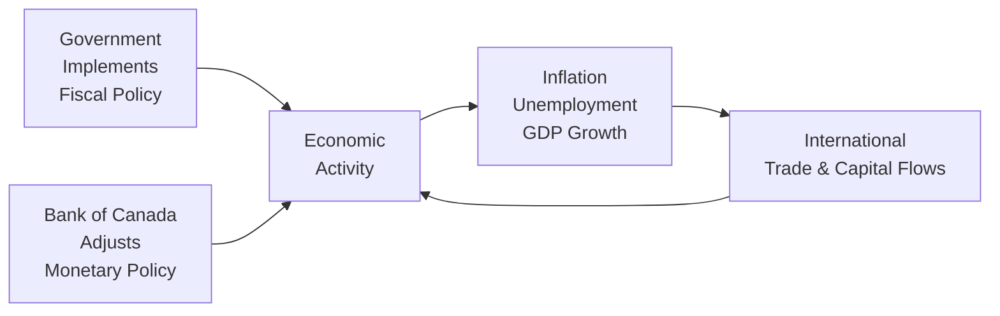

## 3.7 Fiscal and Monetary Policies and International Economics

Imagine sitting in your favorite coffee shop, sipping a latte, and overhearing a conversation about the government lowering taxes to encourage spending. Someone mentions that at the same time the Bank of Canada is raising interest rates to cool off inflation. You might think: “Wait—these two strategies seem to be pulling in opposite directions!” The reality is that both fiscal and monetary policies are powerful levers that shape our economic landscape. In this section, we’ll walk through some core concepts of fiscal and monetary policies, then zoom out to see how international events—exchange rates, trade agreements, global capital flows—can have a huge impact on Canada’s economy and the Canadian securities industry.

It might sound complicated, but let's break everything down into approachable chunks. And, hey, if you ever feel overwhelmed by economic jargon, just imagine you’re discussing the topic with a friend over coffee—keep it relaxed and let’s figure it out step by step.

--------------------------------------------------------------------------------
  
### Overview of Fiscal Policy

Fiscal policy refers to how the government decides on its taxing and spending levels. In Canada, these decisions come down from the federal government via budgets, official statements, and updated fiscal policy announcements from organizations like the Department of Finance Canada (https://www.fin.gc.ca/). Let’s explore the two broad categories:

• Expansionary Fiscal Policy:  
  - This is when the government tries to boost economic activity by increasing public spending and/or reducing taxes. Think about it like stepping on the gas pedal—the government invests in infrastructure, social programs, and other public projects to move money into the economy. On top of that, lower taxes mean Canadians have more disposable income, so they’re more likely to spend.  
  - If your family is remodeling their home and the provincial or federal government has a tax-credit program for energy-efficient renovations, that’s an expansionary fiscal policy in action—it keeps the wheels of commerce turning.

• Contractionary Fiscal Policy:  
  - Consider this the opposite approach: the government cuts spending and/or raises taxes to reduce demand and tame price inflation. This is more like tapping the brakes. If the economy is overheating—too much money chasing too few goods—prices might start rising too fast (inflation).  
  - If a government steps in to reduce its spending or raise taxes, it can slow down demand. This could feel tough for everyday people (nobody likes an extra tax bite), but it may help stabilize prices in the long run.

#### Budget Deficits and Surpluses  
When the government spends more than it receives in tax revenue, it runs a budget deficit; when it collects more than it spends, it runs a surplus. There’s a lot of debate among economists about how large deficits or surpluses should be to maintain economic stability. But generally, a government might run deficits during tough economic times (to stimulate growth) and shift to surplus or balanced budgets in strong economic times.

--------------------------------------------------------------------------------

### Overview of Monetary Policy

Now, let's talk about monetary policy. In Canada, monetary policy is guided by the Bank of Canada (BoC). The BoC aims to preserve the value of the Canadian dollar by keeping inflation low, stable, and predictable. If you’ve ever heard news announcements about interest rates going up or down, that’s the Bank of Canada in action—tweaking the cost of money to influence overall economic activity.

#### Tools of Monetary Policy

• Open-Market Operations:  
  - This is how central banks influence the money supply—by buying or selling government bonds. If the Bank of Canada buys bonds from commercial banks, it injects money into the banking system (an expansionary move), and vice-versa.

• Policy Rate Adjustments (Interest Rate Changes):  
  - The BoC sets the policy interest rate (sometimes referred to as the overnight rate). This rate influences other interest rates, including what you pay on a mortgage or a loan for a car. If the central bank lowers this rate, borrowing becomes cheaper, so consumers and businesses typically spend more, and the economy expands. If it raises the rate, borrowing becomes more expensive, slowing the pace of spending and keeping inflation in check.

These monetary policy tools are powerful. Even minor changes can ripple through housing markets, consumer spending, business investment plans, and, ultimately, the stock market. If this reminds you of a time when you or someone you know rushed to lock in a mortgage rate before it went higher, you’ve personally experienced the influence of monetary policy.

#### A Quick Formula: GDP  
A helpful formula that economists often use to understand and analyze an economy’s output is:

$$
\text{GDP} = C + I + G + (X - M)
$$

• C = Consumer spending  
• I = Business (private) investment  
• G = Government spending (fiscal policy enters here)  
• X - M = Net exports (exports minus imports, which is heavily influenced by international trade factors)

By tinkering with fiscal policy (G) and monetary policy (indirectly affecting C and I), policymakers aim to keep GDP growing at a sustainable rate, without letting inflation or unemployment spiral.

--------------------------------------------------------------------------------

### The Interplay of Fiscal and Monetary Policies

Sometimes fiscal and monetary policies work in harmony (e.g., both stimulating the economy if a deep recession occurs), and sometimes they operate at cross-purposes. For instance, the government may unleash an expansionary fiscal policy to encourage spending just as the Bank of Canada raises interest rates to tackle rising inflation. The combined outcome depends on how strong each measure is and the underlying economic conditions.

From a financial professional’s perspective—especially those registered with the Canadian Investment Regulatory Organization (CIRO)—understanding this interplay is critical. It informs how interest rates might shift, how consumer demand might evolve, and where opportunities or risks may arise for investors. You don’t want to recommend, say, interest-sensitive bonds to a client if all signs suggest an imminent rate hike that would decrease bond prices.

--------------------------------------------------------------------------------

### International Economics

No country is an island—especially not in today’s globalized world. Canada’s economy is tied to global capital flows, exchange rates, and the broader economic activity of major trading partners. So let’s look at a few big elements:

• Exchange Rates:  
  - The exchange rate is simply the price of one currency in terms of another. For Canadians, the exchange rate with the U.S. dollar often grabs headlines because of the sheer volume of trade and cross-border shopping between the two countries.  
  - When the Canadian dollar appreciates (goes up) against other currencies, imports become cheaper while exports become more expensive for foreign buyers. On the other hand, a depreciating Canadian dollar helps Canadian exporters but increases costs for imported goods.

• Trade Policies and Agreements:  
  - Trade policies—like tariffs, quotas, or special taxation on imports—can curb or encourage trade. Trade agreements, such as the Canada-United States-Mexico Agreement (CUSMA), define the terms and conditions under which goods and services flow across borders.  
  - If you think about it from the viewpoint of a small Canadian business reliant on U.S. imports, a favorable trade agreement can slash costs and expand your market. Conversely, new trade barriers might create unexpected hurdles.

• Global Economic Events:  
  - Oil price fluctuations, geopolitical tensions, or changes in main trading partners’ economic outlooks can dramatically affect Canada. For example, a spike in global oil prices may benefit certain parts of Canada’s energy sector, but at the same time, it can hurt consumers who pay more at the pump.  
  - If political shifts in major economies (like the U.S., Europe, or China) lead to changes in trade policy or risk sentiment, you can expect trickle-down effects in exchange rates, capital flows, and stock markets. 

--------------------------------------------------------------------------------

### How it All Comes Together

We’ve talked about a lot of moving parts. Let’s visualize the relationship among fiscal policy, monetary policy, and international factors in a simple flowchart. It won’t cover every twist and turn, but it’ll help you see how these pieces interrelate.

• A → B: Government spending or tax policy directly affects consumer/business spending (and thus economic activity).  
• D → B: The Bank of Canada’s monetary policy actions also feed into overall economic activity.  
• B → E: Together, these factors drive key economic indicators like inflation, unemployment, and GDP growth.  
• E → C: Changes in the domestic economy also affect the balance of trade, currency strength, and so on.  
• C → B: Global capital flows and trade feed back into economic activity, closing the loop.

--------------------------------------------------------------------------------

### Why It Matters for Financial Professionals

You might be wondering: “So how does all this talk of taxation, spending, interest rates, and exchange rates relate to me as a financial professional working under CIRO guidelines?” Well, it matters more than you’d think:

• Suitability and Risk: Knowing when government policy is fueling a particular sector or when monetary tightening might dampen consumer demand is essential for recommending suitable investments. Also, be aware of any changes in the regulatory environment—for instance, a new cross-border trading rule from CIRO that might affect how you serve your clients with international holdings.

• Timing and Market Cycles: Economic policies often create or shape the peaks and troughs of business cycles. If an expansionary policy from the government lines up with an accommodating central bank, that can fuel rapid growth. Investors need to know how to ride that wave without being caught off guard by a sudden policy reversal.

• Ethical and Professional Standards: As a financial professional in Canada, you’re expected to maintain awareness of these macro-level shifts to provide informed advice. Even if you primarily focus on one asset class, ignoring broader economic signals could be risky. The responsibilities outlined in Chapter 1 (Standards of Conduct and Ethics) and Chapter 2 (Ethical Decision Making) remind us that your recommendations should consider your clients’ best interests in light of big-picture economic conditions.

--------------------------------------------------------------------------------

### Real-World Example: Oil Price Shocks

Let’s consider a quick story to see how these concepts play out. Suppose global oil prices spike due to geopolitical tensions. Canada, being a major oil producer, might see the value of its exports soar, strengthening the Canadian dollar. Meanwhile, the government, flush with potential extra revenue, might decide to ramp up infrastructure spending (an expansionary fiscal move), hoping to boost job creation.

But here’s the catch: If inflation also starts rising because of higher commodity prices, the Bank of Canada might decide to increase interest rates to anchor inflation within its target range. Suddenly, even though new government contracts are available for infrastructure, borrowing costs rise, making it more expensive for businesses to finance capital projects. This push-pull dynamic illustrates how fiscal and monetary policies can influence each other and how global events trickle down into domestic financial markets.

--------------------------------------------------------------------------------

### Common Pitfalls and Strategies

• Over-Reliance on a Single Indicator: Some investors fixate on just interest rates or just government spending. In reality, it’s the blend of multiple factors that matters.  
• Ignoring the Global Context: Canada, while resource-rich, is not economic Teflon. Global events often shape local markets. Always keep an ear to global news—trade wars, currency fluctuations, or global recessions can hit home fast.  
• Timing the Market Prematurely: Changing your investment approach right after a flashy news headline can lead to knee-jerk decisions. Always gather sufficient data, develop a rationale, and consider your client’s risk tolerance and time horizon before making quick alterations.

--------------------------------------------------------------------------------

### Best Practices for Practical Application

• Stay Informed: Follow the Department of Finance Canada (https://www.fin.gc.ca/) for government budget updates. Keep your eye on the Bank of Canada’s policy reports (https://www.bankofcanada.ca/core-functions/monetary-policy/).  
• Diversify Portfolios: International economics can shift quickly. A diversified portfolio can weather the storm better than one overly concentrated in any single industry or region.  
• Continuous Learning: The World Trade Organization (https://www.wto.org/) regularly provides updates on trade developments globally. Checking in on these can alert you to opportunities or headwinds for Canadian businesses.  
• Engage in Regulatory Updates: CIRO (https://www.ciro.ca/) guidelines evolve over time and can impact cross-border investing, settlement processes, and reporting requirements for financial professionals.

--------------------------------------------------------------------------------

### Glossary

• **Fiscal Policy:** Government policy on taxation and spending to influence the economy.  
• **Budget Deficit/Surplus:** When government expenditures exceed (deficit) or fall short (surplus) of the revenue collected.  
• **Open-Market Operations:** Central bank activities of buying and selling government securities to influence the money supply.  
• **Exchange Rates:** The price of one currency in terms of another.  
• **Trade Balance:** The value of a country’s exports minus its imports.  
• **Current Account:** A country’s balance of trade, net income from abroad, and net current transfers.  
• **Capital Account:** Records a country’s international transactions in assets, such as foreign direct investment.

--------------------------------------------------------------------------------

### Additional Resources and References

• Department of Finance Canada (https://www.fin.gc.ca/) – For federal budgets, fiscal updates, and policy announcements.  
• Bank of Canada’s publications on Monetary Policy (https://www.bankofcanada.ca/core-functions/monetary-policy/) – For insights into current interest rate decisions and policy rationale.  
• World Trade Organization (https://www.wto.org/) – For global trade policies, agreements, and dispute resolutions.  
• Canadian Investment Regulatory Organization (CIRO) (https://www.ciro.ca/) – For the latest regulatory updates, bulletins, and notices regarding investment rules and cross-border trading mechanisms.

If you’re curious about diving even deeper, you might also find open-source financial toolkits (like R’s “tidyquant” package or free data from sources like the Bank of Canada’s online database) to practice analyzing economic data sets. For example, you can download historical interest rate movements and pair them with government budget data to see how each factor correlates with changes in unemployment or inflation over time.

--------------------------------------------------------------------------------

### Conclusion

At the end of the day, fiscal and monetary policies aren’t just textbook concepts. They’re living forces that shape everyday realities—from the cost of your grocery bill to the interest rate on your mortgage. Canada’s policies are particularly influenced by global events and trade relationships, making international economics a critical puzzle piece. If you take one point away, let it be this: staying abreast of these macroeconomic factors can significantly improve your ability to make well-rounded investment decisions and offer clients intelligent, informed advice. And that, in turn, aligns perfectly with our mission in the Conduct and Practices Handbook Course: to foster professionals who act ethically, responsibly, and knowledgeably in Canada’s financial markets.

May your next coffee-shop eavesdropping session be that much more enlightening.

--------------------------------------------------------------------------------

## Test Your Knowledge: Fiscal and Monetary Policy and International Economics Quiz



### Which of the following best describes expansionary fiscal policy?  
- [ ] Raising taxes and cutting government spending  
- [x] Lowering taxes and increasing government spending  
- [ ] Keeping both taxes and government spending unchanged  
- [ ] Increasing the central bank’s policy rate  

> **Explanation:** Expansionary fiscal policy involves reducing taxes and/or raising government spending to stimulate economic growth, often deployed during recessions.

---

### How do policy rate adjustments by the Bank of Canada usually affect borrowing?  
- [ ] They have no direct effect on personal or business loans.  
- [x] They make borrowing cheaper when rates are lowered and more expensive when rates are raised.  
- [ ] They only affect mortgages, not car loans or credit card rates.  
- [ ] They apply exclusively to government borrowing.  

> **Explanation:** When the Bank of Canada lowers the policy rate, it typically results in lower interest rates on various loans, and vice versa.

---

### A government is faced with rapidly rising inflation. Which policy action is it most likely to take?  
- [x] Decrease infrastructure spending to reduce aggregate demand  
- [ ] Offer rebates to stimulate consumer spending  
- [x] Raise taxes to slow consumption  
- [ ] Lower interest rates to encourage borrowing  

> **Explanation:** To combat inflation, a government may enact contractionary fiscal policies like reducing spending (especially in large projects) or raising taxes. Notice that two answers here (decreasing infrastructure spending and raising taxes) are both correct examples of contractionary approaches.

---

### Which of the following is NOT a typical tool of monetary policy used by the Bank of Canada?  
- [ ] Setting the policy interest rate  
- [ ] Open-market operations  
- [ ] Reserve requirements  
- [x] Government spending on healthcare  

> **Explanation:** Government spending is a fiscal policy tool, not a monetary policy tool.

---

### In the formula GDP = C + I + G + (X - M), which component is directly influenced by a change in government spending?  
- [ ] C  
- [ ] I  
- [x] G  
- [ ] (X - M)  

> **Explanation:** “G” stands for government spending, so any change in government budgets directly alters that component.

---

### If the Bank of Canada engages in open-market operations by buying government securities from commercial banks, what happens to the money supply?  
- [x] It increases  
- [ ] It decreases  
- [ ] It remains unchanged  
- [ ] It moves inversely to interest rates  

> **Explanation:** By purchasing government securities (bonds), the Bank of Canada injects money into the banking system, expanding the money supply.

---

### A stronger Canadian dollar generally leads to which of the following outcomes?  
- [x] Cheaper imports  
- [ ] More expensive imports  
- [x] More expensive exports  
- [ ] Higher inflation automatically  

> **Explanation:** When the Canadian dollar appreciates, imports become cheaper for Canadian buyers, but Canadian exports become more expensive for foreign markets.

---

### Trade agreements such as the Canada-United States-Mexico Agreement (CUSMA) generally aim to:  
- [ ] Increase trade tariffs between member countries.  
- [ ] Block all cross-border transactions.  
- [ ] Peg exchange rates at a fixed level.  
- [x] Reduce trade barriers and facilitate commerce among member countries.  

> **Explanation:** CUSMA (formerly known as NAFTA) aims to reduce trade barriers like tariffs, thereby stimulating economic and trade activities among Canada, the United States, and Mexico.

---

### Which organization would you consult for the latest regulatory updates impacting cross-border trading for Canadian investment dealers?  
- [ ] Retired IIROC  
- [ ] Defunct MFDA  
- [ ] Canada Revenue Agency (CRA)  
- [x] Canadian Investment Regulatory Organization (CIRO)  

> **Explanation:** CIRO is Canada’s new self-regulatory organization overseeing investment dealers and market integrity on equity and debt marketplaces as of 2023. IIROC and MFDA are historical references.

---

### True or False: A country with a large budget deficit must always be following a contractionary fiscal policy.  
- [x] True  
- [ ] False  

> **Explanation:** A large budget deficit typically indicates expansionary or at least not contractionary fiscal policy, as government spending is outstripping its revenue collection.  


