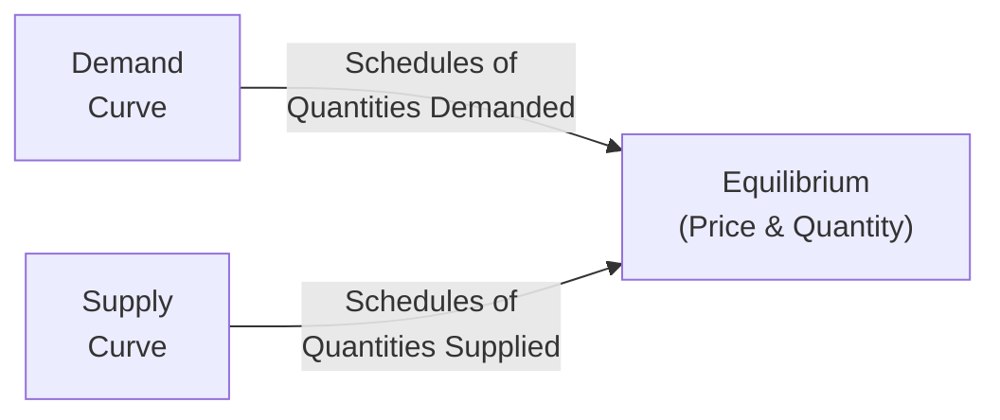

## 3.8 Demand, Supply, and Market Equilibrium (Additional Topic)

Have you ever wondered, say, why sometimes you're super excited to buy a certain product, but the moment its price goes up, you suddenly start second-guessing yourself? That hesitation is basically demand in action. And on the flip side, consider a time I knew a local bakery that ramped up production of croissants when flour prices dipped—so it could offer more pastries at a slightly lower price and still keep decent profit margins. That choice is part of what we call supply. So, let’s walk through these everyday moments to unravel the somewhat magical dance of demand, supply, and market equilibrium. 

Anyway, in the realm of investing—and especially when you’re working as a Registered Representative under the current guidance of the Canadian Investment Regulatory Organization (CIRO)—understanding demand and supply can add real substance to your analysis of how specific industries, commodities, or equities might behave. Even if you’re dealing with mutual funds or advanced derivative products, these fundamental economic concepts keep showing up and can definitely guide your decisions and discussions with clients.

Below, let’s dive into these big ideas in a way that’s approachable, but also thorough. We’ll sprinkle in personal stories, real-world examples, and diagrams to keep you engaged. We’ll also highlight best practices, pitfalls, and resources so you can deepen your confidence in this vital area.

---

### Why Demand and Supply Matter to Financial Professionals

If you're advising clients, especially in the Canadian context, you need to grasp how broad economic shifts—such as a shortage in some commodity or a surge of consumer interest in tech stocks—might influence a portfolio's performance. For instance, when a consumer trend shifts quickly (say, from in-store shopping to online) that can drastically change demand for certain goods and services. Meanwhile, supply constraints—maybe due to a natural disaster affecting raw materials—can push prices higher. So, seeing the big picture in supply and demand is crucial for anticipating possible price moves, balancing portfolios, and staying nimble with investment decisions.

From a regulatory and compliance standpoint, if you’re giving advice under CIRO, it’s also essential to ensure your recommendations are suitable in light of known economic conditions, client risk profiles, and potential supply-demand factors that affect particular sectors or industries. And yes, while the old MFDA or IIROC references are now historical, the fundamentals of economics remain the same, helping you stay on top of market developments.

---

### The Essence of Demand

Demand basically measures how much of something people want (and can afford) to buy at various price points. The demand side is often what we talk about at dinner parties—folks discussing how the price of real estate, groceries, or even gas influences whether they’re ready to buy now or hold off. 

• Price Sensitivity: Generally, if a good’s price goes down, consumers buy more of it (assuming their tastes haven’t changed). If it goes up, they buy less.  
• Consumer Preferences: Trends, brand loyalty, and personal tastes can raise or lower demand even when prices remain the same.  
• Income Levels: If the average income in a community rises, people have more disposable income, and demand might climb across many products—even the fancy ones.  
• Related Goods: Demand for a product can shift because of changes in prices of complementary goods (e.g., if electric cars become cheaper, demand for gas could drop) or substitutes (if oat milk gets cheaper, demand for dairy milk might fall).

In practice, if you’re looking at the housing market, you might analyze data from the Canadian Mortgage and Housing Corporation (CMHC). If consumer incomes rise or interest rates drop, more potential homeowners enter the market, pushing up housing demand—and often the price. That can be relevant for real estate investment decisions, mortgage-backed securities, or REITs (Real Estate Investment Trusts).

---

### The Essence of Supply

Supply is about how many goods or services producers are willing and able to bring to the market at different price levels. This perspective is typically the business side of the story. Think of farmers deciding how many crops to grow, or a smartphone manufacturer deciding how many units to produce in the next quarter.

• Production Costs & Technology: If new technology lowers costs, producers can feasibly supply more at a given price point.  
• Supplier Expectations: If suppliers think prices will rise in the future, they might limit current supply to get a higher price later. Conversely, if they foresee a price drop, they may choose to sell faster.  
• Competition: In a competitive marketplace, more firms can increase total supply, which generally puts downward pressure on prices (all else being equal). 

For an investment rep supporting a client with a focus on commodities (like oil, lumber, or metals), changes in supply—like a major pipeline disruption—could dramatically shift the supply curve. If supply is suddenly constrained, we can see a price spike. Keeping tabs on these developments is critical when offering guidance on commodity-heavy mutual funds or exchange-traded funds (ETFs).

---

### Demand and Supply in One Picture

We often depict demand and supply as lines or curves on a graph. The demand curve typically slopes down (indicating people buy more at lower prices), while the supply curve typically slopes up (as producers are willing to offer more at higher prices).

Below is a simple Mermaid diagram illustrating how the demand curve and supply curve both feed into a common equilibrium point where the market “clears.”

In this illustration:
• D represents the demand curve, which shows how quantity demanded changes with price.  
• S represents the supply curve, which shows how quantity supplied changes with price.  
• E is the equilibrium point, where quantity supplied equals quantity demanded.

---

### Market Equilibrium: The Sweet Spot

So you’ve got these two forces, demand and supply, pulling in opposite directions. Where they intersect is the spot that economists call the equilibrium price (or market-clearing price). There, the quantity that consumers are willing to buy exactly matches the quantity producers are willing to sell.

In real life, markets might not perfectly settle at equilibrium, but they do often gravitate toward it over time as inventories adjust and buyers/sellers respond to price signals.

• Surplus: If the price is set higher than equilibrium, you get more supply than demand. This usually pressures sellers to cut prices or scale back production.  
• Shortage: If the price is set too low, you get more demand than supply, which tends to push prices up until a new balance is found.

In regulated securities markets under CIRO oversight, equilibrium considerations can be seen in how securities’ bid-ask spreads adjust to reflect real-time supply (from sellers) and demand (from buyers). If there’s a high demand for a particular stock and not many people selling, the price can shoot up quickly.

---

### Shifts in Demand or Supply

Probably the coolest (and sometimes the scariest) piece of all this: demand and supply curves can shift, not just move along the same curve. A shift is a bigger structural change—like a brand-new technology or a radical step in government policy.

• Demand Shifts: Suppose consumer tastes pivot toward green energy solutions. Demand for solar panels might surge, shifting the demand curve to the right. At each price point, people now want more. This usually pushes equilibrium price up, unless there’s also a corresponding supply jump.  
• Supply Shifts: If a major new competitor enters an industry or technology suddenly slashes production costs, the supply curve moves, often lowering the equilibrium price. Or, a natural event like a drought can shift supply left, causing prices to go up for agricultural products.  

Let’s say you’re analyzing a precious metals mutual fund. If a geopolitical conflict disrupts a large mining region, supply for certain metals could plummet. And if demand stays steady, prices go up. Understanding these changes is essential for rebalancing portfolios or advising clients about adjusting their investments.

---

### Elasticity: How Response Varies with Price

Elasticity measures how dramatically demand or supply responds to a change in price (or sometimes other factors like income). Some items are highly elastic—meaning a small price change triggers a huge change in quantity demanded or supplied. Others are more inelastic—price can change a lot, and quantity demanded or supplied won’t budge much.

• Price Elasticity of Demand: Typically high for luxury items (when the price of a luxury car shoots up, demand can nosedive) and low for necessities (like insulin).  
• Price Elasticity of Supply: Tends to be high if producers can ramp up output quickly (e.g., clothing manufacturers) and low if production is time-intensive or resource-limited (like precious metals or complex semiconductors).

For financial advisors, elasticity can become quite relevant if you’re analyzing, for example, how changes in oil prices might affect the broader market. Oil is a bit inelastic on the demand side—people still drive, shipping still needs fuel—but large price swings can still have major macroeconomic consequences. Moreover, that might shape the performance of energy-heavy portfolios, so keep elasticity in mind.

---

### Practical Financial Examples

• Commodity Funds: If there’s a sudden supply disruption in copper due to strikes at major mines, you can expect a supply curve shift to the left, raising copper prices. A commodity fund heavily invested in copper could see short-term gains, but also faces risk if labor disputes widen.  
• Real Estate Investments: Demand in a market like Vancouver or Toronto can be affected by rising incomes, stable employment rates, and global interest in Canadian property. Meanwhile, long construction timelines and limited land can constrain supply. The result: persistent upward pressure on prices, at least until policy or economic changes shift the picture.  
• Technology Stocks: Demand for streaming platforms might spike if people’s preference for in-home entertainment soars. But supply of shares can also shift if existing shareholders flood the market with shares, possibly pushing prices down.  

---

### Ties to Regulation and Competition

In Canada, the Competition Bureau (https://www.competitionbureau.gc.ca/) aims to foster healthy market structures, ensuring no single player manipulates supply or corners demand in a way that distorts market equilibrium. The bureau’s guidelines and oversight can prevent anticompetitive practices that artificially limit supply or force up prices. 

If sellers were to collude and restrict output, you’d have a classic supply restriction that bumps prices up unfairly. From a financial perspective, understanding that the Canadian marketplace has these protections in place can help you interpret whether a price shock is due to legitimate supply constraints versus unethical constraints.

---

### Best Practices for Financial Professionals

• Keep Up with Trends: Always watch economic updates—like real estate demand data from CMHC (https://www.cmhc-schl.gc.ca/)—and incorporate them into your investment advice.  
• Evaluate Elasticity: Recognize how responsive certain sectors or products are to price changes. This helps gauge potential risk.  
• Understand Market Forces: When analyzing a security or sector, ask if price movements are signals of a demand or supply shift. This can inform whether the trend is likely short-term or may last longer.  
• Factor in Externalities: Policy changes, environmental factors, and technological breakthroughs can cause major curve shifts. Being prepared can help you guide clients through market turbulence.  
• Leverage Reliable Sources: Standard textbooks like “Microeconomics” by Pindyck and Rubinfeld can give you more detail on these topics. Use open-source financial tools (like certain aggregator websites or government stats) to further track supply-demand metrics.

---

### Common Pitfalls and Challenges

• Overlooking Market Sentiment: While supply and demand are crucial, don’t ignore market sentiment, which can temporarily override fundamentals (like in a speculative bubble).  
• Failing to Adjust for Shifts: Investors might mistake a curve shift (like a permanent change in technology) for a temporary move along the existing curve (like a price fluctuation). This misunderstanding can lead to inaccurate valuations.  
• Assuming Perfect Rationality: Real buyers and sellers can act irrationally—panic selling or euphoric buying can deviate from classical supply-demand logic in the short run.  
• Ignoring Regulatory Changes: Policy shifts—like new tariffs—can abruptly change supply or demand across borders. Staying informed is a must.  

---

### Encouraging Continuous Learning

It might sound cliché, but economics is always moving—like a living, breathing organism. To keep up, you’ll want to:

• Follow reputable news sources (e.g., The Globe and Mail, Financial Post) for daily updates on market disruptions.  
• Monitor official websites like https://www.ciro.ca (since CIRO is the new self-regulatory body) to understand regulatory changes that could influence markets.  
• Dive deeper into standard resources—like the Competition Bureau’s guidelines—to appreciate how the government balances fair competition with open markets.  
• Attend workshops or continuous education sessions on microeconomics to keep your knowledge fresh and relevant.

---

### Case Study: Demand Disruption in Commodities

Let’s do a quick hypothetical. Imagine a major global event that disrupts shipping routes for a key commodity—say wheat—leading to a short-term shortage. A Canadian mutual fund that invests in agricultural businesses might benefit because wheat prices would rise. Farmers get a higher price for their harvest due to consistent demand and limited supply, boosting fund returns for a while.

However, if global shipping eventually normalizes, or alternative suppliers ramp up production, supply rebounds, prices might stabilize or even drop. Investors who assumed that high wheat prices would last forever might be caught off-guard. This story underscores how changes in demand or supply can keep us on our toes and why you, as a financial professional, want to track the underlying causes.

---

### Bringing It All Together

Demand. Supply. Equilibrium. It’s easy to toss these words around in conversation, but they pack a powerful meaning in financial markets—and in everyday life, for that matter. Investors succeed (or fail) partly because of how well they understand these fundamentals and predict shifts in them. This is all the more relevant now that everything from commodity markets to emerging tech sectors can pivot at breakneck speed.

If you keep these fundamentals top of mind—knowing how to spot a permanent shift in demand vs. a short-term fluctuation, how to gauge supply constraints, how to interpret a surplus or shortage, and so on—you’ll be on a firmer footing to advise your clients responsibly. And not to sound like I’m repeating myself, but remember to always consult official resources like the Competition Bureau, CIRO, and CMHC for data and regulatory frameworks that can guide your analysis.

So, next time you’re chatting with a client about why a particular stock’s price is spiking or why the housing market in a region is red-hot, you can pivot to this supply-demand discussion. “Well,” you might say, “let’s see if the demand curve shifted or if the supply curve got a bit constrained!” It’s a small shift in your approach but, wow, it can add so much depth to your client conversations.

---

### Glossary

• Demand Curve: A graph showing the relationship between the price of a good and the quantity demanded.  
• Supply Curve: A graph showing the relationship between the price of a good and the quantity supplied.  
• Equilibrium Price (Market-Clearing Price): The price at which quantity supplied equals quantity demanded.  
• Shortage: A situation where demand exceeds supply at a given price.  
• Surplus: A situation where supply exceeds demand at a given price.  
• Elasticity: A measure of how much demand or supply changes in response to price or other factors.

---

### Additional References

• Competition Bureau (Canada): https://www.competitionbureau.gc.ca/  
• Canadian Mortgage and Housing Corporation (CMHC): https://www.cmhc-schl.gc.ca/  
• CIRO: https://www.ciro.ca/  
• Microeconomics by Pindyck and Rubinfeld (for a deep dive into supply-demand analysis).  

---

## Mastering Demand, Supply, and Market Equilibrium: A Comprehensive Quiz



### Which statement best defines the demand for a product?

- [ ] The amount of a product producers are willing to create at different price points.  
- [x] The amount of a product consumers are willing and able to purchase at various price points.  
- [ ] The total cost of creating a good or service.  
- [ ] The difference between what consumers desire and what they are willing to pay.  

> **Explanation:** Demand measures how much consumers desire and can actually buy at different prices, distinguishing it from supply, which focuses on the producer side.

### What happens in a market when the price is set above the market equilibrium price?

- [ ] The price will remain stable.  
- [ ] There will be a shortage.  
- [x] There will be a surplus.  
- [ ] The government will intervene immediately.  

> **Explanation:** At prices above equilibrium, more goods are supplied than demanded, creating a surplus that typically pushes prices down eventually.

### Which of the following is considered a factor that can shift the demand curve for a product?

- [x] Changes in consumer income  
- [ ] A movement along the current demand curve due to a price change  
- [x] Changing consumer tastes or preferences  
- [ ] A surplus that leads to a strong price drop  

> **Explanation:** Demand curves can shift due to external factors like income and tastes. A mere change in the product’s price leads to movement along the curve rather than a shift of the entire curve.

### In the context of supply and demand, a “shortage” occurs when:

- [ ] Supply exceeds demand at a particular price.  
- [ ] Consumer incomes do not match the desired spending level.  
- [x] Demand exceeds supply at a particular price.  
- [ ] Trade policies artificially inflate prices.  

> **Explanation:** A shortage means there’s not enough supply to meet the demand at the existing price, often resulting in upward price pressure until balance is restored.

### Which of the following could immediately shift the supply curve to the right?

- [x] A technological innovation that lowers production costs  
- [ ] A price increase for the product  
- [x] Entry of new firms offering the same product  
- [ ] Reduced consumer preference for the product  

> **Explanation:** Technological breakthroughs and the entry of new competitors can increase supply at each price point, shifting supply to the right.

### What does elasticity of demand measure in economic terms?

- [x] The sensitivity of the quantity demanded to price changes  
- [ ] The measure of consumer surplus at a given price  
- [ ] The difference between supply and demand  
- [ ] The impact of subsidies on producer gains  

> **Explanation:** Elasticity of demand gauges how the quantity demanded of a product responds to changes in price—or sometimes, changes in income or other factors.

### Which example best describes a scenario that could shift the demand curve for electric vehicles to the right?

- [x] Households earn higher disposable incomes and value eco-friendly options more  
- [ ] Car manufacturers reduce the supply of gasoline-powered cars  
- [x] Governments introduce subsidies for purchasing electric vehicles  
- [ ] Inflation rates remain constant, but interest rates increase  

> **Explanation:** Rising disposable incomes, changing preferences, and supportive policies such as subsidies can increase consumers’ willingness to buy electric vehicles at every price point.

### If a major disruption cuts off supply for a commodity, how does that affect the supply curve?

- [x] It shifts the supply curve to the left  
- [ ] It moves along the existing supply curve  
- [ ] It has no effect unless consumer income changes  
- [ ] It eliminates the demand curve entirely  

> **Explanation:** A supply disruption typically reduces the quantity producers can provide at any price, shifting the entire supply curve to the left.

### What is market equilibrium?

- [x] The point where quantity supplied equals quantity demanded  
- [ ] The government-set price to ensure fair markets  
- [ ] The difference between total revenues and total costs  
- [ ] A state where surpluses and shortages are constant  

> **Explanation:** Market equilibrium is the price/quantity point at which suppliers and consumers are in balance, with no shortage or surplus.

### A surplus generally exerts which type of pressure on price?

- [x] True  
- [ ] False  

> **Explanation:** A surplus puts downward pressure on prices because producers want to sell off excess inventory, so they often lower prices until equilibrium is restored.


