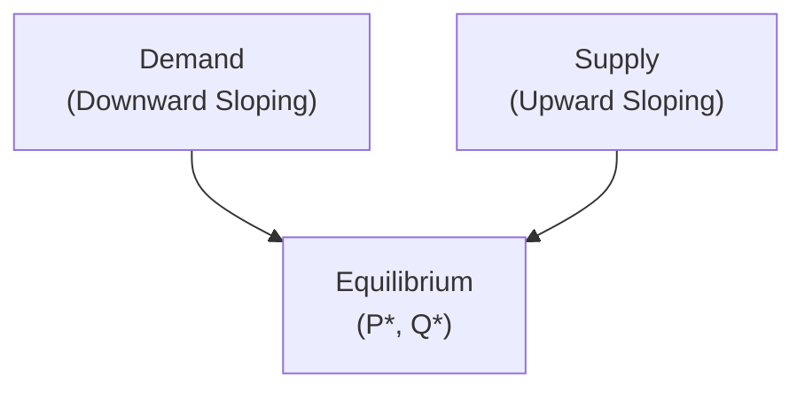
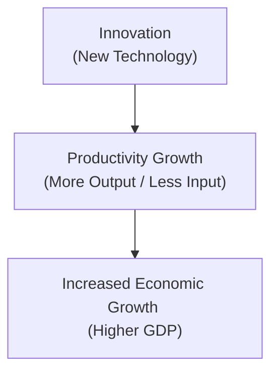

## 3.8 Additional Topics in Economics

Economics is a fascinating (and, let’s be honest, sometimes intimidating) field that influences everything from how much we pay for groceries to whether corporations prosper. If you’ve been following along with our earlier discussions on economic growth, business cycles, and interest rates, you’ve already got a solid foundation. Now let’s take a deeper dive into some additional topics—supply and demand, market structures, productivity and technological change, commodity markets, behavioral economics, and sustainability in economics—and see how these play out in real-world scenarios, including the Canadian marketplace.

This section aims to equip you with practical insights that you can apply when supporting mutual fund clients, modeling financial projections, or simply trying to understand why the price of your favorite coffee beans just went up. And yes, we’ll keep things as clear as possible. Buckle up for an exciting exploration of economic fundamentals!

--------------------------------------------------------------------------------

### Supply and Demand Framework

Most of us might remember the “Supply and Demand” chapter from our first economics class. It’s like the skeleton key for understanding how prices form in a free market. I remember the first time I truly got it... at a local farmers’ market, when tomatoes were more expensive than I’d expected (and, quite frankly, I was a little annoyed). When I asked the vendor why, she explained that a bad season had reduced tomato crops. Less supply, steady or growing demand, and voilà—higher prices.

In the broadest sense:

• Supply is how much of a good or service producers are willing to offer at various prices.  
• Demand is how much of that same good or service consumers want to buy at various prices.

Where these two forces meet is called the equilibrium point, or the price at which the quantity supplied matches the quantity demanded. That’s your typical “price tag” in a market.

Below is a simple visual:

As mutual fund representatives, supply and demand matter because they can affect everything from bond yields to the price of energy stocks. For instance, if global demand for oil surges while supply lags behind, energy-related investments might see price spikes, at least in the short run. Conversely, if a new technology floods the market with alternative energy solutions, supply of oil-like energy sources might become relatively less important, lowering oil prices. These shifts directly impact corporate earnings and can reshape entire sectors of the economy.

#### Real-World Example

Think about the frenzy around gaming consoles during peak holiday seasons. If the manufacturer fails to produce enough consoles (limited supply) but consumer demand is skyrocketing, prices in secondary markets can soar. The same logic applies to commodity markets—if a mining company extracts less metal than expected while global carmakers are rolling out electric vehicles that require that metal (e.g., lithium), the price for lithium might jump, influencing stock prices and performance of related funds.

--------------------------------------------------------------------------------

### Market Structures

When we talk about market structures, we’re essentially classifying how many firms are in a market, how easy it is for new players to enter, and the nature of the products sold. The structure can heavily influence how companies price their goods and how they compete.

Common market structures include:

• Perfect Competition—Many small firms produce identical products, and no single firm can influence the market price. Picture small-scale agricultural products: You’ve got countless farmers selling the same type of crop.  
• Monopolistic Competition—Many firms offer similar products but with slight differences—think restaurants or apparel brands. Firms do have some latitude in setting prices due to brand differentiation (“our shoes have cooler designs”), but competition remains robust.  
• Oligopoly—A few large firms dominate the market, which might include telecom or airline industries in many countries. These firms have substantial market clout, and their pricing or output decisions can significantly influence the market.  
• Monopoly—A single firm supplies the entire market. Because there’s no competition, the monopolist can influence (within reason) prices and output levels. Government regulators often watch monopolies or near-monopolies closely to prevent abuse of market power.

Here’s a simplified flow of how we often view the continuum of market structures:

#### Application for Mutual Fund Representatives

If you’re analyzing a mutual fund that focuses on tech companies, for instance, you might see a few mega-cap tech giants (oligopoly traits) that can potentially set industry standards. Understanding the competitive pressures they face—or don’t face—helps you gauge profit sustainability and future price volatility. Companies operating under perfect competition (say certain commodity producers) may be more vulnerable to shifts in market supply-demand dynamics and less able to pass cost increases on to consumers.

--------------------------------------------------------------------------------

### Productivity and Technological Change

Productivity measures how efficiently goods and services are produced—basically, how much output you get per unit of input. In a world where technology is evolving rapidly, productivity is a huge driver of long-term economic growth. Whether it’s new software that automates data entry or advanced robotics that improve manufacturing, technological innovations typically help businesses produce more with the same (or fewer) resources.

#### Why Does This Matter?

1. Higher Output, Lower Costs: As companies become more efficient, costs can drop, potentially boosting corporate profits.  
2. Wage Growth: If managed properly, higher productivity can translate into higher wages for workers and greater returns for shareholders.  
3. Investment Opportunity: Mutual fund representatives might track firms known for strong R&D investments or strategic technology partnerships, as these businesses may realize the greatest productivity gains—and pass along those gains to shareholders.

Personal anecdote? Well, I once worked with a client who invested early in an automation software firm. Their stock soared as more businesses discovered the software could handle tasks in half the time. That’s productivity payoff right there.

--------------------------------------------------------------------------------

### Commodity Markets

Commodities are the raw materials—things like crude oil, natural gas, gold, wheat, coffee beans—that feed into nearly all other economic activities. Price fluctuations in commodities have a direct and sometimes immediate impact on inflation, exchange rates, and corporate earnings, particularly in an export-driven country like Canada.

• When oil prices rise, energy companies might flourish, but industries like airlines and trucking companies see transportation costs push upward.  
• If precious metal prices jump, mining stocks might surge, but jewelry manufacturers could feel the squeeze.  
• Agricultural commodity prices often affect food inflation and feed into consumer spending trends.

Because commodities are traded globally, supply disruptions in one region (like a geopolitical event in the Middle East) can send ripple effects worldwide. For example, if a major oil-producing nation cuts output unexpectedly, global oil supply shrinks. Prices can climb quickly, which can lead to inflationary pressures—especially relevant for countries with oil-dependent industries or that import large quantities of oil.

#### Tracking Commodities

If you’re in Canada and want to track commodity movements, the Bank of Canada’s Commodity Price Index (BCPI) is a fantastic starting point. It reflects the price of major commodities produced or exported by Canada, such as energy, metals, and agricultural products. By monitoring this index (www.bankofcanada.ca/rates/price-indexes/bcpi), you can glean insights into how Canada’s economy might be affected by global commodity trends.

--------------------------------------------------------------------------------

### Behavioral Economics

Standard economic theory assumes people are perfectly rational. But as you’ve probably noticed—whether in investing or just everyday decision-making—we humans can be, um, less than perfectly rational. Behavioral economics blends psychology and economics, recognizing that biases, emotions, and mental shortcuts often steer our choices more than folks like to admit.

Common biases:

• Overconfidence: Some investors believe they’re smarter than the average market participant, potentially leading to excessive risk-taking.  
• Anchoring: Clinging to an initial piece of information (like the price at which you first bought a stock) even when market conditions have changed.  
• Confirmation Bias: Seeking out information that supports your existing views and dismissing conflicting data.

If you’re advising clients on mutual funds, an awareness of these biases can help you craft more balanced portfolios and engage in more empathetic communication. You might gently remind a client who’s “anchored” to a past investment price that what matters is the potential for future returns, not the historical cost they paid.

#### Want to Learn More?

For deeper insights, Daniel Kahneman’s “Thinking, Fast and Slow” is a seminal work. It explores dual-process theory—how our brain has both a fast, intuitive system and a slow, deliberate one—and how this affects decision-making under uncertainty.

--------------------------------------------------------------------------------

### Sustainability in Economics

An increasingly important area is sustainability—how economic activities intersect with environmental well-being and social outcomes. This trend isn’t just about “feeling good”—it’s also shaping investment flows, policy decisions, and corporate strategies. ESG (Environmental, Social, and Governance) criteria are used to assess how companies perform in areas like ethical labor practices, carbon footprint, and boardroom diversity.

• Environmental: Does the firm engage in climate-friendly operations?  
• Social: Does it treat employees, customers, and the community responsibly?  
• Governance: Does the company’s leadership and board act ethically, transparently, and with accountability?

Sustainability isn’t just a moral stance; it can also be a risk management strategy. Poor ESG performance might subject a company to regulation fines or tarnish its public image, potentially harming shareholder value. As a mutual fund representative, you might see a rising number of ESG-focused funds that cater to clients who want both returns and a positive environmental or social impact.

With Canada being home to abundant natural resources, sustainable resource development has become a hot topic. Firms that balance profitability with environmentally responsible extraction methods may be better positioned for long-term success. For guidelines and industry trends on sustainable investing, the Responsible Investment Association Canada (www.riacanada.ca) offers thorough coverage and resources.

--------------------------------------------------------------------------------

### Regulatory Considerations and References

While economics gives you the frameworks to understand how markets behave, remember that all market participants—companies, financial professionals, and funds—operate under specific regulations and guidelines. For instance:

• CIRO (the Canadian Investment Regulatory Organization, as of June 1, 2023) oversees investment dealers and mutual fund dealers.  
• The Canadian Investor Protection Fund (CIPF) protects client assets if a member firm becomes insolvent.  
• The Bank of Canada (www.bankofcanada.ca) remains central in monetary policy decisions and offers valuable resources like the Commodity Price Index.  

Staying informed about these bodies and their resources can enhance your credibility and ensure that you offer sound, compliant advice.

--------------------------------------------------------------------------------

### Practical Tips for Mutual Fund Representatives

1. Stay Informed: Regularly check macroeconomic data (e.g., GDP growth, unemployment rates), commodity price indexes, and consumer sentiment surveys.  
2. Understand Market Structures: Identify how a company’s competitive landscape might affect its price-setting power, margins, and stability.  
3. Factor in Tech and Productivity: Companies that invest in R&D and technology upgrades can sometimes create an edge for themselves in both good times and bad.  
4. Monitor Commodities: Big commodity price swings can quickly ripple across multiple sectors.  
5. Recognize Behavioral Biases: Your clients might make emotional decisions under pressure—help them see the bigger picture.  
6. Include ESG Considerations: Evaluate whether a company’s sustainability practices could impact its long-term success or risk profile.

--------------------------------------------------------------------------------

### Glossary

• **Supply and Demand:** The economic principle that prices and quantities of goods and services are determined by their availability (supply) relative to the market’s desire (demand).  
• **Market Structure:** The organizational and other characteristics of a market that influence competition and pricing.  
• **Productivity:** The efficiency of production measured as output per unit of input.  
• **Commodity:** A basic good used in commerce that is interchangeable with other goods of the same type (e.g., crude oil, gold, wheat).  
• **ESG (Environmental, Social, Governance):** Criteria that measure a company’s ethical impact, sustainability, and social responsibility.

--------------------------------------------------------------------------------

### Additional Resources

• Bank of Canada’s Commodity Price Index (BCPI): www.bankofcanada.ca/rates/price-indexes/bcpi  
• Responsible Investment Association (RIA) Canada: www.riacanada.ca  
• International Energy Agency (IEA): www.iea.org (data and forecasts on global energy markets)  
• “Principles of Economics,” Gregory Mankiw (classic foundation on supply-demand and market structures)  
• “Thinking, Fast and Slow,” Daniel Kahneman (deep dive into behavioral economics)

--------------------------------------------------------------------------------

The topics we’ve explored—supply and demand, market structures, productivity, commodities, behavioral economics, and sustainability—are not just abstract concepts. They’re living, breathing forces in the real world that drive daily financial headlines, investor sentiment, and corporate strategies. By integrating these insights into your work with mutual fund clients, you’ll be better prepared to interpret market conditions, anticipate price movements, and appreciate the often complex psychology behind investment decisions. This knowledge, paired with the fundamental macroeconomic tools covered earlier in Chapter 3, sets you on a trajectory toward providing truly comprehensive advice. Keep learning, keep questioning, and never forget that economics—while sometimes quirky—is a powerful lens through which we can view and shape the financial landscape.

--------------------------------------------------------------------------------

## Test Your Knowledge: Additional Economic Insights



### 1. Which term best describes the point where supply equals demand in a market?

- [ ] Surplus point
- [ ] Shortage point
- [x] Equilibrium
- [ ] Marginal cost

> **Explanation:** Equilibrium is the point where the quantity supplied matches the quantity demanded, determining the prevailing market price.

### 2. Which market structure is characterized by many firms offering slightly differentiated products?

- [x] Monopolistic competition
- [ ] Perfect competition
- [ ] Oligopoly
- [ ] Monopoly

> **Explanation:** Monopolistic competition occurs when many firms sell products that are similar but not identical, giving them some control over pricing and marketing.

### 3. Technological innovation can increase productivity by:

- [x] Allowing firms to produce more output with fewer inputs
- [x] Lowering operational costs
- [ ] Eliminating the concept of supply and demand
- [ ] Always raising consumer prices

> **Explanation:** Technological change often leads to cost-cutting and greater efficiency. It doesn’t eliminate supply and demand but can shift them in new directions.

### 4. Why might commodity price fluctuations impact the Canadian economy significantly?

- [ ] Commodities have no relevance in Canada
- [x] Canada is a major exporter of commodities, so changes can affect inflation, exchange rates, and corporate earnings
- [ ] Commodity prices only affect service industries
- [ ] Canada has a closed economy with no trade partners

> **Explanation:** Because Canada exports commodities such as oil and minerals, fluctuations in these prices can strongly influence economic performance.

### 5. Behavioral economics primarily studies:

- [x] How psychological biases affect economic and financial decisions
- [x] Why individuals may not always act rationally in markets
- [ ] Only how currency exchange rates are set
- [ ] How governments allocate budgets

> **Explanation:** Behavioral economics integrates psychology and finance to explain why people’s decisions sometimes deviate from standard economic models of rationality.

### 6. Which of the following is an example of an ESG factor?

- [x] A company’s track record on carbon emissions
- [ ] The color scheme of a company’s marketing materials
- [ ] The monthly sales promotions it runs
- [ ] None of the above

> **Explanation:** ESG focuses on Environmental, Social, and Governance criteria, such as climate-related impacts, labor practices, and corporate board composition.

### 7. If a single company dominates an entire market with no close substitutes, it is likely operating as:

- [x] A monopoly
- [ ] An oligopoly
- [ ] Perfect competition
- [ ] Monopolistic competition

> **Explanation:** A monopoly is present when a single supplier controls the market and there are no close substitutes for its product.

### 8. Which behavior best illustrates the anchoring bias?

- [ ] Changing your mind repeatedly based on new data
- [ ] Buying stocks because someone else recommended it
- [ ] Holding on to a particular price (e.g., your purchase price) as a reference even when market conditions change
- [x] Holding on to a particular price (e.g., your purchase price) as a reference even when market conditions change

> **Explanation:** Anchoring bias is the tendency to rely too heavily on the first piece of information (e.g., a purchase price) and not adjust appropriately to new conditions.

### 9. What resource can you consult to monitor commodity trends specifically relevant to Canada?

- [x] Bank of Canada’s Commodity Price Index (BCPI)
- [ ] Canadian Investor Protection Fund (CIPF)
- [ ] CIRO
- [ ] None of the above

> **Explanation:** The Bank of Canada publishes the BCPI, which tracks major Canadian commodities and offers insights into price movements.

### 10. True or False: Sustainability in economics is only about environmental concerns.

- [ ] True
- [x] False

> **Explanation:** Sustainability also encompasses social and governance criteria, reflecting broader responsibilities and ethical considerations in business and investments.


