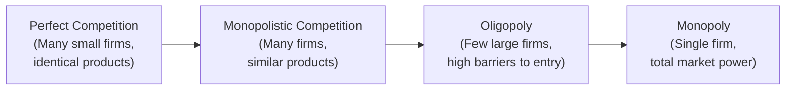

## 3.9 Market Structures (Additional Topic)

Market structures are at the heart of how we understand supply, demand, product pricing, and competition. They might sound academic at first, but these structures help shape corporate strategies, influence how companies set prices, and ultimately determine how much you pay for goods or services—or how profits flow into your investment accounts. This additional topic connects to many areas we’ve already discussed in Chapter 3 regarding the broader Canadian regulatory framework, particularly in how competition laws and self-regulatory policies come into play. Understanding market structures can help you, as a financial advisor or a student of finance, navigate client portfolios with a keener eye on industry dynamics, regulations, and potential risks.

I still remember—some years ago—a local orchard near my childhood home. As a kid, I’d pick apples there with my cousins. The orchard priced its apples almost the same as a dozen other local orchards. As a kid, I never realized I was witnessing a small piece of what we might call “perfect competition.” All these farmers sold near-identical apples in a local market where no single orchard could dictate prices. They just took whatever the going rate was, with maybe a small premium for the orchard that offered the best orchard-cats to play with while we picked apples (key differentiator, right?). It’s that ordinary experience that can help us illustrate how different market structures truly work. 

Below, we’ll explore the characteristics of four common market structures:

• Perfect Competition  
• Monopolistic Competition  
• Oligopoly  
• Monopoly  

We’ll also discuss how these structures can affect investment strategies, referencing both Canadian regulations (like the Competition Act) and broader financial frameworks. For cross-reference, you might see connections to the discussion of regulatory players (in Section 3.2), CIRO responsibilities (Section 3.3), and how market structures might influence corporate disclosure or investor protection (Section 3.4 and 3.5).

---

### Why Market Structures Matter for Financial Professionals

Understanding how firms set prices, the degree of competition, and how easy—or difficult—it is for new competitors to enter a market helps financial professionals assess industry risks and growth prospects. For example, if you’re looking at a mutual fund that invests heavily in Canadian telecommunications, you might quickly note that sector is closer to an oligopoly structure. That means fewer suppliers, higher barriers to entry, and potentially more market power for the existing players. This could signal higher or more stable profit margins for those firms, but it can also attract regulatory scrutiny if consumer prices become uncompetitive.

From a big-picture perspective:

• Market structures shape corporate earnings.   
• They influence company valuation and stock performance.  
• They guide how firms respond to consumer demand changes, new technologies, or regulatory pressures.  
• They can be a deciding factor for portfolio managers who prefer stable but slower-growth businesses (like regulated monopolies) versus riskier but potentially more innovative players (like a firm in a monopolistic competition sector).  

---

### Key Definitions

Before we dive into each form of market structure, let’s clarify a few terms you’ll see throughout this section:

• **Market Structure:** The interconnected characteristics of a market, including the number of firms, product uniformity, level of competition, and barriers to entry.  
• **Barriers to Entry:** Obstacles that make it difficult for newcomers to enter a market (e.g., high capital requirements, patent protections, licensing, brand loyalty).  
• **Pricing Power:** The ability of a firm to influence or set the price for its products or services (rather than just accepting the market-determined price).  
• **Collusion:** An illegal arrangement where firms cooperate—often secretly—to impact prices or output levels, typically at the expense of consumer welfare.  
• **Antitrust Laws:** Regulations designed to protect the process of competition for the benefit of consumers, by ensuring that there are strong incentives for businesses to operate efficiently, keep prices down, and keep quality up.  

In Canada, we have the **Competition Act**, administered by the Competition Bureau, to monitor and address monopolistic or anti-competitive behavior. Although the Act is quite broad, it helps maintain a fair marketplace across various market structures. These rules directly connect with broader concerns about insider trading, fair disclosure, and other compliance issues we examine in this book.

---

### Perfect Competition

Let’s start with the most idealized form: **perfect competition**. 

• **Characteristics**  
  - Very large numbers of buyers and sellers.  
  - Products that are identical or near-identical across different suppliers.  
  - No single participant can influence the market price.  
  - Minimal or no barriers to entry and exit.  

In reality, very few real-world markets fully align with perfect competition. Agriculture is often cited as a close example because no single farmer can usually set the global price for wheat or corn. They’re more or less at the mercy of market forces. Because of minimal barriers to entry, if wheat prices go up, new entrants (additional farmers) quickly appear, which increases supply and brings prices down again.

In a perfect competition scenario, we typically see:

• Little to no long-term economic profit for businesses (beyond normal profit) because any profit opportunity gets competed away.  
• The lowest possible consumer prices consistent with producers covering their costs.  
• Firms focusing on being as efficient as possible to stay profitable.  

As an advisor or investor, if you see a market that’s hyper-competitive and open to swift new entrants, you might note these businesses rarely earn excess profits for extended periods. That can impact the valuations of such firms in a portfolio—they might generate stable but relatively modest returns.

---

### Monopolistic Competition

Monopolistic competition is the next rung on the ladder. Think of it like perfect competition but with a twist: each producer sells something that’s slightly unique. 

• **Characteristics**  
  - Many firms, but each firm offers a product with subtle differences (branding, quality, style).  
  - Firms have limited ability to set prices because they can differentiate their product.  
  - Barriers to entry are fairly low, though branding and marketing can create some short-term edges.  

Restaurants in a big city might be a good example. Sure, they all serve what we could broadly call “food,” but each place has its specific style, ambiance, or signature dishes. One might offer the best vegan tacos in town, another could be known for a gourmet twist on mac-and-cheese. That differentiation gives them a bit of pricing power—especially if they have amazing reviews or a loyal customer base. But there are still many competing eateries, so if a restaurant overcharges, hungry folks can easily go elsewhere.

For investors, some companies in such markets might be able to maintain slightly higher profit margins through strong branding or unique product offerings—for instance, a well-known coffee chain that’s recognized globally. However, because competition is still fierce, these margins can be eroded over time unless the firm continuously innovates or markets effectively.

---

### Oligopoly

Moving up the scale, we find **oligopolies**, where a few large firms dominate the market. 

• **Characteristics**  
  - Market controlled by a handful of major players.  
  - High barriers to entry (large capital requirements, technology complexities, strong brand identities).  
  - Products may be differentiated (like automotive brands) or relatively homogeneous (like some steel factories).  
  - These firms typically have significant pricing power.  
  - Collusion risks can emerge if the major players coordinate to set higher prices or control output.  

Real-life examples include the Canadian telecommunications industry, certain segments of the airline industry, major retail banking, and even the athletic footwear market worldwide. In these sectors, new entrants can’t just “show up” with a small facility or two. The complexities, required investments, or regulatory hurdles are big. So the existing players often have elevated profit margins and stronger control over pricing.

From an investor standpoint, shares in oligopolistic companies can be attractive. They often pay stable dividends because they can maintain stronger margins, and they face fewer serious new competitors. However, these industries can be subject to government scrutiny. If an oligopolistic firm pushes prices too high or engages in unfair practices, the Competition Bureau in Canada could investigate for anti-competitive behavior, or legislatures might consider new regulations.

---

### Monopoly

At the far end of the spectrum is a **monopoly**: a market with a single firm controlling the entire supply of a product or service.

• **Characteristics**  
  - One firm dominating the whole market—no effective competition.  
  - Very high barriers to entry, usually insurmountable for would-be competitors.  
  - The single firm can set the price, though it might face political or consumer pushback if prices become exorbitant.  
  - Monopolies are often regulated to protect consumers from exploitative pricing.  

Utilities are classic examples in many regions: electricity, water supply, sometimes certain forms of public transit. They’re natural monopolies because it’s typically most cost-effective to have a single set of power lines or water pipes. However, these firms usually operate under strict regulations (like maximum allowable rates) to prevent them from charging whatever they want.

Some decades ago, local telephone service in many countries was a regulated monopoly. Over time, technology and deregulation changed the telecommunications landscape, often shifting from monopoly to oligopoly as new providers emerged. 

**Investor Perspective:**  
Monopoly businesses under regulation can provide consistent, albeit capped, returns. But unregulated monopolies can yield very high profits—and equally high regulatory or legal risk if the monopolistic behavior is viewed as harmful. When investing in or advising on such businesses, keep an eye on policy changes, because governments often remain watchful about consumer protection and fair-priced services.

---

### Visualizing the Four Market Structures

To illustrate how these market structures align on a continuum from many small players to a single player, here’s a simplified Mermaid diagram:

• Perfect competition occupies the far left, where individual firms have no pricing power.  
• Monopolistic competition shifts slightly right, where differentiation exists but competition remains robust.  
• Oligopoly moves further right. Now only a few dominant players exist, with higher barriers preventing easy entry.  
• Monopoly stands all the way at the far right, representing a single provider controlling virtually the entire market.

---

### Impact on Investment Strategies

#### 1. Profit Margins and Earnings Stability
• **Perfect Competition:** Firms compete heavily on price, limiting profit potential. Investors often find these stocks less attractive unless the firms have unique cost advantages or benefit from scale in other ways.  
• **Monopolistic Competition:** There’s a moderate potential for profit if a company can successfully differentiate. Many consumer-facing businesses you see in mutual funds exist in this zone.  
• **Oligopoly:** Profit margins can be higher, with stable returns from established market leaders. Some Canadian banks and telecom companies are prime examples.  
• **Monopoly:** High stability but also regulatory oversight. Investors may see regulated monopolies (like certain utilities) as defensive plays due to reliable dividend streams.

#### 2. Regulatory Landscape
• In Canada, the **Competition Act** aims to deter anti-competitive practices like collusion and price-fixing. A highly concentrated market may invite scrutiny if there’s suspicion of unfair pricing or consumer harm.  
• **Innovation, Science and Economic Development (ISED) Canada** provides broader guidelines on business development and market competitiveness.  
• In the capital markets context, **CIRO (Canadian Investment Regulatory Organization)** oversees member firms (previously under IIROC or MFDA) to maintain fair practices, though its direct purview is more about market integrity and investment dealer conduct than retail product pricing.  
• The **Canadian Investor Protection Fund (CIPF)** ensures client asset protection if a CIRO member dealer becomes insolvent. This is another regulatory piece that, while not directly tackling market structures, ensures stability across Canada’s financial landscape.

#### 3. Barriers to Entry and Competitive Moats
Companies that enjoy strong “moats” (unique advantages that fend off competition) often trade at higher valuations. Such moats might be brand reputation, patents, or economies of scale. In an oligopolistic market, these moats are reinforced by high entry costs. As an advisor, when you spot a firm with a robust moat, that’s often an attractive long-term investment—though it also comes with the potential risk of regulatory pushback if the moat is too dominant.

#### 4. Product Differentiation
Especially in monopolistic competition, an ongoing effort to keep products unique can fuel marketing expenses, R&D budgets, etc. This can affect earnings in the short run but might lead to brand loyalty and higher long-term profitability. Investors in consumer discretionary companies, for instance, watch product cycles, advertising strategies, and how businesses keep their brands relevant.

---

### Real-World Case Studies

#### Canadian Telecom (Oligopoly Dynamics)
Canada’s telecom market is often considered an oligopoly, with a few major carriers offering wireless and internet services. New entrants face challenges—huge network infrastructure costs, regulatory hurdles, and strong brand loyalty. For portfolio managers, these telecom giants can provide relatively stable dividends. However, consumer advocacy groups and regulators frequently call for measures to increase competition and lower consumer prices, illustrating the ever-present tension between profit and consumer protection.

#### Local Utilities (Regulated Monopoly)
Electricity generation and distribution in some regions of Canada function as local monopolies. The utility’s rates are set or capped by provincial regulatory agencies. Investors who hold these utility stocks might enjoy stable returns with lower volatility, but the upside for massive returns is generally limited by regulation. When these utility companies seek rate increases to cover capital expenditures (like updating power lines or building new infrastructure), they must pass through a regulatory approval process. 

#### Tech Startups (Potential Move from Perfect to Monopolistic Competition)
A new technology niche often starts with numerous small players (something approaching perfect competition), but over time, one or two might break out as brand leaders, forging a path toward monopolistic or oligopolistic positions (think of search engine giants or social media platforms globally). This transition can create significant investment upside as a company’s market share and pricing power grow, but it may also attract the watchful eye of regulators if the firm becomes too dominant.

---

### Canadian Regulations and Oversight

Although market structures naturally evolve, the Canadian government has frameworks to ensure fair competition:

• **Competition Act** (enforced by the Competition Bureau)  
  - Prohibits cartel agreements and price-fixing.  
  - Investigates mergers that could lead to excessive market concentration.  
  - Has the authority to impose fines or require divestitures.  

• **ISED Canada**  
  - Promotes innovation, economic growth, and fosters a competitive Canadian marketplace.  
  - May fund or support smaller businesses to encourage competition.  

• **CIRO**  
  - Oversees investment dealers and mutual fund dealers to ensure integrity and protect investors, though it doesn’t set product prices in the broader economy.  
  - Provides certain frameworks around best execution, fairness in trading, and the transparency of markets.  

---

### Practical Tools and Resources

• **Competition Bureau:**  
  - Official site offers guides on what constitutes unfair or anti-competitive practices.  

• **ISED Canada (https://ised-isde.canada.ca/):**  
  - Houses data and reports on market competitiveness, business innovation, and more.  

• **Open-Source Financial Tools:**  
  - Some open data sets are available for analyzing industry concentration, like share of market data. Tools such as R, Python, or specialized libraries can help parse these data sets to determine the Herfindahl-Hirschman Index (HHI), a measure of market concentration.  

• **Company Filings and Earnings Reports:**  
  - In sectors suspected to be oligopolies or near-monopolies, companies typically mention regulatory pressures or competition concerns in their annual reports. Reviewing these can give you insight into potential risks or changes in market structure.  

---

### Glossary Review

• **Market Structure:** How a market is organized, including the number of firms and the nature of competition.  
• **Barriers to Entry:** Factors that make starting up costly or complex, limiting new entrants.  
• **Pricing Power:** The firm’s ability to influence price. More powerful in concentrated markets (oligopolies or monopolies).  
• **Collusion:** Illegal cooperation among competitors to manipulate market outcomes (like price or supply).  
• **Antitrust Laws:** Laws like Canada’s Competition Act that promote or maintain market competition by regulating anti-competitive behavior.  

---

### Putting It All Together

Market structures profoundly shape how companies operate and how their stocks perform. Perfect competition leaves little room for above-average profits, while monopolistic competition allows companies to stand out through branding. Oligopolies centralize power in the hands of a few, and monopolies centralize it even further, though often under government regulation.

For financial professionals, keeping an eye on the market structure is essential. It can guide everything from security selection (which might prefer stable oligopolistic companies) to risk assessment (noting the possibility of regulatory crackdowns on monopolistic behaviors). Combined with the knowledge of Canadian competition laws and the role of agencies like CIRO, you’ll be able to help clients navigate potential investments more effectively. Instead of seeing regulations as barriers to returns, you’ll recognize them as part of the framework that keeps markets fair, transparent, and ultimately beneficial for both investors and the broader public.

One of the best ways to continue learning is to follow real-world examples. Watch how major mergers play out in sectors dominated by a few key players. Check how regulators respond when a single company begins to dominate a market. By doing so, you’ll see the ongoing dance between companies, consumers, and regulators—a dance that’s shaped, at every step, by the underlying market structure.

---

## Quiz: Market Structures and Canadian Regulatory Environment



### Which of the following best describes perfect competition?

- [x] Many small firms selling identical products with no individual pricing power.
- [ ] A single firm dominating the market and setting prices.
- [ ] A handful of firms dominating with significant barriers to entry.
- [ ] Many firms offering similar but differentiated products.

> **Explanation:** In a perfect competition scenario, no single firm has significant influence over price, and the products are nearly identical, with numerous sellers sharing the market.

### Which statement accurately describes a monopolistic competitor?

- [ ] It sets the industry-wide price for the product.
- [x] It has limited pricing power due to slight product differentiation.
- [ ] It is entirely barred from altering its prices.
- [ ] It typically requires government regulation to control its market power.

> **Explanation:** Monopolistic competition has many firms, each offering a slightly unique product, creating some minor pricing flexibility.

### Which of the following is an example of an oligopoly in Canada?

- [ ] A local family-run bakery next to 10 similar bakeries on the same street.
- [x] Leading telecommunications providers dominating the market.
- [ ] A municipal water utility servicing one specific region.
- [ ] A grocery store chain that carries multiple brands of cereal.

> **Explanation:** Canada’s telecom industry exhibits oligopolistic characteristics, as a few large firms control most of the market.

### Monopolies often exist in industries that are:

- [x] Natural monopolies (like utilities) or require huge initial investment and infrastructure.
- [ ] Lacking any barriers to entry.
- [ ] Highly fragmented.
- [ ] Dominated by product similarity and no firm differentiation.

> **Explanation:** Monopolies typically arise when the cost of establishing multiple providers is prohibitively high, making a single provider the most efficient solution, or when artificial/legal barriers exist.

### Which Canadian law helps regulate and address anti-competitive behavior in markets?

- [x] The Competition Act
- [ ] The Canadian Charter of Rights and Freedoms
- [x] Provincial Securities Acts only
- [ ] The Bank Act

> **Explanation:** The Competition Act, administered by the Competition Bureau, aims to prevent anti-competitive practices such as price-fixing and collusion.

### When an oligopolistic industry coordinates to fix prices, this practice is known as:

- [x] Collusion
- [ ] Diversification
- [ ] Price elasticity
- [ ] Competitive marketing

> **Explanation:** Collusion is an illegal agreement among firms to limit competition and manipulate prices or output, which violates antitrust laws.

### Which of the following best captures the concept of "barriers to entry"?

- [x] Factors making it difficult for new businesses to enter a market (e.g., licensing costs, patents).
- [ ] A requirement that all firms must set the same price.
- [x] The government’s policy that any firm must get approval to exit a market.
- [ ] The inability of firms to differentiate their products.

> **Explanation:** Barriers to entry are obstacles that keep potential competitors from entering easily—like high startup costs or regulatory hurdles.

### Which is the primary difference between monopolistic competition and oligopoly?

- [x] The number of major competitors and degree of product differentiation.
- [ ] Excessive reliance on government subsidies.
- [ ] The existence of identical products across firms.
- [ ] Lack of any brand loyalty in both structures.

> **Explanation:** Monopolistic competition typically has many firms offering differentiated products, while an oligopoly has fewer firms with more pronounced barriers to entry.

### How does Canada’s Competition Bureau typically respond to suspected collusion?

- [x] It investigates, and if proven, can impose penalties or require changes.
- [ ] It promotes further collusion to stabilize prices.
- [ ] It merges the colluding companies into one mega-corporation.
- [ ] It has no authority over such matters.

> **Explanation:** The Bureau can conduct investigations and enforce penalties or corrective measures, ensuring fair competition.

### True or False: In a monopoly, the single firm typically sets prices with no consideration of government oversight.

- [x] True
- [ ] False

> **Explanation:** While a pure economic monopoly can set prices independently, in reality, governments often regulate monopolies (especially natural monopolies) to protect consumers, but the firm still essentially acts as the only seller.


