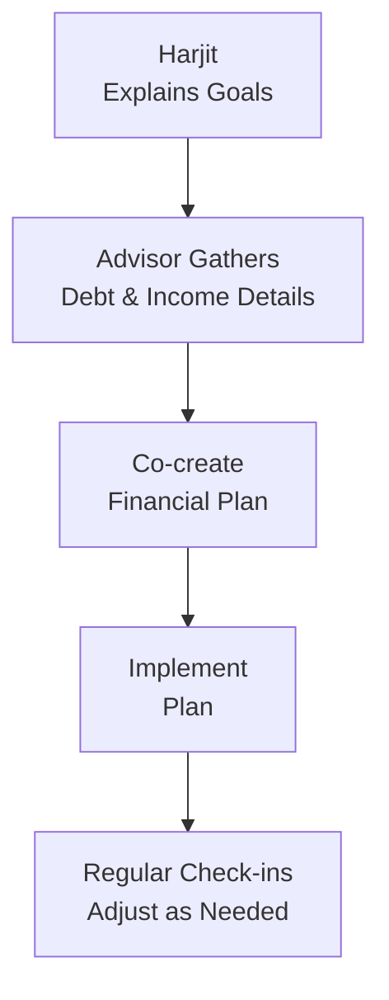

## 4.1 Why are Client Communication and Planning Important?

So, you know that feeling when you’re sitting down with a friend or family member and they open up about their big dreams—maybe owning a home, launching a business, or planning for a comfy retirement? Chances are, you give them your full attention and genuinely try to understand what they need before offering any suggestions. That’s pretty much the approach financial professionals should take with their own clients—except with a bit more structure, a few more rules, and the Canadian Securities Administrators (CSA) looking over their shoulder from time to time.

In this section, we'll talk about why good communication is at the heart of serving your clients effectively and how planning is the roadmap that brings their financial ambitions—short-term, mid-term, and long-term—to life. We’ll also get into the regulatory requirements (courtesy of our friends at CIRO and the CSA) that make sure client interests remain front and center. Let’s dive in.

## The Foundation: Building Rapport and Trust

Trust is everything—like the sturdy foundation of a house. Without trust, the best-crafted financial plan will likely crumble. I remember early in my career, I once had a client who was so nervous about discussing their spending habits that we tiptoed around the topic for weeks. It turns out they were worried about being judged. By leading with empathy—asking open-ended questions and truly listening—I was able to help them break down their insecurities. Eventually we created a spending plan they felt good about. 

When clients trust you, they’re more willing to share the nitty-gritty details of their financial life: hidden debts, sporadic freelance income, investment anxieties, and even glimpses of personal aspirations that have direct implications on how they invest. This level of honesty is invaluable because it informs your recommendations and helps you tailor advice that genuinely fits their situation.

## Active Listening and Open-Ended Conversations

It’s not enough to just say, “How much do you want to invest and for how long?” That’s like a doctor asking, “Where does it hurt?” but never really examining the patient. Instead, you want to ask open-ended questions that encourage your clients to share stories and personal feelings. Examples might be:

• “What dream or goal matters most to you right now?”  
• “Can you describe a time when you felt financially secure or, perhaps, insecure?”  
• “If you could change one thing about your financial situation tomorrow, what would it be?”  

These questions often reveal your client’s unspoken values, anxieties, or motivations, which might not surface if you rely on yes–no checklists alone. Good communication isn’t just about talking; it’s about learning through listening.

## The Role of Communication in KYC and Suitability

Canada’s regulatory environment puts a big spotlight on “Know Your Client” (KYC). This requirement has existed for a while, but it’s become even more crucial with the introduction of Client Focused Reforms (CFRs). Essentially, regulators want to ensure that every recommendation you make aligns with a client’s objectives, risk tolerance, financial circumstances, and personal situation.

According to the Canadian Investment Regulatory Organization (CIRO)—which, by the way, supervises all investment dealers and mutual fund dealers nationwide—you must keep detailed records of your ongoing communication, including updates on client circumstances, changes in financial situation, and any significant life events. If you do this well and maintain transparent communication, you’ll have a record that proves your recommendations were suitable.

### Quick Glossary Check

- **KYC (Know Your Client):** A foundational process that helps financial advisors gather details about a client’s financial goals, risk tolerance, net worth, investment experience, and more.  
- **CSA (Canadian Securities Administrators):** Collective body of Canada’s provincial and territorial securities regulators. They aim to coordinate policy and regulation across the country.  
- **CIRO (Canadian Investment Regulatory Organization):** The national self-regulatory organization responsible for overseeing all registered investment dealers and mutual fund dealers across Canada.  
- **Client Focused Reforms (CFRs):** Regulatory changes introduced to ensure advisors act in the client’s best interests at all times, from product recommendations to conflict disclosures.  
- **Suitability:** The regulatory and ethical obligation to recommend investments aligned with a client’s personal and financial profile—including risk appetite, objectives, and constraints.  
- **Rapport:** A close relationship characterized by mutual trust and emotional affinity—essential for effective advisor-client interactions.

## Why Planning Is So Essential

When you think about financial planning, imagine an architect’s blueprint. You wouldn’t build a house by just throwing bricks together; you’d have a carefully designed layout that accounts for weight distribution, wiring, plumbing, and so on. Similarly, a comprehensive financial plan pulls together your client’s goals—whether that’s saving for a comfortable retirement, buying a car, or putting a child through college—and builds strategies around them.

### Short-Term, Mid-Term, and Long-Term Goals

It’s tempting to focus exclusively on lofty, long-term goals like retirement. However, ignoring short-term or medium-term goals can leave clients feeling stretched thin or unprepared for milestones along the way. This is how you might break it down:

- **Short-Term (0–2 years):** Emergency funds, upcoming tuition fees, or a vacation fund. These might require more liquid, conservative investments.  
- **Mid-Term (2–5 years):** Savings for a down payment on a home, business expansion, or major renovations. Often involves balanced investments—aiming for moderate growth without taking on too much risk.  
- **Long-Term (5+ years):** Retirement, legacy planning, or major philanthropic goals. Could incorporate higher-risk/higher-return investments, given the extended timeline to ride out market cycles.

Communicating this clear timeline to clients helps them see how each goal fits into the bigger picture. It’s a bit like stepping back and realizing each chapter of your life has its own needs and priorities.

## Crafting the Plan Through Collaboration

A financial plan shouldn’t be handed down like a rigid prescription. Instead, it’s a collaboration. I used to say, “Hey, I’ll do the heavy lifting on the research, but I need you to keep me updated on your changing goals or job situation.” Clients are often relieved to hear that it’s not all on them, and they appreciate the reassurance that their role is simply to be open and honest as life evolves.

This two-way dialogue fosters a sense of shared responsibility. It also underscores the idea that planning is an ongoing activity, not a one-off event. Life changes—jobs are lost, babies are born, markets fluctuate—and the plan must adapt in lockstep.

## Regulatory Expectations: Keeping Plans in Check

Under the Canadian Securities Administrators (CSA) framework, and more specifically under the watchful eye of CIRO, advisors are expected to:

• Document each client’s situation thoroughly, maintaining up-to-date KYC forms.  
• Ensure ongoing suitability reviews, especially when a client’s personal circumstances change (e.g., marriage, divorce, inheritance).  
• Provide continuous disclosure about fees, potential conflicts of interest, and any significant product risks.  

It might sound a bit tedious, but robust communication and planning processes actually protect everyone involved. You protect your practice by demonstrating you’ve done your due diligence. Your client is protected by having a strategy that’s aligned with their best interests.

## Ongoing Conversations and Plan Adjustments

Financial planning doesn’t end once the paper is signed (or the e-doc is digitally sealed). Markets can be volatile, and even the best initial plan may need a little course correction. Let’s say your client’s circumstances shift—they decide to switch careers, or they inherit a property. Suddenly, the strategic assumptions about their income or net worth might need tweaking. That’s where regular check-ins come in.

### Handling Changing Circumstances

Imagine a scenario: your client, Alex, initially set a 10-year horizon for retirement savings. Six months later, Alex inherits a considerable sum from a relative. Now, the risk appetite might expand because the base of assets is larger. Or Alex might want to retire sooner (lucky them!). The plan you designed half a year ago will likely need modifications—perhaps increasing contributions to certain investments or shifting part of the portfolio to more aggressive growth funds to accelerate wealth building. 

You’ll want to update the KYC documents, reevaluate the suitability of the current portfolio, and make sure everything aligns with Alex’s adjusted goals. Good communication ensures these changes happen smoothly, without confusion or conflicts.

## Emphasizing the Client’s Best Interest

The whole essence of the Client Focused Reforms (CFRs) is that the client’s best interest should guide every step. That includes:

• Transparent communication about fees, charges, and commissions.  
• Regular updates on portfolio performance and changes in market conditions.  
• Alerting clients to potential conflicts of interest (e.g., if you receive compensation for recommending certain products).  
• Providing clear, jargon-free explanations so clients can make informed decisions.  

When you consistently focus on what’s best for your client, trust forms naturally. And ironically, it also helps you stand out as a professional who truly cares—something that fosters business growth through referrals and long-term loyalty.

## Potential Pitfalls and How to Avoid Them

Even if you’re well-intentioned, a few communication pitfalls can derail your efforts:

• **Overly Technical Explanations:** Bombarding clients with complex charts and financial lingo can cause confusion. Instead, simplify, use analogies, and confirm understanding through feedback.  
• **Biased Recommendations:** If you recommend certain funds or products simply because they offer higher commissions, you’ll erode trust. Always show the client comparisons and emphasize transparency.  
• **Infrequent Check-Ins:** Leaving clients alone until the next big market meltdown is risky. Regular contact fosters a sense of security and ensures you catch life events as they happen.  
• **Inadequate Documentation:** Regulators can quickly raise red flags if you cannot demonstrate how you arrived at a recommendation. Keep thorough, organized records.  

## Case Study: Harjit’s Early Retirement Dream

Let’s play out a fictional scenario. Harjit, a 42-year-old IT specialist, wants to retire by age 55. After some discussion, it’s clear Harjit feels anxious about not having enough saved. With open communication, Harjit discloses a substantial amount of consumer debt—a detail that might not have come up had the conversation stayed only surface-level.

Through careful planning, you restructure Harjit’s monthly budget. Some funds go to debt repayment, some to an emergency fund, and the rest into diversified investments. Over time, as Harjit’s debt shrinks, more can flow into the retirement portfolio. And because you’re in frequent communication, each raise or bonus Harjit gets at work is partially funneled toward retirement savings, keeping that early retirement plan on track.

Here’s how the conversation might visually unfold in a simplified mermaid diagram:

• A: Harjit expresses the desire to retire early and shares anxieties.  
• B: You carefully collect data on debts, income, and monthly expenses.  
• C: You collaborate to create a strategy focusing on debt reduction and retirement savings.  
• D: You implement the plan—allocating resources appropriately.  
• E: You schedule regular follow-ups, adjusting contributions as Harjit’s income or lifestyle changes.

## Tools and Resources

If you’re looking for ways to make client communication and planning more effective, Canada has a bunch of excellent resources:

• **CSA Official Website:** [https://www.securities-administrators.ca/](https://www.securities-administrators.ca/)  
• **CIRO Website:** [https://www.ciro.ca/](https://www.ciro.ca/) (check out their sections on KYC and registration essentials)  
• **Ontario Securities Commission Investor Resources (GetSmarterAboutMoney):** [https://www.getsmarteraboutmoney.ca/](https://www.getsmarteraboutmoney.ca/)  
• **Open-Source Budgeting Tools:** The FCAC Budget Planner, provided by the Financial Consumer Agency of Canada, at [https://itools-ioutils.fcac-acfc.gc.ca/BP-PB/budget-planner](https://itools-ioutils.fcac-acfc.gc.ca/BP-PB/budget-planner)  
• **Book Recommendation: “The Wealthy Barber” by David Chilton**—A classic Canadian read that offers practical tips on building and maintaining good money habits.

These resources come in handy whether you’re brand new to the profession or an experienced advisor wanting to refine your approach.

## Best Practices for Client Communication and Planning

• **Stay Curious:** Even if a client comes in with a specific request, dig deeper to find underlying goals and concerns.  
• **Use Visual Aids:** Pie charts or simple diagrams can make a world of difference.  
• **Document Everything:** After each meeting, summarize key takeaways in an email that your client can review. Not only does this give them clarity, but it also creates a paper trail for regulators.  
• **Follow Up About Life Events:** New baby? New house? Divorce? These all mean big changes to your client’s financial picture.  
• **Educate Continuously:** Provide clients with articles, short videos, or workshops relevant to their financial goals. Empower them to understand and participate in the process.

## Bringing It All Together

Communication and planning go hand in hand. One without the other is like a car without wheels—it just won’t get your client anywhere. By focusing on building trust, asking thoughtful questions, and developing a living, breathing financial plan, you help your clients feel secure and excited about their future.

Moreover, as a mutual fund sales representative or an investment advisor in Canada, you won’t just be checking a regulatory box. You’ll be fostering a relationship that can last decades, through all sorts of market ups and downs and life transitions. And guess what? That’s not only beneficial for your client but also for your practice and professional reputation.

----

## Quiz: Client Communication and Financial Planning



### Which element is most essential in building trust with your client?
- [x] Open, empathetic communication that encourages the client to share personal details
- [ ] Presenting complex charts and expecting the client to ask questions
- [ ] Relying exclusively on standardized risk-tolerance forms
- [ ] Keeping non-stop contact even if the client is uncomfortable

> **Explanation:** Trust develops when clients feel heard and understood. Encouraging open, empathetic sharing of personal and financial details is key.

### What is the main purpose of the KYC (Know Your Client) process?
- [x] Collect enough personal and financial information to make suitable investment recommendations  
- [ ] Increase product sales through targeted marketing  
- [ ] Simplify the tax filing process for investors  
- [ ] Create standardized risk profiles for all investors without any customization  

> **Explanation:** KYC aims to gather detailed client info—goals, risk tolerance, net worth, etc.—so financial professionals can make tailored, suitable recommendations.

### Which of the following is an example of a short-term financial goal?
- [x] Setting aside money for an upcoming vacation  
- [ ] Building a retirement portfolio that matures in 25 years  
- [ ] Developing a savings plan for a child’s education in 15 years  
- [ ] Planning donations to a foundation in a future will  

> **Explanation:** Short-term goals generally have a time horizon of up to two years and often focus on easily liquidated funds.

### Under the Client Focused Reforms (CFRs), what must an advisor always prioritize?
- [x] Acting in the client’s best interest  
- [ ] Maximizing commissions from specific product sales  
- [ ] Meeting only the minimal documentation requirements  
- [ ] Maintaining the same recommendations for all clients  

> **Explanation:** CFRs emphasize a client-first approach, ensuring every recommendation is aligned with the client’s best interest above all else.

### How often should a client’s financial plan typically be reviewed or updated?
- [x] Periodically, especially after major life events or changes in financial circumstances  
- [ ] Only once every decade to assess new market trends  
- [x] At least once a year, or more if significant changes occur  
- [ ] Rarely, unless there’s a market crash  

> **Explanation:** A client’s plan should be revisited at least annually, plus any time there's a major life or market change. This ensures that the plan remains suitable and up to date.

### Which organization oversees advisors and dealers for compliance with rules on KYC in Canada?
- [x] The Canadian Investment Regulatory Organization (CIRO)  
- [ ] The Mutual Fund Dealers Association of Canada (MFDA)  
- [ ] The Investment Industry Regulatory Organization of Canada (IIROC)  
- [ ] The Canada Revenue Agency (CRA)  

> **Explanation:** In 2025, CIRO is the amalgamated, national self-regulatory authority covering mutual fund and investment dealers. MFDA and IIROC are historical predecessors.

### Which is a common pitfall that can damage client relationships?
- [x] Overwhelming them with too much jargon  
- [ ] Encouraging open dialogue about personal goals  
- [x] Mailing them monthly statements with jargon-free summaries  
- [ ] Adapting the plan after major life events  

> **Explanation:** Technical jargon that’s not clearly explained can make clients feel lost and erode trust. Open dialogue and suitable plan adaptations foster better relationships.

### Why is ongoing communication essential after implementing a financial plan?
- [x] To verify whether the plan remains aligned with changing client circumstances  
- [ ] To avoid discussing any mistakes in earlier recommendations  
- [ ] To meet the minimum standard of annual contact mandated by regulators  
- [ ] To decrease the client’s awareness of market fluctuations  

> **Explanation:** Continuous communication ensures the plan is promptly adjusted for changes in the client’s life, goals, or the financial environment.

### In which scenario is a financial plan most likely to require an immediate review?
- [x] A client experiences a major windfall or significant drop in income  
- [ ] The advisor launches a new promotional campaign  
- [ ] The advisor wants to gather testimonials from existing clients  
- [ ] The client meets the advisor at a social event  

> **Explanation:** Significant changes in a client’s financial situation—positive or negative—often necessitate an immediate reassessment of their investment strategy and goals.

### Maintaining updated KYC and suitability records helps an advisor:
- [x] Demonstrate compliance and protect themselves and their practice  
- [ ] Eliminate the need for regular client communication  
- [ ] Simplify product presentations to clients  
- [ ] Bypass regulatory guidelines  

> **Explanation:** Accurate records showcase the advisor’s due diligence and compliance with regulations, ensuring the client’s interests remain front and center.


