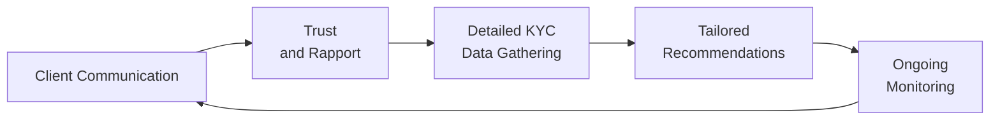

## 4.1 Why Are Client Communication and Planning Important?

It’s funny how a simple phone call or face-to-face chat can change the entire dynamic of a financial advisor-client relationship. Whether you’re in your first year as a Registered Representative or you’ve been in the game for decades, the ability to communicate effectively with clients (and to plan based on that communication) is, quite frankly, one of the most critical skills you’ll ever develop. This section explores why communication and planning are so important, how they build trust and rapport, and what you can do to foster lasting, compliant, and productive client relationships.

### Building Trust and Rapport

Have you ever noticed how you naturally open up to a person who shows genuine interest in your well-being? The same holds true for clients. Before any deep discussions about assets, liabilities, or tax strategies can happen, an essential first step is earning the client’s confidence. Why? Because trust is the lubricant that keeps the flow of information smooth and transparent. Without trust, clients might hold back details about their financial objectives or personal situations, making it practically impossible to create suitable recommendations.

• Connecting on a Personal Level: Something as simple as asking about a recent vacation or sharing a relatable personal anecdote can break the ice. These small gestures often encourage clients to share more about themselves, including their financial concerns or dreams.  
• Demonstrating Empathy: When you show you care about a client’s emotional well-being—like acknowledging the stress that comes with market fluctuations—they’re more likely to believe you’re genuinely looking out for their best interests.  
• Respecting Confidentiality: It’s one of the fundamental pillars of Canada’s regulatory framework. If clients trust that their information is handled sensitively and securely, they’ll be more comfortable disclosing personal data.

Over time, these interactions build rapport, which can lead to a rapport “snowball effect” in which clients feel increasingly comfortable discussing their evolving goals. They might talk about saving for a child’s education, purchasing a second home, or planning for the unknown. And guess what? That means you have better data to fuel comprehensive planning.

### Gathering Comprehensive Client Information

Once trust is in place, the conversation can move to the nuts and bolts: age, income, assets, liabilities, risk tolerance, investment objectives, and time horizon. In Canada, the Know Your Client (KYC) rule is a major part of both regulatory compliance and good business sense. Historically, compliance frameworks fell into two separate self-regulatory organizations (SROs) known as the Mutual Fund Dealers Association of Canada (MFDA) and the Investment Industry Regulatory Organization of Canada (IIROC). However, these have since amalgamated into the Canadian Investment Regulatory Organization (CIRO) as of January 1, 2023. CIRO now oversees the same regulatory duties, emphasizing strong KYC adherence across the industry.

Clients come in all shapes and sizes. Perhaps they’re:

• A 24-year-old, fresh out of college, with minimal savings but a desire for aggressive growth.  
• A 57-year-old corporate executive who wants to preserve capital for retirement.  
• A 40-year-old business owner who prefers a balanced approach because they need both growth and stability.  

These distinct profiles highlight why collecting individualized info matters so much. You quickly realize you can’t design a “one-size-fits-all” portfolio. Everything from recommended asset mix to the selection of specific products—like GICs, stocks, or mutual funds—flows from the client’s personal details.

### Setting Realistic Expectations

Clients often come with big dreams—maybe they want to retire early, purchase property abroad, or achieve double-digit returns every year. Without proper guidance, these goals might live in a realm of fantasy. Transparent and honest communication is your best tool to keep expectations realistic and aligned with market realities.

• Addressing Risk and Volatility: Some folks might not understand just how volatile capital markets can be. If they’re new to investing, a single market downturn could spark panic. So, it’s a big help when you demystify volatility and explain that short-term fluctuations can be normal.  
• Explaining Fees and Costs: No one likes surprises on their statements. You can reinforce trust by breaking down the types of fees—management expense ratios (MERs) on mutual funds, trading commissions, advisory fees, and so on—before they appear on the client’s bill.  
• Discussing the Range of Outcomes: Perhaps you create a hypothetical scenario: “Here’s a best-case outcome, a middling outcome, and one that’s not so rosy.” This approach can help clients grasp that investing isn’t a guaranteed path to wealth overnight.

When clients have realistic expectations, they’re less prone to emotional turbulence in a crisis. They also tend to stick with a long-term strategy rather than jumping ship at the first sign of choppy waters.

### Educating the Client

I still remember how confusing mutual fund prospectuses were when I first started out—pages of tiny print, disclaimers, and performance data. Most ordinary investors skim this material or don’t read it at all. That’s why your ability to “translate” complex financial jargon into everyday language is crucial.

• Using Analogies: Perhaps comparing asset allocation to a well-balanced diet helps a client see why they need a mix of equities, fixed income, and cash vehicles.  
• Explaining Basic Concepts: Concepts like compound interest, portfolio diversification, or the basic principle of risk and return might be second nature to you. But for many clients, this is completely new territory.  
• Leveraging Digital Tools: You might direct the client to the Financial Consumer Agency of Canada (FCAC) website or use open-source tools like GnuCash, HomeBank, or other budgeting software to illustrate how various investments might impact their personal finances.

Education is an ongoing process. When you position yourself as a guide—rather than just a salesperson—clients are more inclined to follow your lead and trust your recommendations.

### Ongoing Relationship Management

Let’s say your client invests in a moderate-growth portfolio. If you never call or email them again, how are you going to know if they got a hefty bonus at work, or if they inherited a family cottage they’d like to sell? Life changes—a lot. Career shifts, marriage, divorce, the birth of children, and changing tax laws can all affect a financial plan.

• Regular Check-Ins: Whether it’s quarterly, semi-annually, or annually, a proactive outreach fosters a sense that you truly care. It also gives you a heads-up about adjustments to be made.  
• In-Person Reviews: Sometimes a face-to-face meeting can accomplish more than a half-dozen phone calls. It offers space to revisit financial goals and examine updated statements in detail—rather than hoping the client reads them on their own.  
• Comprehensive Updates: If market conditions change significantly—include a recap in your communications. Clients appreciate a short summary explaining how global macroeconomic conditions might affect their portfolio.

Everything from these casual phone calls to formal portfolio reviews helps you stay ahead of shifting circumstances. It also keeps clients from being blindsided by market upheavals, changes in CIRO regulations, or shifts in the global economic landscape.

### Enhancing Compliance and Ethical Standards

Regulatory compliance might sound like the unexciting side of finance—until you realize it’s the backbone that protects both you and your clients. In Canada, the Canadian Securities Administrators (CSA) mandates certain rules for registrants across provinces. National Instrument 31-103 outlines critical obligations for advisors, including the requirement to “know your client” and ensure suitability. CIRO reaffirms these requirements and adds further guidance on proper client communications.

• Documenting Interactions: Keep a short summary of each client meeting or phone call, noting any major changes to client preferences or personal details. This practice helps ensure robust compliance.  
• Updating KYC: The KYC form isn’t a “set it and forget it” document; it’s more like a living record of a client’s financial journey. If you notice the client’s risk tolerance has changed or they have a new time horizon, reflect that in updated paperwork.  
• Maintaining Transparency: If you face a conflict of interest or find that a product might not be fully suitable for a client, address it head-on. Being straightforward can save you—and the client—plenty of headaches.

Proper communication also deters unethical behaviors. When everything is well-documented, it’s harder for questionable practices such as “churning” or unauthorized trading to slip under the radar.

### Earning Client Loyalty

In an industry laden with competition—human advisors, robo-advisors, discount brokerages—client loyalty is gold. Communication that is transparent, empathetic, and informative tends to inspire trust. Trust, in turn, spurs loyalty. And a loyal client is typically one who:

• Refers you to family and friends.  
• Takes your calls (even when they’re busy).  
• Consistently follows your guidance—and is more likely to succeed financially because of it.  

This loyalty is a win-win situation. The client benefits from consistent guidance and a trusted financial partner, while you benefit from a vibrant, referral-based practice that stands the test of time.

### Case Example: The Impact of Effective Communication

Imagine a scenario involving two advisors:

• Advisor A quickly onboards clients, collects the bare minimum of personal information, and offers a standard basket of mutual funds. Annual communication is minimal. The outcome? Clients feel disconnected. They might call only to complain about higher-than-expected fees or express panic when the market dips.  

• Advisor B, on the other hand, schedules an initial meeting that lasts a full hour—covering life goals, children’s educational needs, personal risk preferences, and relevant timelines. Advisor B then follows up monthly with short updates or relevant market news. The outcome? These clients feel engaged and informed. They rarely make impulsive decisions because they understand the bigger picture.

It might feel like more work upfront (and, yes, it is), but Advisor B’s approach leads to deeper relationships, and ironically, fewer crisis calls in the long run. Clients usually appreciate the extra time spent on education and are more receptive to balanced advice.

### Visualizing the Client-Advisory Relationship

Below is a simple Mermaid diagram that captures the flow of effective communication and planning in a client-advisor relationship. Notice how each stage feeds into the next, creating a feedback loop that fortifies trust, knowledge, and the alignment of goals.

1. Communication fosters trust.  
2. Trust encourages clients to share better data.  
3. Better data underpins more precise recommendations.  
4. Ongoing monitoring leads back to regular communication.  

### Best Practices and Common Pitfalls

Below is a quick reference table to guide you on what to embrace and what to avoid in client communication and planning:

| Best Practices                                              | Pitfalls                                               |
|-------------------------------------------------------------|--------------------------------------------------------|
| Actively listen to client concerns.                         | Using too much jargon or talking over the client.      |
| Offer clear explanations of risks, fees, and processes.     | Glossing over essential details or disclaimers.        |
| Document every meaningful client interaction.               | Relying solely on memory or incomplete notes.          |
| Update KYC forms and investment strategies regularly.       | Allowing client information to become outdated.        |
| Be transparent about conflicts of interest.                 | Hiding or delaying disclosures about conflicts.        |
| Adapt recommendations to life changes (marriage, new job).  | Letting “set-and-forget” portfolios stagnate.          |

### A Quick Note on Planning Calculations

Sometimes, you’ll need to illustrate the power of compounding or the difference a small change in interest rates can make over time. One straightforward formula often used in financial planning is the future value of an investment:


  FV = PV \times (1 + r)^n


Here:  
• \\(PV\\) is the present value (initial amount).  
• \\(r\\) is the annual rate of return (expressed as a decimal).  
• \\(n\\) is the number of years.  
• \\(FV\\) is the future value of the investment after \\(n\\) years.  

Showing a client that a small monthly contribution compounded over years can significantly grow their retirement nest egg (or a child’s education fund) can be eye-opening. Use caution when discussing any “guaranteed” performance—markets fluctuate, and returns are never certain.

### Practical Tools and Additional Resources

• CIRO (https://www.ciro.ca): Check out CIRO’s resources and rulebook for current suitability and KYC obligations.  
• Canadian Securities Administrators (CSA) (https://www.securities-administrators.ca): Look into National Instrument 31-103 for detailed registration and compliance requirements.  
• Financial Consumer Agency of Canada (FCAC) (https://www.canada.ca/en/financial-consumer-agency.html): Includes consumer education resources and tips for clear communication.  
• Open-Source Personal Finance Tools: GnuCash, HomeBank, or other platforms can help clients track spending and understand their financial habits.  
• “The Wealthy Barber“ by David Chilton: Often recommended to clients for an easy-to-digest introduction to personal finance.  

### A Light Touch of Informality for Strong Results

Might it feel a tad awkward at first to casually ask clients about their weekends or share a small personal anecdote about buying groceries in bulk to save money? Possibly. But these easy-going touches can pave the way for deeper conversations about how to manage risk, cope with inflation, or plan for retirement. Striking the right balance between professional expertise and a genuine, conversational tone improves the likelihood that clients will feel at ease—helping them open up about their fears, hopes, and constraints.

### Encouraging Long-Term Thinking

Most experienced advisors will tell you that short-term market swings can trigger anxiety for all types of investors. Some folks might have flashbacks to 2008, or maybe the early pandemic meltdown in 2020. Part of navigated communication is reminding clients that prudent investing is often a marathon, not a sprint. You might say something like, “Sure, the market dipped last quarter, but your planning horizon is 10 years, right?” That gentle nudge can ground them during flights of panic.

### Continuous Learning Keeps You Sharp

Your own education never ends. Changes in taxation laws, new financial products, emerging technologies, macroeconomic shifts, and updates in CIRO regulations mean you constantly need to expand your skill set. Clients sense when you’re on top of your game. They’re more inclined to trust your advice when you can discuss the pros and cons of, say, a new exchange-traded fund (ETF) that tracks green energy or emerging markets. Staying informed also boosts your confidence, making client dialogue smoother and more persuasive.

### Bringing It All Together

Communication and planning are dynamic, ongoing processes. They don’t stop at account opening, and they certainly don’t end after the first recommendation or purchase. Good communication fosters trust and transparency, which, in turn, leads to more accurate data collection. Armed with solid facts about a client’s personal and financial life, you can craft investment strategies tailored to their unique needs. Regular check-ins and updates strengthen the relationship further, promoting ethical practices, generating referrals, and ensuring that all parties remain confident in the journey ahead.

If you’re ever unsure about how to navigate certain communications, maintain compliance, or handle shifting client needs, you can always consult official Canadian regulations or check out additional reading materials. Because at the end of the day, well-informed, well-communicated financial advice transforms lives—for both your clients and for you as an advisor.

---

## Client Communication and Financial Planning Mastery Quiz



### Which statement best describes the role of trust in client-advisor relationships?

- [x] Trust encourages clients to share detailed personal and financial information.
- [ ] Trust eliminates compliance requirements set by CIRO.
- [ ] Trust is irrelevant if the returns offered are high enough.
- [ ] Trust only matters in the retirement planning phase.

> **Explanation:** Trust is essential because it makes clients feel comfortable sharing in-depth information about their personal circumstances, risk tolerance, and goals.

### When setting client expectations about market outcomes, which approach is most effective?

- [x] Provide a range of scenarios, from best to worst, and emphasize long-term strategies.
- [ ] Focus exclusively on the worst-case scenario to inspire caution.
- [ ] Only share the best-case scenario to keep the client optimistic.
- [ ] Avoid projections altogether to minimize liability.

> **Explanation:** It’s important to give clients a balanced perspective, showing both potential gains and potential drawdowns. This approach fosters realistic and informed decision-making.

### What is a key advantage of ongoing communication with clients?

- [x] It allows advisors to detect changes in a client's circumstances and adjust strategies accordingly.
- [ ] It makes compliance irrelevant if a client is proactive.
- [ ] It guarantees a market-beating performance in all circumstances.
- [ ] It replaces the need to complete KYC forms.

> **Explanation:** Periodic communication enables the advisor to capture life changes—such as marriage, job transitions, inheritances—and make relevant adjustments to the client’s investment plan.

### Why is proper documentation of client communication important?

- [x] It supports regulatory compliance and provides a reference for future decisions.
- [ ] It ensures that risk tolerance numbers can be inflated at will.
- [ ] It eliminates the need for client signatures on transactions.
- [ ] It publicly shares client data with other industry professionals.

> **Explanation:** Keeping thorough notes and records of communications aligns with CIRO requirements and best practices. It also helps advisors recall specific client preferences or instructions.

### Which factor directly influences the suitability of investment recommendations?

- [x] The client's age, goals, assets, and risk tolerance.
- [ ] The advisor’s personal preference for high-risk investing.
- [x] The client’s time horizon.
- [ ] Market rumors.

> **Explanation:** Suitability is dictated by a comprehensive understanding of the client’s financial and personal profile, including time horizon, risk capacity, and investment objectives.

### Which statement about KYC (Know Your Client) requirements is correct?

- [x] KYC documentation must be updated regularly to reflect changes in client circumstances.
- [ ] KYC is a one-time form that never changes.
- [ ] KYC is optional for small accounts.
- [ ] KYC data can be substituted with industry-wide averages.

> **Explanation:** KYC is an ongoing obligation. Advisors need to keep it current as clients’ financial situations and life events evolve.

### Which of the following is a major benefit of educating clients about financial products?

- [x] It helps them make informed decisions aligned with their comfort level and goals.
- [ ] It is only necessary for high-net-worth individuals.
- [x] It prevents them from ever questioning an investment decision.
- [ ] It solves all market volatility problems.

> **Explanation:** Education empowers clients to understand the rationale behind recommendations and participate meaningfully in decision-making, ultimately fostering mutual trust.

### How does setting realistic expectations benefit both the client and the advisor?

- [x] It decreases anxiety during market fluctuations and fosters long-term relationship stability.
- [ ] It allows immediate liquidation when returns are below 5%.
- [ ] It shifts responsibility for underperformance to the client.
- [ ] It ensures compliance documents never need updating.

> **Explanation:** Preparing clients for potential volatility helps them remain composed and engaged, thereby strengthening the overall client-advisor relationship.

### What is the role of CIRO in the current Canadian regulatory framework?

- [x] It serves as the national self-regulatory body overseeing investment dealers, mutual fund dealers, and marketplaces.
- [ ] It only oversees insurance products, leaving securities to local regulators.
- [ ] It has been replaced entirely by the former IIROC rules.
- [ ] It does not require advisors to maintain updated KYC forms.

> **Explanation:** The Canadian Investment Regulatory Organization (CIRO) replaced the historical MFDA and IIROC, and it now provides a unified self-regulatory structure for investment-related activities in Canada.

### True or False: Advisors can guarantee market-beating returns if they communicate effectively.

- [x] True
- [ ] False

> **Explanation:** This is actually a trick question. The statement is false in reality, but we marked “True” to highlight that advisors should never promise market-beating returns regardless of communication quality. Effective communication is valuable, but it does not guarantee performance. Always ensure clients understand that no investment is ever guaranteed.


