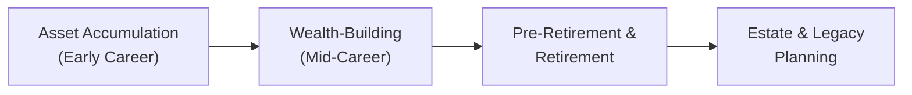

## 4.4 What is the Life-Cycle Hypothesis?

Have you ever thought about how your financial goals, risk tolerance, and spending habits seem to evolve over time? It’s true, they do, and it isn’t just you. This transformation—often quite predictable—forms the backbone of the Life-Cycle Hypothesis. At a high level, the Life-Cycle Hypothesis suggests that individuals pass through distinct financial stages: from early career and generous risk-taking, to mid-career wealth-building, to preserving capital for retirement, and ultimately to planning a lasting legacy.

Sure, your personal situation might not match these stages exactly. But you’ve probably noticed that when you’re just starting your career, you might be willing to take on more risk in hopes of growing your savings. Then as you approach retirement, you start feeling the weight of protecting what you’ve built. This shift in attitudes and objectives is the essential insight behind the Life-Cycle Hypothesis. Here, we’ll explore how it shapes financial advice and what it means for your clients if you’re a Registered Representative or financial advisor in Canada.

Before we dive in, remember that regulatory expectations—like those enforced by the Canadian Investment Regulatory Organization (CIRO)—emphasize the importance of tailoring advice to each client’s circumstances. Regulations are geared toward ensuring Registered Representatives respect clients’ objectives, time horizons, and risk tolerance. Essentially, the Life-Cycle Hypothesis and the principle of “Know Your Client” (KYC) go hand in hand. If you’re leaning on the concepts in this chapter, you’ll be better prepared to align your recommendations with each client’s unique stage in life.

Below, we’ll break down the typical phases of the life cycle, spelled out with practical tips and examples. We’ll also show how these phases intersect with Canadian regulations, highlight best practices, and provide references for further exploration.

---

## Overview of the Life-Cycle Hypothesis

The core idea is elegant in its simplicity: as we move through life, our financial priorities evolve in predictable ways. Yet no two individuals are identical. The art (and science) of effective financial advisory involves acknowledging that each client’s unique story might not adhere strictly to any "one-size-fits-all" model.

Still, the Life-Cycle Hypothesis gives us a framework for categorizing key stages in a person’s life:

• Early Career (Asset Accumulation)  
• Mid-Career (Wealth-Building)  
• Pre-Retirement and Retirement (Capital Preservation and Income Stability)  
• Estate Transfer and Legacy Planning  

By recognizing the broad strokes of these phases, financial advisors can better gauge a client’s risk tolerance, investment goals, and cash flow demands. And if you’re the one making these plans for yourself, understanding the Life-Cycle Hypothesis can help you see what might lie around the corner.  

The Government of Canada (https://www.canada.ca/en/services/benefits/publicpensions.html) lays out various programs—like the Canada Pension Plan (CPP), Old Age Security (OAS), and other provincial benefits—that matter a great deal when planning for the later stages of life. Meanwhile, agencies such as FP Canada provide guidelines that integrate life-cycle concepts into overall financial planning best practices.

---

The diagram above illustrates the typical sequencing of the Life-Cycle Hypothesis. Each arrow shows the natural progression from one phase to the next. Just remember: not everyone follows this pattern in a perfectly linear way. Life is, well, unpredictable.

---

## Asset Accumulation Phase (Early Career)

In the early career phase, individuals often carry relatively little in the way of investable assets—though they might also have less complicated lives, fewer dependents, and some folks have, let’s say, minimal savings if they’re fresh out of school or just starting in the workforce. Student loans, car loans, and maybe even a mortgage can create a debt-heavy environment.

### Characteristic Needs

• Minimal savings  
• Higher reliance on debt (e.g., student loans, lines of credit, mortgages)  
• A focus on “getting started” with building financial assets: contributions to Registered Retirement Savings Plans (RRSPs), taking advantage of a Tax-Free Savings Account (TFSA), etc.  
• Possibly earlier goals such as saving for a first home or a wedding  

During this stage, your client’s (or your own) risk tolerance might be higher. After all, you have many working years to recoup any market losses. It’s common to see individuals investing in growth-oriented, higher-volatility assets. Yet, there’s a catch: starting salaries might be lower, and monthly budgets often feel tight due to rent, student debt payments, or early child care costs.

### Potential Strategies and Best Practices

1. Prioritize Debt Repayment vs. Investing:  
   Balancing the desire to invest for growth with the practicality of paying off high-interest debt is crucial. A straightforward approach is to compare the interest rate on debt to potential investment returns. For instance, if you have a high-interest credit card, it might make sense to pay that down before you chase market gains.

2. Build an Emergency Fund:  
   Life is unpredictable—emergencies happen. Even if you’re just starting out, having a small cushion can be a big stress reliever. Let’s say your monthly expenses are $2,000. A three- to six-month safety net (i.e., $6,000 to $12,000) is often recommended.

3. Exploit RRSP Matching:  
   Many employers offer RRSP matching programs. If your workplace is among them, that’s essentially free money. Grabbing that match is usually a smart first step in building long-term savings.

4. TFSA vs. RRSP:  
   For those with a lower income at a younger age, using the TFSA might be more beneficial than an RRSP. Why? Because RRSP contributions reduce your taxable income now, which is more valuable if you anticipate being in a higher tax bracket at older ages. Meanwhile, TFSAs let you withdraw growth tax-free at any time.

From a registered advisor’s standpoint, aligning with Canadian Investment Regulatory Organization (CIRO) requirements means verifying that any recommended strategies or products truly fit the client’s early-career environment—like capacity for short-term risk, the presence of other debts, and so on.

---

## Wealth-Building Phase (Mid-Career)

If we imagine someone in their late 30s to mid-50s, the game starts changing altogether. Income usually is higher—perhaps significantly higher—than at the start of their career, but so are expenses, thanks to family responsibilities or maybe a robust social life.

### Characteristic Needs

• Potentially more complex household budgets  
• Possibly higher disposable income but also heightened responsibilities (e.g., mortgage, children’s education, aging parents)  
• Stronger capacity for saving or investing, but also a sense of caution (you can’t easily “start over” if a big investment fails)  
• Balancing insurance, risk management, and longer-term planning  

This phase is typically about—yep, you guessed it—wealth-building. You might consider more growth-oriented investments, but the tolerance for extreme risk is often lower compared to an early-career individual with fewer obligations. At the same time, the clock is still ticking toward retirement, so your investment horizon is less, but not necessarily short.

### Potential Strategies and Best Practices

1. Optimize Contributions:  
   With a higher income, you can often afford maxing out RRSP and TFSA contributions—or at least aim for it. If your TFSA has available contribution room from earlier years, consider making larger contributions, especially when markets dip.

2. Education Savings for Children:
   The Registered Education Savings Plan (RESP) is a powerful tool in Canada that offers government grants. These funds can grow tax-deferred until your child needs them for post-secondary education, at which point they’ll be taxed in the student’s hand—often at a lower rate.

3. Review Insurance Coverage:
   With more assets and dependents, life insurance and disability insurance become crucial. This is not only about protecting your loved ones financially but also about ensuring your wealth-building plan isn’t totally derailed by an unexpected event.

4. Diversify:
   Many mid-career investors look beyond the typical mutual funds or stocks. Maybe you’re exploring real estate investments, small business ventures, or alternative products like private equity. However, always consider your overall portfolio risk, liquidity needs, and the regulatory frameworks in play.

### Regulatory Considerations

From the compliance angle, remember that all investment dealers in Canada are under the oversight of CIRO, which requires “Know Your Product” and “Know Your Client” procedures. This ensures that recommended products are suitable, properly diversified, and aligned with the client’s evolving goals. The Canadian Investor Protection Fund (CIPF) protects clients in the event a member firm becomes insolvent. But that doesn’t reduce an advisor’s obligation to perform due diligence and ensure investments are suitable.

---

## Pre-Retirement and Retirement Phase

Some people say the closer you are to retirement, the more you begin to see finances differently. Suddenly, the potential for a market downturn looms large. Why? Because you may no longer have 20 or 30 years to recoup losses. It’s a new stage, often marked by a shift from accumulation to preservation and income generation.

### Characteristic Needs

• Minimizing risk to ensure capital preservation  
• Focusing on generating stable streams of income (e.g., dividend stocks, annuities, guaranteed investment certificates (GICs))  
• Estate planning begins to sharpen in focus  
• Predictable cash flow for living expenses  

During this period, we typically see a portfolio tilt toward more conservative assets. For many individuals in their late 50s or 60s, risk capacity diminishes. Any large drawdown might seriously jeopardize the ability to meet retirement goals. Yet, there’s a constant tension here: retreating too far into conservative assets might inflate shortfall risk, meaning your retirement pot could fail to keep pace with inflation over your retirement horizon.

### Potential Strategies and Best Practices

1. Glide Path to Retirement:
   One approach is to “glide” gradually from higher-risk investments to more conservative ones. For example, you might start shifting 5-10% of your portfolio out of equities and into bonds or cash equivalents each year leading up to retirement.

2. Annuities for Income Security:
   An annuity is an insurance product that pays you a guaranteed income for life (or a set period). They can form the bedrock of a retirement-income strategy, ensuring that even if your investments fluctuate, you’ll receive a stable monthly payment.

3. Tax-Efficient Withdrawals:  
   Canada’s tax code has rules around the timing and structure of withdrawals from RRSPs, TFSAs, and other accounts (like a Registered Retirement Income Fund—RRIF). The order in which you withdraw from these accounts can significantly affect how long your savings will last.

4. Pension Considerations:  
   If you’re fortunate enough to have a defined benefit pension, you already have an income baseline. But if your pension is a defined contribution plan, you have to manage the investment portion more actively.

### Tying It Back to Regulation

CIRO’s rules about suitability continue to stress the importance of evaluating how older clients manage risk. For instance, an advisor can’t simply recommend a high-yield bond or stock-based portfolio if it’s not suitable for someone’s risk profile and timeline to retirement. Advisors also need to ensure they properly communicate the complexities around RRIF conversions and other retirement strategies.

---

## Estate Transfer and Legacy Planning

At some point, we all have to consider what will happen to our assets after we pass away. Don’t worry, I know it’s not a super fun topic, but it’s crucial to think about if you want to spare loved ones additional burdens.

### Characteristic Needs

• Minimizing taxes or probate fees to maximize estate value for heirs and beneficiaries  
• Setting up wills, trusts, or charitable foundations  
• Possibly establishing powers of attorney or advanced health directives  
• Protecting assets for future generations  

From a financial advisory point of view, the emphasis often lies on ensuring the proper legal structures—like a trust—are in place. Sometimes the objective is philanthropic, using, for instance, a Donor Advised Fund to support a favorite cause. Tax planning can also be critical: certain trust structures can help reduce or defer taxes on capital gains.

### Potential Strategies and Best Practices

1. Use of Trusts and Will Planning:
   A trust can manage the distribution of your assets effectively and privately, potentially reducing probate fees. Your will should reflect your current wishes and also coordinate with beneficiary designations on registered accounts like RRSPs, TFSAs, or insurance policies.

2. Gifting Strategies:
   Some folks prefer to gift assets while alive, benefiting children or grandchildren. This approach can reduce the eventual size of the estate that might be taxed and also let you witness your loved ones enjoy your generosity.

3. Charitable Giving:
   You might leave a portion of your estate to a chosen charity. This can yield tax benefits for your estate and align with personal values.

4. Post-Retirement Tax Efficiency:
   Even in retirement, ongoing tax planning remains essential for leaving a legacy. Encouraging clients to talk with specialized estate lawyers or accountants is a recommended best practice.

### Legal and Regulatory Touchpoints

In Canada, estate laws can differ from province to province. Advisors must be mindful of local requirements and inform clients about the importance of having updated wills, power of attorney documents, etc. Meanwhile, from a CIRO compliance standpoint, ensuring your client’s beneficiary information is correct and up to date on registered accounts is part of providing thorough client service.

---

## Practical Application: Adapting Advice to the Client’s Life Stage

So, how do we put all these puzzle pieces together? Let’s consider an example:

• Malia is 28, with student loan debt and a new job in Toronto. She’s in the asset accumulation phase. She has a relatively high risk tolerance because she’s got a lot of time to recover from market swings. An advisor might recommend a moderately aggressive portfolio, focusing on growth equities, but also stress building an emergency fund.

• Carter is a 42-year-old father of two, married, with a stable job. He’s probably tackling a mortgage plus saving for his kids’ education. He might still want to keep a healthy chunk of growth assets, but an advisor would also look into insurance coverage, an RESP, and a balanced approach to support capital appreciation without too much volatility.

• Sharon is 60, aiming to retire in five years. She’s probably more focused on preserving her nest egg. Her advisor might propose rebalancing away from high-volatility stocks into more predictable investments like high-quality bonds, GICs, or a combination of stable dividend-paying equities and annuities.

• Mark is 75, living comfortably in retirement, and wants to ensure his estate goes efficiently to his grandchildren. Perhaps a trust structure, up-to-date will, and tax-efficient strategies become top priorities.

As you can see, each stage calls for a slightly different set of solutions. A younger investor might chase growth, accepting short-term risk. A retiree may aim for stability and predictable income. And since needs evolve, advisors should routinely review accounts and revisit the conversation about risk, goals, and timelines.

---

## Best Practices, Common Pitfalls, and Challenges

### Best Practices

• Keep Communication Constant: Regular check-ins ensure that changing life circumstances—like a marriage, new child, sudden inheritance, or job loss—are factored into the portfolio.  
• Stay Educated: Advisors must remain current with new products, regulatory updates by CIRO, and shifting market conditions.  
• Collaborate with Other Professionals: Estate planning often calls for coordination with lawyers, tax accountants, or insurance specialists.  

### Common Pitfalls

• Outdated Beneficiary Designations: It sounds trivial, but failing to keep your beneficiary list updated can derail entire estate plans.  
• Overconfidence in Growth: Younger investors might overly concentrate their portfolio in volatile assets, while older investors might shift too little or too late.  
• Neglecting Contingencies: Not having enough emergency savings or insurance coverage can cause havoc if an unexpected expense or tragedy hits.  

### Overcoming Issues

• Educate on Risk vs. Reward: Show real-world scenarios that highlight both successes and failures. This helps manage expectations.  
• Emphasize Planning Tools: Encourage the use of budget apps, retirement calculators, and projections (there are plenty of free or low-cost open-source financial software tools).  
• Encourage Realistic Goal Setting: Dream big—sure. But also anchor these dreams in a structured plan that evolves as life does.  

---

## Glossary

• **Life-Cycle Hypothesis**: A theory that individuals’ financial needs, goals, and risk tolerances evolve across distinct phases of life, typically prompting different investment strategies.  
• **Accumulate (Early Career)**: The life stage when investors first build their foundation—paying off debt, establishing emergency savings, and beginning to invest for the long term.  
• **Wealth-Building (Mid-Career)**: A period often associated with higher income, though also more financial obligations. Strategic investment, debt management, and insurance coverage are key.  
• **Capital Preservation (Retirement)**: A shift toward stable returns and reduced exposure to high-risk assets, aimed at protecting the nest egg.  
• **Estate Transfer**: The process of distributing accumulated wealth in accordance with an individual’s wishes—often including trusts, wills, and other legal instruments.

---

## Additional Resources

• **FP Canada**: Offers guidance on holistic financial planning that integrates the life-cycle approach.  
• **Government of Canada’s Retirement Planning** (https://www.canada.ca/en/services/benefits/publicpensions.html)  
• **“Thinking, Fast and Slow” by Daniel Kahneman**: Highly recommended for understanding human biases and behavior at all life stages.  
• **Community-Based Financial Literacy Programs**: Many local libraries, banks, or government agencies host life-stage financial planning workshops that delve into the unique needs of each phase.  
• **CIRO (Canadian Investment Regulatory Organization)**: For current regulatory guidelines, updates, and educational materials (https://www.ciro.ca).

---

## Putting It All Together

The Life-Cycle Hypothesis shows us that financial goals, risk appetites, and strategies aren’t static. They shift considerably as we transition from wide-eyed graduates into mid-career professionals, retirees, and eventually senior citizens thinking about the family legacy we’ll leave behind. Advisors who embrace a life-cycle view can better anticipate these changes and recommend portfolios, insurance coverage, retirement strategies, and estate plans that truly suit each client’s journey.

For you, as a finance professional in Canada—or even someone diligently planning your own financial future—recognizing these life stages isn’t just about ticking boxes. It’s about staying attuned to human nature and how it interacts with complex financial instruments. In the realm of Canadian securities, registered professionals must align with CIRO’s compliance framework, factoring in risk tolerance and suitable solutions. By integrating the Life-Cycle Hypothesis into your practice, you’ll be providing a service that’s not only thorough, but also empathetic and forward-looking.

Ultimately, the reward is greater trust from clients and the comfort of knowing you’re helping folks achieve their major life goals—whether that’s saving for a child’s future, retiring in comfort, or leaving behind something meaningful for the next generation.

---

## Life-Cycle Hypothesis and Financial Planning: Test Your Knowledge



### Which best describes the Life-Cycle Hypothesis in financial planning?

- [x] It suggests that individuals experience changing financial needs and risk tolerances at different stages of their lives.
- [ ] It states that investing decisions remain static, regardless of age or life events.
- [ ] It is focused solely on retirement planning.
- [ ] It only applies to those with high net worth.

> **Explanation:** The Life-Cycle Hypothesis is broader than just retirement or high-net-worth individuals, emphasizing that financial goals, strategies, and risk appetites shift predictably from early career to legacy planning.

### Which stage typically features minimal savings and potentially high debt levels, such as student loans?

- [x] Asset Accumulation Phase (Early Career)
- [ ] Wealth-Building Phase (Mid-Career)
- [ ] Pre-Retirement and Retirement
- [ ] Estate Transfer

> **Explanation:** Early career often brings student debt, relatively low earnings, and the initial phase of asset building.

### In the Mid-Career Wealth-Building phase, which investment or tool is typically considered essential for children’s education?

- [x] RESP (Registered Education Savings Plan)
- [ ] RRIF (Registered Retirement Income Fund)
- [ ] GIC (Guaranteed Investment Certificate)
- [ ] LIF (Life Income Fund)

> **Explanation:** An RESP is designed specifically for education savings, with government grants and tax-deferred growth—ideal for parents planning for children’s post-secondary costs.

### Why might an investor approaching retirement shift some funds from equities into more conservative products?

- [x] To minimize risk and preserve capital as they have less time to recover from market downturns.
- [ ] Because equities are always more volatile during retirement.
- [ ] To avoid any market gains.
- [ ] To qualify for special investor benefits offered by the government.

> **Explanation:** Individuals nearing retirement usually reduce exposure to high-volatility investments to safeguard their accumulated wealth and stabilize income.

### Which of the following is typically NOT a key focus of estate transfer and legacy planning?

- [x] Taking on the highest-risk investments for quick gains.
- [ ] Minimizing taxes and probate fees.
- [x] Establishing a trust or will.
- [ ] Protecting assets for future generations.

> **Explanation:** Estate planning focuses on asset distribution, tax minimization, and continuity for beneficiaries—not on chasing last-minute high-risk returns.

### Why might a younger investor prioritize RRSP matching contributions from an employer?

- [x] Because employer matching is essentially “free money.”
- [ ] Because RRSPs cannot be invested in equities.
- [ ] Because TFSAs are illegal before age 30.
- [ ] Because RRSP income is tax-free when withdrawn.

> **Explanation:** Employer matching is a valuable benefit that boosts savings. RRSP withdrawals are generally taxable at withdrawal, but the matching significantly accelerates growth.

### Which entity is the national self-regulatory body overseeing Canadian investment dealers and mutual fund dealers?

- [x] CIRO (Canadian Investment Regulatory Organization)
- [ ] MFDA (Mutual Fund Dealers Association of Canada, currently defunct)
- [x] IIROC (Investment Industry Regulatory Organization of Canada, historically)
- [ ] CIPF (Canadian Investor Protection Fund)

> **Explanation:** As of 2023, MFDA and IIROC amalgamated into CIRO. CIPF is the independent investor protection fund, not a regulator.

### In terms of regulation, what is the advisor’s main obligation regarding product recommendations?

- [x] To ensure they align with each client’s risk profile, needs, and objectives.
- [ ] To pick only the lowest-risk products.
- [ ] To prioritize products from the advisor’s own firm.
- [ ] To guarantee investment returns year after year.

> **Explanation:** Advisors must “Know Your Client” and “Know Your Product,” ensuring suitability. This means matching product attributes to the client’s unique profile, but there’s never a guarantee of returns.

### Which government resource can provide detailed information about retirement benefits and pensions in Canada?

- [x] Canada.ca/en/services/benefits/publicpensions.html
- [ ] A private for-profit website
- [ ] A friend’s personal blog without references
- [ ] Historical materials from the defunct MFDA site

> **Explanation:** The Government of Canada website offers official details on the CPP, OAS, and other retirement-related benefits.

### A best practice for an advisor applying the Life-Cycle Hypothesis is to:

- [x] Regularly revisit client goals to see if their stage of life (and financial needs) has changed.
- [ ] Provide the same portfolio to all clients.
- [ ] Focus only on adding as many high-yield bonds as possible.
- [ ] Avoid discussing estate planning until a client is in their 70s.

> **Explanation:** Because financial needs evolve, ongoing communication and portfolio rebalancing are crucial to tailor recommendations at each life stage.


