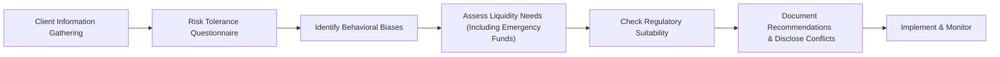

## 4.5 Additional Concepts in Understanding the Client

Understanding clients is arguably a never-ending journey in the financial advisory world. Yes, we’ve explored the basics in previous sections about how to talk with them, gather their data, and shape investment strategies. Still, there are always extra layers that can deepen our appreciation of their financial needs, personal aspirations, and unique quirks (we all have them!). Below, we’ll dive into some intriguing concepts that flesh out a more robust and holistic picture of your clients, ensuring you’re providing advice that’s ethical, effective, and fully in line with Canadian regulatory requirements.

**Cross-Reference to Previous Sections:**  
• In Chapter 2 (Ethical Decision Making), we touched on how values and ethics influence client relationships.  
• In Chapter 4’s earlier segments, we explored communication best practices and specific regulatory guidelines for dealing with clients.  

Now, let’s build on that foundation and look at additional concepts that will sharpen your client discovery process and help you deliver advice that truly meets the mark.

---

### Integrating Risk Tolerance Questionnaires

Picture this: You’re meeting with a new client, and the conversation is going really well. They seem comfortable discussing their finances—until you ask about risk. Suddenly, they freeze, not sure what “risk” even means in practical terms. Enter risk tolerance questionnaires.

Risk tolerance questionnaires (often referred to as RTQs) are structured surveys designed to measure a client’s willingness and ability to handle market fluctuations and potential losses. Regulated advisors in Canada often use them to help comply with suitability requirements, which we’ll talk about in more detail in a moment.

• **Willingness vs. Ability**: Risk tolerance isn’t only about a client’s personality or their emotional comfort with losses (though that’s important!). It also involves their financial capacity—like income, net worth, or existing liabilities—to sustain losses if the markets get bumpy.  
• **Cross-Referencing the Results**: A formal questionnaire is a perfect starting point, but never the end of the story. Always cross-check the questionnaire results with real-world data. If a client’s portfolio suggests they have a super-high tolerance, but a look at their net worth and annual expenses indicates precarious finances, you’ll need some gentle, practical conversations about how to align their aspirations with their actual situation.  
• **Regulatory Approval**: In Canada, risk tolerance questionnaires often follow guidelines from organizations such as CIRO (the Canadian Investment Regulatory Organization). Advisors should ensure the questionnaire they’re using is recognized or recommended by their firm’s compliance department and aligns with legislative frameworks set by the Canadian Securities Administrators (CSA).  

Using an RTQ is a bit like using a map for a hiking trip: it shows you the general route, but you still need to pay attention to the terrain and weather conditions along the way.

---

### Factoring in Behavioral Biases

If you’ve ever been convinced that your local hockey team is absolutely unstoppable—despite their last-place finish—you’ve experienced at least a dash of overconfidence bias. Behavioral biases like overconfidence, confirmation bias, and loss aversion can shape—or sometimes warp!—the way clients make investment decisions.

• **Overconfidence**: Clients may overestimate their ability to capitalize on market trends. They might under-diversify or pick high-risk stocks.  
• **Loss Aversion**: Some folks would rather cling to declining investments than face the reality of a potential loss. They may obsess over “recouping” losses, even if it’s not the smartest strategy.  
• **Confirmation Bias**: People gravitate toward news and opinions that support their existing beliefs, ignoring evidence to the contrary. They might say, “See, this article agrees with me!” even though a broader look would show a different picture.

Addressing these biases often starts with open dialogue and education. Teach clients about common decision-making traps. Recommend they read or skim through books like “Nudge” by Richard H. Thaler and Cass R. Sunstein or browse academic articles on behavioral finance by Richard Thaler, Daniel Kahneman, and other experts. Sometimes it can be as simple as sharing real-life scenarios illustrating how emotional pitfalls led to missed opportunities or losses.

---

### Liquidity and Emergency Funds

I remember a friend—let’s call her Joyce—who invested nearly every dollar she had into equities, convinced she was on track for early retirement. Then, a medical emergency hit, and she needed immediate cash. She panicked, sold her investments at unfavorable valuations, and ended up incurring capital losses right when she needed money the most.

So, let’s talk emergency funds. Planning for unexpected life twists is one of the most critical aspects of robust financial advice. The rule of thumb often cited is to hold three to six months’ worth of living expenses in an easily accessible account. However, the best approach is to customize the amount of liquidity carefully, based on the client’s goals, job stability, family obligations, and health concerns.

Pay special attention to how quickly these funds can be accessed. A GIC locked in for a year might not be much help if the client needs cash tomorrow. Encouraging clients to keep a stash of liquid assets helps prevent forced selling in a down market, ensures peace of mind, and paves the way for a smoother long-term investment strategy.

---

### Regulatory Considerations for Suitability

In the wonderful world of finance, we throw around the word “suitability” a lot. Essentially, suitability means that each recommendation—whether it’s a security purchase, an entire investment strategy, or even a high-interest savings account—must align with the client’s financial situation, risk tolerance, objectives, and personal circumstances.

• **CIRO’s Role**: If you’ve been around Canadian securities long enough, you might recall the Mutual Fund Dealers Association (MFDA) and the Investment Industry Regulatory Organization of Canada (IIROC). Those two organizations amalgamated into the Canadian Investment Regulatory Organization (CIRO) on January 1, 2023, with the new name effective June 1, 2023. CIRO is now the primary self-regulatory body overseeing investment dealers, mutual fund dealers, and market integrity.  
• **Staying Up to Date**: The CSA and provincial regulators frequently introduce amendments or clarifications regarding suitability. Keep an eye on bulletins from CIRO (https://www.ciro.ca) and updates on the CSA site (https://www.securities-administrators.ca/). If you’re not checking those sources regularly, you risk falling behind on important changes.  
• **Aligning with Other Requirements**: Suitability is not just about picking the right product; it intersects with client disclosure, conflict of interest rules, and professional ethics. The environment is always evolving, so a commitment to ongoing education is a must.

---

### Importance of Documentation

We humans are forgetful creatures. Between our daily tasks, personal errands, and never-ending digital notifications, it’s easy to let small details slip. Proper documentation is your lifeline in this sea of information. Every conversation, every assessment, every decision—keep a record.

• **Why It Matters**: If there’s ever a dispute or misunderstanding, turning back to thorough documentation can save hours (or months!) of frustration. It shows precisely how a decision was reached, who was involved, and why that decision made sense at the time.  
• **Best Practices**: Many firms have robust guidelines on documentation. Maybe it’s a secure CRM system or specialized forms. Make sure to note not only the “what” but the “why” of decisions. For instance, if a client insisted on a high-risk investment despite your advice for caution, record that.  
• **Protection for Advisor and Client**: Documentation clarifies each party’s responsibilities and expectations. Clients might recall only part of a discussion, but a well-kept set of notes helps keep the conversation grounded in facts.

---

### Ethical and Conflict of Interest Management

Let’s say your firm offers an in-house mutual fund with a slightly higher management fee than other solutions. You might receive a referral fee or additional compensation if you sell it. Should you recommend it to your client? The short answer is: only if it’s genuinely in their best interest, and you’ve disclosed the conflict.

• **Full Disclosure**: Indeed, all potential conflicts of interest—any scenario where your personal or organizational interests might diverge from the client’s—should be disclosed. The idea is to ensure the client’s best interests remain paramount, no matter the circumstances.  
• **Client-Centric Approach**: Even if you’ve disclosed a conflict, you still need to confirm your recommendation is suitable. Merely revealing your conflict does not grant carte blanche to ignore the client’s needs.  
• **Industry Codes and Regulation**: Code of ethics across the financial industry, as well as CIRO rules, emphasize that an advisor’s duty to the client comes first. Being transparent fosters trust, which ultimately shapes long-term client relationships.

---

### Putting It All Together: A Visual Overview

Below is a simple flow diagram representing how these additional considerations integrate into a typical “Know Your Client” (KYC) and advice process. Each step is influenced by the concepts we’ve discussed, from risk tolerance questionnaires to discussing emergency funds and potential conflicts of interest.

In practice, these processes often overlap, swirl around, and occasionally double back. People’s lives change, regulations get updated, and markets shift. The ever-evolving nature of finance means you’ll revisit these steps regularly.

---

### Glossary

**Risk Tolerance Questionnaire**  
A structured tool used by financial advisors and institutions to evaluate a client’s comfort level with market volatility, losses, and overall uncertainty. Typically approved by compliance departments to align with Canadian regulatory standards.

**Behavioral Biases**  
Psychological tendencies—like overconfidence or loss aversion—that can unconsciously steer clients away from rational decision-making. Understanding these biases ensures more informed, balanced advice.

**Emergency Fund**  
A pool of readily accessible money set aside to cover unforeseen expenses—think medical emergencies, unforeseen job losses, or urgent home repairs. Often amounts to three to six months’ worth of essential living costs, but personalized for each individual’s circumstances.

**Suitability**  
A regulatory principle requiring financial advisors to propose only those investments or strategies that align with the client’s financial situation, risk tolerance, investment objectives, and overall personal circumstances.

**Conflicts of Interest**  
Situations in which an advisor’s personal, financial, or organizational interests might skew the advice provided. Full disclosure and client-focused decision-making are the cornerstones of proper conflict management.

---

### Additional Resources

• **CSA’s “Investor Tools and Resources”**: (https://www.securities-administrators.ca/)  
  A treasure trove of investor-education material, KYC essentials, and sample questionnaires suitable for Canadian investors.  
• **CIRO Bulletins and Notices**: (https://www.ciro.ca)  
  Stay up to date with guidelines and regulatory changes since the new self-regulatory organization (SRO) came into existence, replacing both the MFDA and IIROC.  
• **Behavioral Finance Research**:  
  Look for academic studies by Richard Thaler and Daniel Kahneman to gain deeper insights into the psychological drivers of financial decisions.  
• **“Nudge” by Richard H. Thaler and Cass R. Sunstein**:  
  A great read on how subtle “nudges” and choice architecture can drastically improve decision-making, both in finance and everyday life.  

---

**Final Thoughts**  
At the end of the day, there really is no “one-size-fits-all” solution. Each client is a complex individual influenced by emotions, personal history, financial constraints, and ambitions. By integrating structured tools like risk tolerance questionnaires, factoring in those pesky behavioral biases, ensuring liquidity for emergencies, staying on top of regulatory requirements for suitability, documenting everything meticulously, and managing conflicts of interest with transparency, you’ll place your clients on steadier ground. The real magic is in balancing all these elements so that clients feel empowered, protected, and fully heard in their financial journey.

Remember: trust is built one conversation at a time, so keep your focus on the client’s best interest, and the rest should (mostly) fall into place.

---

## Test Your Knowledge: Understanding Clients and Suitability in Canadian Finance



### Which factor below is most crucial when evaluating a client’s risk tolerance?  
- [ ] The client’s favorite sports team  
- [x] The client’s willingness and ability to sustain losses  
- [ ] The client’s zodiac sign  
- [ ] The length of time they’ve had a bank account  

> **Explanation:** Risk tolerance depends not only on emotional comfort with market fluctuations but also on the client’s financial capacity (i.e., net worth, liabilities, etc.).

### Which of the following is an example of a behavioral bias that can skew decision-making?  
- [x] Overconfidence  
- [ ] Good luck bias  
- [ ] Precise thinking bias  
- [ ] Altruism bias  

> **Explanation:** Overconfidence bias leads investors to believe they have superior market knowledge or can predict trends more accurately than they actually can.

### What is the main reason for maintaining proper documentation in client-advisor relationships?  
- [ ] It provides a backup in case of technological failures.  
- [x] It ensures clarity on decisions made and helps resolve disputes if misunderstandings arise.  
- [ ] It’s legally required only when dealing with high-net-worth clients.  
- [ ] It’s only necessary for tax audits.  

> **Explanation:** Thorough documentation allows both the client and advisor to see how decisions were reached and reduces the risk of disputes or confusion.

### Which regulatory body currently oversees Canadian investment dealers and mutual fund dealers?  
- [ ] IIROC  
- [ ] MFDA  
- [x] CIRO  
- [ ] FINTRAC  

> **Explanation:** CIRO is the new Canadian Investment Regulatory Organization, created through the amalgamation of the MFDA and IIROC.

### What is a key purpose of an emergency fund in personal finance?  
- [x] To keep liquid assets for unforeseen expenses  
- [ ] To fund high-risk investment ventures  
- [x] To prevent forced selling in a down market  
- [ ] To avoid paying any taxes  

> **Explanation:** An emergency fund helps individuals handle unexpected life events without jeopardizing their long-term investment holdings, and it also reduces the risk of selling assets at suboptimal times.

### What is the best approach to managing conflicts of interest with clients?  
- [x] Disclose all potential conflicts and ensure recommendations still serve the client’s best interest  
- [ ] Suggest commissions are irrelevant and refuse to discuss them  
- [ ] Hide the fact that you have referral agreements  
- [ ] Rely on firm policies alone, without discussing them with the client  

> **Explanation:** Full disclosure is vital. Even with disclosure, all recommendations must remain aligned with the client’s best interest.

### Which of the following steps can help address a client’s overconfidence bias?  
- [x] Providing educational resources and multiple perspectives  
- [ ] Encouraging more frequent trading  
- [x] Showing historical data on market downturns  
- [ ] Avoiding conversations about risk  

> **Explanation:** Overconfidence can be mitigated by informing clients of historical market volatilities, showing various perspectives, and explaining how diversification can help manage risk.

### Why should you revisit a client’s risk tolerance questionnaire after a major life event?  
- [x] Risk tolerance can change due to altered financial situations or emotional states  
- [ ] There is no need; the original questionnaire should suffice  
- [ ] Only if the client explicitly requests it  
- [ ] Because regulations state you must repeat the questionnaire annually  

> **Explanation:** A client’s financial situation and personal circumstances can shift dramatically (e.g., marriage, job change), and it’s vital to keep their profile up to date.

### How can documenting conflicting views between an advisor and a client benefit both parties?  
- [x] It shows regulators and others the reasoning behind decisions  
- [ ] It reduces the advisor’s oversight role  
- [ ] It discourages the client from making choices  
- [ ] It is never a good idea to record disagreements  

> **Explanation:** Proper documentation, even of disagreements, demonstrates transparency and protects both sides by clearly noting who suggested what and why.

### True or False: Suitability requirements demand that every recommendation be aligned with the client’s objectives, financial situation, and risk tolerance.  
- [x] True  
- [ ] False  

> **Explanation:** “Suitability” is the backbone of Canadian regulatory guidelines, ensuring that each recommendation is in harmony with the client’s particular profile, including their risk tolerance and financial goals.


