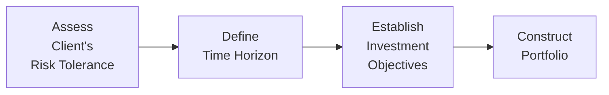

## 4.5 Assessing Client Risk Tolerance, Time Horizon, and Investment Objectives

Have you ever talked to a friend about investing, and realized they were super bold—happy to ride out wild market swings—while you, on the other hand, thought you were comfortable with risk until your portfolio took a tiny dip and you started losing sleep? These differing levels of comfort point to our individual “risk tolerance.” And that’s just one piece: there’s also how soon we might need our funds (time horizon) and what we wish to achieve with our investments (objectives). Understanding these three factors—risk tolerance, time horizon, and investment objectives—is critical when recommending any mutual fund or other financial instrument to clients. In fact, from a regulatory standpoint, you can’t make suitable recommendations without dipping deeply into your client’s personal or professional goals, comfort with risk, and liquidity needs.

This section anchors the Know Your Client (KYC) principle, which we introduced earlier in this chapter. Let’s walk through the main ideas:

• Risk tolerance sets emotion and financial thresholds for market ups and downs.  
• Time horizon tells you how soon the client needs to draw on their funds—and how much fluctuation they might handle along the way.  
• Investment objectives clarify what the client is actually trying to do—like build wealth, preserve capital, or generate regular income.

By the end, you’ll hopefully see how these three cornerstones fit together to paint a comprehensive picture of the client’s profile. We’ll define key concepts, walk through real-world scenarios, and offer best practices. We’ll even look at a simple diagram that ties all these ideas together in your mind.

---

### Understanding Client Risk Tolerance

Risk tolerance is basically how much emotional and financial pressure a client can handle when markets go up and down. In finance, we often talk about two aspects:

• Emotional Risk Tolerance: This is the client’s personal comfort with market volatility. Some folks are cool as cucumbers even when values drop 20% overnight; others might feel real panic if a fund dips 1%.  
• Financial Risk Capacity: This is how much negative fluctuation a person’s finances can handle without jeopardizing critical goals (like retiring on time or paying for a child’s education).  

You might determine both with a questionnaire, direct interviews, or even casual conversation that yields surprising insights. You can imagine someone who says, “I can handle big risk. Bring it on!” until a real drop hits, and they’re on the phone in tears. That’s why a thorough approach (including some personal storytelling) works best.

#### Questionnaires and Interviews

Formal risk-tolerance questionnaires can give structure to your knowledge. The Investment Funds Institute of Canada (IFIC) endorses various standardized tools (some free and open-source), which ask questions about comfort with losing principal, reaction to hypothetical portfolio declines, and expected returns. Combine these results with your own personal interview. That dual approach uncovers subtle cues—like changes in body language when discussing volatility. Or maybe they mention they lost a lot of money in 2008, which they never fully recovered from. That can drastically alter how comfortable they truly are.

#### Emotional vs. Financial Factors

“I think I can handle a downturn of 20% in the short term,” someone might say. But if their job is precarious or their emergency fund is small, the real capacity to handle a big drop could be limited. Emotional risk tolerance can shift if a major life event occurs—like the birth of a child, a job loss, or a looming retirement date. Meanwhile, financial risk capacity gets determined by analyzing the client’s entire context: net worth, other assets, debts, monthly cash flow, and more.  

It’s crucial to strike a balance. Even if someone’s net worth is large enough to handle risk but their emotional tolerance is near zero, recommending highly aggressive strategies can lead to sleepless nights (and subsequent regrets).

#### Regulatory Emphasis on Risk Tolerance

Under Canadian Securities Administrators (CSA) regulations and the guidelines set by the Canadian Investment Regulatory Organization (CIRO), mutual fund dealers are obliged to carefully assess and document how much uncertainty a client can withstand. Historically, the Mutual Fund Dealers Association (MFDA) and the Investment Industry Regulatory Organization of Canada (IIROC) each had frameworks for risk assessments, but those organizations merged into CIRO as of 2023, simplifying (but also standardizing) compliance requirements. Overlooking risk tolerance might result not only in poor client outcomes but also in regulatory scrutiny.  

---

### Analyzing Time Horizon

Time horizon basically means how soon, or how far in the future, a client plans to use their invested funds. It’s a bit like deciding when you want to open a piggy bank. If you need that money in the next few months, you probably aren’t going to stuff your piggy bank with highly volatile stocks. Let’s define a few “time windows” to help clarify:

• Short-Term Goals: Typically up to 3 years. These ventures usually demand capital preservation to ensure the money is there when needed. For example, saving for a down payment on a house or a car purchase.  
• Medium-Term Goals: Around 3 to 10 years. You have more wiggle room to absorb short-term fluctuations if you aren’t pulling the money out tomorrow, but you still should keep an eye on stability.  
• Long-Term Goals: Commonly over 10 years. Retirement is the classic example here. A 30-year-old saving for retirement may ride out multiple market cycles in pursuit of higher growth.

#### Matching Investments to Time Horizon

As the time horizon stretches out, you can often take bigger risks. Why? Because you can potentially recover from market corrections. Meanwhile, if your client needs the funds soon, the watchword is caution. In many cases, a portfolio will be diversified across short-, medium-, and long-term goals, each with its own sub-portfolio or distinct mutual fund choice.

If a client’s time horizon changes—maybe they unexpectedly decide to buy a vacation home in two years instead of seven—this could drastically shift the recommended product mix.  

#### A Quick Example

Imagine you have a client, Sarah, who is 55 and wants to retire in 10 years. She has a good pension plan from her employer but needs her mutual fund portfolio to fill potential income gaps. Initially, she planned to keep working until 65, but she’s now thinking 62 might be more realistic. This subtle shift shortens her time horizon. As a result, you might rebalance her portfolio toward slightly more conservative funds to lock in gains before she shifts to living off that money.

---

### Determining Investment Objectives

Investment objectives encapsulate what the client actually wants. And yes, it sounds simple, but many times clients haven’t pinned down their real goals until you help them articulate them. Common objectives include:

• Capital Appreciation (Growth): The client wants the value of the investment to go up over time. They might prioritize higher returns, accepting more volatility.  
• Income Generation: The client is looking for dividends, interest, or other forms of steady payout. This might mean leaning more on bond funds, dividend-paying equities, or balanced funds.  
• Capital Preservation: The client wants to keep principal relatively safe—perhaps they’re worried about losing money. They might focus more on government bond funds, money market funds, or conservative balanced products.  
• Speculation or Aggressive Growth: Some clients aim for outsized returns by taking on higher risk. This might lead them toward specialized mutual funds, small-cap equity funds, or sector funds.  
• Combination Approach: Often, it’s a mix. Many clients will say they want both some income and some growth.

The objective shapes the overall fund selection and the weighting among different asset classes. You’re basically funneling risk tolerance and time horizon into a goal-based approach.

---

### How These Elements Fit Together

Let’s take a moment to see how risk tolerance, time horizon, and investment objectives interrelate. The short answer? They function and flex together. Even if the client’s risk tolerance is moderate, a short-term horizon might reduce their comfort with volatility, especially if the objective is capital preservation. On the other hand, if they have 20 or 30 years, they might embrace stock-oriented mutual funds for better growth potential—assuming that aligns with their risk tolerance.

Here’s a quick visual to illustrate how these three factors interact:

• In Step A, you figure out how much risk they can truly handle (both emotional and financial).  
• In Step B, you look at when they need their money.  
• In Step C, you clarify their main purpose for investing (growth, income, stability, or mix).  
• In Step D, you select and weigh the mutual funds or other products accordingly.

Each step influences the next. If the client’s risk tolerance is high but they have a short time horizon, you might need to scale back the final portfolio to ensure it fits the time frame. If the time horizon is long, but the client is extremely risk-averse, you might lean on more stable growth investment options to keep them comfortable.

---

### Dynamic Assessment and Re-Evaluation

One crucial theme? Nothing stays the same forever. A client’s situation, risk tolerance, and time horizon can all shift. That means your initial recommendations aren’t set in stone. You should do periodic check-ins, often at least annually, sometimes more frequently if major life changes occur—like:

• Job Changes: A sudden pay cut can reduce the client’s financial ability to handle losses.  
• Market Volatility: If the client’s first taste of a real downturn rattles them, you may need to adjust.  
• Life Events: Marriage, divorce, health concerns, kids or grandkids, or relocating.  
• Goal Adjustments: Maybe they inherit money and can accelerate retirement plans—or put it off.

All these factors can disrupt the neat profile you had on file, so keep the door open for conversations. Make sure you document changes in the client’s file to remain compliant with CIRO’s guidelines.

---

### Best Practices for Assessing Risk Tolerance, Time Horizon, and Objectives

• Use Multiple Tools: Combine questionnaires, personal interviews, and even hypothetical scenario discussions.  
• Look for Contradictions: If a client says they want super growth but also gets anxious with tiny market dips, they may not fully understand what “super growth” can imply.  
• Encourage Realism: Sometimes clients have pie-in-the-sky expectations. Gently guide them to see what’s realistic about returns, risk, and time frames.  
• Document Everything: Keep thorough records of what the client says, how they respond to suggestions, and what changes occur. That’s not just compliance but also good business practice.  
• Stay Educated: Market conditions change, and new products may appear. Ongoing education helps you tailor risk, time horizon, and objectives to the next wave of mutual funds or alternative managed products.

---

### Common Pitfalls and How to Avoid Them

• Overestimating Risk Tolerance: Clients might talk big but get shaky when markets drop. Use real-life historical scenarios (like 2008 or 2020 market dips) to illustrate possible outcomes.  
• Conflicting Investments and Goals: A client’s short-term need for funds might clash with their desire for high-growth products. If that’s the case, emphasize the trade-offs.  
• Failing to Update Profiles: Risk tolerance, time horizon, and objectives can shift quickly. If you fail to reassess, you might end up recommending something that’s no longer suitable.  
• Overreacting to Market Noise: Some clients want to jump ship after every headline. A balanced approach and constant reminder of their fundamental strategy can help.  

---

### Regulatory Spotlight

Under the CSA’s guidelines, all registrants must apply the KYC rule diligently. CIRO, as Canada’s self-regulatory body, provides robust frameworks on how mutual fund dealers and investment dealers should approach suitability obligations, risk profiling, and documentation. The general principle: ensure your recommendations align with each client’s unique profile.

Recalling that the defunct MFDA (Mutual Fund Dealers Association) had particular rules around leverage risk disclosure, you might still see older references in support documents. But keep in mind that, post-amalgamation, CIRO sets the standard. The same goes for CIPF, Canada’s sole investor protection fund, which covers clients of insolvent member firms.

When in doubt or needing more specifics on compliance details, check out CIRO’s official website (https://www.ciro.ca/) or consult the CSA’s notices, bulletins, and instruments. The crux of it is: risk tolerance, time horizon, and objectives must be assessed thoroughly, documented carefully, and tracked over time.

---

### Real-World Scenarios

Think about two very different clients:

• “Max the Millennial” is 28, single, employed in tech, and invests monthly. He’s got a stable job, no mortgage, and minimal fixed expenses. A higher-growth portfolio with more equities might suit him, because he can weather short-term dips and has a long runway (30+ years) until retirement.  

• “Brenda the Baker” is 60, approaching retirement in five years. Her priority is preserving the nest egg she has accumulated. She’s got limited room for volatility. A portfolio with more conservative or balanced funds, and a certain portion in safer bond funds, might work better—particularly if her emotional risk tolerance is low.

They might appear to have similar total assets, but their risk tolerance, time horizon, and objectives could be dramatically different. That’s why a cookie-cutter approach just falls short.

---

### Additional Resources

• CIRO’s guidelines on KYC and suitability: https://www.ciro.ca/  
• Risk profiling tools endorsed by IFIC: https://www.ific.ca/  
• Open-source risk tolerance questionnaires (available through FP Canada resources)  
• “Financial Planning Competency Handbook” by CFP Board for deeper reading on goal setting and risk assessment  
• Canadian Securities Administrators (CSA) website for official updates: https://www.securities-administrators.ca/  

Staying informed helps you guide clients confidently, ensuring that each recommendation remains rooted in real data and best practices.

---

### Conclusion

Assessing client risk tolerance, time horizon, and investment objectives forms the backbone of any sound investment advice—or, as I like to say, it’s the golden trio that helps us sleep at night. By carefully balancing risk comfort levels, time frames, and personalized goals, you ensure that recommendations align with both client needs and regulatory standards. Keep that dialogue open, reevaluate regularly, and continue learning as markets evolve.

Now that you have a clearer understanding of why and how to evaluate these core factors, you can be more confident in structuring mutual fund portfolios that stand the test of time—and your clients’ nerves. Because let’s be honest, investing can get a little scary when the markets dip. But armed with a well-documented profile, you’re in a strong position to steer your clients through thick and thin.

---

## Test Your Knowledge: Client Risk Tolerance, Time Horizon, and Objectives Quiz



### Effective ways to assess a client's risk tolerance often include:

- [x] Using both standardized questionnaires and personal interviews
- [ ] Only glancing at their investment account history
- [ ] Focusing exclusively on their emotional comfort with market volatility
- [ ] Skipping any documentation or written record

> **Explanation:** Understanding risk tolerance accurately typically requires a mix of questionnaires, personal interviews, and thorough documentation. Emotional comfort is just one aspect; financial capacity matters too.

### Which factor best describes how soon a client expects to withdraw their invested funds?

- [x] Time horizon
- [ ] Financial capacity
- [ ] Emotional risk tolerance
- [ ] Net worth

> **Explanation:** Time horizon looks at when a client will need the funds, helping shape investment choices that align with immediate, medium-term, or long-term objectives.

### A client who wants to protect their principal and cannot handle market volatility best fits which objective?

- [ ] Aggressive growth
- [x] Capital preservation
- [ ] Income generation
- [ ] Speculation

> **Explanation:** Capital preservation is the goal of maintaining principal with minimal risk, suitable for individuals wary of volatility or requiring funds in the near future.

### What can happen if a client's risk tolerance is overestimated?

- [x] They may panic in a market downturn and sell prematurely
- [ ] They will always earn higher returns
- [ ] They will automatically extend their time horizon
- [ ] They are guaranteed fixed income

> **Explanation:** Overestimating risk tolerance can lead to panic selling during market swings. It does not guarantee higher returns, nor does it legally extend time horizons.

### Which of the following scenarios typically justifies a more conservative portfolio tilt?

- [x] A shortened retirement timeline
- [ ] Greater comfort with volatility
- [x] A client's job loss reducing financial stability
- [ ] A recent market rally

> **Explanation:** When a retirement is accelerated or if a client’s finances are compromised by job loss, their ability to handle volatility declines. This justifies a more conservative portfolio approach.

### Why might you need to re-evaluate a client’s profile after just one year?

- [x] Major life events could shift their risk tolerance or time horizon
- [ ] Annual check-ins are always optional
- [ ] Markets function on five-year cycles only
- [ ] There is no need to re-evaluate once you have a profile

> **Explanation:** Clients’ circumstances, such as job changes or other life events, can quickly alter their tolerance for risk or their timeline, necessitating a re-check of their profile.

### A long-term investor with high financial risk capacity but very low emotional tolerance for volatility is likely to:

- [x] Prefer a balanced approach
- [ ] Prefer an all-equity portfolio
- [x] Exhibit anxiety if the portfolio dips quickly
- [ ] Actively trade in speculative instruments

> **Explanation:** Even with a strong financial capacity, a low emotional tolerance means they might not handle large dips calmly, so a balanced approach can keep them from panicking.

### In Canada, CIRO is responsible for overseeing:

- [x] Investment dealers and mutual fund dealers
- [ ] Only life insurance licenses
- [ ] Mortgage brokers exclusively
- [ ] No self-regulatory oversight

> **Explanation:** CIRO is the consolidated self-regulatory organization supervising both investment dealers and mutual fund dealers following the historical IIROC and MFDA merger.

### Which of the following is a common pitfall when aligning investments with objectives?

- [x] Neglecting to update the client’s profile after major life changes
- [ ] Using realistic return assumptions
- [ ] Documenting the client’s level of comfort
- [ ] Encouraging a balanced approach

> **Explanation:** Failing to keep the client’s financial profile current can lead to mismatched recommendations. Best practice includes continuous re-assessment.

### A client who wants slow, steady gains without risking much capital is primarily focused on:

- [x] True
- [ ] False

> **Explanation:** Slow, steady gains without substantial risk to principal typically align with a capital preservation or moderate growth approach, reflecting a more cautious profile.


