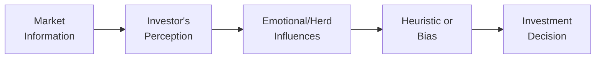

## 5.1 Introduction to Behavioural Finance

Behavioral Finance is kind of like that friend who taps you on the shoulder and says, “Hey, are you really sure you want to do that?” just as you reach for your third piece of chocolate cake—except here, the “friend” is your own brain telling you something about your financial decisions. Traditional finance theories assume that investors are rational beings who calmly evaluate risk and reward to make the best possible choices. But let’s be honest—we’re not robots. We’re human. We have emotions. We get overconfident or scared. We anchor on a headline from last week, or we cling to that time we got a fantastic return on a certain stock, ignoring signs of trouble.

Behavioral Finance helps us understand why our minds sometimes lead us astray when we invest, save, or manage money. It blends psychology and conventional finance to explain the (often surprising) ways in which we make decisions, revealing that many mistakes are not random but systematic—and, thankfully, avoidable. Here, we’ll explore how these insights apply to you as a financial professional serving clients in Canada. We’ll also look at practical strategies for helping clients make sound decisions and stay on track with their long-term goals.

Remember, for cross-reference in this Conduct and Practices Handbook Course (CPH®) offered by the Canadian Securities Institute (CSI), you might find it helpful to revisit Chapter 4 (particularly section 4.4 dealing with client interactions) to see how general guidelines and best practices work hand-in-hand with Behavioral Finance strategies.

---

Understanding Behavioral Finance becomes extra important when you consider your obligations under CIRO guidelines (the Canadian Investment Regulatory Organization, which replaced the former IIROC and MFDA in 2023). Canada’s national self-regulatory environment, shaped by CIRO, heavily emphasizes investor protection and suitability. Incorporating Behavioral Finance concepts into your advisory practice can help meet those regulatory expectations by ensuring you serve clients’ best interests—even beyond the purely rational realm.

Below, we’ll delve into the fundamental elements that define Behavioral Finance, focusing on how they challenge classical models, the significance of psychological biases and heuristics, and some real-world case studies you can use (or adapt) in client conversations.

---

Why Traditional Finance Doesn’t Have All the Answers

Traditional finance—rooted in theories like the Efficient Market Hypothesis (EMH)—assumes that stock prices factor in all available information at any given time. This perfectly rational world hypothesizes that investors process data with brilliant clarity and react in ways that align with expected returns. While this framework gave us valuable analytical tools (e.g., modern portfolio theory and CAPM), everyday experience tells us people don’t always behave according to logical financial equations. Just try recalling the last time markets dipped suddenly and everyone around you seemed to panic-sell at exactly the worst time.

Behavioral Finance steps in to say, “Uh, about that assumption that people are purely rational—maybe not.” It highlights systematic patterns in how investors might misjudge market signals or overreact to bad news. Rather than a one-off glitch, these behaviors repeat across millions of people, forming recognizable biases and heuristics.

---

Typical Mental Shortcuts and Emotional Influences

Heuristics are mental shortcuts that simplify decision-making. They’re not necessarily bad. In fact, we’d be overwhelmed if we had to methodically analyze every decision we face in a day. But in the context of finance—where real money is on the line—some heuristics lead to persistent errors. Here are a few you’ll likely encounter:

• Overconfidence: Ever feel you’ve got that special “knack” for picking winners? Overconfidence bias leads people to overestimate their expertise and underestimate risks.  
• Anchoring: Investors often latch onto an initial piece of information, like a purchase price, and base future decisions heavily on it—even if new, contradictory data emerges.  
• Availability: People rely on the most easily recalled info, such as recent headlines about market volatility, instead of historical data that paints a more accurate long-term picture.  
• Loss Aversion: Daniel Kahneman and Amos Tversky famously discovered that losses loom larger than gains psychologically. As a result, investors sometimes avoid logical risks or sell prematurely at a sign of trouble.  
• Herding: “Everyone is selling, so maybe I should too.” Social proof can override objective analysis, driving mass mania or panic.

When you’re an advisor, these biases don’t just show up in your clients—they show up in your own decisions too. Being mindful of them is the first step toward neutralizing their negative consequences.

---

How Behavioral Finance Intersects with Client Interactions

Behavioral Finance isn’t merely an academic curiosity; it’s super practical for advisors who want to truly serve their clients. In Chapter 4: Working with Clients, you’ll notice guidelines about retail client engagement, such as “know your client” (KYC) and ensuring the suitability of recommended products. Behavioral insights equip you with invaluable additional tools to fulfill these obligations.

By understanding an individual’s risk perception and emotional triggers, you can:

• Educate clients about common pitfalls. For example, letting them know about recency bias—where people weigh recent events too heavily—can encourage them to take a more balanced view.  
• Customize portfolio strategies. If a client is extremely sensitive to losses, you can design a nudge (explained below) to help them stay invested when markets get bumpy instead of panicking.  
• Communicate more effectively. Using plain language, storytelling, or visuals can reduce confusion and help clients avoid tuning out important details.

Furthermore, this knowledge fosters trust. Clients who know you understand their emotional drivers often feel more comfortable being transparent. This transparency helps you craft solutions that better align with their true risk tolerance and long-term objectives.

---

Heuristics, Emotions, and the Decision-Making Flow

To better visualize how emotional and cognitive biases might influence investor behavior, consider the following flowchart:

Explanation:
• Market Information: The constant stream of data, news, and events—everything from corporate earnings to interest rates.  
• Investor's Perception: The lens through which that information is interpreted—often colored by personal experiences.  
• Emotional/Herd Influences: Fear, greed, or groupthink that amplify or distort the investor’s view of reality.  
• Heuristic or Bias: Key mental shortcuts, like anchoring or overconfidence, shape how information is used.  
• Investment Decision: The final action—e.g., hold, buy, or sell—that can be more or less rational depending on how effectively these biases are managed.

---

Why Risk Perception Is So Subjective

One of the bedrock assumptions in classical finance is that risk can be measured objectively (using measures like volatility or beta). But from a behavioral standpoint, risk is in the eye of the beholder. Sure, we can quantify volatility, but how an individual feels about that volatility is heavily influenced by personal experiences, biases, and even social norms. Two clients might have the exact same net worth and investment timeline, yet one might see a 10% market dip as a golden opportunity, while the other views it as a catastrophic loss that triggers panic selling. This subjective spin on risk is something you must factor into your recommendations and communication.

---

Misconceptions That Lead to Suboptimal Outcomes

Here are a few real-life examples that illustrate common cognitive biases in Canadian markets:

• RRSP Overconfidence: A new investor has read about top-performing technology stocks. They load their entire RRSP into a single tech name, convinced of surefire high returns. They remain blind to diversification principles or cautionary signals—classic overconfidence.  
• Chasing Headlines: After seeing reports of a major correction in the energy sector, another investor sells all their stock holdings in petroleum companies. Later, it rebounds. They regret the rash decision—an example of availability bias, where dramatic news overshadowed long-term fundamentals.  
• Fear of Failure: A client nearing retirement invests in GICs exclusively despite having a moderate risk tolerance and 15+ years until they need most of their retirement funds. They cling to the safety of guaranteed returns, ignoring inflation risk. This is a mix of loss aversion and anchoring.

---

Practical Tools and Techniques

So, how do you as a professional encourage more rational behavior? Below are a few strategies:

Use “Nudges”
A nudge is a subtle suggestion or “default setting” that guides people toward better choices without limiting their freedom. For instance, setting up an automatic savings plan that withdraws a fixed amount each month could harness inertia for a good cause—helping a client build retirement funds without repeatedly making a conscious decision.

Reassess Risk Profiles Often
Client circumstances, market conditions, and individual biases can change rapidly. Check in periodically to ensure the recommended asset mix still reflects both the client’s factual risk capacity and emotional comfort zone.

Encourage Long-Term Discipline
Explain how short-term market noise can distract from long-term goals. Sometimes, referencing historical data from the Bank of Canada’s open-source databases (https://www.bankofcanada.ca/rates/) can help. Show them how markets have always had ups and downs, but historically, patient investors often do well.

Offer Simplified Explanations
Let’s not drown clients in complicated jargon. When you talk about standard deviation or alpha, tie it back to simple language—like “this measure tells us how bumpy the ride might be.” For more guidance, CIRO’s bulletins (https://www.ciro.ca/) or CSA publications often emphasize transparent disclosure and easily understandable explanations.

Leverage Real-Life Stories
It’s powerful to share short case studies. Maybe you’ve seen a past client panic-sell during a mild downturn only to regret missing the subsequent rebound. Stories anchor the lesson in memory better than a raw statistic—just be mindful to preserve confidentiality or anonymize any details as required by privacy rules (see Chapter 4.5 for more information on privacy obligations).

Check Yourself
We’re all susceptible to biases. It’s easy to overestimate your ability to read the market or to cling to a “favorite” recommendation. It helps to discuss your viewpoints with peers, read widely, and consult guidelines from regulatory bodies like CIRO or the CSA to keep yourself objective.

---

Application to Regulatory Responsibilities

Since January 1, 2023, CIRO has overseen all investment dealers and mutual fund dealers in Canada, replacing the historical IIROC and MFDA organizations. This integrated regulatory structure underscores a heightened focus on investor protection, transparency, and fiduciary care—a philosophical standpoint that aligns well with understanding and managing behavioral biases.

Furthermore, the Canadian Investor Protection Fund (CIPF) is now the single investor protection fund, providing coverage if member firms become insolvent. Encouraging clients to remain calm in the face of market disruptions can be easier if they’re aware they have CIPF coverage (subject to coverage limits) for their assets at a CIRO-regulated firm. But keep in mind that CIPF doesn’t shield them from market losses—only from insolvency scenarios.

From a compliance angle, identifying and mitigating behavioral pitfalls in client decision-making helps ensure that the advice you give is suitable and in the client’s best interest. It supports the concept of a client-centric approach, which is a cornerstone of ethical conduct (see Chapter 1 regarding Standards of Conduct and Ethics).

---

Case Study: Navigating Bias in a Typical Client Relationship

Imagine a scenario involving a mid-career professional named Sandra. She’s been reading sensational headlines about an apparent “looming crash.” Her stress levels are rising, and she’s ready to sell her equity mutual funds for safer government bonds. But her portfolio timeline is still a good 20 years until retirement, and she’s got a track record of success with moderate to balanced risk levels.

A conversation rooted in Behavioral Finance might go like this:

• Empathy: Acknowledge her emotional reaction. “I hear you’re concerned. Headlines can be scary.”  
• Education: Discuss recency bias—how the most recent news can overshadow a longer history of stable growth.  
• Reference Data: Show a chart of historical market recoveries from the past 40 years to highlight how dips have historically been followed by recoveries. You might consider official Bank of Canada data (https://www.bankofcanada.ca/rates/) to illustrate average returns over multiple economic cycles.  
• Nudges: Suggest an approach like scheduling regular portfolio reviews rather than making impulsive decisions. Setting up small automatic contributions each month might also help her dollar-cost-average into the market, reducing the perceived risk of a big investment at the wrong time.  
• Reassurance: If she’s still edgy, propose a slight rebalance to a slightly more conservative mix—maybe 70% equity, 30% fixed income—rather than 100% bonds. Emphasize her long horizon.  
• Result: Sandra feels heard and better informed. She stays invested, potentially avoiding a whipsaw effect.

By acknowledging and addressing her biases, you guide her toward a more rational path aligned with her actual time horizon and tolerance for risk.

---

Glossary of Key Terms

Behavioral Finance  
: The study of how psychology influences financial decisions, challenging purely rational models and exploring biases, heuristics, and emotional triggers that impact investors.

Heuristic  
: A mental shortcut or rule of thumb. Useful for quick decisions but can lead to errors in complex scenarios.

Cognitive Bias  
: A pattern of faulty thinking that distorts judgment. Examples include overconfidence, anchoring, and availability bias.

Efficient Market Hypothesis (EMH)  
: A traditional theory stating that asset prices reflect all available information and that it’s impossible to consistently outperform the market by exploiting price inefficiencies.

Rational Investor  
: The traditional finance archetype—someone who calmly calculates outcomes, weighs risk versus reward, and always makes the choice that maximizes their self-interest.

Systematic Bias  
: Predictable patterns where individuals deviate from rational thinking. These are not just random mistakes but are widespread enough to affect market outcomes.

Nudge  
: A subtle intervention that reshapes the decision environment to encourage certain choices without restricting options.

---

Where to Go for More Information

• Visit the CIRO website (https://www.ciro.ca/) for up-to-date regulations and bulletins.  
• Explore Canadian Securities Administrators (CSA) (https://www.securities-administrators.ca/) for official publications on investor psychology, guidelines, and disclosures.  
• For deeper dives into Behavioral Finance, check out “Thinking, Fast and Slow” by Daniel Kahneman, or “Nudge” by Richard Thaler and Cass Sunstein.  
• Consult open-source Bank of Canada data (https://www.bankofcanada.ca/rates/) to track historical market trends and use them to illustrate points to clients.  

Even if you don’t identify as a psychologist or sociologist, integrating these Behavioral Finance insights into your practice can go a long way. It strengthens trust, fosters better decision-making, and helps you meet high standards of conduct. And just maybe, it keeps you from letting your own brain’s quirks lead you astray in your personal investments, too.

---

## Test Your Knowledge: Behavioral Finance Biases and Strategies Quiz



### Behavioral Finance challenges which key assumption of traditional finance?

- [ ] Investors have infinite resources for data gathering.  
- [x] Investors always act rationally and process all information correctly.  
- [ ] Short-sellers are the only rational market participants.  
- [ ] The government sets market prices.  

> **Explanation:** Traditional finance assumes rational investors optimally use available information. Behavioral Finance highlights that real-world investors are subject to biases and imperfect decision-making.

### Which of the following best captures the concept of a “nudge”?

- [ ] Restricting an investor’s choice to only a handful of options.  
- [x] Subtly adjusting the decision environment to prompt more beneficial choices without limiting freedoms.  
- [ ] Encouraging risk-taking via high-pressure sales tactics.  
- [ ] Issuing negative warnings about potential market downturns.  

> **Explanation:** A nudge is a gentle intervention that reshapes an investor’s options or environment, helping guide them toward better decisions while keeping all options open.

### Which bias refers to focusing too heavily on recent information or events, often ignoring historical data?

- [ ] Anchoring  
- [ ] Loss aversion  
- [x] Recency bias  
- [ ] Confirmation bias  

> **Explanation:** Recency bias is when an investor weighs recent market events or headlines too heavily, forgetting the broader context or long-term data.

### What is a potential risk of overconfidence bias in investing?

- [x] Taking on excessive risk or failing to diversify properly.  
- [ ] Avoiding all stock investments due to fear.  
- [ ] Always selling too soon.  
- [ ] Over-analyzing and never making decisions.  

> **Explanation:** Overconfidence can lead investors to assume they know more than they actually do, potentially creating highly concentrated and risky portfolios.

### How does Behavioral Finance view risk differently from traditional finance?

- [x] Risk is partly subjective and shaped by individual perceptions and biases.  
- [ ] Risk is always equal for all investors regardless of time horizon.  
- [x] Risk can be influenced by psychological factors like fear or past experiences.  
- [ ] Risk is non-existent in fully diversified holdings.  

> **Explanation:** Behavioral Finance recognizes that risk assessment is subjective—biases, emotions, and personal experiences alter risk perception from one person to another.

### Which of the following is an example of anchoring?

- [x] An investor heavily relying on the original purchase price as the benchmark for selling.  
- [ ] An investor consistently sticking to bonds due to fear of loss.  
- [ ] An investor following the crowd’s sell-off during market turmoil.  
- [ ] An investor solely examining the past year’s returns.  

> **Explanation:** Anchoring involves using a specific piece of initial information (like the buying price) as an anchor for subsequent decisions.

### What role does empathy play in managing client biases?

- [x] It helps advisors acknowledge a client’s emotions, leading to trust and open communication.  
- [ ] It is unnecessary if the advisor has analytical data.  
- [x] It’s useful only after a large market crash.  
- [ ] It obstructs rational thinking.  

> **Explanation:** Showing empathy fosters trust. Clients who feel understood are more openly communicative, allowing advisors to address biases and steer them toward better decisions.

### Why are periodic reviews of a client’s portfolio especially crucial?

- [x] Client goals and market conditions can shift, requiring adjustments to maintain alignment with both rational and emotional risk tolerances.  
- [ ] Markets only move annually, so monthly reviews are unnecessary.  
- [ ] It’s legally required to call clients daily.  
- [ ] Once a plan is set, it should never be changed.  

> **Explanation:** Life changes, market shifts, and evolving biases demand regular reassessments. This ensures the portfolio stays suitable and meets the client’s objectives.

### How might a nudge enhance a participant’s saving behavior?

- [x] By automatically enrolling them in a regular contribution plan unless they opt out.  
- [ ] By limiting their freedom to invest in equities.  
- [ ] By mandating an immediate high-risk purchase.  
- [ ] By requiring them to pass a complex financial literacy test.  

> **Explanation:** Automatic enrollment in a savings plan is a classic example of a nudge. It harnesses inertia to promote beneficial behavior without excluding other choices.

### True or False: Behavioral Finance insights are only useful for client-facing roles, not personal investing.

- [x] True  
- [ ] False  

> **Explanation:** Actually, this is a trick statement. Behavioral Finance insights are valuable both professionally and personally. Advisors can benefit from recognizing cognitive pitfalls in their own investment decisions as well as those of their clients.


