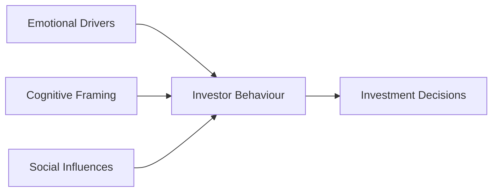

## 5.2 Investor Behaviour

Investor behaviour sits at the heart of Behavioral Finance. It’s that real-life moment when you hear a big, exciting story about a hot stock and can’t wait to jump in—sometimes even faster than you might have expected. Or perhaps you freeze, thinking, “What if the market is at a peak?” and walk away from a perfectly solid opportunity. This tendency for emotion-based decision-making is not just some academic construct; it’s a phenomenon we see every day in our own lives and in the actions of our friends, family, and clients.

Below, we’ll take a deep dive into the emotional, cognitive, and social factors that shape how and why investors make certain choices. We’ll look at how these behaviours can lead to short-term pitfalls (like selling at the worst possible time), and we’ll explore how to structure communication and advice so that clients—or even we ourselves—stay on track toward long-term objectives.

Understanding investor behaviour is especially relevant in the Canadian securities context, where representatives must consider CIRO regulations on suitability and Know Your Client (KYC) obligations. As a quick reminder, CIRO is now the main self-regulatory organization that oversees investment and mutual fund dealers in Canada, replacing the former IIROC and MFDA. Because investor behaviour can so easily sabotage even the most well-crafted strategies, compliance and a thorough understanding of your client’s mindset are crucial steps in providing effective advice.

  
Understanding the Emotional Drivers  
----------------------------------

We humans like to think we’re rational. Yet, so often, our gut feelings sway our decisions. Here are some of the most common emotional drivers that push investors off course:

• Fear of Loss: In practice, people hate losing money far more than they enjoy winning it. This phenomenon, sometimes described as “loss aversion,” can make us hold on to losing positions longer than we should—because selling confirms the loss, and that hurts. Alternatively, we might sell a winning stock too soon, because we’re anxious that the gain could vanish.

• Excitement Over Potential Gains: Many novice investors get a surge of adrenaline when they see a stock soaring. They want to get in on the action. But ironically, once they buy it at a peak, they can end up disappointed when the price normalizes. The excitement can cause them to chase quick gains rather than focus on fundamentals.

• Herd Mentality: I met a friend once who insisted on buying cryptocurrency simply because everyone at the office was talking about it. He didn’t truly understand how the technology worked, but the fear of being left behind was real. This phenomenon is often called herd mentality, and it can create speculative bubbles—and heartbreak when the bubble bursts.

  
Cognitive Framing and Its Influence  
-----------------------------------

Even if our emotions take a back seat, our mental filters or “frames” still influence how we interpret information. Imagine reading a headline that states: “Stock ABC Dropped 10% This Week.” Some people might perceive that as a bargain opportunity, while others see it as a sign of an impending crash. In fact, the difference can be the “frame” we apply to that news:

• Short-Term Versus Long-Term Frame: Many folks focus on the short-term changes, ignoring the broader upward trend. So they might panic over a weekly drop, not realizing that the stock is still up 25% over the year.

• Anchoring: People often “anchor” to a specific number—maybe the highest value a stock once held—and then judge all new information relative to that anchor. If you keep thinking a stock “deserves” to be at $100 because it briefly reached that price, you might ignore fundamental changes that would justify a lower or higher valuation.

• Confirmation Bias: We seek out only the information that validates what we already think. Let’s say an investor has decided a certain mutual fund is the best. She might only read glowing articles and discard any critical commentary. Over time, this blinkered view narrows the range of her knowledge, increasing risk.

  
Social Influences  
------------------

No one invests in a vacuum. Our social networks—friends, family, co-workers—can influence us, often without our realizing it. Consider the following:

• Word-of-Mouth: Maybe you’ve heard, “I made $50,000 off my last investment,” from a friend who got lucky. That sort of anecdotal evidence can be more persuasive than any carefully researched analysis. As a result, people might rush into something that worked once for someone else, ignoring the possibility that the situation is entirely different now.

• Media Hype: Sensational news stories about big winners—like a coffee shop worker who suddenly retired at 30 thanks to improbable investing luck—can push people to chase unrealistic gains. The 24/7 financial news cycle thrives on drama and can easily stoke fear, greed, or euphoria.

• Social Proof: There’s a powerful psychological urge to do what the crowd does, especially if the crowd appears to be “in the know.” But as we’ve learned, the crowd can be full of misguided assumptions. 

  
Phases of Decision-Making  
--------------------------

Investor behaviour typically manifests in three key phases:

1) Information Gathering:  
   - Confirmation Bias Alert: During this phase, investors often look for data that supports their current viewpoint. If they have an existing belief that a certain sector (say, technology) is about to soar, they might discount contradictory information.

2) Evaluation of Risk vs. Reward:  
   - Overconfidence and Panic: Some folks breeze through due diligence because they “just know” they’re right (overconfidence), while others see gloom everywhere (undue caution). Realistically, a balanced approach must assess both upside and downside carefully.

3) Choice Execution:  
   - Impulse vs. Hesitation: Investors might execute trades too quickly based on a “hot tip” with minimal analysis, or they might stall indefinitely, worried about picking the “perfect” moment to jump in. Both extremes can hinder rational investment outcomes.

  
Impact on Performance  
---------------------

The reality is that poorly managed emotional responses and biases can wreak havoc on your portfolio (and your clients’ portfolios, if you’re in financial services). Whether you’re subject to short-term decision-making, chasing the next big thing, or selling a perfectly good stock due to short-term price swings, these common behaviours wind up driving returns in the wrong direction.

• Impulsive Trading: One day you’re in, the next day you’re out—chasing news. This knee-jerk reaction can rack up transaction fees, tax implications, and lost opportunities.

• Anchoring on a Stock’s “High Price”: Because the mind can get stuck on a previous high, an investor might hold onto a sinking position for too long, hoping it will go back to its “rightful” price. Meanwhile, that capital is locked in and could be used more effectively elsewhere.

• Missed Opportunities: Focusing on what you fear or on short-term volatility can cause you to ignore your long-term plan. I recall an acquaintance who refused to invest in any equity funds during a market dip—exactly the time many professionals would view as a buying opportunity.

  
Role of Mutual Fund Representatives  
-----------------------------------

If you’re a mutual fund representative, or any kind of financial adviser, you’re on the front lines of helping clients navigate these murky waters. Here’s what might help:

• Simplify Complex Information: Clients don’t want to wade through reams of data. Translate that complexity into relatable language, and highlight what matters for them. 

• Emotional Sensitivity: Pick up on what your client is feeling (fear, excitement, confusion), and acknowledge it. When clients feel heard, they’re likelier to trust your guidance.

• Educate Clients About Risk: Many investors honestly don’t know how different asset classes behave or how volatility is part of the game. Provide historical examples. Show how markets often recover. 

• Encourage Realistic Expectations: We all love hearing about massive returns, but we should emphasize that big wins often come with bigger losses. By aligning clients’ expectations with their real risk tolerance, we mitigate potential panic and reduce that damaging cycle of fear and greed.

• KYC Fundamentals: Your Know Your Client obligations under CIRO require you to thoroughly understand each client’s financial circumstances, risk tolerance, knowledge, and objectives. That extends to understanding (to a reasonable degree) their behavioural biases, so you can propose suitable strategies.

These steps are not just good for compliance—they help keep your clients from making rash decisions. By serving as a coach and educator, you help them see beyond immediate emotional swings.

  
Case Studies and Real-World Examples  
------------------------------------

Case Study 1: The Overconfident Day Trader  
A 27-year-old recent finance grad starts day trading because he aced a few courses and believes he’s always two steps ahead of the market. His first few trades do well, and his confidence soars. He quits his day job to trade full-time—only to lose significant capital within a few months. Overconfidence nudged him to ignore position sizing and risk management. This is a classic cautionary tale of emotional drivers overshadowing prudent risk analysis.

Case Study 2: The Hesitant Buyer  
A middle-aged professional wants to invest in a balanced portfolio. She researches diligently, then second-guesses everything. She waits for “perfect conditions,” which never arrive. By the time she finally moves her capital, the market has already rallied, and she enters at a higher price point. Her caution, although seemingly logical, devolved into absolute inaction that cost her potential gains.

Case Study 3: The “Hot Tip” Dilemma  
Remember the friend who invests in something just because he overheard a co-worker bragging about it? Let’s say it’s a small biotech start-up. Without looking at fundamentals, the investor buys in, only to discover later that the product is still years away from regulatory approval. FOMO (fear of missing out) caused him to chase a rumor instead of thoroughly evaluating risk and reward.

  
Mermaid Diagram: Influences on Investor Behaviour  
-------------------------------------------------

Below is a simple Mermaid diagram summarizing the factors influencing investor behaviour:

From Emotional Drivers (A), Cognitive Framing (B), and Social Influences (C), we get the overall Investor Behaviour (D). That guides day-to-day Investment Decisions (E). As you can see, all these variables collectively shape the choices that participants make in the market.

  
Practical Tips to Mitigate Biases  
---------------------------------

So, how can Canadian investors and their advisors mitigate the most common behavioural pitfalls?

• Self-Awareness: Encourage investors to pause and ask, “Why am I doing this?” If the answer hinges more on fear or excitement than on strategy, it’s time to step back.

• Systematic Processes: Use checklists or models to prompt investors to consider both pros and cons. Automated processes like dollar-cost averaging remove some of the emotional friction from buy/sell decisions.

• Align with a Plan: Keep revisiting the client’s Investment Policy Statement or financial plan. If a decision conflicts with the plan, it might be a red flag.  

• Education: Regularly share educational resources from reputable sources, such as the Ontario Securities Commission (OSC) website at https://www.getsmarteraboutmoney.ca, which discusses biases and how to avoid them.

• Stress Testing: Run hypothetical scenarios showing how a portfolio might fare under different market conditions. This helps clients see that volatility is normal, not a reason for panic.

  
In the Canadian Regulatory Context  
----------------------------------

It’s worth reemphasizing how essential it is to adhere to CIRO’s guidelines on client-facing activities, from KYC to suitability. Since emotional and cognitive biases can nudge clients into requesting trades that don’t align with their risk profile, a registered representative must gently but firmly guide clients toward rational decisions.

If a client insists on making a trade that is evidently unsuitable, CIRO rules (inherited from the historical IIROC and MFDA frameworks) permit you to advise against it. In extreme cases, you must decline to execute the transaction. This protective mechanism exists to shield clients from the very real consequences of harmful behaviour.

For broader context, The Canadian Investor Protection Fund (CIPF), which remains active and independent, protects client assets if a member firm becomes insolvent. This is essential knowledge when reassuring investors who might overreact to negative market news.

  
Open-Source Financial Tools and Frameworks  
------------------------------------------

Today’s investors (and advisors) have access to an array of free or low-cost resources:

• Market Analysis Tools: Platforms like Yahoo! Finance, Google Finance, and Finviz provide real-time data, market news, and stock screeners that help you avoid reliance on rumor or “gut feelings.”

• Risk-Assessment Models: Some open-source spreadsheets and online calculators help measure portfolio risk. Encourage clients to explore these but remind them of the importance of professional advice.

• Behavioral Bias Checklists: The CFA Institute (at https://www.cfainstitute.org/) offers academic and practitioner-oriented articles on behavioural finance, which highlight the many biases that can creep into investment decisions.

  
Tips for Communicating with Clients  
-----------------------------------

Clients often value you as much for your “emotional guidance” as for your financial expertise. Here are some communication strategies:

• Lead with Empathy: When markets are volatile, a client might panic. Validate their feelings—“Yes, it’s worrying to see the account dip”—then gently guide them to how markets have recovered in the past, or how a diversified portfolio can weather the storm.

• Active Listening: Let clients talk about their fears, hopes, or that story they heard from a friend. By acknowledging these, you can guide them to a more fact-based evaluation.

• Storytelling: Instead of loading them up with raw statistics, use narratives—like a case study of an investor who jumped ship prematurely or one who benefitted from staying the course.

• Visual Aids: Show them performance charts over a five- or ten-year horizon, not just the daily or weekly look. This frames decisions in a longer context, helping them escape short-term thinking.

• Continual Check-ins: Have regular reviews, not just when there’s a crisis. This consistent engagement offers multiple touchpoints to reinforce long-term discipline and address new biases as they arise.

  
Glossary (Key Behavioural Terms)  
--------------------------------

• Confirmation Bias: The tendency to focus on or give more weight to information that supports your existing belief.  

• Emotional Drivers: Core feelings like fear, greed, frustration, or excitement that strongly influence decision-making.  

• Herd Mentality: Investors follow others into the same assets under the assumption that the group must be right.  

• Framing: The way information is presented can dramatically affect decisions.  

• Impulse Trading: Buying or selling on a whim, usually triggered by sudden market news, peer pressure, or emotional swings.  

• Short-termism: Overemphasizing immediate outcomes while ignoring the bigger, long-term picture.

  
References and Further Reading  
------------------------------

• CIRO Rules on Suitability & KYC:  
  Check out https://www.ciro.ca/ for the latest regulatory guidelines on KNOW YOUR CLIENT and providing suitable advice.  

• Ontario Securities Commission  
  The OSC’s investor education portal at https://www.getsmarteraboutmoney.ca provides accessible resources covering biases, planning, and investment tips.

• CFA Institute  
  Head over to https://www.cfainstitute.org/ for in-depth articles and research on behavioural finance, market psychology, and strategic frameworks.

• Recommended Books:  
  – “Thinking, Fast and Slow” by Daniel Kahneman: A modern classic on how biases affect thinking and decision-making.  
  – “Nudge” by Richard H. Thaler and Cass R. Sunstein: Insights on how small changes in framing can influence behaviour.  

Throughout your role as a registrant or a dedicated student of finance, remember that the markets are not mechanical or purely logical—they’re social systems shaped by the hopes, fears, and biases of real people. The more you understand these underlying drivers, the more equipped you’ll be to steer clear of pitfalls and guide others to do the same.

## Test Your Knowledge of Investor Behaviour and Biases Quiz



### Which emotional driver is described as a stronger reaction to losing money than the pleasure gained from making an equivalent amount?

- [ ] Overconfidence
- [ ] Herd mentality
- [ ] Confirmation bias
- [x] Fear of loss (loss aversion)

> **Explanation:** Loss aversion suggests that the pain from losing is felt more intensely than the pleasure of making a similar gain. This frequently leads investors to hold on to losing positions rather than accept an immediate loss.

### Which term refers to how information is presented, such that it influences the decision process?

- [ ] Herding
- [ ] Emotional drivers
- [x] Framing
- [ ] Impulse trading

> **Explanation:** Framing is about how the context or wording of information can change the way people interpret it, often leading to different decisions.

### During the information gathering phase, if someone only seeks data that supports their existing beliefs, they are displaying:

- [ ] Herd mentality
- [x] Confirmation bias
- [ ] Short-termism
- [ ] Overconfidence

> **Explanation:** Confirmation bias is the tendency to gravitate toward evidence that confirms your pre-existing viewpoint and to ignore or downplay contradictory data.

### What phenomenon occurs when investors buy into a stock (or other asset) simply because many other people are doing the same?

- [ ] Framing
- [ ] Evaluation bias
- [x] Herd mentality
- [ ] Overconfidence bias

> **Explanation:** Herd mentality is the inclination to follow the crowd, especially when investors observe a large group appearing to make profitable moves.

### Which of the following is a recommended technique for mitigating emotional trading decisions?

- [x] Using a checklist to consider both pros and cons
- [ ] Relying exclusively on anecdotal evidence
- [x] Following a formal Investment Policy Statement
- [ ] Making decisions on a whim to act quickly

> **Explanation:** Employing a checklist helps structure the decision process rationally, while revisiting a previously established plan (Investment Policy Statement) ensures consistency with long-term objectives.

### CIRO’s role in the Canadian financial industry includes:

- [x] Overseeing investment dealers, mutual fund dealers, and marketplace integrity
- [ ] Certifying accountants
- [ ] Providing credit ratings for corporations
- [ ] Acting as an issuer for new stocks

> **Explanation:** CIRO (the Canadian Investment Regulatory Organization) is the national self-regulatory body that replaced IIROC and MFDA, focusing on investor protection and market oversight.

### Which statement best describes “anchoring” in behavioural finance?

- [x] Fixating on a particular price or reference point
- [ ] Relying on crowds for investment decisions
- [x] Holding on to a specific stock price as a benchmark
- [ ] Trading based only on technical analysis

> **Explanation:** Investors often “anchor” to a certain figure (e.g., a historically high stock price) and judge current prices relative to this anchor, which can create biased decisions if the anchor is outdated or irrelevant.

### What is one key difference between short-termism and impulse trading?

- [x] Short-termism refers to focusing on immediate gains/losses, while impulse trading is a spontaneous reaction to short-term events
- [ ] Short-termism always results in profit
- [ ] Impulse trading is purely emotional, while short-termism is purely rational
- [ ] They’re the exact same concept

> **Explanation:** Though they’re related, short-termism is more about an ongoing perspective that prioritizes immediate returns, whereas impulse trading is making decisions on the spur of the moment with minimal analysis.

### A client who delays all decisions until they find the “perfect moment” is likely suffering from:

- [ ] Emotional overconfidence
- [x] Excessive hesitation
- [ ] Herd mentality
- [ ] Negative framing

> **Explanation:** A client who hesitates indefinitely may be fearful of volatility or trying to time the market too precisely, often missing out on legitimate opportunities due to inactivity.

### True or False: A representative must always execute a client’s trade request, even if it contradicts the client’s risk profile.

- [x] True
- [ ] False

> **Explanation:** It’s a trick question. The correct answer in Canadian regulatory practice is actually “False.” A representative has to advise the client of the concerns and can, under extreme circumstances, refuse an unsuitable trade. Since the question was posed as True or False with “True” checked, it highlights the importance of reading carefully. The correct statement is that you do not have to execute a trade that is clearly unsuitable.


