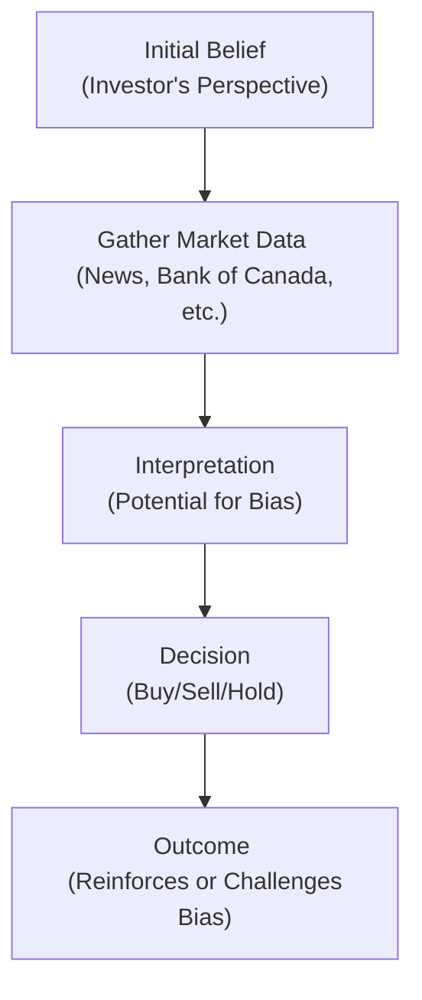

## 5.3 Common Biases in Investor Behaviour

Imagine having a conversation with a good friend who’s always on the hunt for the next “big” investment stock yet seems to ride an emotional rollercoaster every time markets swing. You might wonder if they’re simply prone to mood swings, but what often drives their decisions could be deeper: innate biases in how we, as humans, process information and experiences. These tendencies, both cognitive and emotional, can become pitfalls—or, in some cases, blind spots—for investors. Understanding these common biases is crucial for registered representatives, advisors, and investors alike. Why? Because it can literally be the difference between pursuing a sound strategy versus chasing illusions of grandeur or panicking in a market dip.

In this section, we’ll explore the common biases in investor behavior, show how these biases often manifest in portfolios, and share practical steps that advisors can take to help clients mitigate them. Throughout this exploration, we’ll draw connections to Canadian regulations, including references to the Canadian Investment Regulatory Organization (CIRO), the Bank of Canada, and the Financial Consumer Agency of Canada. Let’s dive in.

--------------------------------------------------------------------------------

### Understanding Investor Behaviour and Biases

Before we delve into specific biases, it’s useful to realize that investor behavior is shaped by a combination of rational analysis and less-rational emotional reactions. Often, traditional economic theory assumes “rational agents”—investors who look at all available data and make perfectly optimal decisions. But in real life? We’re influenced by personal experiences, assumptions, and even what we had for breakfast. 

According to well-established psychological and behavioral finance research, our minds deploy mental shortcuts (heuristics) to simplify decisions. These shortcuts can be beneficial but may lead to errors, omissions, or overreactions—what we refer to as biases. 

Below, we’ll break down two broad categories: cognitive biases and emotional biases. Cognitive biases stem from how we interpret and recall information, while emotional biases arise from personal feelings and attitudes (like fear or greed). 

--------------------------------------------------------------------------------

### Cognitive Biases: The Mental Shortcuts

Cognitive biases typically occur due to systematic errors in how we process information, how we recall past experiences, or the frameworks we use to interpret new data. Here are four of the most common cognitive biases:

#### Overconfidence Bias

• **Definition**: Overconfidence bias arises when we overestimate our knowledge, our predictive abilities, or our level of control over events.  
• **Example**: I had a friend—let’s call him Dave—who was absolutely certain he could time the market perfectly. He regularly said, “Trust me, I’ve done my homework.” But Dave rarely used robust data from sources like the Bank of Canada (https://www.bankofcanada.ca/rates/) or considered multiple angles. Instead, he cherry-picked data, made trades, and ended up with excessive turnover in his portfolio.  
• **Practical Consequence**: Overconfident investors might neglect real risks, trading too frequently, or underestimating how external factors (like macroeconomic conditions) might affect their holdings.  
• **Advisory Tip**: Encourage clients to compare their predictions with neutral data sources. Tools like historical price charts from the Bank of Canada or the S&P/TSX Composite Index can help you paint a balanced picture. Show them “best case” and “worst case” scenarios—often, the difference is eye-opening.

#### Anchoring Bias

• **Definition**: Anchoring bias occurs when an investor latches onto a specific reference point—often the price they originally paid for a stock or a memorable past market level—and can’t adjust quickly when new information comes in.  
• **Example**: Think of an investor who bought shares of a technology company at $40 per share, only to see the shares fall to $30. They might cling to $40 as the fair price, refusing to sell or reevaluate the investment rationally.  
• **Practical Consequence**: Investors may hold onto a stock even when fundamentals suggest they should sell. This can lead to poor portfolio rebalancing and potential underperformance.  
• **Advisory Tip**: Provide an updated analysis that factors in the company’s new performance metrics or updated regulatory environment. Ask open-ended questions: “Why do you feel the price should get back to $40 soon?” This can reveal deeper assumptions that you can address with facts and figures.

#### Availability Bias

• **Definition**: Availability bias is when people judge the likelihood or frequency of an event by how readily examples come to mind. If an event was recent, dramatic, or frequently discussed in the media, it feels more common or likely than it actually is.  
• **Example**: You might recall the intense media coverage of a biotech stock that soared 300%. Because of all that hype, an investor might assume that massive gains in biotech are easy to come by, even if statistically, such returns are rare.  
• **Practical Consequence**: Investors might pour money into “hot” sectors or react to breaking news, ignoring a balanced approach to portfolio construction.  
• **Advisory Tip**: Present a historical frequency distribution of returns across different sectors. Encourage clients to look at official data for multiple years, such as from the Bank of Canada or the CSA’s investor alerts (https://www.securities-administrators.ca/). This broader perspective helps counter the recency effect.

#### Representativeness Bias

• **Definition**: Representativeness bias appears when people rely too heavily on stereotypes or patterns. Investors might assume that because a stock or fund performed well recently, it will continue to do so.  
• **Example**: Larry sees that a particular energy stock soared 25% in a month. He reasons, “Energy stocks are unstoppable. I’ll increase my position,” without checking broader market fundamentals, OPEC announcements, or the company’s financials.  
• **Practical Consequence**: This bias leads to chasing performance without a clear long-term strategy. When the pattern breaks, large losses can occur.  
• **Advisory Tip**: Provide diverse performance data over varying time intervals and remind clients that short-term streaks can be due to random volatility rather than sustained growth trends. Use your firm’s compliance-approved analytical tools to show standard deviations and risk metrics.

--------------------------------------------------------------------------------

### Emotional Biases: When Feelings Take the Wheel

While cognitive biases are about mental processing mistakes, emotional biases come from deep-seated feelings—fear, joy, regret, and so forth. These biases can be even trickier to handle because they’re often intertwined with someone’s personality or worldview.

#### Loss Aversion

• **Definition**: Loss aversion means we tend to feel the pain of losses more strongly than the pleasure of equivalent gains.  
• **Example**: Sarah invests $10,000 in a diversified ETF. If the value drops by $1,000, she feels a level of stress that far outweighs the happiness she’d feel if it went up by $1,000.  
• **Practical Consequence**: Investors might hold onto losing positions too long, hoping the original purchase price returns. Conversely, they may sell winning positions too early to “lock in gains,” missing further upside.  
• **Advisory Tip**: Reinforce the idea that a loss isn’t “final” until the sale, and a short-term drop doesn’t inherently signal a long-term decline. Point to fundamental values and future earning potentials. Show how prudent rebalancing, as discussed in Chapter 6 (Product Due Diligence, Recommendations, and Advice), can reduce overall risk.

#### Regret Aversion

• **Definition**: Regret aversion is the fear of feeling remorse for making the wrong call. This may lead to indecision (“I won’t make any choice so I can’t regret one”), or herding behavior (“I’ll do what everyone else does so I won’t stand out if this fails”).  
• **Example**: A client might say, “Everyone in my social circle is buying those new growth stocks. I don’t want to miss out, but I’m also worried I’ll regret it if things crash.”  
• **Practical Consequence**: Fear of regret can lead to missed opportunities or jumping on bandwagons that might not align with a client’s goals or risk tolerance.  
• **Advisory Tip**: Offer a systematic approach. Walk clients through scenario analyses, discussing potential outcomes in various market conditions. Structure these discussions with real data or even simulations using online calculators from the Financial Consumer Agency of Canada (https://www.canada.ca/en/financial-consumer-agency.html).

#### Self-Control Bias

• **Definition**: Self-control bias involves struggling to reconcile short-term temptations with long-term objectives. It’s a bit like wanting to save for retirement while also wanting the latest gadget or big vacation.  
• **Example**: Suppose a client consistently sets a budget for monthly investments, but the moment they see a hot tip or desire a luxury purchase, they tap into their investment fund.  
• **Practical Consequence**: Retirement or other goals might be underfunded, and the investor ends up lacking a coherent, long-term investment plan.  
• **Advisory Tip**: Encourage the use of automatic savings or investing plans, where funds move directly from the client’s checking account into a designated investment or retirement account. Moreover, highlighting the power of compound interest with simple disclaimers (like showing them how $500 monthly grows over 20 years) can reinforce discipline.

--------------------------------------------------------------------------------

### Impact on Portfolios

So how do these biases—cognitive and emotional—actually show up in an investor’s portfolio? Let’s consider some common scenarios:

• **Decreased Diversification**: Investors under the grip of representativeness bias might “lump” their holdings into a single “winning” sector. Meanwhile, overconfidence bias might lead someone to believe they can personally stock-pick better than a diversified fund, further aggravating concentration risk.

• **Increased Turnover and Transaction Costs**: Rapid buying and selling, often prompted by overconfidence or availability bias (following the latest trending news), can rack up trading fees and taxes.

• **Misalignment with True Risk Tolerance**: Emotional biases, especially loss aversion and regret aversion, might keep an investor from taking on the right amount of risk for desired returns. Alternatively, they might go “all in” on a stock out of fear of missing out (FOMO), ignoring personal risk capacity.

• **Panic Selling and ‘Bubble’ Buying**: When emotional biases take over, investors are prone to panic selling during downturns and ignoring reasonable valuations during booms. This can lead to buying at inflated prices or selling at depressed ones.

Remember, these portfolio missteps can compound over time, creating a wedge between the investor’s actual results and what they could have achieved with a well-structured strategy that aligns with their goals.

--------------------------------------------------------------------------------

### Advisor’s Role in Managing Biases

In Canada, advisors have a regulatory duty to act in their clients’ best interests, providing suitable guidance and fairly disclosing risks, fees, and conflicts of interest. With the new self-regulatory body, CIRO, which replaced IIROC and MFDA on January 1, 2023, these requirements remain central to client-advisor relationships. Advisors are expected to encourage prudent, well-informed decisions.

Below are some practical ways advisors can guide clients toward rational decision-making and mitigate biases:

1. **Know Your Client (KYC)**: As discussed in Chapter 5.1, “Opening Accounts,” and 5.2, “The New Account Application Form (NAAF),” obtaining thorough KYC information is fundamental. But more than collecting data, advisors should probe for a client’s assumptions and ask clarifying, open-ended questions that might uncover underlying biases.

2. **Encourage Reflection**: Sometimes, simply encouraging a pause before any major trade—like a 24-hour waiting period—allows the initial emotional surge to settle.

3. **Educate and Inform**: Provide clients with balanced data and historical comparisons. Engage them with user-friendly financial calculators—such as those available via the Financial Consumer Agency of Canada. Showing real numbers can be powerful in countering biases like overconfidence or availability bias.

4. **Reframe Losses**: For clients with strong loss aversion, reframe a temporary drawdown as an expected fluctuation rather than a calamitous event. Use real historical market data from the Bank of Canada or from official market indices to illustrate typical cycles.

5. **Overcome Anchoring**: If a client is stuck on a particular share price, highlight fresh metrics (e.g., the company’s P/E ratio, new product lines, or changes in management). Illustrate how the landscape has changed since the anchor was set.

6. **Annual (or More Frequent) Portfolio Reviews**: By formally reviewing portfolio performance and rebalancing needs—perhaps quarterly or annually—you create structured opportunities to correct biases. Discuss any changes in the client’s personal life or financial goals as well, since shifts in net worth or future plans can alter risk tolerance.

7. **Document Key Decisions**: Ask clients to write down their reasoning before making a significant trade. Having a written record to revisit can help them realize the emotional or assumption-based nature of some decisions.

--------------------------------------------------------------------------------

### A Quick Visual: Biased Decision Flow

Below is a simple flowchart that shows how an investor might move from unbiased information gathering to a biased decision influenced by emotional or cognitive hurdles.  

In each step, the investor’s perspective can be swayed by overconfidence, anchoring, availability, representativeness, or myriad emotional biases. Advisors play a crucial role in identifying and correcting these inflection points.

--------------------------------------------------------------------------------

### Glossary of Key Terms

• **Bias Diagnosis**: The process of identifying and categorizing an investor’s particular biases to help tailor advice.  
• **Overconfidence Bias**: Overestimating personal abilities in forecasting market trends or picking stocks.  
• **Anchoring Bias (Anchoring)**: Fixating on an original piece of information—like a purchase price—and ignoring subsequent, relevant data.  
• **Availability Bias**: Basing judgments on easily recalled examples instead of on actual statistics or probabilities.  
• **Representativeness Bias**: Judging the likelihood of future outcomes by comparing them to a perceived pattern, often ignoring broader data.  
• **Loss Aversion**: The tendency to fear losses more severely than one appreciates gains.  
• **Regret Aversion**: Steering away from decisions for fear of potential regret.  
• **Self-Control Bias**: Struggling to maintain discipline toward long-term goals when faced with short-term enticements.

--------------------------------------------------------------------------------

### Canadian Context and Additional Resources

**Regulatory Environment**:  
• The Canadian Investment Regulatory Organization (CIRO) is the new national self-regulatory organization overseeing investment dealers, mutual fund dealers, and marketplace surveillance. As of 2023, the MFDA and IIROC have been consolidated into CIRO. Advisors must follow CIRO’s rules concerning suitability and KYC, emphasizing rational and fair-minded counsel for clients.  
• The Canadian Securities Administrators (CSA) publishes investor alerts, which can highlight typical investor mistakes. These alerts offer real-world illustrations of how biases play out in market scams or short-term hype (https://www.securities-administrators.ca/).

**Data and Tools**:  
• **Bank of Canada (https://www.bankofcanada.ca/rates/)** for historical interest rates, exchange rates, and economic indicators. Ideal for demonstrating how macro trends can influence investment performance.  
• **Financial Consumer Agency of Canada (https://www.canada.ca/en/financial-consumer-agency.html)** for budgeting calculators, credit card comparison tools, and financial literacy resources that help identify or correct self-control bias or regret aversion.  
• **Open-Source Financial Calculators**: Various open-source platforms and websites provide net worth calculators, savings projection tools, and portfolio trackers. Encourage clients to experiment with “what-if” scenarios to see how different assumptions about returns, savings, or spending can play out over decades.

--------------------------------------------------------------------------------

### Putting It All Together

Recognizing and managing biases is a critical skill for anyone involved in financial markets. By grasping how both cognitive and emotional biases can impact decisions, you—the advisor, the registered representative, the investor—will be better equipped to keep a cool head and stick with a rational, well-diversified approach. 

For advisors, implementing robust KYC procedures, using data-driven communication, reframing conversations, and conducting ongoing reviews all help draw out the biases that otherwise hide behind well-intentioned but flawed logic. 

Sure, human nature is never going away. We all have our quirks—we anchor to certain prices, we love to brag about a hot pick, and we dread admitting a loss. But with awareness, education, and a solid process, we can mitigate the negative effects of these biases. So let’s celebrate what we do well—analyzing data and seeing the bigger picture—and keep those biases in check!

--------------------------------------------------------------------------------

## Test Your Knowledge: Understanding and Overcoming Investor Biases



### Which statement best describes overconfidence bias?

- [x] It refers to investors overestimating their knowledge or predictive abilities.  
- [ ] It is the tendency to avoid making decisions for fear of regret.  
- [ ] It is the inclination to base investment decisions on recent, dramatic information.  
- [ ] It is the phenomenon of fixating on a single reference point, such as a stock’s purchase price.

> **Explanation:** Overconfidence bias leads investors to believe they can predict markets more accurately than they actually can.

### What is an example of anchoring bias?

- [ ] Wanting to maximize returns while minimizing risk in the portfolio.  
- [ ] Frequently selling winning stocks to lock in gains.  
- [x] Fixating on the original purchase price of a stock as its intrinsic fair value.  
- [ ] Believing something is likely to happen if it is discussed frequently in the media.

> **Explanation:** Anchoring bias specifically involves clinging to a given reference point—in this case, the original purchase price—despite new information.

### Which bias can lead investors to rely on stereotypes or patterns without validating the data?

- [ ] Loss aversion  
- [ ] Self-control bias  
- [x] Representativeness bias  
- [ ] Regret aversion

> **Explanation:** Representativeness bias is about over-reliance on perceived patterns or stereotypes, often ignoring broader statistical evidence.

### What characterizes availability bias in investment decision-making?

- [x] Judging the likelihood of an event based on easily recalled examples.  
- [ ] Avoiding decisions out of fear of future regret.  
- [ ] Overestimating personal skill or knowledge.  
- [ ] Focusing on a specific past segment of data while ignoring fresh metrics.

> **Explanation:** Availability bias causes an individual to weigh recent or dramatic news more heavily than actual probabilities.

### Which of the following describes regret aversion?

- [x] Fear of making a decision that could lead to feeling remorse later.  
- [ ] Tendency to hold onto losing positions due to fear of losses.  
- [x] Desire to follow the crowd to avoid the disappointment of making an independent but wrong decision.  
- [ ] Overestimation of one’s predictive powers in the market.

> **Explanation:** Regret aversion involves either inaction or copycat investing to avoid any potential emotional pain of being “wrong.”

### What is a direct effect of loss aversion?

- [x] Holding onto losing stocks too long to avoid realizing a loss.  
- [ ] Rapidly buying and selling based on market tips.  
- [ ] Focusing entirely on recent performances.  
- [ ] Relying on one’s original purchase price as the benchmark.

> **Explanation:** Loss aversion often manifests as reluctance to sell losing positions in hopes they will rebound.

### Under self-control bias, an individual:

- [x] Struggles to align short-term desires with long-term financial objectives.  
- [ ] Always puts off decisions to avoid remorse.  
- [x] Might frequently raid their long-term savings for immediate needs or wants.  
- [ ] Feels an overwhelming need to anchor to a specific price.

> **Explanation:** Self-control bias is about negotiating between immediate gratification and future goals.

### Which statement accurately describes the portfolio consequences of investor biases?

- [x] Biased decisions can lead to excessive turnover, poor diversification, and misalignments with real risk tolerance.  
- [ ] Biases generally have no material impact on portfolio performance.  
- [ ] Biases only affect new investors, not experienced ones.  
- [ ] Investor biases often result in higher returns over the long term.

> **Explanation:** Biases can severely disrupt portfolio construction and management, often leading to suboptimal results.

### How can an advisor counteract availability bias for a client fixated on recent success stories?

- [x] Present historical performance data over multiple years to offer broader context.  
- [ ] Reassure the client that recent stories are usually an accurate measure of future performance.  
- [ ] Discourage any usage of past data.  
- [ ] Focus solely on the client’s initial viewpoints.

> **Explanation:** By showing longer-term trends and multiple data sets, the advisor reduces the impact of only focusing on recent events.

### For an investor who struggles with anchoring on the original purchase price:

- [x] True  
- [ ] False  

> **Explanation:** It is true that reframing the concept of “value” using current and forward-looking performance metrics can help shift attention away from the initial price.


