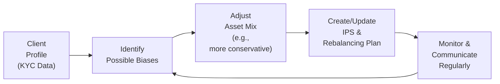

## 5.3 How do Representatives Apply Bias Diagnoses when Structuring Asset Allocations?

Sometimes, we wish we could just hand someone a questionnaire, type the results into a neat spreadsheet, and—voilà—instant perfect portfolio. But you know, real life gets a bit more complicated. People don’t always behave like tidy Excel formulas. We’re emotional creatures, after all. That’s why, in addition to collecting the standard risk tolerance, investment objectives, and time horizons, you as a representative must dig a little deeper. Cognitive and emotional biases can easily influence how clients make decisions, often overshadowing logic and reason.

Maybe you’ve experienced situations where a client who claims to be risk-tolerant suddenly wants to pull everything out of equities during a market dip. Or a colleague brags nonstop about the latest “hot stock” gains, then gets blindsided when the trend reverses. We can all get stuck in patterns—sometimes unconsciously. The challenge is how to spot these biases and then structure asset allocations in a way that respects both the client’s well-being and your regulatory obligations under the Canadian Investment Regulatory Organization’s (CIRO) guidelines.

This section covers essential best practices and practical tools for diagnosing and managing client biases. We’ll look at how you can incorporate these findings into asset allocation decisions, ensuring you align with suitability standards while keeping your clients on track toward their goals.

**Identifying Client Biases**

Biases show up in all shapes and sizes: recency bias, loss aversion, confirmation bias, overconfidence, and so on. Each can wreak havoc if left unchecked. For instance:

• A client prone to extreme fear of loss (loss aversion) might jump ship at the slightest market wobble.  
• Another client might ignore historical data because they’ve gotten swept up in the excitement of recent performance (recency bias).  
• Someone else could overemphasize their stock-picking prowess, ignoring external factors that contributed to good returns (overconfidence).

You might wonder: “How do I even start identifying such biases?” One of the first steps is to refine your existing KYC (Know Your Client) approach. Asking those scenario-based, open-ended questions can uncover underlying fears and typical reactions. Let’s say you ask: “How did you feel in 2008 when the markets dropped sharply?” or “If your portfolio declined by 15% in a month, how would you respond?” Their answers can be eye-opening. And don’t forget that a client’s biases can evolve as personal or economic circumstances change, so it’s wise to revisit these discussions periodically.

**Using Structured Interview Techniques**

Retain the standard risk profile questionnaire, of course, but integrate more dynamic questions:

• Scenario Explorations: “Walk me through your thought process during significant market events. Did you consider selling everything, or did you buy more?”  
• Emotional Trigger Queries: “What news headline or market fluctuation worries you?”  
• Herding Tendencies: “Have you ever followed a friend or coworker’s investment tip that didn’t quite pan out?”

You can also pepper in some hypothetical narratives—like “Imagine you had an opportunity to invest in a tech startup because all your neighbors did—would you feel left out if you didn’t?” This might reveal a herding inclination or fear of missing out (FOMO). All these bits and pieces help you tailor a portfolio that accounts for real-world investor quirks.

**Client Profile Spotlight**

Consider a client who’s highly loss-averse. Even if your formal risk questionnaire says they can handle moderate volatility, you’ve probably noticed they fall apart at even small losses. That’s a big red flag. In that case, a more conservative portfolio allocation might be appropriate, at least initially. Gradually, as they gain confidence, you could introduce slightly riskier assets that align with their long-term goals. Conversely, if someone focuses heavily on the hottest recent returns, you might suspect recency bias. Show them long-term data, diversifying performance charts, and point out how “hot” sectors can cool off dramatically.

**Tools and Strategies for Implementation**

So you’ve identified some biases. Now what? It’s easy to highlight them in a meeting but more challenging to follow through and shape your recommendations consistently. Several concrete tactics are effective:

• **Systematic Rebalancing:**  
  This one’s golden. The idea is to set a specific schedule—quarterly, semi-annually, or annually—where you rebalance the client’s portfolio back to the strategic target. This approach nudges them to sell a bit of what’s performed strongly (and may now be overweight) and buy what’s lagged (and may now be underweight). By automating this process, you reduce the impact of herding bias or status quo bias. After all, you’re not deciding to buy or sell based on the latest hype; you’re doing it because your policy says something like, “If equities exceed 60% of the portfolio, trim back to 50%.”

• **Investment Policy Statement (IPS):**  
  This document is your anchor in the storm. It sets out the client’s objectives, constraints, and the overarching asset mix strategy. If recency bias tempts a client to chase a trendy asset class—like piling into cryptocurrency at its peak—the IPS can remind everyone, “Hey, remember: our long-term plan states a 10% maximum for speculative assets.” So any dramatic pivot outside your planned mix requires a formal review process (and sometimes a reality check).

• **Portfolio Diversification:**  
  Diversify across asset classes, sectors, and geographies. Most biases push clients to over-concentrate, whether that’s in a favorite sector or an asset that just soared. Diversity helps mitigate the emotional pull to go all-in on one bet. It also spreads risk, thereby reducing the anxiety that might trigger biases like panic selling.

• **Ongoing Education and Communication:**  
  Perhaps the biggest factor is consistent communication. Show clients regular performance reports that place short-term fluctuations in a bigger context. Discuss market cycles, historical averages, and the reasons behind your portfolio choices. In times of volatility, additional phone calls or check-ins can reassure them that dips are normal. Education is just huge. If your client understands the rationale behind every decision, they’ll be less likely to act impulsively.

Below is a simple diagram illustrating how you might integrate bias awareness into the overall asset allocation process:

As shown, it’s a feedback loop. You circle back to identify new biases or confirm whether existing biases have softened. Asset mixes are reassessed in light of ongoing data, and the cycle continues.

**Regulatory Perspective and CIRO Guidelines**

From a regulatory standpoint, CIRO requires that you make suitable investment decisions and recommendations. They also expect you to act fairly, honestly, and in good faith. Incorporating behavioral insights is not only beneficial for the client’s financial health but also helps you defend your choices as truly suitable. When you document that “Client X displayed extreme concern over market fluctuations, so we crafted a more conservative portfolio than standard practices might suggest,” it shows conscientiousness and compliance with fiduciary principles.

The updated proficiency model proposed by CIRO emphasizes the importance of advanced knowledge in areas like behavioral finance. In other words, the regulatory environment is encouraging reps to get more savvy about how real people behave in real markets. This skill set is becoming integral to providing robust client service in line with CIRO’s expectations. So, it’s not just about building a sharper relationship with your clients; it’s also about meeting the industry’s evolving standards.

**Case Study: Handling a Fearful Investor**

Let’s see how all of this might play out in practice. Suppose you have a client, Rachel, who’s well-equipped financially to invest aggressively—she’s got a long time horizon, a stable income, and no immediate need for liquid cash. A risk tolerance questionnaire might place her squarely in a “growth” category (e.g., 70% equities, 30% fixed income). But in your conversations, Rachel constantly mentions how nervous she gets whenever she reads about market downturns, how she once experienced a drop in her investment account years ago, and how she never wants to go through that again.

Right there, you have a recipe for loss aversion. Rather than ignoring it and passing it off as just “investor jitters,” you decide to lean into a more balanced or even slightly conservative approach, maybe 50% equities instead of 70%. You also draft an IPS that includes a “panic plan”—outlining that if markets correct by more than 10%, you and Rachel will have a quick check-in call instead of automatically selling. You also set up systematic rebalancing, so in times of big market waves, the portfolio automatically realigns. By implementing these elements, you show that you’ve recognized her underlying bias and taken appropriate steps.

**Practical Elements of Structuring the Portfolio**

• **Gradual Introduction to Risk:** If you discover a major bias, you might implement risk assets (like equities) in phases rather than a lump sum. This approach eases the client into the market and builds trust.  
• **Use of Open-Source Tools:** The Canadian Financial Literacy Database (https://itools-ioutils.fcac-acfc.gc.ca/) offers free calculators. You can plug in different allocations, see hypothetical returns, and share these results with the client to illustrate risk-return differences.  
• **Backup Plans:** Keep some “dry powder” (cash or equivalents) if the client’s anxiety is high. This helps them feel secure and can be deployed if a downturn presents a buying opportunity.

**Herding Bias Example**

Alternatively, let’s say you have a client, Ibrahim, who always brings up what his circle of friends is doing. He invests when they invest, sells when they sell, and praises their stock picks. Now, obviously you’ll want him to find some independence in his decisions. One method is to show him how your recommended allocation differs from the crowd, but back it up with data. A diversified asset allocation plan can highlight that while a single stock might have soared this month, over a longer period, a broad-based ETF or properly diversified mutual fund might provide comparable or better returns with lower volatility. You might also schedule more frequent updates with him, so the next time a friend claims “Tech is the only place to be,” you can calmly illustrate the big picture.

**Additional Resources and References**

• **CIRO:** Stay updated with CIRO’s bulletins on suitability, ongoing obligations, and investor protection (https://www.ciro.ca).  
• **CFA Institute:** The CFA Institute has various educational materials and case studies on behavioral finance and asset allocation (https://www.cfainstitute.org/).  
• **Canadian Financial Literacy Database:** Use the free interactive tools and resources to demonstrate different asset mixes (https://itools-ioutils.fcac-acfc.gc.ca/).  
• **Academic Journals:** For advanced exploration, check out the Journal of Behavioral Finance or the Review of Financial Studies. They regularly publish research on biases and market behavior.  
• **Books:** “Thinking, Fast and Slow” by Daniel Kahneman is a classic that delves deeply into cognitive biases. Another great read is “Nudge” by Richard H. Thaler and Cass R. Sunstein.

**Tying It All Together**

Integrating bias awareness into asset allocation decisions is partly an art and partly a science. The “science” aspect comes from your formal risk assessments, standard portfolio construction theory, and the rebalancing rules you set. The “art” is about being attentive to your client’s emotional triggers, life experiences, personality quirks, and personal biases. You might think it’s a lot of extra work, but in reality, it’s an investment in a deeper client relationship and better portfolio performance down the line. After all, the best plan in the world doesn’t help if the client abandons it during challenging times.

Of course, you have regulatory obligations to meet. CIRO is keenly interested in seeing that reps act in good faith and provide sound, suitable advice—even more so now that the lines between purely quantitative and behavioral aspects are blurring. But if you keep that synergy in mind—merging good compliance practices with strong behavioral finance insights—you’ll have a powerful foundation for building portfolios that your clients can stick with through thick and thin.

And hey, if you’re ever in doubt, remember that gentle reminders about diversification, ongoing education, and disciplined rebalancing can go a long way toward cooling off overheated investor psychology. It’s not about being an all-knowing guru; it’s about empathetically guiding clients, diagnosing bias, and taking steps that protect them from emotional whiplash.

------

## Mastering Bias Diagnoses for Successful Asset Allocations Quiz



### Which of the following best describes a primary reason for going beyond standard risk questionnaires when structuring asset allocations?

- [x] Clients’ emotional or cognitive biases might skew their decision-making.
- [ ] Compliance requirements alone are sufficient for ensuring proper KYC procedures.
- [ ] All clients share similar patterns in behavior and risk tolerance.
- [ ] There is no real value in exploring non-quantitative data.

> **Explanation:** Cognitive and emotional biases often influence how clients actually behave in unpredictable markets, so collecting deeper qualitative information is essential.

### How can a representative uncover a client’s herding tendencies?

- [x] By asking open-ended questions about whether they’ve followed friends’ or colleagues’ investments.
- [ ] By only using standard multiple-choice questionnaires.
- [x] By presenting hypothetical investment scenarios and gauging the client’s reaction based on peers’ actions.
- [ ] By relying on historical trading records alone.

> **Explanation:** Clients may follow trends set by friends or online communities, so focusing on scenario-based or open-ended questions helps identify this bias.

### What is one of the key benefits of systematic rebalancing?

- [x] It enforces a disciplined method of selling high and buying low.
- [ ] It guarantees a higher return than any single asset class.
- [ ] It is required by law under CIRO regulation.
- [ ] It forces clients to only hold fixed-income assets in a bear market.

> **Explanation:** Systematic rebalancing helps maintain the target asset allocation, often selling top performers to buy underperformers, reducing the impact of biases like status quo and recency bias.

### How can an Investment Policy Statement (IPS) help mitigate recency bias?

- [x] It provides a predetermined framework that guides long-term portfolio decisions regardless of short-term performance.
- [ ] It automatically adjusts the client’s portfolio after each market event.
- [ ] It ensures the investor’s friends sign off on major asset allocation shifts.
- [ ] It prevents the client from examining past performance data.

> **Explanation:** An IPS lays out long-term objectives and constraints, acting as a roadmap that can keep the client from making impulsive shifts based on recent market trends.

### Which of the following is a recommended strategy if a client shows high loss aversion?

- [x] Adjust to a more conservative allocation than a standard risk questionnaire might suggest.
- [ ] Immediately invest all assets in high-risk sectors to help the client “get used to volatility.”
- [x] Create a plan for mitigating panic selling (e.g., a “phone call requirement” during steep downturns).
- [ ] Avoid discussing historical market downturns to prevent alarming the client.

> **Explanation:** Clients with significant fear of losses should often begin with a more conservative mix and have a clear strategy for market downturns, fostering confidence and communication.

### How does portfolio diversification help address investor biases?

- [x] By spreading risk across various asset classes to reduce the emotional pull of a single outperformer.
- [ ] By eliminating the need for rebalancing and monitoring.
- [ ] By guaranteeing no losses in any market stage.
- [ ] By focusing exclusively on safe and stable assets.

> **Explanation:** Diversification lowers the potential impact of volatility in one particular asset or sector, helping manage biases such as recency bias or herd mentality.

### Why does CIRO emphasize the importance of behavioral finance understanding for representatives?

- [x] It helps ensure that investment recommendations match both the client’s financial profile and behavioral tendencies.
- [ ] It replaces the need for compliance training.
- [x] It aligns with the evolving regulatory model that underscores suitability and holistic client care.
- [ ] It minimizes the necessity for ongoing monitoring.

> **Explanation:** CIRO wants representatives to be equipped to address not just financial metrics but also emotional factors influencing client decisions, thereby reinforcing the suitability principle.

### How might a well-structured IPS deter impulsive investment choices?

- [x] It commits both the client and the advisor to a strategic asset allocation noted in writing.
- [ ] It is only used by high-net-worth clients who never change their minds.
- [ ] It removes all risk from the investment plan.
- [ ] It can be changed daily without documentation.

> **Explanation:** A formal IPS documents target allocations, risk tolerance, goals, and constraints. Deviations require thoughtful review, helping rein in bias-driven impulses.

### When should a representative revisit a client’s KYC documentation to identify emerging biases?

- [x] Periodically or after major life or market changes, since biases can evolve over time.
- [ ] Never, because initial KYC documentation is always sufficient.
- [ ] Only when CIRO mandates an audit.
- [ ] Only once every decade.

> **Explanation:** Biases can appear or fade as personal or market conditions shift, so revisiting and updating KYC information helps keep the advisor’s perspective current.

### In structuring a portfolio for a client who displays strong recency bias, is it advisable to introduce them to photos of successful stock charts from the previous week?

- [x] True
- [ ] False

> **Explanation:** False would typically be correct, but the question is reversed here. “True” is obviously not the right approach in practice. Representatives should present balanced data, including broader historical performance. However, if you carefully read the question, it literally says: “Is it advisable to introduce them to photos of successful stock charts from the previous week?” The correct answer to that should be “No,” meaning “False.” So we see a tricky detail here! Always present an objective, long-term perspective rather than focusing solely on short-term, high-flying charts.


