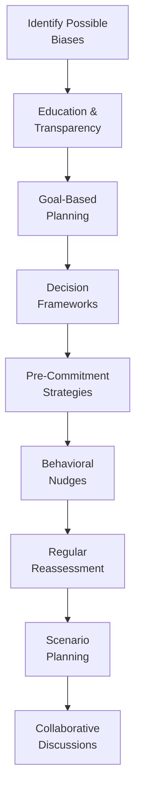

## 5.4 Tools and Techniques for Overcoming Bias

Have you ever had a moment—maybe late at night—when you’ve thought, “Well, maybe I should just buy that ‘hot’ stock everyone’s talking about”? Then you wake up the next morning and wonder what on Earth you were thinking? This is the kind of impulsive investor behaviour that can bubble up when we let our emotions get the better of us. Behavioral biases are often behind these sudden swings in decision-making, pushing us to do things that might feel good in the moment but harm our portfolios in the long run. Overcoming these biases (or at least learning to manage them) is a crucial skill for all investors and, especially, for the professionals who advise them.

This section outlines practical tools and techniques that mutual fund sales representatives, financial planners, and all wealth management professionals can use to help clients—and themselves—avoid some of the most common behavioural pitfalls. By embracing a systematic, transparent, and goal-driven approach, representatives can build client trust and better align investment choices with long-term financial objectives. It’s not about whipping out a magic wand that makes all biases vanish (unfortunately, there’s no such thing). Rather, it’s about shining a light on where biases might lurk and then taking structured steps to keep them in check.

Before we dive in, recall from Section 5.1 (Investor Behaviour) through Section 5.3 (Diagnosing Biases) that biases such as herding, overconfidence, recency bias, and mental accounting are quite common. This chapter builds on that foundation, focusing on how we can overcome or minimize the influence of these biases.

--------------------------------------------------------------------------------

### Education and Transparency

One of the best ways to cut through the fog of biases is, well, education—both for the client and the representative. And I’m not talking about stuffy lectures that leave everyone yawning. Instead, imagine offering simple, clear explanations about:

• The nature of market cycles (markets go up, down, and sometimes sideways).  
• Core investment concepts—like risk, return, diversification—without burying clients under financial jargon.  
• Historical evidence of how markets have performed in different economic conditions (and that big swings, while scary, can be normal).

I once had a client who couldn’t sleep at night if she saw her portfolio dip, even by just a few percentage points. By guiding her through educational sessions—showing her how volatility is a normal part of the market, using plain language, and providing real-life charts and graphs—she began to see that not every dip signaled a complete meltdown. We reduced the anxiety tied to recency bias and herd mentality simply by talking through how markets have always had cycles.

#### Tactics for Enhancing Education and Transparency  
• Host small group sessions or webinars on basic financial topics.  
• Provide a short “investment dictionary” to clients, so they’re not left guessing the meaning of complicated terms.  
• Use real, historical examples (like showing how markets recovered after 2008).  
• Encourage clients to ask questions—lots of them—and keep your responses jargon-free.

--------------------------------------------------------------------------------

### Goal-Based Planning

Goal-based planning shifts the conversation from “What stocks or bonds should we buy?” to “Why are we investing at all?” This approach grounds investment decisions in a client’s personal milestones: retirement age, child’s education fund, down payment for a home, or even philanthropic endeavors.

When conversations revolve around these specific goals, investors are usually less tempted to chase every shiny new market trend. Why? Because they see a clear line between their money and what it’s ultimately for. If they suddenly get the itch to sell everything because of a market dip, gently reminding them of their child’s tuition timeline or their retirement horizon reframes the situation. It’s not just about fear in the moment—it’s about a broader life plan.

#### Practical Example:  
• Suppose a 40-year-old client wants to retire at 65 with a specific annual income. Instead of focusing on short-term market moves, you’d build a plan showing how systematic monthly contributions (aligned with her risk tolerance) can help meet that retirement number. If the market takes a downturn for a few months, you remind her of the 25-year horizon—plenty of time for recovery, historically speaking.

Goal-based planning helps temper overconfidence when markets surge (reminding clients not to deviate from their long-term strategy) and reduces panic during downturns.

--------------------------------------------------------------------------------

### Decision Frameworks

Creating structured, step-by-step frameworks for making decisions can keep impulsive moves in check. A decision framework is basically a roadmap that guides you and your client through how you’ll handle various scenarios. Think of it as a checklist that says: “If X happens, we do Y; if Y happens, we do Z.”

#### Components of a Good Decision Framework:
1. Clear Criteria: Outline what triggers a buy, sell, or hold decision.  
2. Time Horizon: Decide how frequently you’ll review positions (e.g., quarterly, annually).  
3. Risk Tolerance: Keep the client’s comfort level front and center.  
4. Research & Data: Ensure decisions are backed by facts, not just “gut feelings.”  

When markets are calm, work with your client to set these guidelines. That way, when emotions run high, you both have a reference point that helps override spur-of-the-moment panic or euphoria. It’s like having an emergency plan in place in case of a fire—you really don’t want to start planning your evacuation route when the smoke alarm is already going off.

--------------------------------------------------------------------------------

### Pre-Commitment Strategies

Pre-commitment strategies involve setting up rules or habits in advance—often automated—that will happen regardless of day-to-day market noise. A great example is automated monthly contributions to a retirement fund. Another might be an automatic rebalancing policy once an allocation drifts by more than, say, 5% from its target.

By pre-committing to these decisions, you place a guardrail around the temptation to time the market or to “go all in” because of a hot tip on a new tech stock. It’s almost like signing a contract with your future self, preventing your present emotional self from taking control at the worst possible time.

#### Example:  
• An investor decides on a 60% equity, 40% fixed-income portfolio. If, after a market rise, equities climb to 70%, the strategy automatically triggers a rebalance back to 60%. This pre-commitment keeps the investor from letting the portfolio sail away into a higher-risk state.  

These strategies also help keep the implementation consistent, which can reduce friction between a client’s better judgment and their occasional emotional impulses.

--------------------------------------------------------------------------------

### Behavioral Nudges

“Behavioral nudges,” a concept championed in behavioral economics, are small tweaks in how choices are presented that can guide people toward more beneficial outcomes—without restricting their freedom of choice. As a representative, you can use nudges while respecting clients’ autonomy:

• **Default Options**: Maybe the default choice for a new client automatically includes a diversified, conservative-to-moderate portfolio. They can opt out if they wish, but many people stick with the default.  
• **Framing**: Instead of focusing on daily price changes, present performance mentions in context of the client’s 10-year goals. This shift in perspective can reduce knee-jerk reactions to short-term fluctuation.  
• **Auto-Escalation**: If the client has a retirement plan, you might suggest that each year, when they get a pay raise, they automatically increase their monthly contribution by a small percentage.

Such nudges can be powerful in steering clients away from harmful biases like overconfidence, anchoring, or loss aversion. Think of it as carefully positioning the fruit at eye level in the cafeteria line—people will still choose, but they’re more likely to go for what’s healthy.

--------------------------------------------------------------------------------

### Regular Reassessment

Okay, so let’s say you’ve set up a great plan and placed all the right guardrails. You’re done, right? Not quite. Markets and personal circumstances inevitably change, and so can biases. Regular check-ins—maybe every quarter or at least twice a year—help ensure that:

1. The client’s goals are still the same (perhaps they changed jobs, got married, or inherited funds).  
2. The original risk tolerance is still valid.  
3. New biases haven’t crept in.  

A scheduled “bias review” can be part of these discussions. Ask, “Have there been any recent events that caused new fears or new convictions about investments?” or “Did you find yourself second-guessing your portfolio allocation because you heard a news story?” By making these questions normal, you open the door for honest conversations about latent biases that might be lurking under the surface.

--------------------------------------------------------------------------------

### Collaborative Discussions

Sometimes, addressing biases can be easier when more minds are involved. That might mean inviting a spouse or family member into the meetings if it’s appropriate, or collaborating with another financial professional for a second opinion. We all have blind spots, so additional perspectives can be invaluable.

If I look back on one particularly memorable case, we had a client who was consistently overconfident about his stock picks. When the spouse joined our sessions, she brought a more cautious perspective that balanced out the client’s impulsive tendencies. Together, they reached a more moderate approach that both felt good about. It not only reduced the risk in their overall allocation but also greatly improved their peace of mind.

--------------------------------------------------------------------------------

### Scenario Planning

Scenario planning is a fantastic tool for clients who struggle to see the “what ifs.” By presenting best-case, worst-case, and most-likely-case scenarios, you can outline how big market swings might affect a client’s portfolio. This broad view tends to tamp down overconfidence (“Oh, I didn’t realize how bad it could get if the market tanked…”) and helps clients better understand their downside risks.

#### Steps in Scenario Planning:  
1. Identify Key Variables: Interest rates, inflation projections, recession risks, etc.  
2. Create Narratives: Best-case scenario (strong economic growth), worst-case scenario (major recession or black swan event), and moderate scenario.  
3. Calculate Outcomes: Show approximate portfolio values under each scenario.  
4. Analyze Trade-offs: Discuss steps to mitigate the negative outcomes—like increasing diversification or adding more defensive assets.

Clients not only see the range of possibilities, but they start internalizing that reality might land anywhere between the extremes. This fosters a more balanced, less reactive mindset.

--------------------------------------------------------------------------------

### Visual Overview of Bias-Combating Strategies

Below is a simplified flowchart illustrating how these different tools might interact within a typical client engagement:

In reality, you might move back and forth among these steps, but the diagram shows a helpful starting framework.

--------------------------------------------------------------------------------

### Additional Tools and Resources

• **Financial Consumer Agency of Canada (FCAC)**: (https://www.canada.ca/en/financial-consumer-agency.html)  
  Provides open-source educational tools and calculators to encourage disciplined saving and reduce emotional decision-making.

• **The Canadian Institute of Financial Planners (CIFPs)**: (https://www.cifps.ca/)  
  Offers in-depth courses that blend client psychology with ethical, goal-oriented approaches to financial planning. These courses can improve your own understanding and help you coach clients to avoid bias.

• **University of Toronto’s BEAR (Behavioural Economics in Action at Rotman)**: (https://www.rotman.utoronto.ca/BEAR)  
  Publishes research on “nudging” and choice architecture, exploring how small design tweaks in financial products and communications can lead to better client outcomes.

• **Academic and Industry Publications**:  
  Journals like the Financial Analysts Journal or the Canadian Investment Review frequently publish articles on mitigating investor biases—particularly useful if you want to geek out on the latest research in portfolio construction.

--------------------------------------------------------------------------------

### Best Practices, Common Pitfalls, and Strategies

1. **Best Practice**: Encourage open dialogue. Make it part of your routine to ask clients about any new financial anxieties or hunches.  
   **Pitfall**: Brushing off concerns as “irrational” without explanation. This can drive clients away or breed resentment.  
   **Strategy**: Cultivate empathy. Show that you understand their emotions and then provide data and previous plans as reassurance.

2. **Best Practice**: Document all decisions. When you are clear about why an investment was made, it’s easier to look back later and see if bias played a role.  
   **Pitfall**: Relying too heavily on memory or vibes. This makes it much easier for biases to creep in undetected.  
   **Strategy**: Use a client relationship management (CRM) system or shared spreadsheet to keep track of decision rationales.

3. **Best Practice**: Schedule consistent client check-ins. Whether markets are soaring or crashing, periodic reviews keep everyone on the same page.  
   **Pitfall**: Only meeting when there’s “big news.” Clients might interpret your minimal contact as disinterest, plus you risk letting biases accumulate.  
   **Strategy**: Even short phone calls or quick email updates can do wonders in heading off potential biases.

--------------------------------------------------------------------------------

### Glossary

• **Goal-Based Planning**: A method of financial planning that aims to meet specific life goals (e.g., retirement, property purchase) rather than simply trying to beat market benchmarks.

• **Pre-Commitment Strategy**: A technique where investors decide on rules (like contribution levels or rebalancing thresholds) in advance to avoid making overly emotional moves when markets fluctuate.

• **Behavioral Nudge**: A small intervention in how choices are presented to encourage a more beneficial decision—swaying behaviour without removing the freedom to choose otherwise.

• **Scenario Planning**: The strategic process of evaluating best-, worst-, and middle-case outcomes to prepare for a range of future market conditions.

--------------------------------------------------------------------------------

### Looking Ahead

Overcoming bias is crucial in today’s dynamic markets, where emotional swings can fuel abrupt decisions. From the perspective of Canadian regulations, CIRO (the Canadian Investment Regulatory Organization) emphasizes the importance of acting in clients’ best interest, which implicitly includes mitigating the impact of destructive biases. Remember that MFDA and IIROC—now defunct as separate SROs—were amalgamated into CIRO, reinforcing a single regulatory framework that prioritizes investor protection.

Implementing these techniques—education, transparency, decision frameworks, regular assessments, and more—won’t just help clients make more rational choices. It can also set you apart as a trusted advisor, demonstrating diligence, empathy, and forward-thinking in an industry where trust is paramount. By weaving these principles into your daily practice, you can better align investment strategies with both clients’ financial goals and their emotional well-being. 

It may not be the easiest path—humans are famously stubborn with their biases—but with consistent effort and the right toolbox, you’ll find that both you and your clients come out far ahead in terms of satisfaction, outcomes, and peace of mind.

--------------------------------------------------------------------------------

## Overcoming Behavioral Biases: Tools and Techniques Quiz



### Which of the following best explains why education and transparency can help reduce investor biases?

- [ ] They completely eliminate market volatility.
- [x] They provide clear insights into financial concepts and reduce uncertainty.
- [ ] They allow investors to time the market more effectively.
- [ ] They are only useful for sophisticated investors, not beginners.

> **Explanation:** Education and transparency help clients develop a better understanding of market cycles and risk, thus reducing impulsive decision-making fueled by biases.

### What is a key advantage of goal-based planning?

- [ ] It guarantees higher returns than all benchmarks.
- [ ] It removes the need to monitor market trends.
- [x] It ties investment decisions to personal objectives, reducing emotional reactions to short-term fluctuations.
- [ ] It replaces the need for a diverse asset allocation plan.

> **Explanation:** By focusing on personal financial milestones, investors can stay committed to long-term plans rather than overreacting to daily market news.

### Which statement best describes a decision framework?

- [x] It is a set of guidelines for buy, sell, or hold decisions to prevent impulsive moves.
- [ ] It is a tool used only during bear markets.
- [ ] It involves ignoring all external market data.
- [ ] It is only applicable for large institutional clients.

> **Explanation:** A well-defined framework helps keep decisions consistent and fact-based, preventing emotion-driven actions.

### Which of the following is a pre-commitment strategy?

- [ ] Timing the market based on daily stock tips.
- [x] Setting automated monthly contributions to an investment account.
- [ ] Avoiding any form of diversification.
- [ ] Allowing emotions to guide rebalancing decisions.

> **Explanation:** Pre-commitment works by automating or setting decisions in advance, insulating investors from biases that arise in the moment.

### In the context of behavioral nudges, what is framing?

- [x] Presenting information so that investors focus on long-term context rather than short-term volatility.
- [ ] Omitting key details about fees and charges.
- [x] Encouraging more impulsive decisions.
- [ ] Setting up an automatic contribution for investors.

> **Explanation:** Framing how performance or choices are displayed can guide individuals to adopt a less reactive, more forward-looking strategy.

### Why is it important to schedule regular reassessments of a client’s portfolio and risk tolerance?

- [x] Clients’ life events and market conditions change over time, potentially altering their biases or objectives.
- [ ] It ensures that biases grow unchecked.
- [ ] It helps you sell more products regardless of client goals.
- [ ] It reduces compliance requirements under CIRO.

> **Explanation:** Ongoing check-ins allow you to adjust allocations and inform clients about potential new risks or biases that may emerge.

### Which statement highlights the benefit of collaborative discussions in mitigating biases?

- [x] Involving a spouse or a second advisor can bring additional perspectives, reducing overconfidence or panic.
- [ ] It makes all decisions more complicated and confusing.
- [x] It encourages unilateral decision-making without debate.
- [ ] It only applies to clients with no biases.

> **Explanation:** Collaborating with family members or another professional helps spot blind spots, thus preventing an individual’s biases from dominating decisions.

### What is scenario planning primarily used for?

- [ ] Predicting exact future market returns with certainty.
- [ ] Eliminating the worst-case scenario entirely.
- [x] Evaluating best-, worst-, and mid-case outcomes to clarify risk exposure.
- [ ] Acting as a replacement for basic market research.

> **Explanation:** Scenario planning is about outlining multiple possible future states, helping clients grasp a range of outcomes and mitigate overconfidence or panic.

### Which resource is recommended for exploring open-source educational tools to develop disciplined saving and investing habits?

- [x] The Financial Consumer Agency of Canada (FCAC)
- [ ] A personal blog with no official credentials
- [ ] Defunct MFDA resources
- [ ] Unverified social media posts

> **Explanation:** The FCAC (https://www.canada.ca/en/financial-consumer-agency.html) provides credible tools and resources for Canadian investors.

### True or False: By adopting these tools and techniques, a financial representative instantly removes all possible biases from investment decisions.

- [x] True
- [ ] False

> **Explanation:** While these techniques significantly reduce bias, it’s important to recognize that biases can never be entirely eliminated. The real value lies in actively managing and mitigating them.


