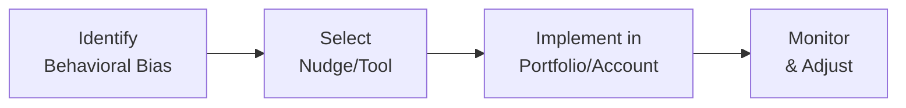

## 5.5 Additional Tools and Techniques in Behavioural Finance

Behavioral finance is really about embracing the reality that we, as humans, are not purely rational beings. We get emotional, we procrastinate, and we occasionally make decisions that seem, well, illogical. But there are proven ways to guide ourselves—and our clients—toward more strategic financial choices. In this section, let’s explore some of these tools and techniques:

• Behavioral Nudges  
• Education and Coaching  
• Setting Realistic Expectations  
• Stress Testing  
• Behavioral Contracts  

And we’ll go through some of the key terms and references at the end as well.

Sometimes, people freeze up—maybe they’re overwhelmed by the noise of the markets, or they can’t figure out where to start. I remember a friend who wanted to start investing but was terrified by the news cycle (“Markets are crashing!” “Indices at record highs!” “Global meltdown!”). She ended up putting off investing entirely for nearly two years. If only she’d set up a simple pre-authorized monthly contribution at the time; she would have saved so much stress (and likely made some tidy gains). This is exactly where these behavioral tools come in.

------------------------------------------------------------------------

### Behavioral Nudges

“Behavioral nudges” are subtle ways to guide people toward better decisions without restricting their freedom of choice. The idea is to shape the environment so that making a positive choice is easier than making no choice—or a poor choice.

#### Automated Savings Plans
• Pre-Authorized Contributions (PAC). This is a top tool. It’s like setting your bills on autopay, except you’re paying into your own investment or savings account. Every month, a fixed amount of money is taken from your checking account and directed into your mutual funds, Registered Retirement Savings Plan (RRSP), or Tax-Free Savings Account (TFSA).  
• Overcoming inertia. Many folks think, “I’ll invest what’s left over at the end of the month.” But we all know how that story goes—there’s rarely anything left. Setting up an automated plan means you pay yourself first.

#### Default Options
• Balanced or target-date funds as a default. When clients aren’t sure which sitting (or “parking”) option to choose, consider pointing them toward relatively balanced solutions. In some group retirement plans, participants are automatically enrolled in a balanced or target-date fund if they don’t opt out.  
• Choosing optimal defaults. For example, a default might be an “auto-escalation” feature that increases contributions by 1% of salary each year. It’s a gentle push that helps prevent “set it and forget it” from turning into stagnation.

These nudges aim to reduce the dreaded “analysis paralysis.” In the context of Canadian regulations, it’s worth noting that any default selection must still align with Know-Your-Client (KYC) and suitability requirements—something we’ve discussed earlier in Chapter 5 when opening accounts (or if referencing Client Discovery processes in your firm).

------------------------------------------------------------------------

### Education and Coaching

Education and coaching serve as powerful complements to nudges. It’s like giving someone the map and also teaching them how to read it.

#### Regular Webinars and Informational Brochures
• Clarifying misconceptions. Terms like “market timing” versus “time in the market” can be puzzling. Consistent educational content helps investors internalize why it’s usually more crucial to stay invested for the long haul rather than attempting to predict the perfect exit or entry.  
• Personalized modules. Some advisory firms use short, self-paced e-learning platforms that explain investing basics in small chunks.

#### Gamification Tools
• What-if calculators. Imagine an online calculator showing how skipping monthly contributions for three months could impact long-term growth. That small shift in input can illustrate a big difference after 20 years.  
• Mini-challenges. Some robo-advisor platforms give “badges” when users hit certain savings milestones. Is that a bit silly? Maybe. But even adults like to see those gold stars, right?

#### Ongoing Sessions
• One-on-one sessions. Scheduling periodic calls—maybe monthly or quarterly—with clients can maintain motivation. Alternatively, staff a dedicated coach for smaller or less experienced clients who need reassurance.  
• Incorporating continuing education. CIRO provides guidance and best practices for ongoing client engagement, showing that knowledge is not a one-time event but a continuous journey. (Check out https://www.ciro.ca/ for details.)

------------------------------------------------------------------------

### Setting Realistic Expectations

Let’s be honest: we all get excited when we see headlines about “doubling your money in record time.” Exaggerated market commentary can lead to unrealistic client expectations. And unrealistic expectations often trigger fear or impulsive decisions when the real markets no longer match the hype.

#### Scenario Analyses
• Best, worst, and median. At account opening—or during an annual review—show clients a chart with three potential paths for their portfolio over the next 10 or 20 years.  
• Balanced perspective. Stress that markets will inevitably face ups and downs. Overemphasizing best-case scenarios sets the stage for disappointment later on.

#### Managing Time Horizons
• Short-term vs. long-term. As we’ve seen in prior sections, clarifying an investor’s goals and time horizon is crucial. A 25-year-old saving for retirement might comfortably ride out the next 40 years. Meanwhile, a 63-year-old planning to retire in two years might prioritize capital preservation.  
• Spacing out reviews. We often see investors obsessively checking their portfolio every day. Maintain regular but well-paced review intervals—maybe semi-annually or annually—so that short-term noise doesn’t derail long-term goals.

------------------------------------------------------------------------

### Stress Testing

“Stress testing” is exactly what it sounds like: subjecting a portfolio—or an entire financial plan—to hypothetical extreme conditions. It gives a sense of how robust the portfolio is and what kind of declines a client might realistically face.

#### Historical Data Simulations
• Case studies (e.g., 2008 financial crisis). Show how a balanced portfolio might have performed in the 2008 meltdown. Sure, it might have dropped temporarily, but maybe it recovered within a few years. Demonstrating real, historical data can help quell panic during the next slump.  
• Sudden downturns. Use recognized events (like 1987’s Black Monday or the dot-com bubble burst in 2000) to demonstrate the effect of short-term shocks.

#### Monte Carlo Simulations
Monte Carlo simulation is a slightly fancier approach involving hundreds or thousands of random scenarios. The client is shown a range of possible outcomes and the likelihood of hitting their goals.

KaTeX example for a Monte Carlo probability distribution might look like this:

Let p = Probability(Portfolio > TargetValue at Time T).

p = \\(\frac{\text{Number of simulated outcomes above TargetValue}}{\text{Total number of simulations}}\\).

This technique can sound intimidating, but a simple chart or summary statistic does wonders in illustrating that real outcomes may vary. Incorporating stress testing can build client confidence—“Hey, you’re in pretty good shape even if the market has a rough patch for a couple of years.”

------------------------------------------------------------------------

### Behavioral Contracts

Sometimes clients know what they “should” do, but they panic anyway. That’s where behavioral contracts come into play.

#### Commitment Devices
• Written agreements. You can have a formal “I will not spontaneously sell if my portfolio drops 10% in a single day” contract. Signed by the client, co-signed by the advisor. It’s a kind of psychological anchor.  
• Automatic triggers. For instance, your client might allow you to move them temporarily into a designated safe asset class only if the market drops over a certain threshold. This plan is hashed out in advance—no calls needed when emotion is high.  
• Positive framing. Emphasize that these devices exist to protect the client from unproductive behaviors and help ensure they’re acting in line with their original intentions.

#### Advisor-Client Communication Protocol
• “Call me first” guideline. If clients want to withdraw a large sum or drastically change asset allocations due to negative headlines, they must contact the advisor first. This creates pause. That slight friction can often thin out impulsive decisions.  
• Team approach. Some advisors build small committees or checklists. Before a major client action is taken, the plan is evaluated by two or more colleagues. It feels a bit official, but it helps curb hasty moves.

------------------------------------------------------------------------

Diagram Explanation:  
1. First, identify which behavioral bias or obstacle the client faces (e.g., procrastination, overconfidence, loss aversion).  
2. Decide on the appropriate nudge or tool—maybe a pre-authorized contribution, an educational webinar, or a stress test scenario.  
3. Incorporate that solution into the investment portfolio or the client’s account structure.  
4. Continually monitor the portfolio and the client’s behavior, adjusting as needed over time.

------------------------------------------------------------------------

### Glossary

• **Nudge**: A subtle policy or practice that encourages specific behaviors without restricting other choices.  
• **Pre-authorized Contribution (PAC)**: An automated way of regularly investing a fixed sum into mutual funds or other investments.  
• **Gamification**: Incorporating elements of game design (like rewards or levels) to encourage engagement in a non-game context.  
• **Monte Carlo Simulation**: A statistical model that uses random variables to estimate outcomes over numerous possible scenarios.  
• **Commitment Device**: A self-imposed arrangement or contract that “locks” someone into a beneficial strategy, discouraging impulsive or harmful actions.

------------------------------------------------------------------------

### References and Additional Resources

• [CIRO](https://www.ciro.ca/): Canada’s national self-regulatory organization managing oversight of investment dealers, mutual fund dealers, and market integrity. Their resources on ongoing client engagement and continuing education can be found on the site.  
• [Behavioral Insights Team (BIT)](https://www.bi.team/): Offers a global perspective on applying behavioral nudges in finance and other sectors.  
• [Financial Consumer Agency of Canada (FCAC)](https://www.canada.ca/en/financial-consumer-agency.html): Provides tips, tools, and calculators for personal finance, budgeting, and automated savings.  
• [Coursera](https://www.coursera.org/) and [edX](https://www.edx.org/): Host a variety of courses on behavioral finance—great for newbies and financial professionals looking to deepen their knowledge.  

Just as we’ve seen in earlier modules (e.g., 5.1 on Opening Accounts and 5.4 on Disclosures), the personal and procedural aspects of finance intertwine. By layering these behavioral finance tools onto the typical onboarding and client-advisor relationship processes, we can help steer clients clear of emotional investing traps.  

Trying out even one or two of these techniques can play a huge role in helping clients stay on track—possibly sparing them from damaging short-term decisions. And that’s ultimately what good conduct and practices are all about.

Remember, while it’s tempting to dismiss behavioral finance as “soft” knowledge, these approaches are grounded in decades of research—and they’re validated by real-world success. If you find yourself or your clients repeatedly missing financial goals or making emotional trades, it might be time to put some of these behavioral tools into action.

------------------------------------------------------------------------

## Test Your Knowledge: Behavioral Finance Tools & Techniques Quiz



### Which statement best describes a behavioral “nudge”?
- [ ] A detailed report limiting all possible market choices.  
- [x] A subtle policy that encourages better decisions without restricting options.  
- [ ] A rule that forces clients to invest in only one asset class.  
- [ ] A penalty for missing a monthly contribution.  

> **Explanation:** A nudge gently guides behavior without taking away the freedom of choice.  

### Which of the following is an example of a pre-authorized contribution (PAC)?
- [x] A fixed dollar amount automatically transferred into a mutual fund each month.  
- [ ] A client manually transferring funds when they remember.  
- [ ] An advisor deciding allocations without client permission.  
- [ ] An employer deducting premiums for life insurance.  

> **Explanation:** A PAC typically involves a client’s chosen amount automatically going into their investment account on a regular schedule.  

### What is the main purpose of using “gamification” in financial education tools?
- [ ] To hide the true costs of an investment.  
- [x] To make learning and engagement more enjoyable, thus encouraging consistent participation.  
- [ ] To market games unrelated to investing.  
- [ ] To bypass regulatory requirements.  

> **Explanation:** Gamification uses game-like elements (e.g., points, badges) to increase user engagement and motivation.  

### How does showcasing best, worst, and median scenarios help clients?
- [x] It provides a balanced performance picture and sets realistic expectations.  
- [ ] It guarantees a specific return on the investment.  
- [ ] It forces them to always expect the worst.  
- [ ] It dissuades clients from ever investing in riskier assets.  

> **Explanation:** Demonstrating a range of possible outcomes helps clients understand volatility, manage their emotions, and maintain feasible expectations.  

### Which of the following best characterizes a Monte Carlo simulation?
- [ ] A single forecast based on one historical data point.  
- [ ] A portrayal of only the most extreme market conditions.  
- [x] A statistical model using random variables to provide numerous potential outcome scenarios.  
- [ ] A method of guaranteeing a fixed rate of return.  

> **Explanation:** Monte Carlo simulations run multiple iterations with random draws to show clients a distribution of possible returns rather than just one outcome.  

### In a “commitment device,” what is the core benefit for the client?
- [x] They voluntarily limit their ability to make impulsive decisions in the future.  
- [ ] They guarantee a higher return than standard investment accounts.  
- [ ] They avoid compliance oversight.  
- [ ] They eliminate the need for advisor interaction.  

> **Explanation:** A commitment device helps prevent self-sabotage by creating pre-agreed rules or constraints.  

### What might an advisor suggest to a client who wants to redeem their entire portfolio during a market dip due to fear?
- [x] Consult the behavioral contract’s “call me first” clause before selling.  
- [ ] Sell immediately without discussing the long-term plan.  
- [x] Review stress test results to see how similar market dips performed historically.  
- [ ] Ignore the market news and pretend nothing is happening.  

> **Explanation:** Both the “call me first” clause and historical stress test data can provide calm, rational decision points for the client, encouraging them to stick to their original plan.  

### Why is using historical events like the 2008 financial crisis beneficial in client discussions?
- [ ] Because it guarantees the same pattern will repeat exactly.  
- [x] Because it provides a real-world example of extreme market stress and subsequent recovery.  
- [ ] Because it proves market crashes no longer occur.  
- [ ] Because it invalidates current market data.  

> **Explanation:** Demonstrating actual events helps illustrate how markets can and do recover, providing context for the client’s long-term perspective.  

### Which of the following functions is carried out by CIRO in Canada’s financial markets?
- [x] It oversees investment dealers, mutual fund dealers, and enforces market integrity.  
- [ ] It replaces the need for any other provincial regulations.  
- [ ] It guarantees investment funds’ performance.  
- [ ] It handles only pension fund oversight.  

> **Explanation:** CIRO is Canada’s national self-regulatory organization created from the amalgamation of IIROC and MFDA, focusing on the oversight of dealer firms and marketplace integrity.  

### True or False: A balanced fund automatically removes all market risk from a portfolio.
- [x] True  
- [ ] False  

> **Explanation:** While a balanced fund reduces concentration risk by including multiple asset classes, it does not entirely eliminate market fluctuation or risk.  




