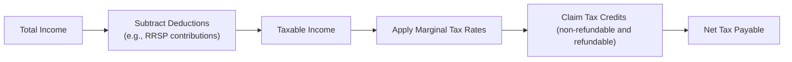

## 6.1 How Does the Canadian Taxation System Work?

If you’ve ever opened your paycheck and wondered why the numbers seem smaller than you expected, well—welcome to the world of Canadian taxation. So let’s dive in: Canada has a progressive tax system, which means that folks who earn more pay a higher rate (or “marginal rate”) on each additional dollar of income. It’s a cornerstone of financial planning and an especially big deal for mutual fund representatives who want to give solid advice to their clients. In this section, we’ll break down how this system operates, the key terms you need to know, and how it all ties back to retirement planning and best practices for your clients. And yep, I’ll share a personal anecdote or two along the way—because, hey, nobody loves paying taxes, but I’ve definitely learned a few things from my own missteps!

Before we jump in, remember: This content is for educational purposes, not official tax or legal advice. Always encourage your clients (and maybe even yourself) to consult a qualified tax professional or refer directly to government resources, like the Canada Revenue Agency (CRA) website, for up-to-date information.

----------------------

### Understanding Canada’s Progressive Tax Model

Canada’s federal tax system assigns different rates to different segments (brackets) of your taxable income. The tax bracket you’re in depends on how much you earn, but only the income above each bracket threshold is taxed at that bracket’s rate. In other words, if your income crosses the threshold between one bracket and the next, only the portion in the higher bracket is taxed at the higher rate. This can be a little confusing. People sometimes think that once you move into a higher bracket, every dollar gets taxed at the highest rate. Nope—that’s not how it works. Only the income that dips into the next bracket is subject to the higher rate.

And guess what: Every province or territory also has its own tax brackets. Once you determine your federal tax, you’ll have to calculate your provincial or territorial tax on top of that. Since each province has slightly different rules, the final tax rate you pay could vary depending on where you live. Mind you, individuals considered residents of Canada for tax purposes pay tax on their worldwide income—everything from salaries to investment earnings, capital gains, and beyond.

----------------------

### Federal vs. Provincial/Territorial Taxes

Let’s say you live in Ontario. You’ll calculate your federal taxes first by applying the federal marginal rates to your taxable income. Then you apply Ontario’s tax rates. Add both amounts, subtract any applicable credits, and, voilà—that’s your total combined tax owed, minus any installments or withholdings you’ve already paid throughout the year.

It’s the same dance in every province and territory, though tax rates and brackets differ across the country. For example, the highest combined rate might be different in Quebec than in Alberta. Just to keep you on your toes!

----------------------

### Taxable Income Calculation: From Gross Income to Net Tax

Let’s do a quick run-through of how we go from the blurry concept of “income” to a clear figure on your income tax return. That’s your T1 General Income Tax and Benefit Return. Here’s a little flowchart to help you see what’s going on:

• Total Income: This is basically everything you earned—employment income, business profits, rental earnings, certain government benefits, etc. If you’re a Canadian resident (for tax purposes), this also includes your foreign income.  
• Subtract Deductions: Deductions reduce the amount of income that’s subject to tax. Common deductions include Registered Retirement Savings Plan (RRSP) contributions and union or professional dues.  
• Taxable Income: After deductions, you land on your taxable income. This is the figure used to determine which marginal tax brackets apply.  
• Apply Marginal Tax Rates: Next, you calculate your federal tax and then your provincial/territorial tax, each using their respective brackets.  
• Claim Tax Credits: Non-refundable credits reduce the amount of tax owed. Examples: Basic Personal Amount, spousal credits, and charitable donations. Refundable credits (e.g., the Canada Workers Benefit) can generate a tax refund even if your total payable is zero.  
• Net Tax Payable: After all non-refundable and refundable credits, you get the final number: the net amount of tax you owe. If your payroll withholdings, installments, or other credits exceed that figure, you’ll get a refund.

----------------------

### Different Types of Investment Income

From a financial advisor’s perspective—heck, from any taxpayer’s perspective—one of the coolest (or trickiest) parts of the Canadian system is that different types of income get taxed differently. Let’s explore:

• Interest Income: If you earn interest from a savings account, GIC, or bond coupon, that interest is taxed at your full marginal rate. No breaks here.  
• Capital Gains: When you sell an asset for more than what you paid, the difference is a capital gain. Only 50% of that gain is taxable, and it’s taxable at your marginal rate. Let’s say you bought shares for $1,000 and sold them for $2,000. That’s a $1,000 gain, but only $500 is counted as taxable income.  
• Dividends: Dividends from Canadian corporations (public or private) often come with a special tax credit that reduces the overall tax you owe on that income. It’s a nice perk, designed to prevent double taxation (the corporation already paid tax on its profits before distributing dividends).

I remember one of my earliest mutual fund clients being super confused about why we kept talking about “eligible dividends” and “gross-up.” She had no idea investment income could be taxed more favorably than interest. Once we broke it down—especially that 50% capital gains inclusion rate—she couldn’t believe how different the tax outcomes could be compared to simple interest on a savings account.

----------------------

### The Role of the Canada Revenue Agency (CRA)

The CRA collects individual and corporate taxes, oversees benefit payments (like the Canada Child Benefit), and enforces the Income Tax Act. As a registered mutual fund representative, you’re often guiding your clients to make decisions that align not only with investing best practices but also tax efficiency. If the CRA changes rules on, say, TFSA contribution limits or capital gains inclusion rates (which can be adjusted by federal budgets), you’ll want to stay on top of it.

----------------------

### T1 Filing Obligations and Penalties

Either you or your clients (or your friendly accountant) must file a T1 General Income Tax and Benefit Return every year, typically by April 30. If you owe taxes and you file late, you’ll usually face a late-filing penalty plus daily interest charges on what you owe until the debt is paid. Not fun. If your return is more complex—maybe because of self-employment or certain investment transactions—seek professional help. Late- or non-filing can get messy, and the CRA has no problem issuing notices of assessment with added interest and penalties if your returns are outstanding.

----------------------

### Why Understanding Taxes Matters for Retirement Goals

I’ll be honest: Paying taxes is never a feel-good moment. But, understanding how RRSP deductions lower your taxable income, or how certain investments produce capital gains or dividends rather than plain old interest, can make a massive difference in long-term wealth accumulation. And remember, your retirement strategy in Canada often relies on individual plans like the RRSP, TFSA, or group plans like defined contribution pension plans. All these vehicles have unique tax implications that can either help or hinder your retirement savings. It’s our job as advisors—and a savvy move as individuals—to align these tax strategies with broader retirement plans.

----------------------

### Practical Examples and Case Studies

• Example 1: RRSP Contribution  
  - Suppose your client has a salary of $80,000 per year. If they contribute $10,000 to their RRSP, they reduce their taxable income to $70,000. This can push them into a lower bracket or at least reduce the taxes owing. Over many years, these contributions compound and potentially lower your client’s overall tax bill.  

• Example 2: Switching from Interest to Dividend Paying Stocks  
  - Another client invests heavily in GICs, earning $2,000 in interest annually, taxed fully. By switching a portion of these funds to dividend-paying stocks of a Canadian corporation, some of that $2,000 could be earned as eligible dividends, subjected to a dividend tax credit, which ultimately lowers the tax rate on that chunk of income.  

• Example 3: Taking Capital Gains vs. Salary  
  - Imagine you’re a small business owner who pays yourself a salary. You can also opt for dividends or eventually sell your shares for a capital gain. Because only 50% of capital gains is taxed, this might lower your effective tax burden. But it also depends on your personal situation, corporate structure, and so on—details, details!  

----------------------

### Best Practices and Common Pitfalls

• Make RRSP Contributions Early: If you can afford to, put money into your RRSP as soon as possible in the tax year. This way, you’ll generate more returns over time, while immediately reducing taxable income.  
• Avoid Confusion with Deadlines: The RRSP contribution deadline is typically 60 days after the calendar year, which can confuse folks if they’re not paying attention.  
• Track Foreign Income: If you have clients with significant assets abroad, always remind them that Canada has a worldwide income approach. Not reporting might result in huge penalties if discovered.  
• Watch Out for Overcontributions: TFSAs and RRSPs have yearly limits. Excess contributions may result in penalty taxes.  
• Report All Gains and Losses Accurately: If you sell mutual fund units or stocks, keep detailed records of your adjusted cost basis (ACB). Wrong calculations here can trigger major confusion or a bigger tax bill than expected.

----------------------

### Diagrams and Visual Tools

When you’re explaining to clients (and sometimes talking yourself through a scenario), pictures often help more than words. The flowchart above is a good place to start, but you might need more specialized diagrams to communicate specific retirement planning or investment strategies.

For instance, you can create a chart showing different marginal rates at different income levels, or how combined federal-provincial taxes look in your particular province. Tools like Excel or specialized tax software (e.g., Wealthsimple Tax or other open-source calculators) are super handy for quickly modeling what-if scenarios.

----------------------

### Glossary in Plain Language

• Progressive Tax System: The more you earn, the higher the tax rate you pay on that portion of your income.  
• Marginal Tax Rate (MTR): The rate of tax you pay on the last dollar of income you earned.  
• Tax Deductions: Amounts subtracted from total income to arrive at taxable income (e.g., RRSP contributions).  
• Tax Credits: Amounts that reduce the tax payable. Some are refundable, which means they can give you cash if they exceed your tax owing.  
• Capital Gains: Profits from the sale of assets, such as stocks or real estate. Only 50% of capital gains is taxable.  
• Dividend Tax Credit: A tax benefit that reduces the amount of tax on dividends received from Canadian corporations.  
• Canada Revenue Agency (CRA): The government organization that manages and enforces tax laws for the Government of Canada.  
• T1 General Income Tax and Benefit Return: The main tax form individuals in Canada use to file their personal income taxes every year.

----------------------

### Additional Resources

• CRA Website (https://www.canada.ca/en/revenue-agency.html): Official tax forms, guides, and updates.  
• Income Tax Act (R.S.C., 1985, c. 1 (5th Supp.)): The legal foundation for Canada’s tax system.  
• Online Tax Tools: Wealthsimple Tax, SimpleTax, TurboTax, or other open-source calculators to estimate taxes.  
• CIRO (Canadian Investment Regulatory Organization): Visit https://www.ciro.ca for current rules and guidelines (the MFDA and IIROC no longer exist as separate entities).  
• Chapters Ahead in This Course: Many of the upcoming sections in Chapter 6 and beyond will elaborate on retirement planning strategies, tax deferral, and ways to build a holistic financial strategy.

----------------------

Even if taxes aren’t everyone’s favorite topic (I’ll never forget the day I realized I miscalculated a capital gain and owed more than I thought—ouch!), a solid understanding of how the Canadian taxation system works is a game-changer. By appreciating the progressive tax model, the difference between interest, dividends, and capital gains, and how deductions and credits can really shift your bottom line, you’ll be that much better at crafting retirement strategies that actually make sense for your clients.

----------------------

## Test Your Knowledge of the Canadian Taxation System



### Which of the following best describes Canada’s progressive tax system?
- [ ] A flat tax rate that applies equally to all taxpayers.
- [x] Increasing tax rates as your income rises, but only on the portion of income within each bracket.
- [ ] A single rate of tax up to a specific threshold, after which no tax is owed.
- [ ] A system where only earned income is taxed, but investment income is always tax-free.

> **Explanation:** Canada uses a marginal tax bracket system where each bracket’s rate applies only to income that falls within that bracket. Higher income segments are taxed at higher marginal rates.

### Which form must Canadian residents generally file for personal income tax each year?
- [x] T1 General Income Tax and Benefit Return
- [ ] T3 Trust Return
- [ ] T4 Statement of Remuneration Paid
- [ ] T5013 Partnership Information Return

> **Explanation:** Individuals file a T1 General Income Tax and Benefit Return. T3, T4, and T5013 are supplementary forms or slips for trusts, employment income, and partnerships, but not the main individual tax return.

### Which of the following statements about capital gains is correct?
- [ ] The full capital gain is included in taxable income.
- [ ] Only 25% of the gain is taxable.
- [x] Only 50% of the gain is taxable.
- [ ] Capital gains are not taxed if your income is below $50,000.

> **Explanation:** In Canada, 50% of a capital gain is taxable at your marginal rate. The other 50% is not subject to tax.

### If a taxpayer pays themselves entirely through dividend income from a Canadian corporation, which tax feature might they benefit from?
- [ ] Full tax exemption.
- [ ] 0% marginal rate.
- [x] The Dividend Tax Credit.
- [ ] The GST/HST rebate.

> **Explanation:** Dividends from Canadian corporations are eligible for a dividend tax credit that reduces the effective tax rate on that income.

### Which statement is TRUE about interest income compared to dividends and capital gains?
- [x] Interest income is fully taxed at the individual’s marginal rate.
- [ ] Interest income is taxed at half the rate of capital gains.
- [x] Dividends can receive a more favorable tax treatment than interest.
- [ ] Interest income is tax-free if earned from Canadian sources.

> **Explanation:** Interest income is fully taxed at your marginal rate—no special credits apply. Conversely, dividends often receive a credit, and only 50% of capital gains is taxable.

### What is one potential penalty for filing your income tax return late if you owe taxes?
- [x] Late-filing penalties plus daily interest on outstanding taxes.
- [ ] Banned from filing returns in subsequent years.
- [ ] Forced to pay zero taxes the following year.
- [ ] No penalty if your taxable income is under $50,000.

> **Explanation:** If you owe taxes and file late, the CRA generally charges a late-filing penalty, plus daily interest on any outstanding tax debt.

### Among the deductions listed, which one is commonly used to reduce taxable income in Canada?
- [x] Registered Retirement Savings Plan (RRSP) contributions
- [ ] Foreign currency fees
- [x] Professional or union dues
- [ ] Lottery ticket expenses

> **Explanation:** RRSP contributions and professional/union dues are allowable deductions that reduce taxable income.

### What is the primary advantage of claiming non-refundable tax credits?
- [x] They reduce the amount of tax you owe.
- [ ] They increase your total income.
- [ ] They are only available to high-income earners.
- [ ] They result in automatic tax refunds regardless of your tax owing.

> **Explanation:** Non-refundable credits reduce the tax you pay, but they cannot create a refund if they exceed your tax liability (unlike refundable credits).

### Which government body primarily administers and enforces personal income tax rules in Canada?
- [x] The Canada Revenue Agency (CRA)
- [ ] The Department of Finance
- [ ] The Bank of Canada
- [ ] The Canada Border Services Agency

> **Explanation:** The CRA administers and enforces tax laws for the federal government and most provinces. 

### True or False: Residents of Canada are taxed on their worldwide income, regardless of where that income is earned.
- [x] True
- [ ] False

> **Explanation:** Canada’s tax system requires residents to report and pay taxes on worldwide income, subject to certain tax treaties and potential credits for foreign taxes paid.


