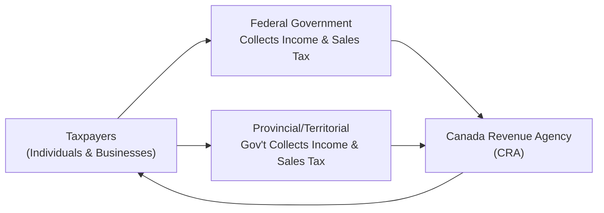
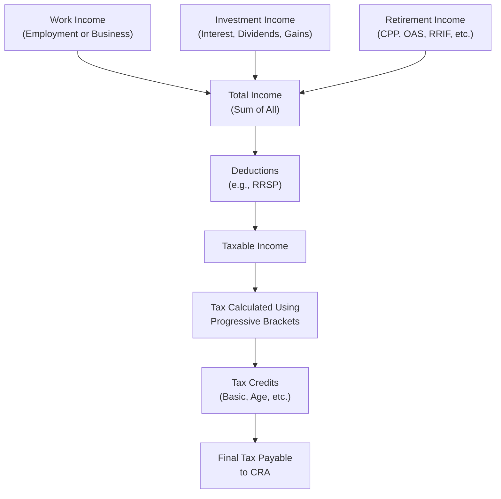

## 6.1 How does the Canadian Taxation System Work?

Imagine you’re sitting down with a friend who’s just received their first paycheck in Canada. The amount they take home isn’t quite as big as they expected. They glance at you, slightly puzzled, and say, “Uh… what is all this tax stuff, exactly?” And off you go, explaining how Canada’s tax system is set up to support public services—like healthcare, education, social programs, and so on—through both federal and provincial levies. That’s really how it works: at every turn, someone in Canada pays taxes, which can be, well, a bit confusing if you’re new to this. Let’s break it down step by step, with plenty of examples and a friendly, easygoing tone.

---

### Overview of the Canadian Taxation Structure

Canada’s taxation system is governed primarily by the federal government under the jurisdiction of the Canada Revenue Agency (CRA). Each province or territory also levies taxes—like provincial income tax, sales tax (PST), or a harmonized sales tax (HST)—resulting in a combined structure. For instance, if you’re in Ontario, you pay federal income tax and Ontario provincial income tax; if you’re in British Columbia, you pay federal income tax and BC provincial income tax, and so forth.

Financial professionals, such as mutual fund representatives, securities dealers, and financial planners, must be aware of these tax layers to provide accurate advice. In Canada, adhering to regulatory standards not only involves compliance with the Canadian Investment Regulatory Organization (CIRO)—the current self-regulatory body—but also having a solid grasp of how taxes are calculated and how they affect investment decisions.

---

### Federal and Provincial Taxes: Two Peas in a Pod

You’ll often hear folks railing about “federal taxes” versus “provincial taxes.” But in practice, you pay them in one shot (through your income tax return) and the CRA distributes the share to each government accordingly. The easiest way to envision it is:

• The federal government collects a base amount of tax.  
• The province or territory adds its own rates.  
• In provinces or territories that have a harmonized tax structure (HST), the federal government collects both the federal portion and the provincial portion together.  
• In provinces with separate sales taxes, you’ll see distinct line items for federal GST and provincial PST whenever you buy something.

From an everyday perspective, whether you’re paying HST or GST/PST, part of that money ends up at the federal level, and part goes to the province or territory.

Here’s a simple visual flow diagram of how taxes typically move—keeping in mind this is a conceptual overview:

In this diagram, you can see that income and sales taxes flow from the taxpayer to both federal and provincial levels. The CRA is responsible for overall administration, compliance, and enforcement.

---

### Progressive Tax Rates: Marginal vs. Average

If you have ever scratched your head and said, “Why did I pay more tax when I got that raise?” you’ve encountered the progressive tax system. Canada uses a “graduated” or “progressive” tax system where income is divided into brackets, with each bracket taxed at a different rate. The rate only applies to the income within that bracket.

• Marginal Tax Rate: This is the percentage you pay on your next (additional) dollar of income.  
• Average (or Effective) Tax Rate: This is the total tax you pay divided by your total income (a blended rate across all income brackets).

Let’s say the federal tax brackets (fictitious numbers just for illustration) break down like this:

| Federal Tax Bracket   | Tax Rate  |
|-----------------------|----------:|
| $0 – $50,000          | 15%       |
| $50,000 – $100,000    | 20%       |
| $100,000+             | 26%       |

And suppose Province X imposes:

| Provincial Tax Bracket  | Tax Rate  |
|-------------------------|----------:|
| $0 – $50,000            | 10%       |
| $50,000 – $100,000      | 12%       |
| $100,000+               | 14%       |

The combined marginal rate on the first $50,000 of your income in this hypothetical scenario would be 15% (federal) + 10% (provincial) = 25%. For the next $50,000 ($50,001 – $100,000), it might be 20% + 12% = 32%, and so on.

#### Example of Marginal vs. Average Tax Rates

Let’s imagine Sam earning $60,000. Instead of applying 32% to all $60,000, Sam pays:  
• 25% on the first $50,000 = $12,500 in total tax for that portion.  
• 32% on the next $10,000 = $3,200 for that portion.  

Total tax = $15,700. The marginal rate on that last dollar earned is 32%, but Sam’s overall (average) tax rate is $15,700 / $60,000 ≈ 26.2%.  

This structure encourages progressive distribution, meaning individuals or corporations that earn more pay a higher marginal rate on that increment. 

---

### Key Income Sources: Putting It All on the Table

Taxes don’t just come out of your salary (employment income). In Canada, many sources of revenue are classified as “taxable income,” including:

• Employment income: Salaries, wages, tips, bonuses, taxable benefits given by employers (e.g., certain gift cards or allowances).  
• Self-employment or business income: Any earnings from a sole proprietorship, partnership, or small business.  
• Investment income: This typically comprises interest, dividends (eligible or non-eligible), and capital gains.  
• Pension or retirement income: Canada Pension Plan (CPP), Old Age Security (OAS), Registered Retirement Income Fund (RRIF) withdrawals, company pension plans, etc.  
• Other sources: Some annuities, certain government programs, etc.

As an advisor, it’s crucial to differentiate among these sources because each might be taxed differently. For instance, dividends get special tax treatment via the “dividend tax credit” to offset double taxation. Capital gains might only be partially taxable. These differences can significantly affect a client’s overall tax plan.

---

### Deductions vs. Credits: Two Routes to Less Tax

When you file a tax return, you encounter two major ways to reduce your tax burden: deductions and credits.

#### Tax Deductions

A tax deduction reduces your net income before you apply the tax rate. Common examples include:

• RRSP contributions: Let’s say you contribute $5,000 to an RRSP. Your taxable income is reduced by $5,000, potentially placing you in a lower tax bracket.  
• Union or professional dues: These are typically deductible.  
• Certain child-care expenses, moving expenses (if they apply), and other specific allowable expenses.

If your taxable income goes down, you could end up with a lower marginal tax rate on part of your income, which makes these deductions especially powerful.

#### Tax Credits

A tax credit reduces the amount of tax you owe, dollar for dollar. Some credits are “non-refundable,” meaning they can reduce your tax liability to zero but generally don’t create a negative taxable amount (a refund beyond the tax paid). Others are “refundable,” meaning if the credit exceeds your tax liability, you receive a payment for the difference.

Examples:

• Basic personal amount: A standard non-refundable credit that all taxpayers receive, reducing overall tax payable.  
• Age credit: For individuals 65 or older, and depending on their income level.  
• Disability tax credit: For eligible individuals with disabilities, to ensure lower tax obligations.  
• GST/HST credit: A refundable credit aimed at helping offset the burden of sales tax for lower-income Canadians.

These credits directly reduce the total figure you owe. For instance, if you have $1,000 in taxable liability and a $300 credit, your net is $700.

---

### Case Study: When a Raise Triggers Curiosity

I once had a client named Jennifer who was super excited about a promotion that boosted her salary by $10,000. Just one problem: her take-home pay didn’t rise by what she had anticipated. “Wait, shouldn’t I be taking home an extra $800 each month? Where’s my money going?” she asked, a bit frustrated. 

It turned out the additional $10,000 had pushed part of her income from one bracket into the next, increasing her marginal tax rate for that portion. Her average tax rate also rose slightly, though not as sharply as her marginal rate on that last chunk of earnings. Through a simple breakdown—like the example we did above—we overcame her confusion. She realized she was indeed making more money but that every extra dollar was taxed at a higher percentage.

---

### Special Considerations for Investment Income

Investment income can be tricky, so let’s spend a moment on that. If your clients (or you, yourself) earn:

• Interest Income: Fully taxable at your marginal rate.  
• Dividend Income: Eligible dividends from Canadian corporations carry a dividend tax credit, resulting in lower effective taxation compared to interest.  
• Capital Gains: Only a portion (commonly 50%) is included in taxable income. If you realize $6,000 in capital gains, generally $3,000 is taxed at your marginal rate.  
• Capital Losses: These can offset current or future capital gains, but generally not other types of income (with limited exceptions).

For example, if an investor receives $5,000 in eligible Canadian dividends, they get a “gross-up and credit” system to reflect the corporate tax already paid. That means they might record a higher income on paper but receive an offsetting credit, which often makes the final tax cost on dividends favorable compared to the same amount of interest income.

---

### The Role of RRSPs and TFSAs in Tax Planning

Registered Retirement Savings Plans (RRSPs) and Tax-Free Savings Accounts (TFSAs) are integral to Canadian tax and retirement planning:

• RRSPs let you deduct contributions from your income, reducing your current taxable income. Growth inside the RRSP is tax-deferred until withdrawn.  
• TFSAs let your investments grow and be withdrawn tax-free, but there’s no deduction at the time of contribution.

In either account, you can invest in mutual funds, stocks, bonds, GICs, and more, based on your investment objectives and risk tolerance. As an advisor, you have to stay updated on annual contribution limits, special rules for spousal RRSPs, carry-forward room, and how meltdown strategies (i.e., systematic withdrawals from RRSPs or RRIFs in retirement) affect overall tax.

---

### Understanding the Regulatory Context: CIRO and Compliance

If you’re a new financial advisor or mutual fund representative in Canada, it’s not just about taxes; you also have compliance requirements. Since 2023, the Canadian Investment Regulatory Organization (CIRO) has been the single self-regulatory organization overseeing investment dealers and mutual fund dealers. CIRO replaced the historically separate MFDA and IIROC. From a tax perspective, you’re not responsible for filing taxes on behalf of clients (obviously), but you are responsible for giving advice that stands up to scrutiny under CIRO standards—which includes proactively disclosing how changes in tax law might affect your recommendations.

Also, your clients’ accounts with a member firm may be protected by the Canadian Investor Protection Fund (CIPF). If a member firm becomes insolvent, CIPF protects the investor’s assets, but that doesn’t remove the investor’s obligation to pay taxes on interest, dividends, or capital gains.

---

### Staying Current with Tax Law Changes

Canadian tax law changes regularly. The federal budget (usually delivered once a year) can tweak tax brackets, credits, or rates for capital gains inclusion. Provinces also adjust their own bracket thresholds and rates from time to time. For example:

• Capital gains inclusion rates: Historically, Canada has taxed anywhere from 50% to 75% of capital gains. It currently stands at 50%, but that could change in a future budget.  
• Dividend tax treatment: Governments may alter the gross-up factor or the credit rates.  
• RRSP contribution limits: Typically adjusted annually for inflation or wage growth.  
• Tax-free Savings Account (TFSA) annual contribution room: Typically updated in line with inflation.  

Because of these moving parts, best practices call for regularly consulting the CRA website, official provincial or territorial finance ministry portals, and credible financial news sources. An outdated piece of advice can create a compliance headache and mislead clients.

---

### Common Pitfalls in Tax Planning

Just because you know how the tax system works doesn’t mean it’s easy to apply flawlessly. A few common pitfalls:

• Overlooked Credits: Some people fail to claim credits for which they qualify, such as the disability tax credit or various refundable credits.  
• Mixing Capital Gains and Registered Plans: Failing to consider that capital gains in an RRSP or TFSA effectively avoid immediate taxation can lead to suboptimal asset location.  
• RRSP Overcontributions: Overcontributing to an RRSP can result in penalties.  
• Not Optimizing Tax Bracket Usage: Some individuals with large capital gains distributions in a given year forget to plan or harvest losses from prior years.  
• Forgetting Provincial Variations: Each province has its own bracket thresholds and credits.  

Being mindful of these pitfalls helps in guiding clients more effectively.

---

### Practical Example: Combining Federal and Provincial Taxes

Say Sarah resides in Ontario and is considering investing a substantial amount in taxable accounts. She wants to estimate how much she’ll pay in taxes on interest versus dividends. She uses an open-source calculator like the one at Wealthsimple (https://www.wealthsimple.com/en-ca/tool/tax-calculator) or another free simulator. By punching in her expected annual interest earnings, possible dividend income, and marginal rates, she can see that dividends are generally taxed at a lower effective rate than interest income. That knowledge helps her decide whether, for instance, it’s worth it to invest in a high-dividend stock or a GIC paying interest.

---

### Best Practices in Providing Client Guidance

• Clarify Terminology: Ensure clients understand basic definitions of marginal and average tax rates.  
• Illustrate with Examples: Whenever possible, show how their next $1,000 in income might be taxed.  
• Encourage Tax-Efficient Investing: Emphasize use of TFSAs and RRSPs, and proper asset location (placing interest-bearing assets in registered accounts, for instance).  
• Stay Informed: Keep a subscription to federal/provincial budget updates or do a quick read each year of the CRA and provincial releases.  
• Collaborate with Tax Professionals: Advisors are not licensed to provide official tax filing services unless they have additional professional designations. Work alongside accountants or tax specialists for complex situations.

---

### Another Quick Anecdote

I had a small business client who insisted dividends were always better than a salary. It’s not so black and white. Sure, dividends get preferential tax treatment, but they also reduce your CPP contributions (which may matter for retirement). That example underscores that tax planning is more than a “one-size-fits-all” approach.

---

### Visual Representation: Income and Tax Flow

Here’s a diagram to illustrate how different sources of income flow into the Canadian tax system and how deductions/credits factor in:

• Individuals generate income from various sources (A, B, C).  
• That all adds up to a “Total Income” figure (D).  
• Then allowable “Deductions” (E) get subtracted to arrive at “Taxable Income” (F).  
• This is taxed using a progressive bracket approach (G).  
• “Tax Credits” (H) reduce the final amount of tax “I” you owe.

---

### Glossary

Marginal Tax Rate: The tax rate you pay on your last dollar of income (or next dollar earned).  
Progressive Tax System: A setup where higher slices of income get taxed at higher rates.  
Tax Deduction: Amounts that reduce your taxable income before tax is calculated.  
Tax Credit: An amount that directly reduces your tax payable.  
Tax Bracket: A range of income taxed at a specified rate.  
Federal vs. Provincial Tax: The two primary layers of taxation that, combined, determine your total tax payable.

---

### References and Additional Resources

• [Canada Revenue Agency (CRA)](https://www.canada.ca/en/revenue-agency.html) – Official source for tax forms, publications, bracket updates, and guides.  
• [Provincial/Territorial Ministries of Finance](https://www.ontario.ca/page/ministry-finance) – Each province or territory has a dedicated site with current tax rates and regulations.  
• “Tax for Canadians For Dummies” by Christie Henderson – Great for beginners.  
• [Open-Source Canadian Tax Calculators](https://www.wealthsimple.com/en-ca/tool/tax-calculator) – Tools to help estimate taxes in different scenarios.  
• [CIRO](https://www.ciro.ca) – Information regarding the Canadian Investment Regulatory Organization’s regulatory requirements and resources for financial professionals.  

---

### Conclusion

So, there you have it—a solid (though far from exhaustive) introduction to how the Canadian taxation system works. We touched on everything from the basic structure of federal and provincial taxes to the intricacies of marginal rates, deductions, credits, and specialized tax treatment of different income types.

Taxes might seem complicated at first, but they’re a bit like learning the rules of a game: once you get it, you’ll be able to make more strategic and informed decisions. Whether you’re an advisor looking to guide your clients better or an individual just trying to understand your paycheck, remember that staying informed and consulting professional resources (or actual tax professionals) can help you navigate Canada’s progressive tax system more confidently.

---

## Mastering Canadian Taxation: A Comprehensive Quiz



### Which of the following best describes a progressive tax system in Canada?

- [ ] A system where everyone pays the exact same rate regardless of income.
- [x] A system where higher levels of income are taxed at higher rates.
- [ ] A system where tax rates only apply to capital gains.
- [ ] A system used exclusively to tax corporations.

> **Explanation:** Canada uses a progressive tax system, meaning individuals with higher incomes are taxed at higher marginal rates on those higher portions of income.

### How does a tax deduction differ from a tax credit?

- [ ] A tax credit is applied to your taxable income, whereas a tax deduction directly lowers your tax bill.
- [x] A tax deduction reduces your taxable income, while a tax credit directly reduces the amount of tax owed.
- [ ] They’re effectively the same in Canada.
- [ ] A tax deduction is always more beneficial than a credit.

> **Explanation:** Deductions lower your taxable income, which can reduce the overall tax liability, whereas credits reduce the total tax payable on a dollar-for-dollar basis.

### Which of the following is NOT commonly considered taxable income in Canada?

- [ ] Employment salary or wages
- [ ] Capital gains from selling stocks
- [x] Lottery winnings
- [ ] Dividend income

> **Explanation:** Lottery winnings or windfalls are generally not considered taxable income in Canada. Salaries, capital gains on stocks, and dividends all result in taxable income.

### What is the main role of the Canada Revenue Agency (CRA)?

- [ ] Setting global trade policy.
- [ ] Setting currency exchange rates.
- [x] Administering tax laws and collecting taxes for the Canadian government.
- [ ] Managing the financial services sector directly.

> **Explanation:** The CRA administers federal tax laws, processes returns, collects taxes, and enforces compliance with tax obligations.

### Which one of the following statements about RRSPs is correct?

- [x] Contributions to RRSPs can be deducted from your taxable income in the year of contribution.
- [ ] Contributions to RRSPs are taxed immediately.
- [x] RRSP investment income grows tax-deferred until withdrawal.
- [ ] RRSPs do not have any annual contribution limits.

> **Explanation:** RRSP contributions are tax-deductible and the investment growth is tax-deferred. They do have annual contribution limits set by the CRA.

### What is an advantage of dividend income over interest income for Canadian taxpayers?

- [x] Dividends sometimes qualify for a dividend tax credit, lowering the effective tax rate.
- [ ] Dividends never need to be reported on a tax return.
- [ ] Dividends generate more capital gains.
- [ ] Dividends can only be paid to the highest income bracket.

> **Explanation:** Eligible Canadian dividends are subject to the dividend tax credit, reducing the overall tax payable compared to interest income.

### Why do higher incomes move into higher “marginal tax rates”?

- [x] Canada uses a progressive tax system, so income above certain thresholds is taxed at higher rates.
- [ ] It’s a standard approach in all countries worldwide.
- [x] Governments set income thresholds to increase revenue at higher income levels.
- [ ] Marginal rates are chosen randomly each year.

> **Explanation:** In a progressive system, the marginal tax rate applies to income above set income thresholds, and different thresholds are introduced to make tax collection more equitable and supportive of public services.

### Which of the following is a common reason for tax law changes?

- [ ] New funding priorities in the federal or provincial budgets.
- [ ] Political shifts or economic conditions influencing revenue needs.
- [ ] Adjustments to inflation or cost-of-living considerations.
- [x] All of the above.

> **Explanation:** Governments adjust tax laws for many reasons, including generating revenue for new programs, reacting to inflation, and implementing political mandates, among others.

### What is the role of CIRO in the context of taxation?

- [ ] It sets tax brackets and rates for federal and provincial governments.
- [ ] It administers and collects all federal taxes.
- [x] It oversees compliance for investment and mutual fund dealers, ensuring accurate and ethical practices, which includes managing tax-related advice.
- [ ] It only operates in Quebec.

> **Explanation:** The Canadian Investment Regulatory Organization (CIRO) is the self-regulatory organization that oversees investment dealers and mutual fund dealers. While it doesn’t set tax policy, it ensures that advisors follow appropriate guidelines, including those related to tax advice and disclosure.

### True or False: FDIC coverage protects Canadian investors’ assets if their member firm becomes insolvent.

- [ ] True
- [x] False

> **Explanation:** In Canada, the Canadian Investor Protection Fund (CIPF) provides protection if a CIRO member firm becomes insolvent. The FDIC is the U.S. equivalent for banks, not Canadian investment dealers.


