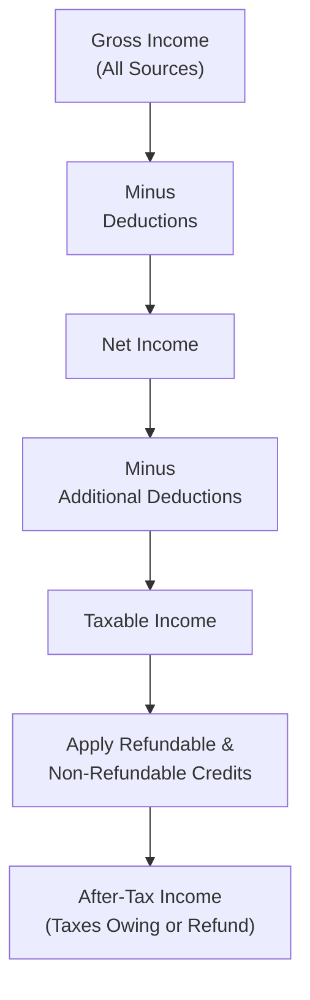

## 6.2 Understanding Key Personal Tax Concepts

Taxes. One little word that sometimes makes us, well, a bit uneasy, right? When I first started diving into the Canadian tax system, I found myself scanning line after line on the CRA website, feeling as though I'd stumbled into an unfamiliar language. But, hey, once we break it down, it’s not so bad—promise! Let’s walk through the core personal tax concepts that matter to everyone, from your everyday individual taxpayer to a mutual fund sales representative who wants to ensure their clients are well-informed.

Whether you’re working through your first personal tax return or advising a client on how mutual funds can impact after-tax returns, understanding Canada’s fundamentals of gross income, net income, taxable income, after-tax income, and the associated deductions and credits (both refundable and non-refundable) is crucial. We’ll explore real-life stories, a few diagrams, and highlight the unique implications for mutual fund distributions, especially when it comes to dividends, capital gains, and returns of capital.

Feel free to pop in any question that comes to mind as we go through—because, trust me, you won’t be the first to wonder how an RRSP deduction differs from a tax credit, or what on earth a return of capital (ROC) distribution from a fund is and why it matters.

---

## Why Understanding Taxes Is Essential

“So, why do we care?” is a question I’ve heard quite a bit. For one, your tax knowledge affects your bottom line—knowing which deductions you’re entitled to or whether you can reduce your taxable income with RRSP contributions can make a real difference. For mutual fund representatives, this knowledge helps you guide clients more effectively. Taxes can significantly erode investment returns if not properly managed, and nobody wants that unpleasant surprise during tax season.

---

## Key Definitions and The Income Process

There’s a series of steps in calculating your personal taxes, starting with your total income from all sources and moving through allowable deductions and credits. The best way to visualize this is step by step:

### Gross Income

Gross income is exactly what it sounds like: everything you earn before any taxes or deductions. This includes employment income, self-employment income, rental income, investment income (including interest, dividends, and the taxable portion of capital gains), pensions, and even tips or gratuities.

• Personal Anecdote: I remember my first real paycheck, where my gross pay spelled big dreams… until, of course, I saw the deductions. That’s part of the journey, right?

### Net Income

Once you subtract deductions—like RRSP contributions or union dues—you arrive at net income. Net income is important because it’s used in calculating certain benefits, such as the Canada Child Benefit. It’s also a starting point for a few tax credits that phase out as your net income increases.

### Taxable Income

Taxable income further refines your net income by subtracting additional deductions, such as losses from prior years or pension contributions in certain cases. This figure is used to determine your base federal and provincial/territorial tax. You apply your marginal tax rates (the bracket-based system) to your taxable income.

### After-Tax Income

After-tax income is the final total you have left once your taxes owing have been calculated (and credits applied). This is the amount you actually bring home. Remember that both non-refundable and refundable tax credits can reduce the total tax you owe. Refundable credits, however, can even kick back a refund if you’re already at zero owing.

---

## Deductions: Reducing Your Taxable Income

When we say “deductions,” we’re talking about expenses or contributions that lower the portion of your income that can be taxed. Some are quite common and can drastically change how much you owe:

• RRSP Contributions: Contributions to your RRSP reduce your taxable income and grow tax-deferred inside the plan. When you eventually withdraw funds (e.g., in retirement), you’ll pay tax on those withdrawals. Still, because many folks are in a lower tax bracket during retirement, RRSPs are a powerful tax strategy.  
• Union Dues: If you pay union dues, these can be deducted from your gross income, lowering your net income.  
• Moving Expenses: Under certain conditions (like moving for a new job or to attend full-time post-secondary school), you may deduct eligible moving expenses.  

One pitfall? Failing to track these expenses or leaving them off the return. Sometimes, people forget that their union dues slip arrived mid-year or that their big move might qualify for a deduction. Keep good records!

---

## Non-Refundable Tax Credits

Non-refundable tax credits reduce the amount of tax you owe, but they will never take your taxes below zero (i.e., they don’t produce a negative tax liability that would result in you getting that amount as a refund). Examples include:

• Basic Personal Amount: This is the threshold of income you can earn before you pay federal income tax.  
• Spousal or Common-Law Partner Amount: If you support a low-income spouse or partner, you may claim an amount on your tax return.  
• Canada Employment Amount: A tax credit intended to recognize work-related expenses.  

So, let’s imagine you owe $5,000 in taxes after your taxable income is calculated, but you have $6,000 in non-refundable tax credits. You’ll reduce your tax owing to zero—but no further. You don’t receive that extra $1,000 as a refund. It’s a “use-it-or-lose-it” scenario.

---

## Refundable Tax Credits

Refundable tax credits get a bit more interesting. They can reduce your tax owing below zero, resulting in a payment (i.e., a refund). Typical refundable credits in Canada include:

• GST/HST Credit: Canadians with modest incomes receive this credit quarterly to offset sales taxes.  
• Climate Action Incentive Payment (CAIP): In provinces subject to the federal pollution pricing system, families receive a refundable credit to help offset the impact of carbon taxes.  

In contrast to non-refundable credits, you actually get paid any leftover amount if your tax balance hits zero. So, if you have no tax owing and are still eligible for $500 in refundable credits, you’ll receive a check or direct deposit from the government for $500.

---

## Understanding Capital Gains and Mutual Fund Distributions

### Taxable Capital Gains

Capital gains can be realized from selling investments—like stocks, bonds, real estate, or mutual funds—above your adjusted cost base (ACB). In Canada, only 50% of your capital gain is taxable, which is a big advantage over taxes on interest income. For example:

• You buy 100 shares of ABC Inc. at $10 each, for a total cost of $1,000.  
• You sell those shares at $15 each, for a total of $1,500.  
• Your capital gain is $500. Only half—$250—goes into your taxable income.  

When you report this on your income tax return, you add the taxable half of your capital gain to your total income. If you have capital losses from previous years, you can apply them to reduce current or future capital gains. That’s one strategy investors sometimes use to manage their overall tax liabilities. Keep in mind, capital losses can’t reduce other forms of income (like your salary) unless specific rules apply (e.g., allowable business investment losses).

### Mutual Fund Distributions

If you’re a mutual fund sales representative (or simply curious about how your fund invests), you should know that mutual funds regularly distribute income to unitholders. These distributions can be:

1. Interest Income: Generally fully taxable in the year you receive it.  
2. Dividends: Often eligible for the Dividend Tax Credit. Eligible dividends from Canadian corporations have a higher dividend tax credit than ineligible dividends.  
3. Capital Gains: If the fund sells its underlying investments at a gain, you might receive a capital gains distribution. Only half of that is taxable to you.  
4. Return of Capital (ROC): This distribution isn’t taxed immediately. Instead, it reduces your adjusted cost base (ACB). When you eventually redeem units, your capital gain could be higher because you’ve been lowering your ACB over time.

If you’re wondering why a fund might distribute capital gains even if you never sold units—yep, that confuses a lot of people. It happens because the fund manager might have sold underlying securities for a profit. That profit is distributed out to unitholders, and each unitholder reports it on their personal return.

---

## Case Study: Susan’s Mutual Fund Journey

Let’s imagine Susan invests in a balanced mutual fund that pays out distributions annually. As the fund trades securities internally, it realizes some capital gains and interest income. In December, the fund issues a $1,000 distribution, composed of $400 in interest, $400 in capital gains, and $200 in return of capital.

• The $400 interest is fully taxed as regular income in Susan’s hands.  
• The capital gains portion is only 50% taxable, so $400 x 50% = $200 is added to Susan’s taxable income.  
• The $200 return of capital is not taxed this year, but it reduces Susan’s ACB by $200. If she paid $10,000 for the units initially, her new ACB is now $9,800. Thus, if she later sells the entire investment, her future capital gain will be $200 higher than it would have been otherwise.

This scenario underscores the importance of tracking different components of fund distributions. If you ignore the ROC portion, you might miscalculate next year’s capital gain. In practice, your investment firm should provide a T3 or T5 slip (depending on the situation) that breaks this down, but it’s still wise to understand the “why” behind these numbers.

---

## Best Practices and Common Pitfalls

### Best Practices

1. Maintain Accurate Records: Whether for RRSP contributions or fund distributions, well-organized records will save you a headache every April.  
2. Understand Fund Distributions: As a mutual fund rep, it’s crucial to brief your clients on how and why they receive interest, dividends, capital gains, or ROC.  
3. Leverage Tax-Advantaged Accounts: RRSPs and TFSAs (Tax-Free Savings Accounts) can significantly reduce or eliminate the tax on your investment growth.  
4. Stay Updated: Tax rules, especially around rates and credits, can change. Check official sources like the Canada Revenue Agency (CRA) site or the TaxTips.ca website for the latest.  

### Common Pitfalls

1. Missing Out on Deductions: People sometimes forget to claim moving expenses or union dues—don’t be that person.  
2. Mixing Up Refundable and Non-Refundable Credits: If you assume all credits will magically become a refund, you might be disappointed. Non-refundable credits simply offset taxes, and that’s all.  
3. Overlooking Impact of ROC: Some folks see a distribution and assume it’s all taxable. If part is ROC, you need to adjust your ACB. Failing to do so can lead to confusion in later years.  
4. Not Factoring in Timing: A year-end distribution from a mutual fund is common. If you buy a fund in late December and get hit with a big distribution, you’ll owe tax on that distribution even though you held the units for just a short time.  

---

## The Mutual Fund Sales Representative’s Perspective

From a compliance standpoint—and remembering that we’re now under the auspices of the Canadian Investment Regulatory Organization (CIRO) rather than the former MFDA/IIROC structure—there’s an onus on representatives to ensure clients aren’t blindsided by tax consequences.

• Disclosure: Mutual fund dealers must explain the tax implications of distributions, specifically how different types of income are taxed.  
• Suitability: A senior client who needs low volatility might also benefit from minimal surprise tax bills. Explaining how distributions might affect their after-tax cashflow is part of good client care.  
• Client Records: Encouraging clients to keep all T3/T5 slips grouped with their contributions/deductions can save them from filing headaches.

For more details, check CIRO guidelines at [https://www.ciro.ca](https://www.ciro.ca).

---

## Additional Resources

• [Canada Revenue Agency (CRA) Guide](https://www.canada.ca/en/services/taxes/income-tax.html): The first stop for anything tax-related in Canada.  
• [CRA Deductions and Credits Page](https://www.canada.ca/en/revenue-agency/services/tax/individuals/topics/about-your-tax-return.html): A place to confirm which deductions and credits apply to you or your clients.  
• [TaxTips.ca](https://www.taxtips.ca): They post updated tax rates, provide calculators, and offer user-friendly explanations.  
• [CIRO](https://www.ciro.ca): Overseeing mutual fund dealers, investment dealers, and providing guidelines to ensure everyone is following the correct procedures.  
• [RRSP and TFSA Overviews](https://www.canada.ca/en/revenue-agency/services/tax/individuals/topics/rrsps-related-plans.html): Official CRA pages on using and contributing to tax-advantaged accounts.

---

## Bringing It All Together

At the end of the day, understanding your personal tax situation—and how investments like mutual funds fit in—can help you feel more confident and secure. It’s also a vital piece of knowledge if you’re guiding clients. None of us want a surprise tax bill come April, so having a fundamental grasp on deductions, non-refundable and refundable credits, capital gains, and distributions goes a long way in avoiding that “I owe how much?” moment.

If you’re a mutual fund representative, remember that your role goes beyond recommending funds; it includes ensuring clients understand the tax dimensions of their investment choices. Recognizing the difference between interest, dividends, capital gains, and return of capital can be a game-changer in effectively matching a client’s objectives with the right products.  

Ultimately, knowledge is power—especially when that knowledge can help reduce a tax burden or ensure a more informed financial strategy. Keep learning, stay up to date with tax law changes, and support your clients (or yourself) in making the most tax-efficient decisions possible.

Good luck, and remember, there’s always something new to learn in our shifting tax landscape. May your next April be a breeze rather than a storm!

---

## Quiz: Canadian Personal Tax and Mutual Fund Distributions



### 1. Which of the following best describes “gross income”?

- [x] The total income from all sources before any deductions or credits.
- [ ] Income minus certain deductions like RRSP contributions.
- [ ] Taxable income plus all personal credits.
- [ ] The amount of income left after tax has been paid.

> **Explanation:** Gross income includes all your income from employment, self-employment, investments, and other sources before any deductions.  

### 2. Which of these statements about non-refundable tax credits is correct?

- [x] They reduce the amount of tax owing but cannot create a refund if they exceed taxes owed.
- [ ] They are applied after refundable tax credits.
- [x] They do not require you to have any income in order to claim them.
- [ ] They pay out any unusable credit amount as a separate check.

> **Explanation:** Non-refundable credits are used to reduce your tax liability. If the total credits exceed your tax owing, the extra is lost; it can’t be refunded. You can still claim many non-refundable tax credits even if you have low or no income, but they won’t create a negative tax amount.  

### 3. If you receive a $1,000 mutual fund distribution and $200 of it is classified as return of capital (ROC), what is the immediate tax result of that portion?

- [x] It is not taxed in the current year, but it reduces your adjusted cost base.
- [ ] It is fully taxed as interest.
- [ ] It is treated as capital gains income for the current year.
- [ ] It is taxed only when the mutual fund pays dividends.

> **Explanation:** Return of capital is not taxed immediately. Instead, it lowers your adjusted cost base (ACB), which can lead to a higher capital gain (or smaller capital loss) in the future when you sell your units.  

### 4. Which of the following is a common deduction that helps lower taxable income?

- [x] RRSP contributions.
- [ ] Non-refundable tax credits.
- [ ] GST/HST Credit.
- [ ] Climate Action Incentive.

> **Explanation:** RRSP contributions qualify as deductions that reduce your taxable income. Non-refundable tax credits reduce the tax you owe, while the GST/HST Credit and Climate Action Incentive are refundable credits.  

### 5. Regarding capital gains in Canada, which statement is most accurate?

- [x] Only 50% of a realized capital gain is taxable.
- [ ] All realized capital gains are fully taxable.
- [x] You cannot apply prior capital losses to reduce current gains.
- [ ] You may deduct 75% of realized capital gains from income.

> **Explanation:** Canada taxes only half of your net capital gains. If you have capital losses from previous years, you can carry them forward to offset further capital gains, lowering your taxable amount.  

### 6. Why is understanding net income so important?

- [x] It determines eligibility for certain benefits and credits.
- [ ] It only applies to those with higher-than-average incomes.
- [ ] It directly calculates the portion of capital gains tax you owe.
- [ ] Net income is not relevant for tax purposes.

> **Explanation:** Net income is used by CRA and many benefit programs (like Canada Child Benefit) to determine eligibility and amounts.  

### 7. What type of tax credit can generate a refund even if your tax owing is already zero?

- [x] Refundable tax credits.
- [ ] Non-refundable tax credits.
- [x] Provincial tax credits only.
- [ ] Credits for charitable donations.

> **Explanation:** Refundable tax credits can pay out the unused portion as a refund if your tax owing hits zero. Non-refundable credits cannot.  

### 8. Which statement about mutual fund capital gains distributions is correct?

- [x] Capital gains distributions occur when the fund sells securities at a profit, and unitholders report these gains.
- [ ] They are tax-free if you do not redeem your mutual fund units.
- [ ] They only happen when you sell your own mutual fund units.
- [ ] They are fully taxable at 100% of the realized gain.

> **Explanation:** Even if you don’t sell your mutual fund units, the fund’s internal transactions can generate capital gains distributions, half of which is taxable to you.  

### 9. According to CIRO guidelines, what is a key responsibility for mutual fund representatives regarding client tax implications?

- [x] Disclosing how different distributions (interest, dividends, capital gains, ROC) will affect a client’s tax situation.
- [ ] Predicting exact tax liabilities for clients.
- [ ] Filing tax returns on behalf of the client.
- [ ] Providing across-the-board legal advice on taxes.

> **Explanation:** Mutual fund reps have an obligation to explain the nature of various distributions and how they might impact the client’s taxable income and overall financial plan. They are not personal tax preparers or legal advisors, but they must provide sufficient disclosure.  

### 10. True or False: A client will never owe tax on a capital gains distribution from a mutual fund if they haven’t sold any fund units.

- [x] True
- [ ] False

> **Explanation:** Trick question! Actually, the correct answer is “False.” Even if you don’t sell any units, any gains realized by the fund manager and distributed to unitholders can create a capital gains distribution. However, the question was posed with the statement reversed (it says “A client will never owe tax…”), so the correct response to that statement is “False.”  


