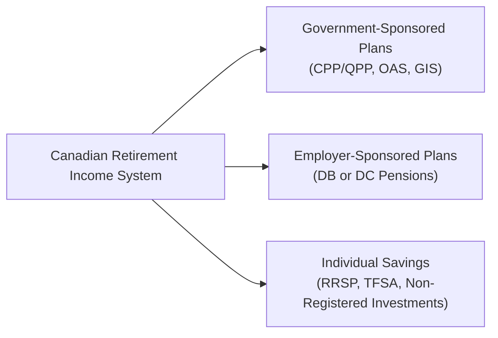

## 6.2 What are the Main Pension Plans in Canada?

Retirement planning in Canada often feels like a multi-course buffet: You have a bit from the government-sponsored plates—Canada Pension Plan (CPP) or Québec Pension Plan (QPP), Old Age Security (OAS), and the Guaranteed Income Supplement (GIS)—and then you add a serving from your employer-sponsored plan (if you’re lucky enough to have one). The combination of these different “streams” forms the backbone of Canadian retirement income. In this section, we’ll explore how these streams work, how they fit together, and what you (or your clients) need to keep in mind when planning for retirement.

Before we dive in, let me just share a quick personal anecdote—which I hope you’ll find helpful. Many years ago, a family friend who was nearing retirement admitted she hadn’t really paid close attention to her CPP contributions or how much OAS she might qualify for. She had a sort of “set it and forget it” mentality. When she finally crunched the numbers, she realized her basic government benefits would only cover a fraction of her expenses, so she scrambled to boost her private savings. That’s when I learned just how important it is to get a holistic view of all possible pension plans early on.

In this chapter, we aim to provide not just a breakdown of Canada’s principal retirement plans, but also practical insights and strategies you can use right away—or share with clients—to ensure adequate retirement income.

--------------------------------------------------------------------------------
  
### Why Understanding Pension Plans Matters

You might be wondering: “Why do I need to know all the details about these pension plans?” Well, making informed decisions about contributions, timing of retirement, and coordination with other registered plans (like RRSPs, TFSAs, or employer pensions) is crucial in achieving a comfortable retirement lifestyle. For industry professionals, being well-versed in the different pension structures is indispensable for ensuring suitability of recommendations (see Chapter 6.1 for an introduction to Suitability of Investments and Investment Strategies). And for individuals—hey, we’re all heading to retirement eventually—understanding these plans can ease that transition immensely.

--------------------------------------------------------------------------------

### The Canadian Pension Landscape at a Glance

Let’s begin with a simple diagram that maps out the main components of Canadian retirement income. This is by no means exhaustive—individuals may also have annuities, Registered Retirement Income Funds (RRIFs), TFSAs, and so on—but it helps to see how government plans and employer pensions fit into the bigger picture.

In the diagram above:  
• Government-Sponsored Plans are the fundamental pillars of retirement income for most Canadians, though they may not meet everyone’s complete financial needs.  
• Employer-Sponsored Plans can significantly boost retirement income if you’re fortunate enough to have them.  
• Individual Savings act as the personal safety net and provide flexibility to complement or fill gaps in other income sources.  

--------------------------------------------------------------------------------

### Government-Sponsored Pension Programs

#### Canada Pension Plan (CPP)

The Canada Pension Plan (CPP) is the mandatory, contributory public pension plan that covers most employed and self-employed Canadians outside of Québec. If you’re living in Québec, you’d instead contribute to—and eventually receive benefits from—the Québec Pension Plan (QPP), which we’ll discuss in a moment.

• **Contributions**: Typically split evenly between employers and employees, while self-employed folks pay both the employer and employee portions.  
• **Benefit Calculation**: Depends on how much and how long you contribute. The longer (and higher) your contributions, the larger your retirement pension.  
• **Timing**: You can start receiving CPP as early as age 60 or as late as age 70. The earlier you take it, the lower the monthly amount; delay up to 70, and your monthly payment goes up.

One big question clients often have is: “Should I take CPP early at 60 or wait until 65—or even 70?” Well, it depends on personal circumstances like longevity expectations, current health, employment status, and tax implications. There’s no one-size-fits-all answer, but a thorough analysis of expected retirement needs is always wise.

#### Québec Pension Plan (QPP)

Residents of Québec participate in the QPP instead of CPP. The QPP and the CPP are similar in structure, contribution rates, and types of benefits. However, there may be minor differences in contribution thresholds or additional provisions. For most discussion points, QPP contributions and benefits mirror the CPP’s overall concept.

--------------------------------------------------------------------------------

### Old Age Security (OAS)

Old Age Security (OAS) is a monthly social security payment that’s funded from the Government of Canada’s general revenues. Unlike CPP/QPP, it does not require prior contributions directly into the program to qualify. Instead, it’s primarily based on your years of residency in Canada.

• **Eligibility**: Must be 65 years or older and meet certain residency requirements.  
• **Clawback or Recovery Tax**: High-income seniors may see some or all of their OAS benefits clawed back if their net income exceeds a threshold set by the government. This is formally known as the OAS Recovery Tax.  

One little nuance: You can choose to defer OAS payments up to age 70, which may increase the monthly benefit.

--------------------------------------------------------------------------------

### Guaranteed Income Supplement (GIS)

The Guaranteed Income Supplement (GIS) is a monthly benefit for low-income OAS pensioners, designed to help cover basic living expenses. Here are a few highlights:

• **Non-Taxable**: GIS payments are not subject to income tax, which can help keep retirement tax burdens manageable.  
• **Eligibility**: Must be receiving OAS, with total income below a certain annual threshold.  
• **Impact**: For those individuals who rely heavily on government-sponsored plans, GIS can make a critical difference in their standard of living.

--------------------------------------------------------------------------------

### Employer-Sponsored Pension Plans

Employer pensions can bolster retirement income significantly, complementing government-sponsored plans. These plans usually fall into two major categories:

#### Defined Benefit (DB) Plans

A Defined Benefit plan promises a specific monthly benefit at retirement. The formula often considers a combination of your average or final salary, your years of service, and an accrual rate (e.g., 1.5% or 2%).

• **Example Formula**:  
  Monthly Pension = (Years of pensionable service) × (Accrual rate) × (Average salary over a specific period)

• **Risk Distribution**: **The employer** generally bears the investment risk. If the plan’s investments underperform, the employer is responsible for making up shortfalls.  
• **Benefit Predictability**: DB Plans are appealing for many because the income is fairly predictable.

##### Common Pitfalls with DB Plans  
• **Vesting and Portability**: If you leave before you’re vested, you might lose some or all benefits. Although many modern DB plans have shorter vesting periods, it’s essential to confirm your plan’s details.  
• **Pension Adjustments**: DB plan memberships can reduce the amount of RRSP contributions you’re allowed to make (the “Pension Adjustment” on your T4 slip).  

#### Defined Contribution (DC) Plans

A Defined Contribution plan sets fixed contributions from the employer, employee, or both—these contributions are invested on behalf of the employee. The final retirement benefit depends on the accumulated balance in the plan at retirement (i.e., your contributions, employer’s contributions, and the investment returns).

• **Investment Risk**: **You—the plan member—bear much of the investment risk because if your chosen investments do poorly, your retirement pot may be smaller.  
• **Flexibility**: You often get a say in how your account is invested, which can be empowering if you have the know-how but can feel daunting if you don’t.  
• **Retirement Benefit**: The ultimate payout can vary widely.  

##### Common Pitfalls with DC Plans  
• **Insufficient Contributions**: Because the monthly payout in retirement hinges so heavily on the eventual account balance, not enough contributions—or poor investment choices—can lead to a shortfall.  
• **Fees**: Investment management fees can erode account balances over time.  

--------------------------------------------------------------------------------

### Integrating Government and Employer Pensions

One of the key reasons you need to understand these pensions is that each plays a different role in providing retirement income. For many clients, government plans like CPP/QPP and OAS/GIS may cover basic living needs but not enough for the “fun stuff” in retirement. Employer-sponsored plans can help fill the middle tier. And if there’s a gap, personal savings such as RRSPs and TFSAs come into play.

When advising clients or planning for yourself, consider:

1. **Optimal Timing**: Deciding when to begin CPP/QPP and OAS can significantly affect long-term retirement income.  
2. **Spousal Benefits**: Both CPP and OAS offer provisions that may affect benefits for spouses or common-law partners, especially in cases of sharing or the death of a spouse.  
3. **Income Splitting**: For married or common-law couples, income splitting strategies may help reduce overall tax liability.  
4. **Clawback Thresholds**: Be mindful of potential OAS clawbacks if the retiree’s total annual income surpasses certain levels.

--------------------------------------------------------------------------------

### Real-World Scenario: The Cautious Couple

Let’s take a quick hypothetical example. Suppose we have Mark and Sarah, both 63. Mark has been an employee with a sizable corporation for over 30 years and has a DB plan that promises around $2,000 a month starting at age 65. Sarah is self-employed and contributes to CPP, but because her income has fluctuated, her projected CPP is modest—around $600 a month at 65. Both plan to start OAS at 65, expecting $700 each per month.

If they both retire at 65 with no other savings:  
• Mark: $2,000 (DB) + $1,200 (CPP—because he had maximum years of contributions) + $700 (OAS) = $3,900/month  
• Sarah: $600 (CPP) + $700 (OAS) = $1,300/month

Combined, they have around $5,200/month, or $62,400/year, before taxes. However, if Mark had decided to start CPP at 60 instead (at a reduced rate), or Sarah delayed her CPP to 70, these numbers would shift. More importantly, if Sarah had a tough year or two and missed substantial CPP contributions, her monthly benefit might be lower. This scenario underscores the importance of reviewing the interplay between different pension sources and personal savings regularly.

--------------------------------------------------------------------------------

### Coordinating with Registered Plans (RRSPs, TFSAs)

Registered Retirement Savings Plans (RRSPs) and Tax-Free Savings Accounts (TFSAs) give individuals more control over investment choices and can bridge potential retirement income gaps. For DB or DC plan members, keep these considerations in mind:

- **RRSP Contribution Room**: Reduced for those in pension plans due to Pension Adjustments. Make sure to verify your annual contribution limits (as found on your Canada Revenue Agency Notice of Assessment).  
- **TFSA’s Flexibility**: TFSAs are unaffected by pension adjustments and are an excellent complement, especially for higher earners who might be subject to OAS clawbacks. TFSA withdrawals are not considered taxable income and do not affect OAS or GIS calculations.  
- **Spousal RRSPs**: For couples with income disparities, spousal RRSPs allow the higher-earning spouse to contribute to a plan in the lower-earning spouse’s name, potentially balancing out retirement incomes and tax liabilities.

--------------------------------------------------------------------------------

### Common Pitfalls and Practical Tips

1. **Ignoring the Clawback**: Many retirees are surprised when OAS payments are partially or fully clawed back because they earn above the threshold. It’s a good idea to project retirement income accurately and, if possible, minimize net income to avoid or reduce the clawback.  
2. **Overlooking Survivor Benefits**: The CPP/QPP provides survivor benefits, but DB or DC plans may have rules about survivor payouts (e.g., a spousal pension at 60% of the retiree’s benefit). Always consider the financial well-being of the surviving spouse.  
3. **Not Reviewing the Annual CPP/QPP Statement**: This statement shows your contributions and provides a rough estimate of what you can expect—a valuable planning tool.  
4. **Delaying Planning Until It’s Too Late**: Planning for retirement is an ongoing process. Encourage clients (or yourself) to start thinking about these matters well before they hit 65.  
5. **Forgetting Indexed Benefits**: DB pensions, CPP/QPP, and OAS often have inflation protection or partial indexing. But not all do—or the indexing might not always match the full inflation rate.  

--------------------------------------------------------------------------------

### Tools and Resources

Canada has a range of official resources that can help you or your clients dissect pension entitlements and retirement calculations:

- **Service Canada**  
  (https://www.canada.ca/en/employment-social-development/corporate/portfolio/service-canada.html)  
  This is the go-to platform for accessing CPP/QPP and OAS/GIS information, submitting applications, and reviewing estimated benefits.  

- **Retirement Income Calculator**  
  (https://www.canada.ca/en/services/benefits/publicpensions/cpp/retirement-income-calculator.html)  
  An online tool from the Government of Canada. You plug in some numbers—like your CPP/QPP contribution history, your savings amounts, and even potential employer pensions—and you get a projection of what your post-retirement monthly income might look like.

- **“Retirement Income for Life: Getting More Without Saving More” by Frederick Vettese**  
  This insightful book dives deep into strategies for optimizing your retirement income, including how to balance out government benefits with personal savings or workplace pensions.

--------------------------------------------------------------------------------

### Best Practices for Advisors and Individuals

• **Conduct a Benefit Audit**: Periodically request or download updated CPP/QPP statements, check OAS eligibility, and confirm employer-sponsored plan details.  
• **Project Different Retirement Scenarios**: Use the Government of Canada’s Retirement Income Calculator to model various retirement ages (e.g., 60, 65, 70) and contribution levels.  
• **Layer the Income Streams**: Visualize how government benefits, employer pensions, and personal savings layer together to form total retirement income.  
• **Stay Current on Legislative Changes**: Pensions and tax laws can change. Keep an eye on updates from Finance Canada and other regulatory bodies.  
• **Balance Risk**: If you’re in a DC plan, ensure your investment choices match your risk tolerance and expected retirement timeline.  
• **Work with a Professional**: An advisor who understands both the technical side of pensions and the human side of retirement can help create a cohesive strategy—one that’s “tax-smart” and tailored to individual goals.

--------------------------------------------------------------------------------

### Conclusion

The Canadian pension system can feel complicated, but once you break it down, you’ll see it’s more of a layered approach to retirement. OAS and GIS ensure a baseline for seniors with lower incomes. CPP/QPP provides a contributory-based benefit that rewards longer and higher contributions. Employer-sponsored DB and DC plans can add a critical second tier—often bridging the gap between “just getting by” and a comfortable standard of living. Finally, personal savings in RRSPs, TFSAs, and other investment vehicles can fill in any gaps remaining.

The sooner you get a handle on your pension picture—both government-sponsored and employer-sponsored—and the sooner you encourage your clients to do the same, the smoother the path to retirement security. And remember—if you have any lingering questions, the best next step is to consult official resources (like Service Canada) or speak with a professional advisor. It’s never too early to start shaping the life you want in retirement.

--------------------------------------------------------------------------------

## Quiz: Pension Plans in Canada



### 1. Which of the following statements best describes the Canada Pension Plan (CPP)?

- [ ] It is a purely voluntary plan funded by the Government of Canada’s general revenues.  
- [x] It is a mandatory, contributory plan funded by both employees and employers.  
- [ ] It is a tax-free savings account managed by individual investors.  
- [ ] It is a short-term disability plan administered by CIRO.

> **Explanation:** The Canada Pension Plan (CPP) is a mandatory, contributory plan where both employees and employers contribute, or self-employed individuals pay both portions.

---

### 2. What is the primary difference between a Defined Benefit (DB) and a Defined Contribution (DC) plan?

- [ ] DB plans invest contributions, and DC plans promise a fixed monthly amount at retirement.  
- [x] DB plans promise a predictable income based on a formula, while DC plans’ payouts depend on investment performance.  
- [ ] DB plans are always fully funded, while DC plans are usually underfunded.  
- [ ] DC plans are insurance-based, whereas DB plans are equity-based.

> **Explanation:** DB plans use a formula based on service and salary to determine a known monthly benefit, whereas DC plans’ final payout depends on contributions and investment growth.

---

### 3. Which crucial government benefit specifically supports low-income Canadian seniors?

- [ ] OAS  
- [ ] CPP  
- [ ] QPP  
- [x] GIS  

> **Explanation:** The Guaranteed Income Supplement (GIS) is a non-taxable benefit for OAS recipients with low incomes.

---

### 4. When are you typically eligible to begin receiving Old Age Security (OAS)?

- [x] Age 65, with the option to defer up to 70.  
- [ ] Age 60, with the option to defer up to 65.  
- [ ] Immediately upon retirement, regardless of age.  
- [ ] Only after you have contributed for 10 continuous years.

> **Explanation:** Under normal residency circumstances, OAS begins at 65, but you can choose to defer payments up to age 70 for a higher monthly benefit.

---

### 5. In most Defined Benefit plans, which party bears the investment risk?

- [ ] The plan member (employee).  
- [ ] A government agency.  
- [x] The employer (plan sponsor).  
- [ ] Independent trustees outside of the sponsor.

> **Explanation:** In a DB plan, the plan sponsor (employer) must ensure sufficient funding to deliver the promised benefits, thus bearing the investment risk.

---

### 6. Which statement describes the OAS clawback?

- [x] A recovery tax applied to higher-income recipients of OAS.  
- [ ] A voluntary contribution limit for certain retirees.  
- [ ] A maximum cap on all CPP/QPP benefits.  
- [ ] A penalty applied to employers who underfund DB plans.

> **Explanation:** The OAS clawback (or recovery tax) reduces OAS benefits for beneficiaries whose income exceeds a specified threshold.

---

### 7. Which of the following rewards come with deferring CPP/QPP benefits beyond age 65?

- [ ] Reduced monthly benefits.  
- [ ] Exemption from income tax.  
- [x] Increased monthly benefits.  
- [ ] Elimination of OAS clawback.

> **Explanation:** Delaying CPP/QPP past age 65 increases the monthly payment, reflecting the shorter payout period and additional credit for deferred benefits.

---

### 8. How do employer-sponsored pensions typically interact with RRSP contribution room?

- [ ] They have no effect on RRSP contribution limits.  
- [x] They reduce available RRSP qualitying space through Pension Adjustments.  
- [ ] They fully replace the need for an RRSP.  
- [ ] They require the same tax slip as RRSP accounts.

> **Explanation:** Employer-sponsored pension contributions create a Pension Adjustment (PA) that reduces your annual RRSP contribution room, ensuring overall tax assistance remains balanced.

---

### 9. In a Defined Contribution plan, which factor largely dictates the eventual retirement payout an employee will receive?

- [ ] A government-set benefit formula.  
- [ ] The employee’s length of service only.  
- [x] Investment returns on contributions.  
- [ ] The employer’s annual profit margin.

> **Explanation:** In a DC plan, the final retirement benefit depends largely on the investment performance of the contributed funds (both employer and employee contributions).

---

### 10. True or False: The Guaranteed Income Supplement (GIS) is taxable income.

- [ ] True  
- [x] False  

> **Explanation:** GIS is a non-taxable benefit provided to low-income seniors who are receiving OAS. It does not add to the recipient’s taxable income.


