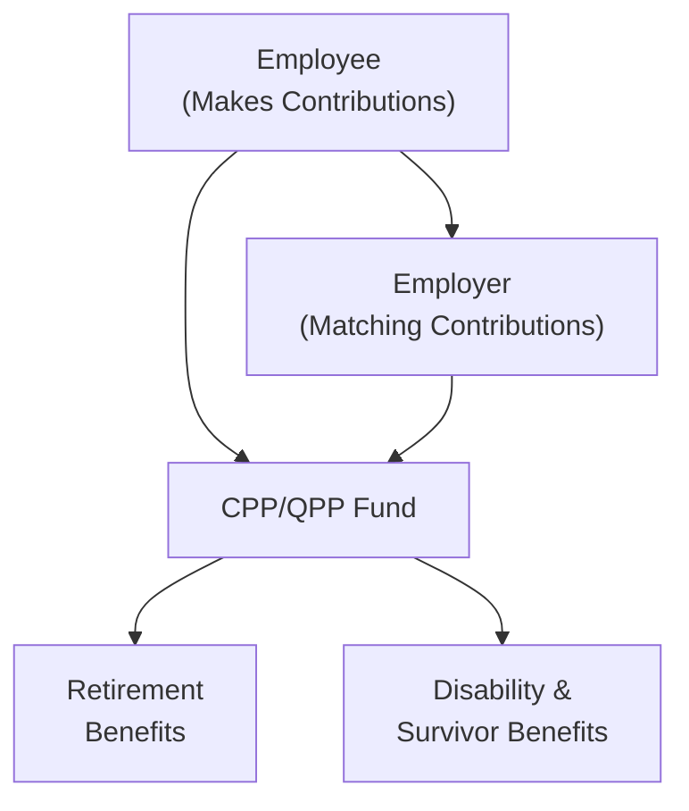
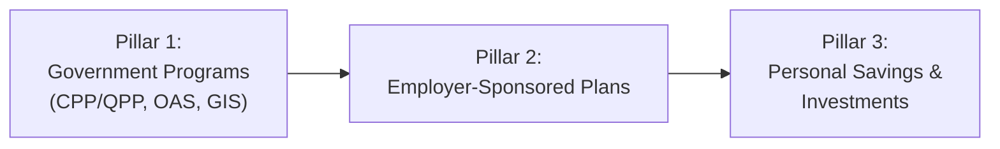

## 6.3 What Are the Main Pension Plans in Canada?

Planning for retirement is such a critical aspect of a client’s financial picture, and if I can share a quick personal story: I vividly remember chatting with my aunt a few years back about how confusing she found all these Canadian pension programs—CPP, QPP, OAS, GIS, DB, DC, you name it. She kept mixing them up, not sure which ones applied to her or when to apply. So, let’s break them down carefully, step by step. In this section, we’ll look at the main pension programs available in Canada, how they work, and how you, as a mutual fund sales representative (or simply as a curious learner), can guide clients in understanding their income in retirement.

These pension plans often form the backbone of a client’s retirement strategy, so it’s important to know how each operates. The conversation also ties closely to tax planning (see earlier sections in this chapter) and the broader goal of ensuring clients have sufficient income to live comfortably in their golden years. 

We’ll take a slightly informal tone here—almost like talking to a friend over coffee—but rest assured, all the key details are accurate according to Canada’s regulatory environment (with the final word always being the government’s official documentation). Let’s begin!

---

### The Canada Pension Plan (CPP) and the Quebec Pension Plan (QPP)

If you work in the rest of Canada, you may be more familiar with the Canada Pension Plan (CPP). If you’re in Quebec, you’ve likely heard of the Quebec Pension Plan (QPP). They’re very similar in structure, offering retirement, disability, and survivor benefits, but they’re administered by different authorities.

• CPP is managed federally by the Canada Pension Plan Investment Board (CPPIB).  
• QPP is managed provincially by Retraite Québec.

#### How Do Contributions Work?

Both CPP and QPP are funded by contributions from employees and employers (and also the self-employed, but with a slightly different formula). Essentially, each participant contributes a percentage of their pensionable earnings up to an annual maximum. Employers match their employees’ contributions. If you’re self-employed, you pay both the “employee” and “employer” portions. 

Here’s a little diagram to help visualize that flow:

These contributions typically come right off an individual’s paycheck, so it’s not something they have to think about too often—except for the annual maximum. In practice, your client’s pay stub might show “CPP Contribution” or “QPP Contribution,” reflecting the current rate.

#### Retirement Benefit Timing

The age at which one chooses to start receiving CPP/QPP is pretty flexible:

• Early benefits can be taken as soon as age 60, but they’re reduced for each month before age 65.  
• Standard (unreduced) benefits commence at 65.  
• If one defers beyond age 65—up to age 70—monthly benefits increase accordingly.

The earlier you start, the lower your monthly payout. The later you start, the higher your monthly payout. In my own experience, a cousin who retired early at 61 opted for early CPP, but she ended up with smaller monthly checks. Another friend decided to wait until 70, and he ended up with a significantly bigger monthly payment. The “best” route truly depends on health status, financial circumstances, and life expectancy considerations.

---

### Old Age Security (OAS)

The Old Age Security (OAS) program is a federal pension provided to Canadian citizens (or eligible residents) aged 65 and older. It’s considered a universal benefit since it doesn’t directly depend on one’s work history contributions (unlike CPP/QPP). Instead, eligibility hinges on factors such as legal status in Canada, years of residence in Canada after age 18, and certain other criteria.

#### OAS and the Clawback

A big mention often goes to the “clawback.” If your net income surpasses a specific threshold (which is updated annually), part or all of your OAS benefit may be “recovered” by the government through the tax system. This process typically happens when you file your tax return. 

Yes, it might feel a little frustrating to figure out that you’re receiving OAS only to have some of it “clawed back.” But it’s an income-tested measure. The idea is that if your income is high, you may not require the full OAS supplement as much as someone with a more modest retirement income.

---

### Guaranteed Income Supplement (GIS)

The Guaranteed Income Supplement (GIS) is specifically targeted at lower-income seniors who are already receiving OAS. So, if your client is over 65, qualifies for OAS, and falls below a certain income threshold, they may receive GIS. This monthly payment can significantly impact the financial well-being of seniors who don’t have substantial retirement savings.

In practical client scenarios, some seniors rely heavily on OAS + GIS if their employer-sponsored pension or CPP/QPP amounts are low. As a mutual fund sales representative, your role could be to ensure that your client’s investments help them maintain an income level that is comfortable later in life—while keeping in mind the interplay between GIS benefits and additional income that might reduce these benefits.

---

### Employer-Sponsored Pension Plans

Employer-sponsored pension plans come in two major flavors: Defined Benefit (DB) and Defined Contribution (DC). They’re a big part of the retirement puzzle if your clients have them.

#### Defined Benefit (DB) Plan

A Defined Benefit plan is like a promise. The employer essentially says, “If you work here X number of years, and your final salary is Y, we’ll pay you Z for the rest of your life.” The formula used to calculate pension benefits typically takes into account:

• Your earning history (often an average of highest earnings)  
• Your years of service  
• A pension factor (like 2% per year of service, for example)

DB plans can be wonderful from a security standpoint—participants know what they’ll receive in retirement. My uncle, for instance, worked in the public sector. He had a DB plan that guaranteed him a stable income after 30 years of service. He never had to worry about investment returns or market volatility. However, DB plans have become less common in the private sector due to the high cost of guaranteeing benefits. 

#### Defined Contribution (DC) Plan

In a Defined Contribution plan, the employer commits to contributing a certain amount or percentage of your salary to your retirement account. The retirement benefit you eventually receive depends on:

• How much is contributed (by both employer and employee)  
• How well the investments in the plan perform  
• The plan fees or fund management costs

When participants retire, the value of their DC plan pot is used to generate retirement income—potentially via annuities, RRIFs, LIFs, or other vehicles. One drawback for risk-averse individuals is that the DC plan places more investment and longevity risk on the employee. If the markets do poorly, or if you outlive your savings, your retirement income might be less secure. On the flip side, if investments do quite well, you could end up with more retirement funds than a typical DB formula might allow.

---

### Balancing Your Clients’ Pension Plans with Their Broader Portfolios

You might be thinking, “Okay, that’s a lot. How do I combine all these pieces for a client?” Generally, you’ll look at:

• What they expect from public pension programs (CPP/QPP, OAS, GIS).  
• Any employer-sponsored pension (DB or DC).  
• Their personal savings (RRSPs, TFSAs, non-registered investments).

It helps to run simulations—like “What if I retire at 60? What if I wait until 65? What if I hold off to 70?” The Government of Canada provides the [Retirement Income Calculator](https://www.canada.ca/en/services/benefits/publicpensions/cpp/retirement-income-calculator.html), which can help your client see approximate numbers. 

The wide range of potential outcomes is also a big reason to consider professional financial planning or portfolio design. And from a compliance perspective, as a mutual fund sales representative, you must ensure that any recommendations align with the Know Your Client (KYC) and suitability considerations that we discuss in earlier chapters. Remember that CIRO, Canada’s current self-regulatory organization, expects you to conduct thorough due diligence before suggesting investment strategies that could affect your clients’ retirement prospects.

---

### A Quick Glossary Refresher

• **Canada Pension Plan (CPP):** A federally managed, contributory pension plan providing retirement income, along with disability and survivor benefits.  
• **Quebec Pension Plan (QPP):** The version of CPP that serves residents of Quebec, administered by Retraite Québec.  
• **Old Age Security (OAS):** A monthly government benefit for seniors over 65, based on years of residency in Canada. There’s a potential clawback for higher earners.  
• **Guaranteed Income Supplement (GIS):** A supplement for low-income seniors who qualify for OAS, helping them meet basic daily needs.  
• **Defined Benefit (DB) Plan:** An employer-sponsored plan guaranteeing a specified benefit in retirement, based on a formula of service and average earnings.  
• **Defined Contribution (DC) Plan:** An employer-sponsored plan where contributions are defined. The final retirement benefit depends on investment performance.  
• **Clawback:** If an individual’s income exceeds certain thresholds, part or all of OAS benefits may be recovered through the tax system.

---

### Case Study: Sarah’s Retirement Planning Dilemma

Let’s look at a fictional example. Sarah is 62, living in Ontario, and deciding when to begin receiving her CPP. She estimates she’ll get around $900 a month if she starts at 65, but if she takes it now at 62, that figure would be lower because of early benefit reductions.

Sarah also expects to receive OAS at 65, but she’s worried about the clawback because she’s receiving $25,000 a year in part-time consulting income. She’s not sure if she’ll be over the threshold. With the advice of her mutual fund sales representative, she checks the [Federal Government’s official page for CPP/OAS](https://www.canada.ca/en/services/benefits/publicpensions.html) to understand the exact thresholds and calculations. Then she runs the [Canadian Retirement Income Calculator](https://www.canada.ca/en/services/benefits/publicpensions/cpp/retirement-income-calculator.html) to project scenarios. 

After seeing the numbers, Sarah opts to wait until 65 for CPP to secure a higher monthly benefit and manages her part-time business income so that she doesn’t exceed the OAS threshold by too large a margin. She invests her personal savings in low-volatility mutual funds that align with her moderate risk tolerance, aiming to ensure steady growth without too much unpredictability.

---

### Best Practices from a Mutual Fund Sales Representative Perspective

• **Integrate Pension Projections in Financial Plans:** Factor in CPP/QPP, OAS, and any employer-sponsored plan calculations when recommending product allocations or asset mixes. This helps ensure the retirement plan is comprehensive.

• **Monitor the Clawback Thresholds:** If your client’s income is close to the OAS threshold, consider timing investment withdrawals or deferring certain income sources to reduce the OAS clawback. But remember, any advice needs to be consistent with your registration category and your firm’s policies. Don’t cross legal lines in offering tax advice unless you’re properly qualified.

• **Educate Clients on the Timing Factor:** Early retirement might sound nice, but the reduction in CPP/QPP can be significant over time. Conversely, deferring beyond 65 can lead to an enhanced monthly benefit.

• **Stay Current on Plan Changes:** Government pension programs, contribution limits, and thresholds can change. Check official sources each year, such as the [Quebec Pension Plan details](https://www.rrq.gouv.qc.ca/en) page for QPP updates.

• **Assess DB or DC Plans Thoroughly:** For clients with employer plans, understand whether it’s a DB or DC format. This knowledge helps you plan their other investments. For instance, if it’s a DB plan guaranteeing a certain monthly income, your client might handle volatility in their mutual fund portfolio differently than someone with a riskier DC plan.

• **Ensure Compliance with CIRO Requirements:** CIRO expects mutual fund representatives to put investors’ interests first, to follow suitability rules, and to be transparent about fees, charges, and other considerations. If you’re advising on a product that interacts with a client’s pension income, document your rationale clearly.

---

### Potential Pitfalls and How to Avoid Them

• **Starting CPP/QPP Too Early Without Considering Longevity:** Some folks jump at the chance to take CPP at 60. Later, they realize that if they live into their 90s, this approach might result in less lifetime income. Encourage clients to estimate life expectancy and consider alternative strategies.

• **Ignoring OAS Clawback Until Tax Time:** If you don’t plan well, you could receive full OAS throughout the year, then get a big surprise at tax filing time. Educate clients on how to track and manage their annual income.

• **Forgetting to Incorporate GIS Eligibility:** If your client might qualify for GIS, be mindful that certain investment or part-time work income could push their net income just above the threshold. Sometimes, a small shift in how income is structured can preserve valuable GIS benefits.

• **Overlooking Employer Plan Vesting Schedules (DB/DC):** In some cases, employees need to work a certain length of time or meet service conditions to become vested in their employer’s pension plan. Encourage clients to check their plan’s fine print.

• **Misunderstanding the Interaction with RRSPs/TFSAs:** Some clients might have robust RRSP or TFSA balances in addition to pensions. A high RRSP withdrawal might inadvertently trigger an OAS clawback or reduce GIS eligibility. This doesn’t mean they shouldn’t draw on RRSPs—just do it strategically.

---

### Visual Snapshot of Canada’s Three-Pillar Retirement System

The Canadian retirement income system is often described as having three “pillars”:

Pillar 1 is the “public pension” aspect; Pillar 2 involves employer-sponsored systems; Pillar 3 is everything else—personal savings, TFSAs, RRSPs, non-registered accounts, real estate, and so on.

---

### Additional Resources for Further Exploration

• **Federal Government’s Official Page for CPP/OAS**  
  (https://www.canada.ca/en/services/benefits/publicpensions.html)  
  The best place to find the most up-to-date information on contribution rates, benefit amounts, and eligibility criteria.

• **Quebec Pension Plan (QPP) Details**  
  (https://www.rrq.gouv.qc.ca/en)  
  For anyone living or working in Quebec, this is the essential resource.

• **Canadian Retirement Income Calculator**  
  (https://www.canada.ca/en/services/benefits/publicpensions/cpp/retirement-income-calculator.html)  
  An interactive tool to estimate how much your clients might receive from CPP/QPP, OAS, and employer pensions.

• **CIRO Requirements for Pension-Related Advice**  
  (https://www.ciro.ca)  
  CIRO is Canada’s self-regulatory organization overseeing mutual fund dealers and investment dealers. It publishes rules and guidelines on how to guide clients ethically and responsibly. Check the website for updated compliance expectations.

• **Financial Planning Standards Council (FPSC) or FP Canada**  
  (https://www.fpcanada.ca)  
  A body that provides certification for financial planners, often considered the “gold standard” in thorough, client-centered financial planning.

---

### Conclusion

Pensions often provide the baseline for a Canadian’s retirement income. By combining CPP/QPP, OAS, GIS, and any employer-sponsored pension, many retirees can build a stable foundation to meet essential expenses. However, the real trick lies in understanding precisely how these plan benefits interact and how they can be optimized or integrated with one’s personal investments.

For you, as a mutual fund sales representative—and as a key source of guidance for your clients—this knowledge is critical. Not only does it help you align your product recommendations with your clients’ personal circumstances (hello, KYC and suitability!), but it also builds trust when you can explain the ins and outs of Canada’s pension system in a friendly, confident manner.

Remember: the devil’s in the details. Encourage your clients to pay attention to annual official updates, especially for contribution limits and thresholds. And if you ever find yourself unsure about something, point your clients toward reliable resources like the government’s official sites or a qualified financial planner. 

---

## Mastering Canadian Pension Plans: A Comprehensive Quiz



### Which two programs form the foundation of government pension benefits in Canada (outside Quebec)?
- [x] Canada Pension Plan (CPP) and Old Age Security (OAS)
- [ ] Quebec Pension Plan (QPP) and Old Age Security (OAS)
- [ ] Employee Pension Plan (EPP) and Guaranteed Income Supplement (GIS)
- [ ] Registered Retirement Savings Plan (RRSP) and OAS
> **Explanation:** CPP and OAS are the primary public components of Canada’s retirement system for individuals who do not reside in Quebec. QPP replaces CPP for Quebec residents.

### What happens if a Canadian resident defers collecting CPP beyond age 65?
- [x] Their monthly benefit increases for each month of deferral up to age 70
- [ ] Their employer must contribute more to the plan
- [ ] Their monthly benefit decreases for each month of deferral
- [ ] Nothing; CPP cannot be deferred
> **Explanation:** Deferring CPP after 65 can result in enhanced monthly benefits, up to a maximum age of 70.

### What is the purpose of the OAS clawback?
- [x] To recover OAS benefits from higher-income seniors
- [ ] To penalize seniors who apply early
- [ ] To reduce unemployment insurance premiums
- [ ] To increase CPP contributions
> **Explanation:** OAS benefits are income-tested; when a recipient’s income exceeds a certain threshold, a portion of OAS must be repaid.

### True or False: GIS is available to all seniors receiving OAS, regardless of income level.
- [ ] True
- [x] False
> **Explanation:** GIS is a supplemental payment specifically designed for low-income seniors who already qualify for OAS.

### Which statement best describes a Defined Benefit (DB) pension plan?
- [x] It guarantees a specified outcome based on years of service and salary
- [ ] It offers no guaranteed outcome, as benefits depend on investment returns
- [x] Employers have no obligation to fund the plan
- [ ] It is identical to a Registered Retirement Savings Plan (RRSP)
> **Explanation:** DB plans typically promise a set payout for retirement, often based on an average of the employee’s earnings and years of service. However, note that employers do have an obligation to fund the plan adequately.

### Which approach could help reduce the impact of the OAS clawback for high-income earners?
- [x] Delaying certain withdrawals from RRSPs or other income sources
- [ ] Taking CPP early at 60
- [ ] Refusing to file taxes
- [ ] Investing in only the highest-risk mutual funds
> **Explanation:** Spacing out or postponing certain withdrawals (subject to personal and tax considerations) may keep overall income below the clawback threshold.

### What is a primary difference between Defined Contribution (DC) and Defined Benefit (DB) plans?
- [x] DC plans do not guarantee a specific monthly benefit in retirement
- [ ] DC plans require no contributions from employees
- [x] DB plans depend on daily investment decisions by employees
- [ ] DB plans are never offered in the public service
> **Explanation:** DC plan outcomes hinge on the contributions plus the investment performance, while DB plans promise a predetermined formula-based payment.

### Can Canadians receive their CPP/QPP benefits as early as age 60?
- [x] Yes, but benefits will be reduced for each month before age 65
- [ ] No, the earliest is age 65
- [ ] Yes, and the benefits are the same as at 65
- [ ] Only if their employer grants permission
> **Explanation:** Early commencement of CPP/QPP at 60 is allowed, but the monthly payment is reduced compared to starting at 65.

### In Quebec, which pension plan replaces the CPP?
- [x] QPP
- [ ] OAS
- [ ] GIS
- [ ] DB Plan
> **Explanation:** Quebec Pension Plan (QPP) is the provincial equivalent of the Canada Pension Plan.

### True or False: The Canadian Investment Regulatory Organization (CIRO) replaced both IIROC and MFDA and now oversees investor and dealer regulations in Canada.
- [x] True
- [ ] False
> **Explanation:** Effective January 1, 2023, MFDA and IIROC merged into the new self-regulatory organization, CIRO.


