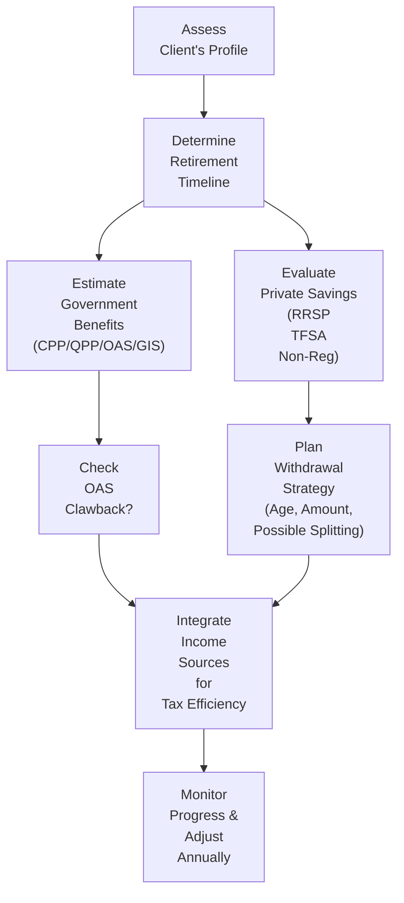

## 6.4 Additional Considerations in Retirement Planning

Retirement planning can feel like a maze at first—there are so many options, twists, and turns. You’ve got registered plans, TFSAs, government benefits, income-splitting tactics, estate considerations, and all those special tax credits. It’s easy to feel overwhelmed, especially if you’re new to the process or your clients are peppering you with questions about how to juggle everything at once. But don’t worry. In this section, we’ll keep things straightforward and practical, so that you can walk away feeling confident about guiding clients on the path to a comfortable and financially secure retirement.

This article expands on how advisors might go beyond the foundational steps and address the nuances of retirement planning in Canada. We’ll explore how to layer in government benefits (like CPP/QPP, OAS, and GIS), optimize TFSA usage, strategize early withdrawals (with minimal pain), split income to reduce tax burdens, and handle estate transitions with ease. Now, let’s dig in and make sense of it all.

---

### Integrating Government Benefits

When we talk about government benefits in Canada, we usually refer to the following:

• Canada Pension Plan (CPP) or Quebec Pension Plan (QPP)  
• Old Age Security (OAS)  
• Guaranteed Income Supplement (GIS)  

Each of these has different qualification rules and different amounts. One big question people always ask is: “What’s the right age to start taking CPP/QPP or OAS?” It depends on each client’s financial situation, health, and personal preferences. 

One of my friends once told me she regretted starting CPP early because she later realized she didn’t need the income right away. She would have earned more if she’d waited. On the other hand, I know a gentleman who was concerned about life expectancy and was eager to receive benefits as soon as possible, so he started them earlier. That’s the thing—there’s no universal rule. Each client’s health, family situation, other income sources, and financial goals matter.

But we can’t ignore the OAS clawback (the Recovery Tax). If a retiree’s net income surpasses a certain threshold, part or all of their OAS benefit gets taken back by the government. Advisors often coordinate investments so that retirees who might be on the cusp of the clawback threshold can reduce their taxable income to preserve more of their OAS. For instance, focusing on earning tax-free income from TFSAs or spreading out withdrawals in tax-advantaged ways might help keep them under that line.

And let’s not forget the Age Credit. This non-refundable tax credit can reduce taxes for individuals 65 and older, but it starts to get clawed back if income exceeds a particular limit. Keep an eye on it whenever you’re running projections.

---

### Planning with TFSAs

TFSAs tend to be an overlooked hero in retirement planning. Sure, they’re not tax-deductible like RRSP contributions, but they can still be powerful. Contributions grow tax-free, and—yay—withdrawals remain tax-free as well. 

What does this mean in practical terms? Let’s say you have a client who’s worried about hitting that OAS clawback threshold. If part of their retirement income can come from TFSA withdrawals (which won’t show up as taxable income), this might help them stay below the threshold. Similarly, if someone is expecting to be in a high tax bracket upon retirement, TFSAs can buffer the blow and create a smooth, tax-efficient flow of income.

Another nifty advantage is that TFSA withdrawals free up contribution room in the following calendar year. So if Joe retakes a chunk from his TFSA one year—maybe for a down payment on a second property—he can re-contribute that same amount next year without penalty. The flexibility is invaluable for folks who require a bit of liquidity in retirement.

---

### Early Withdrawal and Penalties

We’ve all heard stories about people who crack open their RRSP piggy bank years before retirement. While it’s sometimes unavoidable—like a job loss or unforeseen financial emergency—early withdrawals from RRSPs can have significant tax repercussions, not to mention the potential depletion of your clients’ future nest eggs.

When a client withdraws from an RRSP early, financial institutions withhold tax at a rate determined by the withdrawal amount. There might also be additional taxes owed when they file their annual return, especially if it bumps them into a higher tax bracket. In plain words: your clients could lose more than expected if they go down this route.

From a planning perspective, it’s prudent to explore every alternative before recommending an early RRSP withdrawal. Could a personal line of credit, a TFSA withdrawal, or bridging finance options be better? Sometimes TFSAs or non-registered savings are better sources for emergency funds, leaving the RRSP intact to keep growing tax-deferred. 

---

### Income Splitting Opportunities

Income splitting is basically about leveling the playing field between higher- and lower-income spouses or common-law partners. In Canada, a few well-known strategies include:

• Spousal RRSPs: The higher-earning spouse contributes to a spousal RRSP, securing a tax deduction at their higher marginal tax rate. When withdrawn in retirement, the funds are taxed in the lower-income spouse’s hands, assuming all conditions are satisfied and attribution rules don’t kick in.  
• Pension Splitting: Allows couples to split eligible pension income (including RRIF withdrawals, in some instances). This can mean that each partner reports part of the pension income, potentially lowering overall taxes.  

Let’s say your client, Emma, makes $120,000 a year, while her spouse, Sunil, makes $40,000. Emma can contribute to a spousal RRSP for Sunil. That way, Emma gets a tax deduction at her higher rate, and when it’s time to withdraw in retirement, the money is taxed in Sunil’s bracket—usually lower. Such an arrangement can significantly shrink a family’s overall tax bill.

As an advisor, make sure you keep track of attribution rules. If the funds are withdrawn too soon (generally within three calendar years from the date of the last contribution), they might be taxed back in the hands of the contributor. 

---

### Estate Planning Implications

Retirement planning and estate planning go hand in hand. After all, who wants to set up a beautiful retirement plan only to see it unravel due to poor estate structures? Some major points to consider here involve:

• Beneficiary Designations: RRSPs, RRIFs, and TFSAs can typically pass directly to named beneficiaries (often a spouse, common-law partner, or children), bypassing probate in many provinces. This helps keep the estate settlement quick and (hopefully) drama-free.  
• Tax Consequences at Death: When someone passes, any tax-deferred or tax-free savings can be transferred to a spouse tax-free, provided all requirements are met (e.g., spouse is named beneficiary). If not going to a spouse or qualified dependent, the amount in registered plans is generally counted as income on the deceased’s final tax return, which can translate to a hefty tax bill.  
• RRSP/RRIF Rollovers: If your client’s spouse is the beneficiary, the RRSP or RRIF can usually roll into the spouse’s own plan, deferring the immediate tax on that money.  

It’s a good idea to double-check that named beneficiaries are updated regularly and reflect your client’s wishes—particularly after major life events like marriage, divorce, birth of a child, or death in the family. You’d be surprised how often outdated beneficiary designations create chaos. 

Another tip: regularly encourage clients to hold family meetings. This fosters open communication about how they want their estate and retirement accounts handled. A quick read of resources like “Estate Planning Through Family Meetings” by Lynne Butler can provide a great roadmap for those discussions.

---

### The Importance of Starting Early

Listen, I’m not just giving you the typical money talk—starting early really does matter. Even small, consistent contributions can balloon over decades. Thanks to compounding, every extra year makes a substantial difference in final portfolio value. 

One quick personal story: My cousin started contributing $100 a month to her RRSP when she was 20, just after graduating high school. Over the years, she has scaled that up. The result? She’s in her mid-40s now and has built a surprisingly large nest egg, simply by harnessing time. Contrarily, many of her peers started in their 30s or 40s and are still playing catch-up.

If your clients are younger, emphasize that they don’t need to stash away thousands every month to get ahead. Even small amounts can do wonders. Encourage them to look up “The Power of Compounding,” an article by the Ontario Securities Commission (https://www.getsmarteraboutmoney.ca/invest/investing-basics/) for quick explanations of how compounding can accelerate growth.

---

### Practical Example: Blending Government Benefits and Private Savings

Maybe you have a client couple, Amir and Chloe, who want to retire at ages 65 and 62, respectively. They each have TFSAs, RRSPs, and they plan to receive CPP/QPP at 65. Here’s how they might stitch everything together:

1. Start drawing Chloe’s TFSA early to supplement household income, ensuring her OAS eligibility at 65 isn’t reduced by an inflated net income figure.  
2. Delay Amir’s CPP by a year or two if he’s still working part-time or has other income streams, increasing his monthly benefit by a certain percentage for each year of delay (up to age 70).  
3. Use spousal RRSP withdrawals in Chloe’s name once she’s 65 so that they can split some of the pension income.  
4. Keep an eye on estate planning. They designate each other as beneficiaries on their RRSPs and TFSAs, so any leftover amount can roll over seamlessly on death without incurring immediate taxation.  

By mixing these accounts and benefits properly, they can reduce their taxes, keep OAS intact, and ensure that they’ll have enough for their retirement years.

---

### Sample Diagram: A High-Level Retirement Strategy Flow

Below is a simplified Mermaid flowchart to visualize how a Canadian retiree might evaluate their retirement income sources. Take a moment to look at how decisions on government benefits, TFSAs, and RRSP withdrawals can connect.

In this flow, the client profile might indicate a preference for retiring at different ages. Some clients have more private savings, while others rely heavily on government pensions. Stage by stage, you see how each decision affects the next.

---

### Glossary

• **OAS Clawback (Recovery Tax):** A reduction in OAS benefits for higher-income retirees.  
• **Pension Income Credit:** A non-refundable tax credit available for individuals receiving eligible pension income.  
• **Pension Splitting:** A strategy allowing couples to split pension income to reduce their total tax burden.  
• **Withholding Tax:** An amount withheld by financial institutions when RRSP/RRIF funds are withdrawn before maturity, or in excess of certain thresholds.

---

### References for Further Exploration

1. **Service Canada’s OAS and GIS Information**  
   https://www.canada.ca/en/services/benefits/publicpensions.html  
   Explains how these government benefits work, eligibility, and application processes.

2. **The Power of Compounding Article (Ontario Securities Commission)**  
   https://www.getsmarteraboutmoney.ca/invest/investing-basics/  
   Offers user-friendly examples of how investments can grow exponentially over time.

3. **Estate Planning Through Family Meetings (by Lynne Butler)**  
   Covers how to engage loved ones in estate and retirement planning discussions, ensuring everyone is on the same page.

4. **Executor’s Checklist (Various Estate Law Firms)**  
   A resource that helps future executors (often spouses or adult children) understand the step-by-step tasks involved in estate settlement.

5. **CIRO Regulations**  
   https://www.ciro.ca  
   For the latest updates on compliance requirements and best practices involving client accounts, margin, trading, and more.

Advisors should remain attentive to the ever-changing taxation landscape in Canada, verifying that the strategies recommended remain up to date with the current regulatory year. This should include, when appropriate, consultation with compliance professionals or direct reference to CIRO guidelines.

Retirement planning, after all, is dynamic and personal. By tackling government benefits, TFSAs, early withdrawals, income splitting, and estate transitions in a thoughtful, integrated way, you’ll be doing more than ticking boxes—you’ll be giving your clients a plan that can stand the test of time and changes in life circumstances.

And hey, at the end of the day, remember to start early—because time can be the best (or worst) friend your client’s retirement portfolio will ever have.

---

## Test Your Knowledge of Retirement Planning Strategies in Canada



### Which of the following statements best describes the OAS clawback?

- [ ] It’s the amount of money withheld on every RRSP withdrawal.
- [x] It’s a reduction in Old Age Security benefits for retirees who exceed specific income thresholds.
- [ ] It’s a new tax implemented on all forms of pension income.
- [ ] It’s the partial withholding of CPP/QPP payments before age 65.

> **Explanation:** The OAS clawback (Recovery Tax) is triggered when a retiree’s net income exceeds a set threshold, reducing or eliminating their OAS benefit.  

### Which account offers tax-free withdrawals, making it potentially attractive to pensioners concerned about OAS clawback?

- [ ] RRSP
- [x] TFSA
- [ ] Locked-in Retirement Account (LIRA)
- [ ] Registered Education Savings Plan (RESP)

> **Explanation:** TFSA withdrawals do not count as taxable income, which can help retirees stay under OAS clawback thresholds.  

### What main advantage does a spousal RRSP provide?

- [x] It can shift taxable income from a higher-income spouse to a lower-income spouse in retirement.
- [ ] It doubles the allowable RRSP contribution limit for the contributor.
- [ ] It eliminates withholding tax on withdrawals completely.
- [ ] It automatically eliminates OAS clawback.

> **Explanation:** A spousal RRSP can help balance tax burdens within a couple by allowing contributions from the higher-income spouse to the lower-income spouse’s RRSP, potentially lowering overall taxes in retirement.

### Which of the following is a common tax consequence of early RRSP withdrawals?

- [x] The financial institution applies withholding tax, and the withdrawal may lead to additional income tax due at year-end.
- [ ] The funds are always tax-free under Canadian law.
- [ ] Investors can deduct the withdrawal from their net income.
- [ ] Early withdrawals do not affect the filer’s overall marginal tax rate.

> **Explanation:** Early RRSP withdrawals are subject to withholding tax, and the amount is added to the individual’s total income for that year, potentially resulting in extra tax owed.

### Which strategy might help reduce a retiree’s reported taxable income and preserve access to government benefits?

- [x] Drawing additional income from TFSAs rather than RRSPs.
- [ ] Deferring all pensions until age 75.
- [x] Splitting pension income with a spouse if applicable.
- [ ] Taking lump-sum RRSP withdrawals to pay off a mortgage.

> **Explanation:** Drawing income from TFSAs (which do not count as taxable income) and splitting pension income (where eligible) can help keep reported income lower, thus avoiding or reducing clawback.

### Which of the following helps ensure that RRSP/RRIF or TFSA assets pass quickly to a beneficiary without probate?

- [x] Naming specific beneficiaries on registered accounts.
- [ ] Just notifying the estate executor verbally.
- [ ] Storing assets in a safety deposit box.
- [ ] Depositing them in a chequing account before death.

> **Explanation:** When clients name beneficiaries on registered accounts, the asset transfer often bypasses probate, speeding up the process and potentially reducing fees.

### What typically happens to RRSP assets upon death if the spouse is named beneficiary?

- [x] The RRSP can roll over to the spouse tax-free (if the spouse qualifies).
- [ ] The assets are automatically subject to immediate taxation.
- [x] The spouse must withdraw all assets immediately.
- [ ] The spouse loses beneficiary status once the owner dies.

> **Explanation:** If requirements are met and the spouse is named beneficiary, the RRSP can roll directly into the spouse’s RRSP or RRIF, deferring taxes.

### Which factor primarily determines when a person should start drawing from CPP/QPP?

- [x] Their specific financial, health, and lifestyle needs and life expectancy.
- [ ] The earliest legal age (60) regardless of financial circumstances.
- [ ] When the government automatically sends them a notice.
- [ ] Strict alignment with OAS start date.

> **Explanation:** The decision to start CPP/QPP depends on each person’s financial realities, life expectancy, and personal preferences, rather than a single best start date for all.

### Which of the following best explains the importance of starting retirement savings early?

- [x] Compounding can significantly increase the future value of even small contributions.
- [ ] Early contributions are exempt from market fluctuations.
- [ ] Late contributions can be retroactively adjusted for missed years.
- [ ] Early contributions guarantee a fixed pension from the government.

> **Explanation:** Starting early leverages the power of compounding and significantly boosts the long-term growth of invested funds.

### Is it prudent for clients to review and update beneficiary designations on accounts after major life events?

- [x] True
- [ ] False

> **Explanation:** Absolutely. Marriages, divorces, and births or deaths in the family can change the best-laid estate plans. It’s important to keep beneficiary designations current to match a client’s evolving wishes.


