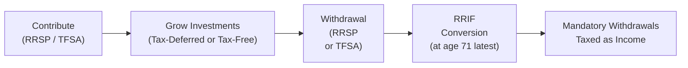
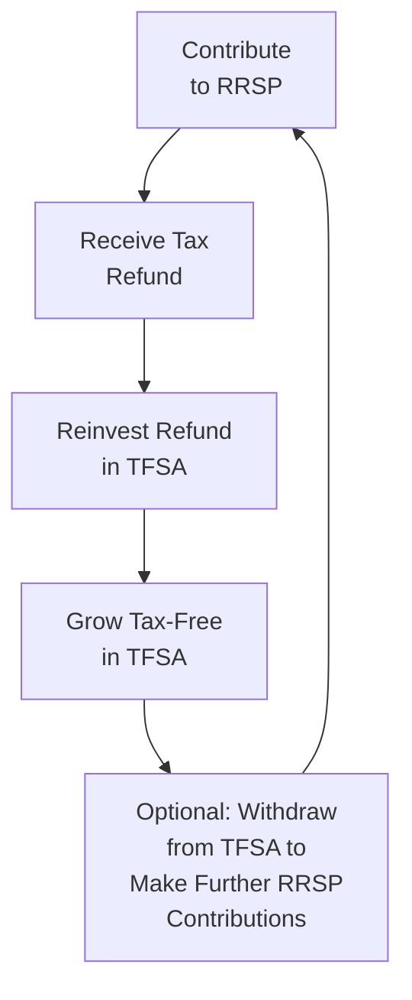

## 6.4 What Are Tax Deferral Plans?

Imagine you’re sitting down with a good friend who’s just started thinking about retirement. They ask: “So, do I really need a special savings plan for retirement, or should I just stuff some money in a savings account?” This is a perfect moment to introduce the concept of tax deferral plans. When we say “tax deferral,” we often refer to accounts that let you put off paying taxes on the money you invest (or the growth on it) until a later date—commonly retirement. This can be a big deal because your contributions and any growth in these plans might accumulate faster than it would in a taxable account.

However, the term “tax deferral” sometimes gets used a bit loosely. A Tax-Free Savings Account (TFSA), for instance, isn’t exactly about deferring taxes; it’s more about never paying tax on future growth once your contributions go in. But TFSAs still form part of the broader retirement strategy puzzle for many Canadians. In this section, we’ll dig into the main tax-assisted programs:

• Registered Retirement Savings Plans (RRSPs)  
• Registered Retirement Income Funds (RRIFs)  
• Tax-Free Savings Accounts (TFSAs)  

We’ll also include some personal anecdotes, pitfalls, and a few best practices. Because hey, these decisions can be some of the biggest ones you’ll ever make for your future.

Understanding these plans in detail—everything from contribution limits to taxes withheld upon withdrawal—will help you and your clients (if you’re advising) develop solid strategies for building (and eventually using) retirement funds.  

---
  
Why Are These Plans So Important?

Think of contributing to these accounts as planting seeds in a garden, except you’re protected from a swarm of tax-bugs for a while—or sometimes altogether. Over time, your little seeds (contributions) can grow faster when they’re unimpeded by ongoing taxes. By the time you need to access them in retirement, you (or your clients) might be in a lower tax bracket, which eases the overall tax burden. Let’s explore each type of plan in detail.  

## The Registered Retirement Savings Plan (RRSP)

The Registered Retirement Savings Plan (RRSP) is the backbone of Canada’s retirement strategy for many individuals. Introduced in 1957, RRSPs were designed to encourage Canadians to save for retirement with a direct tax incentive.  

Key RRSP Mechanics  
• Earned income is the foundation of how much you can contribute. Generally, you can contribute up to 18% of your previous year’s earned income, up to a limit set annually by the Canada Revenue Agency (CRA).  
• Contributions reduce your taxable income in the year you contribute. This often results in an immediate tax break (woo-hoo!).  
• Investments within the RRSP can include mutual funds, stocks, bonds, GICs, ETFs, and more. Any returns—interest, dividends, or capital gains—are sheltered from tax until you withdraw them.  

Anecdote:  
I still remember the first time I contributed to my RRSP. I was in my mid-twenties, new in my career, and had no idea how the tax deduction would affect my overall finances. Let’s just say that receiving a bit of a tax refund for the first time in my life felt like winning a small lottery. Of course, I promptly re-contributed some of that refund back into my RRSP, continuing the cycle.  

RRSP Contribution Rules  
• Contribution Limit: The maximum annual limit changes year to year. For specific figures, you can check the CRA’s website or consult the “CRA T4040 RRSP and Other Registered Plans for Retirement” guide.  
• Deadlines: Contributions for a given tax year generally close by March 1 of the following year.  
• Carry-Forward: If you don’t use all your contribution room one year, it carries forward indefinitely.  

Early Withdrawals and Withholding Tax  
A big advantage of an RRSP—offsetting your current taxes—comes with the condition that you generally leave the funds untouched until you retire. Withdraw them too early (except under special programs like the Home Buyers’ Plan or Lifelong Learning Plan), and you get a withholding tax plus a potential increase in taxable income for that year.  

Home Buyers’ Plan (HBP) and Lifelong Learning Plan (LLP)  
• HBP: Allows first-time homebuyers to withdraw up to a set limit from their RRSP to buy or build a home. You then repay this amount to your RRSP over 15 years.  
• LLP: Allows you to withdraw funds from your RRSP to pay for education or training for yourself or your spouse/common-law partner. Repayment schedules for LLP are more flexible but must be completed within a certain timeframe to avoid tax consequences.  

These programs are exceptions to the usual “hands-off” approach to RRSP funds. They demonstrate that even though these plans are primarily for retirement, the government recognizes certain life events (purchasing a first home, going back to school) as valid reasons for an early withdrawal—provided you follow their repayment rules.  

---
  
## The RRSP to RRIF Transition

You might be wondering: “Okay, so I’m building my retirement nest egg in my RRSP—then what?” At some point, usually by the end of the year you turn 71, the government requires you to either cash out your RRSP, purchase an annuity, or convert it to a Registered Retirement Income Fund (RRIF). For many Canadians, choosing a RRIF is the logical next step.  

## The Registered Retirement Income Fund (RRIF)

Where an RRSP is all about accumulating wealth on a tax-deferred basis, a RRIF is about distributing those funds back to you, while still maintaining as much tax-deferred growth as possible until you actually spend the money.  

Key RRIF Mechanics  
• Minimum Annual Withdrawals: Starting the year after you open a RRIF, you must withdraw a minimum percentage of the account’s value each year. The percentage increases as you get older.  
• Investment Flexibility: Just like an RRSP, a RRIF can hold various financial instruments—mutual funds, bonds, GICs, etc.  
• Taxation: Any amount withdrawn in a given year is taxed as ordinary income. However, amounts left inside the RRIF continue to grow tax-deferred.  

In other words, a RRIF acts like the paycheque of your self-made pension plan. You’re forced to draw a minimum, but you also get to decide if you want to pull out more in any given year. You might coordinate this with other sources of retirement income, such as the Canada Pension Plan (CPP), Old Age Security (OAS), or income from a private pension plan.  

If you’re curious about how much you must withdraw each year, check out the CRA’s annual minimum withdrawal tables or use an online RRIF calculator. This can help you forecast retirement income streams more accurately.  

---
  
## The Tax-Free Savings Account (TFSA)

While not technically a “tax deferral” vehicle, the Tax-Free Savings Account (TFSA) deserves a place in any smart Canadian’s retirement strategy. TFSAs were introduced in 2009, and they’re designed to let individuals contribute after-tax dollars, then enjoy tax-free growth and, crucially, tax-free withdrawals later.  

Key TFSA Mechanics  
• Contribution Room: You get a certain amount of TFSA contribution room each year, and unused room carries forward indefinitely.  
• No Tax on Withdrawals: Because you contribute after-tax money, any growth remains tax-free, and there’s zero tax on withdrawals.  
• Flexibility: You can use a TFSA for short-term goals (like saving up for a vacation or a special purchase), but it’s also great for long-term needs, including supplementing retirement income.  

Comparing TFSA vs. RRSP  
• RRSP contributions give you an immediate tax deduction, but withdrawals count as taxable income.  
• TFSA contributions do not reduce your taxable income, but all withdrawals are tax-free.  
• In retirement, an RRSP (or RRIF) withdrawal might bump you into a higher tax bracket, whereas TFSA withdrawals have no effect on your taxable income level.  

Think of the TFSA as your Swiss army knife of savings accounts. You might draw from it for emergencies, for big-ticket purchases, or to supplement your retirement.  

---
  
## Visualizing the Flow of Funds

Below is a simple flowchart illustrating how funds move into and out of these registered plans. You’ll notice RRIF is essentially the “exit strategy” for RRSP funds, but TFSAs can be used throughout one’s life at any stage.

• RRSP → Accumulate funds until retirement.  
• RRIF → When RRSP is converted, you receive taxable income in retirement, subject to annual minimum withdrawals.  
• TFSA → Contribute after-tax, but any withdrawal remains tax-free.  

---
  
## Why Deferring Taxes Matters

When you don’t pay taxes on your investment earnings right away, you allow more of your capital to stay invested. Over decades, those incremental gains can add up significantly.  

Quick Example (Hypothetical):

Let’s say you and your friend each have $10,000 to invest.  
• You invest your $10,000 inside an RRSP, meaning all growth is tax-deferred until you withdraw.  
• Your friend invests theirs in a regular, taxable investment account, paying annual taxes on dividends and interest.  

After 20 or 30 years, assuming identical rates of return, your RRSP might be worth substantially more because you haven’t been paying taxes every year. Yes, you will owe taxes when you withdraw, but at that point, you might be in a lower income bracket (e.g., if you’re retired). Meanwhile, your friend has consistently paid taxes on any gains or income generated in their investment account, eroding the compounding effect.  

---
  
## When to Use a TFSA over an RRSP

Even though TFSAs aren’t strictly deferral accounts, they can be the better choice in certain situations. Maybe your income is lower in a particular year, so the immediate RRSP deduction doesn’t benefit you as much. In that case, a TFSA might be more flexible.  

Or, if you anticipate that your future tax rate will be higher (perhaps you have a big career upswing around the corner), you might prefer to wait on RRSP contributions until your income is higher, so you get a bigger tax deduction. Meanwhile, you can keep building savings in your TFSA.  

---
  
## Common Mistakes and Best Practices

Mistakes  
• Overcontribution: Accidentally exceeding your RRSP or TFSA limits can result in penalties. Always track your room; you can find your balances on your CRA My Account or in your Notice of Assessment.  
• Ignoring Withholding Tax: If you withdraw from your RRSP early, a portion is withheld immediately by your financial institution. Then you might owe more potentially at tax time if your marginal tax rate is higher.  
• Not Converting RRSP to RRIF on Time: If you don’t address your RRSP by December 31 of the year you turn 71, the government can force your entire RRSP to be withdrawn as taxable income, leading to a giant tax bill.  

Best Practices  
• Consider “RRSP Season”: Typically January and February are high-activity months for RRSP contributions ahead of the annual deadline. For some, contributing monthly throughout the year (dollar-cost averaging) is more manageable and consistent.  
• Reinvest Your RRSP Refund: Many advisers recommend reinvesting any refund from your RRSP contribution back into the RRSP or TFSA, boosting your overall retirement pot.  
• Don’t Forget TFSAs for Retirement: Still sometimes overshadowed by RRSPs in discussions, TFSAs can complement your RRSP or RRIF by creating a tax-free source of retirement income.  
• Watch Your Marginal Tax Rate: Try to contribute to your RRSP in years where you expect a higher marginal tax rate, giving you a bigger immediate tax refund or lower overall tax bill.  

---
  
## Strategies for Combining RRSPs, RRIFs, and TFSAs

Some people love to call the combination of RRSPs, RRIFs, and TFSAs a “trifecta” for retirement planning. We have:

1) RRSP for immediate tax savings and long-term deferral.  
2) RRIF in retirement to manage your annual income stream.  
3) TFSA for ongoing flexibility, tax-free withdrawals, and bridging any shortfalls.  

One strategy might look like this:  
• Build your RRSP heavily during your higher-earning years.  
• Upon entering retirement, convert your RRSP to a RRIF for a steady income stream.  
• Keep contributing to your TFSA throughout your retirement (assuming you still have stable income sources or savings) and withdraw from it as additional, tax-free funds.  

Or maybe you do the reverse: keep building your TFSA for simplicity or for short-term placeholders while waiting for an opportune time to contribute to your RRSP.  

Here’s a quick diagram highlighting the cyclical nature of reinvesting refunds into these vehicles:

Playing around with these combinations can optimize each plan’s strengths.  

---
  
## Case Studies

Scenario: Overcontribution to RRSP  
Angela, 35, has been diligently contributing to her RRSP. One year, she didn’t double-check her notice of assessment and accidentally contributed $2,000 more than her actual limit. She ended up with a penalty of 1% per month on the overage. It was unpleasant. Moral of the story? Always verify your contribution room.  

Scenario: Using RRSP Refund for TFSA  
Jared, in his early 40s, found that every time he contributed to his RRSP, the resulting tax refund felt like a mini windfall. Instead of spending it on a new gadget or a vacation, he immediately deposited that refund into his TFSA. The result: two different forms of tax advantage that compounded his wealth.  

Scenario: Converting and Splitting Pension Income  
When Rita retired at 65, she converted her RRSP to a RRIF. She discovered she could split her RRIF income with her spouse for tax purposes. This not only reduced their combined tax bill but allowed them to optimize their retirement lifestyle.  

---
  
## Regulatory and Compliance Considerations

As of June 1, 2023, the Canadian Investment Regulatory Organization (CIRO) oversees both mutual fund and investment dealers in Canada. If you’re a Mutual Fund Sales Representative, you’ll want to stay current with CIRO regulations on how best to present RRSP, RRIF, and TFSA information to clients. Past references to the MFDA (Mutual Fund Dealers Association) or IIROC (Investment Industry Regulatory Organization of Canada) are now strictly historical. The new consolidated entity, CIRO, can be found at https://www.ciro.ca.  

For official details on:  
• RRSP, RRIF, and TFSA rules: https://www.canada.ca/en/revenue-agency/services/tax/individuals/topics/registered-retirement-savings-plans-rrsps.html  
• Contribution limits, withholding taxes, and other mechanics: Refer to “CRA T4040 RRSP and Other Registered Plans for Retirement.”  
• RRIF minimum withdrawals: Online calculators are available through various financial institution websites and the CRA.  
• Communication Rules for Representatives: Check CIRO guidelines for discussing tax deferral strategies and ensuring compliance with the Know Your Client (KYC) regulations.  

---
  
## Putting It All Together

Tax deferral strategies aren’t about avoiding taxes altogether; rather, they let you “postpone” paying taxes until (hopefully) you’re in a better position (like retirement). TFSAs can even eliminate future tax on your investment growth. By combining RRSPs, RRIFs, and TFSAs, Canadians can optimize their cash flow, reduce their tax burden, and help make retirement a bit more comfortable—or in some cases, a lot more comfortable.  

Humans are emotional creatures. We feel tempted to spend money the moment we get it. These vehicles encourage a disciplined approach to saving. The earlier you start, the more you’ll benefit from compounding returns. Don’t just think about “tax deferral”—think about creating a sustainable ecosystem for your financial future.  

If you’re advising clients, customizing these strategies to suit their unique tax situation, risk tolerance (see Chapter 4: Getting to Know the Client), and retirement timeline is crucial. You’ll want to consider each client’s income streams, short-term vs. long-term goals, and the legislative changes that crop up from time to time.  

---
  
## Glossary Reminders

• RRSP (Registered Retirement Savings Plan): A retirement savings vehicle offering tax-deferred growth on contributions of earned income.  
• RRIF (Registered Retirement Income Fund): A post-retirement “income” account that holds former RRSP assets from which minimum annual withdrawals must be made.  
• TFSA (Tax-Free Savings Account): Not deferred taxes but tax-free growth on after-tax contributions and tax-free withdrawals.  
• Withholding Tax: The tax taken off at the source for early RRSP withdrawals (lump-sum), based on withdrawal size.  
• Home Buyers’ Plan (HBP): Withdraw up to a set limit (tax-free) from RRSPs to purchase or build a first home, with repayment over 15 years.  
• Lifelong Learning Plan (LLP): Withdraw from RRSP for education, with repayment conditions to avoid tax consequences.  
• Minimum Withdrawal: The annual amount that must be withdrawn from a RRIF, increasing as you get older.  

---
  
## References and Additional Resources

• Information on RRSPs, RRIFs, and TFSAs:  
  https://www.canada.ca/en/revenue-agency/services/tax/individuals/topics/registered-retirement-savings-plans-rrsps.html  

• Details on contribution limits and withholding tax rates:  
  CRA T4040 RRSP and other Registered Plans for Retirement  

• Online calculator for RRIF minimum withdrawal schedules (numerous options available from major Canadian banks and wealth planning sites).  

• CIRO rules on discussing tax-deferral strategies in client communications:  
  https://www.ciro.ca  

• Chapter 4: Getting to Know the Client – For insight into aligning a client’s time horizon, risk tolerance, and objectives with these plans.  

• Chapter 17: Mutual Fund Dealer Regulation – For a deeper dive on how to document client interactions and maintain compliance when recommending registered accounts.  

---

Remember, if you’re ever in doubt about how these plans apply to your personal situation, it’s wise to consult a qualified tax professional or financial planner. It might also be helpful to encourage clients to do the same if you’re working as a registered representative. Building a retirement nest egg is a delicate dance between taxes, returns, and personal needs. The more you understand the interplay among RRSPs, RRIFs, and TFSAs, the better equipped you’ll be to make—or recommend—effective financial decisions for the long haul.

---

## Master Your Knowledge of Canadian Tax-Deferral Plans



### Which of the following statements best describes a key feature of an RRSP?

- [x] Contributions are tax-deductible, and investment growth is deferred until withdrawal.
- [ ] Contributions are not tax-deductible, but withdrawals are tax-free.
- [ ] There is no limit to how much you can contribute to an RRSP each year.
- [ ] Contributions do not affect current-year taxes.

> **Explanation:** One of the primary benefits of an RRSP is that contributions are made with pre-tax dollars, reducing your taxable income for the year. Investment growth is not taxed until you withdraw funds.

### Why might someone choose to contribute to a TFSA instead of an RRSP in a given year?

- [x] If they expect to have a higher income in the future and want to save RRSP contribution room for that time.
- [ ] If they want to make sure their contributions reduce their taxes immediately.
- [ ] Because TFSA growth is deferred and taxed when withdrawn.
- [ ] Because a TFSA offers an unlimited annual contribution limit.

> **Explanation:** A TFSA does not offer an immediate tax deduction, but if someone expects their future income (and tax rate) to be higher, they may save their RRSP contribution room for when the deduction is more valuable.

### Which one of the following is an exception that allows you to withdraw RRSP funds without immediate tax consequences?

- [ ] Purchasing a vacation property.
- [x] Using the Home Buyers’ Plan (HBP) for a first home.
- [ ] Taking a gap year for non-educational purposes.
- [ ] Using funds for a car purchase.

> **Explanation:** Under the Home Buyers’ Plan, you can withdraw a set amount from your RRSP for your first home, tax-free at the time, but you must repay that withdrawal over 15 years.

### What happens if you don’t convert your RRSP to a RRIF or annuity by the end of the year you turn 71?

- [x] Your entire RRSP balance becomes taxable income.
- [ ] You lose all your contributions and investment gains.
- [ ] You can keep your RRSP indefinitely without penalty.
- [ ] You have to switch to a TFSA instead.

> **Explanation:** By law, you must either convert to a RRIF, purchase an annuity, or withdraw your entire RRSP by December 31 of the year you turn 71. If you do nothing, the full balance is included in your taxable income.

### Which of these statements accurately describes a TFSA?

- [x] Contributions are made with after-tax dollars, and withdrawals are tax-free.
- [ ] Contributions are tax-deductible, and withdrawals are taxed as income.
- [x] Unused contribution room carries forward each year.
- [ ] TFSAs only allow investments in guaranteed GICs and money market funds.

> **Explanation:** TFSAs use after-tax money, so withdrawals are not taxed. Contribution room does accumulate if you don’t use it in a particular year.

### In a RRIF, how are funds treated from a tax perspective when withdrawn?

- [x] Withdrawn amounts are fully taxed as income in the year received.
- [ ] Withdrawn amounts are not taxed until age 80.
- [ ] RRIF withdrawals are always tax-free.
- [ ] Only the principal is taxed, not the capital gains.

> **Explanation:** RRIF withdrawals count as taxable income in the year they’re withdrawn. The advantage is that any money remaining in the RRIF continues to grow tax-deferred.

### How does the withholding tax work if you withdraw from your RRSP early, outside of special programs?

- [x] The financial institution deducts a portion of your withdrawal at the source, and you may owe additional tax if you’re in a higher bracket.
- [ ] You do not have to pay any tax on early withdrawals.
- [x] The tax deducted cannot be recovered.
- [ ] You pay zero withholding tax but must report the withdrawal as capital gains.

> **Explanation:** Early withdrawals from an RRSP come with an immediate withholding tax at different rates depending on the withdrawal amount. If your marginal tax rate is higher than the withholding rate, you may need to pay more at tax time.

### Why do TFSAs not strictly qualify as tax-deferral vehicles?

- [x] Contributions are made with after-tax money, and growth/withdrawals are tax-free rather than deferred.
- [ ] TFSAs are only available to retirees.
- [ ] TFSAs do not allow investments to grow.
- [ ] TFSAs require mandatory withdrawals at age 71.

> **Explanation:** TFSAs don’t defer taxes; contributions are made with money that has already been taxed. All future gains and withdrawals remain tax-free.

### Which of the following strategies illustrates how someone might optimize both an RRSP and a TFSA?

- [x] Making RRSP contributions for the immediate tax deduction, then reinvesting the resulting refund into a TFSA.
- [ ] Using the TFSA exclusively for short-term trading, ignoring any RRSP contributions.
- [ ] Relying on an RRSP only after using up all TFSA room for the year, even if your income is very high.
- [ ] Contributing to an RRSP with after-tax dollars only.

> **Explanation:** A common strategy is to use RRSP contributions for the immediate tax deduction and then direct the resulting tax refund into a TFSA for tax-free growth.

### TFSAs, RRSPs, and RRIFs can be best described as key tools for Canadians to:

- [x] Build and maintain retirement savings while managing taxes effectively.
- [ ] Gamble on high-risk stocks without paying taxes.
- [ ] Bypass all tax liabilities permanently.
- [ ] Replace professional financial advice.

> **Explanation:** These registered plans are designed for Canadians to accumulate and use savings for retirement in the most tax-advantageous manner possible.


