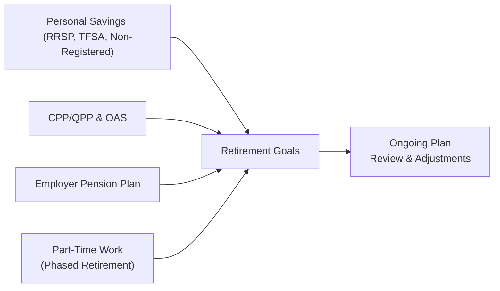

## 6.5 Additional Retirement Income Strategies

When it comes to retirement, many of us fret about running out of money in our later years. It’s a common concern—I’ve personally had countless chats around the dinner table about when to start Canada Pension Plan (CPP) benefits or whether to keep working part-time. While this can feel daunting, the good news is that there are multiple strategies to ensure a comfortable post-work life. In this section, we’ll explore additional retirement income strategies that build on the basics of tax and retirement planning. We’ll look at how to integrate government pensions with personal savings, use spousal RRSPs effectively, plan for part-time or phased retirement, and stay on top of estate planning and succession. We’ll also discuss the importance of ongoing reviews to keep your plan fine-tuned and aligned with any life changes or shifting tax laws. 

Use this information as a practical guide to empower your current (and future) clients—or yourselves—to create flexible, sustainable, and tax-efficient retirement income streams. Whether you’re a financial professional or just starting to learn about retirement options, you’re in the right place!

### Integrating Government Pensions with Personal Savings

For most Canadians, government-sponsored pensions form the bedrock of their retirement plans. Typically, individuals supplement Old Age Security (OAS) and the Canada Pension Plan (CPP) or Quebec Pension Plan (QPP) with personal savings and possibly an employer pension. Let’s see how these pieces fit together:

• CPP/QPP: As you probably know, the CPP/QPP is a contributory program. The amount you receive depends on your contributions and how long you’ve contributed. It’s a big question mark for some people: “When do I start collecting?” The government allows you to begin as early as age 60 (with a reduced benefit) or wait up to age 70 (with an enhanced benefit). 

• OAS (Old Age Security): Funded by general tax revenues, OAS provides a base level of income to most seniors. Depending on your total annual income, there’s a possibility of the OAS clawback, formally called the OAS Recovery Tax. 

• GIS (Guaranteed Income Supplement): GIS is an income-tested benefit for lower-income seniors. If you receive OAS and have little or no other income, you might qualify for GIS.

• Employer Pension Plans: Some lucky folks have an employer-sponsored plan—a Defined Benefit (DB) or Defined Contribution (DC) pension—that basically acts like a forced savings plan. If you’ve got a DB plan, you know you’ll receive a guaranteed payout formula. With DC plans, the eventual retirement payout depends on how much is contributed (by you and your employer) and market performance.

• Personal Savings: RRSPs (and spousal RRSPs), TFSAs, and non-registered accounts all complement the more traditional pensions. The flexibility lies in how and when you draw down these investments. 

I once helped a friend (a teacher nearing retirement) figure out the puzzle of integrating her modest DB pension, CPP, OAS, and personal RRSP. The biggest “aha” moment came when we realized we could defer CPP until 65, let her personal RRSP keep growing, and use her pension plus smaller RRSP withdrawals to bridge the gap. That approach didn’t just optimize her tax bracket—it gave her peace of mind while she phased out of teaching into a part-time tutoring gig.

#### Choosing the Optimal Age to Start CPP/QPP

When deciding on the optimal start date for CPP/QPP, consider longevity, current income needs, and potential tax rates. If you anticipate living longer than average and don’t need the income right away, deferring might boost your lifetime payout. But if you have immediate needs or health considerations, starting earlier, though resulting in a lower monthly amount, could make sense. 

Here’s a quick (simplified) formula for illustrating a break-even analysis when deciding to defer CPP. Suppose the standard age to start is 65, and the monthly benefit is \\( B \\). If you start at 60, the benefit is, say, \\( B_{\text{early}} = B \times 0.64 \\). If you start at 70, the benefit is \\( B_{\text{late}} = B \times 1.42 \\). The break-even point is a function of total payouts over time. In real life, you’d also account for investment returns if you stash away your early CPP, or you’d consider taxes and longevity statistics. But the gist is, depending on how long you live, deferral often increases total benefits. 

### Spousal RRSPs and Pension Income Splitting

Spousal RRSPs and pension income splitting can significantly reduce household taxes in retirement by ensuring both spouses have similar income levels. In Canada’s tax system, the higher your income, the higher your marginal tax rate. By splitting income between spouses—through spousal RRSP contributions or pension income splitting—couples can minimize overall tax payable.

#### Spousal RRSPs

A Spousal RRSP is registered in one spouse’s name (the annuitant), while the other spouse (the contributor) makes the contributions. The contributor gets the tax deduction, but the annuitant ultimately owns the plan. This can be especially helpful when there’s a big difference in incomes between spouses, allowing for a more balanced income split during retirement.

• Contribution Limits: Contributions to a spousal RRSP count against the contributor’s own RRSP deduction limit. 
• Withdrawals: If withdrawals occur within three calendar years of the last contribution to the spousal RRSP, those withdrawals may still be attributed to the contributor for tax purposes.
• Retirement Income: If you let the contributions accumulate until retirement, the annuitant can withdraw and pay taxes at potentially a lower tax rate (assuming they have less or no other income sources).

Pro tip: If you anticipate that you or your spouse could be in significantly different tax brackets in retirement, consider using a spousal RRSP to help equalize incomes. 

#### Pension Income Splitting

In Canada, pension income splitting allows up to 50% of eligible pension income to be transferred from one spouse to the other for tax reporting. Eligible pension income includes life annuity payments from a registered pension plan, Registered Retirement Income Fund (RRIF) payments (after age 65), and other registered plan benefits. 

Say you get $75,000 of pension income, and your spouse gets none. You could potentially “split” up to $37,500 of your pension with your spouse. If your spouse pays taxes at a lower marginal rate, your household’s combined tax bill could be reduced. 

For more details, or if you want to do a deep dive (and let’s be honest, many of us get excited about these details!), check out the Canada Revenue Agency’s pension-splitting resource: [CRA: Pension Splitting](https://www.canada.ca/en/revenue-agency/services/tax/individuals/topics/pension-splitting.html).

### Part-Time Work or Phased Retirement

We’ve all heard the story of someone who “tests the waters” of retirement but ends up missing the social engagement or mental stimulation of work—and let’s not forget the steady paycheck. Part-time work or phased retirement is increasingly popular. It might be a way to supplement your income while gradually transitioning away from a 9-to-5.

• Income Timing: If you choose to work part-time during retirement, you have the option to delay drawing down certain accounts, like RRSPs. This can potentially lower taxation on your Registered Retirement Income Fund (RRIF) or other retirement withdrawals.

• Flexibility: Some employers offer a formal phased retirement model, where you work fewer hours or switch to a consulting role. Alternatively, you can tap your professional network for freelance or contract work to stay active in your field but reduce your hours.

• Pension Implications: If you’re part of a DB or DC plan, you might have restrictions around returning to work for the same employer once you start collecting a pension. Always consult your pension plan’s documentation or a pension administrator to ensure compliance.

I remember my father-in-law taking a phased approach. He continued offering advisory services at his old engineering firm, two days a week, for about a year. He said, “I get to stay sharp, plus it covers our groceries and a few date nights. And I don’t feel like I got booted into retirement cold turkey!”  

### Estate Planning and Succession

Estate planning often feels like that “I’ll deal with it someday” item on the to-do list. But the truth is, it’s crucial to get your estate affairs in order while you’re healthy. 

• Registered Accounts and Beneficiaries: Registered accounts, like RRSPs, TFSAs, and RRIFs, generally allow you to name a beneficiary (or successor annuitant/spouse). By naming a beneficiary, you avoid probate on these accounts, which can speed up the process and reduce costs after passing.

• Deemed Disposition on Death: Canadian tax laws treat capital assets (like non-registered investments and cottages) as if they were sold immediately before death. This can trigger capital gains taxation. Joint ownership with right of survivorship or trusts are sometimes used to reduce probate or taxes, though the exact approach depends on the situation.

• Probate: Your executor (the person responsible for administering your estate) will likely need to go through probate, which is a court process to validate your will. Naming beneficiaries on registered accounts, as well as holding property in specific ways, can reduce or eliminate probate fees.

• Powers of Attorney and Wills: Ensure you have an up-to-date will and powers of attorney (for personal care and property). It’s not just a nice-to-have; it can prevent legal disputes and stress for your loved ones. 

### Ongoing Review and Adjustments

Tax laws and regulations can shift. Someone might start collecting Canada Pension Plan early, then reevaluate. Or maybe your spouse decides to go back to work, so your income picture changes. Retirement is not a “set it and forget it” scenario. 

• Annual or Semi-Annual Check-Ins: Use these check-ins to revisit tax brackets, assess investment performance, and see whether your withdrawal strategy remains appropriate. 
• Keep Tabs on New Legislation: If the government introduces changes—like adjustments to RRIF minimum withdrawals—these could affect your plans in a big way. 
• Life Events: Marriage, divorce, birth of a child or grandchild, health issues—these may require immediate adjustments to retirement income strategies and estate plans.

### Best Practices and Common Pitfalls

It’s easy to get lost in the details, so let’s step back and note a few best practices and common pitfalls in retirement planning:

**Best Practices**

• Maintain a Detailed Budget: Keep track of living expenses before and after retirement. Unexpected costs—like healthcare or supporting older parents—can surface.  
• Diversify Income Streams: Relying on a single source of income (especially one that’s not guaranteed) can lead to stress. The more streams you have—government pensions, personal savings, part-time work—the more flexibility you gain.  
• Optimize Tax Efficiency: Use spousal RRSP contributions, pension splitting, TFSAs, and well-timed withdrawals to keep your taxes low.  
• Stay Informed: Seek professional advice or use reputable resources such as [CIRO’s best practices](https://www.ciro.ca) to stay current on regulations and product offerings.

**Common Pitfalls**

• Taking CPP or QPP Early Without Thought: Doing so might reduce your lifetime benefits, so it’s worth a thorough analysis first.  
• Ignoring Inflation: Over a lengthy retirement, inflation can erode purchasing power. Plan for rising prices in daily expenses.  
• Lack of Estate Plan: Not having a will or naming proper beneficiaries can cause major delays and potential tax consequences.  
• Over-Withdrawing Early: Pulling too much from your RRSPs or non-registered accounts early might leave you short when you’re older.

### Practical Example: Balancing Government Benefits and RRSP Withdrawals

Let’s say Charlotte is 64. She has:  
• $300,000 in her RRSP  
• A small employer pension paying $10,000 per year  
• She expects $7,200 per year from OAS and $11,000 from CPP when she turns 65  

Charlotte wants to retire at 65 and is deciding whether to start CPP at 65 or delay until 70. Her plan is to draw about $15,000 from her RRSP annually. If she starts CPP at 65, she’d receive that $11,000 right away, but her annual OAS might face a minimal clawback if her total income creeps above the threshold. If she defers until 70, her CPP might jump to around $15,500 per year, but she’d need to draw a bit more from her RRSP in the meantime. 

After considering her overall health, longevity in her family, and the fact that she doesn’t mind drawing a bit more from the RRSP early on, she decides to wait until 67 or 68 to start CPP. This approach might push up her total retirement income in her later years, a period where she fears healthcare expenses might rise. That’s the beauty of flexible strategies—she can adapt on the go!

### Visualizing Retirement Income Flows

Sometimes, a diagram helps bring it all together. Below is a simple Mermaid diagram showing how multiple retirement income streams can converge to form your overall retirement picture:

Each arrow indicates an income source flowing into your retirement goals, making it easier to see that managing multiple streams takes ongoing review and adjustments.

### Glossary

Spousal RRSP  
: A registered retirement savings plan in one spouse’s name into which the other spouse (the contributor) makes contributions. This strategy helps equalize incomes in retirement by shifting tax liabilities.

Pension Income Splitting  
: A tax strategy allowing eligible pension income to be split (up to 50%) between spouses to reduce the overall family tax bill.

Phased Retirement  
: Gradually transitioning from full-time employment to part-time or casual work, often while beginning to draw pension or other retirement income.

Probate  
: The court process confirming a will’s validity and granting the executor authority to settle the estate.

Deemed Disposition  
: For tax purposes, assets are treated as if sold at fair market value. Typically triggered at death or upon certain trust events, which can result in capital gains or losses.

### References for Further Exploration

• [Government of Canada’s Retirement Planning Portal](https://www.canada.ca/en/services/benefits/publicpensions/understanding.html)  
• [CRA’s Pension Sharing and Splitting Details](https://www.canada.ca/en/revenue-agency/services/tax/individuals/topics/pension-splitting.html)  
• Chilton, David. *The Wealthy Barber Returns*. A light and conversation-style guide to better financial habits.  
• [CIRO: Best Practices, Legal Updates, and More](https://www.ciro.ca) for up-to-date guidance on tax and pension regulations.

-----

## Test Your Knowledge: Additional Retirement Income Strategies



### Government Benefits for Retirees
- [x] CPP/QPP, OAS, and GIS
- [ ] Canada Pension Plan only
- [ ] Employment Insurance
- [ ] Free lump-sum retirement bonus at 65

> **Explanation:** CPP/QPP, OAS, and GIS form the foundational government benefits for Canadian retirees.  

### Spousal RRSPs
- [x] Are held in a spouse’s name, but contributions can be made by the other spouse
- [ ] Are taxed entirely to the contributor
- [ ] Cannot be withdrawn until age 71
- [ ] Have no effect on a contributor’s RRSP limit

> **Explanation:** A spousal RRSP is registered in one spouse’s name, yet the contributing spouse makes the deposits and claims the tax deduction.  

### Pension Income Splitting
- [x] Allows splitting up to 50% of eligible pension income between spouses
- [ ] Automatically happens when you file taxes
- [ ] Is available for any form of earned income
- [ ] Is mandatory for all seniors over 65

> **Explanation:** Pension income splitting must be elected when filing taxes and typically applies to eligible pension income (like an RRIF after age 65 or a DB pension).  

### Phased Retirement
- [x] Involves gradually reducing work hours while starting to draw pension benefits
- [ ] Requires stopping work entirely
- [ ] Is only applicable to government employees
- [ ] Cannot be combined with private consulting work

> **Explanation:** Phased retirement is a flexible pathway where an individual reduces work levels gradually, often supplementing income with partial pension or investment withdrawals.  

### Estate Planning
- [x] Naming a beneficiary on RRSPs can help bypass probate
- [ ] Always leads to more probate fees
- [x] Deemed dispositions can trigger capital gains upon death
- [ ] Requires joint ownership in all cases

> **Explanation:** Naming beneficiaries on registered accounts can help bypass probate. Additionally, a deemed disposition occurs at death, which may trigger capital gains.  

### OAS Clawback
- [x] Reduces OAS benefits for high-income retirees
- [ ] Increases OAS benefits for low-income retirees
- [ ] Eliminates GIS entirely
- [ ] Is never applied unless you start OAS early

> **Explanation:** The OAS Recovery Tax (clawback) applies if your income exceeds a certain threshold, reducing OAS benefits.  

### Common Pitfall
- [x] Starting CPP or QPP early without analyzing the long-term impact
- [ ] Setting up an estate plan
- [x] Over-withdrawing from RRSPs at an early stage
- [ ] Contributing to TFSAs

> **Explanation:** Jumping into CPP early without a proper break-even or longevity analysis can reduce total lifetime benefits. Similarly, over-withdrawing RRSPs early can diminish retirement assets prematurely.  

### Part-Time Work
- [x] Can help retirees delay withdrawals from RRSPs or RRIFs
- [ ] Is never taxable
- [ ] Has no bearing on overall retirement income
- [ ] Must be pursued via the original employer

> **Explanation:** Earning part-time income can help cover living expenses, thus postponing withdrawals from personal retirement accounts and deferring potentially higher taxes.  

### Splitting Income
- [x] Is beneficial when spouses have different marginal tax brackets
- [ ] Is mandatory for all couples
- [ ] Does not apply to spousal RRSPs
- [ ] Only applies to capital gains

> **Explanation:** Splitting income typically helps lower a family’s overall tax burden, particularly when spouses are in different income brackets.  

### True or False: Ongoing Review Is Essential
- [x] True
- [ ] False

> **Explanation:** Retirement plans, tax laws, and personal circumstances change over time. Frequent reviews ensure that a retirement plan remains aligned with evolving needs and regulations.




