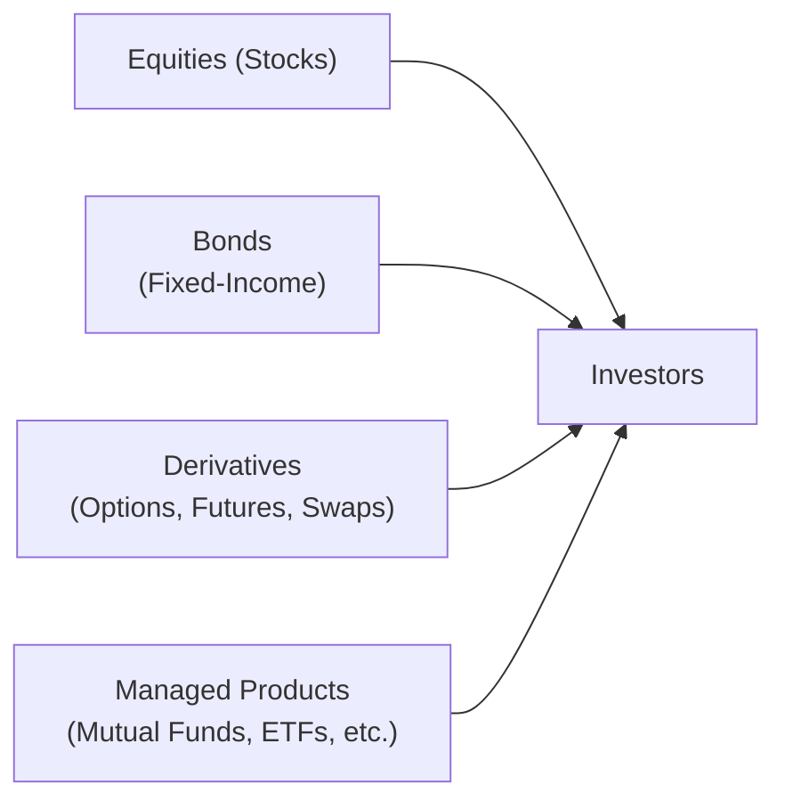

## 7.1 Introduction to Investment Products

When I first started looking into investment products (and trust me, it can be a pretty overwhelming topic at first glance), I realized that each type of security—whether it’s a bond, a share of stock, or a futures contract—is designed to meet different investor goals. Some people are super cautious, looking for safe places to stash their money, while others love the thrill of higher-risk instruments that might yield big returns or big losses.

The good news is that, in Canada, there’s a well-established regulatory framework to ensure these different products meet certain standards and that everyone plays by the rules. Since 2023, the Canadian Investment Regulatory Organization (CIRO) has taken over from two defunct predecessor self-regulatory organizations (MFDA and IIROC) to provide a unified national regulatory body overseeing investment dealers, mutual fund dealers, and market integrity. Meanwhile, the Canadian Securities Administrators (CSA)—the umbrella organization of provincial and territorial regulators—sets the securities laws on a province-by-province basis. Basically, no matter which type of investment you’re looking into, there’s probably a regulation or guideline governing how it’s issued, sold, and traded.

In this section, we’ll explore the wide world of investment products, discuss fundamental concepts such as primary and secondary markets, and detail how each product is introduced and traded in Canada. By the end, you’ll have a clearer picture of how and why these different securities exist and how you, as a mutual fund representative or an interested investor, can select the right product to fit specific client or personal objectives.

---

### Why Investment Products Matter

You might be wondering: why are there so many different types of investment products in the first place? Can’t everyone just invest in a single giant bucket of “investments” and call it a day? Well, no—investors come in all shapes and sizes. Some want steady returns without much risk; others are willing to accept volatility to chase higher growth. Each type of security (and trust me, you’ll hear this word “security” a lot in the investment world) offers its own risk–reward profile.

• A retiree might gravitate toward conservative bonds or GICs to earn predictable interest.  
• A younger investor might prefer stocks, hoping for market growth over the long haul.  
• A sophisticated trader may dabble in derivatives like options or futures to hedge or speculate.  

In other words, investment products cater to unique goals, horizons, and tolerances for risk. 

---

### Key Concepts and Terminology

Before we dive into the different product categories, it helps to nail down a few definitions:

• **Security (Securities):** A tradable financial asset (e.g., stocks, bonds, derivatives).  
• **Primary Market:** The market where new securities are issued for the first time (e.g., an Initial Public Offering or IPO for shares in a company).  
• **Secondary Market:** The market where previously issued securities are bought and sold among investors (e.g., trading shares on the Toronto Stock Exchange).  
• **Risk Profile:** An assessment of an investor’s willingness and capacity to take on investment risk.  
• **Return:** The gain or loss on an investment over a specified period, usually expressed as a percentage of the investment’s cost.  
• **Volatility:** A statistical measure of the price fluctuations of a security (or the market) over time.  

Understanding these terms sets the foundation. From here, you can map out which product best fits your client’s or your own investment style.

---

### Broad Categories of Investment Products

Let’s break down the major families of securities you’ll encounter in the Canadian marketplace (and really, worldwide):

• **Equities (Stocks)**: Shares of publicly traded companies.  
• **Fixed-Income Securities (Bonds and Treasury Bills)**: Debt instruments issued by corporations or governments.  
• **Derivatives (Options, Futures, Swaps)**: Contracts deriving value from underlying assets, used for speculation or hedging.  
• **Hybrid or Speciality Instruments (e.g., Preferred Shares, Convertible Bonds, Structured Notes)**: Securities blending characteristics of stocks and bonds.  
• **Managed Products (Mutual Funds, ETFs, Segregated Funds, Hedge Funds, Liquid Alternatives)**: Portfolios that pool money from many investors to buy a diversified basket of securities.  

Below is a simple diagram illustrating the hierarchy of major investment products and their relationship to investors.

**Diagram Explanation:**  
• On the left are the four major categories of investment products.  
• Arrows point to “Investors,” showing that investors allocate their capital across these different focus areas, depending on their strategies and risk profiles.

---

### The Role of Canadian Regulation

If there’s one thing to keep in mind about buying or selling securities in Canada, it’s that you’ll always be under the watchful eye of the CSA at the provincial level and CIRO at the self-regulatory level. Here’s a quick breakdown:

• **Canadian Securities Administrators (CSA):**  
  The CSA is essentially a forum for provincial and territorial regulators to harmonize rules and guidelines. Each province still has its own regulator—like the Ontario Securities Commission (OSC) or the Autorité des Marchés Financiers (AMF) in Quebec—but the CSA aims to maintain a unified approach where possible.

• **Canadian Investment Regulatory Organization (CIRO):**  
  On January 1, 2023, the MFDA and IIROC merged to form CIRO. Now, CIRO is the main self-regulatory organization overseeing both investment dealers and mutual fund dealers across Canada. They (1) register firms, (2) create rules to protect investors, and (3) ensure that dealers and representatives meet high industry standards.

• **Investor Protection via CIPF:**  
  The Canadian Investor Protection Fund (CIPF) is now the sole fund protecting client assets when a member firm becomes insolvent. It remains independent of CIRO but works alongside it to maintain investor confidence.

Staying in tune with the regulations is a big part of serving clients responsibly. For instance, if a new derivative product hits the market, there may be new guidelines or compliance procedures to follow. Make it a habit to check in with the CSA’s website, along with CIRO’s resources (found at [https://www.ciro.ca](https://www.ciro.ca/)), to stay ahead of the curve.

---

### Primary vs. Secondary Markets

One of the fundamental distinctions in buying and selling securities lies in whether you’re transacting in the primary or secondary market:

1. **Primary Market**:  
   This is where a security makes its debut. For example, when a company decides to go public with an IPO, it’s issuing shares for the first time directly to the public. The proceeds from selling these initial shares go to the issuing company.

2. **Secondary Market**:  
   After a security’s initial sale, it begins trading in the secondary market—like the Toronto Stock Exchange (TSX) or the Canadian Securities Exchange (CSE). Here, investors trade among themselves, and the issuing company doesn’t receive any further proceeds from these transactions. The prices of securities on secondary markets are determined by supply and demand, market sentiment, and a host of economic factors.

---

### Assessing Risk Profiles and Matching Products

Investment firms often rely on the **Know Your Client (KYC)** and **suitability** frameworks (something we discuss in detail in Chapter 4) to match the right product to a client’s needs. A big part of this process is understanding three things about your client:

1. **Risk Tolerance**: How much volatility is your client comfortable with?  
2. **Investment Horizon**: When will they need the money (short term vs. long term)?  
3. **Investment Objectives**: Are they seeking income, capital preservation, growth, or speculation?

By clarifying these elements, you’ll have an easier time recommending products. For example, a retiree may be best served by conservative fixed-income products, whereas a 25-year-old with a well-paying job and no immediate need for funds might consider more volatile equity or equity-based mutual funds for the long term.

---

### Investing Strategies and Trading Habits

Investors use different strategies when dealing with these products:

- **Buy-and-Hold**: Focus on the long-term growth of equity or bond investments, typically ignoring short-term market fluctuations.  
- **Active Trading**: Attempt to capitalize on short-term market movements using stocks and derivatives.  
- **Hedging**: Use derivatives to offset potential losses in a core portfolio.  
- **Diversification**: Spread investments across different asset classes or sectors to reduce overall risk.

You’ll notice that these strategies can and do intersect. For example, someone with a primarily buy-and-hold approach might still deploy derivatives occasionally to hedge currency risks on foreign investments.

---

### Introduction to How Products Are Brought to Market

Next time you see that some hot tech startup is “going public,” you’re witnessing the primary market in action. The company—along with investment bankers—underwrites the offering and sets a price for its shares or bonds. Investors can subscribe to this offering, effectively giving the issuing entity the capital it needs, say, to expand or fund its day-to-day operations.

Once the security is out in the world (the primary market), it swiftly moves into the **secondary market**, where millions of shares may trade daily among retail investors, institutional players, and so forth. This continuous buying and selling sets the price for publicly traded securities.

---

### Responsibilities of Mutual Fund Representatives

As a mutual fund sales representative, you may not directly sell equities or bonds individually—unless you hold the proper licensing to do so—but you absolutely need to understand what is under the hood of the products you do sell. After all, a mutual fund is essentially a basket of securities. It might be composed of stocks, bonds, or other asset classes. Each has its own risk and return prospects, which you need to articulate clearly to your client.

1. **Product Knowledge**: Know the composition, objectives, fees, and historical performance of the mutual funds you offer. For instance, a dividend-focused equity fund will have a different risk profile than a global bond fund.  
2. **Regulatory Compliance**: Keep your registration requirements in check. Consult the CIRO website if you have doubts about your licensing or if there are new continuing education requirements.  
3. **Client Education**: Translate complex jargon into plain language so your client can make informed decisions. For example, if your client is anxious about the idea of investing in an equity fund, walk them through the fundamentals of how it grows wealth, as well as the market’s ups and downs.

---

### Staying Current and Continuous Learning

The market is always evolving—new trading platforms, new alternative asset classes like cryptocurrencies, or new regulations from CIRO or the CSA. Perhaps you’ll recall that just a few years ago, many Canadian investment firms began adopting more structured deposit notes or complex ETFs to meet specific investor demands. Well, regulations followed, and it’s been an ongoing process of adaptation.

My personal strategy for staying ahead is to set aside an hour each week to read regulatory updates or market analyses. I keep tabs on CIRO bulletins, CSA notices, and also check out resources from the Bank of Canada to spot changes in economic indicators. You might be surprised at how quickly the industry shifts, but having a consistent routine to keep yourself informed goes a long way.

For deeper dives, resources such as:  
- **CIRO** ([https://www.ciro.ca](https://www.ciro.ca))  
- **Canadian Securities Administrators** ([https://www.securities-administrators.ca](https://www.securities-administrators.ca))  
- **Bank of Canada** ([https://www.bankofcanada.ca](https://www.bankofcanada.ca))  
- **SEDAR+** ([https://www.sedarplus.ca](https://www.sedarplus.ca)) for corporate filings and prospectuses  
- **Canadian Securities Institute (CSI)** and the Canadian Securities Course materials  

…are top-notch for either satisfying your professional curiosity or fulfilling continuing education requirements.

---

### Common Pitfalls and Best Practices

Let me share a couple of pitfalls I’ve seen:

- **Overlooking Risk Tolerance**: A well-meaning representative suggests a high-yield bond fund to a client who’s actually risk-averse. Eventually, the fluctuations spook the client, and they sell at a loss. Ouch. Always circle back to KYC (Know Your Client) principles.  
- **Ignoring Market Liquidity**: Not all securities trade actively. Recommending thinly traded products can lead to higher trading costs or difficulty selling.  
- **Chasing Hype**: Whether it’s a hot IPO or the latest crypto-derivative, hype-based investments introduce unnecessary risk. Evaluate fundamentals and ensure the product aligns with the client’s strategy.  

**Best Practices**:  
1. Thoroughly document your rationale for each recommendation.  
2. Keep up with regulatory changes to avoid compliance missteps.  
3. Encourage diversification to mitigate concentrated risk.  
4. Communicate frequently with clients—market conditions change, and so do clients’ personal circumstances.

---

### Conclusion

Investment products are the building blocks of wealth creation and capital markets. Equities, fixed-income securities, derivatives, and managed products all exist to meet a spectrum of goals, from stable income generation to high-octane growth. As a mutual fund sales representative or an informed investor, understanding the pros and cons of each product, along with the associated regulatory environment, is crucial for making responsible and informed decisions.

By mastering these basics, you’ll be better equipped to:

• Assess clients’ risk tolerance and align it with suitable products.  
• Understand how new products come to market.  
• Comply with the rules set out by the CSA and CIRO.  
• Continuously educate yourself to stay on top of new market developments.

In the upcoming sections, we’ll dig deeper into each family of investment product—starting with fixed-income securities and eventually touching on derivatives, equities, and managed solutions. But for now, consider this your foundation—a broad overview that sets the stage for all the investing conversations you’ll have going forward.

---

## Test Your Knowledge: Introduction to Investment Products Quiz



### Which of the following best describes a security?

- [ ] An insurance policy paying a fixed return.
- [x] A tradable financial asset, such as a stock or bond.
- [ ] A consumer good with no resale value.
- [ ] A government license.

> **Explanation:** A security is essentially a tradable financial asset—this could be a stock, bond, derivative, etc. Insurance policies are not typically considered “securities” in the same sense of publicly traded assets.

### Which market is used when a company issues new shares to the public?

- [x] The primary market.
- [ ] The secondary market.
- [ ] The private market.
- [ ] The informal market.

> **Explanation:** The primary market is where securities are sold to the public for the very first time, such as through an Initial Public Offering (IPO). Once issued, they trade on the secondary market.

### After a security has been issued, where does it continue to trade?

- [ ] The futures market.
- [x] The secondary market.
- [ ] The currency exchange market.
- [ ] The underwriting market.

> **Explanation:** Once securities like stocks or bonds are initially sold, they move into the secondary market, where investors buy and sell them amongst themselves.

### Which organization is responsible for overseeing mutual fund dealers and investment dealers in Canada, post-2023?

- [ ] The Investment Industry Regulatory Organization of Canada (IIROC).
- [x] The Canadian Investment Regulatory Organization (CIRO).
- [ ] The Mutual Fund Dealers Association of Canada (MFDA).
- [ ] The Financial Services Regulatory Authority (FSRA).

> **Explanation:** As of January 1, 2023, IIROC and the MFDA merged to form the Canadian Investment Regulatory Organization (CIRO). IIROC and MFDA are now defunct predecessor SROs.

### What is the key focus of the Canadian Securities Administrators (CSA)?

- [x] Harmonizing and coordinating securities regulation across provinces and territories.
- [ ] Providing portfolio management services to institutional investors.
- [x] Setting interest rates for government bonds.
- [ ] Insuring deposits for retail bank accounts.

> **Explanation:** The CSA is a forum of provincial and territorial regulators that seek to coordinate rules and reduce fragmentation in Canadian securities regulation. They do not set interest rates or insure deposits.

### Which of the following is a major step when assessing a client’s investment suitability?

- [ ] Offering only the latest trending IPO.
- [ ] Recommending high-risk derivatives for all clients.
- [x] Determining the client’s risk tolerance, horizon, and objectives.
- [ ] Bypassing regulatory guidelines to speed up the process.

> **Explanation:** Suitability hinges on matching the right product with the investor’s unique risk tolerance, time horizon, and objectives. Speedy recommendations often ignore these crucial factors, jeopardizing compliance and client trust.

### In investment terms, what does "volatility" refer to?

- [ ] A measure of bond coupon rates.
- [ ] The time it takes for a trade to settle.
- [ ] The total fees charged by a mutual fund.
- [x] The degree to which a security’s price fluctuates over time.

> **Explanation:** Volatility measures how much the price of an asset moves up or down. Higher volatility often indicates higher risk.

### What is the primary purpose of the Canadian Investor Protection Fund (CIPF)?

- [ ] To regulate all investment advice in Canada.
- [ ] To provide grants to new business ventures.
- [ ] To set monetary policy for Canadian banks.
- [x] To protect client assets if a member firm becomes insolvent.

> **Explanation:** The CIPF safeguards investor assets in the event that a CIPF-member brokerage or dealer becomes insolvent. It is separate from CIRO but works closely to ensure investor protection.

### Diversification in investing is primarily used to:

- [ ] Maximize returns by focusing on a single type of asset.
- [x] Spread risks across different asset classes or sectors.
- [ ] Avoid all potential losses in any market downturn.
- [ ] Guarantee profit in every investment.

> **Explanation:** Diversification is about spreading your investments among various assets to reduce the impact of a poor performance in any one area. It doesn’t guarantee returns, but it can reduce downside risk.

### True or False: It is essential for mutual fund representatives to understand the underlying securities within their funds.

- [x] True
- [ ] False

> **Explanation:** Mutual funds are baskets of securities. To competently explain the fund’s potential risks and returns, a representative must understand the characteristics of the underlying assets (equities, bonds, etc.).


