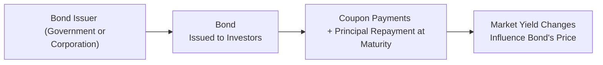

## 7.2 What are the Fundamentals of Bond Pricing and Properties?

Well, here we are at one of my favorite topics in fixed-income finance: bond pricing and bond properties. This area might sound a little dry at first, but bonds can actually be pretty fascinating—seriously! Think of a bond like a promise: You lend someone money (the issuer), they pay you interest (coupon payments), then they eventually give you the principal back at maturity. Along the way, the bond’s value in the market can shift based on a range of factors, including interest rates, the issuer’s credit quality, and the term to maturity.

I remember the first time I realized just how crucial bond pricing was. I was chatting with a friend—an avid investor—who explained that watching bonds was like keeping a finger on the economic pulse. When interest rates rose, he’d see many of his older, lower-coupon bonds drop in price; from that point on, I realized how dynamic bond markets could be. That personal “aha” moment might seem small, but it underscored for me how important it is for every finance professional to understand these core principles.

Below, we’ll walk through the key concepts you’ll need to know, from yield to maturity (YTM) and duration to call features and covenants. As with other sections in this chapter, consider these concepts in the context of Canadian securities regulations and reading up on notices from the Canadian Investment Regulatory Organization (CIRO) for best practices.

Bond Pricing – The Big Ideas  
--------------------------------

When you buy a bond on the secondary market—or sell the same bond sometime later—the price you see typically reflects interest rates, credit risk, time to maturity, and how the market perceives the overall economic climate. Let’s break down those factors:

Interest Rates  
-------------

One of the most fundamental drivers of bond prices is the prevailing level of interest rates in the economy. Picture this: suppose you hold a bond that pays a 3% coupon. If new bonds are now being issued at 5%, your bond’s coupon rate isn’t as appealing, so to remain competitive (i.e., to convince someone else to buy your 3%-coupon bond), the market price of your bond has to drop until its yield matches what investors could otherwise earn in the new market environment.  

In simpler terms, bond prices and yields move inversely. If interest rates go up, bond prices go down. If interest rates go down, bond prices go up. It’s a nearly ironclad rule—like the seesaw you played upon as a kid. One side goes up, the other side goes down.

Credit Quality  
-------------

The issuer’s creditworthiness is crucial to bond pricing. A highly rated corporate or government bond that’s seen as “safer” generally trades at a higher price (lower yield) than a bond with lower credit quality. For instance, Government of Canada bonds are considered to have very low credit risk, and as such, are often used as benchmarks for Canadian interest rates. Meanwhile, a corporation with less predictable earnings might have to pay a higher coupon to sweeten the deal for investors, potentially leading to a lower price if market perceptions of the issuer’s credit risk worsen.

Term to Maturity  
----------------

A bond’s time to maturity plays a big role in its pricing and interest rate sensitivity. Generally, the longer the term, the higher the risk of something unexpected happening—say a major shift in central bank policy or a change in the corporate issuer’s financial health. Longer-term bonds often offer higher yields to compensate investors for a greater range of uncertainties. However, they also tend to experience more significant price swings when interest rates change.  

It might feel like a balancing act. If you anticipate interest rates will drop, you might ride the wave up in price by holding a longer-term bond. If you anticipate rising interest rates, you might gravitate toward shorter-term issues to avoid taking a big price hit.

Market Perception of Risk  
-------------------------

Bond prices can also be influenced by intangible factors like overall market sentiment or investor appetite for risk. If market participants believe that the economy is on shaky ground, they might flock to government bonds, pushing prices higher (and yields lower). On the other hand, if investors want higher-yielding opportunities and are more optimistic, corporate bonds might get more attention, pushing their prices up in favorable conditions.  

Yield to Maturity (YTM)  
-----------------------

Yield to maturity (YTM) is a key metric for understanding how a bond might perform if you hold it all the way to its maturity date. Essentially, YTM measures the rate of return you’d earn annually, over the entire life of the bond, accounting for:

• The coupon payments you receive.  
• Any difference between the bond’s purchase price and its face (par) value when you hold the bond until it matures.  

Mathematically, YTM is found by solving the present value equation of all the future cash flows (coupons + the redemption of principal) for the discount rate that equates that present value to the bond’s current price. It can be expressed using a standard discounting formula. If you want the formula in more technical terms, it looks something like:


P = \sum_{t=1}^{T} \frac{C}{(1 + r)^t} + \frac{FaceValue}{(1 + r)^T}


Where:  
• \\( P \\) is the current bond price,  
• \\( C \\) is the coupon payment,  
• \\( T \\) is the number of periods to maturity (for example, if a bond pays semi-annually, T would be 2 times the number of years to maturity), and  
• \\( r \\) is the yield per period, which, when annualized, is effectively the yield to maturity.

You can find free online calculators for this, which might come in handy if you don’t want to do the iterative approach by hand. The CFA Institute also provides more in-depth resources and examples for calculating YTM.  

Duration  
--------

Duration is often misunderstood, so let’s demystify it. Think of duration as a measure of how much a bond’s price is expected to move if interest rates shift. Longer-duration bonds are more sensitive to interest rate changes and can exhibit larger price movements in response to just small changes in rates.  

It’s basically a weighted average of the times until each payment, weighting by the present value of those payments. A bond with a duration of five years, for instance, might be expected to lose about 5% of its price if interest rates rise by 1% (all else being equal). This is a rough rule of thumb, often improved by factoring in “convexity,” which refines duration estimates.  

If you’re constructing a portfolio for a client who wants stable income with minimal fluctuations, you’d typically pay close attention to the overall duration of the portfolio. You might, for instance, target a duration that aligns with your client’s time horizon or risk tolerance.  

Bond Covenants  
--------------

Bond covenants are basically the rules of the road for the issuer. They ensure that the issuer doesn’t take on undue risk that jeopardizes its ability to repay bondholders. These might include limiting additional debt issuance or requiring the issuer to maintain certain debt-to-equity ratios. Covenants can be more or less restrictive, and they’re designed to give bondholders confidence. The stricter the covenant, the safer the bond might be from certain worst-case scenarios, which can support a higher price (lower yield).

Callable vs. Non-callable Bonds  
-------------------------------

A callable bond can be redeemed early by the issuer, often if interest rates have substantially declined or if the issuer’s credit health has improved. It’s kind of like a homeowner refinancing a mortgage: If you can borrow money more cheaply, why wouldn’t you retire your old bond (mortgage) and issue a new one at a lower interest rate? For that reason, callable bonds sometimes pay higher coupons or sell at lower prices because investors require an extra incentive to take on that call risk.  

Meanwhile, with a non-callable bond, you can hold tight knowing that the issuer cannot redeem the bond early (except in more specialized circumstances, such as default scenarios). That’s why non-callable bonds tend to experience more straightforward pricing relative to changes in interest rates. Yet, you also lose that potential extra yield that callable bonds might have offered.

Price-Yield Relationship  
------------------------

Remember: Bond prices and yields have that famously inverse relationship—when one goes up, the other goes down. A quick visual representation can help us see how these concepts interconnect:

In this diagram, an investor buys a bond from the issuer. The investor receives coupon payments and eventually principal at maturity. Meanwhile, changing market yields (due to shifting interest rates, credit conditions, and risk appetite) feed back into the going price of the bond in real time—even though the issuer’s coupon payment schedule remains the same.

A Quick Word on Convexity  
-------------------------

Convexity goes a step further to explain the curvature of the price-yield relationship. Duration is sort of a linear approximation, but interest rate changes have a slightly curved effect on bond prices, especially if the changes are large. The higher the convexity, the more a bond’s price might increase if yields drop, and the less it might decrease if yields rise, relative to a bond with less convexity.  

Practical Examples  
-----------------

Let’s say you bought a $1,000 face value bond from a Canadian corporation at a price of $980 (a discount) with a coupon rate of 4%. If it matures in five years, and you hold it to maturity, your yield to maturity might be closer to 4.6%—slightly higher than the coupon because you bought it below par. Now imagine that Canadian interest rates fall across the board to 3%. Your bond, which effectively yields around 4.6%, might now trade at a premium above $1,000 because new investors see that 4.6% yield as attractive.

Conversely, if interest rates jump to 6%, your bond’s price might go below $980 because new investors can get better coupons in the marketplace. This underscores why understanding interest rate risk, duration, and yield to maturity is so important.

Another scenario is a callable bond. If the bond is callable in two years and interest rates plunge right before that two-year mark, the issuer might decide to call the bond. You, as the holder, get paid off at the call price (often par). You don’t get to hold the bond to five years and reap that higher yield, so your total returns are effectively capped.

Common Pitfalls  
---------------

• Focusing solely on coupon rate without considering yield to maturity. A high coupon doesn’t necessarily imply the highest total return if you bought the bond at a big premium.  
• Ignoring credit risk. A seemingly attractive yield might stem from high default risk.  
• Overlooking call features. Callable bonds can leave you with reinvestment challenges if rates have fallen dramatically.  
• Not considering portfolio duration. If you load your book with long-duration bonds but expect rising interest rates, you might get an unpleasant shock when prices slump.  
• Confusing yield to maturity with current yield. Current yield just looks at the annual coupon divided by the price, whereas YTM accounts for total return, including price changes over the bond’s lifespan.

Building a Balanced Approach  
----------------------------

In many portfolios, bonds serve as an anchor of stability and income—especially for clients who might be approaching retirement or who need predictable cash flows. Balancing durations, credit qualities, and different bond structures (including callable and non-callable) can help achieve various investment objectives. As with any product, though, thorough due diligence is essential: Always verify details in the bond’s legal documentation, known as the trust indenture or offering memorandum.

Working in the Canadian Regulatory Landscape  
-------------------------------------------

In Canada, bond trading falls under the oversight of CIRO (Canadian Investment Regulatory Organization), which took over from the predecessor SROs (IIROC and MFDA) as of January 1, 2023 (with the new name effective June 1, 2023). If you’re advising clients on bond investments, it’s essential to ensure compliance with CIRO suitability standards, disclosure requirements, and any other relevant guidelines. Keeping an eye on Bank of Canada’s daily bond yield curves can provide you with crucial benchmarks for interest rates.  
 
For official updates or external references, always consult CIRO’s website at [https://www.ciro.ca](https://www.ciro.ca). You can also take advantage of resources from the Canadian Fixed Income Forum, or check out CIPF’s coverage details on protecting client assets in the event that a member firm becomes insolvent. When painting a complete picture for your client, it doesn’t hurt to reference open-source financial tools or calculators for yield to maturity and duration analysis, ensuring even novices can see how small changes in interest rates might affect their bond portfolios.

Additional Resources  
--------------------

• Bank of Canada: Provides published yield curves for government bonds, which serve as a foundation for much of fixed-income pricing in Canada.  
• CIRO Notices: Stay up to date on compliance guidelines, best practices, and new regulations relevant to bond trading.  
• CFA Institute: Offers numerous webinars, articles, and courses on fixed-income investments, including deeper dives into YTM, duration, and convexity.  
• Online Bond Calculators: Many free websites allow quick calculations for yield to maturity, duration, and even scenario analyses with changing interest rates.  

Encouragement for Further Exploration  
-------------------------------------

If you’re just starting to dig into bonds, congratulations! You’ve cracked open a door to one of the most core segments of the financial markets. And if you’re a seasoned pro, there’s always more to learn, from advanced duration hedging strategies to exploring specialized instruments like inflation-linked bonds or zero-coupon bonds. Keep asking questions, think critically, and remember that each concept—like yield to maturity or bond covenants—exists within the broader tapestry of interest rate cycles and credit markets.  

I’ve often found that a little curiosity goes a long way in the bond world. If you’re the type who loves to puzzle over how a small shift in rates can ripple through bond prices, or marvel at how a corporation’s rating upgrade can boost a bond’s price, you’ll find plenty of intellectual rewards. After all, bonds aren’t just about plugging in formulas—they’re a window into macroeconomic policy, company balance sheets, and global capital flows.  

Enjoy the journey, and let’s keep learning together.

--------------------------------------------------------------------------------

## Bond Pricing and Yield to Maturity: A Comprehensive Knowledge Challenge



### Which factor most directly causes existing bond prices to drop when it increases?

- [ ] Duration
- [ ] Credit rating
- [x] Market interest rates
- [ ] Inflation rate only

> **Explanation:** When market interest rates rise, newly issued bonds offer higher coupons, making existing lower-coupon bonds less attractive, which pushes their prices down.

### What term measures the weighted average time until a bond’s cash flows are received, indicating price sensitivity to interest rates?

- [ ] Yield to Call
- [x] Duration
- [ ] Convexity
- [ ] Current yield

> **Explanation:** Duration measures how sensitive a bond’s price is to changes in interest rates by calculating the weighted average time to receive its cash flows.

### If a bond is purchased at $1,020 with a 5% coupon and held until maturity at par ($1,000), which statement is correct regarding yield?

- [ ] The bond’s yield to maturity is exactly 5%.
- [x] The bond’s yield to maturity is below 5%.
- [ ] The bond’s yield to maturity is above 5%.
- [ ] No yield can be inferred.

> **Explanation:** Purchasing above par means you’re paying more for the bond than its redemption value, effectively lowering your yield compared to the coupon rate.

### What is the name of the provision that allows an issuer to redeem a bond prior to its maturity?

- [x] Call feature
- [ ] Put feature
- [ ] Sinking fund provision
- [ ] Cross-default clause

> **Explanation:** A call feature (or call provision) gives the issuer the right to redeem the bond before maturity under specified conditions.

### How does yield to maturity (YTM) differ from current yield?

- [x] YTM accounts for all cash flows, including reinvestment of coupons and the difference between price and par value.
- [ ] They are the same measure, expressed differently.
- [x] YTM is an annualized return if held to maturity; current yield only examines the annual coupon relative to current price.
- [ ] Current yield usually exceeds YTM for discount bonds.

> **Explanation:** Yield to maturity includes time value of money for all future cash flows and principal repayment at maturity, whereas current yield is simply coupon divided by market price.

### Why do callable bonds typically offer a higher coupon than comparable non-callable bonds?

- [x] Investors need extra compensation for the issuer’s option to redeem early.
- [ ] Callable bonds have no issuer risk.
- [ ] Callable bonds always trade at a discount.
- [ ] There is no difference in coupon rates.

> **Explanation:** The call feature adds reinvestment and call risk for the bondholder, so issuers generally pay a higher coupon to attract investors.

### A main difference between bond covenants and sinking fund provisions is:

- [x] Covenants outline issuer obligations/restrictions; sinking funds require partial principal repayments over time.
- [ ] They do not differ; both ensure default won’t happen.
- [x] Covenants protect bondholders via legal agreements; sinking funds systematically retire debt.
- [ ] Only covenants are documented in the trust indenture.

> **Explanation:** Covenants are legal promises and restrictions imposed on the issuer, while a sinking fund is a mechanism to retire a portion of the bond issue periodically.

### Which of the following is true regarding the relationship between bond prices and yields?

- [x] They move inversely.
- [ ] They move together.
- [ ] They are unrelated.
- [ ] They converge only at maturity.

> **Explanation:** As interest rates (and yields) go up, the price of existing bonds typically falls, and vice versa.

### Which regulatory body in Canada oversees bond trading and replaced the former IIROC and MFDA?

- [x] CIRO (Canadian Investment Regulatory Organization)
- [ ] U.S. SEC
- [ ] Bank of Canada
- [ ] European Central Bank

> **Explanation:** Since January 1, 2023, the Canadian Investment Regulatory Organization (CIRO) is Canada’s national self-regulatory body for investment dealers and mutual fund dealers, replacing IIROC and MFDA.

### Duration as a measure of interest rate risk is best described as:

- [x] True
- [ ] False

> **Explanation:** Duration indicates a bond’s sensitivity to interest rate changes, making it a key measure of interest rate risk.


