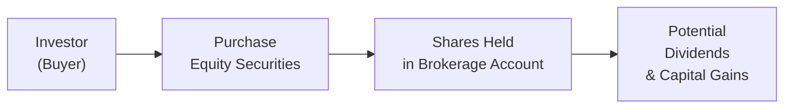

## 7.3 What are Equity Securities?

Having a stake in a company’s future might make you think of episodes from your life when you helped a friend start a small business and hoped it would thrive. Owning equity securities—often referred to simply as stocks or shares—carries a similar sense of partnership, except on a bigger, more formal scale. Someone who owns shares in a corporation becomes, in a sense, a part-owner of that company. And that can sometimes be both exhilarating and nerve-wracking.

### Introduction

Equity securities represent a slice of ownership in a corporation. Each share symbolizes a fraction of that company’s assets and earnings. Of course, that fraction might be so small that it feels like a tiny drop in a giant bucket, but it’s ownership nonetheless. When you buy a share of a public corporation on, say, the Toronto Stock Exchange (TSX), you're effectively adding your name (in electronic form) to the list of owners of that corporation. You also gain certain rights—like voting on key corporate matters—and possible rewards, such as dividends or capital appreciation. But remember, just like real-world business ventures, things can go well or not so well. The potential for growth comes paired with the possibility of losses.

Some folks delight in the idea that the share price of their favorite tech stock might double in a few years, while others cringe at the uncertain fluctuations of the stock market. Either way, understanding the fundamentals of equity securities can help you go beyond that seesaw of excitement and fear.

### Key Features of Equity Securities

When you hold equity securities, your potential benefits primarily include:

• Capital Appreciation: If the company performs well or the market becomes optimistic about its prospects, the share price may rise significantly, leading to potential profits when you sell.  
• Dividends: Many companies distribute a portion of their earnings back to shareholders as dividends. While not guaranteed, dividends often reflect stable earnings and can offer investors income along with share price gains.  

On the flipside, risks include share price volatility, the possibility of no dividends, and potential total loss if the company goes out of business. Stocks do not come with a guaranteed rate of return. Market sentiment can send share prices swinging in ways no one fully anticipates. So, if you’re planning on diving into equity investing, it’s wise to prepare emotionally for the ups and downs.

### Common Shares vs. Preferred Shares

You usually hear about two main stock categories: common shares and preferred shares. Common shares carry the excitement of voting rights, share price growth potential, and dividends (when declared). Preferred shares come with more predictable dividends and a higher claim on assets if the company goes into liquidation.  

#### Common Shares

Common shares are what many people think of as “the stock market.” They typically give shareholders voting rights—meaning they can vote on major corporate decisions, such as electing the Board of Directors. Common shares also tend to have higher growth potential over the long term. If the board decides to issue dividends, common shareholders could receive them. But if the company struggles or chooses to suspend dividends, well, that dividend “perk” can vanish.  

From my own experience, my first purchase of common shares felt like stepping onto a rollercoaster. I was excited, thinking, “Wow, I actually own part of this company!” Then, a quarter later, the share price dipped, and I was like, “Wait a second—did I just lose money?” But the excitement returned when the share price rebounded and the company announced a modest dividend. The ride can be wild, but it’s usually quite educational.

#### Preferred Shares

Preferred shares generally come with a fixed dividend, which must be paid out before any dividends are given to common shareholders. They usually don’t grant voting rights, or if they do, such rights might be limited only to certain circumstances. In the event of liquidation, preferred shareholders get paid before common shareholders, though still behind the company’s debt holders.  

These shares can feel more stable and less volatile in price compared to many common shares, so they’re often appealing to investors seeking a balance between stability and income. However, preferred shares might not deliver the same potential for capital appreciation (long-term share price gains) that common shares do.

### Rights and Warrants

Besides common and preferred shares, there are also securities known as “rights” and “warrants,” which grant holders the opportunity to buy common shares under specified terms. When a company wants to raise capital or give existing shareholders a nice little bonus for their loyalty, they can issue:

• Rights: A short-term privilege extended to existing shareholders to buy additional shares—often at a discount to the current market price. This is sometimes done so that existing shareholders can maintain or increase their ownership stake without being diluted by new investors. Rights typically expire quickly (think weeks, not years).  

• Warrants: A longer-term opportunity (often lasting a few years) to buy shares at a set “strike price.” If the share price later exceeds that strike price, you could buy shares at a bargain and potentially profit from the difference. If the share price lags below the strike price, well, the warrant might expire worthless.  

### Dividends

If you ask me, dividends are like businesses sending you a small “thank you” for your investment. A dividend is a portion of the firm’s earnings distributed to shareholders. It can be in cash, but sometimes also in the form of additional shares or other instruments. However, dividends are never guaranteed.  

The dividend policy is set by the Board of Directors and hinges on factors like the company’s profitability, cash flow, and management’s strategic plans. Some mature, stable companies (particularly utilities or established financial institutions) often pay regular dividends. Growth-focused companies might instead reinvest extra cash to fuel expansion, which can mean little or no dividend.  

### Classes of Shares

You might stumble upon situations where a company has multiple classes of shares: Class A, Class B, and so forth. Each class might carry different voting rights, dividend policies, or other privileges. For example, certain shares might have “super-voting” privileges, allowing founders or insiders to keep control over major decisions. Other share classes might have fewer voting rights but pay higher dividends. If you’re evaluating a company, be sure to check whether different classes of shares exist and what your chosen class of share grants you in terms of rights and earnings potential.

### Evaluating Equities

So how do you decide if a share of stock is expensive, cheap, or somewhere in the middle? It’s tricky, because the stock market can be swayed by hot news, industry trends, or overall economic conditions. But analysts (and financial advisors) often rely on certain metrics:

• Price-to-Earnings (P/E) Ratio: Stock price divided by the company’s earnings per share (EPS). Higher ratios can reflect growth expectations—or an overpriced stock.  
• Dividend Yield: Annual dividend per share divided by share price, expressed as a percentage. It’s a quick gauge of how much “cash return” a shareholder might earn each year.  
• Book Value: The net asset value of the company—assets minus liabilities—often compared to the market value.  
• Earnings Growth: The rate at which the company’s earnings per share are increasing each year. Consistent high growth often signals strong market demand, effective business strategies, or beneficial industry tailwinds.  
• Beta: A measurement of a stock’s volatility relative to the broader market. A beta of 1 indicates the stock tends to move in line with the market. Greater than 1 means more volatility; less than 1 suggests less volatility.  

Market Capitalization (market cap), or the total value of all outstanding shares, is another key measure. For instance, large-cap “blue-chip” stocks typically have a market cap in the billions and often feel more “stable,” though that doesn’t mean they can’t fluctuate.

### Glossary

Dividend Yield  
: The annual dividend per share divided by the share price, expressed as a percentage.  

Capital Appreciation  
: The increase in a stock’s market price over time, reflecting potential gains for shareholders.  

Voting Rights  
: The ability to vote on corporate matters—like electing the Board of Directors or approving major transactions—usually attached to common shares.  

Market Capitalization  
: The total value of a company’s outstanding shares. Calculated by share price × total number of shares.  

Blue-Chip Stocks  
: Shares of large, well-established companies with a track record of reliable earnings and sometimes stable or rising dividends.  

Preferred Dividend  
: A fixed dividend paid on preferred shares before any dividends go to common shareholders.  

Beta  
: A measure of a stock’s price volatility relative to the overall market.  

### Canadian Regulatory Considerations

In Canada, equity securities trade on various exchanges, including the TSX. All trades and related activities fall under the rules overseen by the Canadian Investment Regulatory Organization (CIRO). CIRO, formed on January 1, 2023, from the amalgamation of the Mutual Fund Dealers Association of Canada (MFDA) and the Investment Industry Regulatory Organization of Canada (IIROC), sets regulations for investment dealers, mutual fund dealers, and ensures market integrity in Canadian equity and debt marketplaces.

Firms and individual registrants operating under CIRO’s umbrella must abide by:  
• Best execution practices when handling client orders.  
• Disclosure requirements to ensure investors have full knowledge of risks, costs, and features of the securities they buy.  
• Suitability standards to ensure you’re offered investments that align with your financial situation, objectives, and risk tolerance.  

It’s wise to verify that your broker or financial advisor is duly registered with CIRO and has a good track record. If your investment dealer becomes insolvent, the Canadian Investor Protection Fund (CIPF)—Canada’s sole investor protection fund as of January 1, 2023—provides protection for your assets up to certain limits (though it does not protect you from losses that occur due to market fluctuations or investment risk).

### Real-World Tools and Resources

If you’re thinking of purchasing shares or just want to do more background research, the following resources can be incredibly helpful:

• Toronto Stock Exchange (TSX) (tsx.com): Offers comprehensive updates on stock prices, trading volumes, and daily market summaries.  
• SEDAR (sedar.com): A huge database that stores Canadian public companies’ annual reports, financial statements, and other disclosures. Perfect for analyzing a company’s fundamentals.  
• CIRO (ciro.ca): Covers regulatory updates, investor education, and guidelines for ethical conduct in the investment industry.  
• Books: “The Intelligent Investor” by Benjamin Graham is a time-tested primer on value investing. If you’re more of an online learner, you might also check courses offered by the Canadian Securities Institute (CSI) for specialized training or designations related to securities.  

Your educational journey could also include open-source financial tools, like certain Python libraries (for instance, pandas or yfinance) that let you track historical stock data and do quick analytics. Just be sure you cross-reference any automated data or algorithms with official sources, because anomalies or incomplete data can sometimes distort your findings.

### Visualizing the Equity Investment Flow

Below is a simplified interpretation of how shares are purchased and how the benefits might flow back to an investor. This is hardly a comprehensive picture, but it’s helpful for conceptualizing the typical steps:

• Investor decides to purchase shares.  
• They place an order through a broker regulated by CIRO.  
• The broker executes the trade, and shares are held in the investor’s account.  
• Over time, the investor may receive dividends and may experience gains (or losses) from fluctuations in the share price.

### Personal Reflections and Best Practices

So, is it worth investing in equity securities? It depends on your financial goals, risk tolerance, and investment horizon. Some of the best strategies often revolve around diversification—spreading your investments over various industries, geographic regions, and even asset classes (like bonds or cash equivalents) to offset potential losses in any single position.

Try charting out your personal “roadmap.” Look at your income, savings, and future plans. If your priority is stable income, you might focus on dividend-paying or preferred shares. If you aim for significant capital growth, you could explore common shares in innovative industries, but you’ll need to swallow the higher risk that goes along with faster growth.

And don’t forget discipline. There might be times when everyone around you is either celebrating surging share prices or lamenting a market downturn. During those moments, sticking to your well-thought-out strategy can feel tough, but in my opinion, it’s often what sets consistent investors apart from those who are swayed by market hype. Consider reading widely, staying informed, and consulting with a registered professional if needed.

Keep in mind:

• Equity securities can offer potentially higher returns than some other asset classes, but at the cost of higher risk.  
• Common and preferred shares each have unique features—pick the one that suits your investment approach.  
• Rights and warrants can add strategic depth, but they can also expire worthless if the market doesn’t move in your favor.  
• Dividends represent only one portion of a company’s total return. A stable dividend might be nice, but it’s not guaranteed.  
• Markets are regulated. CIRO ensures a fair environment, but you bear the responsibility for understanding or seeking advice about how specific equities fit into your broader plan.  

Ultimately, you can view equity securities as a journey of ownership and growth, peppered with a dash of ambition and risk. The more you learn and the more experience you gain, the better your sense of what (and when) to buy or sell.

## Boost Your Equity Investing Knowledge: Quiz on Stocks, Shares, and More



### Which of the following best describes equity securities?  
- [ ] They are fixed-income instruments that come with a guaranteed return.  
- [x] They represent an ownership stake in a corporation.  
- [ ] They are debt obligations requiring repayment of principal plus interest.  
- [ ] They are government-issued bonds designed to finance public projects.  

> **Explanation:** Equity securities, also known as stocks or shares, provide part-ownership of a corporation and a claim on its assets and earnings.

### Which statement about common shares is accurate?  
- [ ] Common shares typically offer a fixed dividend payout and no voting rights.  
- [x] Common shareholders usually have voting rights and may receive variable dividends.  
- [ ] Common shareholders have priority over bondholders if the company goes into liquidation.  
- [ ] Common shareholders cannot vote on board appointments.  

> **Explanation:** Common shares generally come with voting rights and may receive dividends, although dividends can vary or be suspended at the company’s discretion.

### Which characteristic differentiates preferred shares from common shares?  
- [ ] Preferred shares always offer higher dividend yields than common shares.  
- [x] Preferred shares often pay a fixed dividend and have priority in liquidation over common shares.  
- [ ] Preferred shares come with additional voting rights that exceed those of common shares.  
- [ ] Preferred shares must pay dividends in the form of extra stock, not cash.  

> **Explanation:** Preferred shares are known for fixed dividends and having a higher claim than common stock in liquidation proceedings, but they rarely include extra voting rights.

### Rights are best described as:  
- [ ] Long-term options to buy shares at a specific price in the future.  
- [ ] Mirroring instruments that track a stock’s market performance over time.  
- [x] Short-term privileges for existing shareholders to purchase more shares at a discount.  
- [ ] Convertible debts that automatically convert into shares under certain conditions.  

> **Explanation:** Rights allow existing shareholders a short-term opportunity to purchase additional shares—often to maintain their proportional ownership—usually at a discounted price.

### What does it mean when a preferred share includes a cumulative dividend feature?  
- [x] Any missed dividends must be paid in the future before common shareholders receive dividends.  
- [ ] The dividend amount automatically increases each year.  
- [x] Dividends on the common shares are converted to additional preferred shares.  
- [ ] Cumulative indicates dividends are paid only after the company’s debt is fully repaid.  

> **Explanation:** Cumulative means the company must "catch up" on any unpaid dividends to preferred shareholders before paying dividends on common shares, ensuring preferred shareholders get any dividends owed.

### Which of the following is true regarding dividends?  
- [x] They are declared by a company’s board of directors and can be modified or suspended.  
- [ ] All publicly traded corporations must pay dividends every quarter.  
- [ ] Dividends cannot be paid in the form of additional shares.  
- [ ] Dividends are guaranteed to match a company’s annual earnings growth.  

> **Explanation:** Dividend policies are set by the Board of Directors and can change based on company performance and strategic plans. Dividends are not mandatory or guaranteed.

### When using the P/E ratio to evaluate a stock, a higher ratio typically suggests:  
- [x] Greater market optimism or a potentially overvalued stock.  
- [ ] The stock is trading at a discount relative to earnings.  
- [x] The company is paying no dividend.  
- [ ] The company’s bond interest rates are low.  

> **Explanation:** A higher P/E ratio can indicate that investors expect higher growth or it might signal overvaluation, depending on the company’s context and fundamentals.

### Which of the following best describes a warrant?  
- [ ] A short-term tool allowing current shareholders to buy new shares at a discount.  
- [ ] A type of government bond offering fixed returns.  
- [x] A long-term option to purchase a company’s shares at a specific future price.  
- [ ] A mandatory right for founders to retain voting control.  

> **Explanation:** Warrants are long-term instruments that grant the holder the right—but not the obligation—to buy shares at a specified price within a certain time frame.

### Which of the following reflects the total value of a company’s outstanding shares?  
- [ ] Beta  
- [ ] Dividend Yield  
- [ ] Share Class  
- [x] Market Capitalization  

> **Explanation:** Market Capitalization is calculated by multiplying the current share price by the total number of a company’s outstanding shares, reflecting the company’s overall market value.

### Dividends on common shares are:  
- [x] Not guaranteed and determined by the Board of Directors.  
- [ ] Mandated by Canada’s Financial Administration Act.  
- [ ] Only payable when the share price exceeds the IPO price.  
- [ ] Required to match inflation exactly.  

> **Explanation:** Dividends on common shares are declared at the discretion of the Board of Directors and depend on a company’s financial situation and strategic considerations.



Feel free to reference the Toronto Stock Exchange (tsx.com), browse through SEDAR (sedar.com) for company filings, and consult CIRO (ciro.ca) for regulatory insights. If you’re thirsty for more knowledge, “The Intelligent Investor” by Benjamin Graham can be an enlightening place to start. Equity securities may seem a bit intimidating, but with research, sound judgment, and a bit of personal grit, they can offer a compelling path toward building your investment portfolio.
