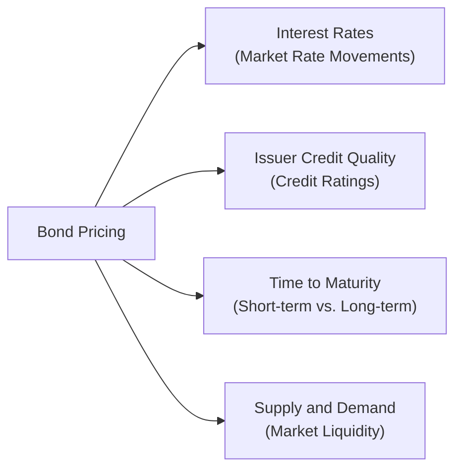

## 7.3 The Fundamentals of Bond Pricing and Properties

Imagine catching up with an old friend who has never bought a bond before, and she casually asks, “So, how do bonds actually work?” That question might sound simple, but once we dig deeper into concepts like yields, coupon rates, credit ratings, and, oh yeah, something called duration, it can suddenly feel overwhelming. Don’t worry. If you’ve made it this far in your studies of the Canadian financial landscape—especially if you’ve been following along in the earlier parts of Chapter 7—you’re already on track to grasp these essentials. 

This section breaks down what drives bond prices, why they sometimes jump around like a teenager hopped up on energy drinks, and how special features like callability or convertibility can either enhance or complicate a bond’s risk and return profile. Along the way, I’ll share a few personal reflections and lay out plenty of practical examples to keep our journey accessible and engaging. Let’s walk through these ideas step by step.

## Why Bond Pricing Matters

If you’ve ever set foot in a financial advisory office or chatted with a mutual fund sales representative, you’ve probably heard about asset allocation—balancing stocks, bonds, and other investments to meet your client’s risk tolerance and objectives. Bonds often play the role of the “steady Eddy” in a portfolio, generating reliable income and providing some stability when equity markets swing. However, the value of these “steady” instruments can and does fluctuate. 

Understanding bond pricing is not just an academic exercise: It’s crucial for making informed investment decisions. Whether you’re recommending a short-term government T-Bill or a high-yield corporate bond, the underlying principles remain the same: interest rates, credit quality, maturity, and market demand. Let’s take a closer look at each factor.

## The Core Ingredients: Interest Rates, Credit Quality, Maturity, and Demand

Before we go anywhere else, here’s a quick visual to anchor your understanding. Here’s a simple flowchart illustrating the main factors that impact bond pricing:

Let’s dissect each “pressure point.”

### Interest Rates: The Main Driver

When interest rates rise, new bonds are issued with higher coupon rates, making older bonds (with lower coupon rates) less attractive. So, the price of older bonds typically goes down to adjust their yields upward in line with the new market rates. Conversely, if interest rates drop, those older, higher-coupon bonds become more valuable, pushing their market prices up. It’s like trying to sell a used phone when the latest model is released: the more desirable the new model is (in this case, a higher coupon rate for newly issued bonds), the more you might have to discount the older version to make it competitive.

Quantitatively, the bond’s price is often derived by discounting future cash flows (the coupon payments and the principal repayment) at a discount rate aligned with market yields. If the market yield (aka the required yield or yield to maturity) increases, the present value of those cash flows decreases, and so does the bond’s price.

### Credit Quality: How Safe Is Your Issuer?

It’s one thing to get a bond paying 6%. It’s another to wonder if the issuer will be around long enough to pay you back. That’s why credit ratings exist. Agencies like DBRS Morningstar, S&P Global, Moody’s, and Fitch evaluate companies and governments and slap them with ratings indicating how likely they are to default. 

• Investment-grade bonds (considered relatively safe) generally carry ratings at the higher end (e.g., AAA, AA, A, BBB) and come with lower yields.  
• High-yield or “junk” bonds are rated below investment grade (BB, B, CCC, etc.) and command higher yields to compensate for added default risk.

In the Canadian context, you can check DBRS Morningstar’s methodologies (https://www.dbrsmorningstar.com/) to see how they assign ratings for different sectors—corporate bonds, government bonds, and others.

### Maturity: The Time Factor

Maturity influences a bond’s sensitivity to changes in interest rates. Longer-maturity bonds tend to fluctuate more in price than shorter-maturity bonds when rates shift. Think of it like balancing a seesaw: the longer out the bond’s maturity, the more “leverage” interest rate changes have on the bond’s price. 

Sometimes, new students to finance quietly say, “But, if I’m going to hold the bond to maturity, why do I care about price fluctuations?” Indeed, if you’re holding to maturity, you’ll simply receive the coupon payments plus your principal at the end. But for many investors (and financial professionals advising them), the ability to sell beforehand and the interim valuation matter. That’s where price sensitivity to interest rate changes becomes supremely important.

### Demand and Supply: Market Sentiment

Finally, broader market demand and supply conditions also affect bond prices. In times of economic uncertainty, investors might flock to safer bonds, driving up their prices. On the flip side, if risk appetite is high, funds might flow into equities or other riskier assets, which can reduce demand for certain bonds and lower their prices.

## Special Embedded Features: Call, Put, and Convertibility

Not all bonds follow the plain-vanilla model of paying a fixed coupon until maturity. Some come with “bells and whistles,” or options embedded within them, that can significantly change the risk-return equation.

### Callable Bonds

Callable bonds let the issuer redeem (or “call”) the bond before maturity, typically if interest rates fall or if there’s some strategic advantage to doing so. This can be a bummer for bondholders if they were counting on a steady stream of higher coupons. I remember a friend who was thrilled to be getting 7% on a corporate callable bond in a falling-rate environment—until it was called away early. Suddenly, she had to reinvest at lower market rates.  

Because of this issuer-friendly feature, callable bonds usually offer higher coupons than non-callable bonds to compensate for that risk of early redemption.

### Puttable Bonds

Flip that around, and you get a puttable bond, which gives investors (not the issuer) the right to redeem early. So if rates rise and you think your bond’s coupon is too puny, you can “put” it back to the issuer and find a better-paying bond. Puttable bonds generally pay a lower coupon than comparable non-puttable bonds, since this feature favors the investor.

### Convertible Bonds (Debentures)

These are basically a two-for-one deal: a bond that can convert into a predetermined number of shares. If the underlying stock does well, you could convert and enjoy equity-like upside. But if the stock tanks, you still have the bond’s interest payments to rely on, absent an issuer default. The convertible feature typically means a slightly lower coupon because you’re getting that potential equity upside.

## The Concept of Duration

We’ve been hinting around it, but now let’s define duration. Duration measures how sensitive a bond’s price is to changes in interest rates, expressed in years. The higher the duration, the more the bond price will swing when interest rates move. This can be a bit tricky, so let’s briefly break it down:

• Duration is not the same as maturity. Although they’re related, duration factors in how and when cash flows from coupon payments occur. A zero-coupon bond’s duration equals its maturity because it has only one cash flow at the very end.  
• For coupon-bearing bonds, duration is typically shorter than its final maturity because you’re receiving periodic coupon payments throughout the life of the bond.  
• If you see a bond with a duration of 10, that implies that if interest rates rise by 1%, the bond price is expected to drop by roughly 10%. (This is a rule of thumb, not a strict guarantee.)

Understanding duration is essential for constructing portfolios that match your clients’ time horizons, risk tolerance, and income needs. 

## Accrued Interest in Bond Trading

Let’s say you own a bond that pays coupons semi-annually. You hold it for three months after you’ve received the last coupon. Now you decide to sell it—hey, maybe you need the cash or see a better investment elsewhere. The buyer, who’ll receive the upcoming coupon, typically compensates you for the coupon interest you’ve effectively earned but haven’t yet been paid. This “catch-up” sum is known as accrued interest. 

Accrued interest ensures a fair split of the coupon payment at the time of the trade. In Canada, bond prices are often quoted “clean,” meaning they don’t include accrued interest in the quoted price. The buyer pays the clean price plus accrued interest separately.

## Walkthrough: Pricing a Simple Bond

Let’s walk through a simplified example. I’ll keep the numbers smaller just to emphasize the process:

• Suppose we have a 3-year bond with a face value of C$1,000.  
• The annual coupon is 5%, paid once per year, so that’s C$50 every year.  
• Current market yields for a similar risk bond are around 4%.  

To estimate this bond’s current market price, we would discount each of those coupon payments, plus the return of principal at maturity, at the yield of 4%. If you were to do this in a financial calculator or spreadsheet, you’d end up with something above par (that is, above C$1,000) because the bond’s coupon (5%) is higher than the market rate (4%). The precise price might be something like C$1,027. If you buy that bond at C$1,027 and hold it until maturity, you’ll earn a yield of about 4%—even though the coupon is 5%—because you paid more than the bond’s face value.

## Linking to Canadian Regulatory Context

As a mutual fund sales representative (or soon-to-be one!), you’d be operating under the oversight of the Canadian Investment Regulatory Organization (CIRO). CIRO is our new self-regulatory organization formed from the amalgamation of the former MFDA and IIROC on January 1, 2023. If you recommend bond funds or hold bond securities in client portfolios, part of your compliance obligation is to ensure suitability, as we’ve seen in earlier chapters (especially 17.4 on Know Your Client rules). 

Best practices also involve staying up to date with relevant bond market data—like the yield curve—available on the Bank of Canada’s website. If you’re evaluating corporate bonds, you can consult DBRS Morningstar’s rating methodology (or S&P Global, Moody’s, Fitch) to validate the credit quality of issuers, especially in times of economic uncertainty.

## Real-World Applications

Sometimes, the bond market can feel esoteric, but remember the real impacts:

• You might guide a conservative client toward government bonds or high-quality corporate bonds, emphasizing lower volatility and stable income.  
• In a rising rate environment, you might recommend shorter-duration bonds or even floating-rate notes to mitigate interest rate risk.  
• High-yield (junk) bonds could be suitable for an aggressive investor chasing higher returns—though the risk of default is significantly higher.

It’s all about aligning the product (bond or bond fund) to the client’s risk profile and goals.

## Common Pitfalls and Tips

• Ignoring duration: A big mistake many newbies make is ignoring the overall duration of their bond portfolio. If you think rates will rise, a high-duration bond portfolio might face larger price declines.  
• Overlooking credit risk: Even a bond from a household-name company can carry more risk than meets the eye. Check those credit rating updates.  
• Forgetting about call features: A bond sporting a juicy coupon might get called away when it’s most valuable to you. Always check for call provisions.  
• Timing purchases around coupon dates: If you’re new to bond trading, you might forget to factor in accrued interest.  
• Overconcentration: Just because a single bond seems “safe” doesn’t mean you should put all your portfolio eggs into that one basket. Diversification matters.

## A Quick Personal Reflection

I remember one of my earliest experiences recommending corporate bonds during a period of steadily falling interest rates. Clients loved the capital appreciation as yields declined, sometimes overshadowing the actual coupon income. But the moment rates showed signs of steadying—and eventually ticking upward—the price volatility took many by surprise. Some clients, expecting “boring” performance from bonds, were startled to see that prices truly can drop. It was a perfect illustration of the importance of bridging theory with real-world expectations—and ensuring that everyone understands interest rate risk.

## Suggested Resources for Further Study

• Credit rating analyses from DBRS Morningstar: https://www.dbrsmorningstar.com/  
• Yield curve data and monetary policy info from the Bank of Canada: https://www.bankofcanada.ca/  
• “Bond Markets, Analysis, and Strategies” by Frank J. Fabozzi (an advanced text for deeper dives).  
• For Canadian regulatory guidelines and investor protection resources, visit CIRO at https://www.ciro.ca

## Glossary Recap (For Easy Reference)

• Callable Bond: Issuer can redeem early.  
• Puttable Bond: Investor can require early redemption.  
• Convertible Bond (Debenture): May convert into a designated number of equity shares.  
• High-Yield (Junk) Bond: Rated below investment grade; higher return potential, higher default risk.  
• Credit Rating: Evaluation of issuer’s creditworthiness.  
• Duration: Sensitivity of bond price to changes in interest rates, measured in years.  
• Accrued Interest: Interest that has built up since the last coupon payment.

## Closing Thoughts

Bond pricing is both an art and a science. The art side? Gauging market sentiment, demand, and the intangible trustworthiness of an issuer. The science side? Plugging in the exact yield to maturity calculations, analyzing credit ratings, and measuring duration. No single perspective tells the whole truth—it’s the interplay of these factors that shapes a bond’s market value.

As you continue your journey in the Conduct and Practices Handbook Course (CPH®), remember that understanding bonds is a fundamental stepping stone to advising clients on balanced investment strategies. Whether you use them to stabilize a portfolio or chase higher (but riskier) yields, a solid grasp of how bond pricing works will help you serve your clients’ needs while fulfilling your regulatory obligations and best practices under CIRO.

---

## Test Your Knowledge: Bond Pricing and Key Properties Quiz



### A bond’s price typically falls when market interest rates rise. Which main factor best explains this inverse relationship?
- [x] Coupon rates on existing bonds are less attractive compared to newly issued bonds paying higher rates.  
- [ ] Investors primarily focus on stock dividends rather than bond coupons.  
- [ ] The bond’s credit rating immediately changes when rates move.  
- [ ] Maturity dates for older bonds automatically shorten in a rising-rate environment.  

> **Explanation:** Higher interest rates mean new bonds can be issued with better (higher) coupons, making existing lower-coupon bonds less competitive unless their prices decline.

### Which statement accurately describes how credit ratings affect bond pricing?
- [x] Bonds with higher ratings generally have lower yields because of lower default risk.  
- [ ] Bonds with higher ratings always trade at a discount.  
- [ ] Lower-rated bonds typically have less price fluctuation.  
- [ ] Credit ratings focus solely on the bond’s maturity, not the issuer’s financial health.  

> **Explanation:** High credit ratings signal lower default risk, so these bonds don’t need to offer as high a yield to attract investors.

### Which of the following best captures the concept of “duration” in bond analysis?
- [x] Duration measures the bond's price sensitivity to interest rate changes.  
- [ ] Duration is the period from today until the bond’s maturity date.  
- [ ] Duration is the weighted average coupon rate of a bond.  
- [ ] Duration indicates how frequently a bond makes coupon payments.  

> **Explanation:** Duration is essentially the weighted average time it takes to receive a bond’s cash flows, helping investors gauge how much the bond’s price will move when interest rates shift.

### Why might an investor prefer a puttable bond to a conventional bond?
- [x] The investor can demand early repayment if interest rates rise or the bond becomes less appealing.  
- [ ] The investor is guaranteed returns regardless of credit risk.  
- [ ] Puttable bonds are always zero-coupon structures.  
- [ ] Puttable bonds never mature, offering infinite interest payments.  

> **Explanation:** A puttable bond grants the holder the right to force the issuer to redeem earlier than maturity, which can be advantageous if market rates increase or if the investor’s circumstances change.

### Which of the following scenarios highlights the potential downside of holding a callable bond?
- [x] The bond is called when market interest rates are lower, forcing you to reinvest at reduced coupon rates.  
- [ ] The bond issuer’s credit rating is upgraded.  
- [x] The bond’s coupon payment decreases automatically.  
- [ ] The bond becomes non-transferable.  

> **Explanation:** Callable bonds often present reinvestment risk for the holder, especially when an issuer redeems them in a low-rate environment. (Note: Two correct statements appear here: the primary downside is reinvestment risk; the part about the coupon decreasing automatically is incorrect, so that should not be checked. The correct answer is exclusively the scenario about reinvestment risk.)

### If a bond is trading at a premium, which of the following is most likely true?
- [x] Its coupon rate is higher than the current market yield.  
- [ ] Its coupon payments have been missed.  
- [ ] Its maturity date is very far in the future.  
- [ ] Its credit rating is below investment grade.  

> **Explanation:** A bond priced above par typically offers a coupon rate exceeding the prevailing market yield, so investors pay a premium for the extra income.

### When investors say a bond has a “duration of 7,” which statement most closely reflects that characteristic?
- [x] A 1% rise in market interest rates would lead to roughly a 7% decrease in the bond’s price.  
- [ ] The bond has seven years of coupon payments remaining.  
- [x] The bond does not pay coupons for seven years.  
- [ ] Duration is irrelevant for fixed coupon-paying bonds.  

> **Explanation:** Duration is a measure of price sensitivity. A duration of 7 implies about a 7% price drop for every 1% increase in yields. (Note: The second marked item is incorrect; therefore, the only correct answer is the statement about the 7% decrease.)

### Which factor does NOT typically affect bond prices?
- [x] The issuer’s new marketing campaign on social media.  
- [ ] General market interest rates.  
- [ ] The issuer’s creditworthiness.  
- [ ] Time to maturity.  

> **Explanation:** While a marketing campaign might indirectly reflect business health, it is not a primary driver of bond pricing compared to interest rate changes, credit quality, and maturity.

### Which best describes accrued interest in bond trading?
- [x] The portion of the coupon payment the seller has earned since the last coupon date.  
- [ ] A penalty fee charged to the buyer for purchasing the bond.  
- [ ] An additional payment the issuer must make if interest rates rise.  
- [ ] The difference between a bond’s price and its face value.  

> **Explanation:** Accrued interest is the interest accumulated between the most recent coupon payment and the trade date, which the buyer compensates the seller for at purchase.

### Bond prices and yields share an inverse relationship. True or False?
- [x] True  
- [ ] False  

> **Explanation:** When bond prices go up due to increased demand or lower interest rates, the yield (which is calculated based on coupon payment relative to price) goes down, and vice versa.


