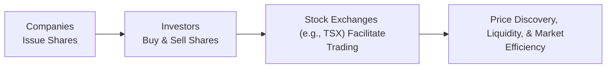

## 7.4 What Are Equity Securities?

Equity securities, at their core, represent an ownership interest in a corporation. To many of us, that sounds like a big deal—owning part of a business can be thrilling (and, well, a little nerve-racking, too). When I first bought a single share of a company years ago, I felt like I was suddenly part of some exclusive club. I mean, you get to say: “Hey, I’m one of the owners!” It’s true—you are. Now, whether that share cost me $25 or $2,500, the principle remains: by purchasing shares, you become a partial owner (or “shareholder”) of that firm, enjoying both the potential thrills of share price appreciation and the not-so-exciting possibility of share price decline.

Below, we’ll take a journey through what equity securities are all about, exploring their features, variations, risks, and how they trade in Canada, with an eye on best practices and some insights from personal experience along the way.

---

**Equity as Ownership**

When you hold equity securities—commonly referred to as “stock”—you possess a stake in a company. If you think of a business as a pie, an equity security is like your slice of it. This slice grants you certain rights, such as:
- Voting on major corporate matters (for common shareholders).
- Receiving dividends if and when the board of directors decides to distribute a portion of profits.
- Participating in the company’s overall success—or in some unfortunate cases, its failure.

Technically, equity securities are considered higher risk than many debt (or fixed-income) instruments because there are no guaranteed interest payments, no promise of principal repayment, and, in the event the company goes bust, shareholders stand behind creditors and bondholders for claims on whatever is left (if anything). That’s why equity investing typically requires a careful approach and at least a moderate tolerance for volatility.

---

**Common Shares vs. Preferred Shares**

Let’s talk about the two main types of equity securities: common shares and preferred shares. Though both represent ownership, each has its own unique features. Think of them like two branches of the equity “family tree.”

**Common Shares**  
If you’ve heard about “stocks,” you’ve likely heard about common shares. Common shares usually carry voting rights, so if you own enough of them, you can influence (to varying degrees) who sits on the board or whether a major acquisition gets approved. As a result, common shareholders are often described as having a say in a company’s future direction.

• Dividends: Common shares may pay dividends, depending on company performance and the board’s decisions. Dividends aren’t guaranteed, and the firm can reduce or eliminate them if conditions deteriorate.  
• Growth Potential: Investors typically seek out common shares for their potential to appreciate (or hopefully skyrocket) in value over time.  
• Higher Volatility: Since common shares are lower in the corporate capital structure than bonds or preferred shares, their market prices can swing dramatically with company news, economic conditions, and even investor sentiment.

**Preferred Shares**  
Preferred shares are something of a hybrid—part “equity,” part “bond-like.” They typically offer a fixed dividend rate and have priority over common shares when it comes to dividend payments. However, preferred shareholders generally do not enjoy the same voting privileges as common shareholders (unless certain specific conditions come into play, like prolonged unpaid dividends).

• Fixed Dividend: This is usually higher and more regular compared to common share dividends.  
• Priority in Liquidation: Preferred shareholders rank below creditors/bondholders but above common shareholders if the company faces liquidation.  
• Limited Growth: They generally do not experience the same intense price appreciation that common shares can deliver, given the fixed nature of their dividends and structure.

---

**The Appeal of Equities: Dividends and Capital Gains**

So, why do people find equities so attractive, despite the risk? Generally, there are two big reasons:

1. **Dividends** – Some companies, particularly well-established or mature ones, reward shareholders with dividend payouts. These dividends can be a welcome source of income. If you hold a dividend-paying stock over many years—and you reinvest those dividends—this reinvestment can snowball into more shares and bigger returns.  
2. **Capital Gains** – If you buy shares of a company and the share price goes up, you can make a profit by selling. Capital gains can be quite substantial if the company flourishes. Of course, the opposite can happen too, so you might incur capital losses if things don’t go as planned.

For many investors, the ultimate goal is total return, which can be summarized as:


  \text{Total Return (TR)} = \frac{(P_{1} - P_{0}) + D_{1}}{P_{0}} \times 100\%


Where:  
• \\(P_0\\) is the purchase price of the share (the price you paid initially),  
• \\(P_1\\) is the selling price of the share (when you dispose of it),  
• \\(D_1\\) represents the dividends received during the holding period.

This formula underscores that your overall outcome from an equity investment involves both price changes and dividends.

---

**Inherent Risk and Volatility**

I remember the first time I saw my equity investment drop 20% in a single month. I felt, well, pretty worried, to put it mildly. That’s the reality with equities—share prices move fast. And they can move up or down for reasons that might seem completely baffling. Sometimes, the company’s earnings soared but the stock went down (investors expected even higher earnings), or the broader market tanked on economic worries, dragging down even great businesses.

Yes, these day-to-day blindside factors are part of the roller-coaster nature of equity investing. It calls for not just analysis but a steady mindset. You’ll see terms like “beta” or “volatility” in finance to quantify how “bumpy” that ride can be. High-beta stocks tend to move more dramatically compared to the broader market, while low-beta stocks are more stable. As an equity investor, you should be prepared for sudden shifts and the possibility, however unpleasant, that you might lose your entire investment if the company fails.

---

**Rights on Liquidation**

Should a company go into bankruptcy or liquidation, equity holders, and more specifically common shareholders, find themselves last in line. After secured creditors, bondholders, unsecured creditors, and even preferred shareholders get whatever scraps remain, common shareholders get whatever’s left—if anything. In many failed companies, next to nothing ends up left for common shareholders.

It’s a sobering reminder that if you’re going to invest in equities, you need to be aware that the potential for reward comes with the inherent danger of loss. But that’s also a reason to diversify across multiple companies, sectors, and even geographies. It’s just preserving your capital by not placing it all in one basket.

---

**Fundamentals That Influence Stock Prices**

So, how do you decide which equities to buy? Why does one company’s share price rise while another’s slides?

1. **Revenue and Earnings**: The amount a company sells (its revenue) and the profit left over after expenses (its earnings) are critical indicators of performance.  
2. **Growth Potential**: If a company’s products or technology is positioned to flourish, investors may pay a premium.  
3. **Market Sentiment**: Even top-notch businesses can see dropping share prices in a bearish market (when investors lean negative overall), reflecting broader trends or fear-driven sell-offs.  
4. **Industry Trends**: If the industry is hitting a rough patch (like oil and gas during a downturn in energy prices), individual companies might face share price pressure, no matter how strong their fundamentals.  
5. **Macroeconomic Factors**: Interest rates, inflation, consumer confidence, and global trade policies can all sway how investors feel about stocks in general.

---

**Trading on Stock Exchanges**

In Canada, the principal exchange for trading equity securities is the Toronto Stock Exchange (TSX). Many also hear about the TSX Venture Exchange (TSXV), which often lists smaller or emerging companies. These exchanges are where shares are bought and sold, providing the liquidity that allows you to enter or exit positions (i.e., buy or sell) with relative ease.

The exchange ensures “price discovery," meaning the share price is openly negotiated between buyers and sellers. If more people want a stock (demand) than are willing to sell it (supply), the price tends to go up. If selling activity dominates, the price generally goes down.

Here’s a basic illustration of how it all fits together:

In this simplified diagram, companies raise capital by issuing shares, and investors trade those shares on the exchange. The exchange’s job is to match orders, facilitate fair pricing, and ensure openness.

For more info on listing requirements and current market data, you can visit the TSX at:
[https://www.tsx.com/](https://www.tsx.com/)

---

**Canada’s Regulatory Framework and CIRO**

Historically, we had the Mutual Fund Dealers Association of Canada (MFDA) and the Investment Industry Regulatory Organization of Canada (IIROC) as separate self-regulatory organizations. Since January 1, 2023, they have consolidated into the Canadian Investment Regulatory Organization (CIRO). CIRO now oversees both mutual fund and investment dealer firms in Canada, streamlining membership and regulatory oversight.

• **CIRO**: This is the single self-regulatory body ensuring dealers and representatives comply with securities regulations, remain properly licensed, and adhere to strong ethical standards.  
• **Registration Requirements**: In Canada, any individual or firm that deals with the public to buy or sell securities is typically required to be registered under CIRO guidelines (or be exempt).  
• **Canadian Investor Protection Fund (CIPF)**: The CIPF (after the merging of CIPF and MFDA IPC) remains an independent organization offering coverage for investor assets held by a member firm if that firm becomes insolvent.

For official updates, see [CIRO’s website](https://www.ciro.ca). Dealing representatives looking to trade equity securities must follow these regulations, know their clients, and recommend suitable products based on each client’s unique situation.

---

**Selecting and Analyzing Equities**

Let’s face it—picking individual equities can be overwhelming. Is it about thorough fundamental analysis? Short-term trading strategies? Trend-spotting? All of the above? The truth is, different approaches abound, and your style may depend on your risk appetite, time horizon, and personal interest in tracking markets. Common research pillars include:

- **Company Fundamentals**: Explore financial statements (balance sheet, income statement, cash flows), key ratios (price-to-earnings, debt-to-equity, return on equity, etc.), and management track record.  
- **Technical Analysis**: Some traders look at historical price and volume charts, searching for patterns that might predict short-term price movements. Tools like TradingView can help visualize stock charts.  
- **Qualitative Factors**: Consider brand strength, competitive advantages, and economic moats, plus intangible elements like leadership quality.  
- **Broader Economic Outlook**: If interest rates are rising or the economy is in recession, that can affect how you approach equity investments.

If you find it daunting, consider simpler approaches like investing in broad Exchange-Traded Funds (ETFs) that track major indexes, or seeking expertise from a licensed advisor who has deep experience in equity markets.

---

**Practical Example: Income vs. Growth**

- **Scenario A – Income Investor**: Suppose Sylvia is close to retirement, with stable monthly expenses. She might be drawn to solid, dividend-paying companies or even preferred shares. Selecting stocks with a track record of consistent dividends, even if they’re not skyrocketing in price, provides her with a steady income stream.  
- **Scenario B – Growth Investor**: Meanwhile, Arjun, in his late 20s, is comfortable taking on a bit more risk. He invests primarily in common shares of innovative technology firms. By focusing on companies with robust revenue growth, he hopes to see considerable capital gains over five to ten years, offsetting short-term volatility.

These examples illustrate how both personal circumstances and investment goals influence the type of equity security that best fits an investor’s portfolio.

---

**Common Pitfalls**

1. **Overconcentration**: Putting too much into one stock or one sector can lead to big losses if that area experiences a downturn.  
2. **Ignoring Valuation**: An exciting company can still be overpriced. Paying too much can reduce your investment returns (or lead to losses) if the stock value corrects.  
3. **Emotional Trading**: Getting swept up in market euphoria or panic selling can sabotage your potential gains. Our own human biases can make investing tricky—this is precisely why many people use disciplined strategies or professional advice.  
4. **Neglecting Fees and Tax Implications**: Frequent trading might rack up commissions—or capital gains tax events. Always keep track of your cost structure and potential tax consequences.

---

**Resources and Further Reading**

- **TSX Official Website**: [https://www.tsx.com/](https://www.tsx.com/) – For the latest on Canadian stock listings, market data, and more.  
- **CIRO**: [https://www.ciro.ca](https://www.ciro.ca) – The main regulatory body for investment and mutual fund dealers in Canada.  
- **Financial News**: Publications like *The Globe and Mail* or the *Financial Post* to stay up-to-date on trends, policies, and corporate news.  
- **Equity Analysis Tools**: Websites like Yahoo Finance or TradingView let you screen, chart, and analyze stocks with ease.

---

**Case Study: A Quick Look at a Hypothetical Company**

Let’s imagine MeadowHaven Organics, a Canadian agriculture company specializing in organic produce. Suppose you’re analyzing whether to buy MeadowHaven’s common shares:

- **Share Price**: Currently trading at $20.00.  
- **Dividend**: $0.50 per share annually, paid quarterly.  
- **Revenue Growth**: Up 12% year-over-year, with positive trends in the organic food sector.  
- **Risks**: The firm is expanding into new markets, requiring high capital expenditure. Rising interest rates might increase borrowing costs and slow expansions.  
- **Potential**: If demand for organic products keeps soaring, the share price could rise.  

After reviewing the fundamentals, industry outlook, and your own risk tolerance, you decide to purchase 100 shares, hoping to enjoy both future share appreciation and a decent annual dividend yield of 2.5% (\\(0.50 \div 20.00 \times 100\%\\)).

---

**Bringing It All Together**

Equity securities can be both rewarding and nerve-wracking. When you own shares in a company:
- You’re tying your financial outcome to that company’s performance, leadership, and market environment.  
- Your returns might include dividends (where paid) and the capital gains you might realize upon selling.  
- You should take a measured, research-driven (or advice-informed) approach to manage the inherent volatility.  
- You’re subject to regulatory protections and guidelines laid out by CIRO and local securities commissions, which aim to provide you with important disclosures and help maintain fair, efficient markets.

Equities have historically offered one of the best ways to grow wealth over the long haul—though never without risk. By understanding these fundamentals and balancing them against your personal situation and investing horizon, you can decide if (and how) equity securities fit into your broader financial plan.

---

## Equity Securities in Canada: Comprehensive Quiz



### What does equity ownership in a corporation typically represent?

- [x] Partial ownership with potential voting rights
- [ ] A guaranteed fixed interest payment
- [ ] A short-term loan provided to the company
- [ ] A risk-free investment like government bonds

> **Explanation:** Equity ownership (such as buying common shares) means holding a part of the company, complete with potential voting rights and a share in profits. Unlike bonds, there is no promise of fixed interest or principal repayment.

### Which type of equity security usually provides voting rights?

- [x] Common shares
- [ ] Preferred shares
- [ ] Corporate bonds
- [ ] Convertible debentures

> **Explanation:** Common shares generally carry voting rights, allowing shareholders to have a say in matters like board elections. Preferred shares typically do not include voting rights unless specific conditions arise.

### Why are equity securities considered riskier than many fixed-income instruments?

- [x] There is no guarantee of dividend payments or return of principal, and value can fluctuate significantly.
- [ ] They offer regular, predetermined interest payments.
- [x] They rank behind bondholders and creditors in liquidation.
- [ ] They are fully insured by the government to guarantee returns.

> **Explanation:** Equity securities provide no guaranteed returns and, in bankruptcy, rank behind creditors and bondholders. No government insurance backs typical stock investments, making them higher risk overall.

### In the case of liquidation, which category of shareholders is typically last in line to be repaid?

- [x] Common shareholders
- [ ] Preferred shareholders
- [ ] Secured creditors
- [ ] Bondholders

> **Explanation:** Common shareholders are the residual owners of the firm and only receive assets, if any remain, after all creditor claims, bondholders, and preferred shareholders are settled.

### Which element does NOT directly influence the share price of a company?

- [x] The personal investment goals of an individual shareholder
- [ ] The company’s earnings reports
- [x] Overall market sentiment and economic outlook
- [ ] Growth prospects in the company’s industry

> **Explanation:** While an individual investor’s goals might affect their decision to buy or sell, personal goals alone do not drive the overall share price. Collective market activity and fundamentals do.

### What is the typical advantage of preferred shares over common shares?

- [x] They usually have a fixed dividend and priority over common shares in dividend distribution.
- [ ] They offer higher voting rights than common shares.
- [ ] They always trade at a lower price than common shares.
- [ ] They have a guaranteed market value supported by government insurance.

> **Explanation:** Preferred shares typically provide fixed dividends and are given payment priority over common shareholders, but they generally do not carry higher voting rights.

### Which of the following best describes dividend yield?

- [x] The annual dividend per share divided by the current share price.
- [ ] The capital gain realized by selling the share at a profit.
- [x] Company revenue growth over the past year.
- [ ] The ratio of the share price to earnings per share.

> **Explanation:** Dividend yield = (annual dividend per share ÷ current share price) × 100%. It indicates the return from dividends alone, ignoring capital gains or losses.

### Which entity regulates mutual fund and investment dealer activities in Canada since 2023?

- [x] The Canadian Investment Regulatory Organization (CIRO)
- [ ] The Investment Industry Regulatory Organization of Canada (IIROC)
- [ ] The Mutual Fund Dealers Association of Canada (MFDA)
- [ ] The Canadian Securities Administrators (CSA)

> **Explanation:** IIROC and the MFDA were consolidated into CIRO on January 1, 2023. CIRO is now Canada’s unified self-regulatory body for investment and mutual fund dealers.

### Which statement about dividends is correct?

- [x] They are distributions of a company’s profits to shareholders and are not guaranteed.
- [ ] They are mandatory payments that companies must issue quarterly.
- [ ] They are guaranteed by the government up to a certain limit.
- [ ] They usually decrease shareholder returns compared to capital gains.

> **Explanation:** Dividends come from a portion of company profits and are declared at the discretion of the board. There are no guarantees companies will pay them, even if they have done so previously.

### True or False: Equity securities are always safer than bonds because of their long-term growth potential.

- [x] False
- [ ] True

> **Explanation:** While equities often offer higher growth potential over the long run, they carry higher risk and volatility, making them not inherently “safer” than bonds.


