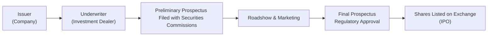

## 7.4 How are New Securities Brought to Market?

It’s one of those classic late-night chat topics for finance folks—how do companies actually bring new securities to the public? Well, maybe it's not quite a topic you’d crack open over dinner, but in the world of capital markets, this question is at the heart of how businesses grow and how investors discover new opportunities. In this section, we’ll walk through a few key pathways for offering new securities to the market in Canada, including the crown jewel: the Initial Public Offering (IPO). We’ll also touch on private placements, secondary offerings, and the central role that regulations from the Canadian Securities Administrators (CSA) and the Canadian Investment Regulatory Organization (CIRO) play in ensuring a fair and transparent process.

---

## Overview

New securities typically come to the market in two major ways:

• Public Offering (e.g., an IPO for the first-time sale of shares)
• Private Offering (e.g., private placements to accredited investors)

Public offerings give companies the chance to connect with a broad spectrum of investors. These offerings require substantial disclosure and compliance with stringent regulatory requirements in Canada. Private placements, on the other hand, allow companies to tap a narrower circle of sophisticated or accredited investors, reducing some of the disclosure requirements but also limiting the investor pool.

Many different elements come together to create a successful launch (or “issuance”) of new securities—from selecting an underwriter, to drafting a prospectus, to marketing the offering on what's called a “roadshow.” It can sound complicated, and, well, it sometimes is. But trust me, once you get the hang of who-does-what and when, it almost feels like a well-choreographed dance.

---

## Initial Public Offering (IPO)

You may have heard the term IPO thrown around in the news, especially when a “hot” tech startup suddenly becomes a publicly listed company. An IPO represents the first time a company’s shares (or other securities) are available for purchase by the general public on a stock exchange. The entire process involves multiple steps, regulatory oversight, and a fair amount of strategic coordination.

### The Role of the Underwriter

When a company decides to go public, it typically recruits an underwriter (often a team of underwriters) from an investment dealer. The role of the underwriter is to help shape and manage the process of distributing the shares to the market. Depending on the agreement, the underwriter might commit to purchase a certain number of shares at a fixed price, then resell them to the public, or it may just manage the distribution without fully committing capital.  
• Underwriters help set the offering price.  
• They often organize the entire marketing campaign for the IPO (the “roadshow”).  
• They assess market demand through early engagements with institutional and retail investors.

### Preliminary Prospectus (Red Herring)

Once the company and the underwriter have hashed out key details, a preliminary prospectus is prepared and filed with the relevant provincial or territorial securities commissions. In Canada, the broad guidelines for prospectus disclosure are set by the CSA. The preliminary prospectus—sometimes called a “red herring” due to the warning language typically printed in red—is not the final document. Rather, it’s a way to communicate essential information to potential investors while regulators do their review.  
• The preliminary prospectus reveals the nature of the business, the investment opportunity, and potential risks.  
• It does not specify the final share price or the exact number of shares offered, although it typically provides a price range.

### Regulatory Review and Final Prospectus

After filing the preliminary prospectus, the securities commission(s) will review it to ensure compliance with applicable regulations (for example, National Instrument (NI) 41-101 in Canada). While awaiting regulatory approval, underwriters and the issuing company may hold roadshows, meeting with potential investors to gauge interest and refine the offering structure.

Once the regulators’ comments have been addressed, the issuer (the company) files a final prospectus. This document includes the final offering price, the precise number of shares to be sold, and all material information necessary for an investor to make an informed decision.  
• Approved final prospectus is then made public.  
• Investors can review the final details and decide whether to participate in the IPO.  
• Typically, the securities distribution period follows right after the final prospectus clearance.

### Listing on an Exchange

After the final prospectus is approved and enough investor interest is gathered, the company’s shares are listed on a recognized stock exchange—assuming it meets the listing requirements of that exchange. In Canada, this might be the Toronto Stock Exchange (TSX) or Canadian Securities Exchange (CSE), among others. And just like that, the day arrives when the stock starts trading and the “bell rings.”  
• From that point on, the shares are bought and sold in the secondary market.  
• Transparency, liquidity, and regulations governing continuous disclosure all kick in for the new public issuer.

### Greenshoe Option

An interesting feature of many IPOs is the “greenshoe option,” named after the first company that used it, the Green Shoe Manufacturing Company. This option allows the underwriters to purchase additional shares (usually up to 15% more than the original offer) from the issuer at the IPO price.  
• It helps stabilize the share price in the days immediately following the IPO, as underwriters can use these additional shares to manage supply and demand in the market.  
• It provides a safety net to underwriters if demand is stronger than expected or if the price starts to drift below the IPO offering price.

### IPO Process Flowchart

Below is a simple Mermaid diagram that outlines the major steps in an IPO:

In this diagram, the issuer (company) partners with the underwriter. They file the preliminary prospectus, conduct a roadshow, secure final prospectus approval, and then list the shares on a stock exchange.

---

## Private Placements

Sometimes, companies want to raise money without the fanfare and regulatory demands of a public offering. In such cases, they may opt for a private placement. Instead of offering securities to the general public, the company sells them directly to a limited pool of sophisticated investors—commonly referred to as “accredited investors” in Canada.  
• Accredited investors are deemed capable of handling these higher-risk scenarios.  
• Disclosure requirements are less onerous because regulators presume that these investors either have enough financial sophistication or the resources to handle the associated risks.

While private placements can be quicker and cheaper, they come with trade-offs: less liquidity for investors, more restrictions on resale, and no broad branding boost that a public listing might provide. Companies choosing this route must ensure they stay within the bounds of relevant exemptions from prospectus requirements outlined in the applicable Canadian securities rules.

---

## Prospectus Requirements in Canada

In the Canadian context, prospectus disclosure rules aim to protect investors by mandating comprehensive, timely, and accurate information on the securities being offered. The overarching principle is to ensure no “material fact” is left undisclosed. This principle underpins a fair marketplace, so any prospective investor—whether an individual or institution—has the knowledge needed to evaluate the risk-return trade-off.

### CSA’s National Instrument (NI) 41-101

NI 41-101 sets the prospectus disclosure guidelines for most Canadian jurisdictions. If you’d like to dive into actual documents, you can check out the System for Electronic Document Analysis and Retrieval (SEDAR) database for public filings, real prospectuses, and other corporate documents. (SEDAR is in the process of transitioning to its next iteration, but it remains the main resource for prospectus filings.)

### CIRO's Role

The Canadian Investment Regulatory Organization (CIRO) oversees investment dealers nationwide. It stems from the amalgamation of the Investment Industry Regulatory Organization of Canada (IIROC) and the Mutual Fund Dealers Association of Canada (MFDA). Any references to these older entities are purely historical contexts now. CIRO enforces rules around how member investment dealers (such as underwriters) handle new issues, promote securities, and allocate shares to clients.  
• CIRO sets guidelines for fair allocation of new issues to various investors.  
• CIRO also helps ensure compliance with the broader regulatory framework to maintain investor confidence and market integrity.

---

## Secondary Offerings

A secondary offering generally refers to new securities issued by a company that is already publicly listed. That might sound odd at first: “secondary” typically describes the trading in the open market, but in this context, we’re talking about an additional issuance of shares. Another scenario is when existing shareholders (like founders or early investors) sell a block of shares.  
• In a secondary (follow-on) offering, the company sells additional shares to raise more capital.  
• The process is often simpler than an IPO, but still requires filing a prospectus (or a short-form version if the issuer meets certain criteria).

From a regulatory standpoint, the disclosure requirements remain in place. The company must update the market on any new developments since its IPO and ensure that all relevant data is provided to potential investors.

---

## Practical Examples and Anecdotes

I recall a friend who decided to invest in a tech IPO that had generated a fair amount of buzz a few years ago. He called me up, all excited—“Do you think I should buy? Everyone’s talking about it!” My general advice was to read the prospectus (especially the risk factors) and follow the guidance from his advisor, who was well-versed in the underwriting firm’s research. Moral of the story: hype is hype, but the final prospectus is where you get the facts on the company’s financials, projections, and risk exposures.

Another scenario that often pops up is private placements. A small mining company, for example, might not have the resources to go full-blown IPO. Instead, they approach accredited investors—like institutional funds or high-net-worth individuals—to secure the capital needed to keep exploration going. It’s a simpler but narrower route, and you usually won’t see it plastered on national news.

---

## Best Practices, Common Pitfalls, and Strategies

• Best Practices  
  – Thorough Due Diligence: From the company’s side, ensure the prospectus (preliminary or final) addresses all material facts comprehensively.  
  – Transparent Communication: With regulators and potential investors, consistent and complete communication builds trust.  
  – Engage Professionals Early: Lawyers, accountants, and underwriters can help structure the offering efficiently.

• Common Pitfalls  
  – Inadequate Disclosures: Failing to disclose critical business risks or financial uncertainties can lead to regulatory sanctions and lawsuits.  
  – Overvaluation: Sometimes, companies get swept up in their own enthusiasm, leading to an IPO price that is too high. Post-IPO price drops can damage credibility.  
  – Relying Solely on “Hype”: If marketing outweighs the actual fundamentals, the ensuing disappointment can harm the company’s reputation.

• Strategies to Overcome Issues  
  – Roadshow Feedback: Use the roadshow to gauge investor sentiment and adjust the offering price or structure if necessary.  
  – Greenshoe Option: Helps maintain price stability after the IPO.  
  – Ongoing Communication: Even after securities are launched, consistent, transparent updates help maintain investor trust and regulatory compliance.

---

## Additional Resources

Below are some resources if you’d like to dig deeper:

• System for Electronic Document Analysis and Retrieval (SEDAR) – Explore real-world prospectuses and financial statements.  
• CIRO (https://www.ciro.ca) – Check current regulations and guidance for investment dealers overseeing new issues of securities.  
• Canadian Securities Administrators (https://www.securities-administrators.ca/) – National coordination of provincial and territorial securities regulators; see NI 41-101 for prospectus requirements.  
• “Investment Banking: Valuation, Leveraged Buyouts, and Mergers & Acquisitions” by Rosenbaum and Pearl – A widely respected text for understanding underwriting processes and broader capital market activities.

---

## Glossary (Key Terms from This Section)

• Underwriter: A firm (often an investment dealer) that helps bring new securities to market and may assume risk by purchasing the offering.  
• Prospectus: A legal document detailing the nature of the securities offered, financial statements, and the key risks.  
• Initial Public Offering (IPO): The first time a company’s stock is sold to the public.  
• Secondary Market: Where investors trade previously issued securities among themselves (post-IPO).  
• Accredited Investor: An individual or institution with sufficient net worth or income to handle high-risk investments outside the usual prospectus requirements.  
• Roadshow: A series of presentations by the issuing company and underwriters to potential institutional investors, often used to build interest and gather feedback for an IPO.  
• Greenshoe Option: An over-allotment option allowing underwriters to buy extra shares from the issuer to stabilize the stock price.

---

## Summary and Looking Ahead

Bringing new securities to market can be a pretty exciting yet highly regulated journey. Whether a company opts for an IPO to gain broad public exposure or a private placement to keep things lean and targeted, the success of the offering often hinges on transparent disclosures, sound valuation, and reliable underwriters. Meanwhile, regulators like the CSA and CIRO are there to keep everyone on track and protect the integrity of Canada’s capital markets. Once these new securities hit the exchange, they enter the secondary market, where day-to-day supply and demand determine their price. And the cycle continues—secondary offerings, more private placements, expansions, and so forth.

For a deeper dive, check out some real-world filings on SEDAR, or browse the CIRO website for guidelines on how dealers are expected to distribute new issues to clients fairly. The journey might look daunting at first, but with the help of professionals—and some finance-friendly reading—it becomes more approachable (and maybe even a bit fun!). After all, every new security opening up for public investment carries a story, a set of hopes, and, yes, some real risks.

---

## Test Your Knowledge: Bringing New Canadian Securities to Market



### When a company decides to go public for the first time, what is the process called?

- [ ] Private placement  
- [x] Initial Public Offering (IPO)  
- [ ] Secondary market transaction  
- [ ] Dividend reinvestment plan  

> **Explanation:** An IPO is the first-time sale of shares to the general public, which is different from private placements or secondary market transactions.

### Which document is first filed with securities regulators before an IPO’s final prospectus?

- [ ] Final prospectus  
- [ ] Memorandum of association  
- [x] Preliminary prospectus (red herring)  
- [ ] Greenshoe notice  

> **Explanation:** The preliminary prospectus (often nicknamed the “red herring”) is filed first, followed by regulatory review, and then the final prospectus.

### What is one advantage of conducting a private placement instead of an IPO?

- [ ] Access to the broad retail investor market  
- [ ] Higher public profile immediately  
- [x] Reduced disclosure requirements  
- [ ] No involvement of underwriters  

> **Explanation:** Private placements involve fewer disclosure requirements because they target sophisticated or accredited investors, unlike an IPO, which is open to the general public.

### Which organization in Canada enforces rules for investment dealers, including regulations for new securities issues?

- [ ] IIROC (still active)  
- [ ] MFDA (still active)  
- [ ] The Canada Border Services Agency (CBSA)  
- [x] CIRO  

> **Explanation:** The Investment Industry Regulatory Organization of Canada (IIROC) and the Mutual Fund Dealers Association (MFDA) merged into the Canadian Investment Regulatory Organization (CIRO), which now oversees dealers and market integrity.

### A “greenshoe option” in an IPO helps underwriters do what?

- [x] Purchase additional shares to stabilize the stock price  
- [ ] Dissolve the IPO if demand is too low  
- [x] Adjust the final prospectus disclosures  
- [ ] Delay the listing date indefinitely  

> **Explanation:** The greenshoe option allows underwriters to buy extra shares from the issuer to help manage supply and demand during the initial days of trading, thus helping stabilize the share price.

### The roadshow process typically occurs:

- [ ] After the final prospectus is approved  
- [x] Between the filing of the preliminary prospectus and the final prospectus  
- [ ] After listing on the stock exchange  
- [ ] Only for private placements  

> **Explanation:** The roadshow happens in the interim period to gauge investor interest and refine the offering terms as needed, before filing the final prospectus.

### In a private placement, shares are usually sold to:

- [x] Accredited or sophisticated investors  
- [ ] All Canadian retail investors  
- [x] Individuals with no net worth restrictions  
- [ ] Only government agencies  

> **Explanation:** Private placements restrict offerings to accredited investors (or equivalently sophisticated investors) who meet certain net worth or income thresholds.

### In Canada, issuers are obliged to fully disclose all material facts because:

- [ ] It’s only a marketing preference by underwriters  
- [x] Securities laws require it, aiming to protect investors  
- [ ] Investors don’t read disclaimers  
- [ ] It reduces listing fees  

> **Explanation:** Canadian securities laws, under the CSA, mandate that issuers comprehensively disclose all material facts to protect investors and maintain a fair market.

### A secondary offering happens when:

- [x] A company already listed decides to issue more shares  
- [ ] A private company sells shares for the first time  
- [ ] A government entity lists a crown corporation  
- [ ] A stock exchange forcibly issues new shares  

> **Explanation:** A secondary (or follow-on) offering refers to a company that is already public but offers additional securities or another block of existing shares for sale.

### True or False: Underwriters assume no risk when they help bring a company public.

- [x] False  
- [ ] True  

> **Explanation:** Underwriters often take on considerable risk, especially if they purchase shares from the issuer to resell to the public (firm commitment underwriting).  


