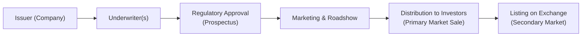

## 7.5 How Are New Securities Brought to Market?

Bringing new securities to market—often described as the “primary market” process—can seem a bit daunting, right? You’ve got investment banks (underwriters), regulatory agencies, prospectus requirements, and you might even hear words like “roadshow” tossed around. But don’t worry; in this section, we’ll take a friendly, step-by-step look at how new securities (for example, stocks and bonds) are created and sold to investors in Canada. We’ll explore key players in the process, from the companies looking to raise capital to the underwriters who help with distribution, and we’ll check out the critical regulatory framework that keeps everything fair and transparent. 

We’ll also share a few personal anecdotes to help tie these concepts to real life. Honestly, the first time I watched a live IPO (Initial Public Offering) unfold, I was amazed at just how many moving parts were involved—legal documents, marketing calls, pricing decisions, you name it. So, if you’re curious about how “new shares” or “new bonds” show up in the public markets, let’s get into it.

---

### Importance of Understanding the Primary Market

If you’ve been reading through the earlier parts of this chapter, you already know that the secondary market is where we usually see all the trading. Stocks, bonds, and, to some extent, mutual funds trade hands between investors on a day-to-day basis. But the question is, how on earth did those securities get there to begin with?

That’s where the primary market comes in. Companies and other issuers tap into the primary market to raise money, either by selling stocks (equity) or bonds (debt). This is crucial to remember: when you buy in the primary market, you’re basically buying directly from the issuing company (or from its underwriting syndicate). By contrast, in the secondary market, you’re buying from other investors. 

Now, as a mutual fund sales representative—especially in Canada—you’re typically focused on advising clients on open-ended mutual funds or perhaps other related products. Still, an overall grasp of how new issues reach the market can definitely elevate your conversations, especially if your clients see an interesting Initial Public Offering (IPO) making headlines and ask, “How does that even happen?”

---

### Key Steps in the Issuance Process

Let’s map out a typical journey: a company decides it needs more capital. It might want to build a new factory, purchase cutting-edge tech equipment, or expand into new markets overseas. So, it chooses to raise money by offering securities (bonds or stocks). But how exactly do these securities find buyers?

Below is a high-level overview of the issuance process in Canada:

• The issuer (company) decides what type of security to offer (e.g., equity or debt) and how much capital it wants to raise.  
• It then prepares the required documentation and, in most public offerings, files a preliminary prospectus with Canadian regulators.  
• An underwriting syndicate—led by a primary underwriter—structures the deal, helps determine the offer price or yield, and coordinates the marketing effort (sometimes called a roadshow).  
• Once regulatory approval is in place and the final prospectus is cleared, the securities are offered to investors.  
• The underwriter distributes the securities to various investors and the new securities begin trading in the secondary market, often on a recognized exchange.

---

### A Visual Look at the Issuance Workflow

To give you a quick visual sense of how everything moves from the company (issuer) to the investing public, here’s a simple Mermaid flowchart:

• Issuer (Company): The firm that needs capital.  
• Underwriter(s): Investment dealer(s) that structure the offer and buy/sell the securities.  
• Regulatory Approval (Prospectus): Steps required by Canadian Securities Administrators (CSA) and supervised by CIRO for market protection.  
• Marketing & Roadshow: Underwriters and company leadership present to potential investors.  
• Distribution to Investors (Primary Market): Securities are sold to institutional and retail clients.  
• Listing on Exchange (Secondary Market): Securities trade among investors, typically on well-known stock exchanges or over-the-counter (OTC) markets.

---

### Methods of Issuing New Securities

Different roads lead to the public market. Let’s check out the most common.

#### Initial Public Offering (IPO)

Ah, the IPO—basically the first time a private company offers shares to the public. Imagine a tech startup that’s been operating for a few years, has some solid revenue, and suddenly decides to open its doors to outside shareholders by listing on a public exchange. IPOs are a big deal because they transition a business from private to public ownership. Investors love these because of the potential for quick share price appreciation if the company is “hot.” However, the risk can also be higher because, well, “unproven in public markets” can sometimes mean less historical data for investors to evaluate.

During an IPO, an underwriter helps the issuer set an offering price. In fact, underpricing or mispricing is a constant worry: you don’t want to set the IPO price so high that no one buys, nor do you want it to pop 100% on the first day because that might indicate the issuer left money on the table.

#### Follow-On Offering (Seasoned Equity Offering)

So now you’ve got a public company—maybe it had its IPO years ago. Times change, and it needs additional money, or it wants to pay down debt, or it sees a strategic opportunity. It can do a follow-on offering (also called a Seasoned Equity Offering, or SEO). This time, because the company is already public, it might have an easier or more straightforward path. But it still needs to file the required documents (or a simplified prospectus if it qualifies) and comply with all relevant disclosures.

#### Private Placements

Private placements are a whole different ballgame. Instead of selling to the public at large, the issuer sells shares or bonds to a limited group of sophisticated or accredited investors—like big pension funds, private equity firms, or wealthy individuals. These deals don’t involve going broad to the public, so they can dodge some of the more extensive disclosure requirements. But the trade-off is that these securities might not be as liquid afterwards, nor are they typically listed on a public exchange. Plus, the number of potential investors is smaller, so that can impact the final capital-raising total.

---

### Underwriting Explained

Underwriting is just a fancy way of saying, “We’ll take on the risk of selling these securities.” Essentially, underwriters are investment dealers (or a group of them, called a syndicate) who buy the new issue from the issuer at a set price and then resell to investors, either fully (firm commitment) or on a best-efforts basis.

#### Firm Commitment (Bought Deal)

In a bought deal, the underwriter says, “We’ll buy all the shares you want to issue, and we’ll handle selling them.” So the issuer gets a guaranteed amount of money. However, the underwriter is on the hook for any unsold portion or if the market plummets right before distribution. Many large, stable companies who want certainty prefer this route.

#### Best Efforts

This is more of a “Hey, we’ll try our best to sell your shares, but if we can’t place them all, we’ll return them.” So, the underwriter’s risk is lower because it doesn’t commit to purchasing the entire load. The issuer bears more risk since it might not raise the full desired amount if the issue isn’t fully subscribed.

Here’s a compact reference table comparing the two:

| Factor             | Firm Commitment (Bought Deal) | Best Efforts                 |
|--------------------|-------------------------------|------------------------------|
| Underwriter Risk   | High (Underwriter must buy)  | Lower (No guaranteed purchase) |
| Issuer Risk        | Lower                         | Higher                        |
| Typical Usage      | Larger, stable firms          | Smaller or higher-risk firms  |
| Commitment Fee     | Typically higher              | Typically lower               |

---

### Legal and Regulatory Requirements

Canada’s securities regulations aim to protect investors through full, fair, and timely disclosure. The Canadian Securities Administrators (CSA) coordinates policy across provinces and territories, ensuring national consistency. Meanwhile, CIRO (the Canadian Investment Regulatory Organization) oversees investment dealers, mutual fund dealers, and marketplace integrity, setting conduct standards for the distribution of these securities.

Before an issuer offers securities publicly, it must prepare and file a preliminary prospectus that outlines the investment, its risks, financial statements, and management’s discussion and analysis. Regulators review it for completeness. Once accepted, the issuer distributes a final prospectus, after which the securities can be sold to the public. This entire process is governed by rules such as National Instrument 41-101 in Canada.

If you want to see real-life examples, check out SEDAR+ (https://www.sedarplus.ca/). You’ll find prospectuses, continuous disclosure documents, and financial statements for publicly traded companies, all of which can be educational for anyone curious about how these offerings are structured.

---

### Why Mutual Fund Representatives Should Care

You might be thinking, “But I’m a mutual fund representative. I don’t handle corporate IPOs directly, right?” That’s true. Historically, mutual fund reps only distribute mutual funds, and typically their dealers were regulated by the older MFDA (Mutual Fund Dealers Association of Canada) prior to January 1, 2023. Today, however, everything sits under CIRO, with a consolidated rulebook designed to protect investors across all registered platforms.

Understanding how new securities come to market helps you shine during client conversations. Clients might say, “I see that new tech company is going public, and it looks cool—should I invest?” Even if you can’t advise directly on the IPO (outside your mutual fund registration scope), you can still provide an overview of the process, highlight the benefits and risks, and explain how new IPOs find their way into mutual fund portfolios (since some mutual funds might invest in IPOs as part of their strategy).

On top of that, being aware of changes in the primary market—like shifts in underwriting methods or new regulatory guidelines—helps you understand broader market dynamics. The more you know, the better service you can provide to your clients, especially if they wonder why certain mutual funds are invested in brand-new, possibly volatile shares. 

---

### Common Pitfalls and Best Practices

• Overhype or FOMO (Fear of Missing Out): IPOs often come with a lot of buzz. Be sure to remind yourself or your clients that hype doesn’t guarantee performance.  
• Inadequate Prospectus Review: Skipping a thorough read-through of the final prospectus is a major risk. This document is the best single source for understanding the investment’s risks and fundamentals.  
• Timing the Market: It’s super tempting to dive into an offering because “the market is hot right now,” but timing can be tricky. Sometimes, waiting, or diversifying via established funds that can pick up those new securities, might be more prudent.  
• Regulatory Compliance: Issuers and underwriters must comply with all CSA regulations and CIRO rules. Failing to follow these can lead to penalties, reputational damage, and even legal action.

Best practices include thorough due diligence, relying on transparent communication with clients or stakeholders, maintaining ethical standards at every step, and seeking professional advice when stepping into new territory. If you’re a mutual fund rep, keep your focus on clients’ KYC (Know Your Client) profiles and make sure any recommendation—or even educational insight—is consistent with their objectives and risk tolerance.

---

### Real-World Scenario

Let’s say a fictional Canadian software company, MapleTech Innovations Inc., decides to go public. It sets its sights on raising $100 million. MapleTech engages a large national bank as the lead underwriter.  

1. MapleTech files a preliminary prospectus under the relevant National Instrument, like NI 41-101, which outlines the company’s performance, management team, risk factors, and how it will use the proceeds.  
2. The underwriter organizes a mini “roadshow” (these days often virtual), presenting MapleTech to institutional funds, pension funds, and even some high-net-worth individuals.  
3. After obtaining regulatory clearance, MapleTech releases its final prospectus. The underwriter commits to purchase all the shares at, say, $15 per share (this is a bought deal).  
4. On the day MapleTech’s shares list on the exchange, it opens around $16.50. Great for new investors! But let’s say the next day it dips to $13.75. That volatility is normal in fresh issues.  

From a mutual fund rep’s standpoint, your job might include explaining to clients why the MapleTech IPO is in some funds they hold. Or maybe you just calmly reassure them that short-term price action is part of the game.

---

### Additional Resources

• Review the CSA’s National Instrument regulations (e.g., NI 41-101) for prospectus requirements.  
• Explore SEDAR+ (https://www.sedarplus.ca/) for corporate filings and new issuer prospectuses.  
• For more on underwriting and deal structuring, consider reading “Investment Banking: Valuation, Leveraged Buyouts, and Mergers & Acquisitions” by Rosenbaum and Pearl.  
• Check with CIRO (https://www.ciro.ca) for current rules and guidelines around distributing new securities in Canada.  

By staying informed about these resources, you’ll have an up-to-date knowledge base on the ins and outs of how new securities make their way to market.

---

### Putting It All Together

Bringing new securities to market is an intricate dance of regulatory compliance, underwriting strategies, and investor appetite. As a mutual fund representative—even though you typically won’t be issuing or directly selling these new securities yourself—the knowledge of how offerings come to life (IPO, follow-on, or private placement) can empower you to address client queries with confidence. You’ll be able to discuss why certain funds have exposure to fresh IPOs or newly issued bonds, how prospectus reviews function, and why some deals are sold on a bought-deal basis versus best efforts.

Keep in mind the importance of full disclosure and the regulatory frameworks that protect investors. From the preliminary prospectus to the final, from marketing the deal to listing on the exchange, the journey can be complex. But it’s also an exciting process that supports capital formation and allows businesses to grow—and, hopefully, investors to flourish. Knowledge of this path can enhance the guidance you provide. And who knows? You might just be the friendly expert your clients turn to when a flashy IPO hits the headlines.

Remember, this is just one piece of the puzzle in understanding how investment products are structured and traded (see other sections of Chapter 7 for a deeper dive into bonds, equities, derivatives, and more). If you ever find yourself fielding questions from clients that dip into IPO territory, you’re now better equipped—even if your main business is mutual funds—to steer them in the right direction and keep the conversation grounded in the fundamentals.

---

## Test Your Knowledge: Bringing New Securities to Market Quiz



### Which of the following describes the first time a company offers shares to the public?
- [ ] Follow-on offering
- [ ] Private placement
- [x] Initial Public Offering (IPO)
- [ ] Best efforts deal

> **Explanation:** An Initial Public Offering (IPO) is the very first sale of a company’s stock to the public. Follow-on offerings and private placements occur later or among select investors, while best efforts refers to a type of underwriting agreement.

### Which statement best describes a Firm Commitment (Bought Deal)?
- [x] The underwriter purchases all shares from the issuer and bears the risk of unsold shares.
- [ ] The underwriter sells shares but can return unsold ones to the issuer.
- [ ] The company bypasses the underwriter entirely.
- [ ] The deal is only open to accredited investors.

> **Explanation:** In a bought deal, the underwriter takes on full responsibility for purchasing the entire issue from the issuer and then reselling the securities, thus bearing any associated risk.

### Which entity oversees investment dealers and mutual fund dealers in Canada as of 2025?
- [ ] IIROC
- [ ] MFDA
- [x] CIRO
- [ ] CSA

> **Explanation:** On January 1, 2023, IIROC and the MFDA amalgamated into the Canadian Investment Regulatory Organization (CIRO), making it Canada’s primary self-regulatory organization for investment dealers and mutual fund dealers.

### What is the primary benefit for a private placement over a public IPO?
- [ ] Higher levels of liquidity for shares
- [x] Fewer regulatory requirements and faster execution 
- [ ] Broader marketing to retail investors
- [ ] Greater transparency to the public

> **Explanation:** Private placements typically face fewer regulatory hurdles, making them faster and simpler to execute, though the trade-off is less liquidity and a restricted investor base.

### In a best efforts underwriting agreement, who bears the additional risk if shares are not fully sold?
- [ ] The underwriter 
- [x] The issuer 
- [ ] Regulators
- [x] Often both the issuer and potential large investors

> **Explanation:** Under a best efforts agreement, the underwriter doesn’t commit to purchasing all the shares. If some remain unsold, responsibility largely falls back on the issuer, though large institutional investors may also be impacted if the deal structure changes.

### Which key regulatory filing must be reviewed and accepted by the CSA before a public offering can proceed?
- [x] Prospectus 
- [ ] Proxy statement
- [ ] Registration rights agreement
- [ ] Letter of intent

> **Explanation:** A prospectus is mandated by regulatory authorities to provide investors with detailed disclosures. The CSA reviews this document before granting the issuer permission to proceed.

### A mutual fund representative should care about primary market offerings primarily because:
- [x] Clients may ask about new IPOs affecting their portfolios 
- [ ] Mutual fund representatives directly underwrite all new issues
- [x] Knowledge of market dynamics improves client conversations 
- [ ] They are required by law to invest only in new securities

> **Explanation:** While mutual fund reps don’t typically underwrite IPOs, understanding how new securities come to market lets them address client questions and deepen discussions about market trends.

### SEDAR+ is best described as:
- [ ] A global real-time stock exchange 
- [ ] A syndicated loan platform
- [x] A Canadian repository for corporate filings and disclosure documents
- [ ] An exclusive resource for private placements only

> **Explanation:** SEDAR+ (formerly SEDAR) is a central hub for accessing Canadian public company filings, including prospectuses, financial statements, and continuous disclosures.

### Which of the following is a primary risk for issuers using the Firm Commitment method?
- [ ] Underperformance by the underwriter in finding investors
- [ ] The possibility of returning unsold shares to the issuer
- [ ] The inability to set a clear offering price
- [x] The underwriter may demand a higher discount to account for its risk

> **Explanation:** Because the underwriter bears the risk of unsold shares in a Firm Commitment, it may negotiate a higher discount or lower purchase price from the issuer to mitigate potential losses.

### True or False? A follow-on offering (seasoned equity offering) is only possible if the company has never offered shares before.
- [ ] True
- [x] False

> **Explanation:** A follow-on offering happens after a company has already gone public, meaning it has previously offered shares. Hence, the statement is false.


