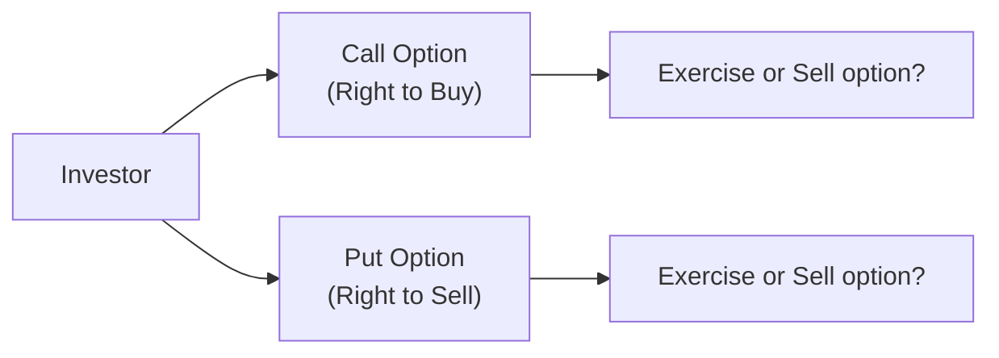

## 7.5 What are Derivative Securities?

Imagine you’ve got a friend who wants to buy a house in six months, but they’re worried that real estate prices might jump by then. They strike a deal with a developer to buy at a locked-in price today, for a purchase to happen later. That’s similar to a derivative: a contract whose value depends on—or is “derived” from—something else, such as an asset’s price, an index level, or an interest rate.

Derivatives can feel a bit mysterious, but they’ve become an integral part of modern financial markets. In this section, we’ll break down those mysteries, explain how derivatives can be used to hedge, speculate, or arbitrage, and detail how they’re regulated in Canada. I still recall the first time I encountered derivatives in my own investment practice—at first, I thought, “Do we really need all these fancy contracts?” But once you see them in action, you realize they can be powerful tools for both managing risk and seeking profit.

Let’s dive in step by step.

### Understanding Derivative Securities

A derivative is essentially a financial contract that gains (or loses) value based on fluctuations in an underlying asset. Common underlying assets can include:
• Stocks or stock indices  
• Bonds and interest rates  
• Currencies  
• Commodities (like gold, oil, or wheat)  

Here’s the neat part: derivatives don’t necessarily require you to hold the underlying asset. Instead, you can enter a contract that references the asset’s price, interest rate, or other variable. The payoff from that contract depends on how the underlying variable moves.

A few key points:
• Derivatives allow investors to transfer risk. For example, a wheat farmer might use futures contracts to lock in a selling price and protect against falling prices.  
• Derivatives can introduce leverage, meaning you can control a large amount of an underlying asset with a relatively small investment. This can magnify both gains and losses.  
• Derivatives can be standardized (exchange-traded) or customized (over-the-counter, or OTC).  

#### Why Are Derivatives So Popular?

• Hedging: If you want to protect yourself against price swings—maybe you’re an importer who needs U.S. dollars in six months—a currency forward or currency swap can help reduce your exposure to foreign exchange fluctuations.  
• Speculation: You can also use derivatives to try to make money off future price moves. If you believe a stock is going to skyrocket, you might buy call options on that stock to profit from the upward movement.  
• Arbitrage: When the same underlying asset trades at slightly different prices in two markets, arbitrageurs can use derivatives to exploit these price mismatches.  
• Cost and Efficiency: Sometimes derivative positions are less capital-intensive than buying or selling the underlying assets directly, boosting trading efficiency.

### Common Types of Derivative Instruments

Although there are many flavors of derivatives, the four big categories we’ll talk about are options, futures, forwards, and swaps.

#### Options

Options, in a nutshell, give you the right—but not the obligation—to buy or sell an underlying asset at a specific price (known as the strike price) on or before a certain date. The buyer of an option will pay a premium to the seller, which compensates the seller for the obligation they are taking on.

• Call Option: If you buy a call option, you have the right to buy the underlying asset at the strike price. If the underlying’s price goes above that strike price, you can exercise the option and purchase at a discount. If it never rises, you can just walk away, letting the option expire.  
• Put Option: If you buy a put option, you have the right to sell the underlying asset at the strike price. If the underlying’s price drops below that strike price, you can exercise the option and sell the underlying at a higher-than-market price.  

A fun analogy: Suppose you pay a small deposit for the option to purchase concert tickets. If you decide not to attend, you forfeit that deposit (the premium), but you’re not forced to buy the tickets. That deposit ensures the seller is compensated whether or not you go ahead with the purchase.

##### Visualizing How Options Work

Here’s a simplified diagram of the thought process behind call and put options:

• Investors can decide to exercise their options if it’s profitable or, alternatively, let them expire if the underlying price moves unfavorably.  
• They can also sell (close out) those options on an exchange before expiry if liquidity exists.

#### Futures & Forwards

Options are about having a choice; futures and forwards create a more binding legal obligation.

• Futures Contracts: These are standardized, exchange-traded contracts where both sides agree to buy or sell a standardized amount of an asset at a certain date in the future, at a price agreed upon today. Because they’re exchange-traded, they have built-in clearing mechanisms that reduce counterparty risk. You also have to post margin (a good-faith deposit), and your account is marked to market daily, meaning you settle gains or losses overnight.  
• Forward Contracts: These are similar to futures in that they also lock in a future price, but they’re privately negotiated between two parties over the counter (OTC). You can customize all aspects (quantity, settlement, etc.), which might be handy if you have very specific needs. However, forwards carry more counterparty risk because there’s no central exchange guaranteeing performance.

A scenario: Let’s say you’re a Canadian wheat farmer. You might enter into a futures contract on the Montréal Exchange to sell your wheat in December at a set price per bushel—ensuring no nasty surprises if the market plunges after your harvest.

#### Swaps

Swaps let two parties exchange one set of cash flows for another.

• Interest Rate Swaps: You might swap from a fixed interest rate to a floating rate—or vice versa. For instance, if you’re paying a variable rate on your corporate loan but think interest rates will rise, you might enter a swap to lock in a fixed rate.  
• Currency Swaps: Maybe your business has a loan in U.S. dollars but you earn revenue in Canadian dollars. A currency swap can help you turn those U.S. dollar obligations into Canadian dollar obligations, or vice versa.

Swaps are largely OTC products, meaning they are privately negotiated. This means that if your counterparty fails (counterparty risk), you may be left out of luck.

### Practical Use Cases

1. Hedging Commodity Price Risk: A poultry farm might use corn futures to lock in feed costs. If corn prices spike, the farm’s futures contract offsets additional feed expenses.  
2. Speculating on Stock Movements: Rather than purchasing 1,000 shares of a rapidly growing tech stock, an investor might buy call options at a fraction of the cost. If the stock rallies, the payoff could be substantial, although if the stock falls, the options may expire worthless (limiting the loss to the premium paid).  
3. Interest Rate Management: A municipality with a floating-rate bond might enter into an interest rate swap to pay a fixed rate instead, protecting itself from possible interest rate hikes.

### The Power and Perils of Leverage

One of the biggest draws—and dangers—of derivatives is leverage. With a relatively small upfront investment (like the margin for a futures contract or the premium for an option), you can control a large position. While that can amplify gains, it can also magnify losses. I once had a colleague who started trading options enthusiastically—let’s just say the margin calls can be brutal if the market moves against you. Always proceed with caution and make sure to fully understand your potential losses.

### How Are Derivatives Regulated in Canada?

In Canada, capital markets are primarily regulated at the provincial and territorial levels. Here’s a quick snapshot:

• The Canadian Securities Administrators (CSA): This umbrella organization brings together the country’s provincial and territorial securities regulators. Its members coordinate on regulatory policy—like National Instrument 91-102, which governs certain aspects of derivatives regulation.  
• CIRO (Canadian Investment Regulatory Organization): Formed by the amalgamation of the Mutual Fund Dealers Association of Canada (MFDA) and the Investment Industry Regulatory Organization of Canada (IIROC), CIRO is now the single national self-regulatory body overseeing all investment dealers, including those dealing in derivative products, along with mutual fund dealers and marketplace integrity.  
• The Montréal Exchange (m-x.ca): This is Canada’s main derivatives exchange, specializing in futures and options. Its contracts include equity, index, and interest rate derivatives.  
• Clearing and Settlement: The Canadian Derivatives Clearing Corporation (CDCC) often clears standard futures and options, ensuring that both parties to a trade meet their contractual obligations.  

Because derivatives can pose systemic risk, regulators keep a close eye on everything from margin requirements to how large institutions use derivatives. CIRO also has rules to reduce potential misconduct, including guidelines for how firms supervise derivatives activities and disclose the risks to their clients.

### Risk Management and Best Practices

• Know Thy Product: If you’re working at an investment firm and recommending derivatives to clients, you must ensure that the product suits the client’s knowledge and risk tolerance (recall the “Know Your Client” (KYC) and suitability obligations from prior chapters).  
• Monitor Counterparty Risk: Especially with OTC derivatives like forwards or swaps, you need to trust the other side to live up to their obligations.  
• Ensure Adequate Margin: If you’re trading futures, maintain sufficient margin because margin calls can come quickly if the market moves against your position.  
• Diversify: Don’t put all your eggs in one basket. Pair derivatives with a broader strategy and review how they fit into the total portfolio.  
• Stay Compliant: Follow the relevant CSA regulations and CIRO rules. Keep up with any changes in margin requirements, position limits, and disclosures.  

### Common Pitfalls

• Underestimating Leverage: Just because something looks cheap (like an option premium) doesn’t mean the exposure is small—always look at the notional amount.  
• Complex Strategy Overload: Fancy sounding derivatives (like exotic options or complex swaps) might not necessarily be better. Complexity doesn’t always equate to profitability.  
• Neglecting the Time Factor: Options, in particular, have a “time decay” factor. The longer you hold an option without the market moving in your favor, the more you might lose in option time value.  
• Overconcentration: Don’t rely on a single derivative position or strategy to carry your entire investment plan.

### Real-World Perspective

Let’s say a large corporation is locked into a floating-rate loan. The CFO sees interest rate forecasts that suggest a hike is imminent. By entering an interest rate swap, the corporation effectively transforms the floating-rate liability into a fixed rate. While there’s a cost to doing so, it can offer peace of mind and predictability for budgeting. Without a swap, the corporation might face steep, unexpected increases in interest expense.

In another scenario, imagine a junior miner exploring for gold. If they’re worried about a decline in gold prices ruining the profitability of their next project, they might hedge by selling gold futures. That way, if gold prices drop, the gain on the futures helps offset the operational losses. If gold prices rise, the futures hedge might lose money— but the miner’s physical gold fetches a better market price, so it evens out.

### Case Study: A Hypothetical Example

Assume ABC Importers, a medium-sized Canadian company, expects to pay US$2 million to a supplier in three months. The CFO is worried the Canadian dollar could weaken, increasing the cost in CAD terms. Their bank offers a forward contract to lock in today’s exchange rate of CAD 1.35 per USD. Let’s see what happens:

• If after three months, the exchange rate is at 1.40, the contract is a win: ABC still only pays 1.35.  
• If the exchange rate is at 1.30, ABC pays 1.35, which is worse than the new, more favorable market rate.  

Essentially, the forward contract removes uncertainty—ABC knows exactly how many Canadian dollars they must budget. They’ve hedged currency risk, exchanging potential upside for definitely avoiding downside.

### Glossary

• Underlying Asset: The financial asset (e.g., stock, index, currency) that forms the basis of a derivative’s value.  
• Leverage: Using borrowed funds or derivative contracts to gain greater exposure, which magnifies both potential returns and potential losses.  
• Hedging: Taking an offsetting position in a related security to reduce the risk of adverse price movements.  
• Speculation: Expected profit from price fluctuations, typically accompanied by higher risk.  
• Arbitrage: Profiting from price discrepancies for the same (or similar) asset across different markets or forms.  
• Counterparty Risk: The risk that the other party in a derivatives contract fails to meet its obligations.  
• Margin: A good-faith deposit required when trading futures (and sometimes when writing options) to cover potential losses.  

### Additional Resources

If you’re hungry for more details:
• Canadian Securities Administrators (securities-administrators.ca) – Check out National Instrument 91-102 for official derivatives regulation updates.  
• CIRO (https://www.ciro.ca) – Canada’s self-regulatory organization providing guidelines on derivatives oversight.  
• Montréal Exchange (m-x.ca) – Explore listed derivatives in Canada, including equity and interest rate contracts.  
• “Options, Futures, and Other Derivatives” by John C. Hull – A comprehensive academic and professional text widely used by postgraduate finance students and practitioners.

### Takeaways

Derivatives are amazing tools that can help you hedge, speculate, or arbitrage, depending on your goals. They can reduce or transform risk, or they can supercharge your returns—but always remember they can also amplify your losses if you’re not careful. With the right knowledge, planning, and oversight, derivatives can become an essential component of modern portfolio management. But it’s necessary to appreciate how quickly positions can turn against you, especially when leverage is involved.

Stay curious, keep learning, and always follow best practices—anyway, now that you know more about derivatives, you might find them less intimidating. If you want to explore the next steps, check out some official Canadian regulations, practice on a simulated trading platform, and read more from industry experts. And if you decide to give it a go, perhaps start small… just so you can sleep at night without margin-call nightmares.

---

## Boost Your CPH Knowledge: Derivative Securities Quiz



### Which of the following best describes the concept of a derivative security?
- [ ] A security that directly represents ownership in a corporation.
- [x] A financial contract deriving its value from an underlying asset.
- [ ] A government-issued bond with a fixed interest rate.
- [ ] A trademark protection product in the financial markets.

> **Explanation:** A derivative security’s price is dependent on the value or price of an underlying asset, such as a stock or commodity, not direct ownership or a fixed coupon from a bond.

### A call option gives the buyer:
- [ ] The obligation to buy an asset at a certain price by a certain date.
- [x] The right, but not the obligation, to buy an asset at a certain price by a certain date.
- [ ] The obligation to sell an asset at a certain price on a future date.
- [ ] A guaranteed profit if the asset price rises.

> **Explanation:** A call option contract entitles the buyer to purchase the underlying asset at the strike price but does not force them to exercise if the market moves unfavorably.

### What is the primary difference between futures and forwards?
- [x] Futures are standardized and exchange-traded, while forwards are customized and traded over the counter.
- [ ] Forwards always require collateral, but futures do not.
- [ ] Futures expose the holder to counterparty risk, whereas forwards do not.
- [ ] There are no differences; they are essentially the same.

> **Explanation:** Futures are standardized contracts cleared on an exchange, providing transparency and reducing counterparty risk. Forwards are privately negotiated, customized, and carry greater counterparty risk.

### Swaps are typically used to:
- [ ] Speculate on short-term market swings.
- [ ] Guarantee a profit in all market conditions.
- [x] Exchange one set of cash flows for another, often to manage interest rate or currency exposure.
- [ ] Buy and sell stocks in bulk.

> **Explanation:** Swaps generally involve exchanging periodic cash flows (e.g., swapping a fixed rate for a floating rate). They are commonly used for hedging interest rate or currency risks.

### Which of the following provinces or territories do NOT regulate derivatives trading in Canada?
- [ ] Ontario
- [ ] Québec
- [ ] Alberta
- [x] None of the above; they all play a role through CSA membership

> **Explanation:** All provincial and territorial securities regulators coordinate under the Canadian Securities Administrators (CSA), so they all have a role in regulating derivatives within their jurisdictions.

### Which of the following is a self-regulatory organization overseeing investment dealers and derivatives in Canada?
- [ ] MFDA
- [ ] IIROC
- [x] CIRO
- [ ] OSFI

> **Explanation:** CIRO (the Canadian Investment Regulatory Organization) is the current national self-regulatory body formed by the merger of the MFDA and IIROC, overseeing investment dealers and mutual fund dealers.

### Which risk does NOT directly relate to using derivatives?
- [ ] Counterparty risk
- [x] Bankruptcy risk due to not filing annual company reports
- [ ] Market risk
- [ ] Leverage risk

> **Explanation:** While companies can face bankruptcy risk, in the context of derivatives, the immediate relevant risks are market swings, leverage effects, and counterparty defaults. Failing to file annual reports is a corporate compliance issue rather than a derivative-specific risk.

### Margin on a futures contract is primarily used to:
- [ ] Pay the full purchase price of the underlying asset.
- [ ] Guarantee a profit.
- [x] Serve as collateral to cover potential losses if prices move against the position.
- [ ] Grant the holder a right to buy or sell at a predetermined strike price.

> **Explanation:** Margin is collateral to ensure you can meet potential losses on the daily mark-to-market process for a futures contract.

### A hedger in the commodity market is someone who:
- [x] Uses derivatives to reduce adverse price movement risk.
- [ ] Seeks to profit from anticipated future price movements of the commodity.
- [ ] Posts false bids to manipulate prices on an exchange.
- [ ] Tries to exploit small discrepancies in market prices across different exchanges.

> **Explanation:** A hedger uses derivatives (such as futures) to lock in prices or offset potential losses on the physical position, thus mitigating risk.

### Derivatives can increase a trader’s exposure to the underlying asset without a large initial capital outlay. This effect is called:
- [x] Leverage
- [ ] Privilege
- [ ] Contingency
- [ ] Rehypothecation

> **Explanation:** Leverage means that relatively small amounts of capital control a much larger notional exposure, magnifying both potential gains and losses.


