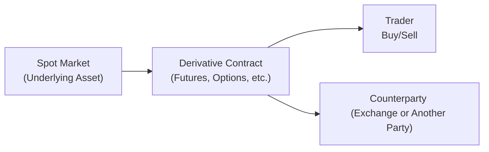

## 7.6 What Are Derivative Securities?

Have you ever found yourself wondering how some investors manage to ride the ups and downs of the market without too much stress? Or maybe you’ve seen headlines about people (and sometimes entire companies) taking big risks on complex financial instruments that few of us fully understand. Well, a lot of that behind-the-scenes action involves a category of products called derivatives.

In a nutshell, derivative securities get their name because their value is “derived” from something else—like a stock, bond, index, or even something more tangible like a commodity (think gold, oil, or wheat). Investors use these contracts for all kinds of strategies, from protecting themselves against adverse price movements (hedging) to betting on potential profit swings (speculating). As you might guess, that means derivatives can be powerful, but they can also be pretty risky if one doesn’t fully understand what’s going on.

For those of us involved in mutual fund sales, having a solid understanding of derivatives can help us better serve our clients, especially if they’re curious about funds that use these instruments to hedge currency risks or attempt enhanced returns. But keep in mind, there are rules (especially under the Canadian Investment Regulatory Organization—or CIRO, for short) about who can advise on these products. So, you’ll want to follow up with official CIRO materials to confirm proficiency requirements if you plan to delve deeper.

Let’s walk through the fundamentals. We’ll break down what derivatives are, the different types you might see, and how they’re commonly used. We’ll also explore where things can get dicey—because, yes, there’s definitely a downside. So buckle up, and let’s dive in!

--------------------------------------------------------------------------------

## Defining Derivative Securities

A derivative security is a contract that depends on, or is derived from, the performance of an underlying financial asset (like a stock or bond), a commodity (like gold or coffee beans), an index (like the S&P/TSX Composite Index), or a reference rate (like LIBOR or a currency exchange rate). When you buy or sell a derivative, you don’t necessarily take direct ownership of the underlying asset itself. Instead, you’re trading a contract that sets out future obligations or rights related to that asset.

### Why Do We Care About Derivatives?

• Hedge Against Risk: Investors use derivatives to protect themselves. For example, a mutual fund with huge international holdings might want to protect against currency fluctuations.  
• Speculate for Higher Returns: Derivatives can amplify returns—but they can also magnify losses.  
• Arbitrage Opportunities: Some traders look for price discrepancies between correlated markets.  
• Customizable Strategies: Derivatives let you do things that might be tricky or impossible using just the cash (spot) markets.

--------------------------------------------------------------------------------

## Major Types of Derivative Contracts

Even though there are many variations, you’ll hear four types of derivatives mentioned most often: forwards, futures, options, and swaps.

### Forward Contracts

A forward contract is perhaps the simplest form of derivative. It’s an agreement between two parties to buy or sell a certain asset (e.g., shares of a stock, a bond, or even an energy commodity) at a specified price on a specified future date.

• Over-the-Counter (OTC): Forwards typically trade privately over-the-counter, meaning they’re not standardized like futures.  
• Customizable: Parties can negotiate terms that best fit their needs, including the exact quantity, price, and delivery date.  
• Counterparty Risk: Because these contracts are private, there’s a risk that one party won’t fulfill their side of the bargain.

Imagine you’re a farmer worried about potential drops in wheat prices by the time harvest comes around. You enter a forward contract with a buyer who agrees to purchase your wheat at a set price in six months. Ahmad, a friend of mine who runs a small orchard, once tried something similar with apples to lock in a stable cash flow. If the market price goes down at harvest, you’re protected. If prices go way up, you’ve essentially missed out on additional gains—but at least you had certainty.

### Futures Contracts

Futures are the standardized cousins of forwards. When you trade a futures contract on a regulated exchange (such as the Montréal Exchange in Canada), all the important terms (quantity, quality, settlement dates) are standardized so everything is uniform. 

• Clearinghouse Involvement: The exchange usually acts as the middleman, reducing counterparty risk.  
• Highly Regulated: Strict rules apply, and daily settlement (margin calls) ensures traders maintain sufficient funds.  
• Standardization: From the type of asset to contract size and maturity dates, everything is spelled out.

Futures contracts can be used for speculation or hedging. Let’s say you hold a big portfolio of bonds and suspect interest rates might climb in the near future (which usually causes bond prices to drop). By shorting bond futures, any price drop in your portfolio might be offset by gains in your futures position.

### Options

Options give the buyer the right—but not the obligation—to buy (call option) or sell (put option) an underlying asset at a specific price (the strike price) within a set timeframe. If you buy the option, you can decide later whether or not you actually want to exercise it.

• Call Option: Gives the holder the right to buy the underlying at the strike price.  
• Put Option: Gives the holder the right to sell the underlying at the strike price.  
• Buyer vs. Seller: As a buyer, your risk is limited to the premium you pay. As a seller (writer), you collect the premium but potentially face much larger losses.

People often use options for hedging. For instance, if you own a stock and fear a potential drop in its price, you might buy a put option to protect against downside risk. It’s sort of like purchasing insurance for your portfolio. 

Mathematically, the payoff of a call option at maturity can be expressed as:


\text{Call Option Payoff} = \max(S_T - K, 0) \,,


where \\( S_T \\) is the underlying’s price at expiration and \\( K \\) is the strike price. Meanwhile, a put option’s payoff is:


\text{Put Option Payoff} = \max(K - S_T, 0) \,.


### Swaps

Swaps are agreements to exchange sets of cash flows over time. Often, these are interest rate swaps or currency swaps. With an interest rate swap, for example, one party might pay a fixed rate while receiving a floating rate (tied to a reference like the prime rate) from another party.

• Interest Rate Swaps: Common for managing interest rate risk, often between companies or financial institutions.  
• Currency Swaps: Allow entities to exchange principal and interest in different currencies, managing foreign-exchange risk.  
• Credit Default Swaps: A form of insurance against bond or loan defaults (though these garnered plenty of negative headlines during the 2008 financial crisis).

Swaps, like forwards, are often traded over-the-counter, which means standardization is less prevalent, and counterparty risk is something participants closely track.

--------------------------------------------------------------------------------

## How Mutual Funds Might Use Derivatives

While many mutual funds stick to more traditional assets (like stocks or bonds), some funds employ derivatives to manage risk or, occasionally, to try and enhance returns:

• Currency Hedging: A Canadian fund invested in U.S. equities might use currency forwards to lock in exchange rates, thus reducing exposure to foreign-currency swings.  
• Covered Call Writing: Some equity-based funds sell (or “write”) call options on stocks they own to generate extra income, with the trade-off that they may have to sell the stock if its price rises above the strike.  
• Interest Rate Hedging: Bond funds sometimes use interest rate futures or swaps to reduce sensitivity to rising or falling rates.  

Often, these strategies aim to manage volatility or mitigate certain market exposures. However, it’s crucial for fund representatives to clarify that derivatives carry their own set of complexities and risks. For more details on how mutual funds use derivatives in practice, see the discussion around conservative and riskier mutual fund products in Chapters 11 and 12, respectively.

--------------------------------------------------------------------------------

## The Regulatory Landscape in Canada

### CIRO (Canadian Investment Regulatory Organization)

Effective January 1, 2023, the Mutual Fund Dealers Association of Canada (MFDA) and the Investment Industry Regulatory Organization of Canada (IIROC) amalgamated into a new self-regulatory organization, renamed the Canadian Investment Regulatory Organization (CIRO) on June 1, 2023. CIRO now oversees mutual fund dealers, investment dealers, and trading on Canada’s equity and debt marketplaces. 

If you’re a dealing representative (for example, working at a mutual fund dealer) and you want to advise on or conduct trades in derivative products, you generally need additional proficiency and licensing. CIRO sets out the requirements, which are designed to ensure that representatives have the knowledge needed to handle these products responsibly.

### Clearing and Exchanges

• Montréal Exchange (https://www.m-x.ca/) is Canada’s major exchange for futures and options on equities, indexes, and interest rates.  
• Clearinghouses (like the Canadian Derivatives Clearing Corporation) manage settlement and mitigate risks by standing in the middle of trades, collecting margin, and ensuring contractual obligations are met.

### Canadian Investor Protection Fund (CIPF)

CIPF is Canada’s sole investor protection fund (after merging with the MFDA IPC). It is separate from CIRO but protects client assets if a member firm becomes insolvent. Still, keep in mind that CIPF provides limited coverage; it doesn’t protect you if your derivatives trade goes sour. It’s more about ensuring your assets remain safe if your investment dealer or mutual fund dealer fails financially.

--------------------------------------------------------------------------------

## Practical Example: Hedging with Currency Futures

Let’s say you’re the manager of a Canadian mutual fund primarily investing in European stocks. You’re concerned that the CAD/EUR exchange rate might move against you, eroding returns for Canadian investors. To hedge this currency risk, you can enter into a futures contract to sell the euro forward—locking in an exchange rate.

If the euro depreciates in value relative to the Canadian dollar, gains on the futures contract can offset part (or all) of your losses due to currency moves. If the euro appreciates, the position on the futures contract will suffer a loss, but the fund’s holdings in European equities might see a corresponding boost in CAD value, potentially neutralizing the overall currency effect.

--------------------------------------------------------------------------------

## A Look at the Flow of a Derivative Transaction

Here’s a simplified visual of how a derivative transaction might look, from the underlying asset market to the eventual buyer and seller.

Explanation of the Diagram:  
• Node A represents the actual market for the underlying asset (e.g., shares of a company).  
• Node B is where the derivative contract is created or traded (it can be standardized via an exchange or customized OTC).  
• Node C is the trader who decides to buy or sell the derivative contract.  
• Node D is the counterparty (another trader or a clearinghouse) who takes the opposite side of the trade.

--------------------------------------------------------------------------------

## Risks and Rewards of Using Derivatives

### Risk Amplification

For smaller amounts of capital, you can control a large position in the underlying asset through derivatives. If things go your way, that can yield big returns. But if the market moves against you, losses can pile up fast.  

### Counterparty Risk

For OTC contracts like forwards and swaps, you rely on the other party to make good on their obligation. If they fail (in finance-speak, we call it “default”), you could be left high and dry.

### Liquidity Risk

Not all derivatives are equally liquid. Standardized contracts on major exchanges (like the Montréal Exchange) usually have decent liquidity, but a customized forward might be tough to exit without the cooperation of the other party.

### Regulatory Oversight and Complexity

Regulations around derivatives can be intricate. In Canada, CIRO has set proficiency requirements for dealing representatives. Some mutual fund reps might not be authorized to advise on derivatives. If your client invests in mutual funds that use derivatives, it’s still vital to understand how derivatives could influence the fund’s volatility or returns—even if you’re not the one directly handling the derivative transaction.

--------------------------------------------------------------------------------

## Best Practices and Common Pitfalls

• Understand Your Product Limits: Don’t advise on derivatives if you aren’t fully accredited or licensed for them.  
• Ask Why: Make sure there’s a clear rationale for using the derivative—hedging, income generation, or speculation.  
• Keep Margin in Mind: Futures traders must post margin. If large market swings occur, margin calls can force you to pony up more cash.  
• Watch Your Leverage: You can achieve big market exposure with minimal initial outlay, so get comfortable with how leverage risk might snowball.  
• Communicate with Clients: If a mutual fund includes derivatives, consider how that might affect the client’s risk tolerance and goals.  
• Stay Curious: Markets evolve. Regulations change. Derivative products and strategies keep popping up. So ongoing education helps you remain informed.

--------------------------------------------------------------------------------

## A Brief Personal Take

I remember the first time I ventured into derivatives personally—a small foray into call options on a Canadian financial stock. I was sure I had done the math, but wow, once that market started moving the other way, it felt like I had jumped on a roller coaster with no seatbelt. The best lesson? Don’t dip your toe in derivatives without really knowing the water temperature. 

--------------------------------------------------------------------------------

## Additional Resources and References

• CIRO Website: [https://www.ciro.ca](https://www.ciro.ca) (Check here for proficiency and licensing requirements in Canada.)  
• Montréal Exchange: [https://www.m-x.ca/](https://www.m-x.ca/) (Detailed product specs and educational resources.)  
• “Options, Futures, and Other Derivatives” by John C. Hull (One of the industry’s go-to textbooks for in-depth analysis.)  
• Canadian Derivatives Clearing Corporation: [https://www.cdcc.ca/](https://www.cdcc.ca/) (For info on clearing and settlement processes.)  
• Securities Commissions (e.g., OSC, AMF, BCSC) for local regulations and guidelines.

--------------------------------------------------------------------------------

## Glossary

• Derivative: A financial instrument whose value is dependent on the performance of another asset or index.  
• Futures Contract: A standardized contract obligating buyer or seller to transact at a future date and price, cleared through a regulated exchange.  
• Forward Contract: Often an over-the-counter agreement to buy or sell an asset at a predetermined price on a set date.  
• Option (Call/Put): Provides the holder the right, but not the obligation, to buy or sell the underlying asset at a specific strike price.  
• Swap: A derivative where parties exchange financial instruments or cash flows (e.g., interest rate swap).  
• Hedging: A protective strategy to offset or reduce unwanted risk exposure.  
• Speculation: Taking on higher risk in the hope of achieving greater returns.

--------------------------------------------------------------------------------

## Final Thoughts

Derivatives can be an incredible (and sometimes nerve-racking) addition to the financial toolkit. They can help investors manage risk more precisely and, for better or worse, deliver an opportunity for bigger gains—or losses. If you’re in mutual fund sales, remember that some funds might use derivatives under the hood. Knowing how these products work—even at a basic level—helps you explain to your clients why their returns might look the way they do. 

On the regulatory side, always verify the scope of your license under CIRO rules before offering advice involving derivatives. And if you’re intrigued by all of this, don’t be shy about seeking further education. After all, continuous learning is the name of the game in an industry that evolves as quickly as ours.

Stay curious, stay safe, and keep building your knowledge base. And if you decide to explore derivatives directly—well, consider proceeding with caution and maybe a healthy dash of humility. Good luck out there!

--------------------------------------------------------------------------------

## Boost Your Knowledge of Derivatives in Canada: Quiz



### Which statement best describes a key characteristic of derivatives?

- [x] Their value depends on the price or performance of another underlying asset.
- [ ] They always require physical delivery of the underlying commodity.
- [ ] They are only traded on regulated exchanges and never over-the-counter.
- [ ] They have no impact on risk management in a portfolio.

> **Explanation:** By definition, a derivative security’s value arises from the movements in its underlying asset.  

### What is an important difference between forward contracts and futures contracts?

- [x] Futures contracts are standardized and traded on regulated exchanges, while forward contracts are privately negotiated.
- [ ] Forward contracts transfer no price risk, whereas futures contracts do.
- [ ] Futures contracts never involve margin calls, whereas forward contracts always do.
- [ ] Forward contracts are recognized by clearinghouses as standard instruments.

> **Explanation:** Forwards are private, customized agreements, while futures contracts are standardized and traded on regulated exchanges with clearinghouses that mitigate counterparty risk.  

### Which of the following describes the right (but not the obligation) to sell an underlying asset at a specified price?

- [x] A put option.
- [ ] A call option.
- [ ] A forward contract.
- [ ] An interest rate swap.

> **Explanation:** A put option grants the contract holder the right to sell, whereas a call option grants the right to buy.  

### In a currency swap, what are the main elements typically being exchanged?

- [x] Principal and interest payments in different currencies.
- [ ] Only shares of a single stock for another.
- [ ] Put and call options on different commodities.
- [ ] Exchange-traded futures contracts.

> **Explanation:** Currency swaps often involve exchanging principal and interest obligations in one currency for principal and interest obligations in another, helping manage foreign exchange exposures.  

### Which scenario best illustrates hedging with derivatives?

- [x] A Canadian mutual fund manager uses a currency forward contract to lock in a future exchange rate on U.S. dollars.
- [ ] A day trader buys call options on a mining stock hoping for a big payoff.
- [x] A wheat farmer enters into forward contracts to secure a fixed price for the next harvest.
- [ ] An investor deliberately uses margin on a volatile biotech stock to amplify returns.

> **Explanation:** Both the mutual fund manager using a forward contract to manage currency risk and the farmer fixing a future price for the crop are real-world hedging examples.  

### Which of the following risks is associated with over-the-counter (OTC) derivatives?

- [x] Counterparty risk, since there's no central clearinghouse guaranteeing the trade.
- [ ] Zero risk, as OTC derivatives are always collateralized.
- [ ] No leverage risk, because OTC products cannot be leveraged.
- [ ] Guaranteed profit, since OTC pricing is less transparent.

> **Explanation:** Counterparty risk is a major factor in OTC contracts, as there's no regulated exchange clearing system standing between the two parties.  

### When a mutual fund sells call options on stocks it already holds, it is typically called:

- [x] Covered call writing.
- [ ] A naked call.
- [x] A hedged put.
- [ ] A convertible bond strategy.

> **Explanation:** The strategy of selling call options on a stock that the fund already owns is referred to as a “covered call,” commonly used for generating extra income on held positions.  

### Which of the following organizations emerged in 2023 and now oversees Canadian mutual fund dealers and investment dealers?

- [x] The Canadian Investment Regulatory Organization (CIRO).
- [ ] The Canadian Derivatives Clearing Corporation.
- [ ] The Mutual Fund Dealers Association (MFDA).
- [ ] The Investment Industry Regulatory Organization of Canada (IIROC).

> **Explanation:** CIRO was formed from the amalgamation of the MFDA and IIROC, becoming the national self-regulatory body effective June 1, 2023.  

### Why might a mutual fund specializing in foreign markets use derivatives?

- [x] To hedge currency exposures and protect returns.
- [ ] To completely eliminate price risk across all holdings.
- [ ] To avoid diversification in its portfolio.
- [ ] To ensure it never has to follow CIRO regulations.

> **Explanation:** Funds with foreign investments often hedge currency risks using derivatives like futures or forwards. This helps protect returns from adverse exchange rate movements.  

### A call option gives the holder the right to buy the underlying asset. True or False?

- [x] True
- [ ] False

> **Explanation:** A call option allows its holder to buy the underlying asset at the strike price before or at expiration, but it's not an obligation.  


