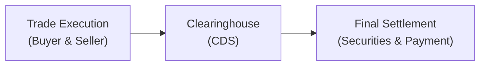

## 7.6 Additional Topics Related to Trading Process and Market Infrastructure

It’s funny—when I first heard someone say, “I’m shorting the market!” I thought they were talking about running out of time. Little did I know it referred to borrowing shares in anticipation of price declines. That’s how often trading jargon can confuse us, right? Anyway, in this section, we’ll explore several components that shape Canada’s trading processes and market infrastructure, shedding light on how securities get from one person’s portfolio to another. We’ll talk about where transactions take place (exchanges vs. OTC), how they settle (clearing and settlement), techniques like short selling, and the roles of key players such as market makers. We’ll also hop into the world of electronic trading and how technology has changed the game. By the end, you’ll have a well-rounded command of how securities trading works in Canada, with a few references to international frameworks for good measure.

---

### Exchanges vs. Over-the-Counter (OTC)

In Canada, securities can trade either on centralized exchanges or over-the-counter (OTC) markets. If you’ve skimmed through previous chapters in this book, you might recall that many common equity securities trade on the Toronto Stock Exchange (TSX), while derivative products like stock options and index futures often trade on the Montréal Exchange. Let’s break down the main differences between exchanges and OTC venues.

• Centralized Marketplaces  
  Exchanges provide a “meeting place” where buyers and sellers gather (virtually, these days) to trade securities under standardized protocols. The TSX, for instance, is known for enhanced transparency and liquidity because all orders are funneled into a single or central network. When you buy shares of a company listed on the TSX, those orders are matched on an electronic order book.

• Price Transparency and Standardization  
  On a regulated exchange, prices are published, and all participants can see bid and ask quotes. It’s a bit like an online marketplace for secondhand goods, except with a lot more regulation, compliance, and structure. Because exchange-traded securities are standardized, you usually know exactly what you’re getting.

• Over-the-Counter and Customization  
  The OTC market, by contrast, can handle unique or customized transactions—these might be large block trades between institutions or specialized derivative contracts with terms tailored to particular needs. OTC trading can offer flexibility but often comes with higher counterparty risk. When you do an OTC trade, you rely more on the creditworthiness of the other party (unless there’s some additional form of guarantee in place).

• Regulations and Oversight  
  Both exchanges and OTC markets in Canada fall within the purview of Canadian securities commissions and the Canadian Investment Regulatory Organization (CIRO). Although exchanges must comply strictly with listing and operating rules, OTC markets, given their more contractual, bilateral nature, may be subject to additional regulatory scrutiny concerning reporting and risk management. The key is ensuring investors understand any extra risk and complexity they face when trading OTC.

---

### Clearing and Settlement

Let’s say you just bought 100 shares of your favorite Canadian bank on the TSX. It’s easy to assume your transaction begins and ends the moment you click “Buy.” Actually, your trade initiates a back-end process known as clearing and settlement. This process is crucial to ensure that you receive the shares you purchased and the seller receives the correct payment—without undue risk to the system.

• The Canadian Depository for Securities (CDS)  
  In Canada, clearing and settlement of most securities trades pass through The Canadian Depository for Securities (CDS). CDS acts as the official record keeper, ensuring that all executed trades settle correctly. They effectively mark “You owe money for 100 shares,” or “You owe 100 shares to this buyer,” and then finalize the process.

• Minimizing Systemic Risk  
  Perhaps the most important role of a clearinghouse (in Canada, CDS) is mitigating the risk that one party defaults between trade execution and settlement. By becoming the central counterparty, the clearinghouse guarantees transactions and netting, so that only net obligations are settled.

• Settlement Cycle  
  Common equities in Canada typically settle on T+2 (trade date plus two business days). This means if you buy shares on Monday and everything runs smoothly, your deal fully finalizes on Wednesday. However, there are exceptions, especially for derivatives or certain debt products, which may have different settlement timelines.

Below is a simple diagram showing the clearing and settlement flow:

In this diagram, once the buyer and seller agree on terms, the clearinghouse (CDS) stands in the middle to organize the ultimate exchange of securities and money. Because of that middleman approach, the buyer and seller often never directly interact with each other’s funds or shares.

For in-depth details on how trades are cleared in Canada, you can check out cds.ca.

---

### Short Selling

Ah, short selling—this is where, you know, I initially got confused about “shorting the market” and ended up diving deep into margin rules. Short selling is a strategy in which an investor borrows shares from a broker (who holds them in inventory or locates them from other clients’ holdings). The investor then sells these borrowed shares in the open market, hoping the price drops. Later, the investor aims to buy the same shares back at a lower price, return them to the broker, and pocket the difference as profit.

• Regulatory Requirements and Market Transparency  
  In Canada, short selling is subject to certain reporting and transparency rules. CIRO enforces guidelines to ensure short positions do not lead to manipulative trading. Traders must often mark orders as “short” when submitting them, so the regulators and the market can track short-selling activity.

• Margin Constraints  
  Because short selling involves borrowing shares, short sellers maintain a margin account to post collateral in case share prices rise instead of fall. This margin requirement is critical: if the stock’s price jumps too high, the broker can issue a margin call, requiring the short seller to add more capital or close out the position.

• Risks and Rewards  
  The main attraction is that, if the security’s value decreases, you can profit from buying it back at a lower price. But the risk is theoretically unlimited because a stock’s price could climb indefinitely. So it’s not exactly for the faint of heart. As part of good practice, short sellers watch their positions closely or place stop orders to mitigate potential losses.

On the compliance side, remember to review any relevant guidelines around short selling from CIRO (ciro.ca) and keep in mind that institutional investors often need advanced approvals for large short positions. You can also see the “Margin Accounts” topic in Chapter 8.2 of this text for more detail on how margin borrowing works in tandem with short sales.

---

### Role of Market Makers

If you’ve ever traded a thinly traded stock, you might have noticed how the bid-ask spread can be super wide. That’s precisely where market makers step in. Market makers, sometimes referred to as liquidity providers, are entities mandated (often through contractual obligations with an exchange) or incentivized (via rebates or reduced transaction fees) to maintain a two-sided market by continuously placing buy orders (bids) and sell orders (asks) in the order book.

• Better Liquidity  
  By doing so, they “grease the wheels” of trading, enabling investors to enter and exit positions more easily and at fairer prices. It’s like attending a yard sale where someone volunteers to buy items that otherwise wouldn’t sell. That helps people who want to make a sale but can’t find a buyer.

• Profit from the Spread  
  Market makers earn money from the bid-ask spread—the difference between the price at which they buy (bid) and sell (ask).

• Regulation and Monitoring  
  CIRO sets rules to ensure these market participants do not abuse their position through manipulative tactics. Market maker arrangements also vary by exchange. For instance, some equity securities and many exchange-traded funds (ETFs) rely heavily on designated market makers to maintain a liquid, orderly market.

---

### Electronic Trading and Impact of Technology

It’s practically impossible to talk about modern markets without acknowledging the technological revolution. No longer do we see those cinematic scenes of frantic pit traders waving their arms and yelling orders; trading floors in many places are silent or replaced by electronic systems.

• High-Frequency Trading (HFT)  
  High-frequency traders use algorithms that react to market conditions in fractions of a second. They might place and cancel thousands of orders per second, looking for fleeting price differentials or liquidity imbalances. While HFT can boost liquidity and sharpen spreads, critics argue it may also amplify volatility or create unfair advantages for those with faster access.

• Algorithmic Strategies  
  Beyond high frequency, we have a variety of algorithmic trading strategies—think “VWAP” (Volume-Weighted Average Price) or “TWAP” (Time-Weighted Average Price) algos that automated systems use to execute large orders gradually and minimize market impact. These algorithms can split an order into smaller portions and release them to the market over time.

• Dark Pools and Alternative Trading Systems  
  There are also so-called dark pools or alternative trading systems (ATS) where major players can anonymously trade large blocks of shares without revealing their entire hand to the broader market. While this can help reduce market impact, some critics worry about transparency. In Canada, CIRO monitors these venues to balance competition and investor protection.

• Regulatory Considerations  
  Canada’s securities regulators and the Bank of Canada have been studying how algorithmic and high-speed trading affect market integrity. If you want to dig deeper, the Bank of Canada’s website offers research on how technology changes liquidity, price discovery, and overall systemic risk.

---

### Glossary

• Clearinghouse:  
  An intermediary (e.g., CDS in Canada) that stands between buyers and sellers, ensuring performance on trades or in a derivatives contract. By acting as the central counterparty, the clearinghouse reduces default risk.

• Settlement Date:  
  The date by which the buyer must pay for the securities, and the seller must deliver them. Often T+2 for Canadian equities.

• Margin Account:  
  An account that lets you borrow funds to buy securities or short sell, subject to margin requirements. See Chapter 8.2 for more details.

• Liquidity Provider:  
  Another term for market maker, an entity that supplies buy and sell quotes to ensure a certain level of trading volume and narrower bid-ask spreads.

---

### Best Practices, Common Pitfalls, and Strategies

When navigating trading and market infrastructure, a few best practices can keep you from falling into trouble:

• Conduct Thorough Due Diligence  
  Whether trading on an exchange or OTC, make sure you understand the product. Is it a straightforward equity or a complex derivative with unique terms?

• Mind Your Exposure  
  If you’re short selling, keep a close eye on open positions and market conditions. If the price spikes, you could face significant margin calls. 

• Leverage Technology Wisely  
  Algorithmic strategies can automate your trades, but they can also amplify errors if not properly tested or monitored. Even professional institutions occasionally get burned by “rogue algorithms” gone haywire.

• Stay Current with CIRO Rules  
  As of January 1, 2023, Canada’s national self-regulatory organization is CIRO, which oversees investment dealers, mutual fund dealers, and market integrity. Historically, IIROC and MFDA were separate SROs, but they merged to form CIRO. Always check ciro.ca for the most up-to-date rules on short selling, margin, or electronic trading guidelines.

• Understand the Clearing and Settlement Timeline  
  Don’t assume you can flip a position instantly if it’s not fully settled. If your account needs certain securities delivered or has a pending payment, factor in the settlement cycle to avoid trade rejections or settlement fails.

---

### References and Additional Resources

• CIRO – Canada’s current self-regulatory organization (ciro.ca)  
  Keep an eye on their guidelines, bulletins, and continuing education materials for emerging compliance issues around trading, short selling, or margin accounts.  

• CDS – The Canadian Depository for Securities (cds.ca)  
  Their website dives deeper into the intricacies of clearing, settlement, and depository services in Canada.  

• CIPF – Canadian Investor Protection Fund (cipf.ca)  
  Now the sole protection fund in Canada for investor accounts, offering coverage if a member firm becomes insolvent.  

• The International Organization of Securities Commissions (IOSCO) (iosco.org)  
  For a global perspective on market integrity and standard-setting in the securities world.  

• Bank of Canada – Financial System Research  
  The Bank of Canada publishes research on how algorithmic trading and high-frequency trading affect liquidity and financial stability.  

---

### Closing Thoughts

You’ve made it through a whirlwind tour of markets, short selling, clearinghouses, and plenty more. The next time you hear someone say, “I’m taking a short position,” you’ll not only know what they mean—you’ll understand the settlement mechanics, the margin account requirements, and how the whole system keeps humming behind the scenes. The path to truly grasping capital markets can feel like a big puzzle at first. But as you assemble each piece—exchanges, OTC, clearing, settlement, market makers, technology, regulation—you’ll see how they fit together to form Canada’s robust trading ecosystem.

It’s all about continuous learning. Keep your curiosity alive. After all, the markets are constantly evolving, and every day brings something new—maybe it’s a new technology or a regulatory tweak from CIRO. Stay open to updates, and keep refining your skill set. That’s really how you’ll thrive in this industry—and, well, hopefully keep things exciting.

---

## Mastering Market Infrastructure & Trading Processes: Your Essential Quiz



### Which entity stands as the central counterparty in Canada's clearing and settlement process?
- [ ] CIRO
- [ ] CIPF
- [x] The Canadian Depository for Securities (CDS)
- [ ] The Bank of Canada

> **Explanation:** CDS acts as the central clearinghouse, ensuring trades settle properly by standing between buyers and sellers.

### Which best describes an OTC trade?
- [ ] A standardized trade executed on a central exchange
- [x] A customized transaction directly between two parties
- [ ] A transaction only involving government bonds
- [ ] A trade executed by a high-frequency trading algorithm

> **Explanation:** Over-the-counter (OTC) trades are off-exchange and may be customized, often carrying higher counterparty risk.

### In a short sale, which of the following is TRUE about the investor’s position?
- [x] The investor borrows shares to sell, hoping to buy them back at a lower price
- [ ] The investor pays dividends on the borrowed shares
- [ ] The investor has unlimited profit potential and limited risk
- [ ] The investor faces zero margin requirements

> **Explanation:** Short sellers borrow shares, sell them, and then aim to repurchase at a lower price. Their risk is unlimited if the stock price rises significantly.

### Market makers primarily help markets by:
- [x] Providing continuous buy and sell quotes to maintain liquidity
- [ ] Restricting trading activity to reduce price fluctuations
- [ ] Imposing additional capital requirements on investors
- [ ] Eliminating the need for regulatory oversight

> **Explanation:** By offering both bid and ask prices, market makers reduce the bid-ask spread and enhance liquidity.

### Which is a key reason exchanges are considered more transparent than OTC markets?
- [x] Prices and quotes are displayed to all market participants
- [ ] Brokers do not charge commissions
- [x] All trades occur in secret “dark pools”
- [ ] They rely on manual phone orders for trade execution

> **Explanation:** Exchanges publish real-time quotes and trades, making them more transparent than OTC transactions, which are negotiated privately.

### What is the typical settlement cycle for common equities in Canada?
- [ ] T+1
- [x] T+2
- [ ] T+3
- [ ] T+5

> **Explanation:** Most Canadian equity trades settle on T+2, meaning two business days after the trade date.

### A high-frequency trading strategy is best described as:
- [x] An algorithm that rapidly executes and cancels orders to capture small price movements
- [ ] A manual strategy executed by a floor trader on the exchange
- [x] A long-term buy-and-hold approach focusing on dividends
- [ ] A strategy exclusively allowed by the Bank of Canada

> **Explanation:** High-frequency traders use automated, rapid-fire executions aiming to profit from minute price discrepancies.

### Why might an investor choose to execute a trade in a dark pool or ATS?
- [x] To hide large block orders and minimize market impact
- [ ] To eliminate the need for a clearinghouse
- [ ] Because dark pools require zero margin for short selling
- [ ] To make trades fully transparent to all

> **Explanation:** Dark pools allow traders to place large orders anonymously, reducing the immediate impact on price.

### Which regulator currently sets the rules regarding short selling and margin requirements in Canada?
- [ ] IIROC
- [ ] MFDA
- [x] CIRO
- [ ] CIPF

> **Explanation:** As of January 1, 2023, CIRO is Canada’s national self-regulatory organization, historically replacing IIROC and MFDA.

### True or False: The Canadian Investor Protection Fund (CIPF) covers losses from adverse market movements.
- [x] True
- [ ] False

> **Explanation:** CIPF protects client assets in the event of a member firm insolvency, but it does not insure against losses stemming from market price declines.


