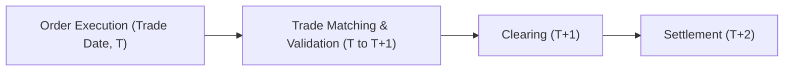
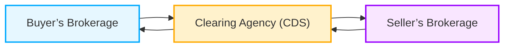

## 7.7 Trading and Settlement Overviews

**Introduction**  
Let’s say you’re buying shares of a well-known Canadian bank—maybe you’ve researched the security, read up on its financial strength (or used something like the fundamental analysis techniques from earlier chapters), and you decide, “Alright, it’s time to buy.” The moment you click that “Buy” button, do you ever wonder what happens behind the scenes? It’s a bit like ordering a fancy hardcover from an online bookstore: you place the order, your money eventually exchanges hands, and the seller ships the book. But in the world of stocks, bonds, derivatives, and yes—even mutual funds—things get slightly more elaborate.

Here, we’re going to unpack the trading and settlement process. We’ll explore how trades occur in the secondary market—on exchanges like the Toronto Stock Exchange (TSX) or in over-the-counter (OTC) environments—and follow the path of a trade from initiation to settlement. We’ll also look at how clearing agencies play a pivotal role by matching trades behind the scenes and ensuring everyone gets what they’re owed. Even if you’re primarily dealing with mutual funds and rely on fund managers or dealers’ back offices to process buy-and-sell orders, understanding how the broader securities market trades and settles is super-useful. Many of your clients might participate in a variety of asset classes, so you’ll have to field questions from all angles.

---

**Secondary Markets**  
When a security—such as a stock or a bond—has already been issued in the primary market, it then trades in the so-called secondary market. The secondary market is basically a vast ecosystem where existing securities exchange hands among investors. It’s where you see share prices change constantly based on investor sentiment, corporate news, economic data, and so on. If you buy a stock today, you’re purchasing it from somebody else who already owned it, not from the company directly.

While many trades occur on recognized exchanges like the TSX, you may also encounter OTC (over-the-counter) trades. OTC trades, especially for corporate and government bonds or certain derivatives, happen off-exchange, often facilitated by a network of dealers who negotiate deals among themselves or on behalf of clients. In either scenario, the main idea is that the buyer and seller come to an agreement on price and terms, and the actual details get recorded in the official system so it can be cleared and settled.

In Canada, these transactions fall under the regulatory oversight of the Canadian Investment Regulatory Organization (CIRO). Historically, we had the Mutual Fund Dealers Association of Canada (MFDA) and the Investment Industry Regulatory Organization of Canada (IIROC). But these two defunct SROs no longer exist independently, having amalgamated into CIRO on January 1, 2023. CIRO sets the rules for how trades should be executed and reported, emphasizing investor protection and fair market practices.

---

**The T+2 Settlement Cycle**  
If you hear someone say “The trade settles T+2,” that’s shorthand for “trade date plus two business days.” It means if you buy a stock on a Monday (assuming no holidays in between), you’d expect to pay for it—and receive the shares—by Wednesday. T+2 replaced what used to be a T+3 cycle in many markets, speeding up how quickly parties were required to finalize their trades.

The concept is pretty straightforward:  
• **T (Trade Date):** The day you agree on the price and execute the trade.  
• **T+1:** The next business day. Typically, matching and clearing instructions are confirmed in the system.  
• **T+2:** By the end of the second business day after the trade, the buyer’s money changes hands, and the seller’s securities are delivered.

Why does this matter? Well, for one thing, it minimizes the risk of something bad happening—like one side going bankrupt before settling the transaction. Shorter settlement cycles reduce “counterparty risk,” meaning less time passes where the buyer or seller might fail on their obligation. Also, many global markets (including the U.S.) are heading to an even shorter cycle (T+1). Canada, though, for now is primarily on T+2. However, it’s wise to keep an eye on regulatory changes, as the settlement cycle evolves to handle technology improvements and global harmonization efforts.

---

**The Role of Clearing Agencies**  
Clearing agencies act like the behind-the-scenes traffic cops and administrators of the securities market. In Canada, the main clearing agency is CDS Clearing and Depository Services (often just called “CDS”). Their job is to check that each trade is valid (i.e., both parties have the resources to fulfill their side of the bargain), match the details of the trade (price, quantity, time, etc.), and arrange for the actual exchange of securities and cash on settlement day.

Imagine you’re in a busy farmer’s market. The clearing agency is something like the central cashier that verifies each fruit or vegetable transaction between the buyer and vendor, ensuring that the produce is legitimate and the payment is appropriate. This reduces confusion if someone realized they’d thought they bought apples but ended up with oranges. CDS and similar institutions do this matching process on a huge scale every single day.

In essence, clearing agencies:  
• Maintain records of who owns which securities.  
• Match transactions between buyer and seller.  
• Guarantee settlement by ensuring each side is ready and able to deliver the promised cash or securities.  
• Mitigate risk by netting transactions and holding collateral from members to cover potential losses.

---

**Clearing and Settlement Flow**  
Let’s put this into a simple diagram to illustrate how a trade flows from execution to settlement:

- **Order Execution (Trade Date, T):** Buyer and seller negotiate price via an exchange or OTC scenario, and the trade is executed.  
- **Trade Matching & Validation (T to T+1):** Trade details (such as security identifier, quantity, and price) are confirmed, typically involving brokers, dealers, and the clearing agency.  
- **Clearing (T+1):** The clearing agency (CDS in Canada) confirms all the trade details are correct and that both sides can fulfill their obligations.  
- **Settlement (T+2):** The buyer delivers the cash, the seller delivers the securities, and ownership transfers in the official records.

---

**Trading and Settlement for Mutual Funds**  
Mutual funds occupy a slightly different space. Usually, you’re not buying shares of a mutual fund on a centralized exchange (unless it’s structured as an exchange-traded fund (ETF), but that’s a slightly different product). Instead, you submit a purchase or redemption order through a fund dealer or representative. The transaction is priced at the net asset value (NAV) calculated by the fund at the end of the day. The actual fund manager or the back-office system processes your transaction.

Even if you’re dealing primarily with mutual funds, it’s important to remember that the underlying securities that make up each mutual fund also trade and settle in the broader market. A bond fund, to manage portfolio composition, might purchase or sell bonds in the OTC market. Likewise, an equity fund might buy or sell shares on the TSX. While the representative might not see that entire chain of transactions, a deep familiarity with how securities settle can strengthen your ability to answer client questions, especially if they maintain multi-asset portfolios.

---

**Anecdote from a Former Rookie**  
I recall my first few weeks after becoming licensed to advise on mutual funds—yeah, talk about a whirlwind. One day, a client emailed me, asking why their account reflected a cash balance for two days before actually showing the newly purchased shares. My reaction was something like, “Um, can I get back to you in five minutes?” Once I realized it was all about the settlement timeline (the T+2 concept), I discovered that having a grasp on these market mechanics not only made me look more professional, but it also allowed me to talk clients through the step-by-step process so they weren’t left scratching their heads. The conversation went from confusion to clarity, because I could walk them through the standard timeline for purchase and settlement in plain language.

So if a client ever wonders, “Why didn’t my shares show up instantly?” you can calmly explain T+2. From personal experience, this helps clients feel more comfortable and confident in the process (and in you).

---

**Exchanges vs. OTC Markets**  
We briefly touched on this earlier, but it’s worth highlighting:  
- **Exchange-Traded Securities**: These are often stocks listed on the TSX or other recognized exchanges. Trades are typically executed through broker-dealers connected to the exchange’s electronic trading system. The exchange sets listing standards for companies, fosters price discovery with centralized order books, and ensures that trades follow regulations that protect investors.  
- **OTC (Over-the-Counter) Securities**: Often includes government bonds, corporate bonds, certain derivatives, and even smaller or specialized equities. There’s no centralized physical or electronic “exchange” matching the trades. Instead, you have a network of dealers, each quoting prices to potential buyers and sellers. Brokerage firms negotiate directly with each other or on behalf of their clients. Clearing and settlement on T+2 is still common, but the actual trade negotiation process differs because it lacks a single, centralized marketplace.

In both systems, once the trade is done and reported, it moves through clearing and settlement—just the manner in which the price is discovered or negotiated differs.

---

**Key Regulatory Considerations**  
Regulations in Canada ensure that trades are accomplished in a fair, transparent manner and that they settle promptly. CIRO has rules about how registered dealers and advisors must handle client trades, keep records, and manage client assets. If you want the nitty-gritty, you can check out [CIRO’s official website](https://www.ciro.ca) for the latest guidelines. They regularly update bulletins on trade execution, best execution practices, and client disclosures, so it’s a good habit to keep an eye on their updates.  

Additionally, the Canadian Investor Protection Fund (CIPF) now serves as the single investor protection fund that safeguards eligible client assets, should a CIRO member dealer become insolvent. Knowing about CIPF is often reassuring for clients because it underscores how their investments (like a mutual fund position) are protected if the brokerage firm itself fails. CIPF remains independent from CIRO, but coverage is limited to specific types of accounts and assets, so it pays to understand those details when chatting with clients.

---

**Best Practices for Managing Settlement**  
• **Communicate Timelines to Clients:** Whenever you execute a trade or put in an order, remind the investor that settlement might take a couple of business days. Setting proper expectations upfront usually avoids confusion.  
• **Track Settlement Cash Flow:** For those who plan to reinvest or move proceeds into another investment, keep in mind that the actual cash from a sale won’t typically be “officially” available until settlement.  
• **Coordinate Multi-Asset Portfolios:** Clients sometimes trade individual stocks, bonds, and mutual funds concurrently. Understanding different settlement timelines helps you schedule trades effectively.  
• **Stay Alert to Future Regulatory Changes:** The global trend is moving toward shorter settlement cycles, so watch for announcements in Canada that might shift T+2 to T+1. If that happens, your processes and documentation might need to adapt quickly.

---

**Common Pitfalls**  
• **Misunderstanding Settlement Date vs. Trade Date:** Make sure you know that the settlement date is when the regulatory and capital changes occur, while the trade date is just the day you locked in your purchase or sale.  
• **Forgetting About Funds’ NAV Timing:** With mutual funds, the purchase or sale price is often the end-of-day NAV. This might differ drastically from a real-time price you see in the market for an exchange-traded product, so clients may be surprised if they don’t fully understand the difference.  
• **Insufficient Funds on Settlement:** If a client’s account doesn’t have enough cash by T+2 (for a purchase) or short shares aren’t delivered by the settlement date (in the case of short selling equities), it leads to a “failure to settle.” That can incur extra costs or penalties.  
• **Not Factoring in Holidays or Different Time Zones:** Trading is global these days. Make sure you know if a holiday changes your settlement schedule or if your security has cross-border listings that come with unique settlement rules.

---

**Illustrating Trading and Settlement with a Flow of Funds**  
Below is another high-level flowchart summarizing how funds typically move among buyer, seller, and the clearing agency. While the actual mechanics can be more complicated for large institutional trades, the fundamentals remain the same for most participants.

1. **Buyer’s Brokerage** confirms it has sufficient funds from the buyer.  
2. **Clearing Agency (CDS)** matches the trade details and ensures the buyer’s broker and seller’s broker are in agreement.  
3. **Seller’s Brokerage** confirms it holds the appropriate securities.  
4. On settlement day (T+2), cash flows from the buyer (through the clearing agency) to the seller, and securities flow from the seller (through the clearing agency) to the buyer.

---

**Real-World Example: Buying RBC Stock**  
To make this super concrete, suppose on Monday morning you decide to buy 100 shares of RBC (Royal Bank of Canada). Your purchase is executed at $130 per share, for a total trade of $13,000 (ignoring commissions for simplicity).

- **Trade Date (T = Monday):** You place and execute the trade at $130/share.  
- **Broker Confirms Trade:** By the end of Monday or early Tuesday, the broker’s back office ensures that details match what RBC’s seller is offering.  
- **Settlement Date (T+2 = Wednesday):** By Wednesday, $13,000 is withdrawn from your account, and RBC shares appear in your portfolio. Your broker and RBC’s seller finalize everything through CDS. If you check your account early Wednesday, the shares might still be in the “settling trades” column, but by end of day, you officially own them.

If you want to sell these RBC shares on Tuesday (the day after you bought them), you can typically do so. But keep in mind that just because you can sell them doesn’t necessarily mean the original first trade has settled. The two trades could offset or net out in your account from the standpoint of your broker, but behind the scenes, the clearing agency keeps track to ensure no chaos ensues.  

---

**Global Comparisons**  
Many countries have either moved to T+2 or are transitioning to even shorter cycles (like T+1 or T+0). The United States is now adopting T+1 for many equity transactions. This is crucial if you have clients who invest cross-border because their trades in Canadian securities might still follow T+2 while their U.S. trades settle T+1. Some markets in Asia already operate on T+2 or T+1. So, it can get a bit complicated if you or your clients deal in multiple markets. Always be mindful of the rules related to each jurisdiction.

---

**Trading and Settlement for Derivatives**  
A quick note on derivatives—options, futures contracts, etc.—they may have specialized clearing processes (in Canada, for instance, the Canadian Derivatives Clearing Corporation (CDCC) handles many exchange-traded derivatives). The settlement cycles can vary. For instance, an option on a stock typically has its own settlement rules (like T+1 for option exercises in some cases). If you’re mainly dealing with mutual fund products, you might not see this daily, but it’s worth knowing the bigger picture, especially if a client’s broader portfolio includes derivatives.

---

**Why This Matters for Mutual Fund Representatives**  
Though your main activity might be selling or giving advice on mutual funds, it pays to understand how the rest of the market trades. Here’s why:

• **Multi-Asset Strategies:** Some mutual fund investors also hold direct equities, bonds, or derivatives. You’ll look more credible if you can address how those settle or at least direct them to the proper resources.  
• **Client Service Questions:** Clients might want to time the sale of a mutual fund with the purchase of an ETF or vice versa, so knowledge of settlement timing is key for planning.  
• **Coordinated Portfolio Rebalancing:** If a client is selling a bond mutual fund to buy an equity mutual fund, you need to know how long it’ll take for the proceeds to be available, especially if the client’s liquidity is time-sensitive.

---

**Practical Tips and Strategies**  
• **Set Calendar Reminders:** If your trading volume is high, keep track of settlement dates with a simple spreadsheet or your CRM software so you or your client doesn’t face unexpected delays.  
• **Explain in Plain Language:** When clients get confused about settlement vs. trade date, break it down into everyday examples—like buying a product online.  
• **Stay Informed via CIRO:** CIRO’s bulletins and notices are invaluable for staying on top of new settlement or clearing procedures.  
• **Leverage Tools and Technology:** Most brokerages provide online dashboards where settlement statuses are visible. Encourage clients to check these dashboards rather than panicking if they don’t see immediate finalization.

---

**References and Further Reading**  
• **[CIRO](https://www.ciro.ca)** – Canada’s self-regulatory organization. Check their resources and bulletins for the latest on trading, clearing, and settlement rules.  
• **[CDS Clearing and Depository Services](https://www.cds.ca/)** – For official information on the clearing and settlement processes in Canada.  
• **“Settlement and Custody” by David Loader** – A thorough text for understanding global settlement structures, including Canadian frameworks.  
• **Open-Source Tools** – While not as common in retail finance, some open-source portfolio trackers have basic settlement cycle parameters you can customize. Tools like Python’s QuantLib library can incorporate settlement date calculations for complex strategies.

---

**Conclusion**  
Trading is a symphony of bids, asks, confirmations, and final settlements. Even if you don’t deal directly with the nitty-gritty of clearing, having a big-picture grasp of what’s happening ensures you can address client queries with confidence. After all, the journey from “I want to buy stock XYZ” to “Those shares are officially mine” is the backbone of investing.  

And hey, if you sometimes catch yourself wondering, “Wait, why does it take two business days to finalize an electronic transaction when so much else is instant?”—well, you’re not alone. But it’s all part of making sure every party is protected and every detail is properly aligned. Knowing the T+2 cycle, the role of CDS, and the differences between mutual fund vs. equity settlement can give you a solid foundation for guiding clients in Canada’s vibrant (but carefully regulated) financial marketplace.

Always keep learning, stay updated on regulatory shifts, and be ready for potential transitions to a T+1 environment soon. Your clients will appreciate how fluidly you navigate these complexities on their behalf.

---

## Test Your Knowledge: Canadian Trading and Settlement Best Practices



### When a stock is traded on Monday under a T+2 settlement cycle, on which day is the trade typically settled? 
- [ ] Friday
- [ ] Tuesday
- [x] Wednesday
- [ ] Thursday

> **Explanation:** T+2 means “trade date plus two business days.” If the trade date is Monday, and there aren't any holidays, Wednesday is two business days later.

### Which organization in Canada is primarily responsible for clearing and settlement services?
- [ ] CIRO
- [x] CDS Clearing and Depository Services
- [ ] CIPF
- [ ] Bank of Canada

> **Explanation:** CDS Clearing and Depository Services is the main clearing agency that validates, matches, and confirms trade details, then ensures settlement.

### What is the main difference between exchange-traded and OTC-traded securities?
- [ ] OTC trades settle faster than exchange-traded ones.
- [ ] Exchange trades never go through a clearing house.
- [x] Exchange trades occur on a centralized platform, while OTC trades happen via a decentralized dealer network.
- [ ] OTC trades are always risk-free.

> **Explanation:** Exchanges provide a centralized marketplace and order book, whereas OTC trading is negotiated directly between parties or via intermediaries without a central order book.

### True or False: T+2 settlement reduces the counterparty risk compared to longer settlement cycles.
- [x] True
- [ ] False

> **Explanation:** Shorter settlement times reduce the period during which either party might default on the transaction, thereby lowering counterparty risk.

### If a client sells a mutual fund and immediately buys an ETF on the same day, which of the following statements is most accurate?
- [x] The mutual fund redemption may take longer to completely settle, potentially affecting the ETF purchase.
- [x] The ETF purchase has a real-time market price, while the mutual fund uses end-of-day NAV pricing.
- [ ] Both transactions follow T+5 settlement cycles.
- [ ] There will be no mismatch in settlement timelines.

> **Explanation:** Mutual fund redemption uses end-of-day NAV and may settle differently from ETF trades, which execute in real time on the exchange and settle on T+2.

### Which of the following best describes the role of CIRO in Canada’s financial markets?
- [x] It is the national self-regulatory body overseeing investment dealers, mutual fund dealers, and market integrity.
- [ ] It is Canada’s central bank.
- [ ] It is Canada’s primary clearing agency.
- [ ] It is responsible for issuing government bonds.

> **Explanation:** After the amalgamation of the MFDA and IIROC, CIRO now oversees dealer and marketplace regulations. It is not a clearing agency or a central bank.

### Which scenario is most likely to cause a “failure to settle”?
- [x] The buyer does not have sufficient funds in their account on T+2.
- [ ] The trade is executed on an exchange.
- [x] The seller cannot deliver the agreed securities on T+2.
- [ ] The trade is supported by a clearing agency.

> **Explanation:** Settlement fails if either the buyer can’t provide the cash or the seller can’t provide the securities by the specified settlement date.

### What is the key reason for having clearing agencies like CDS?
- [ ] To eliminate the need for broker-dealers.
- [ ] To increase the settlement timeline.
- [x] To validate trades, reduce counterparty risk, and manage the exchange of securities and cash.
- [ ] To invest client assets in money market instruments.

> **Explanation:** Clearing agencies ensure that trade details are correct and facilitate the actual exchange of cash and securities, reducing overall market risk.

### Under which circumstances might an investor see a delay reflecting purchased mutual fund units in their account?
- [x] Mutual funds use end-of-day NAV and the settlement process can take more than one business day.
- [ ] Mutual fund units settle instantly upon purchase.
- [ ] T+2 only applies to equities.
- [ ] CIPF must individually approve all mutual fund purchases.

> **Explanation:** Mutual fund transactions rely on the end-of-day net asset value to price purchases or redemptions, and the back office processes typically take additional time to finalize.

### True or False: CIPF coverage is designed to protect investors if a member dealer becomes insolvent.
- [x] True
- [ ] False

> **Explanation:** CIPF (now the single investor protection fund in Canada) safeguards client assets within set limits, but it doesn’t cover investment losses due to market fluctuation.


