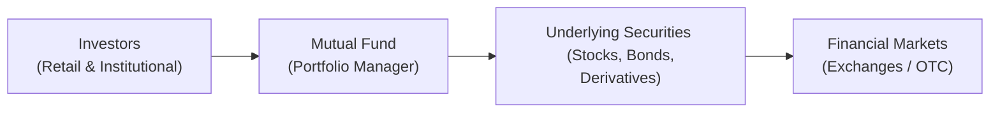

## 7.8 Summary and Application

Investing can sometimes feel like walking into a giant buffet—you see countless offerings, each with unique flavors (or, in our case, risk-return profiles). Maybe you’ve got a friend who’s a bond devotee and another who loves equity IPOs. Or you might even encounter that adventurous colleague who’s all about derivatives. In the Canadian marketplace, it’s essential to know how these products are introduced and regulated, particularly if you’re the person serving them up to your clients.

Below, we bring everything together. You’ll see why understanding fixed-income, equity, and derivative products isn’t just about memorizing definitions or formulas. It’s about applying that knowledge in real-world scenarios—where risk tolerance, time horizon, and overall suitability for your client help you figure out which items on the buffet line make the best plate.

---

### Reflections on Key Product Types

It’s easy to get bogged down in details when you’re covering everything from bonds to call options. A quick recap:

• Bonds (Fixed Income): Often seen as the “salt of the earth” in an investment portfolio—stable, predictable interest payments, but definitely not risk-free. Credit risk, interest-rate risk, and even currency risk (for foreign issues) can lurk if you’re not careful.

• Stocks (Equities): Growth potential can be quite exciting, but volatility can keep you—or your clients—up at night. Equity investments may provide dividends, capital appreciation, and a sense of ownership in a company’s success (or disappointment).

• Derivatives: Options, futures, swaps. They can be powerful tools for risk hedging or speculation, but let’s face it—everyone’s heard horror stories of heavy losses from the misuse of leverage. In Chapter 7, we looked at how these products come to market, the structures in place to trade them, and the oversight that helps keep them fair and transparent.

From a portfolio construction perspective, each of these product groups plays a role. The exact composition depends on your client’s objectives and risk profile.

---

### The Importance of Product Knowledge

As a mutual fund sales representative or advisor, it’s easy to say “I focus on funds, so I don’t need deep knowledge of stocks, bonds, or derivatives.” Actually, you do. A mutual fund can hold any combination of these securities, and your client might ask, “So, how do these things actually work?” That’s where your expertise shines.

• Fixed-Income Tactics in Mutual Funds: Many bond-based funds vary widely in strategies—short-term, high-yield, government, corporate, global. You should understand yield dynamics, credit quality, and the principal risks.

• Equity-Focused Funds: Whether they concentrate on large caps, small caps, or specific sectors, equity funds reflect broader capital market movements. A thorough knowledge of underlying equity characteristics helps you anticipate volatility and advise on rebalancing.

• Derivatives Usage: Some mutual funds use derivatives to hedge currency risk, manage interest rate exposure, or produce synthetic positions. If you appreciate how and why a fund manager might employ derivatives, you can better explain potential performance swings to your clients.

---

### Bringing It All Together in Practice

Let’s say you’re constructing a portfolio for a client named Paula. Paula wants to save for a home purchase in five years. She’s risk-averse but still wants a bit of growth. You might lean heavily on conservative fixed income and a stable equity fund—maybe a balanced fund with a broad mix of blue-chip stocks and investment-grade bonds. You hear Paula mention she wants to “try out your fancy derivatives too.” At this point, you’d gently clarify:

• Derivatives might not be essential or appropriate for your short-term horizon.  
• Suitability rules (as covered in Chapter 4 and throughout the regulatory environment in Chapter 17) require that any instrument you recommend aligns with Paula’s risk tolerance and objectives.

In this scenario, your knowledge of how derivatives work helps you speak confidently about the pros and cons. But you’d likely steer Paula toward a calmer approach—maybe a simple balanced mutual fund that itself could use derivatives in a managed, prudent way. You remain the ultimate gatekeeper, ensuring that the recommended solution meets Paula’s needs, not just her excitement.

---

### KYC, Suitability, and Regulatory Requirements

In Canada, the rules are quite clear: Know Your Client (KYC) and Suitability remain pillars for any recommendation. With the new self-regulatory organization—CIRO—overseeing both mutual fund and investment dealers, you’ve got to stay on your toes. Let’s break down some core compliance reminders:

• Never recommend a product solely because it’s hot in the market.  
• Always confirm the client’s objectives, risk tolerance, time horizon, and overall financial situation before suggesting a specific security or fund.  
• Keep up with changes from CIRO and the provincial regulators. If you’re uncertain, set aside time to visit https://www.ciro.ca and the Canadian Securities Administrators (CSA) website at https://www.securities-administrators.ca/.

Speaking of regulation, ongoing disclosure rules mean that issuers of bonds, equities, or derivatives must provide periodic and timely updates—annual and interim financial statements, material change reports, etc. Understanding how to interpret these disclosures helps you counsel clients about shifts in their investment holdings. If you suspect a mismatch with your client’s portfolio, that’s your cue to circle back to the KYC and suitability conversation.

---

### Real-World Anecdotes and Personal Thoughts

I remember a client who only wanted to invest in equity IPOs—no bonds, no cash, no diversification. She kept pointing to the big potential gains, citing huge returns from a famous tech company’s IPO. My first move was to do a deeper KYC review and risk assessment. Turns out, her financial stability was heavily reliant on short-term liquidity. After discussing market volatility in equity IPOs, she cooled her jets a bit and we decided on a broader strategy. That experience taught me the value of thoroughly explaining how each product fits into a broader portfolio plan, even (or especially) if your client loves big risks.

Such stories are not uncommon. Advisors often see enthusiastic clients who want to replicate their neighbor’s “amazing returns.” This is where your knowledge of how derivatives can amplify gains but also magnify losses (or how certain bonds can be more illiquid than expected) comes into play. Balancing textbook knowledge with a dose of real-world caution can truly help your clients avoid costly mistakes.

---

### Common Pitfalls and Best Practices

Below are a few speed bumps you might encounter, along with some tips:

• Misjudging Risk Tolerance: Sometimes clients think they can handle big market swings. But the reality hits them late at night when the markets dip. Best practice: Conduct a detailed risk-capacity analysis.  
• Overlooked Product Features: Perhaps you missed that an exchange-traded product had unusual underlying derivatives. Best practice: Delve into product documentation and the prospectus to understand hidden risks.  
• Regulatory Blind Spots: Failing to update your knowledge of CIRO or provincial regulatory changes can lead to non-compliance. Best practice: Regularly check the CSA website, sign up for regulatory newsletters, and conduct regular compliance reviews.  
• Neglecting Portfolio Rebalancing: Even the most suitable products can drift away from the client’s objectives over time. Best practice: Schedule periodic reviews and rebalancing.

---

### Illustrating the Flow with a Simple Diagram

Here’s a high-level overview of how investors, their funds, and the broader markets interact. Think of it as your “map” of how typical investment products move through the system.

• Investors: Provide the capital.  
• Mutual Fund (Portfolio Manager): Decides the asset mix and executes trades.  
• Underlying Securities: The actual investments—equities, bonds, derivatives, etc.  
• Financial Markets: Where these securities are bought and sold (e.g., Toronto Stock Exchange, over-the-counter (OTC) markets for some bonds and derivatives).

This visual helps you connect the dots between the client’s money and the ultimate destinations in the broader marketplace.

---

### A Quick Look at Bond Math

Sometimes, you’ll encounter complex bond valuations. Though many mutual fund investors only see the final net asset value (NAV), the underlying bond pricing is a vital piece of the puzzle. Here’s a simplified formula for a bond’s price if you wanted to show a curious client or if you need a refresher:

$$
P = \sum_{t=1}^{n} \frac{C_t}{(1 + i)^t} + \frac{F}{(1 + i)^n}
$$

• \\( P \\) is the bond’s price.  
• \\( C_t \\) is the coupon payment at time \\( t \\).  
• \\( i \\) is the discount rate (or yield).  
• \\( n \\) is the number of periods until maturity.  
• \\( F \\) is the face value of the bond.

This shows how all future cash flows—coupons and maturity value—are discounted back to today’s dollars. While you probably won’t do daily bond pricing by hand, awareness of these fundamentals helps you articulate why fixed-income funds might fluctuate in response to market interest rates.

---

### Ongoing Regulatory Evolution 

Canadian securities markets are known for robust oversight. With the creation of CIRO (the Canadian Investment Regulatory Organization), adherence to strong standards of conduct and client protection remains a top priority. If you ever want an official resource, check:

• CIRO: https://www.ciro.ca  
• CSA: https://www.securities-administrators.ca/  
• CIPF: https://www.cipf.ca (for investor protection details)

CIRO enforces compliance, registration, and many operational standards for both mutual fund and investment dealers. Keep an eye out for bulletins on rule changes, interpretive notes, and best practices. The more you stay informed, the better prepared you’ll be to guide clients and minimize compliance risks.

---

### Suggested Tools and Resources

• CIRO’s Regulatory Guidance: Helps you interpret and apply rules on product distribution and ethics.  
• John C. Hull’s “Fundamentals of Futures and Options Markets”: Great for a deep dive into derivative mechanics and strategies.  
• John C. Bogle’s “Common Sense on Mutual Funds”: Timeless advice on mutual fund selection and investor mindset.  
• CSA Notices: The CSA regularly posts updates on rule amendments, upcoming policy changes, and investor notices.  
• Open-Source Analytics: Tools like Python libraries (NumPy, pandas) or widely available spreadsheets can help you simulate bond yields, portfolio returns, and more.

---

### Conclusion

Bond durations, equity valuations, derivatives hedging—while they might all sound intimidating at first, a structured approach (and curiosity) will lead you to mastery. Fusing product knowledge with diligent KYC and suitability assessments is the bedrock of professional conduct in the Canadian landscape. Whether you’re dealing with a brand-new mutual fund investor or a savvy institutional client, always remember:

• Start with the client’s needs.  
• Consider each product’s role thoughtfully.  
• Keep up with regulation.  
• Be transparent and educate your clients along the way.

There’s always more to learn, but you’ve got a solid foundation of how various investment products are introduced, traded, and regulated. Next time you’re at that buffet table of investment choices with your client, you’ll know exactly which dishes to recommend—and you’ll do it with confidence and professionalism.

---

## Test Your Knowledge of Investment Products and Trading



### Which type of product is generally considered to offer more stable income and lower volatility compared to equities?  
- [x] Bonds (Fixed-Income Securities)  
- [ ] Derivatives  
- [ ] Global Equity Mutual Funds  
- [ ] Specialty Commodity Funds  

> **Explanation:** Bonds typically provide regular coupon payments and have less price volatility compared to equities, though they’re not entirely without risk.

### Which of the following statements best reflects the importance of the Know Your Client (KYC) rule?  
- [ ] It primarily ensures product issuers disclose financial statements to investors.  
- [x] It requires representatives to understand a client’s financial profile before recommending investments.  
- [ ] It is only relevant for large institutional investments.  
- [ ] It replaces all other compliance requirements.  

> **Explanation:** KYC ensures advisors gather relevant information about each client’s risk tolerance, time horizon, and goals to make suitable recommendations.

### Why might a mutual fund manager use derivatives within a fund?  
- [x] To hedge currency or interest rate risk within the portfolio.  
- [ ] To eliminate all possible losses in a portfolio.  
- [x] To gain synthetic exposure to certain assets.  
- [ ] To bypass regulatory guidelines.  

> **Explanation:** Derivatives can help manage risk or efficiently access certain market segments, but they do not eliminate all losses and must adhere to regulatory frameworks.

### Which regulatory body currently oversees both mutual fund and investment dealers in Canada?  
- [ ] The Mutual Fund Dealers Association (MFDA)  
- [ ] The Investment Industry Regulatory Organization of Canada (IIROC)  
- [x] The Canadian Investment Regulatory Organization (CIRO)  
- [ ] The Canadian Investor Protection Fund (CIPF)  

> **Explanation:** CIRO was formed after the amalgamation of the MFDA and IIROC, becoming the national self-regulatory body.

### Which of the following best describes how bond funds can fluctuate in price?  
- [x] Interest rate changes can affect bond prices and thus the fund’s NAV.  
- [ ] Bond funds are not influenced by market interest rates.  
- [x] Credit quality shifts of underlying bonds can impact the fund’s pricing.  
- [ ] Bond funds adjust their face value daily to match stock market movements.  

> **Explanation:** Bond funds experience price changes based on interest rate fluctuations and the credit quality of their underlying bonds.

### What is a common pitfall when recommending equity IPOs to clients?  
- [x] Overlooking their high volatility and speculative nature.  
- [ ] Ensuring the client invests only in conservative products.  
- [ ] Strict compliance with KYC.  
- [ ] Providing too many disclaimers.  

> **Explanation:** IPOs can be unpredictable, and focusing solely on hype without proper suitability and risk analysis is a critical pitfall.

### Which of the following is a best practice for staying informed about Canadian regulatory changes?  
- [x] Regularly reviewing updates on the CSA website.  
- [ ] Ignoring bulletins unless there’s a major news story.  
- [x] Subscribing to CIRO regulatory newsletters.  
- [ ] Waiting for your firm to tell you about changes.  

> **Explanation:** Proactively monitoring CSA and CIRO communications ensures you remain compliant and knowledgeable about regulatory shifts.

### What is the primary role of the Canadian Investor Protection Fund (CIPF)?  
- [x] To protect client assets if a member firm becomes insolvent.  
- [ ] To act as a self-regulatory organization for mutual fund dealers.  
- [ ] To issue new bonds and equities to the market.  
- [ ] To replace the role of fund fact documents.  

> **Explanation:** CIPF safeguards customer assets when a securities dealer fails, separate from CIRO’s self-regulatory role.

### Which of these strategies can help manage the risk that certain holdings deviate from a client’s objectives over time?  
- [x] Rebalancing the portfolio periodically.  
- [ ] Holding the same securities indefinitely without review.  
- [ ] Ignoring market conditions altogether.  
- [ ] Recommending only derivative products for all clients.  

> **Explanation:** Rebalancing helps align the portfolio’s allocations with the client’s evolving goals and market changes.

### True or False: A thorough understanding of product characteristics is optional when advising on mutual funds.  
- [x] True  
- [ ] False  

> **Explanation:** Understanding product characteristics is essential before recommending mutual funds because they rely on underlying stocks, bonds, or derivatives.




