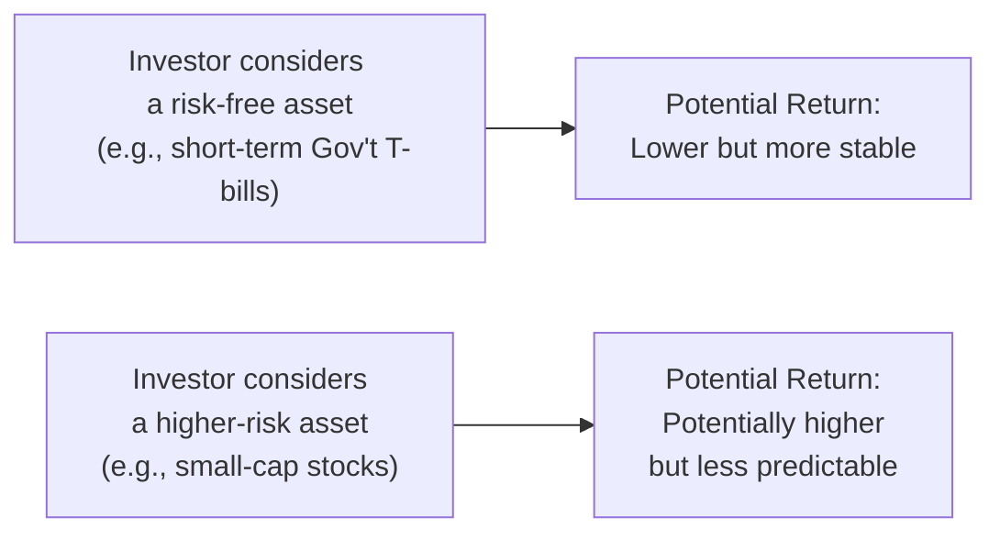
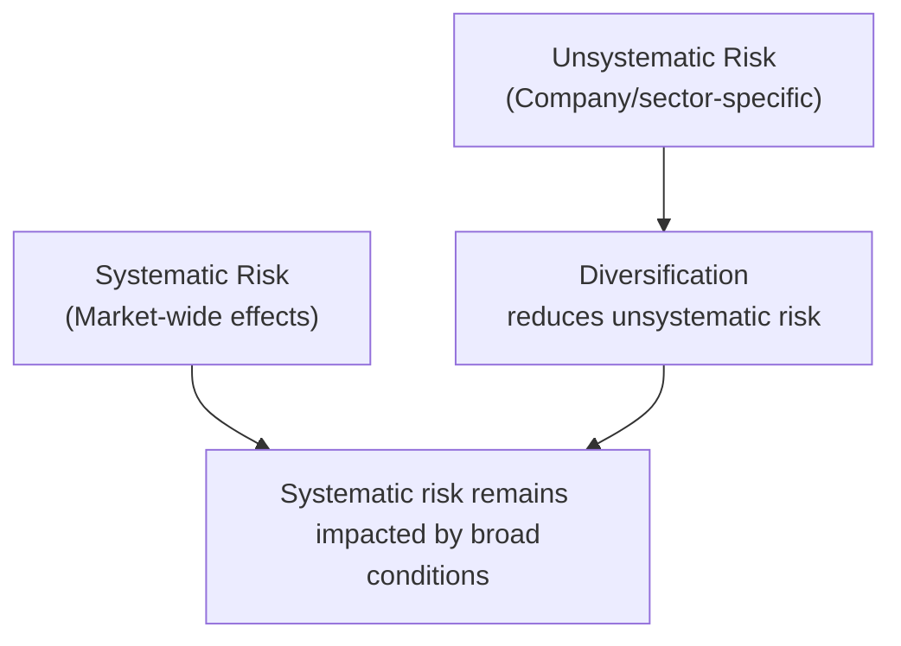

## 8.1 What is Risk and Return?

Risk and return. It sounds straightforward, right? You invest in something—maybe a stock, bond, or mutual fund—and you expect some profit in return. But the puzzle is: how much risk are you really taking on to (hopefully) earn those rewards? And if you want more significant returns, are you comfortable with the possibility that your investments could plummet in value if the market takes a nasty turn? These are the questions at the very core of modern investing, and they’re the focus of this section from the Conduct and Practices Handbook Course (CPH®).

I remember once talking with a close friend—someone who was super excited about day-trading technology stocks. Now, she loved the thrill of seeing her potential gains spike in a single afternoon. Her appetite for risk was huge, but her experience in evaluating that risk (and planning for losses) was basically nonexistent. In the first few months, she made some gains. Then, an unforeseen shift in the market hit while she was heavily invested in just one industry. Her equity position tumbled almost overnight, underscoring the point: higher risk can indeed lead to higher returns, but also higher potential losses. That, in a nutshell, is how risk and return balance each other out.

Understanding this risk-return trade-off helps shape virtually every aspect of the investment process, from your initial client discovery (see Chapter 5, “Client Discovery and Account Opening”) to constructing and rebalancing portfolios over time. Risk is the possibility that an investment’s actual return will differ from its expected return, and it can be measured in many ways, including the standard deviation of returns, volatility, or potential drawdowns. Return, simply put, is the profit or loss you earn from your capital. When we pair these two together, we start to form a clearer picture of how to construct a portfolio that works for different clients under different market conditions.

Below, we’ll walk through risk and return concepts in detail, explore systematic and unsystematic risk, dig into the famous “risk premium,” and relate it to everyday practice. We’ll also tie these theories back to regulatory expectations—CIRO (Canadian Investment Regulatory Organization, the SRO formed by the amalgamation of MFDA and IIROC) strongly emphasizes ensuring your recommendations align with each client’s risk tolerance and investment objectives (see Chapter 4, “Working with Clients,” for more on fulfilling your suitability obligations).

  
Balancing the Risk-Return Equation

It’s a classic maxim in finance: the potential for higher returns is usually accompanied by higher risk. Conversely, low-risk options such as Government of Canada Treasury Bills convey relatively small returns but afford strong capital preservation. So, how do you balance it all?

• Risk Tolerance: Each investor, whether brand new or more experienced, has a threshold for losses they can psychologically and financially bear. A retiree living on a fixed income might not stomach a 30% overnight drop in their portfolio. Meanwhile, an ambitious 25-year-old with a steady income may confidently invest in growth-oriented products, comfortable with short-term volatility over a multi-decade horizon.

• Time Horizon: Longer time horizons allow investments more room to recover from market dips. Think: a five-year horizon vs. a 30-year horizon. Younger clients can typically absorb more volatility because they have the “luxury” of time to ride through market cycles. A shorter time horizon, on the other hand, demands greater caution, given limited chances for recovery from major market downturns.

• Goals and Objectives: Clients might aim for capital preservation, steady income generation, or aggressive growth. Each objective dictates a different risk-return mix. A balanced approach often requires diversifying assets into various categories—like equities, fixed-income, and possibly alternative investments. This helps moderate the ups and downs across different segments of the market.

One way to visualize the basic interplay between low-risk/low-return and high-risk/high-return investments is with the simple flowchart below.

This is, of course, a super-simplified view. But it illustrates how differing choices lead to different return expectations and different levels of fluctuation in a portfolio.

  
Understanding the Risk Premium

Now, let’s talk about the “risk premium.” This is the extra return investors expect to receive by choosing a riskier asset over a risk-free alternative. The classic risk-free reference point in the Canadian context is often thought to be Government of Canada bonds or T-bills—very unlikely to default and typically stable. If a stock is riskier because of potential market swings, uncertain earnings, or general economic downturns, why would anyone buy it if it offered the same return as a T-bill? They wouldn’t, right?

Hence the necessity of the risk premium: it’s compensation for bearing higher uncertainty. If T-bills yield 3%, and a particular stock is expected to yield 8%, that 5% difference is the premium that entices investors to be comfortable with the ups and downs inherent in stock ownership. This concept often guides not only portfolio design but also asset pricing. And from a regulatory perspective, you’ll see how essential it is to disclose potential risks and returns, ensuring that clients understand why they might earn more (or lose more) when choosing certain products.

  
Systematic vs. Unsystematic Risk

Investors face a maze of risks—some pinned to broad economic trends and some unique to specific companies or sectors. To manage client expectations (and to follow the guidelines we covered back in Chapter 3 on “The Canadian Regulatory Framework”), it’s vital to differentiate between:

• Systematic Risk: Sometimes called market risk. This is the risk that arises from macroeconomic factors, geopolitical events, shifts in monetary policy by the Bank of Canada, or even worldwide events like global pandemics. You can’t easily diversify this risk away because it hits entire markets across virtually all sectors. For instance, if interest rates spike sharply, it can impact bond valuations nationwide and possibly influence consumer spending, thereby affecting equities, too. Diversifying into more stocks or more bonds won’t typically eliminate systematic risks.

• Unsystematic Risk: Also known as specific risk. This is the company- or industry-specific risk that can be effectively tempered through diversification. If you invest all your money in one airline company renowned for its exceptional performance, you could do quite well—unless there’s a sudden management scandal or a large-scale plane recall. Meanwhile, holding a diversified portfolio of multiple airlines, or even multiple types of businesses, helps soften (though not eliminate) the blow from any single firm’s downturn.

These two risk categories come together in every portfolio. By diversifying across sectors, industries, and asset classes, you substantially reduce unsystematic risk. But systematic risk typically remains, so the market’s overall ups and downs can still affect your portfolio. That’s why strong product due diligence (covered in Chapter 6) and thoughtful client discussions about broader market factors are crucial.

  
Risk-Return Metrics: The Sharpe Ratio

Many financial professionals use risk-return metrics to gauge how well a portfolio is compensating for the risk it’s taking on. One of the most common measures is the Sharpe Ratio, introduced by Nobel Laureate William F. Sharpe. The Sharpe Ratio calculates the excess return (i.e., the amount you earn above the risk-free rate) per unit of total risk, measured by the standard deviation of the portfolio’s returns.

Mathematically, we often write it as:

 \text{Sharpe Ratio} = \frac{(R_p - R_f)}{\sigma_p} 

Where:  
• \\( R_p \\) is the expected return of the portfolio  
• \\( R_f \\) is the risk-free rate (e.g., yield on Government of Canada T-bills)  
• \\( \sigma_p \\) is the standard deviation of the portfolio’s excess returns  

If you have two portfolios with the same return, but one has a lower standard deviation, it’s likely to have a higher Sharpe Ratio—indicating it’s delivering those returns more efficiently in terms of risk.

Um, so how do we interpret this in everyday practice? Let’s say you manage two client portfolios. Portfolio A yields 8% with a standard deviation of 10 percentage points above the risk-free rate, while Portfolio B yields 9% but with a standard deviation of 15 percentage points above the risk-free rate. Despite Portfolio B’s higher return, Portfolio A might end up with a better Sharpe Ratio because of its more moderate risk. The ratio guides you in deciding which portfolio is delivering more “bang for your buck” in risk-adjusted terms.

  
Client-Focused Reforms and Aligning with Risk Profiles

In Canada, regulatory bodies including CIRO and the Canadian Securities Administrators (CSA) emphasize a client-focused approach. This means that you’re not just chasing returns; you’re matching potential investments to each person’s risk tolerance, time horizon, knowledge, and goals. It also aligns with the “Best Interest” standard that’s embedded in many updated rules and guidelines.

• Knowing Your Client’s Risk Tolerance: Revisit Chapter 5 for details on the New Account Application Form (NAAF). That form and subsequent discussions (sometimes repeated or updated over time) lay the foundation for precisely gauging how your client views risk. Can they watch their portfolio drop by 10% without panic selling? 20%? This psychological angle is often just as crucial as having the financial capacity to endure a loss.

• Suitability of Trades and Strategies: If a high-risk leveraged ETF is recommended to a client with a modest risk profile who’s five years away from retirement, you might be breaching your obligations under CIRO rules. Conversely, ignoring a younger client’s appetite for aggressive growth by steering them only into conservative bonds could also be questionable—it might hamper their wealth-building potential.

• Documenting and Disclosing: Document everything. If you’re suggesting a product that’s more volatile, ensure you thoroughly explain potential losses alongside potential gains. This includes referencing official sources like CIRO’s guidelines (https://www.ciro.ca) or materials from the Canadian Securities Administrators (https://www.securities-administrators.ca) to show you’ve done your due diligence.

  
Diversification and Portfolio Construction

Effective portfolio construction often builds on the notion that you cannot fully eliminate systematic risk, but you can definitely minimize unsystematic risk. For instance:

• Spread out your holdings across multiple industries—finance, technology, healthcare, utilities, consumer staples, etc.  
• Consider both domestic and international investments, mindful of foreign exchange risk.  
• Blend equity, fixed income, and possibly alternatives like real estate or commodities, depending on the client’s situation.  

By diversifying, you aim for a smoother ride, although no strategy can totally eradicate the potential for market turndowns (think of events like the global financial crisis). The idea, though, is that when one segment underperforms, another may outperform, stabilizing overall returns.

  
Volatility, Emotions, and Investor Behavior

Sometimes, the biggest challenge with risk is not the market itself but the emotional response to volatility. During market downturns, investors may feel panic creeping in, especially if they’re new. They might ask you to sell everything when prices are at rock bottom—locking in losses. Conversely, in a euphoric bull market, they might want to pour all their cash into a hot new tech stock at precisely the moment it’s most overvalued. Navigating these emotional extremes is where financial advisors turn into coaches—partly guiding, partly reassuring, and partly educating.

• Behavioral Biases: Familiar pitfalls include loss aversion (fear of losses outweighing desire for gains), herding (doing something just because everyone else is doing it), and overconfidence (believing you can outsmart the market). It’s crucial to identify these biases in your clients—and sometimes in yourself—to ensure that investment decisions remain sound.

• Communication: Chapter 4 on “Working with Clients” highlights the importance of open, transparent communication. Reviewing ongoing market conditions, explaining fluctuations, and reiterating the long-term plan help clients stay rational during short-term volatility.

  
Regulatory Considerations and Ethical Practices

For Registered Representatives, following regulatory guidelines on risk disclosures and adhering to ethical codes of conduct (see Chapter 1, “Standards of Conduct and Ethics”) is not optional. Regulators require:

• Clear, plain-language disclosure about the product’s fundamental risks.  
• Honest discussions around potential downside scenarios—particularly important when markets look rosy.  
• Records of all communications, such as trade confirmations and account statements (see Chapter 8 on “Maintaining Client Accounts and Relationships” for more on compliance and complaint-handling).  

Any attempt to hide or downplay risk is a significant regulatory red flag. From an ethical standpoint, it also undermines client trust. As we’ve seen historically, misrepresenting or understating risk can lead to major issues—both reputational and legal.

  
Practical Examples and Case Studies

Let’s say you have two clients, Bob and Carol, both in their early 50s, married with slightly different career paths. Bob is a mid-level executive with a stable income and a decent pension on the horizon. Carol is self-employed, with an irregular income but a healthy emergency fund. They both have about 10-15 years until retirement, so they’re not in the final stretch, but they’re also not fresh out of university with decades to recover from severe market downturns.

• Risk Appetite: Bob may decide that he can handle moderate to higher volatility, given his stable job and some built-up savings. Carol, by contrast, might be more conservative. She can handle day-to-day ups and downs, but she’s anxious about any big drop in portfolio value because her income is unpredictable.

• Portfolio Construction: You might recommend for Bob a diversified mix of equities, including some small-cap or growth stocks, balanced with some corporate bonds. For Carol, you might skew a bit more toward stable dividend-paying stocks and high-quality bonds, aiming to maintain capital. Both could incorporate short-term T-bills as a liquidity buffer.  

• Risk Premium: Explaining that certain equities might offer higher returns but involve more fluctuations. Bob’s portfolio is designed to capture this equity premium. Carol’s is designed to limit shocks.  

Both Bob and Carol’s portfolios will still be subject to market-wide (systematic) risk, but by diversifying and by tailoring to their comfort levels, you help each of them strike a balanced risk-return scenario that suits their unique needs.

  
Glossary

• Risk Premium: The extra return an investor expects for choosing a risky asset over a risk-free one.  
• Systematic Risk (Market Risk): Risk inherent to the entire market or economic system (e.g., interest rates, inflation) that cannot be diversified away.  
• Unsystematic Risk (Specific Risk): Company- or industry-specific risk (e.g., product recalls, management scandals) that can be mitigated through diversification.  
• Sharpe Ratio: A measure of risk-adjusted return, calculated by dividing a portfolio’s excess return over the risk-free rate by its standard deviation.  
• Volatility: The degree of variation in a security’s price or returns over time (often measured by standard deviation).  
• Risk Tolerance: The degree of variability in investment results that an investor can psychologically and financially endure.

  
Further Exploration and Recommended Resources

• CIRO (Canadian Investment Regulatory Organization): https://www.ciro.ca  
• Bank of Canada (for risk-free rates, market data, and economic indicators): https://www.bankofcanada.ca  
• Canadian Securities Administrators (CSA) guidelines on risk disclosure: https://www.securities-administrators.ca  
• “Investments” by Bodie, Kane, and Marcus – a foundational textbook bridging theory and practical investing insights.  
• CFA Institute’s free resources on risk management: https://www.cfainstitute.org  

Learning about risk and return doesn’t stop here, of course. These resources will help you deepen your expertise from multiple angles—whether you aim to strengthen your portfolio construction techniques, develop client communication strategies about volatility, or keep up with the latest compliance standards in Canada’s evolving regulatory environment.

Keep in mind: you can’t escape risk in investing. What you can do is understand it, measure it, and manage it in alignment with your client’s profile and objectives. In my opinion, that’s where the true artistry of portfolio construction lies—balancing the science of finances with the human element of emotional comfort and life goals.

  
## Test Your Knowledge: Risk and Return Essentials Quiz



### 1. What is the fundamental principle regarding the relationship between risk and return?

- [x] Higher risk generally implies the potential for higher returns.
- [ ] Higher risk always guarantees higher returns.
- [ ] Lower risk always yields the same returns as high-risk assets.
- [ ] There is no relationship between risk and return.

> **Explanation:** The key insight is that increasing one’s tolerance for risk opens the door to higher potential rewards. However, it also involves a greater chance of losses.

---

### 2. Why do investors receive a risk premium?

- [x] To compensate for the uncertainty associated with riskier assets.
- [ ] To ensure all investors earn the same return.
- [ ] To prevent markets from becoming too safe.
- [ ] To reduce stock market volatility.

> **Explanation:** The risk premium is the extra return that investors expect for taking on riskier assets compared to “risk-free” ones like government-issued securities.

---

### 3. Which of the following types of risk can be mitigated through diversification?

- [x] Unsystematic risk.
- [ ] Systematic risk.
- [ ] Market-wide inflation risk.
- [ ] All risks can be eliminated by diversification.

> **Explanation:** Unsystematic risk is specific to particular companies or industries and can be reduced by diversifying your holdings. Systematic risk applies to entire markets and cannot be fully diversified away.

---

### 4. What is an example of systematic risk?

- [x] A sudden increase in interest rates that affects the entire market.
- [ ] A lawsuit targeting a single pharmaceutical company.
- [ ] A product recall specifically affecting one car manufacturer.
- [ ] The disappearance of a single CEO after a scandal.

> **Explanation:** Systematic risk pertains to large-scale economic or market-wide events, such as central bank policy changes, that affect multiple industries simultaneously.

---

### 5. Why is time horizon an important factor in risk tolerance?

- [x] Longer time horizons generally allow investors more opportunity to recover from losses.
- [ ] Time horizon does not matter in determining risk tolerance.
- [ ] Longer time horizons always prevent any losses from occurring.
- [x] It influences the level of volatility an investor can withstand as markets fluctuate.

> **Explanation:** Over lengthier periods, markets often recover from downturns, allowing investors with a long time horizon to ride out volatility while still pursuing higher potential returns.

---

### 6. According to the Sharpe Ratio formula, how is risk measured?

- [x] Through the standard deviation of a portfolio’s return.
- [ ] By the beta of a portfolio compared to the market.
- [ ] By the price-to-earnings ratio of each stock in the portfolio.
- [ ] Through the correlation of the assets in the portfolio.

> **Explanation:** The Sharpe Ratio uses the standard deviation of excess returns to gauge volatility—that is, how spread out returns are from the average.

---

### 7. Which option best describes client-focused reforms in relation to risk and return?

- [x] Advisors must align recommended products with the client’s individual risk profile and objectives.
- [ ] Advisors should only promote high-return products to retirees.
- [x] Advisors must fully disclose risks, including downside potential, to ensure informed consent.
- [ ] Advisors must prioritize products with guaranteed returns only.

> **Explanation:** Client-focused reforms emphasize matching investments with each client’s risk tolerance, time horizon, and goals while ensuring all risks are clearly communicated.

---

### 8. How does unsystematic risk generally differ from systematic risk?

- [x] It’s tied to specific firms or sectors and can be mitigated through diversification.
- [ ] It’s caused by broad economic events affecting all sectors equally.
- [ ] It cannot be addressed by investing in multiple assets.
- [ ] It has no impact on total portfolio returns.

> **Explanation:** Unsystematic (or specific) risk arises from company- or sector-specific factors and can be significantly reduced by spreading investments across multiple areas.

---

### 9. Why might a 25-year-old investor accept more risk compared to a 60-year-old investor?

- [x] They typically have a longer time horizon and can recover from market setbacks.
- [ ] They have more knowledge of financial markets.
- [ ] Younger investors aren’t protected by any regulations.
- [ ] They never experience market volatility.

> **Explanation:** Younger investors often have decades before they need their capital, giving their portfolios time to bounce back from potential downturns and justifying a higher risk-return approach.

---

### 10. Is it possible to reduce systematic risk in a portfolio through traditional diversification?

- [x] True
- [ ] False

> **Explanation:** Traditional diversification can’t totally eliminate systematic risk since it affects the entire market. However, some techniques like using derivatives or strategic asset allocation may reduce—but not entirely remove—systematic risk exposure.


