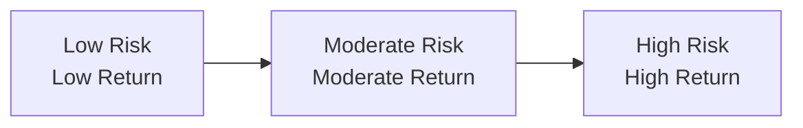

## 8.1 What is Risk and Return?

If you’re like me, you might remember the first time you heard the phrase “risk and return” and thought, “Um, doesn’t everyone want a high return with, like, zero risk?” It sounded kind of magical—like an investment unicorn we’re all trying to find. But, as soon as I dug into the world of finance, my illusions faded. Turns out, we can’t realistically expect a big reward without taking on an equally big possibility of some heartbreak along the way. This delicate dance between the upside and the downside shapes almost every investment decision we make. In this section, we’ll walk through what risk really is, how we measure return, and how these two ideas fit together in constructing an investment portfolio that meets client needs.

Remember: The Canadian Investment Regulatory Organization (CIRO) emphasizes that representatives must align the risk of a recommended product with a client’s profile. So, we’re not just talking about abstract theory here. It’s real life, with real dollars on the line (maybe your clients’—or your own).

### Defining Risk in Plain Terms

When we say “risk,” we’re talking about the possibility that things won’t go according to plan. In an investment context, risk usually refers to the chance that an asset’s actual return (the money you make or lose) will differ from what you were expecting. Sometimes, that’s a good thing: Maybe your returns go higher than projected. Other times—well, let’s not sugarcoat it—you end up losing money.

A big part of understanding risk is recognizing it’s not just about losing everything. It can also be about the ups and downs along the way. That’s where volatility comes in: Volatility is often used to measure the variability of returns on a day-to-day, month-to-month, or year-to-year basis. More volatile assets, like certain equities or niche funds, can experience big price swings in short time frames. Picture rollercoaster curves up and down. That’s risk in motion.

• The Blanket Definition: Think of risk as uncertainty. If we can’t precisely predict an outcome, there’s risk. The degree of that uncertainty is the quantity of risk.

• Real-World Example: Suppose you’ve bought shares in a tech start-up fund. If the tech sector thrives, your fund might skyrocket. But if a major competitor disrupts the market or if the company misses a key milestone, your fund could suffer big losses. That unpredictability is precisely what we call risk.

• KYC Link: Under CIRO rules, the “Know Your Client” process is there to help gauge how comfortable a client is with these types of ups and downs. A risk-averse client might not want to deal with big surprises, whereas a more aggressive client might enjoy the possibility of outsized gains despite the bigger bumps.

### Defining Return: Measuring the Prize

Return is what you get back on your investment—sometimes in the form of capital gains (the value of the asset going up), dividends, interest income, or a combination of these. Typically, we measure it as a percentage to make comparisons easier. For example, if you invest $1,000 and earn $100, that’s a 10% return.

But watch out: Return can be viewed in different ways:

• Nominal Return: This is the raw figure—no fancy math. If you bought a bond for $1,000 and sold it later for $1,050, that 5% gain is your nominal return. It doesn’t factor in inflation or any fees that might chew away at your real purchasing power.

• Real Return: Once inflation is deducted, that same 5% might shrink. If inflation runs at 3% during your holding period, your real return is 2%. Why? Because prices of goods and services in the broader economy climbed by 3%, effectively reducing the purchasing power of your money.

Considering Canada’s inflation trends—tracked by the Bank of Canada—you might see inflation vary year to year. In times of higher inflation, your money is losing purchasing power more quickly. So if your nominal returns aren’t beating inflation, your real return is negative. That can sting.

A quick example: You deposit $1,000 in a savings account that pays 2% per year. By year’s end, you have $1,020. Meanwhile, inflation was 3%. Although your nominal return looks like 2%, your real return is effectively -1% because your $1,020 buys less in goods and services than the $1,000 bought at the beginning of the year.

### The Tension: Risk and Return in a Balancing Act

When someone says, “There’s no free lunch in investing,” they’re basically referencing the risk-return trade-off. The higher the potential return, the more risk you’re probably taking on. Let’s illustrate this concept with a simple diagram. Keep in mind that this representation is simplified, but it provides a helpful visual:

• Low Risk, Low Return: Think Canadian Treasury Bills (T-Bills). They’re about as close to a “risk-free” investment as you can get in Canada because the Government of Canada backs them. But guess what? The return is often quite modest. In periods of higher inflation, your real return might even be negative.

• Moderate Risk, Moderate Return: This might be a balanced mutual fund holding both stocks (equities) and bonds (fixed income). If the economy does well, the equity portion could help boost returns. If the markets falter, the bond portion might stabilize the portfolio.

• High Risk, High Return: Picture a volatile tech equity fund or a speculative venture. Sure, the upside could be amazing, but the downside could be equally dramatic.

In finance, the “risk premium” is the extra return investors expect for taking on risk above a “risk-free” benchmark. If Government of Canada bonds yield 2% and you’re looking at a corporate bond offering 5%, that difference—3%—could be viewed (roughly) as your risk premium. The bigger that difference, the more the market perceives something uncertain or more dangerous about that investment.

### Why Volatility Matters

You might hear about “volatility,” “standard deviation,” or even see references to “beta” in some sophisticated analyses. While not every client wants to dive into the granular math, understanding that volatility is a gauge for how spread out or variable returns can be is crucial. A highly volatile fund might jump 10% in one month, drop 15% in the next, then gain 20% after that. Meanwhile, a stable, less volatile investment might hover within a relatively narrow price range.

In more formal terms, standard deviation is a statistical measure showing how much the returns deviate from the average return. Higher standard deviation = greater dispersion = bigger price swings = more risk. The principles behind using volatility as a measure of risk are taught in numerous finance courses, including those offered by the CFA Institute (https://www.cfainstitute.org/).

But always keep in mind: Volatility is not necessarily the only aspect of risk. There are other factors, like liquidity risk, credit risk, and systemic risk. For now, though, volatility remains a quick, common shortcut to gauge the level of uncertainty in returns.

### Time Horizon and Its Impact on Risk and Return

Your time horizon is how long you plan to hold onto an investment before you’ll need the cash. In textbook cases, younger investors with longer time horizons might have more capacity to ride out the rollercoaster of higher-volatility equity markets. On the other side, if you’re retiring next year (or you have a major expense looming), big market swings could be disastrous.

• Practical Example: Suppose you’ve got 30 years until retirement. Markets crash? You might have time to wait for a recovery, potentially reaping a higher return in the end. If you’re retiring in 2 years, you might not have that luxury.

Time horizon is a key KYC element that licensed representatives must gather. CIRO expects that you’ll match an investment’s risk profile to the client’s timeframe. Overly risky funds for a short horizon can lead to real trouble if the market dips. It’s a bit like planning a trip—if you’ve got a few hours to get to the airport, you can handle a few traffic jams. But if your flight leaves in 30 minutes, every obstacle is a major crisis.

### The Role of KYC and Suitability

As mandated by CIRO (https://www.ciro.ca/), when you open an account for a client or make investment recommendations, you must take a deep dive into their financial goals, experience, net worth, and risk tolerance. This ensures that the risk level of the recommended security aligns with the client’s comfort level and investment objectives.

• Suitability Check: If your 75-year-old client with a low risk tolerance is suddenly pouring money into a highly volatile emerging markets fund, that’s a red flag. You might need to have a serious conversation about whether that aligns with their risk tolerance and time horizon.

• Ongoing Assessment: People’s risk tolerance can shift over time. Maybe they’ve had a big life event or their financial goals have changed. So, it’s wise to check in with them periodically to keep the portfolio aligned with reality. Risk tolerance is not static.

### Balancing Past Performance with Future Expectations

We’ve all seen the disclaimer: “Past performance is not indicative of future results.” It’s practically etched in stone in the finance world. Still, a lot of clients focus on historical returns as a predictor of what they might earn. Explaining to your clients that a fund’s past success doesn’t guarantee future prosperity is critical. Markets change, and what worked before might not work again.

• A Thought Example: A fund that soared during a tech boom might crash if regulators suddenly clamp down on big tech or if new competition arises. Conversely, a fund that has “underperformed” while certain sectors were out of favor might become a superstar when those sectors make a comeback.

• Encouraging Realistic Expectations: As a mutual fund representative, your job involves guiding clients to frame expectations realistically. Sure, show them the historical returns, but also talk about the underlying risk factors and how markets evolve over time. If they’re just chasing “what was hot” last year, they might be in for a shock when that trend reverses.

### Practical Example: Balancing Risk and Return in a Sample Portfolio

Let’s consider a hypothetical portfolio and see how risk and return interplay:

• Conservative Bond Fund (40%)  
• Canadian Equity Fund (30%)  
• Global Equity Fund (20%)  
• Cash or Money Market Fund (10%)  

Why this distribution? The bond fund and money market portion aim to reduce overall volatility and provide some stability. The Canadian equity fund aligns with a home-market bias or preference for domestic growth. The global equity fund diversifies your client’s exposure to other regions that might be growing faster. Over time, the equities might deliver higher returns. But they also represent higher risk. Balancing them with bonds (and cash equivalents) helps manage potential downturns.

If your client is younger with a long time horizon, you might dial up the equities portion. If your client is older or risk-averse, you might add more bonds or other relatively stable instruments. Each piece of the puzzle modifies the overall portfolio’s risk-return profile. This is portfolio construction 101, and the approach is discussed in classic texts like “Investments” by Bodie, Kane, and Marcus, as well as in “The Intelligent Investor” by Benjamin Graham.

### A Brief Word on Diversification

By spreading investments across a variety of asset classes (and even within each class), you can reduce unsystematic risk—those risks tied to a specific company or sector. Systematic risk, on the other hand, can’t be fully diversified away because it affects the entire market (think economic recessions or global crises). Diversification doesn’t guarantee you’ll avoid losses, but historically, it’s proven to smooth out returns over the long run.

### The Human Factor: Behavioral Biases and Risk

It’s one thing to talk about risk in academic terms; it’s another to watch your portfolio lose 15% in a month. That may cause anxiety, prompting investors to make impulsive decisions—like panic-selling at market lows. This emotional angle is important. Sometimes, an investor’s tolerance for risk in a “theoretical conversation” is very different from what they can handle when the numbers are red on the screen.

• Anchoring Bias: People fixate too heavily on a certain benchmark or past value.  
• Loss Aversion: We humans feel the pain of loss more acutely than the joy of an equivalent gain.  

These and other biases can seriously affect an investor’s approach to risk and return. If you’d like to dive deeper, keep an eye on Chapter 5: Behavioural Finance, which elaborates on how these biases impact asset allocation and portfolio decisions.

### Best Practices for Managing the Risk-Return Relationship

• Educate Early and Often: The more your clients understand that higher return potential goes hand in hand with higher risk, the less likely they are to be shocked when markets get choppy.  
• Emphasize Time Horizons: Remind clients that short-term fluctuations matter less if they’re investing for the long haul. Conversely, short-term goals need more stable, near-cash positions.  
• Regularly Rebalance Portfolios: Over time, market movements might skew your clients’ asset allocation away from their target. Rebalancing can bring it back in line with the desired risk profile.  
• Monitor Changes: If a client’s personal situation changes (new job, nearing retirement, health issues, etc.), revisit their risk tolerance and, by extension, their portfolio.  
• Leverage Tools and Data: The Canadian Securities Administrators (https://www.securities-administrators.ca/) and CIRO (https://www.ciro.ca/) resources can guide you in meeting regulatory standards. The Bank of Canada (https://www.bankofcanada.ca/) provides data on inflation and economic indicators that can help in real return calculations.

### Common Pitfalls and How to Avoid Them

• Chasing Past Performance: Just because a fund skyrocketed last year doesn’t mean it will continue to do so.  
• Ignoring Inflation: Particularly in the current environment, ignoring the impact of inflation can lead to underestimating the real returns.  
• Overconcentration in a Single Stock or Sector: This can spike risk if that stock or sector goes south.  
• Failure to Reassess: As client circumstances evolve, so should their portfolio.  
• Underestimating Emotional Reactions: Investments can be scary when they’re losing money. Educating clients to ride out short-term volatility—provided it aligns with their risk tolerance—can help prevent panic selling.

### Additional Resources for Further Exploration

• CIRO: https://www.ciro.ca (Current regulatory framework for mutual fund dealers and investment dealers in Canada)  
• Canadian Securities Administrators (CSA): https://www.securities-administrators.ca/ (Harmonized securities regulations)  
• Bank of Canada: https://www.bankofcanada.ca/ (Inflation data and economic indicators)  
• CFA Institute: https://www.cfainstitute.org/ (Global Investment Performance Standards (GIPS) and extensive educational resources)  
• Books:  
  - “Investments” by Zvi Bodie, Alex Kane, and Alan Marcus  
  - “The Intelligent Investor” by Benjamin Graham  
• Online Courses:  
  - Coursera – “Investment Management” Specialization  
  - edX – “Introduction to Investments”  

If you’re setting out on this learning journey, those resources will deepen your understanding of how to balance risk and return in real-world scenarios. Also, keep in mind that these references are just the tip of the iceberg. Never stop learning; markets evolve, and so do the tools and products we use to navigate them.

### Key Takeaways

• Risk is the variability or uncertainty of returns, and it’s part of every investment—even the so-called “safest” ones.  
• Return measures the profits (or losses) you earn, typically expressed as a percentage. You can look at it nominally or factor in inflation for a real return figure.  
• The risk-return trade-off shows that higher returns generally come with higher uncertainty.  
• CIRO’s KYC and suitability requirements ensure that the level of risk in a recommended product matches the client’s financial situation and comfort.  
• Time horizon, diversification, and understanding one’s emotional responses to market volatility all play critical roles in effectively managing risk and seeking your desired return.  

Alright, hopefully that clarifies the big picture of risk and return. It’s a fundamental concept that underpins so many investment decisions—from the selection of mutual funds to the design of an entire retirement portfolio. And trust me, once you understand this basic (yet mighty) concept, you’ll see it lurking behind every financial product, performance chart, and client conversation you have.  

-----

## Risk and Return for Canadian Investors: Test Your Knowledge



### Which of the following best describes risk in an investment context?

- [x] The chance that actual returns differ from expected returns
- [ ] The guaranteed return of government bonds
- [ ] A measure of historical return
- [ ] The guarantee of a predictable outcome

> **Explanation:** Risk generally refers to the variability or uncertainty of returns, meaning your actual returns might differ from what you initially expected.

### When discussing the risk-return trade-off, what is the main principle to remember?

- [x] Higher potential returns typically come with higher risk
- [ ] You can always find high returns with zero risk
- [ ] Historical performance is the only indicator of future returns
- [ ] The government guarantees all investment gains

> **Explanation:** The core principle is that obtaining higher returns usually necessitates accepting higher levels of uncertainty or volatility.

### Which of the following statements correctly distinguishes between nominal return and real return?

- [ ] Nominal return is used only by institutional investors; real return is for retail investors
- [x] Nominal return is not adjusted for inflation, while real return accounts for inflation
- [ ] Nominal return includes inflation, while real return excludes fees
- [ ] Real return only applies to fixed-income investments

> **Explanation:** Nominal returns are stated before accounting for inflation. Real returns factor in the impact of inflation on purchasing power.

### In a balanced mutual fund composed of 60% equities and 40% bonds, which aspect of risk management is being applied?

- [x] Diversification
- [ ] Speculation
- [ ] Single-stock concentration
- [ ] Regulatory arbitrage

> **Explanation:** By spreading investments across different asset classes (equities and bonds), you can lower the overall portfolio volatility and manage risk more effectively.

### Which of the following is a key requirement under CIRO’s KYC and suitability rules?

- [x] Matching a client’s risk profile to recommended investments
- [ ] Ensuring clients only invest in government bonds
- [x] Understanding a client’s financial situation and objectives
- [ ] Providing tax advice to all clients

> **Explanation:** You must understand your client’s situation, including their risk tolerance and investment goals, to recommend suitable products. (Note that tax consultation may require referring to a qualified tax professional, so that is not a strict KYC requirement in itself.)

### What is a “risk premium?”

- [x] The additional return expected for taking on extra risk beyond a risk-free asset
- [ ] A premium that investors pay to limit risk
- [ ] The difference between administrative fees and fund expense ratios
- [ ] The interest rate offered by the Bank of Canada

> **Explanation:** The risk premium is the extra “payment” investors expect for risks over and above what they would earn from a risk-free investment.

### Which of the following factors most directly reduces unsystematic risk?

- [x] Diversification across various companies and sectors
- [ ] Investing heavily in a single, well-performing sector
- [x] Including a broad range of asset classes in a portfolio
- [ ] Timing the market to buy at the lowest point

> **Explanation:** By spreading investments (both within and across asset classes), you lessen unsystematic risk (company-specific or sector-specific). Systematic risk, tied to broad market conditions, cannot be fully diversified away.

### True or False: Past performance of a mutual fund guarantees identical future returns.

- [x] False
- [ ] True

> **Explanation:** Past performance is not a reliable guarantee of future results. Market conditions and many other factors can change over time.

### Why is time horizon crucial in assessing risk?

- [x] It determines how long you can ride out market volatility
- [ ] It ensures you never lose money
- [ ] It is irrelevant when choosing mutual funds
- [ ] It only applies to institutional portfolios

> **Explanation:** The longer the time horizon, the more capacity investors typically have to absorb short-term market swings and potentially recover from losses.

### Which of the following is a valid example of real return?

- [x] An investment yielding 8% in a year with 3% inflation has a real return of approximately 5%
- [ ] An investment that loses money but is still considered risk-free
- [ ] A guaranteed 10% return regardless of market conditions
- [ ] A nominal return of 7% that is identical to the real return

> **Explanation:** Real return is nominal return minus inflation. So 8% nominal - 3% inflation ≈ 5% real return.


