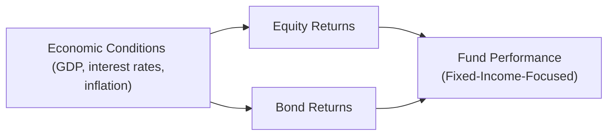

## 8.2 What are the Impacts of Economic Conditions in Comparing Returns?

Ever wonder why some mutual funds shine during certain market phases while others seem to stumble? Well, a big part of the story has to do with what's happening in the economy overall. In this section, let’s dig into how GDP growth, interest rates, inflation, and unemployment can significantly affect the returns you see on your investments—especially when you’re comparing one mutual fund against another. Along the way, I’ll share a few stories, personal experiences, and tried-and-true tips to make everything feel more concrete and approachable.

Before we dive in, let me just say that the economy can feel intimidating; it’s a lot of big numbers and bulletins from the Bank of Canada. But once you break it down, it’s actually pretty accessible. So, let’s get started.

---

### Understanding Key Economic Indicators

In Chapter 3 (“Overview of Economics”), we introduced a bunch of concepts like GDP, interest rates, and so forth. Here, we’ll connect those ideas to mutual fund returns more directly.

• GDP (Gross Domestic Product): A measure of a nation’s total economic output.  
• Interest Rates: Established largely by a central bank (in Canada, the Bank of Canada).  
• Inflation: The overall rise in price levels over time.  
• Unemployment: The percentage of the workforce that is not currently employed but actively seeking work.

When comparing mutual funds, you can’t just look at last year’s return in a vacuum. Instead, you should consider these economic signals because they often form the backdrop against which fund managers make their investment decisions.

---

### GDP Growth and Its Influence

GDP is kind of like the economy’s general “report card.” When GDP is rising (meaning the economy is growing):

• Companies often see higher revenues and earnings.  
• Stock prices (equities) may rise, boosting equity-oriented mutual funds.  
• Bond yields might offer slightly lower returns in a booming economy, since investors might shift toward equities for higher potential gains.

On the other hand, if GDP starts contracting (a recession or an economic slowdown):

• Corporate profits might take a hit.  
• Investors sometimes flee to safer assets like government bonds, GICs, or money market instruments.  
• Equity mutual funds might dip in value if broad market sentiment turns negative.

It’s also important to note that GDP doesn’t move in a straight line. There are expansions, peaks, contractions, troughs—these phases make up the business cycle. Understanding where Canada stands in the business cycle can give you clues about industries or asset classes that might be poised to do well (or poorly).

---

### The Role of Interest Rates

Interest rates are an essential tool that central banks (like the Bank of Canada) use to influence economic growth and inflation. Here’s where it gets a bit personal for me: I remember investing in a bond fund a few years ago when interest rates were historically low. I was so pleased with my returns at first! But—well, you might guess what happened—when interest rates started rising, the price of my bonds dipped because newly issued bonds offered higher yields.

If you’re new to bonds, the key principle is that when interest rates rise, bond prices typically fall (and vice versa). Now, this affects the net asset value (NAV) of bond mutual funds:

• RisingInterestRates → BondPriceDown → Potential Decline in Bond Fund Returns.  
• FallingInterestRates → BondPriceUp → Potential Increase in Bond Fund Returns.

Equities can be affected by changes in interest rates, too, because the “cost of capital” for companies changes. When rates are low, many companies can borrow cheaply to expand or fund projects. This can boost stock valuations, thus lifting equity mutual funds. However, if interest rates spike, it can dampen corporate profitability and weigh on stocks.

---

### Inflation and the Erosion of Real Returns

Inflation is sneaky. It’s the reason you may hear older generations talk about how a loaf of bread “used to cost only a quarter.” High inflation means every dollar buys less. Consequently, even if your mutual fund posts a positive return, high inflation can reduce that gain in “real” (inflation-adjusted) terms. For example:

• 5% Nominal Return - 3% Inflation = 2% Real Return.

In periods of high inflation:

• Fixed-income instruments (like traditional bonds) can feel the squeeze, because their coupon payments are locked in and lose real purchasing power.  
• Some equity mutual funds can do relatively better, especially if companies can pass on higher costs to consumers (like in certain consumer staples or energy sectors).  
• Funds that invest in real assets—such as real estate or commodities—might see a boost if inflation lifts prices for those assets.

You’ve likely seen how the Bank of Canada adjusts its policy to try and keep inflation around 2%. Keeping a close eye on these policy announcements can help you (and your clients) anticipate changes that might affect longer-term returns.

---

### The Significance of Unemployment Levels

Unemployment indicates how many people in the labor force can’t find a job. High levels of unemployment typically suggest economic distress; consumer spending can fall, business growth might slow, and overall markets can become more risk-averse.

From a mutual fund perspective:

• High unemployment may lead to weaker consumer spending, lowering corporate earnings (negatively impacting equity funds).  
• Defensive funds investing in stable industries like utilities or consumer staples might hold up better in such environments.  
• Bond funds can sometimes look more appealing if investors feel uncertain about the market’s direction in a high-unemployment scenario.

On the flip side, low unemployment often correlates with robust economic activity. Typically, consumer spending is strong, and corporate earnings can remain solid (plus or minus the risk of wage inflation). Equity funds tend to perform relatively well if wage pressure doesn’t significantly cut into corporate margins.

---

### Comparing Mutual Fund Performance Across Different Economic Phases

Let’s say you’re looking at the performance of two equity mutual funds. One posted spectacular returns in the last couple of years, while the other lagged. Before jumping to the conclusion that Fund A is always better, you might want to see if the strong performance happened during an expansion phase. Maybe Fund A was heavily skewed toward cyclical stocks that do well when demand is booming.

Meanwhile, Fund B could be filled with more defensive plays that are designed for steady performance across different environments. In a recession, that second fund might outperform while the first fund experiences bigger drawdowns.

Similarly, a bond fund might shine during a contraction when interest rates fall, but see tougher times when the central bank is in a tightening cycle. This cyclical pattern makes it essential to compare “apples to apples,” i.e., measure how each fund performed “through the cycle,” not just in a single phase or year.

---

### Personal Reflection: Navigating the ’Flavors’ of the Market

Years ago, I sat down with a friend who couldn’t understand why his favorite mutual fund (he’d held it for a few years) suddenly tanked after interest rates jumped. The fund had soared earlier because it was packed with long-duration bonds—perfect for a falling-rate environment. But as soon as the Bank of Canada shifted gears toward tightening, those bond prices were less attractive. He joked that “It’s like ordering the same ice cream flavor all the time and suddenly deciding you hate it when the weather changes.” Even though investment is more complex than that, it sort of captures the shift in sentiment when macroeconomic realities change.

---

### A Visual Overview of Economic Conditions Affecting Different Returns

Below is a simple diagram to outline how broad economic conditions (like GDP growth, interest rates, and inflation) feed into various asset classes and ultimately shape mutual fund performance.

The arrows show how the overall environment first influences equity or bond returns, and then impacts the performance of respective mutual funds.  

---

### Best Practices for Monitoring Economic Indicators

Staying informed doesn’t have to mean gluing yourself to every news ticker. Here are a few suggestions:

• Regularly check the Bank of Canada’s website (https://www.bankofcanada.ca/) for interest rate announcements and Monetary Policy Reports.  
• Explore data from Statistics Canada (https://www.statcan.gc.ca/) on GDP growth, unemployment, inflation, consumer spending, and more.  
• Use open-source financial tools like the Federal Reserve Economic Data (FRED) (https://fred.stlouisfed.org/) to compare global macroeconomic trends.  
• Watch for forward guidance from central bankers about possible policy changes.  
• Keep up with corporate earnings reports and sector trends.

These efforts help you anticipate which funds (e.g., equity vs. fixed income vs. specialty) might be well-positioned under upcoming conditions. It’s also a great way to set client expectations when changes happen.

---

### Potential Pitfalls and How to Avoid Them

1. Overreacting to Short-Term Fluctuations  
   • Pitfall: Investors might panic-sell a mutual fund after a bad quarter, missing out on long-term gains.  
   • Mitigation: Encourage a patient approach. Explain that cyclical shifts can cause short-term volatility but may not reflect long-term fundamentals.

2. Ignoring the Effects of Inflation  
   • Pitfall: Focusing solely on nominal returns can be misleading if inflation is high.  
   • Mitigation: Present real (inflation-adjusted) returns to clients so they understand the true purchasing power of their gains.

3. Failing to Diversify  
   • Pitfall: Investors with funds concentrated in a single sector or asset class could be vulnerable if the economy takes a turn that hurts that sector.  
   • Mitigation: Build diversified portfolios, combining various asset classes and sectors.

4. Relying Solely on Historical Data  
   • Pitfall: Past returns may not predict future results, especially if the economic environment changes drastically.  
   • Mitigation: Emphasize current and forward-looking economic data (interest rates, monetary policy changes, etc.), keeping in mind that historical context still provides valuable insights.

---

### Real-World Case Study: Comparing Two Funds in Different Economic Climates

Imagine two hypothetical funds:

• Alpha Growth Fund (heavy in technology and consumer discretionary stocks)—did amazingly well during an economic expansion where GDP grew at 3%. It soared 12% last year.  
• Beta Balanced Fund (a balanced portfolio of equities and government bonds)—posted a modest 6% during the same period.

Suddenly, the economy tapers off, leading to a slowdown. Tech demand shrinks, and interest rates remain stable. Alpha Growth might see a major dip, possibly returning only 2% or dropping even further. Beta Balanced might hold firm at 5% because of its bond allocation, which remains steady or even appreciates slightly if nervous investors go defensive.

When you compare these funds over a multi-year period, it’s essential to note that Beta Balanced fund’s steadier returns across the cycle might actually compete with or even beat Alpha Growth’s more volatile path. This is exactly why we factor in economic conditions when comparing returns.

---

### Conclusion: Tying It All Together

Economic conditions matter—a lot. If there’s one takeaway here, it’s that the returns you see on paper can’t be fully understood without considering the broader economic context in which they were achieved. Whether it’s rising GDP, changes in interest rates, stubborn inflation, or shifting unemployment, these factors influence the valuation of equities and bonds, and by extension, the performance of mutual funds.

Keeping tabs on economic data doesn’t have to be daunting. You can do it in small steps—maybe by checking the Bank of Canada’s rate announcements once a month or scanning a few key Statistics Canada releases. The goal is never to predict the future with 100% certainty, but rather to set realistic expectations and craft an asset mix that aligns with the current and expected environment.

---

### References and Further Exploration

• Bank of Canada – Interest Rate Announcements and Monetary Policy Reports:  
  https://www.bankofcanada.ca/

• Statistics Canada – Economic Data & Indicators:  
  https://www.statcan.gc.ca/

• The Canadian Investment Regulatory Organization (CIRO):  
  https://www.ciro.ca  
  (Regulatory environment for mutual fund dealers and investment dealers in Canada.)

• Canadian Securities Institute – Additional Courses on Macroeconomics:  
  https://www.csi.ca/

• “Guide to Economic Indicators” by Norman Frumkin – A great book for diving deeper into how various economic indicators might affect investment returns.

• Federal Reserve Economic Data (FRED):  
  https://fred.stlouisfed.org/  
  (Access to global and historical economic and financial data, useful for comparisons.)

---

## Test Your Knowledge of Economic Conditions and Mutual Fund Returns



### Comparing fund performance without considering the economic environment can lead to which pitfall?

- [ ] Overstating the importance of the business cycle  
- [ ] Focusing too much on interest rates  
- [x] Misinterpretation of a fund’s real performance  
- [ ] Overly emphasizing sector diversification  

> **Explanation:** When you ignore the economic environment in which returns are generated, you risk misjudging a fund’s performance. Challenging environments (e.g., recession) might suppress returns, while expansions can inflate them.  

### Which statement best describes the inverse relationship between bond prices and interest rates?

- [ ] When interest rates rise, bond prices also rise.  
- [ ] When interest rates rise, bond prices remain stable.  
- [x] When interest rates rise, bond prices generally fall.  
- [ ] Bond prices are unaffected by interest rate movements.  

> **Explanation:** Bond prices are sensitive to interest rate changes because newly issued bonds offer different yields, making existing bonds more or less attractive in comparison.  

### During periods of high inflation, which type of investment might maintain its value better?

- [x] Real assets (e.g., real estate, commodities)  
- [ ] Short-term GICs  
- [ ] Long-duration government bonds  
- [ ] Corporate bonds with low coupon rates  

> **Explanation:** Real assets sometimes better maintain (or even increase) their value because their prices often adjust upward in response to inflationary pressures.  

### What might happen to a bond mutual fund’s net asset value (NAV) when interest rates rise?

- [x] The NAV often decreases  
- [ ] The NAV always increases  
- [ ] The NAV remains stable  
- [ ] The NAV increases by the same percentage as rates  

> **Explanation:** As interest rates rise, existing bonds become less attractive compared to newly issued ones at higher rates, causing bond prices to drop and lowering the bond fund’s NAV.  

### Which macroeconomic indicator most directly reflects total production and consumption within a country?

- [x] GDP (Gross Domestic Product)  
- [ ] Unemployment rate  
- [x] Inflation rate  
- [ ] Balance of trade statistics  

> **Explanation:** GDP sums up the monetary value of all finished goods and services produced within a country, reflecting production, demand, and consumption.  

### A mutual fund heavily invested in cyclical stocks might outperform during which type of economic environment?

- [x] A period of rapid GDP growth  
- [ ] A high-inflation environment with stagnant growth  
- [ ] A period of monetary tightening with rising rates  
- [ ] A deflationary spiral with low consumer demand  

> **Explanation:** Cyclical stocks, such as those in consumer discretionary and certain industrial sectors, often flourish when economic activity and consumer spending are on the rise.  

### If unemployment rates soar, investors might shift their portfolios toward:

- [x] More defensive allocations like government bonds  
- [ ] Technology stocks with high growth potential  
- [x] Aggressive equity funds  
- [ ] Highly leveraged international funds  

> **Explanation:** High unemployment signals economic uncertainty. Investors typically seek safer assets such as government bonds or defensive equity sectors (utilities, consumer staples).  

### How does inflation typically affect the real returns of fixed-income investments?

- [x] It reduces the real returns by increasing prices  
- [ ] It leaves real returns unaffected  
- [ ] It automatically increases nominal coupon rates  
- [ ] It makes bond returns increase in lockstep  

> **Explanation:** Inflation erodes the purchasing power of the fixed coupon payments, effectively lowering real returns.  

### A balanced mutual fund containing both equities and bonds may be advantageous because:

- [x] It offers diversification across asset classes  
- [ ] It always guarantees the highest return  
- [ ] It eliminates inflation risk entirely  
- [ ] It is only suitable during recessions  

> **Explanation:** Balanced funds combine equities and bonds, potentially smoothing returns across different market conditions and economic cycles, offering more diversification than a single-asset fund.  

### True or False:  
Low unemployment rates always guarantee equally low inflation.

- [x] True  
- [ ] False  

> **Explanation:** While low unemployment often correlates with increased consumer demand (and potentially inflationary pressures), it doesn’t guarantee low inflation. Many other economic factors (e.g., monetary policy, supply chain issues, global events) can also influence inflation levels.  


