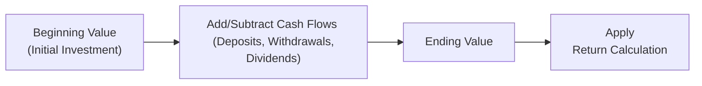
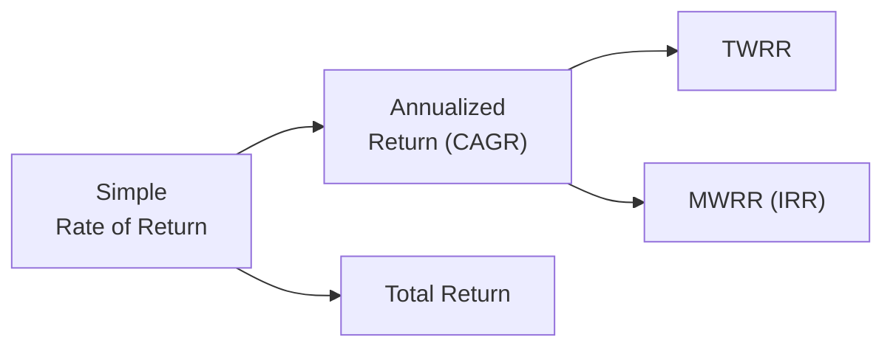

## 8.3 How to Calculate a Return

When I first started investing—eons ago, in my mind, even though it was probably only a decade—I remember staring at my account statement and wondering: “Am I actually making money, or is it just random line items going up and down?” That question quickly led me down the rabbit hole of learning how to calculate and interpret returns. You know, it’s one thing to see the final amount of money in your account and think, “Hey, that’s more than I started with,” but it’s another thing entirely to really understand what that means in a consistent, measurable way.

As you dive deeper into building and managing investment portfolios (see also Chapter 8.1 “What is Risk and Return?” for context on how returns relate to overall risk management), knowing how to calculate returns accurately is key. It not only helps answer that eternal “Am I up or down?” question but also gives you a benchmark to compare alternative investments, evaluate fund managers, measure risk-adjusted performance, and align your portfolio with your long-term objectives.

Calculating returns may sound intimidating—especially if you see formulas with exponents and cash flows all over the place—but fear not. Together, we’ll explore each core method step by step, shedding some light on why each approach matters, and, more importantly, when you would want to use it.

---

## Why Understanding Returns Matters

Before we get into the details, let’s talk about “why.” Why learn how to calculate a return using multiple methods?

1. • Consistency in Measurement: Different accounts might produce varied results depending on how you handle contributions, dividends, or the timing of trades. Consistent formulas and approaches let you compare apples to apples.  
2. • Performance Evaluation: Calculating returns isn’t just for curiosity; it’s crucial for evaluating how your portfolio or a particular fund manager is doing relative to peers, benchmarks, or personal expectations.  
3. • Regulatory Requirements: As referenced throughout the Canadian investment landscape, CIRO (the Canadian Investment Regulatory Organization) has reporting guidelines that often specify how firms should present returns to clients. Familiarity with these calculations helps you read and interpret official account statements.  
4. • Psychological Comfort: Knowing exactly how your returns are computed can bring you peace of mind, especially if you’re trusting a third party (like a mutual fund) with your money. You’ll know enough to detect red flags or honest mistakes.

So, let’s roll up our sleeves and get practical!

---

## Simple Rate of Return (RoR)

### Definition

The Simple Rate of Return (also called the Holding Period Return) is probably the easiest formula to grasp. It looks at your initial investment, compares it to your final investment, and calculates the percentage change. You see something like this all the time in casual conversations, like your friend who says, “I invested $1,000 and now I have $1,100. That’s a 10% return.”

### Formula

Here’s how we do it:  
(Ending Value – Beginning Value) ÷ Beginning Value × 100%

If you started with \$1,000 and ended with \$1,100:

• RoR = (1,100 – 1,000) ÷ 1,000 × 100% = 10%

### When To Use It

• Quick Assessment: It’s handy for a snapshot of your performance over a single holding period when there are no major splits, dividends re-invested, or additional deposits/withdrawals.  
• Ease of Communication: Great for everyday chatter or short-term analysis.

### Limitations

• Ignores Cash Flows and Distributions: If you receive a dividend or interest payment that you reinvest, the simple return formula might not capture that nuance.  
• Doesn’t Annualize Results If You Held for Partial Year: If your holding period is anything longer or shorter than one year, the simple approach can be misleading if you try to compare results across different time horizons.

---

## Total Return

### Definition

Total Return is a more inclusive measure. It tracks your original principal but also factors in any income you earned, such as dividends, interest payments, or distributions from a fund. For example, in mutual fund investing (reference Chapter 10: “The Modern Mutual Fund”), you’ll often see dividend and capital gains distributions. Total Return aims to capture everything—price appreciation plus any reinvested “extras.”

### Formula (Conceptual)

Mathematically, you might think of it as:  

[(Ending Value – Beginning Value) + Income Received] ÷ Beginning Value × 100%

Let’s say you invest \$1,000 in a dividend-paying stock. By year’s end, the stock price rose to \$1,050, and you also received \$25 in dividends. Then:

• Total Return = [(1,050 – 1,000) + 25] ÷ 1,000 × 100% = 7.5%

If you only looked at the Simple RoR focusing on price change, you’d mistakenly think your return was 5%. The Total Return method shows you 7.5% because dividends count too.  

### Why Is This Important?

• More Accurate for Income-Producing Assets: Particularly relevant for bonds, dividend-paying stocks, or mutual funds that distribute interest and earnings.  
• Better Reflects the Real Gains: If you reinvest the distributions, the compounding effect can be significant over time.

### Pitfalls to Watch Out For

• Reinvestment Assumptions: Sometimes, total return implies you reinvest dividends or interest at the same rate, which might not match real-world conditions.  
• Fees and Taxes Omission: If you’re not factoring in taxes or certain fund fees, your total return might seem higher than the net figure you actually keep.

---

## Annualized Return (Compound Annual Growth Rate)

### Definition

Investments often grow (or shrink) over multi-year horizons. The Annualized Return, or Compound Annual Growth Rate (CAGR), helps you see what an investment’s average yearly growth rate was, assuming it grew at a constant rate each year.

### Formula

CAGR = [(Ending Value ÷ Beginning Value)^(1/n) – 1] × 100%

Where:  
• n = number of years  
• Beginning Value = your initial investment  
• Ending Value = your final investment

### Example

Let’s say you invested \$5,000 in a fund and it grew to \$8,000 over five years. Your CAGR is:

CAGR = [(8,000 ÷ 5,000)^(1/5) – 1] × 100%  

= [(1.6)^(0.2) – 1] × 100%  

≈ (1.099 – 1) × 100% = about 9.9% per year

### When To Use It

• Normalizing Returns Over Different Durations: If you want to compare a 3-year return to a 7-year return, annualizing them levels the playing field.  
• Reinforces Compounding Concept: CAGR captures the “snowball effect” of gains compounding over time.

### Potential Drawbacks

• Doesn’t Reflect Volatility or Cash Flows: If your investment was incredibly volatile, CAGR can mask big ups and downs along the way.  
• Assumes Reinvestment of Intermediate Income: Similar to Total Return, if your investment pays dividends or interest, the calculation might assume that each distribution was reinvested at the same growth rate.

---

## Time-Weighted Rate of Return (TWRR)

### Definition

The Time-Weighted Rate of Return, or TWRR, is widely used in asset management to evaluate a fund manager’s performance. It basically eliminates the effect of external cash flows—like contributions or withdrawals—so that you can judge how the actual investment strategy (rather than the investor’s money in and out) performed during each sub-period.

### Why Use It?

• Fair Comparison Across Fund Managers: One portfolio might have a large deposit right before a market crash, while another might see a big withdrawal right before a rally. TWRR doesn’t penalize or reward the manager for these timing events, which are often outside of their control.  
• Regulatory & Industry Standards: The Global Investment Performance Standards (GIPS) published by the CFA Institute emphasize TWRR for standardized performance reporting.

### Simplified Calculation Steps

TWRR often breaks your investment timeline into segments—each interspersed by significant external cash flows. Then, you compute the growth factor (sub-period return) for each segment, and finally multiply those factors together.

For example, suppose your investment experiences two sub-periods during the year:

• Sub-period 1 Return (no big cash flows in the middle) = 4%  
• Sub-period 2 Return (again, no big external flows) = 3%

Then TWRR for the entire period is:

(1 + 0.04) × (1 + 0.03) – 1 = 7.12%

If there are big contributions or withdrawals in the meantime, you split the timeline at those points so they don’t skew the results.

### Short Example

• Jan 1: \$10,000 start  
• Jun 30: The investment grows to \$10,500. Then you add \$2,000 more.  
• Jul 1–Dec 31: By year-end, the total is \$13,650.

Steps for TWRR:

1. Sub-period 1: (10,500 – 10,000) ÷ 10,000 = 5.0%  
2. Sub-period 2: (13,650 – (10,500 + 2,000)) ÷ (10,500 + 2,000) = 1,150 ÷ 12,500 = 9.2%  

Now, TWRR = (1 + 0.05) × (1 + 0.092) – 1 ≈ 14.66%

Notice how adding \$2,000 in the middle doesn’t directly “distort” the manager’s return. TWRR isolates the performance of the investment itself.

### Caution

• TWRR Doesn’t Show Personal Experience: If you added money right before a big jump, you might—personally—have done better than TWRR indicates. TWRR is about the manager’s skill, not the investor’s timing.

---

## Money-Weighted Rate of Return (MWRR or IRR)

### Definition

Now, if you’re more interested in how you, the individual investor, actually fared based on your personal deposits, withdrawals, and other cash flows, you might turn to the Money-Weighted Rate of Return (MWRR). This is also referred to as the Internal Rate of Return (IRR). It puts more weight on periods when your investment amount is higher.

### Why Use It?

• Reflects Actual Investor Experience: If you added a large deposit right before the market soared, your personal return will be higher. If you withdrew funds before a rally, your personal return will be lower.  
• Cash Flow Timing Matters: MWRR uses the exact days you invested or withdrew money.

### Formula

The formula for MWRR is essentially the IRR equation, which solves for the discount rate (r) that sets the net present value (NPV) of all cash flows (including the final balance) to zero:

Σ (Cash Flow in Period t / (1 + r)^t ) = 0

Because this can be complex, people typically rely on financial calculators or software (e.g., Excel’s IRR or XIRR function).  

### Practical Example

Imagine you start with \$10,000 in an account (that’s a negative cash flow from your perspective, because you “invest” the money). Then you deposit \$2,000 halfway through the year. By the end of the year, your account stands at \$13,650. MWRR will find the rate r that equates these cash flows:

-10,000 at t=0  
-2,000 at t=0.5 years  
+13,650 at t=1 year  

Solve for r. This often yields a number that will not match your TWRR. The difference is that MWRR captures the investor’s experience based on how much money was in play at different times.

### Common Pitfalls

• Complex to Calculate by Hand: Usually, you’ll lean on tools like PerformanceAnalytics in R or a good old Excel IRR/XIRR formula.  
• Harder to Compare Funds: MWRR includes your personal timing, which might not reflect how well the actual fund manager performed.

---

## Visualizing Return Calculations

Below is a simple Mermaid.js diagram to illustrate the typical flow of calculating returns, from the moment you invest (Beginning Value) through your cash flows and final calculation.

Explanations:  
• “Beginning Value” is your starting principal (for TWRR, we break the timeline into sub-periods).  
• “Add/Subtract Cash Flows” includes dividends, deposits, withdrawals.  
• “Ending Value” is your final balance.  
• “Apply Return Calculation” means using either Simple RoR, Total Return, CAGR, TWRR, or MWRR to get your final figure.

---

## Real-World Considerations & Personal Stories

Let me share a small personal anecdote: I used to rely solely on the simple RoR whenever I made a quick stock purchase—maybe I was just impatient. Then, I started dabbling in dividend reinvestment plans (DRIPs), and it began to throw off my quick mental calculations. One day, I asked myself, “Wait, didn’t I just get \$50 in dividends last quarter that I used to buy more shares?” My old simple RoR approach was ignoring that extra step. That’s when Total Return “a-ha” moment hit me.

Later, when I started comparing the performance of two different fund managers, I found that one manager posted a TWRR that looked outstanding. But, personally, my money-weighted returns told a different story because I had deposited more into that top-performing fund (lucky me) at the right time. So, from my vantage point, that manager looked even better than the TWRR alone suggested. That’s the power of MWRR: it can highlight the real-dollar experience in your own account, not just the manager’s skill in a vacuum.

---

## Common Pitfalls and Best Practices

• Ignoring Reinvested Earnings: If you’re measuring your returns but not factoring in the reinvested distributions, you could be selling yourself—or your investment—short.  
• Mixing Methods: Make sure you’re comparing “like with like.” If your statements use TWRR, but you’re mentally calculating a simple RoR, confusion will arise.  
• Overlooking Fees and Taxes: All returns we talk about can be measured “gross” (before fees and taxes) or “net.” If you’re really measuring your personal wallet growth, net-of-fee, net-of-tax returns might be what matter most.  
• Focusing Solely on Return Without Risk: Remember, we introduced risk measurement in Section 8.4 “How to Measure Risk.” The highest return strategy might be the riskiest. Don’t examine returns in isolation.

---

## Tools and Techniques

These days, you don’t have to do everything with pen, paper, and a calculator (though sometimes that’s a helpful exercise to really grasp the math).

1. Microsoft Excel or Google Sheets: The IRR and XIRR functions help with MWRR calculations, while arithmetic can handle simple or total returns.  
2. PerformanceAnalytics in R (Open-Source): Provides TWRR, MWRR, and even advanced metrics. Highly recommended for analytics.  
3. Third-Party Investment Apps: Many brokerages or robo-advisors integrate real-time performance calculations, often TWRR.  
4. Portfolio Management Software: Comprehensive platforms will produce multiple return statistics for you, often automatically net of fees.

---

## Canadian Regulatory and Industry Framework

When you receive statements from Canadian mutual fund dealers registered with CIRO (the Canadian Investment Regulatory Organization), you might see certain standardized performance figures. Historically, both the MFDA and IIROC had specific reporting requirements, but after they amalgamated into CIRO, the guidelines continue to emphasize client-friendly and accurate rate of return disclosures. For more on official updates, see:

• [CIRO Official Site](https://www.ciro.ca) – for current guidelines and compliance documentation.  

In global contexts, the CFA Institute’s [Global Investment Performance Standards (GIPS)](https://www.cfainstitute.org/) define comprehensive frameworks for performance measurement and presentation. TWRR is often the default for performance reporting under GIPS, ensuring that investors can compare managers on a “fair playing field.”

---

## Putting It All Together

At the end of the day, your choice of return calculation depends on what you’re trying to evaluate:

• Are you measuring manager skill? → TWRR.  
• Are you measuring how much you personally made, with your unique timing? → MWRR.  
• Are you just curious about how a single, lump-sum investment grew? → Simple or Total Return.  
• Are you comparing multi-year growth? → Annualized Return (CAGR).

In Chapter 8.8 “Additional Topics in Constructing Investment Portfolios,” we’ll dive deeper into combining these return metrics with risk measurements and asset allocation adjustments. Keep in mind that no single figure can capture the entire story, but each method can illuminate part of the path to wise investing.

---

## Additional Resources for Further Exploration

• [CIRO](https://www.ciro.ca): For the latest on Canadian regulations and reporting standards.  
• [Global Investment Performance Standards (GIPS) by CFA Institute](https://www.cfainstitute.org/): Wide-reaching standards on how to measure and present investment results.  
• “PerformanceAnalytics” package in R: An open-source tool for TWRR, MWRR, risk metrics, and more.  
• Microsoft Excel IRR or XIRR Functions: Classic go-tos for quick internal rate of return calculations.  
• “Managing Investment Portfolios: A Dynamic Process” by John L. Maginn et al. (CFA Institute): A comprehensive book on portfolio management, including performance measurement techniques.

If you’re feeling a bit overwhelmed, don’t worry. We’ve all been there—especially when seeing all these formulas for the first time. The trick is to remember that each one answers a different question, so choose the right method when you need it. And if you ever get stuck, lean on the resources above (and perhaps ask a friendly colleague for a second opinion).

Happy return calculating!

---

## Mastering Your Knowledge of Investment Returns

Below is a short Mermaid.js diagram visually summarizing the relationships among the most common return calculation methods:

• “Simple Rate of Return” is the foundation, from which we can expand to “Total Return” or incorporate compounding concepts to get “Annualized Return.”  
• “Annualized Return” then branches to two advanced approaches: TWRR (manager-focused) and MWRR (investor-focused).

---

## Quiz: Mastering Portfolio Performance and Return Calculation



### Which calculation method best accounts for an investor’s total experience, including the timing of contributions and withdrawals?

- [ ] Time-Weighted Rate of Return (TWRR)
- [x] Money-Weighted Rate of Return (MWRR)
- [ ] Simple Rate of Return
- [ ] Annualized Return (CAGR)

> **Explanation:** The MWRR (or IRR) incorporates the timing and amount of each cash flow, making it specific to the individual investor’s actual experience.

### Which formula is used to determine the Simple Rate of Return (RoR)?

- [x] (Ending Value – Beginning Value) / Beginning Value × 100%
- [ ] [(Ending Value / Beginning Value)^(1/n) – 1] × 100%
- [ ] (Sum of Dividends ÷ Beginning Value) × 100%
- [ ] 1 – (Beginning Value / Ending Value) × 100%

> **Explanation:** The Simple RoR formula measures the percentage change from initial to final value, without factoring in dividends or intermediate cash flows.

### What is the main purpose of the Time-Weighted Rate of Return (TWRR)?

- [ ] To assess personal cash flow timing
- [x] To evaluate a portfolio manager’s performance without the impact of investors’ deposits/withdrawals
- [ ] To calculate short-term investments only
- [ ] To assess tax implications on dividends

> **Explanation:** TWRR neutralizes the impact of cash flows, allowing a fair assessment of how effectively a manager invests the money under management.

### How does Total Return differ from the Simple Rate of Return?

- [ ] It ignores reinvested dividends
- [ ] It is always higher
- [ ] It only applies to investments under one year
- [x] It includes income distributions, such as dividends or interest, in the calculation

> **Explanation:** Total Return adds dividends or interest payments to price appreciation, leading to a more comprehensive assessment.

### Which return metric is typically used to compare multi-year growth over different durations?

- [x] Annualized Return (CAGR)
- [ ] Money-Weighted Rate of Return
- [x] Time-Weighted Rate of Return
- [ ] Simple Rate of Return

> **Explanation:** CAGR normalizes returns across varying time periods, showing the “average” annual growth rate over several years.

### If an investment grows from $5,000 to $8,000 in 5 years, how do you calculate its CAGR?

- [x] [(8,000 ÷ 5,000)^(1/5) – 1] × 100%
- [ ] (8,000 – 5,000) ÷ 5,000 × 100%
- [ ] [(8,000 – 5,000)^(1÷5) – 1] × 100%
- [ ] (5,000 ÷ 8,000)^(5) × 100%

> **Explanation:** The basic formula for CAGR is [(Ending Value ÷ Beginning Value)^(1/n) – 1] × 100%.

### Which of the following is true regarding TWRR in practice?

- [x] It divides the investment period into sub-periods around cash flows.
- [ ] It requires daily compounding to be accurate.
- [x] It uses external cash flows to determine the portfolio’s return.
- [ ] It assumes taxes are zero.

> **Explanation:** TWRR splits the overall timeline into segments where deposits or withdrawals occur, computing each sub-period’s return and then chaining them together.

### Which statement best describes the role of dividends in a Total Return calculation?

- [x] Dividends are added to capital gains when computing return.
- [ ] Dividends are always assumed to be withdrawn, lowering the return.
- [ ] Dividends are not factored into any performance calculations.
- [ ] Dividends only matter for TWRR and not for other return types.

> **Explanation:** Total Return includes both the change in price and any income (like dividends) to provide a complete picture of investment performance.

### How can you compute MWRR (IRR) without solving equations manually?

- [x] Use financial calculators or spreadsheet functions like Excel IRR/XIRR.
- [ ] Subtract total deposits from total withdrawals.
- [ ] Rely on TWRR calculations for an estimate.
- [ ] Perform a growth rate approximation using logs.

> **Explanation:** MWRR calculations can be complex, so people typically use built-in tools like Excel IRR, XIRR, or specialized software to find the rate of return.

### TWRR eliminates the effects of cash flows to measure the manager’s true performance.

- [x] True
- [ ] False

> **Explanation:** TWRR focuses on returns within each sub-period, effectively removing the influence of investor-driven external cash flows on performance measurement.


