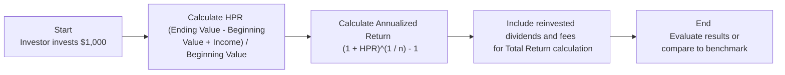

## 8.3 How to Calculate a Return

Calculating an investment return sometimes feels like a puzzle, especially if you're new to the finance world. You start to wonder: “Am I really doing this right?” or “Is there a simpler way?” In my early days of investing (well, decades ago!), I remember scribbling down numbers in a spiral notebook, trying to figure out if I'd actually made a profit or not. It’s because calculating returns can get tricky when you factor in reinvested dividends, management fees, or changes in share prices over different periods. Let’s walk through these steps carefully and in plain English, so you can see how it all fits together.  

### Understanding the Different Types of Returns

When we talk about “return,” we might mean several different things. You’ve probably heard terms such as Holding Period Return (HPR), Annualized Return, and Total Return. Each term brings its own perspective:  
• Holding Period Return (HPR): The total return you get from holding an asset over a certain period (which could be a month, a year, or even 10 years).  
• Annualized Return: The geometric average return on an investment each year, even if you held it for a different time period. This is great for comparing investments that might have different lengths of time.  
• Total Return: This one includes not just price changes but also any dividends, interest, or other distributions you receive.  

If you’re talking about mutual funds, returns usually assume distributions are reinvested—it’s as if you took all your dividends or interest payments and plowed them back into the fund right away (which is a good approximation for how many people invest).

### Holding Period Return (HPR)

The concept of Holding Period Return (HPR) is pretty basic, but it's so fundamental that you’ll see it come up again and again. HPR measures how much you’ve earned (or lost!) over a specific period of time, as a percentage of your original investment.  

The formula for HPR is:


\text{HPR} = \frac{\text{Ending Value} - \text{Beginning Value} + \text{Income Received}}{\text{Beginning Value}}


Let’s say you bought a stock for \$100 about a year ago, earned \$2 in dividends, and ended up selling the stock at \$110. Then your HPR would be:


\frac{110 - 100 + 2}{100} = 0.12 \quad \text{or} \quad 12\%


It simply tells you, “Over this holding period, I earned 12%.” Notice how it also includes any dividends or income you got along the way.

### Annualized Return

Now, sometimes a 12% return sounds phenomenal—until you realize it took you three years to get that return (just as a hypothetical). Annualized returns are crucial for apples-to-apples comparisons. They effectively ask, “If I broke down that total return into an average yearly return, what would that look like?”

Annualized Return is also known as the Compound Annual Growth Rate (CAGR) in many contexts. The formula is:


\text{Annualized Return} = \left( \frac{\text{Ending Value}}{\text{Beginning Value}} \right)^{\frac{1}{n}} - 1


Where \\( n \\) is the number of years you held the investment.  

For example, if you invested \$1,000 in a certain fund and sold it five years later at \$1,800 with no additional dividends or interest, your total growth multiple is 1.8 (\$1,800 / \$1,000). If we annualize that:


\text{Annualized Return} = (1.8)^{\frac{1}{5}} - 1 \approx 0.125 = 12.5\%


This 12.5% annualized return means the investment grew at an effective rate of about 12.5% each year, even if the actual returns varied from year to year.

### Total Return (Including Dividends or Interest)

Sometimes we only talk about capital gains or price appreciation. But the truth is, an investment’s success often hinges on those extra payments like dividends from stocks or interest from bonds. A total return calculation includes both price changes and any cash flows you receive.  

For stocks, the formula typically includes:


\text{Total Return} = \frac{\text{(Ending Price - Beginning Price) + Dividends}}{\text{Beginning Price}}


If you held shares of a company that paid regular dividends or a bond that paid interest semi-annually, it’s essential to include them in your returns. In many mutual fund performance reports, you’ll see the “Distribution Reinvested” assumption—meaning any dividends or capital gains distributions the fund pays out are instantly used to buy more shares of the fund. This helps keep the measurement clearer and more standardized.

### Simple vs. Compound Returns

You might see a “simple” rate of return quoted for shorter periods, like a month or a quarter. If you’re just looking for a quick measure (“I made X% this quarter”), a simple division can be fine. But for anything longer, especially if you’re re-investing income automatically, you want to think in terms of compound returns.  

• Simple Return: Great for short intervals, typically:


\text{Simple Return} = \frac{\text{Income or Gain}}{\text{Investment}}


• Compound Return: Captures the effect of reinvesting gains over multiple periods. After all, you’re earning returns on your returns, which can turbocharge growth over the long term.

### Calculating Returns for Lump-Sum Investments

If you put in a single lump sum, it’s relatively straightforward. Let’s assume you deposit \$10,000 in an investment account, and five years later withdraw \$15,000. You earned \$5,000 over five years.  

• Your HPR is:


\frac{15,000 - 10,000}{10,000} = 0.5 = 50\%


• Your annualized (compound) rate of return is:


(1.5)^{\frac{1}{5}} - 1 \approx 8.45\%


In words, you earned a total of 50% spread over five years, which is about 8.45% a year, on average, if we treat it as a “steady growth” scenario.

### Calculating Returns with Periodic Contributions

Real-world investing can be more complicated because many of us contribute money to our portfolios gradually—maybe monthly or quarterly. In that case, you want to watch out. If you just do a quick formula that doesn’t handle periodic contributions properly, you might get a misleading figure.

A widely accepted approach is the Time-Weighted Rate of Return (TWRR). The TWRR is often used for evaluating portfolio managers or comparing funds because it neutralizes the effect of investor cash flows. Another approach you may come across is the Dollar-Weighted Rate of Return (or Internal Rate of Return, IRR), which measures the return based on actual money in and out. But that can be sensitive to your timing decisions, like whether you dumped in a large sum right before a big market drop.

### Introduction to Time-Weighted Rate of Return (TWRR)

The Time-Weighted Rate of Return slices the investment periods between each cash flow (deposit or withdrawal) and calculates growth in each slice, then multiplies those growth factors together. Think of it as capturing how well the investment itself performed, irrespective of when you added or withdrew money.

The TWRR method:

1. Breaks the investment timeline into sub-periods around each cash flow.  
2. Calculates the return for each sub-period.  
3. Links those returns to get a total growth factor.  
4. Converts it into an annualized (or suitable period) rate if needed.

This method is heavily used in the fund industry to show performance fairly and is mandated by many regulations (including guidelines from the Canadian Investment Regulatory Organization, or CIRO).

### A Handy Diagram for the Process

Below is a simple flowchart that shows the steps many investors take when calculating total returns and converting them to annualized numbers.  

### The Impact of Fees and Expenses

We can’t talk about performance without mentioning fees—because, well, they matter a lot! It’s not fun to earn a 10% gross return if you lose 2% in fees every year. Management Expense Ratios (MERs) for mutual funds or ETFs can significantly reduce your net return over time.  

• MER includes management fees, operating expenses, and taxes.  
• High MER can eat away at your compounding effect.  
• Always look at the “net return,” which is after all fees.  

In Canada, mutual funds must disclose performance returns net of expenses. That means if you see a 6% annual return reported, it’s after the MER has been accounted for. CIRO guidelines (reflecting the amalgamation of the former IIROC and MFDA into one new organization since 2023) require dealers to give you clear performance data in your client statement, so you can see how the fees have impacted your results.

### Putting All the Pieces Together

If you’re comparing two or more investments, be sure to look at:  
• Their stated return period. (Is it monthly, yearly, 5-year, 10-year?)  
• Whether the returns are annualized or not.  
• Whether dividends or distributions are included.  
• Whether fees have been accounted for.  

And for mutual funds, or any pooled investment, the industry standard is to show time-weighted returns. This levels the playing field and makes it easier to see if a manager is doing a good job.

### Case Study: Example Calculation

Let’s walk through a somewhat realistic scenario:

1. Initial Investment: \$10,000 in an equity fund at the beginning of the year.  
2. After three months (end of March), the account is worth \$10,500, and you add \$2,000 more.  
3. After another three months (end of June), the account is worth \$12,000 (this includes the new money plus growth). Then you withdraw \$3,000.  
4. At year-end (December 31), the account ends up at \$11,500.

Computing a simple rate of return (just final minus initial) wouldn’t be accurate because you changed the amount invested mid-year. So, you’d consider sub-period returns:

• Sub-period 1 (Jan–Mar): From \$10,000 to \$10,500, which is a 5% gain.  
• Sub-period 2 (Apr–Jun): You start with \$10,500 + \$2,000 = \$12,500. Then it grows to \$12,000 (before your \$3,000 withdrawal). Actually, that’s a bit of a loss: \\((12,000 - 12,500)/12,500 = -4\%\\).  
• Sub-period 3 (Jul–Dec): You withdrew \$3,000, leaving \$9,000 in the account. That \$9,000 then grew to \$11,500. That’s a gain of \\((11,500 - 9,000)/9,000 = 27.78\%\\).

Now, you chain-link (1 + 0.05) × (1 - 0.04) × (1 + 0.2778) - 1 to find the overall growth factor. Or you can also do a time-weighted calculation that properly adjusts for mid-period additions/withdrawals. (You might use a financial calculator or a spreadsheet for precision.)

### Practical Tips and Tools

• Spreadsheets (Excel, Google Sheets): Offer built-in functions such as IRR (which is more like dollar-weighted) and some plugins for TWRR.  
• CSI Tools and Calculators: The Canadian Securities Institute provides online resources and practice calculators for return-related computations—very handy if you’re preparing for licensing exams.  
• CIRO (https://www.ciro.ca): For official guidelines and rules about disclosure and performance reporting. CiRO replaced and consolidated the regulatory oversight of IIROC and MFDA as of 2023.  
• Morningstar (morningstar.ca): A trusted source for seeing how funds and ETFs have performed, including their total returns, distribution yields, and more.  
• The Little Book of Common Sense Investing by John C. Bogle: Offers foundational insights on index fund performance, effectively illustrating how compounding and costs impact returns over time.

### A Quick Table Example

Below is a simplified table showing you how a lump-sum investment might grow with dividends reinvested. Fees are taken off at the end of every year. This is just an illustrative example:

| Year | Beginning Balance | Annual Return | Dividends (Reinvested) | MER Fees (1.5%) | Ending Balance |
|------|-------------------|--------------|-------------------------|-----------------|---------------|
| 0    | \$10,000          | –            | –                       | –               | \$10,000       |
| 1    | \$10,000          | 5%           | \$300                   | \$180           | \$10,820       |
| 2    | \$10,820          | 7%           | \$350                   | \$170           | \$11,721       |
| 3    | \$11,721          | -3%          | \$100                   | \$180           | \$11,476       |

In this made-up scenario, you see how dividends reinvest, fees are subtracted, and market fluctuation occurs. Over three years, we can figure out the total growth factor for the final return. Not to mention, if we wanted the annualized return, we'd do \\((\$11,476 / \$10,000)^{1/3} - 1\\).

### Best Practices

• Double-check whether the data source has annualized or unannualized returns—avoid mixing them up!  
• Compare like with like (all returns should be time-weighted and net of fees if you’re analyzing performance).  
• Keep an eye on distributions. If you’re ignoring dividends or interest, you’re missing a big part of the puzzle.  
• Fees matter; they’re not just “small percentages.”

### Common Pitfalls

• Ignoring dividends or reinvested distributions can lead you to underestimate your return.  
• Using a simple return for multi-year horizons (instead of a compound method) can give you misleading numbers.  
• Failing to factor in the timing of contributions (lump-sum vs. periodic) can drastically change your perceived performance.  
• Overlooking fees—especially with high-MER funds—can be a big mistake. You might think you’re making 8% each year, but if 2% goes to fees, your net is really 6%, which compounds differently in the long run.

### Regulatory Framework in Canada

As of 2023, CIRO is the single national self-regulatory organization in Canada, taking over from the now defunct IIROC and MFDA. For investors, the key point is that CIRO sets guidelines and rules around how returns must be presented to clients. This ensures consistent, trustworthy, and comparable performance data across all member firms. And the Canadian Investor Protection Fund (CIPF) similarly merged with MFDA IPC to become a single unified fund to protect client assets should a CIRO member firm run into insolvency.

### Summary of Key Points

• Holding Period Return (HPR) is a straightforward way to gauge total return over a specific time.  
• Annualized (compound) returns allow you to compare investments across different time frames.  
• Total Return accounts for price changes plus any dividends or interest.  
• Time-Weighted Rate of Return (TWRR) is the gold standard for measuring a fund or manager’s performance without the distortion of cash flows.  
• Fees reduce real returns—always keep an eye on the MER.  
• Use standardized performance tables, especially for mutual funds, to see performance in a consistent, regulated format.  

And that’s it. Return calculations might initially feel a bit overwhelming, but with a step-by-step approach—and maybe a trusty spreadsheet or online calculator—it becomes part of your routine to track and compare investments more effectively.

## Your Ultimate Guide to Calculating Investment Returns Quiz



### Which of the following best describes Holding Period Return (HPR)?  
- [x] It is the percentage return over the entire time an investment is held  
- [ ] It is the return per year for the investment  
- [ ] It excludes dividends or interest income  
- [ ] It is only calculated in multi-year increments  

> **Explanation:** Holding Period Return captures all the gain (or loss) from the time you purchase the investment until you sell it, including any income.  

### Why do investors generally prefer annualized returns when comparing different investments?
- [x] It allows an apples-to-apples comparison by standardizing returns over one year  
- [ ] It always produces a higher return figure  
- [ ] It focuses solely on dividend payments  
- [ ] It is only relevant for fixed-income securities  

> **Explanation:** Annualizing converts multi-year returns into a standard yearly rate, so investments can be compared fairly.  

### In total return calculations, which of the following is included?
- [x] Price appreciation, dividends, and interest payments  
- [ ] Only dividends, not interest  
- [ ] Only interest, not price appreciation  
- [ ] Price appreciation or depreciation but excludes actual cash distributions  

> **Explanation:** Total Return integrates all sources of return—capital gains and income (dividends, interest).  

### If an investment grows from \$1,000 to \$1,800 over 5 years with no dividends, how do you compute its annualized return?
- [x] (1.8)^(1/5) - 1  
- [ ] 800/5  
- [ ] 800/1000  
- [ ] (5/1.8) - 1  

> **Explanation:** The annualized return (compound growth rate) is calculated by taking the growth factor (1.8) to the power of 1/n, then subtracting 1.  

### Why is the Time-Weighted Rate of Return (TWRR) often preferred for measuring a fund manager’s performance?
- [x] It removes the impact of cash inflows and outflows to focus on pure investment performance  
- [ ] It is simpler than a holding period return  
- [x] It is mandated by many regulatory standards for performance reporting  
- [ ] It only includes dividends, not capital gains  

> **Explanation:** TWRR is a fair measure of managerial skill because it’s not biased by when investors deposit or withdraw cash, and it is required by many regulatory frameworks.  

### Which statement is true about re-invested dividends when calculating mutual fund returns?
- [x] They are treated as if they immediately purchase new shares  
- [ ] They are excluded from total return calculations  
- [ ] They only matter for bond funds  
- [ ] They are treated as a liability  

> **Explanation:** Mutual funds typically assume any dividends or distributions are automatically re-invested, which factors into the total return calculation.  

### How do high fees and expenses (e.g., the MER) influence your investment returns over the long term?  
- [x] They reduce net returns due to ongoing deductions  
- [ ] They only affect short-term returns  
- [x] They compound negatively over time  
- [ ] They have no material impact  

> **Explanation:** Fees consistently eat away at your returns, and the compounding effect of these costs can significantly lower the final amount.  

### What is the main difference between simple and compound returns for longer time spans?
- [x] Compound returns account for growth on previous gains; simple returns do not  
- [ ] Simple returns always equal compound returns  
- [ ] Compound returns ignore reinvested dividends  
- [ ] Simple returns are preferred for multi-year horizons  

> **Explanation:** Compound returns factor in the reinvestment of gains, which can greatly affect long-term performance.  

### If you invest in a stock that pays regular dividends, why might you underestimate your growth if you only look at the stock’s price?
- [x] You fail to include the dividend income in your return  
- [ ] Dividend income is always negative  
- [ ] The stock price never includes dividend amounts  
- [ ] Stock price changes are typically zero over time  

> **Explanation:** Dividends are an integral part of total return. Ignoring them understates the actual profit.  

### True or False: CIRO is the unified Canadian self-regulatory organization that replaced both IIROC and MFDA.  
- [x] True  
- [ ] False  

> **Explanation:** Since January 1, 2023, IIROC and MFDA no longer exist as separate organizations. They amalgamated into the Canadian Investment Regulatory Organization (CIRO).  



---

**References & Further Reading**  
• [Canadian Investment Regulatory Organization (CIRO)](https://www.ciro.ca) – For the latest guidelines and rules about performance reporting and dealer requirements.  
• CSI’s “Tools and Calculators” – Practice with real-world numbers and get comfortable calculating your own returns.  
• [Morningstar Canada](https://www.morningstar.ca) – Check detailed fund performance, including total returns and comparison tools.  
• “The Little Book of Common Sense Investing” by John C. Bogle – A classic read on index investing and the importance of costs and compounding.  

Keep in mind, all these formulas and methods are guidelines to help you think strategically about your investments. Always verify your final calculations with an official statement or a financial adviser when making important decisions. Good luck, and stay curious!
