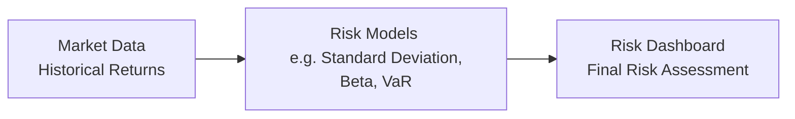

## 8.4 How to Measure Risk

Measuring risk is at the heart of constructing sound investment portfolios. It isn’t just about preparing for worst-case scenarios—though that’s a big part of it—it's also about understanding how different markets, assets, and sectors behave and interact. If you’ve ever felt that little twinge of unease before buying a stock or mutual fund, rest assured that you’re not alone. That feeling is your internal risk barometer. In professional finance, we try to harness that gut feeling with numbers like standard deviation, beta, Value at Risk (VaR), and the downside capture ratio. But we also have to realize that not everything fits neatly into a chart or formula—some risks are hidden in big macroeconomic factors, in shaky corporate leadership, or even in fast-moving geopolitical events. This section aims to bring all these angles together and provide you with both quantitative and qualitative ways to measure risk.

Having worn many hats over the years—student, retail investor, and financial advisor—I can say that some of my biggest lessons in risk measurement came from seeing how real investment portfolios respond to unexpected news events. One moment, you're comfortable in your seat believing your model is bulletproof, and the next, something happens—like a drastic change in government policy in a foreign country—and your carefully calculated numbers suddenly feel inadequate. Let’s explore how you can build a more complete picture of risk so that no single event leaves your portfolio (or your peace of mind) in tatters.

Understanding the Terminology  
It’s worth revisiting some core definitions before we dive into the nitty-gritty. We’ll start with the “big four” of risk measurement—standard deviation, beta, VaR, and downside capture ratio—and then discuss other forms of risk and how they might escape the purely quant-based lens.

––––––––––––––––––––––––––––––

Standard Deviation (Volatility)

Standard deviation is often the go-to metric for understanding how “wide” or “tight” an asset’s returns might swing around its average. Think of it as a measure of predictability. If an asset has a low standard deviation, its returns have historically hovered fairly close to the mean. If the standard deviation is high, you can expect large swings—both up and down.

Mathematically, you may see it represented like this:


\sigma = \sqrt{ \frac{1}{n - 1} \sum_{i=1}^n \bigl(R_i - \overline{R}\bigr)^2 } 


where  
• Rᵢ = the return at time i  
• Ȓ = the average (mean) return over all n observations  
• n = number of return observations

A personal story: years ago, I was constructing a small tech-focused portfolio for a friend, and I used standard deviation to see how each stock might behave independently. But what I learned quickly is that many tech stocks, especially start-ups, have wide dispersion in returns—leading to a high standard deviation. Even if they had good long-term growth prospects, the journey was extremely bumpy. This is where you realize that standard deviation doesn’t necessarily tell you whether those big swings are mostly upward or downward; it just shows you how often you move away from that average.

Strengths:  
• Simple and time-tested.  
• Easy to interpret as a concept (a narrower distribution feels “safer,” a wider one feels riskier).  

Limitations:  
• Assumes returns roughly follow a normal distribution. Real markets can have “fat tails,” meaning more extreme, unexpected movements than the classic bell curve might suggest.  
• May not capture sudden catastrophic drops if your historical time window doesn’t include them.  

––––––––––––––––––––––––––––––

Beta (Market Risk Sensitivity)

Beta is all about how an asset (or portfolio) moves relative to a benchmark—commonly something like the S&P/TSX Composite Index in Canada. A beta of 1.0 means the asset tends to move in lockstep with the benchmark. A beta greater than 1.0 means the asset moves with greater volatility than the benchmark: it often exaggerates market ups and downs. A beta below 1.0 suggests the asset moves less drastically compared to the market.

If you’re someone who hates big swings, you might consider including lower-beta assets in your portfolio. But keep in mind that on the upside, a low-beta asset might lag behind the broader market if the market surges. In the past, I remember having a small gold-mining equity in my portfolio with a beta spanning anywhere from 1.5 to 2.0, depending on the lookback period. Whenever commodity prices became volatile, this stock would leap or plunge even more dramatically.

Strengths:  
• Useful if you want to see how your investment “plays along” with the broader market.  
• Helpful in building a diversified portfolio that either seeks or avoids market volatility.  

Limitations:  
• Beta can change over different time horizons.  
• Doesn’t guarantee future correlation; relationships can shift due to company- or sector-specific events.  

––––––––––––––––––––––––––––––

Value at Risk (VaR)

Value at Risk (VaR) tries to answer a single, if somewhat intimidating, question: “How much could I lose over a specific period with a certain level of confidence?” For example: With 95% confidence, the portfolio’s one-day VaR is $50,000. This means that 95% of the time, you can expect not to lose more than $50,000 in a single day. Of course, that also means there’s a 5% chance you could lose more than $50,000, which is not exactly comforting, but it’s helpful to have some yardstick.

Different calculation methods exist—Historical Simulation, Variance-Covariance, and Monte Carlo simulations are widely used. Each method has its assumptions and biases. VaR gained popularity in large banks for quick risk snapshots, but critics argue it can give a false sense of security. If you rely too heavily on VaR, you might underestimate the magnitude of rare but devastating events (sometimes referred to as “Black Swan” events).

Strengths:  
• Clear expression of financial risk in currency terms.  
• Widely used in institutional risk management, so it’s well-integrated into many enterprise systems.  

Limitations:  
• Prone to large inaccuracies if the model assumptions don’t match reality.  
• Does not capture losses beyond the VaR threshold well, often underestimating “tail risk.”  

––––––––––––––––––––––––––––––

Downside Capture Ratio

If you manage or invest in a fund and want to see how it performs during market downturns, the downside capture ratio is your friend. This ratio shows how much of the market’s negative performance the fund “captures.” If an index drops 10% and your fund only drops 5%, you’d have a downside capture ratio of 50%. If you drop 10% when the market drops 10%, that’s a 100% downside capture. In an ideal world, you want something with a downside capture ratio below 100%—that means you’re losing less than the benchmark during downturns.

Strengths:  
• Tells you specifically about downside risk, complementing standard deviation and beta which look at both upside and downside.  
• Great for evaluating how a manager handles bear or corrective markets.  

Limitations:  
• It’s purely backward-looking. A good downside capture ratio historically doesn’t guarantee future performance.  
• Doesn’t say much about what happens during flat or up markets (where upside capture ratio might help).  

––––––––––––––––––––––––––––––

Why Qualitative Risk Matters

No matter how good your numbers look, they can’t fully capture every risk. Quantitative measures, by their nature, rely on data. But what if the data doesn’t reflect what will happen next year or even tomorrow? Market shocks can come from unexpected political shifts, chaotic leadership changes within a company, or even climate disasters that disrupt entire supply chains.

Below are some qualitative risks to keep on your radar:

• Liquidity Risk: In volatile or thinly traded markets, you might struggle to sell a position quickly without slashing the price. This is especially true for complex or esoteric products.  
• Credit Risk: Will a bond issuer default on its payments? The rating agencies publish opinions, but unexpected defaults still occur.  
• Management Risk: The brilliance (or lack thereof) of the C-suite can make or break a company. Quant models often overlook big leadership shake-ups or corporate governance flaws.  
• Political Risk: A sudden war, a new trade barrier, or populist rhetoric can drastically reshape the performance outlook for companies in certain regions.  

Sometimes, these risks rise to the surface in big ways that a standard deviation or VaR number couldn’t have foretold. Think of the global financial crisis of 2008, where a web of poorly understood mortgage-backed securities resulted in meltdown. Liquidity risk, credit risk, and structural issues played huge roles in that crisis—issues that standard volatility metrics simply didn’t reflect accurately.

––––––––––––––––––––––––––––––

Practical Example: Bringing It All Together

Let’s say you have a well-diversified portfolio with both Canadian and international equities, some bonds, and a smattering of alternative assets (like real estate investment trusts or perhaps some commodities). You might measure:

• Standard Deviation for each underlying position to understand how volatile it has been historically.  
• Beta relative to the S&P/TSX Composite or another benchmark to see which parts of your portfolio respond more dramatically to broad market shifts.  
• VaR to get a rough sense of the maximum daily or monthly loss you might face under normal market conditions.  
• Downside Capture Ratio for your overall equity portion or your mutual funds to see how they fared in bear markets.

But you’d also want to keep an eye on your liquidity—especially if some assets are in less liquid markets. If you sense certain companies are at risk of a management shake-up, you might weigh that factor as well. And if you have international holdings, you’ll watch for political shifts in the countries where you invest.

A quick guiding question: “Do I only care about daily, weekly, or monthly fluctuations, or is my horizon more long term?” If your horizon is 10 years, you might be more tolerant of short-term volatility and less reliant on short-term measures like daily VaR. But if you’re holding leveraged positions or using margin, short-term fluctuations become much more critical.

––––––––––––––––––––––––––––––

A Visual Overview of Risk Measurement

Below is a simple flowchart illustrating how different types of data feed into various risk models. While it’s a simplified view, it can help visualize the overall process:

• Market Data: Historical prices, returns, and volumes.  
• Risk Models: Employ formulas and statistical methods (standard deviation, beta, VaR, etc.).  
• Final Risk Assessment: Involves combining quantitative metrics with qualitative analysis.

––––––––––––––––––––––––––––––

Mind the Pitfalls

Just as you can’t drive a car by looking only at the rearview mirror, you can’t solely rely on backward-looking measures of risk. Whether it’s annual standard deviation or your favorite VaR method, you’re basically working with historical data and assumptions that might not hold in a new market cycle. That’s where best practices come into play:

• Stress Testing: Consider hypothetical “what if” scenarios, like a major interest rate spike or an abrupt global crisis.  
• Incorporating Forward-Looking Indicators: Keep track of leading economic indicators, corporate earnings forecasts, or macro signals that might suggest future changes in market volatility.  
• Setting a Risk Budget: This is where you decide how much risk you’re willing—and able—to take on. If you're investing conservatively for retirement, your risk tolerance might be quite low.  
• Diversification: Don’t be lulled into a false sense of security by diversifying only across asset classes that are highly correlated. True diversification means mixing assets whose cycles don’t typically move in tandem.

––––––––––––––––––––––––––––––

Canadian Regulatory Perspective

On the regulatory front in Canada, the Canadian Investment Regulatory Organization (CIRO)—which, as of 2023, amalgamated the former IIROC and MFDA—places significant emphasis on ensuring investment dealers and mutual fund dealers properly assess risk when recommending products. CIRO’s notices often remind firms and advisors that they have a responsibility to clearly communicate risk factors to clients, including potential market volatility and liquidity constraints. You can find updated resources on their website at https://www.ciro.ca.

Additionally, the Canadian Investor Protection Fund (CIPF)—now the country’s sole investor protection fund—protects client assets if a member firm becomes insolvent. While it doesn’t protect you from market losses, it underscores the importance of dealing with regulated firms that maintain prudent risk practices under CIRO guidelines.

––––––––––––––––––––––––––––––

Global Comparisons and Local Nuances

Risk measurement frameworks are broadly global in nature—standard deviation and VaR aren’t uniquely Canadian concepts. But local markets do have nuances. For instance:

• Canada’s oil and natural gas sector can cause certain portfolios or funds to have higher beta when oil prices are volatile.  
• The S&P/TSX Composite has substantial exposure to banking, energy, and materials sectors. This affects beta calculations for Canadian-focused funds differently than, say, a U.S.-focused or global fund.  
• Political and regulatory changes in Canada can be more region-specific (like the impact of new pipeline policies or provincial trade regulations), so qualitative measures are important.

––––––––––––––––––––––––––––––

Incorporating Open-Source Tools and Additional Resources

If you want to go hands-on, there are plenty of open-source solutions that allow you to download market data and compute these metrics yourself. Libraries in Python (like pandas, NumPy, and statsmodels) or R (like quantmod and PerformanceAnalytics) can help you measure standard deviation, Beta, and even run simulations for VaR. If you prefer a more guided approach:

• CIRO’s website (https://www.ciro.ca) for official notices on risk disclosures and industry best practices.  
• Chartered Professional Accountants (CPA) Canada at cpacanada.ca for insights into risk measurement in financial statements and enterprise risk management contexts.  
• “Quantitative Investment Analysis” by the CFA Institute for deeper dives into advanced mathematical and statistical methods for measuring and modeling risk.

––––––––––––––––––––––––––––––

Strategies for Overcoming Common Challenges

• Use multiple metrics: A single measure, like standard deviation, doesn’t paint the full picture of an investment’s risk profile. Combining standard deviation with VaR, beta, and downside capture ratio can provide a more holistic view.  
• Stay updated: Keep track of macroeconomic changes and sector-specific events. This is especially relevant in Canada’s resource-heavy markets.  
• Regularly review and rebalance: Markets evolve, and so does your portfolio. What was once a low-beta stock could become a high-beta darling in a matter of months.  
• Don’t ignore stress tests: We can’t predict every “Black Swan” event, but practicing “what if” scenarios helps you see potential vulnerabilities in your portfolio.  

––––––––––––––––––––––––––––––

Conclusion

Measuring risk is both an art and a science. While quantitative metrics like standard deviation, beta, VaR, and downside capture ratio give you the foundational data, they can’t fully account for sudden events or qualitative factors such as mismanagement or drastic policy shifts. In the ever-evolving market environment—especially in the resource-centric Canadian market—maintaining a balanced view that blends quantitative and qualitative risk measures is essential.

Ultimately, the goal isn’t to avoid risk altogether—this is pretty much impossible if you want any kind of meaningful return. Rather, it’s about understanding what’s at stake, managing exposure to potential losses, and ensuring you are comfortable with the level of exposure you hold. Whether you’re an industry veteran or a newcomer to the investing world, continually revisiting your approach to risk measurement is crucial. The markets will keep changing, and so should your toolbox for measuring, understanding, and ultimately harnessing risk.

If you’d like more details on advanced methods (like using Monte Carlo to forecast multi-year returns or applying scenario-based VaR analyses), be sure to explore the resources listed above. With practice, you’ll gain a keener sense of where to focus your attention, helping to maximize returns without exposing yourself—or your clients—to unmanageable levels of risk.

––––––––––––––––––––––––––––––

## Master Your Risk Measurement Knowledge



### Which of the following metrics best represents the variability of returns of a single investment or portfolio?

- [ ] Beta
- [x] Standard Deviation
- [ ] Sharpe Ratio
- [ ] Downside Capture Ratio

> **Explanation:** Standard deviation is a fundamental statistical measure of how much investment returns tend to vary (i.e., how “wide” the distribution of possible outcomes is).  

### What does a beta value greater than 1.0 generally indicate?

- [x] The investment is more volatile than its benchmark.
- [ ] The investment is less volatile than its benchmark.
- [ ] The investment has zero correlation with its benchmark.
- [ ] The investment is risk-free.

> **Explanation:** A beta above 1.0 means the investment moves more dramatically than the market or benchmark index—amplifying both upswings and downswings.  

### Value at Risk (VaR) is usually expressed as a potential loss over:

- [x] A specified time period with a given confidence level.
- [ ] The entire lifecycle of an investment.
- [ ] A single trading day without confidence intervals.
- [ ] An indefinite period with no threshold.

> **Explanation:** VaR helps estimate the maximum expected loss over a particular timeframe (e.g., daily, monthly) at a certain confidence level (like 95% or 99%).  

### If a mutual fund’s downside capture ratio versus its benchmark is consistently below 100%, what does this suggest?

- [x] It tends to lose less than the market in declining periods.
- [ ] It matches the market returns during declining periods.
- [ ] It gains more than the market in downturns.
- [ ] It’s highly correlated with a risk-free asset.

> **Explanation:** A downside capture ratio below 100% means the fund experiences, on average, a smaller percentage of the market’s losses during bear markets.  

### Which of the following is a qualitative risk measure?

- [ ] Standard Deviation
- [ ] Downside Capture Ratio
- [ ] Beta
- [x] Liquidity Risk

> **Explanation:** Liquidity risk is not captured by a single quantitative number in the same way standard deviation or beta are. It requires a qualitative assessment of how easily an asset can be bought or sold.  

### Why might standard deviation be misleading for assets with “fat tails”?

- [x] It assumes a normal distribution and underestimates extreme events.
- [ ] It accounts for tail events and overstates volatility.
- [ ] It always overstates daily movement forecasts.
- [ ] It fails to measure the average return.

> **Explanation:** Standard deviation commonly uses the assumption of a normal distribution. Real-world asset returns can exhibit far more extreme “tail” events than the normal distribution predicts, meaning potential risk is understated.  

### Which measure indicates an investment’s sensitivity to overall market movements?

- [x] Beta
- [ ] Value at Risk (VaR)
- [ ] Downside Capture Ratio
- [ ] Price-Earnings (P/E) Ratio

> **Explanation:** Beta measures how closely (and how aggressively) an investment tracks market movements, relative to a benchmark index.  

### Which of the following best describes Value at Risk (VaR)?

- [ ] A measure of average return
- [ ] A measure of historical performance only
- [ ] A qualitative assessment of risk
- [x] A statistical estimate of the maximum potential loss over a given horizon within a confidence interval

> **Explanation:** VaR provides a statistical estimate of how much one might lose over a set time period, given a probability threshold (like 95% or 99% confidence).  

### A downside capture ratio of 120% in a bear market phase would suggest:

- [x] The portfolio declines more than the benchmark during down markets.
- [ ] The portfolio declines less than the benchmark during down markets.
- [ ] The portfolio is unaffected by market movements.
- [ ] The portfolio has no correlation with the benchmark.

> **Explanation:** A number above 100% means the fund is losing proportionally more than the benchmark in periods of negative returns.  

### Stress testing a portfolio primarily helps in:

- [x] Evaluating how a portfolio might perform under hypothetical extreme scenarios.
- [ ] Identifying only normal market conditions.
- [ ] Replacing legacy measures like standard deviation.
- [ ] Determining the future direction of interest rates.

> **Explanation:** Stress tests allow you to simulate extreme but plausible scenarios—like sudden interest rate spikes or political upheavals—to see how your portfolio might respond and reveal otherwise hidden vulnerabilities.  


