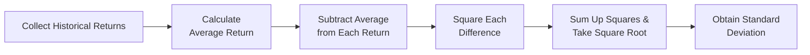

## 8.4 How to Measure Risk

Risk can be, well, a bit scary. Let’s face it: you put your money into an investment, and suddenly you’re thinking, “What if everything goes wrong?” Or maybe you’re just not sure how wild those market swings might get. In this section, we’re going to explore some of the most common ways that analysts, advisors, and institutions measure risk. By understanding these metrics, you’ll be better equipped to manage your own portfolio—or help clients manage theirs—and make calmer, more informed decisions.

Before we dive into the nuts and bolts, it’s worth remembering that risk itself is not necessarily bad. Risk is often the corollary to potential reward. In earlier sections of this chapter (see 8.1: What is Risk and Return?), the link between taking on higher uncertainty and possibly achieving higher returns was introduced. Here, we focus on how that uncertainty is actually measured—so you get a handle on the mechanics behind these risk metrics. Let’s jump in.

## Why Does Measuring Risk Matter?

You might wonder, “Is measuring risk just about a bunch of numbers?” Frankly, yes... but it’s more than that. The right metrics help you:

• Align your portfolio with your comfort level.  
• Identify if you’re being adequately compensated for the risk you’re taking.  
• Comply with guidelines set by regulatory bodies like CIRO in Canada.  
• Compare different investments on a risk-adjusted basis.

And if you’re a mutual fund sales representative, using proper risk measures can be a huge help when talking with clients. It’s one thing to say, “This fund is more volatile than that one,” but often, clients feel more comfortable when they see actual numbers.

## The Multifaceted Nature of Risk

Before we break down specific metrics, let’s remember that risk comes in different shapes and sizes:

• Market Risk: The overall risk of the market declining—think of how equities follow overall stock market trends.  
• Credit Risk: The possibility that a bond issuer or other counterparty might default.  
• Liquidity Risk: The risk of being unable to quickly sell or convert an asset into cash without a significant price drop.  
• Currency Risk: Fluctuations in exchange rates if you invest internationally.  
• Regulatory Risk: Changes in regulations or tax laws impacting your investments.

Measuring risk in your portfolio often starts with volatility—how much your returns vary from one period to the next. From there, we can expand into more advanced metrics that capture specific dimensions of risk, such as sensitivity to a benchmark (Beta) and worst-case scenarios (Value at Risk).

## Standard Deviation: The Classic Volatility Measure

Most risk textbooks kick things off with standard deviation, and for good reason. Standard deviation is like the “Swiss Army Knife” of risk measures—it’s widely used and relatively straightforward.

• Definition: Standard deviation quantifies how much the returns of an investment deviate from their average (mean) value over a specific time frame.  
• Interpretation: A higher standard deviation means the investment’s returns are more spread out (i.e., it’s more volatile). A lower standard deviation implies a tighter clustering around the average (i.e., it’s more stable).  

You’ll often hear something like, “Fund ABC has an annualized standard deviation of 15%.” This means that, in an average year, the fund’s return might deviate from its mean by plus or minus 15 percentage points.  

### Example: Standard Deviation in Action
Say you invest in a new technology fund. Over four years, its annual returns are: +20%, -5%, +25%, +10%. The average return is 12.5%. Now, each year’s return minus the average is +7.5%, -17.5%, +12.5%, and -2.5%. We square these differences, sum them, and take the square root, eventually arriving at the standard deviation. If that ends up around 15%, you know the fund can fluctuate significantly.  

### Visualizing Standard Deviation

Below is a simple Mermaid diagram illustrating how we conceptually use historical returns to calculate standard deviation:

In words, you gather returns, compute the average, measure each return’s difference from that average, square it, get the sum, and then take the square root of that sum (divided by the number of observations minus 1, if using sample standard deviation).

### Best Practices and Pitfalls
• Use a consistent time period (e.g., monthly returns over 3 or 5 years).  
• Be careful when comparing standard deviations across different time horizons.  
• Standard deviation doesn’t differentiate between upside and downside movements—it treats all volatility as risky.

## Beta: Measuring Market-Related Risk

If you’ve ever heard the phrase, “That stock is super sensitive to the market,” you're talking about Beta. Beta measures how an asset’s returns change relative to a benchmark index. In Canada, many funds compare themselves to the S&P/TSX Composite Index, but globally you might look at something like the S&P 500 or another relevant market index.

• Definition: A Beta of 1.0 means the investment moves in line with the benchmark. A Beta higher than 1.0 means it’s more volatile than the benchmark, and a Beta lower than 1.0 implies it’s less volatile.  
• Example: A Beta of 1.2 suggests that if the benchmark goes up 10%, your investment might be expected to go up 12%, on average—and vice versa if the benchmark declines.

### Why Beta Matters
Beta helps you figure out how your portfolio reacts to broad market swings. If a client is risk-averse, you might look for funds with a Beta significantly less than 1.0. Meanwhile, a more aggressive client might be comfortable with a Beta above 1.0 in search of outsized returns.

### Common Pitfalls
• Beta is based on historical data. Markets change, correlations shift, and a historical Beta may not accurately predict the future.  
• Beta doesn’t capture non-market risks well, such as liquidity or credit risk.

## Value at Risk (VaR): Worst-Case Scenarios

Value at Risk (VaR) is a more complex piece of machinery, typically used in institutional settings or by more advanced individual investors who want to measure potential losses over a specific time horizon with a certain degree of confidence.

• Definition: VaR at a 95% confidence interval over one month answers something like, “We’re 95% confident we won’t lose more than X dollars over the next month.”  
• Calculation Methods: Historical simulation, variance-covariance (parametric), and Monte Carlo simulations are common ways to arrive at VaR estimates.  

### Quick Illustration
Let’s say your VaR (95%, 1 month) is $10,000. That basically means, with a 95% confidence level, you shouldn’t expect your portfolio to lose more than $10,000 in one month. Of course, there is still a 5% chance of losing more than that. 

### VaR’s Limitations
• It doesn’t tell you how bad losses could be beyond that threshold. In other words, if you’re in that unlucky 5%, losses might be far bigger than $10,000.  
• VaR assumes a certain level of market stability that may not apply in extreme conditions (think 2008 global financial crisis).

Nonetheless, VaR can guide more advanced risk management frameworks, often in tandem with scenario analysis and stress testing.

## Sharpe Ratio: How Much Return per Unit of Risk?

Sometimes, it’s not enough to just measure volatility or worst-case scenarios. You also want to see if the returns you’re getting are worth it. Enter the Sharpe Ratio.

• Formula: Sharpe Ratio = (Portfolio Return – Risk-free Rate) / Portfolio Standard Deviation  
• Meaning: The Sharpe Ratio basically tells you how much excess return (above a risk-free investment like Treasury bills) you’re earning per unit of volatility.

### Example: Sharpe Ratio Applied
Imagine a fund returns 8% annually, while risk-free T-bills are yielding 2%. The standard deviation of the fund is 10%. Then:

Sharpe Ratio = (8% – 2%) / 10% = 0.60

In simpler terms, for every unit of volatility, the fund delivers 0.60 units of extra return above simpler, “safer” assets. The higher the Sharpe Ratio, the better your risk-adjusted performance.

### Common Pitfalls 
• Beware of time frames: You need an annualized version of both return and standard deviation if you want an annualized Sharpe.  
• The risk-free rate can fluctuate, so be consistent with your chosen baseline.  
• Sharpe ratios can be misled by short-term anomalies.

## Risk Tolerance Questionnaires and the KYC Link

Now, here’s something you might not see in a statistics textbook: the client side. Risk tolerance questionnaires are a staple in the Know Your Client (KYC) process, ensuring you respect CIRO’s guidelines when opening and managing mutual fund accounts. These questionnaires:

• Help quantify how comfortable a client is with the idea of losses (and gains).  
• Usually include questions about investment horizon, need for liquidity, and emotional response to market downturns.  
• Aid in segmenting a client’s risk level (e.g., conservative, balanced, aggressive).

### Example: A Client Conversation
Let’s say your client, Pat, gets an upset stomach at the thought of even a 5% portfolio drop. Clearly, a high-volatility fund might not be the best recommendation. In contrast, your client Jordan might be comfortable with a 15% swing if it means chasing bigger returns. The point is, numbers like standard deviation or Beta are extremely helpful, but they need to be aligned with the client’s personal comfort level.

## Putting These Risk Measures Together

In real-world portfolio construction, you’d typically look at a blend of:

1. Standard Deviation for basic volatility.  
2. Beta to gauge market sensitivity.  
3. Sharpe Ratio to see how well returns compensate for risk.  
4. VaR or stress tests if you want to explore worst-case losses.  
5. Client questionnaires to capture emotional and time-horizon factors.

It’s like building a jigsaw puzzle of risk. Or, if I can share a personal anecdote: I remember the first time I realized how complicated risk measurement could become—my friend started day trading tech stocks and would look only at Beta, ignoring the fact that standard deviation was going haywire. Long story short, Beta alone didn’t tell the whole story.

## Case Study: Balancing Risk in a Canadian Equity-Bond Portfolio

Let’s suppose we have a client with a portfolio split 50% in a Canadian equity mutual fund and 50% in a government bond fund. The equity fund might have:

• Standard Deviation: 12%  
• Beta: 1.1 (relative to the S&P/TSX Composite)  

Meanwhile, the bond fund:

• Standard Deviation: 4%  
• Beta: 0.2 (relative to the same equity benchmark)  

The combined portfolio’s risk would be lower than 12% standard deviation because of diversification. That’s the big reason we focus on building balanced portfolios (see 8.5: What is Portfolio Analysis?). If the equity portion soared or plummeted, the bond portion might move in a different fashion, smoothing the overall returns.  

In evaluating the portfolio, you’d also compute a portfolio Sharpe Ratio to see if the combined returns are worth the overall volatility, and maybe even run a basic VaR analysis to ensure your client is comfortable with the potential losses in a downturn.

## Common Pitfalls and Best Practices

• Overreliance on a Single Metric: Standard deviation alone might miss out on the “direction” of risk, while Beta might miss out on non-market risks.  
• Neglecting the Time Frame: Risk metrics can vary a lot depending on the period chosen. A 10-year measure might be very different from a 1-year measure.  
• Market Shifts: Betas and correlations can change in periods of extreme market stress. Don’t assume the past always predicts the future.  
• Communication Errors: Failing to explain numbers clearly to clients can lead to misconceptions. Risk is often emotional as well as mathematical.

## A Note on Regulatory Considerations

In Canada, risk presentations to clients are influenced by rules and guidelines set by CIRO, which, as of 2023, oversees both mutual fund dealers (formerly the MFDA) and investment dealers (formerly IIROC). Mutual fund representatives should ensure they:

• Provide accurate, up-to-date risk data to clients.  
• Clarify that historical metrics do not guarantee future performance.  
• Adhere to CIRO’s expectations for transparency and clarity in performance reporting.  

Following these guidelines helps keep your practice aligned with current regulations while building trust and credibility with clients.

## Technical Tools and Further Reading

If you’re a data geek at heart (like me), you might want to dive deeper using programming languages to calculate risk metrics. Here are a few open-source tools:

• Python (NumPy, Pandas, and SciPy libraries): Excellent for calculating standard deviation, Beta, VaR, and Sharpe Ratios.  
• R (PerformanceAnalytics package): A go-to for advanced portfolio analytics.  
• Online Data Sources: Yahoo Finance, Google Finance, or specialized data providers for quick risk stats like daily returns, Beta, and more.

### Books & Articles
• “Quantitative Investment Analysis” by Richard A. DeFusco, Dennis W. McLeavey, et al. (CFA Institute)  
• CFA Institute’s “Quantitative Methods” modules  
• Regular CIRO bulletins (https://www.ciro.ca) to stay on top of compliance updates  

## Bringing It All Together

Measuring risk involves a balance of statistics, market insight, client psychology, and compliance knowledge. Standard deviation, Beta, Sharpe Ratio, and VaR each illuminate a different slice of the risk “pie.” When combined—and aligned with the client’s risk tolerance—these metrics can provide a robust framework for building portfolios that are both responsible and tailored to long-term goals.  

Remember, the numbers don’t operate in a vacuum. They need the human element: your judgment, your client’s story, and a robust conversation about what risk really means. Keep refining these conversations, keep learning from real-world market events, and you’ll get better at guiding your clients (or yourself) through the ups and downs of investing.

So that’s it—our in-depth look at how to measure risk. Next time someone talks about “volatility” or “Beta,” you’ll have some context behind the conversation. And if you ever catch yourself on the verge of panic—like the moment you open your online trading account during a market dip—remember: these metrics are there to help you plan, not panic.

-----

## Quiz: Mutual Fund Risk Quiz: Boost Your Risk Insights



### Which of the following statements best describes standard deviation in investment analysis?

- [x] It measures how widely returns fluctuate around their average value.
- [ ] It estimates the maximum probable loss at a specific confidence interval.
- [ ] It indicates the sensitivity of an investment’s returns to the market.
- [ ] It calculates the ratio of excess returns to volatility.

> **Explanation:** Standard deviation tells you how much returns deviate from the mean, reflecting the investment’s volatility.

### Which measure shows how an investment’s returns move relative to a benchmark index?

- [ ] Sharpe Ratio
- [ ] Standard Deviation
- [x] Beta
- [ ] Value at Risk (VaR)

> **Explanation:** Beta measures the sensitivity of an asset’s returns relative to a chosen benchmark, commonly an index like the S&P/TSX Composite.

### If an investment fund has a Beta of 1.2 relative to its benchmark, how is it expected to behave when the benchmark rises by 10%?

- [ ] It might drop by 10%.
- [x] It might rise by about 12%.
- [ ] It won’t change at all.
- [ ] It will move in the opposite direction of the benchmark.

> **Explanation:** Beta of 1.2 suggests the fund is more sensitive to market movements, so a 10% rise in the benchmark may correspond to a roughly 12% rise in the fund.

### What does Value at Risk (VaR) aim to quantify?

- [ ] The average annual return of a portfolio over five years
- [x] The potential maximum loss over a given time period at a specified confidence level
- [ ] The ratio of portfolio returns to the risk-free rate
- [ ] The correlation between two different asset classes

> **Explanation:** VaR measures the potential loss within a confidence interval (e.g., 5%) over a given time frame.

### In the Sharpe Ratio formula (Portfolio Return – Risk-free Rate) / Portfolio Standard Deviation, the denominator represents:

- [ ] The cost basis of the investment
- [x] The volatility of the portfolio’s returns
- [x] The standard deviation of the portfolio’s returns
- [ ] The probability of a negative return

> **Explanation:** The denominator is the portfolio’s standard deviation, which serves as the measure of total risk.

### Which of the following best summarizes the limitation of using standard deviation as the sole risk metric?

- [x] It treats upside and downside volatility equally.
- [ ] It tells you how a fund moves relative to an index.
- [ ] It has a time horizon built into the calculation.
- [ ] It measures the worst-case scenario at a certain confidence level.

> **Explanation:** Standard deviation includes both positive and negative fluctuations, not distinguishing “good volatility” from “bad volatility.”

### Why is it important for mutual fund representatives to use risk tolerance questionnaires?

- [x] To align a client’s comfort with volatility to appropriate investment choices
- [ ] To calculate VaR precisely
- [x] To understand historical fund performance
- [ ] To ensure the market index is the correct benchmark

> **Explanation:** Risk tolerance questionnaires help quantify a client’s willingness to handle volatility and guide suitable fund recommendations.

### A Sharpe Ratio can be misleading if:

- [x] It is based on non-annualized returns but compared to an annualized risk-free rate.
- [ ] It uses a consistent time period for both returns and standard deviation.
- [ ] It includes the risk-free rate in the calculation.
- [ ] The portfolio invests primarily in government securities.

> **Explanation:** Sharpe Ratios need consistent annualization for the time frame of returns and the standard deviation. Inconsistency can lead to an incorrect ratio.

### Which of the following statements about Beta is correct?

- [x] A high Beta may indicate higher sensitivity to market movements.
- [ ] Beta is primarily used to measure potential worst-case losses.
- [ ] Beta cannot exceed 1.0.
- [ ] Beta completely replaces the need to calculate standard deviation.

> **Explanation:** Beta measures how strongly an asset follows or amplifies market movements. It can exceed 1.0, indicating above-average sensitivity.

### True or False: VaR provides insight into the maximum possible loss an investor could face with 100% certainty.

- [x] True
- [ ] False

> **Explanation:** Actually, this statement is tricky. VaR provides an estimate of possible losses within a specific confidence interval (like 95% or 99%), not a 100% guarantee. So it reveals a probable worst-case scenario, but not an absolute maximum for every situation.  


