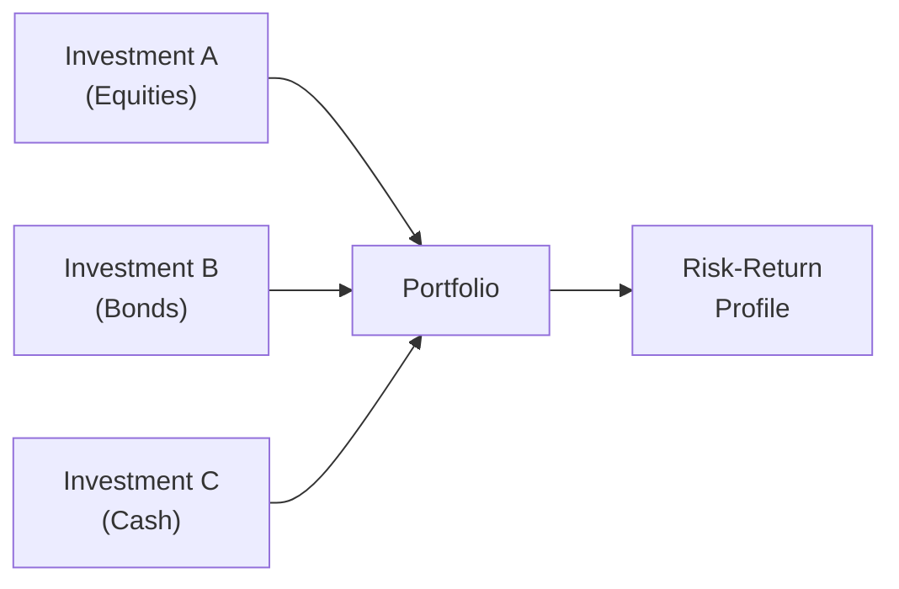

## 8.5 What is Portfolio Analysis?

When we talk about portfolio analysis, we're really looking at how all the pieces of an investment portfolio—like stocks, bonds, cash instruments, and sometimes fancy alternatives—work together to affect overall risk and return. It’s a bit like organizing a kitchen: each utensil or ingredient has its own purpose, but you’ve got to make sure everything combines well to create a great dish. In financial terms, good portfolio analysis ensures that the sum of your investments meets your client’s big-picture goals.

Some years ago, I realized that just picking my favourite stocks wasn’t enough. I had a portfolio of mostly technology companies, all super exciting—but when that sector dipped, I felt the full weight of the market’s downturn. That’s actually what led me to study portfolio analysis more seriously. By blending investments from different asset classes and sectors, I saw less stomach-churning volatility. Let’s walk through those core ideas in an easy-to-digest way.

## The Essence of Portfolio Analysis

Portfolio analysis is essentially the practice of examining the relationships between various investments in a portfolio and how they interact to produce an overall risk-return profile. A few main goals include:

• Identifying if the portfolio’s total risk is appropriate for the investor’s objectives.  
• Making sure no single investment or sector is overshadowing the rest (especially if it’s volatile).  
• Checking if the portfolio mix is poised to deliver on expected returns in line with the client’s risk tolerance.

One big advantage of analyzing a portfolio rather than each investment on its own is that you get a sense of how these holdings behave together. Maybe two bond funds are more correlated than you thought, or that equity fund you liked is ironically providing the same exposure as another fund in the same sector. Without a holistic approach, you might accidentally double down on a single exposure.

## Understanding Diversification

Diversification is the straightforward idea of “not putting all your eggs in one basket.” The reason it’s so important is that different asset classes and sectors don’t generally soar or swoon all at once. If you spread your investments across a variety of buckets—like Canadian equity, global equity, bonds, real estate investment trusts (REITs), and cash—you reduce your exposure to any single downturn.

It’s helpful to separate risk into two broad types:

• Systematic Risk: This is the market-wide risk that affects nearly all assets—think interest rates, global recessions, or pandemics. You can’t fully escape these.  
• Unsystematic Risk: This is specific to a company, sector, or region—like a mining strike that sinks a particular stock, or a technology regulation that hits one industry segment. You can lessen this type of risk by diversifying your portfolio.

When you hold a diverse mix of assets, you’re tackling the unsystematic risk. But remember, even the best diversification can’t eliminate systematic or market risk. That’s why factoring in a client’s ability to stomach broad market swings is so crucial.

## The Role of Correlation

Correlation is just a fancy word for how two investments move relative to each other. If their correlation is close to +1, they move nearly in lockstep (when one goes up, so does the other). If correlation is near -1, they move in opposite directions (when one goes up, the other goes down). If correlation is around zero, they are basically independent.

Here’s the mathematical definition of correlation (ρ) between two assets, A and B:


\rho_{A,B} = \frac{\mathrm{Cov}(A,B)}{\sigma_A \cdot \sigma_B}


• Cov(A,B) is the covariance between A and B.  
• σA and σB are the standard deviations (volatilities) of A and B.  

But so many times, we don’t have to do the math by hand. Modern data analytics platforms, even free sites like Yahoo Finance or Google Finance, can quickly spit out correlation estimates for your chosen investments. If you see two funds hugging close to +1 correlation, it’s probably time to broaden your horizons and find something that can do more to offset that risk.

Picking investments with low or negative correlation can reduce overall portfolio volatility. Just imagine a seesaw—when one end goes down, the other comes up, keeping the overall system balanced.

## Asset Allocation: Balancing the Mix

Asset allocation means you’re deciding how to split a client’s total investment money across different asset classes (like equities, fixed income, and cash). This is widely viewed as one of the most important decisions an investor can make. Studies regularly show that asset allocation, rather than individual security selection, has the biggest impact on portfolio performance over the long haul.

Some typical asset classes include:

• Equities (e.g., Canadian, U.S., global).  
• Fixed Income (e.g., government bonds, corporate bonds, mortgage funds).  
• Cash and equivalents (e.g., treasury bills, money market funds).  
• Alternative Investments (e.g., hedge funds, real estate, private equity, or more accessible “liquid alternatives” like certain ETFs).

The proportion in each category might vary based on the client’s age, risk tolerance, time horizon, and goals. For instance, a 25-year-old might handle a 70% equity exposure because they have time to ride out the market’s ups and downs. Meanwhile, a retiree could opt for a more balanced or conservative approach, adding a heavier allocation to bonds or other lower-volatility funds.

## Modern Portfolio Theory (MPT)

Much of what we understand about portfolio analysis stems from Modern Portfolio Theory (MPT). This theory states that for any given level of risk, there is an optimal portfolio construction that maximizes expected return. Alternatively, if you’re aiming for a particular return, MPT helps you find the portfolio composition with the lowest possible risk.

Simply put, MPT helps us see that combining assets that have lower correlations to one another can lead to a smoother ride for the total portfolio. It’s all done through some fairly sophisticated algorithms, but the gist is:

• Don’t rely on a single star performer.  
• Look for diversifiers that can help cushion losses when one part of the portfolio experiences a dip.  
• Identify an “efficient frontier” of portfolios that either optimize return for a certain level of risk or minimize risk for a certain level of expected return.

Fun fact: The concept that “not all risk is rewarded” comes from this very framework. Systematic risk (market-wide) might generate returns for taking on volatility, but unsystematic risk generally doesn’t “pay” you extra. You can reduce it, so why not?

## Client-Level Portfolio Analysis

As a mutual fund representative, you’re probably responsible for ensuring that each client’s portfolio meets their specific profile. That’s where a thorough Know Your Client (KYC) process merges into portfolio analysis. You use KYC to gather details about your client’s:

• Investment objectives (e.g., growth, income, capital preservation).  
• Time horizon (short, medium, long).  
• Risk tolerance (from conservative to aggressive).  
• Financial circumstances and personal preferences.

With this info—and guided by the rules and guidelines set forth by the Canadian Investment Regulatory Organization (CIRO) and the Canadian Securities Administrators (CSA)—you can piece together a combination of funds that aligns.

Occasionally, you’ll also want to do a portfolio review. Life events, such as a new job, marriage, or an unexpected windfall, can change your client’s objectives. Or maybe they just want a different balance between risk and return. By updating their portfolio, you’re optimizing for their new reality while still leveraging the principles of diversification and correlation to keep risk in check.

## A Quick Case Study: Blending Tech Stocks and Utility Bonds

Picture an investor named Lisa who absolutely loves technology. She’s got a few tech equity funds that have done pretty well. However, when interest rates started climbing, technology stocks often felt the heat in the short term. Her portfolio’s volatility soared, making her a bit uneasy.

After a little analysis, you find out she’s got almost 80% of her money in that one sector. That’s a recipe for discomfort. So you suggest shifting some of that allocation into a Canadian fixed-income fund focusing on stable utility companies and government bonds. Now, the correlation between high-growth tech funds and stable utility bonds tends to be fairly low (sometimes even negative in certain market conditions). As a result, Lisa’s overall portfolio volatility goes down. And ironically, her expected long-term return might be more stable because it’s not as reliant on just one type of industry’s success.

Such a shift doesn’t mean Lisa’s giving up on her beloved tech. Rather, she’s adding “balance” so that day-to-day fluctuations in tech stocks won’t send her entire portfolio gyrating.

## Visualizing Portfolio Composition

Below is a basic Mermaid diagram showing how different investments can feed into an overall portfolio and collectively determine the risk-return profile:

In this simplified view, each asset class flows into the portfolio, which ultimately determines the overall risk-return trade-off.

## Regulatory Guidance and Best Practices

Under Canadian securities laws, the main objective is to protect investors and maintain fair, efficient capital markets. CIRO (the Canadian Investment Regulatory Organization, which came into existence after the amalgamation of the MFDA and IIROC on January 1, 2023) supervises both mutual fund and investment dealers across Canada. CIRO’s rules, combined with the CSA’s national instruments, shape much of the regulatory environment.

Key points include:

• Suitability Determination: Representatives must ensure the investments in a client’s account are suitable given the client’s personal and financial circumstances.  
• Know Your Client (KYC): You gather essential facts about your client before making any recommendations.  
• Ongoing Monitoring: Just because an investment was right at one time doesn’t mean it will be forever. Periodic reviews are essential.

By integrating portfolio analysis into your client reviews, you can better meet CIRO’s expectations for suitability and help your client remain aligned with their investment objectives.

## Helpful Tools and Resources

Luckily, you don’t have to build entire spreadsheets from scratch—though you certainly can if you love Excel. Many open-source or commercial tools can assist with portfolio analysis. Here are a few:

• Morningstar Portfolio X-Ray: Lets you examine the underlying holdings of mutual funds and figure out potential overlaps or concentration areas.  
• Free Trackers: Yahoo Finance, Google Finance, and other sites let you create watchlists or track performance, correlation, and basic stats.  
• CSA Instruments and Notices: The Canadian Securities Administrators often publish guidance on acceptable fund structures, risk classification, and disclosure practices, found on various provincial securities commissions’ websites.  
• CIRO: Visit https://www.ciro.ca for up-to-date bulletins, rule changes, and guidance on KYC, suitability, and other compliance matters.  
• “Modern Portfolio Theory and Investment Analysis” by Edwin J. Elton and Martin J. Gruber: A classic text if you want to dive deeper into the mathematics and theory behind portfolio construction.

## Common Pitfalls and How to Avoid Them

• Over-concentration: Even if you think a particular sector is a winner, putting all your chips on one area can backfire if the market surprises you.  
• Ignoring Correlation: Not all “different” assets are truly different. If they’re highly correlated, you might not be as diversified as you believe.  
• Failing to Rebalance: Over time, winners can take up too big a share of the portfolio, changing its risk profile. Periodic rebalancing keeps your asset mix aligned.  
• Letting Emotion Take Over: Fear and greed can lead to impulsive decisions. Sticking to a disciplined portfolio analysis process helps keep you on track.

## Glossary Recap

Diversification: Holding a variety of investments to reduce exposure to any single asset or sector.  
Correlation: A statistical measure of how two assets move in relation to one another.  
Asset Allocation: The process of distributing investments across various asset classes to achieve diversification and balance.  
Systematic Risk: Market-level risk that can’t be fully diversified away (e.g., recessions).  
Unsystematic Risk: Risk specific to a particular company or sector, which can be mitigated through diversification.

## Encouragement to Keep Exploring

So that’s the quick overview on portfolio analysis—how you piece together multiple investments so they work in harmony (or at least don’t turn into chaos!). You may find it intricate at first, but the payoff in terms of client satisfaction, reduced volatility, and achieving financial goals is huge. The best part: you don’t need to do it alone. Use the tools. Consult with mentors. And definitely connect with your clients to make sure their evolving needs are consistently reflected in their portfolio strategies.

No matter how fancy or simple your approach, the key takeaway is that portfolio analysis is all about synergy. It’s a dynamic process that evolves with market changes and your client’s personal life changes. Keep an open mind, stay curious, and you’ll keep adding value as a trusted financial professional.

---

## Ten Powerful Questions on Portfolio Analysis for High-Impact Results



### Which statement best describes the overall goal of portfolio analysis?

- [ ] To select only the highest-risk assets to achieve rapid growth
- [x] To examine how different investments interact so the entire portfolio aligns with the investor’s objectives
- [ ] To eliminate market risk entirely by focusing on unsystematic risk
- [ ] To concentrate all resources into one high-performing asset

> **Explanation:** Portfolio analysis looks at how the various investments in a portfolio fit together, considering their correlations and risk profiles, to meet the client's overall investment goals.

### Which risk can be reduced through diversification?

- [ ] Systematic risk
- [ ] Inflation risk
- [x] Unsystematic risk
- [ ] None of the above

> **Explanation:** Unsystematic risk (company or industry-specific risk) can be reduced by holding a range of securities or funds. Systematic risk impacts the entire market and cannot be fully diversified away.

### How does correlation influence portfolio construction?

- [ ] Assets with strong positive correlations always reduce portfolio risk
- [ ] Correlation has no effect on portfolio returns
- [x] Low or negative correlation between assets can help reduce overall portfolio volatility
- [ ] Zero correlation means assets will move in exact opposition

> **Explanation:** When two assets have a low or negative correlation, one may go up while the other goes down, smoothing overall volatility.

### What is the principle behind Modern Portfolio Theory (MPT)?

- [x] Optimizing asset allocation to maximize return for a given level of risk
- [ ] Concentrating on a single high-performance sector for best returns
- [ ] Eliminating all forms of risk by using risk-free assets
- [ ] Always choosing the highest dividend-paying stocks to minimize risk

> **Explanation:** MPT states that for every level of risk, there’s an optimal combination of assets (the efficient frontier) that maximizes expected returns.

### Which of the following is an essential factor when deciding on asset allocation for a client?

- [x] The client's investment objectives and time horizon
- [ ] The immediate market trend only
- [x] The client's risk tolerance
- [ ] The commission structure primarily

> **Explanation:** Asset allocation decisions must align with the client’s goals, time horizon, and willingness to accept risk. Commissions are relevant but not the most critical factor.

### When might a portfolio need rebalancing?

- [x] Whenever an asset class grows or shrinks substantially, changing the intended allocation
- [ ] Only if the client complains about returns
- [ ] Once every 10 years, regardless of market conditions
- [ ] When a new stock becomes popular on social media

> **Explanation:** Rebalancing is the process of realigning assets to the target mix when one portion has grown or shrunk significantly beyond tolerance levels.

### Which Canadian regulatory body oversees mutual fund dealers and investment dealers?

- [x] CIRO (the Canadian Investment Regulatory Organization)
- [ ] The defunct MFDA
- [x] Also guided by CSA frameworks
- [ ] No regulatory body exists

> **Explanation:** As of January 1, 2023, the MFDA and IIROC amalgamated to form CIRO, which is now Canada’s national self-regulatory organization, operating alongside CSA guidelines.

### Which scenario might indicate over-concentration in a portfolio?

- [ ] Holding a mix of Canadian and U.S. equities, corporate bonds, and cash
- [ ] Having a small amount of many uncorrelated assets
- [x] Allocating 80% of funds to just one sector or industry
- [ ] Periodically rebalancing to maintain target allocations

> **Explanation:** Over-concentration happens when too large a share of the portfolio is in one asset or sector, leaving it vulnerable to sector-specific downturns.

### How does re-examining a client’s KYC information relate to portfolio analysis?

- [x] It updates any changes in the client’s life and risk tolerance, allowing for appropriate portfolio adjustments
- [ ] It’s done only once in a lifetime, so no impact on the portfolio
- [ ] It focuses exclusively on verifying the client’s identity to avoid money laundering
- [ ] KYC and portfolio analysis are independent processes

> **Explanation:** A significant change in financial situation, time horizon, or risk tolerance may require re-allocating or rebalancing assets accordingly.

### True or False: Low or negative correlation between portfolio assets tends to lower overall volatility.

- [x] True
- [ ] False

> **Explanation:** When two assets are not closely correlated, losses in one may be offset by gains in the other, reducing swings in total portfolio value.


