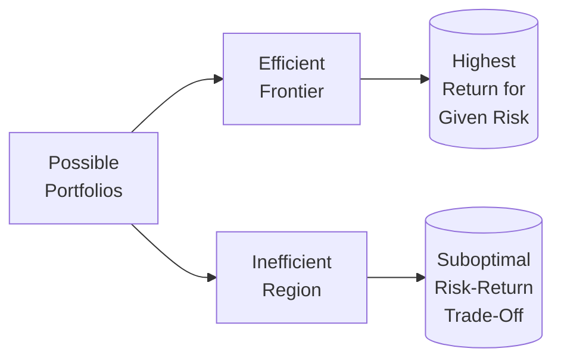

## 8.5 What is Portfolio Analysis?

Portfolio analysis is all about figuring out how various assets work together in a single investment portfolio to meet a client’s objectives. It’s not just about picking “good stocks” or “safe bonds.” It’s about combining different investments in a way that balances risks and returns, all while factoring in the investor’s preferences and constraints. By looking at correlations, expected returns, and potential volatility, we aim to optimize the entire portfolio rather than focusing on individual securities.

You might think, “Oh wow, that sounds complicated, right?” Well, yes and no. With technology, we can now use software tools that simulate different market scenarios. Also, frameworks like Modern Portfolio Theory (MPT) can provide a conceptual guide. That said, you’ll still need some good old-fashioned human judgment, especially when it comes to nuances like investment timelines, ethical ceilings, or even just personal feelings about certain sectors.

Below, we’ll discuss correlation, modern portfolio theory, capital asset pricing model (CAPM), the efficient frontier, ESG considerations, and more. Oh, and I’ll throw in an anecdote or two, because hey, real life is always a little messier than neat theoretical models.

--------------------------------------------------------------------------------

### The Core Idea of Portfolio Analysis

At its heart, portfolio analysis is the practice of measuring how each asset in a portfolio interacts with the others. That includes looking at each asset’s:

• Expected return – “How much might I earn from this investment?”  
• Risk or volatility – “How wild are those price swings?”  
• Correlation with other assets – “Do they zig when others zag, or do they move in tandem?”

#### Correlation

Correlation is basically a number ranging from –1 to +1:
• +1 means two assets move in lockstep.  
• 0 means they move independently.  
• –1 means they move in perfectly opposite directions.

If you have assets in your portfolio that have low (or negative) correlation with each other, your overall investment balance can become more stable. In jargon, we say that low correlation “diversifies” the portfolio. But in plain terms, if you own multiple investments that behave differently, you reduce the chance that everything gets hammered at once.

Let me share a quick personal anecdote: I once paired utility stocks (historically stable and less volatile) with emerging tech stocks (fast-moving and sometimes… a bit wacky). The correlation was quite low, so when my tech picks took a dive, my utility stocks stayed afloat, softening the blow. It was a real testament to the power of correlation analysis.

--------------------------------------------------------------------------------

### Modern Portfolio Theory (MPT)

Developed by Harry Markowitz (and built upon by many others), Modern Portfolio Theory provides a framework for choosing the optimal mix of investments. MPT starts with a crucial insight:

• Investors should not just look at the expected risk and return of one asset in isolation.  
• Instead, they should focus on how each asset changes the overall risk and return of the portfolio.

By combining multiple assets, the total risk can sometimes be reduced without affecting the expected return profile. This wonder of diversification is one of the core arguments for building a balanced portfolio of stocks, bonds, and potentially alternative assets. Yes, it might sound academic, but trust me, it’s super practical. If you’ve ever been relieved that not all of your holdings dropped simultaneously, you’ve already felt the benefits of MPT.

--------------------------------------------------------------------------------

### Capital Asset Pricing Model (CAPM)

The Capital Asset Pricing Model (CAPM) is closely linked to MPT. It helps predict the expected return on an asset based on its level of systemic (or market) risk, measured by something called “beta.” The equation often taught in finance courses goes like this:

E(Rᵢ) = Rf + βᵢ [E(Rm) – Rf]

Where:  
• E(Rᵢ) = Expected return on the investment  
• Rf = Risk-free rate (often the yield on government T-bills)  
• E(Rm) = Expected overall market return  
• βᵢ = Beta of asset i (a measure of how sensitive asset i is to market movements)

The main idea? The bigger the beta, the more market risk you’re taking, and the higher your expected return should be—compensation for that extra volatility. Now, CAPM has some criticisms in real-world application (markets can act irrationally, after all). But as a conceptual touchstone, it remains a powerful tool.

--------------------------------------------------------------------------------

### The Efficient Frontier

If you’ve heard of MPT, you probably know about the efficient frontier. In simple terms, the efficient frontier is a set of portfolios that offer the highest expected return for a given level of risk. Portfolios lying below the frontier are less than optimal (they provide neither the best returns nor the lowest volatility). Meanwhile, you can’t get better risk-adjusted returns than a portfolio that’s on the frontier itself—at least according to MPT.

Below is a simplified diagram showing how you might conceptualize the efficient frontier:

• The cluster of all possible portfolios is indicated on the left (A).  
• Only some of these portfolios align along the efficient frontier (B), achieving the best possible returns for each chosen risk level.  

--------------------------------------------------------------------------------

### Incorporating Qualitative Factors

While MPT and CAPM lean heavily on numbers and statistics, portfolio analysis isn’t purely quantitative. There are also qualitative elements:

• Management style: Passive indexing vs. active fund management.  
• Sector outlook: For instance, whether you believe the healthcare sector will grow or if renewable energy will outpace traditional fossil fuels.  
• ESG preferences: Some investors may refuse to invest in tobacco or firearms, even if the math says it could raise their returns. They might also seek out companies that practice sustainability or social justice.

These are just some real-life considerations that shape how you assemble portfolios. Even the best quantitative model can’t fully capture the emotional dimension of investing, or the personal constraints of a client with strong values.

--------------------------------------------------------------------------------

### ESG (Environmental, Social, and Governance) Considerations

ESG stands for Environmental, Social, and Governance. In recent years, client demand for sustainable and responsible investing has grown substantially. If your client wants to align their portfolio with social or environmental priorities, you’ll integrate ESG factors into your asset selection. This can modify “traditional” portfolio analysis in the following ways:

• Screening out certain stocks/bonds based on controversies or unethical practices.  
• Overweighting sustainable or socially responsible assets, even if they exhibit higher volatility.  
• Considering intangible benefits, like brand reputation and stakeholder relationships, which might not be fully reflected in short-term market data.

In Canada, you can find more information on sustainable finance at the Government of Canada’s sustainability portal (canada.ca/en/services/environment/conservation/sustainability.html). They have great resources on green bonds, climate-related disclosures, and more.

--------------------------------------------------------------------------------

### Portfolio Analysis Tools

Plenty of tools exist to run portfolio analytics and scenario testing. Brokerages like Questrade and Interactive Brokers offer built-in analytics. Third-party providers, both paid and open-source, can produce neat graphs showing how your chosen asset mix might fare under different economic climates. By changing inputs like expected return or volatility, you can see how a portfolio gets repositioned on the risk-return spectrum.

In Canada, securities professionals also rely on guidelines set by the Canadian Securities Administrators (CSA), which coordinate securities regulation across provinces and territories. These guidelines emphasize ensuring that recommended investments are suitable for clients’ objectives, means, and personal risk appetite (commonly known as Know Your Client or KYC obligations).

--------------------------------------------------------------------------------

### Scenario & Stress Testing

Portfolio analysis often involves running hypothetical scenarios—like a major recession or unexpected inflation spike—to see if your asset mix still meets the investor’s goals. For instance:

• If there’s a global downturn, do your recession-resistant assets balance losses elsewhere?  
• If interest rates spike, does the fixed-income portion lose less (or possibly more) than anticipated?

These “what-if” exercises help identify potential vulnerabilities and can be built into risk management strategies. They’re especially valuable for older clients in retirement who might not want to weather large downturns, or for younger clients with a high risk tolerance aiming for maximum growth.

--------------------------------------------------------------------------------

### Regulation and Compliance

Securities regulation in Canada falls under the umbrella of the CSA. The Canadian Investment Regulatory Organization (CIRO), established from the historical amalgamation of the Investment Industry Regulatory Organization of Canada (IIROC) and the Mutual Fund Dealers Association of Canada (MFDA), requires registered representatives to perform thorough analyses of clients’ investment profiles. While MPT, CAPM, and correlation analysis are not directly enforced by regulation, they’re often considered best practices to ensure suitability.

The Canadian Investor Protection Fund (CIPF) remains Canada’s sole investor protection fund as of January 1, 2023. It offers coverage if a member firm goes insolvent and you lose access to your accounts. Even though CIPF is independent from CIRO, both organizations emphasize investor protection and the importance of robust portfolio analysis.

--------------------------------------------------------------------------------

### Building a Diversified Portfolio: A Simple Illustration

Let’s look at a basic (hypothetical) example to see how portfolio analysis might work in practice:

1. Asset Classes:  
   • Canadian Equity  
   • U.S. Equity  
   • Global Fixed Income  
   • Real Estate Investment Trusts (REITs)

2. Expected Return and Volatility:  
   • Suppose an annual expected return of 6% for Canadian Equity, 7% for U.S. Equity, 3% for Fixed Income, and 5% for REITs.  
   • Volatility varies: 12% for Canadian Equity, 14% for U.S. Equity, 5% for Fixed Income, and 10% for REITs.

3. Correlations:  
   • Canadian vs. U.S. Equity might be 0.80 (they move in the same general direction).  
   • Equity vs. Fixed Income might be –0.10 (they offset each other slightly).  
   • U.S. Equity vs. REITs might land around 0.50.

4. Constructing the Portfolio:  
   • You might allocate 30% to Canadian Equity, 30% to U.S. Equity, 30% to Fixed Income, and 10% to REITs.  
   • Then you run this through your portfolio analysis tool to see if the overall risk-return mix lands where you want.  
   • If the correlation between certain assets is too high, you might incorporate more global equity or alternative assets like commodities for better diversification.

Admittedly, this is a simplified snippet. But it gives you a sense of how risk and return interplay. And it underscores the power of correlation in shaping the portfolio’s overall stability.

--------------------------------------------------------------------------------

### Incorporating Client Constraints

Finally, remember that real-world clients have more than just financial goals. They may have ethical or religious preferences, varying levels of financial sophistication, or even strong biases (positive or negative) toward specific industries. Some might simply say, “I never want to see more than a 10% dip in my portfolio’s value,” while others might be comfortable with bigger swings for the chance of bigger returns.

Balancing these considerations is as much an art as it is a science. And that’s where portfolio analysis can shine: you methodically test different asset mixes to see which best meets the client’s constraints while still offering the potential for good returns.

--------------------------------------------------------------------------------

### Key Takeaways

• Portfolio analysis looks at the entire mix of securities, focusing on risk, return, and correlation.  
• Modern Portfolio Theory (MPT) and the Capital Asset Pricing Model (CAPM) provide a conceptual framework for combining assets.  
• The efficient frontier visualizes portfolios with the best possible risk-return trade-off for each level of risk.  
• Qualitative factors (management style, sector outlook, and ESG or ethically driven mandates) also matter.  
• Tools for scenario testing and stress analysis help gauge how portfolios might respond to real-world shocks.  
• Compliance with regulations—particularly your KYC and suitability obligations under CIRO oversight—ensures these analyses remain client-focused.

--------------------------------------------------------------------------------

### Glossary

• **Correlation:** A statistical measure that describes the extent to which two assets move in relation to each other.  
• **Modern Portfolio Theory (MPT):** A framework for assembling a portfolio of assets such that the expected return is maximized for a given level of risk.  
• **Capital Asset Pricing Model (CAPM):** A model describing the relationship between systematic risk and expected return for assets, especially stocks.  
• **Efficient Frontier:** The set of optimal portfolios that offer the highest expected return for a defined level of risk.  
• **ESG (Environmental, Social, Governance):** Criteria used to evaluate a corporation’s ethical impact and sustainability practices.

--------------------------------------------------------------------------------

### References and Further Exploration

1. **CIRO** – Canada’s self-regulatory organization for investment and mutual fund dealers. Explore regulations and guidance at:  
   https://www.ciro.ca  
2. **Canadian Securities Administrators (CSA)** – For guidelines on investment suitability and client disclosure.  
   https://www.securities-administrators.ca/  
3. **Modern Portfolio Theory and Investment Analysis** – Elton, Gruber, Brown, and Goetzmann (classic reference).  
4. **Open-Source Portfolio Tools** – Tools like Portfolio Visualizer or risk analytics libraries in Python (e.g., PyPortfolioOpt).  
5. **Sustainable Finance Resources** – Government of Canada’s website:  
   canada.ca/en/services/environment/conservation/sustainability.html

--------------------------------------------------------------------------------

## Test Your Knowledge: Portfolio Analysis Essentials



### 1. Which of the following best describes correlation in the context of portfolio analysis?

- [ ] A measure of how quickly two assets rise in price.  
- [x] A statistical measure of how two assets move in relation to each other.  
- [ ] A model that predicts the future value of an individual asset.  
- [ ] A theory that explains interest rate movements.  

> **Explanation:** Correlation measures how closely two assets’ returns move together, from –1 (opposite directions) to +1 (same direction).

### 2. Which concept provides a framework for assembling a portfolio to achieve the highest expected return for a given level of risk?

- [x] Modern Portfolio Theory (MPT)  
- [ ] Capital Asset Pricing Model (CAPM)  
- [ ] Efficient Market Hypothesis (EMH)  
- [ ] Multiple Regression Analysis  

> **Explanation:** Modern Portfolio Theory focuses on optimizing a portfolio’s risk and return by considering how assets interact with each other.

### 3. In the Capital Asset Pricing Model (CAPM), which variable represents the sensitivity of an asset to overall market movements?

- [ ] Alpha  
- [x] Beta  
- [ ] Standard Deviation  
- [ ] Correlation  

> **Explanation:** "Beta" measures how much an asset moves relative to the overall market. A beta greater than 1.0 suggests greater volatility than the market.

### 4. True or False: Portfolios on the “efficient frontier” are suboptimal because they sacrifice return for lower volatility.

- [ ] True  
- [x] False  

> **Explanation:** The efficient frontier represents portfolios offering the best possible expected return for a given level of risk.

### 5. Which of the following statements about low or negative correlations between assets is correct?

- [x] They help reduce overall portfolio risk when combined.  
- [ ] They guarantee higher returns for the portfolio.  
- [x] They may prevent extreme losses in sudden market downturns.  
- [ ] They only apply to stocks within the same industry.  

> **Explanation:** Low or negative correlations reduce the chance that all assets decline simultaneously, thus moderating risk. They don’t guarantee higher returns, but they can help cushion losses.

### 6. ESG (Environmental, Social, and Governance) factors are most relevant to which aspect of portfolio analysis?

- [x] Qualitative considerations and ethical screens  
- [ ] Purely technical, price-based analysis  
- [ ] Beta calculations for asset pricing  
- [ ] Risk-free rate selection  

> **Explanation:** ESG factors relate to the ethical and sustainability components of an investment, which influence qualitative screening and portfolio construction decisions.

### 7. Which regulator(s) in Canada emphasize(es) the importance of investor suitability and KYC obligations when constructing portfolios?

- [x] The Canadian Securities Administrators (CSA)  
- [ ] The Financial Industry Regulatory Authority (FINRA)  
- [x] The Canadian Investment Regulatory Organization (CIRO)  
- [ ] The Financial Conduct Authority (FCA)  

> **Explanation:** The CSA issues guidelines at the provincial and territorial levels. Meanwhile, CIRO oversees investment dealers in Canada. FINRA and the FCA are regulators in the U.S. and U.K., respectively.

### 8. In portfolio analysis, what does scenario testing typically involve?

- [x] Simulating market conditions like recessions or high inflation to see how a portfolio might respond  
- [ ] Calculating the server capacity for financial software  
- [ ] Predicting which factor will correlate best with the tech sector  
- [ ] Locking in returns once a year through a rebalancing mechanism  

> **Explanation:** Scenario testing involves creating hypothetical market environments to gauge potential portfolio outcomes under stress or extreme conditions.

### 9. Which of the following is an example of a qualitative consideration in portfolio analysis?

- [x] An investor’s desire to avoid tobacco stocks for ethical reasons  
- [ ] Calculating the standard deviation of monthly returns  
- [ ] Determining a stock’s beta factor  
- [ ] Finding a portfolio’s Sharpe ratio  

> **Explanation:** A preference for ethically screened assets is a qualitative factor and is not captured by purely statistical measures like standard deviation or Sharpe ratio.

### 10. Portfolios combining multiple asset classes with low or negative correlations can help mitigate extreme losses:

- [x] True  
- [ ] False  

> **Explanation:** When assets are less correlated, a decline in one asset class may be offset by relative stability or gains in another, potentially reducing the severity of losses.


