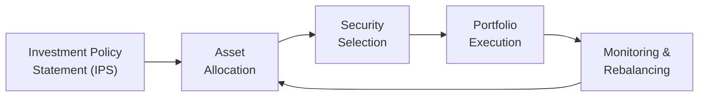

## 8.6 How are Portfolios Managed?

Sometimes I think back to my first experience watching someone manage an investment portfolio—my uncle had a stack of annual reports, sticky notes everywhere, and a few cups of coffee (okay, maybe a lot of coffee) as he dove into the markets. It seemed so complex, but once I asked him how he kept it all straight, he said, “Look, it’s like trying to cook a nice meal. First, figure out what you want to create, then pick the right ingredients, keep an eye on the stove, and adjust the spices to taste.” That’s essentially what portfolio management is about: you figure out your goals (the meal), select the assets (the ingredients), manage the process (cooking), then monitor and adjust (add a pinch of salt here, reduce the heat there) as needed.

Below, we’ll explore how portfolios are managed in both formal and practical ways within Canada’s regulatory environment, touching on active vs. passive strategies, the significance of an Investment Policy Statement (IPS), how rebalancing works, and much more. Let’s dig in, shall we?

--------------------------------------------------------------------------------

## Overview of Portfolio Management

Portfolio management is the ongoing process of overseeing and adjusting an investment portfolio to align with the client’s or investor’s objectives. There are countless approaches, but the idea is simple: create a plan, execute that plan, regularly check in, and then make the necessary tweaks to keep the portfolio on track. Remember the cooking analogy? You have a recipe, you gather your ingredients, start cooking, and along the way, you taste and adjust. The difference is that in investing, you have more than just taste to worry about—there’s risk tolerance, liquidity needs, regulatory compliance, tax implications, and oh yes, good old market volatility.

### The Importance of Setting Clear Objectives
Before we even get into the nuts and bolts, let’s talk about the “why” behind it all. Why are you investing? Are you saving for retirement in 30 years, planning to buy a home in five, or simply trying to preserve capital? Answering these questions upfront helps shape your approach. Failing to clarify objectives early on can lead to a misguided strategy, wasted fees, and possibly some sleepless nights.

### Canadian Context and the Regulatory Landscape
In Canada, we’ve got the Canadian Investment Regulatory Organization (CIRO) overseeing dealers, whether they deal in mutual funds, equities, bonds, or more sophisticated structures. Prior to 2023, the Mutual Fund Dealers Association (MFDA) and the Investment Industry Regulatory Organization of Canada (IIROC) were separate, but these defunct predecessor SROs have been integrated into CIRO as of June 2023. Additionally, the Canadian Investor Protection Fund (CIPF) provides coverage to clients of member firms in the event of insolvency.

CIRO’s rules and guidelines ensure that advisors follow Know Your Client (KYC) requirements. If you’re a mutual fund sales rep or an investor working with one, that KYC process becomes the backbone of building (and managing) your portfolio correctly. Anyway, let’s delve deeper into how the portfolio management phase actually works.

--------------------------------------------------------------------------------

## The Investment Policy Statement (IPS)

Let’s start with the foundation: The Investment Policy Statement (IPS). Think of the IPS as a roadmap or a little user’s manual for handling your portfolio. It outlines:

• Your investment goals and time horizons  
• Risk tolerance (i.e., how comfortable you are with downward market movements)  
• Asset allocation targets and constraints  
• Guidelines on when and how to rebalance  
• Any other constraints (e.g., regulatory, ethical, or liquidity concerns)

### IPS in Practice
If you’re a brand-new investor, you might look at your IPS as a “checklist” that you and your advisor create together: “I want 60% in equities, 40% in fixed income, with no more than 5% in any one stock, and I’m comfortable with moderate market swings.” This statement is your personal constitution for investing. Uncertain whether you can load up on a fast-rising tech stock? Check the IPS. Wondering if you should move some funds into more conservative bonds because your timeline changed? Again, check the IPS.  

Setting this up properly is crucial. And guess what? In Canada, failing to adhere to the guidelines you set can have compliance implications for your financial professional, because the rules around suitability and KYC are quite strict.

--------------------------------------------------------------------------------

## Active Management vs. Passive Management

You might have heard about “active” and “passive” as two big buzzwords in the investing world. Let’s break them down:

### Active Management
Active managers try to outperform a benchmark (like the S&P/TSX Composite) using research, market forecasts, and sometimes good old-fashioned gut instinct. Their mantra is alpha generation, which basically means you want to eke out better returns than the market by picking the “right” stocks or bonds at the “right” time. This can involve higher fees—hey, the managers need to get paid—and often entails higher turnover within the fund, which might come with tax implications.  

So is active management worth it? Sometimes yes, sometimes no. There are managers with a track record of beating their benchmarks. Others might underperform due to high fees or just plain old bad luck. In Canada, you can find actively managed mutual funds covering everything from Canadian small caps to global equity and all sorts of bond strategies. Many mutual fund sales reps keep a selection of these in their toolbox, but remember: no strategy is guaranteed.

### Passive Management
Passive management tries to replicate a particular market index with minimal trading. Index funds or ETFs (Exchange-Traded Funds) are great examples. If the S&P/TSX Composite goes up 10%, you can expect your passive fund to do about the same (minus small management fees). It’s fairly straightforward; fewer moves means fewer transaction costs, which can lead to lower fees over time.

Passive management is all about simplicity and cost-effectiveness. Legend has it (well, a well-documented story) that the late John C. Bogle championed this method with Vanguard in the United States, popularizing the idea that investors should just “buy the market” and stick with it. In Canada, you’ll find similar offerings that follow big Canadian indexes, like the S&P/TSX or certain bond indices.

### Active vs. Passive in a Nutshell
• Active: Potential to outperform, but higher fees and often involves more risk.  
• Passive: Lower fees and more predictable returns relative to a benchmark, but limited chance of beating that benchmark.

--------------------------------------------------------------------------------

## Rebalancing: The Ongoing Adjustment

Once you’ve laid out your IPS and chosen your strategy—active, passive, or a mix of both—you can’t just set it and forget it. Markets move, life happens (you get a raise, or maybe you unexpectedly need funds for an emergency), and your portfolio’s allocations drift from the initial plan. This is where rebalancing comes in.  

### Why Rebalance?
Markets can be like toddlers: enthusiastic and prone to volatility. If your equity portion surges ahead, it might become a bigger chunk of your portfolio than you intended; your risk could become uncomfortably high. Alternatively, if equity markets take a dip, you might end up overweight in bonds. Rebalancing is the process of selling a portion of what’s grown too large and buying more of what’s shrunk—ideally, you’re selling high and buying low.

### How Often to Rebalance?
Some folks rebalance on a strict time schedule (every six months or annually). Others wait until allocations deviate from targets by a certain percentage. For instance, if your target is 60% equities and 40% bonds, you might only rebalance once your equity portion hits 65% or drops to 55%. Some prefer a hybrid approach—whatever it is, the key is discipline.

### A Simple Example
Let’s say your target allocation: 60% equities, 40% fixed income. Over a year, equities spike and you end up at 70% equities, 30% fixed income. That might be more risk than you’re comfortable with. You sell some equities (a portion of the winners, presumably) and reallocate the proceeds into fixed-income instruments (which might now be comparatively cheaper). You’re back to 60/40. Congratulations, you have rebalanced!

--------------------------------------------------------------------------------

## Process Flow of Portfolio Management

Below is a simplified diagram, showing the continuous cycle of managing a portfolio, from writing the IPS to monitoring and rebalancing.

• Start with the IPS to outline objectives and constraints.  
• Decide on the right mix of asset classes (Asset Allocation).  
• Select specific securities, whether actively managed solutions, passively managed funds, or a combination (Security Selection).  
• Put your plan into motion with buys and sells (Portfolio Execution).  
• Continuously watch how it evolves (Monitoring & Rebalancing), then feed that information back into your allocations if they drift.

--------------------------------------------------------------------------------

## Practical Considerations

### Risk Management
Risk is an inherent part of investing, and we measure it by the volatility of returns, potential drawdowns, and more. In real life, if you can’t sleep at night because your equities are swinging 20% up and down every few weeks, that’s a strong sign your portfolio might be too aggressive for your comfort.

### Performance Measurement and Benchmarking
You often want to see how your portfolio is doing relative to some benchmark, like the S&P/TSX Composite or a balanced 60/40 index. If you’re using an active manager, you want to gauge if they’re adding alpha. If you’re passive, are you matching the index minus fees?

### Costs and Fees
Mutual funds can carry various fees, such as Management Expense Ratios (MERs) or front-end and back-end loads. If you’re paying an active manager, be sure to examine whether the outperformance (if any) justifies those extra costs. Passive funds often carry lower fees—just be certain you’re comfortable with a purely “market matching” strategy.

### Tax Implications
In taxable accounts, buying and selling triggers capital gains or losses. If you’re frequently rebalancing, you might face a higher tax burden, which can eat into returns. In registered accounts (like RRSPs, TFSAs, or other tax-deferred accounts), the immediate tax impact might be less of an issue. In other words, you should coordinate your rebalancing strategy with your tax strategy.

### Regulatory Compliance
Under CIRO’s oversight, both the representative and the firm must ensure every move aligns with the client’s KYC and suitability. The more you tailor the portfolio to the IPS and maintain that alignment, the better you comply with these rules. Also, keep in mind that CIPF coverage is there to protect client assets if a CIRO member firm fails financially, not from market fluctuation.

--------------------------------------------------------------------------------

## Choosing Between Active and Passive (or Both)

In practice, many investors adopt a “core-satellite” approach, where part of the portfolio (the core) is invested passively for broad market exposure, while smaller “satellites” are in active funds or specialized mandates (like small-cap or alternative funds) aiming to add alpha. This approach lets you dial in how much risk (and how many fees) you want to take chasing outperformance.

It also goes back to the concept of an IPS. If you’re extremely cost-sensitive, you might tilt heavily towards passive. If you strongly believe in a particular manager’s expertise or strategy, you could dedicate a portion to active. And remember that sometimes, the reason to go active is not just pure outperformance but also risk management strategies like dynamic asset allocation, hedging, or “tactical” moves that might help protect during market drawdowns.

--------------------------------------------------------------------------------

## Glossary of Key Terms

• **Active Management:** A strategy focused on outperforming specific benchmarks through selecting securities based on research or market timing.  
• **Passive Management:** A strategy aiming to achieve market returns at a lower cost, often by tracking an index.  
• **Alpha:** The excess return over a benchmark, attributed to the manager’s skill.  
• **Benchmark:** A standard index or measurement used for comparison of performance (e.g., S&P/TSX Composite).  
• **Rebalancing:** The process of realigning the weightings of assets in an investment portfolio to maintain target allocations.

--------------------------------------------------------------------------------

## Canadian Practice: Tools and Resources

• **CIRO (https://www.ciro.ca):** Canada’s national self-regulatory body overseeing investment dealers, mutual fund dealers, and market integrity on equity and debt marketplaces.  
• **Canadian Securities Institute:** Offers additional courses in portfolio management techniques, continuing education, and relevant designations.  
• **Mutual Fund Dealers Across Canada:** Many dealers now provide dashboards or online tools to facilitate automatic rebalancing, especially within managed account structures.  
• **Open-Source Tools & Frameworks:** Software like GNUCash, or Python-based libraries (e.g., PyPortfolioOpt), helps personal or small-scale managers experiment with portfolio optimization.  
• **Books & Articles:**
  - “The Little Book of Common Sense Investing” by John C. Bogle—classic reading advocating for passive investing.  
• **Online Courses:** “Portfolio Management” offerings on Coursera and edX can deepen your understanding of sophisticated strategies.

--------------------------------------------------------------------------------

## Tips, Pitfalls, and Best Practices

• **Stay Aligned to Your IPS:** Always check back with the objectives and constraints you documented. Changing your objectives? Then it’s time to update the IPS.  
• **Don’t Try to Time the Market:** Even the best managers can struggle with precise market timing. Develop a sensible plan, stick with it, and rebalance periodically.  
• **Keep an Eye on Fees:** High fees can drag on performance. Make sure you understand all embedded fees in your mutual funds or ETFs.  
• **Diversify, But Don’t Over-Diversify:** Excessive holdings can mean you might as well hold the entire index, but you’ll pay higher research or transaction costs in the process.  
• **Consider the Tax Angle:** If you’re holding certain funds in a taxable account, keeping turnover (and thus realized gains) low may give you a notable advantage over time.  
• **Review Periodically:** Your life changes (birth of a child, new job, nearing retirement), and the markets change, so keep reviewing your portfolio. However, avoid acting out of pure emotion.  
• **Remember the Human Element:** Emotions (fear, greed) can drive poor decisions. Sometimes it’s best to have a professional to help you keep perspective.  

--------------------------------------------------------------------------------

## Conclusion

When we talk about “How are portfolios managed?” the overarching theme is that this is a never-ending process of aligning, reviewing, and realigning your investments with the objectives you set out in your IPS. Whether you’re an ardent believer in active strategies (maybe you’ve found that star manager) or you’re a champion of passive (where you just “buy the market”), the key is to stay disciplined, stay informed, and never forget your risk tolerance or time horizon.  

And you know, once you get the hang of it, portfolio management starts to feel less like rocket science and more like a well-thought-out routine—kind of like how my uncle navigated the kitchen. There’s always a dash of artistry involved, but the fundamentals remain the same.  

After reading this section, I hope you feel motivated to fine-tune your own approach or guide your clients more confidently. Remember, there’s a wealth of resources out there—from CIRO’s website and CIPF coverage frameworks to advanced portfolio management courses. Keep exploring, keep learning, and stay aligned with prudent Canadian investing practices.

--------------------------------------------------------------------------------

## Test Your Knowledge on Portfolio Management Strategies and Rebalancing



### Which statement best describes the main goal of portfolio management?

- [ ] Maximizing tax liabilities by frequently trading.
- [x] Aligning investments with specific objectives and risk tolerance over time.
- [ ] Eliminating all forms of investment risk through diversification.
- [ ] Timing the market to ensure buying at absolute bottoms and selling at tops.

> **Explanation:** The primary aim of portfolio management is to help investors meet their objectives while respecting their risk tolerance and other constraints. Frequent trading or trying to time the market does not necessarily meet that goal.

### A primary distinction of active management is:

- [x] It seeks to outperform a benchmark through security selection and/or market timing.
- [ ] It always has lower fees compared to passive funds.
- [ ] It aims only to match market returns.
- [ ] It does not allow for investment in mutual funds.

> **Explanation:** Active management tries to generate alpha, which means it attempts to exceed benchmark returns. Passive management, on the other hand, typically focuses on matching a market index, often at lower fees.

### What key document outlines an investor’s objectives, risk tolerance, and constraints, serving as a roadmap for portfolio decisions?

- [ ] A tax slip.
- [ ] A standard stock certificate.
- [ ] A bank statement.
- [x] An Investment Policy Statement (IPS).

> **Explanation:** The IPS documents the investor’s objectives, constraints, and risk tolerance, guiding portfolio managers or advisors in decision-making.

### What is the main purpose of rebalancing a portfolio?

- [ ] To buy as many high-performing stocks as possible.
- [x] To restore the portfolio to its target allocation after market fluctuations.
- [ ] To remove the need for an Investment Policy Statement.
- [ ] To guarantee higher returns than the benchmark every year.

> **Explanation:** Rebalancing involves selling positions that have exceeded their target allocation and buying positions that have dropped below target, keeping the portfolio aligned with the investor’s risk profile.

### Which of the following is an advantage typically associated with passive management strategies?

- [x] Lower fees due to reduced trading and research costs.
- [ ] Guaranteed outperformance over actively managed funds.
- [x] Simplicity of matching benchmark returns.
- [ ] Complete protection against market downturns.

> **Explanation:** Passive strategies typically have lower fees because there’s less trading and research involved. They match, rather than beat, their chosen benchmark, so they're simple and cost-efficient.

### In the Canadian investing landscape, CIRO is responsible for which of the following?

- [x] Overseeing investment dealers, mutual fund dealers, and market integrity.
- [ ] Guaranteeing investor returns.
- [ ] Managing only private equity funds.
- [ ] Replacing the role of CIPF in protecting client assets.

> **Explanation:** CIRO (Canadian Investment Regulatory Organization) oversees investment dealers, mutual fund dealers, and market integrity for both equity and debt. CIPF is a separate (though related) entity providing insolvency protection.

### When might an investor consider modifying their Investment Policy Statement?

- [x] When there is a significant life event, such as getting married or approaching retirement.
- [ ] When the markets are temporarily volatile.
- [x] When the investor’s risk tolerance changes or goals shift.
- [ ] When the investor wants to avoid capital gains tax entirely.

> **Explanation:** Adjustments to the IPS are usually triggered by significant life events or changes in financial goals, constraints, or risk tolerance. Temporary market volatility is not necessarily a reason to alter the IPS.

### Which of the following best defines “alpha” in portfolio management?

- [ ] The broad market return.
- [x] The excess return of a portfolio relative to its benchmark, attributed to manager skill.
- [ ] A metric only used in passive management to track fees.
- [ ] The difference between fixed-income returns and equity returns.

> **Explanation:** Alpha measures how much the manager’s active decisions added (or subtracted) relative to a relevant benchmark, indicating manager skill.

### In order to diversify properly and mitigate unsystematic risk, an investor should:

- [x] Hold a variety of asset classes, sectors, or geographic regions in the portfolio.
- [ ] Concentrate all capital in a single equity that has recently outperformed.
- [ ] Allocate everything to short-term GICs for guaranteed returns.
- [ ] Avoid rebalancing so that winners become a larger part of the portfolio.

> **Explanation:** Diversification involves spreading investments across different asset classes or sectors to reduce the impact of any single underperforming area. Concentration in one stock or not rebalancing can lead to excessive risk.

### True or False: Passive management seeks to replicate a market index at a lower cost, and typically involves fewer transactions.

- [x] True
- [ ] False

> **Explanation:** Passive management tracks a broad market index, resulting in fewer trades compared to active management. This usually translates to lower fees and more predictable returns matching the market minus small expenses.


