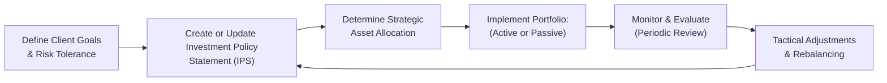

## 8.6 How are Portfolios Managed?

So let’s jump right into it—because, honestly, when people hear “portfolio management,” they often imagine rows of complicated spreadsheets, wild market swings, and very serious folks in suits talking about alpha, beta, and gamma. Sure, that can be part of it. But portfolio management can be surprisingly straightforward when you understand the core concepts. And trust me, these principles help clarify how our investments should be structured, monitored, and adjusted in real-life scenarios. In this section, we’ll explore active versus passive approaches, strategic and tactical asset allocation, the role of the all-important Investment Policy Statement (IPS), the implications of taxes and transaction costs, and how critical it is to keep tabs on changing objectives over time.

Feel free to cross-reference what we discussed about communicating with clients (see Chapter 4: Working with Clients) and ensuring the suitability of recommendations (see Chapter 6: Product Due Diligence, Recommendations, and Advice). Throughout this journey, we’ll weave in practical anecdotes, examples, and some real-world resources. Ready? Let’s go.

---

## Understanding Portfolio Management Basics

Portfolio management is all about constructing and maintaining the right mix of investments to help an investor reach their financial objectives, whether that means saving for retirement, funding a child’s education, buying a home, or even preserving wealth for future generations. From a regulatory standpoint in Canada, portfolio management also ties into the requirements set by the Canadian Investment Regulatory Organization (CIRO) that outline how investment representatives must handle managed accounts, fiduciary obligations, and ongoing suitability.

But before we get into those responsibilities and some time-tested best practices, let’s look at two of the biggest philosophical “camps” when it comes to managing investments: active and passive.

---

## Active Management vs. Passive Management

Did you ever watch elite sports teams competing for a championship and think, “Wow, I wonder if they have a special strategy to win?” That’s kind of what active management is like. The goal is to beat the average—often represented by a benchmark index—by relying on in-depth research, valuation techniques, and sometimes market timing.

On the other hand, passive management is more like deciding you don’t need to predict the champion at all but would rather mirror the entire league’s average performance. In this case, you buy shares mirroring an overall benchmark index, wait, and let the market do its thing. Let’s look closer at each one.

### Active Management

• Seeks to outperform market benchmarks (like the S&P/TSX Composite or the S&P 500) through security selection, market timing, or both.  
• Active managers often employ fundamental, technical, or quantitative analysis to pick individual stocks or bonds they believe have the best risk-return profile.  
• This approach can be effective, especially if the manager is skilled—but not guaranteed.  
• Active management also can carry higher fees, transaction costs, and taxes due to frequent trading (i.e., turnover).  

I remember a friend once boasting about an actively managed fund that doubled his money in just a few months. Super exciting, of course. But after fees, capital gains taxes, and a longer holding period, the results weren’t quite as striking. The point is: success stories do happen with active management, but the net return after costs must be carefully evaluated.

### Passive Management

• Purpose is to replicate the performance of a market index rather than beat it.  
• The approach often leads to lower costs, including reduced management fees and fewer transaction costs, since you’re not trading as often.  
• The performance typically tracks the chosen index fairly closely, minus fees and, in some cases, minimal tracking error.  
• Common vehicles include index mutual funds and exchange-traded funds (ETFs).  

You may have heard of robo-advisor platforms in Canada—like Wealthsimple or Nest Wealth—that primarily use passive approaches. They construct diversified portfolios of ETFs, automatically rebalance them, and keep client fees competitive. If you want a relatively hands-off approach (with a manager or system doing the routine tasks), passive strategies can be a nice fit.

---

## Strategic Asset Allocation

Imagine you’re packing for a long trip with different climates: you need T-shirts for the hot days, maybe a coat for colder climates, and a pair of nice shoes for a fancy dinner. Strategic asset allocation is like deciding in advance how much of each type of clothing (or asset class, in investment terms) you’ll bring to stay prepared in most situations.

• A long-term approach that sets target allocations for different asset classes (e.g., stocks, bonds, real estate, cash, alternatives) based on the investor’s risk tolerance, investment time horizon, and objectives.  
• The goal is to maintain this strategic mix over time, adjusting occasionally if it drifts too far from targets or if the client’s situation changes significantly.  
• This approach is generally grounded in Modern Portfolio Theory (MPT), which suggests diversification across asset classes optimizes the risk-return profile.  

In practice, you might say something like, “For the next 10 years, we’ll hold 60% in equities, 30% in fixed income, and 10% in alternative assets.” Or maybe you’re a more conservative type and decide to shift that ratio toward more bonds. The key is that this allocation is ideally documented in the Investment Policy Statement (IPS), which clearly guides how you’ll meet your investing goals for the long haul.

---

## Tactical Asset Allocation

Let’s say you’re on that same trip, but you hear last minute that your journey will coincide with a massive snowstorm. You might shuffle your clothing lineup and include heavier winter gear. That’s tactical asset allocation in a nutshell. You make short-term shifts (e.g., overweight equities briefly if you expect a market rally in the near future) to potentially capture some extra return.

• An attempt to capitalize on perceived short-term market opportunities.  
• Might involve rebalancing more frequently or holding more cash if a correction is expected.  
• Typically requires closer market monitoring, which can lead to higher transaction costs.  

Tactical asset allocation can be helpful, but it also can introduce more complexity and risk if not managed properly. One might overweight an asset class at exactly the wrong time. Always keep an eye on the bigger picture—your strategic goals—before making rapid adjustments.

---

## The Investment Policy Statement (IPS)

I once heard someone mention the IPS as an “investor’s compass.” It basically sets a direction so you don’t get lost in the daily noise of market swings. This document is the backbone of a solid portfolio management strategy.

• Outlines the investor’s objectives, constraints, and guidelines (like risk tolerance, liquidity needs, time horizon, and return requirements).  
• Clearly states roles, responsibilities, and rebalancing procedures, ensuring that everyone knows exactly what to do—especially in volatile or uncertain times.  
• Helps you (or your client) remain disciplined, reducing the temptation to stray from your plan based on emotion or short-term market noise.  

CIRO’s guidance on managed accounts strongly encourages having (and regularly reviewing) an IPS. By clarifying how you should invest and when it might be appropriate to make portfolio changes, the IPS reduces guesswork and fosters a transparent relationship between the advisor and the client.

---

## Portfolio Management Process Diagram

Below is a simple flowchart illustrating how some advisors view the overall portfolio management process. Think of it like a continuous cycle:

• A -> B: Identify the investor’s objectives, constraints, timeline, and risk tolerance, then create or refine the IPS.  
• B -> C: Based on the IPS, set your strategic asset allocation.  
• C -> D: Implement the portfolio—could be active, passive, or a blend.  
• D -> E: Ongoing monitoring of performance, changes in client goals, and market updates.  
• E -> F: Make tactical or minor adjustments if there are short-term opportunities or rebalancing needs.  
• F -> B: Revisit and update the IPS as client circumstances evolve.

---

## Transaction Costs, Taxes, and Turnover

Even the most brilliant portfolio strategy can be undermined by excessive transaction fees, taxes, and frequent portfolio turnover. This is sometimes overlooked, but let me tell you, it matters. Here’s why:

• Every time you buy or sell securities, you might incur commissions, bid-ask spreads, or administrative fees.  
• In non-registered accounts, capital gains taxes can arise, especially when you sell a security at a profit. Short-term gains can be triggered if you hold an investment for less than a year, though in Canada specifically, it’s typically the net realized capital gain during the calendar year that’s taxed.  
• High turnover is when you frequently swap in and out of positions. Active managers might do this if they see many short-lived opportunities. While it can sometimes boost returns, it can also eat away at performance if costs become too large.  

Check out Chapter 7: Trading, Settlement, and Prohibited Activities for more information on the mechanics of trading. Canada’s tax regimes and CIRO regulations (enforced under the modern 2025 environment you’re in) should also influence how frequently and in what manner trades are executed. Understanding the interplay of taxes, fees, and turnover is essential when deciding just how “active” you want to be.

---

## Ongoing Monitoring and Periodic Portfolio Reviews

An investment portfolio is never truly finished—it evolves along with the investor’s life situation, market dynamics, and broader economic trends. In that sense, portfolio management is a continuous responsibility, not a one-and-done exercise. Hence:

• Regularly scheduled reviews help ensure the allocation still lines up with the client’s risk tolerance and goals.  
• Performance should be measured relative to appropriate benchmarks (for instance, the S&P/TSX Composite for Canadian equities).  
• Don’t forget intangible shifts: maybe your client changed jobs or wants to retire earlier, or perhaps their health situation changed. All these events might affect risk tolerance or liquidity needs.  

If something major changes, circle back to your Investment Policy Statement (IPS) and tweak as necessary. CIRO guidelines emphasize that advisors have an ongoing suitability obligation. This means you must ensure that the composition of the portfolio continues to match the client’s best interests—particularly in a full-service brokerage or discretionary managed account setup.

---

## A Quick Personal Anecdote

Years ago, I set up a balanced portfolio for my aunt. She’s conservative but wants some growth. Over time, her personal situation changed—she decided to retire earlier than originally planned, which meant she needed to lower her allocation to higher-risk equities. We reviewed her portfolio and adjusted the IPS. Changing that target from, say, 60% equities to 40% equities might sound drastic, but it aligned with her new timeline, risk appetite, and income needs. That’s exactly why ongoing monitoring matters.

---

## Glossary

• Active Management: An approach aiming to outperform benchmarks by actively selecting securities and timing trades.  
• Passive Management: A strategy that tracks a market index to replicate its performance, typically involving fewer trades and lower costs.  
• Investment Policy Statement (IPS): A formal document outlining an investor’s goals, strategies, constraints, and guidelines for managing investments.  
• Strategic Asset Allocation: A long-term approach to determining the target mix of various asset classes based on risk tolerance and objectives.  
• Tactical Asset Allocation: Short-term deviations from the strategic mix to exploit market opportunities or manage risk.

---

## References and Additional Resources

• CIRO (https://www.ciro.ca) – For official guidance on investment suitability, fiduciary obligations for managed accounts, and current regulations.  
• “Investment Governance for Fiduciaries” by Michael E. Drew and Adam N. Walk – A classic guide on how to structure an effective investment governance process.  
• The Canadian Investor Protection Fund (CIPF) (https://www.cipf.ca) – Protects eligible client assets if a member firm becomes insolvent.  
• Robo-advisor Platforms: Wealthsimple (https://www.wealthsimple.com), Nest Wealth (https://www.nestwealth.com) – Canadian options for automated, generally passive portfolio management.  
• CFA Program Curriculum – Offers in-depth coverage of portfolio management processes, asset allocation, and performance evaluation.  
• Open-Source Tools:  
  – Portfolio Visualizer (https://www.portfoliovisualizer.com) – Helpful for back-testing and asset allocation analysis.  
  – Quantopian (historically) and QuantConnect (https://www.quantconnect.com) – Platforms for those wanting to dabble in algorithmic or quantitative strategies (though be cautious about real trading with these).  

For more specific details on trading mechanics, see Chapter 7: Trading, Settlement, and Prohibited Activities. Also, remember that managed accounts in Canada must still comply with all aspects of suitability requirements under CIRO’s oversight. Above all else, keep the lines of communication with clients open, make sure they understand their portfolio, and pivot when needed. That’s portfolio management in a nutshell—always evolving, but anchored by clear objectives, careful risk management, and regulatory compliance.

---

## Test Your Knowledge: Portfolio Management Strategies Quiz



### Which of the following best describes active portfolio management?

- [x] Attempting to outperform a benchmark using security selection and/or market timing
- [ ] Matching the performance of a market index as closely as possible
- [ ] Using only long-term asset allocation without short-term changes
- [ ] Relying solely on automated trading algorithms

> **Explanation:** Active management seeks to surpass a designated market benchmark through skilled stock-picking, sector rotation, or market timing techniques.

### What is the main goal of passive management?

- [x] Replicating the performance of a specific market index
- [ ] Identifying undervalued securities to beat the market
- [x] Minimizing transaction costs and management fees
- [ ] Concentrating heavily on one asset class

> **Explanation:** Passive management aims to mirror an index while keeping costs low. This can reduce fees and turnover, but it does not seek to surpass the market benchmark.

### Which of the following best explains strategic asset allocation?

- [x] A long-term policy mix of various asset classes aligned with the investor’s risk and return objectives
- [ ] Short-term trading decisions to capitalize on market inefficiencies
- [ ] Focusing exclusively on equities
- [ ] Frequently rebalancing the portfolio daily

> **Explanation:** Strategic asset allocation sets a foundational, long-term mix of assets. This mix is typically reviewed and changed only if the investor’s goals or life circumstances shift significantly.

### Tactical asset allocation involves:

- [x] Making short-term adjustments to the strategic mix to capture potential market opportunities
- [ ] Sticking strictly to the original asset allocation set at account opening
- [ ] Maintaining a portfolio of only government bonds
- [ ] Eliminating rebalancing needs by permanently keeping cash in reserve

> **Explanation:** Tactical asset allocation is often used to exploit short-term trends or expected market shifts and is more flexible than strategic allocation.

### The Investment Policy Statement (IPS) typically includes:

- [x] The client’s risk tolerance and investment objectives
- [ ] The guarantee that the portfolio will outperform the market
- [x] Guidelines for rebalancing and monitoring procedures
- [ ] Predictions about future market performance

> **Explanation:** An IPS documents an investor’s goals, constraints, and guidelines for portfolio management, but it does not guarantee or predict specific market outcomes.

### Ongoing suitability requirements under CIRO:

- [x] Ensure that a client’s portfolio remains aligned with their evolving needs and objectives
- [ ] Apply only at the initial purchase of securities
- [ ] Are optional for discretionary accounts
- [ ] Require no communication with the client after opening an account

> **Explanation:** CIRO regulations require that advisors continually ensure portfolio positions match client risk tolerance, objectives, and circumstances.

### One risk of high portfolio turnover in active management is:

- [x] Elevated transaction costs and taxes that can erode net returns
- [ ] Achieving greater market predictions with certainty
- [x] Very low probability of capital gains
- [ ] A decrease in total fees and commissions

> **Explanation:** High turnover can generate capital gains taxes and additional commission costs, which must be considered against the potential for higher returns.

### Which is a potential advantage of passive portfolios?

- [x] Generally lower fees and fewer transactions
- [ ] Guaranteed protection against losses
- [ ] The advisor’s complete discretion to deviate from index composition
- [ ] Ability to outperform a benchmark in all market conditions

> **Explanation:** Passive investing usually comes with fewer fees since there’s less frequent trading. There is no guarantee against losses or guaranteed outperformance.

### When reviewing a client’s portfolio, which factor might suggest a need to shift the asset allocation?

- [x] A change in the client’s personal circumstances, such as earlier retirement
- [ ] An advisor’s guess about next month’s inflation numbers
- [ ] Relatively stable economic conditions
- [ ] No significant difference between current and target allocations

> **Explanation:** Major personal life changes—like job loss, early retirement, or sudden financial windfalls—can alter investment goals and warrant a shift in the allocation.

### True or False: The CIPF protects investors from any decline in asset value due to market risk.

- [x] True
- [ ] False

> **Explanation:** The Canadian Investor Protection Fund (CIPF) does not protect investors from normal market losses. It only provides coverage if a CIPF member firm becomes insolvent.


