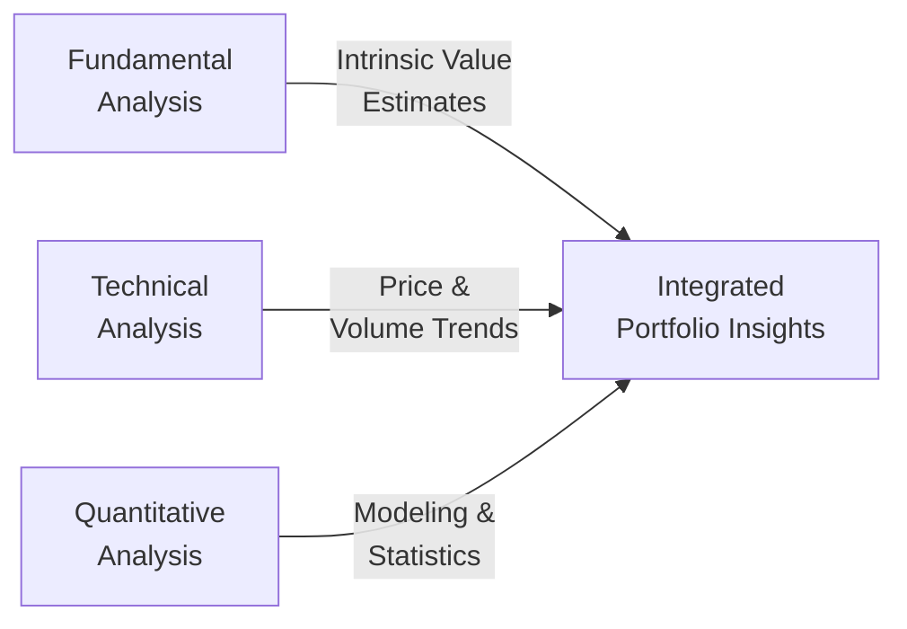

## 8.7 What are the Methods of Analysis?

Analyzing potential investments (whether stocks, bonds, or more complex derivatives) sits at the core of constructing solid, long-term portfolios. You might recall from earlier chapters—like Chapter 5 on understanding client needs or Chapter 6 on product due diligence—that choosing the right securities demands more than a passing glance at a stock chart or a quick skim of a company’s annual report. It requires a systematic approach to evaluating the risk, reward, and long-term prospects of an investment.

In this section, we dive into three major analytical frameworks: Fundamental Analysis, Technical Analysis, and Quantitative Analysis. Then we’ll see how many practitioners blend these methods to gain a comprehensive perspective, and we’ll look at best practices (and a few pitfalls) when aligning each method with specific client objectives.

In my early days as a novice investor—well before I read thick books on valuation and price movements—I used to ask, “Where do I start?” Eventually, I found that each analytical approach offers unique strengths. Understanding them helped me decide which was more appropriate for different clients and scenarios. So let’s dig in and see what might resonate with you and your practice.

---

## Understanding Fundamental Analysis

Fundamental Analysis is, in many ways, the foundation of modern investment research. At its heart, fundamental analysis focuses on the intrinsic value of a security or market so that you can compare your findings against the current price. If the intrinsic value is above the market price, an investor might consider the security undervalued (potential buy). If it’s below the market price, it might be overvalued (potential sell).

### Key Elements of Fundamental Analysis

• Company Financial Statements:  
  - Income statements, balance sheets, and statements of cash flow are used to measure profitability, liquidity, debt levels, and cash generation.  
  - Analysts might use ratios like Price-to-Earnings (P/E), Price-to-Book (P/B), Return on Equity (ROE), and Debt-to-Equity (D/E) to compare a company against its industry peers.  

• Industry Outlook:  
  - Investigate the competitive landscape, technology shifts, and regulatory changes that may affect the company’s future prospects. For instance, a shift toward green energy could significantly impact oil-and-gas producers’ profitability.  

• Economic Factors:  
  - Macro factors such as interest rates, inflation, and GDP growth can influence a firm’s operation costs and consumer demand.  

• Management Quality:  
  - You might drill down into who’s in the executive suite, their track records, and how they’ve navigated past market downturns—like the 2008 financial crisis or the volatility triggered by global events.  

• Company Filings and Sources:  
  - Official regulatory filings in Canada are typically found through SEDAR+ (sedar.com). You’d want to look at annual information forms, management discussion & analysis (MD&A), and audited financial statements to understand a company’s operational story in detail.  

Fundamental analysis can be especially appealing for longer-term investors who believe that markets eventually converge on “fair value.” This approach might resonate well with clients who have a moderate to longer holding period, want fewer trades, and are comfortable analyzing (or trusting their advisor to analyze) the underlying business fundamentals.

### Real-World Example of Fundamental Analysis

Imagine you have a Canadian tech stock you’ve been eyeing for some time. To conduct fundamental analysis, you:  
• Download the latest quarterly earnings report from SEDAR+.  
• Compare the company’s revenue growth and net profit margin to that of its biggest competitor.  
• Develop a forecast for the next three to five years based on the company’s plans to expand internationally.  
• Assign a fair value estimate based on a discounted cash flow model or a Price-to-Earnings analysis relative to peers in the sector.  
• Decide to buy if the calculated intrinsic value significantly exceeds the stock’s current market price.

Of course, as with all analyses, there’s a certain level of art as well as science. The future can surprise even the best forecasters. But fundamental analysis offers a structured way to approach this uncertainty.

---

## Empirical and Chart-Focused: Technical Analysis

Whereas fundamental folks often bury themselves in financial statements, technical analysts watch the patterns in price and volume data, believing these patterns reflect the psychology and sentiment driving the market.

### Core Principles of Technical Analysis

• Historical Price Patterns:  
  - Technical analysts look for formations like “head and shoulders,” “double bottoms,” or “triangles.” They believe these patterns could forecast future price movements.  

• Trend Identification:  
  - Tools such as moving averages, trend lines, and channels help identify whether a stock is moving upward, downward, or sideways.  

• Support and Resistance Levels:  
  - Prices sometimes struggle to drop below (support) or rise above (resistance) a certain threshold, often because of high demand or supply at that price. Technical investing strategies frequently revolve around buying near support and selling near resistance.  

• Momentum Indicators:  
  - Indicators like the Relative Strength Index (RSI) or the Moving Average Convergence Divergence (MACD) can help gauge whether a security is “overbought” or “oversold” and whether momentum is accelerating or decelerating.

### Timing Trades with Technical Analysis

Clients with shorter investment horizons, such as active traders or those managing tactical positions in a larger portfolio, might use technical analysis to optimize entry and exit points. Even fundamental investors sometimes consult technical charts to see if the market momentum supports their decision. You know, it’s kind of like checking the weather forecast even if you’re going on a road trip that’s already mapped out—you might adjust your travel schedule based on potential storms along the way.

### Example of a Simple Technical Setup

Let’s say you’re evaluating a stock that has rallied from $10 to $15 over a few weeks. You notice that each time it pulls back to $12, buying volume spikes, indicating strong demand. This $12 area is a possible support level. If the stock continues to bounce off $12, you might be more inclined to re-enter or add to your position at that price, anticipating the support to hold.

Bear in mind, though, that support levels can—and do—break when negative industry news or unexpected earnings disappointments emerge.

---

## Quantitative Analysis: Harnessing Data and Mathematical Models

Growing volumes of data and computing power have given rise to quantitative analysis—an approach that relies on statistical, mathematical, and algorithmic models to identify investment opportunities. Often, “quants” will:

• Collect and Clean Data:  
  - Thousands of data points, from financial metrics to alternative datasets (e.g., satellite images, web click data), are analyzed for patterns.

• Backtesting:  
  - A core technique in quantitative strategies involves coding an algorithm, then seeing how it performs using historical data. If the backtest is strong, the quant might test it further on out-of-sample data to ensure the strategy wasn’t just overfit to a specific historical period.  

• Running Algorithmic or Systematic Trading Strategies:  
  - Once tested, these strategies can trade automatically in the market, sometimes at high frequencies.  

• Risk Management:  
  - Sophisticated hedging and position-sizing algorithms help ensure that no single trade endangers the entire portfolio.

### Who Uses Quantitative Analysis?

• Portfolio Managers:  
  - Large institutional investors (pensions, hedge funds, etc.) often employ quants to construct or optimize portfolios based on factors such as momentum, value, quality, or low volatility.  

• Individual Traders:  
  - With the advent of user-friendly platforms, open-source libraries (like Python’s pandas and NumPy), and relatively cheap cloud computing, even retail traders are getting into algorithmic trading.

• Advisors Looking for Data-Driven Support:  
  - Some advisors might not trade solely on quant models, but they could incorporate factor-based screening tools to identify undervalued or momentum-driven plays.

### Practical Example of Quantitative Analysis

Let’s say you develop a simple factor model that screens for Canadian stocks with:  
• Consistent three-year earnings growth > 5% year-over-year,  
• Dividend yield above the sector average, and  
• Momentum measured by outperformance over the prior six months.

Then, using historical data from a reliable data feed, you backtest how this screener would have performed each quarter over the last 10 years. If results look promising, you might tweak your parameters, retest, and possibly deploy the model live in smaller amounts. Always remember: real-world transaction costs, liquidity constraints, and the potential for changing market conditions can diminish backtest results in practice.

---

## Blending Multiple Methods

You might wonder if you need to be purely fundamental or purely technical or entirely quantitative. The reality is that many portfolio managers blend these methods:

1. **Fundamental and Technical**  
   - A manager might buy a stock after seeing strong fundamentals but wait for the technical indicators to show a favorable entry point.

2. **Technical and Quantitative**  
   - Momentum-based strategies often use a combination of technical indicators (like moving averages) and advanced backtesting to confirm that the signals are historically robust.

3. **Fundamental and Quantitative**  
   - Factor investing is basically fundamental analysis on autopilot. You systematically target companies with positive fundamentals (e.g., low P/E, high ROE, growing earnings) using a quant approach.

4. **All Three**  
   - Large asset management firms often have entire teams that produce fundamental research, technical insights, and quant signals. Different clients might weigh these factors differently, especially if the client is a pension fund with predictable liabilities versus a high-net-worth individual comfortable with tactical, short-term trades.

---

## Aligning Analysis Methods with Client Goals

Remember Chapter 4 (Working with Clients) and Chapter 5 (Client Discovery and Account Opening)? You have to consider a client’s financial circumstances, time horizon, and risk tolerance. In practice:

• A **conservative retiree** may prefer a fundamental approach with stable, dividend-paying stocks or balanced funds and minimal trading.  
• An **aggressive day trader** with a short holding period might lean on technical analysis to capture intraday price swings.  
• A **data-oriented investor**—somebody with a technical background—could be keen on quantitative models, especially if they trust data and algorithms more than discretionary stock picking.

Further, Canadian Investment Regulatory Organization (CIRO) guidelines emphasize the importance of suitable recommendations. You’ll want to ensure that whichever analytical approach you use, you are disclosing to clients how you arrived at your advice. This fosters transparency and trust, something that regulators (and your clients) take to heart.

---

## Common Pitfalls and Best Practices

### Pitfalls
• **Overfitting in Quantitative Analysis**  
  - Overly tailoring a model to historical data can lead to poor out-of-sample performance.  

• **Ignoring Macroeconomic Context in Fundamental Analysis**  
  - A company might look great in isolation, but if interest rates jump drastically or the broader economy tanks, valuations can quickly shift.  

• **Emotional Trading in Technical Analysis**  
  - Seeing a sudden price fall can trigger fear-based decisions. Strictly following your pre-set signals is critical if you’re relying on technical triggers.  

• **Too Many Indicators**  
  - Whether fundamental or technical or quant, complexity can become unmanageable or contradictory.  

### Best Practices
• **Diversify Your Analytical Views**  
  - Even if you prefer fundamental metrics, glance at the chart indicators or run a simple factor screen to confirm your thesis.  

• **Document Your Process**  
  - Keep an investment journal or log, noting your rationale for buying or selling. This helps in refining your strategy over time.  

• **Stay Current with Regulations**  
  - As you know from Chapter 3 on the Canadian regulatory framework, compliance is key. Staying updated with all CIRO rules can help ensure client recommendations remain appropriate and properly documented.  

• **Combine Objectivity with Judgment**  
  - Models can help remove emotion from the process, but a little human judgment—especially when big news hits—can mean the difference between a minor setback and a huge portfolio drawdown.

---

## Illustrative Diagram: Approaches to Analysis

Below is a simple mermaid graph to illustrate how these three primary methods of analysis can feed into a cohesive strategy:

• Fundamental Analysis feeds into the integrated approach by offering insights into intrinsic value.  
• Technical Analysis provides real-time market signals.  
• Quantitative Analysis brings mathematical rigor, data-driven strategies, and model outputs.  
• All of these converge to inform the final decision-making process, leading to integrated portfolio insights.

---

## Further Exploration and References

1. **SEDAR+ (sedar.com)** – Repository for Canadian regulatory filings, financial statements, and public disclosures.  
2. **CIRO Guidelines** – For the latest information on suitable recommendations, compliance, and investor protection, visit https://www.ciro.ca.  
3. **“Security Analysis” by Graham and Dodd** – A timeless resource on fundamental analysis.  
4. **Open-Source Libraries** – Python’s pandas, NumPy, scikit-learn, and other data science tools can enhance quantitative research.  
5. **CFA Institute and CSI** – Additional courses and modules covering advanced analytical strategies and ethical considerations in finance.

---

## Personal Thoughts and Wrap-Up

I remember the first time I tried to blend technical indicators with fundamental valuations—I got a bit stuck. My fundamental side would say, “This stock is undervalued,” but then I’d look at a declining chart and panic, questioning whether to wait for a sign of reversal. Eventually, I refined a balanced approach: do thorough fundamental research, but don’t ignore a strong downtrend that might signal broader market negativity or systemic issues. Not all undervalued stocks are quick to bounce!

That’s the essence of using multiple analysis methods: each approach can reveal clues the others might miss. There’s always going to be a dash of subjectivity, so document your process, monitor how well it works, and keep evolving. Your clients rely on your professional judgment, and the more comprehensive your methods, the more prepared you’ll be to navigate shifting markets.  

Anyway, hopefully this section has demystified these methods a bit and shown you how they can complement each other. Whether you lean heavily on fundamental research, prefer chart patterns, or love coding systematic strategies, the point is to aim for alignment with your clients’ goals, time horizons, and comfort levels.

---

## Master Your Investment Analysis Skills: The Ultimate Quiz



### Which of the following statements best describes Fundamental Analysis?

- [x] It involves evaluating a company’s financial statements, industry outlook, and economic factors to estimate intrinsic value.  
- [ ] It relies exclusively on historical price and volume patterns.  
- [ ] It uses only quantitative models and backtesting algorithms.  
- [ ] It is used solely for short-term trades with frequent buying and selling.  

> **Explanation:** Fundamental Analysis focuses on a company’s internal health, financial statements, economic forecasts, and competitive position to determine its fair value.

---

### Which technical analysis tool attempts to identify potential market turning points through an oscillator-like measure of being “overbought” or “oversold”?

- [ ] The D/E ratio  
- [ ] The Price-to-Book ratio  
- [x] The Relative Strength Index (RSI)  
- [ ] Dividend Yield  

> **Explanation:** RSI is a popular momentum indicator used in Technical Analysis to spot overbought or oversold conditions, usually reflected by values above 70 or below 30.

---

### What is “backtesting” in the context of Quantitative Analysis?

- [ ] A fundamental technique that evaluates a company’s management team.  
- [ ] A method of monetizing dividends in a stock portfolio.  
- [x] A process of applying a strategy or model to historical data to assess past performance.  
- [ ] A visualization technique that identifies support and resistance levels on a chart.  

> **Explanation:** Backtesting uses historical data to simulate how an algorithmic or model-based strategy would have performed, providing insights before deployment in real markets.

---

### Which type of investor might find Technical Analysis particularly valuable?

- [ ] An investor who only buys government bonds and holds them for 30 years.  
- [x] A short-term trader looking to optimize entry and exit points based on price momentum and patterns.  
- [ ] A private equity buyer focusing on firm ownership over decades.  
- [ ] A conservative retiree wanting stable dividend coupons.  

> **Explanation:** Technical Analysis is especially helpful for short-term traders, who rely on price patterns and momentum signals to inform quick decisions.

---

### Which statement best captures the relationship between Fundamental Analysis and Quantitative Analysis?

- [ ] They are mutually exclusive and cannot be blended.  
- [x] Quantitative analysis can automate fundamental metrics (like P/E or growth rates) through factor models.  
- [ ] Fundamental analysts only care about charts.  
- [ ] Quantitative analysis is only useful for short-selling.  

> **Explanation:** Quantitative factor investing often codifies fundamental metrics into systematic models, effectively blending both approaches.

---

### What is a common pitfall of quantitative models?

- [ ] They ignore past price data entirely.  
- [x] Overfitting to historical data, resulting in poor performance in live markets.  
- [ ] They are easily managed without any programming knowledge.  
- [ ] They can only work on large-cap Canadian stocks.  

> **Explanation:** Overfitting occurs when a strategy is fine-tuned to a particular historical data set, capturing anomalies that may not persist in real-time conditions.

---

### In Fundamental Analysis, which of the following would not typically be examined?

- [ ] A company’s balance sheet  
- [x] Intraday price ticks and hourly chart patterns  
- [ ] Economic indicators like GDP growth  
- [ ] Annual management discussion & analysis (MD&A)  

> **Explanation:** Intraday price ticks and hourly chart patterns are generally the domain of Technical Analysis, not a key part of assessing a company’s intrinsic value.

---

### What is the role of Support and Resistance levels in Technical Analysis?

- [x] They are specific price points where buying or selling forces historically prevented a security’s price from moving lower or higher.  
- [ ] They are purely fundamental metrics used to measure company solvency.  
- [ ] They only apply to bonds, not equities.  
- [ ] They are determined by microeconomic policy decisions.  

> **Explanation:** Support and Resistance are core concepts in Technical Analysis, indicating potential price floors and ceilings in the near term.

---

### Why is it essential to align analysis methods with each client’s goals and risk tolerance?

- [x] Different clients have different time horizons, comfort levels, and objectives. Analysis methods must match these factors.  
- [ ] Clients never care about the analysis methods used.  
- [ ] Regulators encourage using the same analysis method for all.  
- [ ] Blending any method with client goals is prohibited under CIRO.  

> **Explanation:** Suitability is paramount. Aligning the approach to each client’s profile ensures recommendations adhere to regulatory guidelines and serve the client’s best interests.

---

### True or False: CIRO (Canadian Investment Regulatory Organization) replaced both IIROC and MFDA as a single self-regulatory entity in 2023.

- [x] True  
- [ ] False  

> **Explanation:** Effective January 1, 2023, IIROC and MFDA amalgamated into the new CIRO, which oversees investment dealers, mutual fund dealers, and market integrity across Canadian marketplaces.


