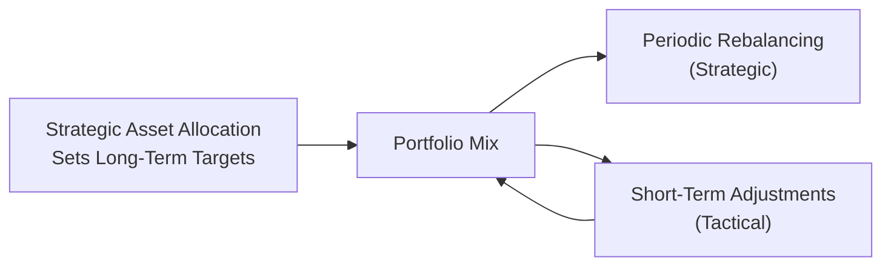
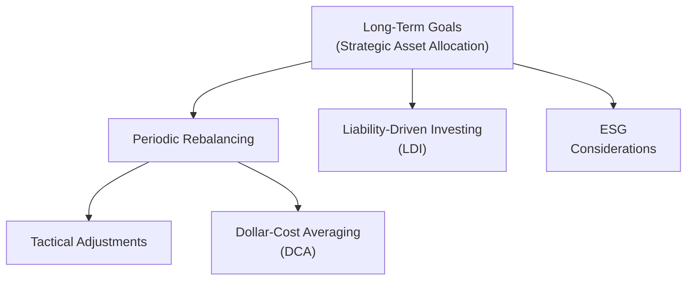

## 8.8 Additional Topics in Constructing Investment Portfolios

Building a solid investment portfolio can feel like constructing a house—there’s a sturdy foundation (like your core holdings), supporting structures (the different asset classes), and finishing touches (the short-term adjustments or niche funds). In previous sections, we explored the basics of asset allocation, diversification, and risk management. Here, we dig a little deeper into some special topics that can help you tailor your portfolios to meet a broader range of client needs and preferences, especially in Canada’s evolving regulatory and market environment.

Asset allocation strategies, rebalancing techniques, dollar-cost averaging, ESG investments, and liability-driven investing each offer unique perspectives and tools. Taken together, they can form a cohesive and versatile toolkit. Let’s explore each in turn, and we’ll throw in some personal stories, real-world anecdotes, and best practices along the way.

### Asset Allocation Strategies

Asset allocation strategies often determine most of a portfolio’s long-term returns and risk profile. Frankly, you could have perfect timing or a knack for picking winning securities, but if your portfolio’s overall asset allocation is off, you may still fall short of your client’s goals. Two well-known styles stand out:

#### Strategic Asset Allocation
Imagine you’re a painter with a particular palette of colors—say, you typically favor certain shades of blue, yellow, and red. You periodically step back and make sure the proportions of these colors remain roughly the same for consistency in your painting. That’s somewhat like strategic asset allocation.

In strategic asset allocation, the mix of assets (like stocks, bonds, and cash equivalents) is based on long-term client goals and risk tolerance. Some real-world examples highlight why this method is so popular:

• A retirement portfolio might hold 60% in equity mutual funds, 35% in bond funds, and 5% in cash or near-cash assets.  
• A “balanced” approach might attempt a 50-50 split between equities and fixed income, rebalancing every year.

Rebalancing steps in periodically—maybe once a year, or semi-annually—to restore target weights. Market fluctuations can cause the portfolio to drift from these targets. You’ll likely reference your clients’ investment policy statement (IPS) for that “baseline” mix. Over time, the overall target doesn’t usually change dramatically, unless the client’s life circumstances or objectives drastically shift (like receiving a large inheritance).

#### Tactical Asset Allocation
Tactical asset allocation is a bit like improvising a jazz solo. There is still structure (like the asset mix in your strategic plan), but the investor or portfolio manager changes it up in response to short-term market conditions or perceived opportunities.

Maybe, well, you see that commodity prices are surging and you suspect inflation is on the way. You might tilt more into commodity-exposed equities or inflation-protected bonds for a while, hopefully capitalizing on those conditions. Next quarter, if it looks like technology stocks are oversold, you might tilt the portfolio in that direction.

• Example: A fund manager might shift a portion from domestic equities to global equities if they believe foreign markets have more upside.  
• Another scenario: Reducing bond exposure in anticipation of rising interest rates, and then reintroducing them if rate pressures ease.

Tactical asset allocation works best when guided by a solid understanding of market cycles, macroeconomic indicators, and your client’s risk tolerance. It is, however, more hands-on—and let’s be honest, it involves greater risk that your short-term calls might be off.

Below is a simple Mermaid diagram illustrating how strategic and tactical asset allocation might interact:

### Rebalancing Approaches

Rebalancing is the process of reining in a portfolio that has strayed from its target mix. Over time, different asset classes might surge ahead or lag, causing the original allocations to shift away from your ideal risk/return profile. Two common techniques are:

#### Calendar Rebalancing
Calendar rebalancing sets a strict schedule—maybe every six months or every year. You don’t worry about the market noise in between (barring extreme events). On that rebalancing date, you adjust the portfolio back to the target weights. This approach is straightforward and systematic, but you might miss opportunities to rebalance at more advantageous times, especially if markets swing rapidly.

• Example: On January 1 each year, you measure the current portfolio allocation. If the equity allocation is 65% but the target is 60%, you might sell 5% worth of equities and move the proceeds to fixed income or cash.

#### Threshold Rebalancing
Threshold rebalancing focuses on deviation from target allocations. If equities were supposed to be 60% of the portfolio but drift above 66% (a 10% threshold), you rebalance right away—even if it’s only March and your scheduled rebalancing date was set for June.

Threshold rebalancing can help lock in gains and limit losses during turbulent times. However, it can also generate more frequent transactions (and potentially more costs), so you want to consider transaction fees, taxes, and other logistical factors.

### Dollar-Cost Averaging (DCA)

Dollar-cost averaging (DCA) is a technique where you invest a fixed amount at regular intervals, regardless of what the market is doing at that moment. It’s like shopping for groceries every week—you don’t hold off entirely because milk or bread prices might fluctuate; you buy what you need consistently. Over time, you purchase more shares when prices are lower and fewer shares when prices are higher.

• Example: Contribute $500 on the 15th of every month into a mutual fund. Over a year, sometimes you’ll catch the fund at a high price, sometimes at a low price, and sometimes in between.

Clients often appreciate the simplicity and psychological benefit of this approach: they don’t have to find the perfect time to invest. It also helps keep emotions in check, which is huge when markets get choppy.

### ESG Considerations (Environmental, Social, and Governance)

Do your clients care about sustainable business practices, carbon emissions reduction, or fair labor policies? ESG investing is gaining traction worldwide, including right here in Canada. ESG factors can influence the mutual fund selection process:

• Environmental: Pollution, resource depletion, climate change policies.  
• Social: Employee relations, diversity, community impact.  
• Governance: Board structure, executive compensation, shareholder rights.

ESG investing is about aligning portfolios with investors’ personal values and, at times, capturing potential financial upsides. Some research suggests that well-managed companies with strong ESG factors can exhibit resilience in volatile markets. Of course, results vary, and it’s not guaranteed ESG funds will always outperform non-ESG peers. But the evolving Canadian regulatory environment encourages more disclosure around sustainability—for instance, the Canadian Securities Administrators (CSA) have introduced guidelines on ESG-related disclosures, and CIRO provides guidance regarding suitability for clients seeking ethical or sustainable investments.

It’s also worth noting that ESG rating agencies (like MSCI ESG Research Tools) use different methodologies to evaluate companies. So if you or your clients are serious about ESG, you’ll want to check multiple sources before deciding that a particular fund is up to standard.

### Liability-Driven Investing (LDI)

While it might sound super technical, liability-driven investing (LDI) is simply an approach that aligns a portfolio’s assets with future liabilities. The concept is especially popular in pension fund management. If you know you will need to pay pension obligations to retired employees in 10, 15, or 20 years, it makes sense to structure your investments so that the cash flows match (or closely mirror) those future outlays.

• Example: A corporate pension plan expects to pay $200 million in retirement benefits in about 15 years. It might choose long-term bonds that mature around that time, locking in interest rates so it can match assets to liabilities.  
• Another example: Individuals with large, predictable future expenses (like paying for a child’s education or a mortgage balloon payment) might prefer LDI-type strategies. 

In Canada, large institutional investors (like the Canada Pension Plan Investment Board) widely use forms of LDI to manage extensive long-term liabilities. While LDI may be less common in everyday retail investing, some elements—like planning for future cash needs—can still be applied to personal portfolios or structured mutual fund recommendations. The main idea: if you know you’ve got a big expense in the future, you want to be fairly certain the assets you choose will be there to cover it.

### Deepening Your Practice: Practical Examples

Sometimes a story can help clarify these concepts. I once had a client who was adamant about never putting more than 50% in equities because she’d seen her father lose nearly everything during a severe market downturn decades ago. We set a strategic asset allocation of 50% equities (across different mutual funds) and 50% fixed income. We used threshold rebalancing, with a 5% deviation threshold. There was a moment when equities shot up in a raging bull market, and her holdings went up to around 58%. We used that as our cue to rebalance, captured some profit, and she felt far less anxiety about potential future downturns.

In another scenario, a younger client asked about short-term tactical tilts because he was convinced that renewable energy stocks were about to surge. We allocated a small percentage for tactical tilting into a global environmental solutions equity fund. This approach didn’t entirely pan out as he expected—renewable stocks had a rough year—but because it was a limited portion of the portfolio, it didn’t derail his overall financial goals.

### Incorporating Regulatory Guidelines and Best Practices

In Canada, the process of constructing portfolios must meet any relevant demands and regulations administered by the Canadian Securities Administrators (CSA) and supervised by the Canadian Investment Regulatory Organization (CIRO). After the January 1, 2023, amalgamation of the MFDA and IIROC, CIRO is the one-stop self-regulatory organization responsible for overseeing both investment dealers and mutual fund dealers.

Key guidelines under CIRO revolve around ensuring client suitability. If your client is big on ESG, for instance, it’s essential to document these preferences and select funds consistent with those goals. If your client’s risk tolerance is conservative, you’ll need to show that the portfolio’s asset allocation, rebalancing strategy, and short-term tactical moves stay aligned with that risk profile.

Don’t forget about the CIPF (Canadian Investor Protection Fund), which remains the sole investor protection fund in Canada. While CIPF doesn’t directly influence portfolio construction, it does help protect client assets in case a CIRO-member firm becomes insolvent, offering peace of mind for many investors.

### Best Practices and Potential Pitfalls

• Clearly define client objectives: Ensure your selections—strategic or tactical—flow from well-documented goals and risk tolerance.  
• Communicate thoroughly about rebalancing: Some clients might balk at selling “winners.” Education on why it’s crucial helps them embrace the discipline.  
• Be mindful of trading costs: Frequent threshold rebalancing might add up. Try to offset these costs or plan trading carefully.  
• Watch out for behavioral biases: Overconfidence can creep in, especially with tactical asset allocation. Dollar-cost averaging can help remove some emotional pitfalls, but keep clients informed about how markets fluctuate.  
• ESG data inconsistencies: One rating agency might praise a company’s practices, while another criticizes them for reasons that are not easily comparable. Do your due diligence.

### Real-World Tools and Resources

Investors and advisors in Canada have more tools than ever for portfolio construction. Robo-advisor platforms often incorporate DCA, digital rebalancing, and even some ESG screening functionalities. Meanwhile, many mutual fund databases offer advanced filters for factors like carbon impact or social responsibility. Some well-known resources:

• ESG ratings databases (e.g., MSCI ESG, Sustainalytics)   
• Online rebalancing calculators (banking and fintech apps)  
• Institutional resources from the Canada Pension Plan Investment Board on liability-driven approaches  
• CIRO’s official website (https://www.ciro.ca) for regulatory updates and guidance  

### Visual Summary of Key Concepts

The following Mermaid diagram offers a quick visual overview of how these additional portfolio construction topics interconnect:

### References for Further Reading

• CIRO (https://www.ciro.ca) – For current Canadian regulatory information and updates  
• Canadian Securities Administrators – ESG-related disclosure guidelines  
• Canada Pension Plan Investment Board – Examples of large-scale liability-driven investing  
• Gibson, Roger C. “Asset Allocation: Balancing Financial Risk.”  
• “Investing in the Age of Climate Change” – Institutional research sources  
• MSCI ESG Research Tools – For ESG data and ratings  

Feel free to explore these resources to get an even deeper understanding of advanced allocation strategies, rebalancing methods, ESG considerations, and LDI frameworks.

---

## Review Your Knowledge: Additional Topics in Constructing Investment Portfolios Quiz



### Which statement best describes strategic asset allocation?

- [ ] It focuses on short-term shifts in the market.
- [ ] It avoids periodic rebalancing.
- [x] It establishes a long-term baseline mix of assets.
- [ ] It only invests in stocks and ignores fixed income.

> **Explanation:** Strategic asset allocation involves setting a long-term asset mix based on your client’s overall objectives and risk tolerance. While periodic rebalancing is typically part of this approach, the central idea is to maintain a relatively consistent allocation that aligns with long-standing goals.

### Which approach triggers a rebalance primarily when asset weights deviate beyond a set limit?

- [ ] Calendar Rebalancing
- [x] Threshold Rebalancing
- [ ] Simple DCA Approach
- [ ] Buy-and-Hold With No Rebalancing

> **Explanation:** Threshold rebalancing initiates adjustments when an allocation strays beyond specific percentages, regardless of the calendar date.

### In a tactical asset allocation strategy, what is the primary objective?

- [ ] To invest exclusively in bonds.
- [ ] To never deviate from the original target weights.
- [ ] To reduce the number of transactions regardless of market conditions.
- [x] To make short-term allocation shifts based on perceived market opportunities.

> **Explanation:** Tactical asset allocation aims to capitalize on near-term market conditions or economic trends, making short-term adjustments to the portfolio.

### Dollar-cost averaging (DCA) involves:

- [ ] Investing one lump sum at a specific point in time.
- [ ] Constantly trading in and out of the market.
- [x] Investing a fixed amount at regular intervals.
- [ ] Avoiding equity investments entirely.

> **Explanation:** With DCA, you put in smaller, systematic sums over time, which can smooth out the effects of market volatility and reduce emotional decision-making.

### Which of the following are generally included in ESG criteria?

- [x] Environmental Impact
- [x] Social Responsibility
- [ ] Dividends Only
- [x] Corporate Governance

> **Explanation:** Environmental, Social, and Governance factors define ESG investing. Dividends alone are not part of ESG criteria.

### Liability-driven investing (LDI) is primarily focused on:

- [x] Matching asset cash flows to future liabilities.
- [ ] Maximizing short-term capital gains.
- [ ] Speculative investments in emerging markets.
- [ ] Hedging only currency risks.

> **Explanation:** LDI ensures that an investor’s present holdings are designed to meet specific future obligations, such as pension liabilities or upcoming lump-sum expenses.

### What is a key benefit of threshold rebalancing over calendar rebalancing?

- [x] It allows for more immediate reactions to significant market moves.
- [ ] It eliminates transaction costs entirely.
- [x] It can help lock in gains when an asset class outperforms by a large margin.
- [ ] It guarantees market outperformance.

> **Explanation:** Threshold rebalancing can address drastic changes promptly, potentially locking in gains and avoiding excessive risk exposures. However, it may lead to more frequent transactions.

### What role does CIRO play in the current Canadian regulatory landscape?

- [x] It oversees all investment dealers and mutual fund dealers under a single self-regulatory body.
- [ ] It only handles investor protection claims.
- [ ] It replaced the Canadian Securities Administrators.
- [ ] It sets monetary policy in Canada.

> **Explanation:** Formed from the amalgamation of the MFDA and IIROC, CIRO is Canada’s national self-regulatory organization responsible for overseeing investment dealers, mutual fund dealers, and market integrity.

### One potential drawback of tactical asset allocation is:

- [x] The risk of incorrect market timing calls.
- [ ] The impossibility of selling securities.
- [ ] Mandatory monthly rebalancing.
- [ ] A permanent ban on investing in equities.

> **Explanation:** Tactical asset allocation can fail if market conditions are misjudged. It requires active monitoring and can be more volatile than purely strategic approaches.

### True or False: ESG investing always outperforms traditional investing.

- [x] True
- [ ] False

> **Explanation:** This statement is actually contentious and could be considered “false” in a strict sense because there’s no guarantee ESG strategies will always outperform. However, some studies show that well-managed ESG portfolios can perform comparably or even outshine traditional portfolios in certain market conditions. The success of ESG investing often depends on individual fund choices, market contexts, and specific criteria used.


