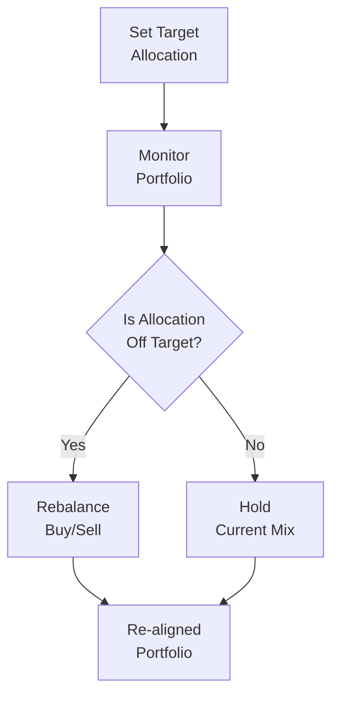

## 8.8 Additional Considerations: Asset Allocation, Diversification, and Rebalancing

Effective portfolio construction goes well beyond simply picking a few stocks and bonds. One of the most important decisions in creating and maintaining a solid investment portfolio is determining how to split total investable assets across different asset classes—a process called “asset allocation.” This allocation, in combination with diversification and rebalancing strategies, helps manage overall risk and can significantly influence an investor’s long-term returns.

There was a time—before I even knew the term “asset allocation”—when I crammed all my savings into technology stocks because, well, tech was hot, and I wanted in. Let’s just say it taught me a thing or two about the importance of diversification. So, if you’re in the same boat or simply curious about how to structure a more resilient portfolio for your clients, read on.

### Why Asset Allocation is Crucial

Asset allocation refers to the process of distributing your investments among various asset categories, such as stocks, bonds, cash, and alternative investments (e.g., real estate or commodities). Research consistently shows that asset allocation decisions often have the greatest impact on a portfolio’s long-term performance—as much, if not more, than individual security selection.

In the Canadian context, Registered Representatives and other dealing representatives governed by the Canadian Investment Regulatory Organization (CIRO) (formerly overseen by IIROC and MFDA, both of which are now defunct since their consolidation in 2023) must consider a client’s personal circumstances, risk tolerance, objectives, and liquidity needs when making asset allocation recommendations. As we learned in previous chapters, you have a regulatory obligation to ensure recommendations are suitable and align with a client’s risk profile and investment horizon (see Chapter 6: Product Due Diligence, Recommendations, and Advice).

### Key Elements of Asset Allocation

1. Risk-Return Balance  
   Each asset class carries its own risk-and-return profile. For example, equities (stocks) typically offer higher growth potential but come with greater volatility, while quality bonds often provide more stable returns but may have lower long-term growth. Balancing these different risk-and-return characteristics is central to creating a well-rounded portfolio.

2. Time Horizon  
   Asset allocation typically depends on the investor’s timeline. A younger investor with 30 years to retirement (and presumably less immediate need for liquidity) can afford a higher allocation to potentially volatile assets like equities. Conversely, an investor nearing retirement might opt for a more conservative mix, placing a greater share in bonds, GICs, or money market instruments for capital preservation.

3. Liquidity Needs  
   Clients who need ready access to cash—perhaps for emergency funds or short-term goals—will require a different allocation strategy than investors who can leave money untouched for years. High-liquidity vehicles (like cash or near-cash) become more essential when there is a near-term cash flow requirement.

4. Regulatory and Tax Considerations  
   In Canada, factors such as RRSP contribution limits, TFSA room, and corporate account structures can all influence asset allocation. Understanding these frameworks helps place certain asset classes in more optimal accounts to reduce tax burdens, enhance returns, and stay compliant with CIRO guidelines.

### Diversification: Reducing Risk with Variety

Diversification is the practice of spreading investments across multiple asset classes, industry sectors, and geographic regions to reduce the impact of any one investment’s poor performance on the portfolio. This is a fundamental risk management technique—practically the “don’t put all your eggs in one basket” lesson we’ve all heard, but taken to a more sophisticated level.

1. Across Asset Classes  
   For an individual investor, this might mean holding not just stocks but also bonds, real estate, and cash equivalent assets. Each of these behaves differently under varying market conditions, helping cushion the overall portfolio from substantial loss if one area underperforms.

2. Across Market Sectors and Regions  
   Even when investing only in equities, it’s usually wise to avoid concentrating solely in one sector (e.g., technology, energy, banking). Instead, consider broad exposure—domestic (Canadian) equities, U.S. equities, emerging markets, small/mid-cap, etc. This can help limit losses if a particular region or sector encounters significant challenges (for example, a resource-specific recession).

3. Considering Correlations  
   Correlation measures how different investments move relative to each other. Diversifying with assets that have low or negative correlations—i.e., they don’t always move in the same direction at the same time—can help reduce volatility. This can potentially add incremental stability to overall portfolio returns.

Below is a simple Mermaid diagram illustrating how asset allocation and diversification work in tandem to manage risk and potentially smooth returns:

### The Importance of Rebalancing

Once a target asset allocation is established, market fluctuations will inevitably alter the distribution of assets. Over time, certain holdings may grow faster than others, throwing off the intended balance. This is where rebalancing comes into play.

Rebalancing is the process of buying or selling assets to bring a portfolio back to its target allocation. It can be triggered by either:

• Time-Based Intervals. Some investors set a schedule—say, every six or twelve months—to systematically return the portfolio to the desired asset mix.  
• Threshold-Based Triggers. Alternatively, an investor might rebalance only once a particular asset class deviates by, for example, +5% or −5% from the original target weight.

Either approach, or a blend of the two, helps manage risk and ensures the portfolio stays aligned with the client’s long-term objectives. Additionally, rebalancing can provide a discipline mechanism to “sell high and buy low,” which is a concept that, in theory, can help improve returns over many market cycles.

Here’s a succinct visual on the basic process:

### Currency Risk and Hedging for International Investments

If a client purchases assets denominated in a foreign currency, they’re exposed to currency risk—changes in exchange rates that can either boost or erode returns. For instance, a Canadian investor holding U.S. stocks might enjoy strong equity performance, yet lose ground if the U.S. dollar weakens significantly against the Canadian dollar.

Currency hedging involves using financial instruments (like currency futures or options) to offset potential adverse currency movements. Depending on an investor’s risk tolerance, hedging could be partial or full. A fully hedged position in foreign equities usually offers returns that closely track the underlying foreign asset performance in its local currency, regardless of exchange rate fluctuations.

However, hedging can add cost and complexity, so it must be approached thoughtfully and in conjunction with a client’s goals and risk appetite. It’s also essential to understand the relevant regulatory guidelines and CIRO rules (historically instituted by IIROC and the MFDA, which have since been absorbed into CIRO) for engaging in derivatives or using more advanced currency-hedging products.

### Matching Liquidity Requirements to Asset Allocation

Clients have varying cash flow and liquidity needs—some more immediate than others. For instance, a client nearing retirement might need regular distributions from their portfolio. Another client may plan to purchase a house in two years and needs a stable short-term investment. Liquidity considerations directly affect:

• The percentage of funds in easily accessible accounts like savings or money market funds.  
• The types of securities purchased (e.g., shorter maturity bonds for short-term liquidity vs. longer maturity bonds or equity positions if the time horizon is longer).  
• The potential use of credit lines or margin in emergency situations, although these come with added costs and leverage risks.

If we fail to account for liquidity needs, a client might be forced to sell an investment at an inopportune time. This can crystallize losses or trigger unexpected tax obligations. Effective planning around liquidity is therefore integral to stable long-term investment management.

### Best Practices for Implementing These Concepts

• Document the Game Plan. Create a written Investment Policy Statement (IPS) that outlines the target asset allocation, risk tolerance, and rebalancing triggers. This helps avoid emotional decision making during market fluctuations.  
• Regular Check-Ins with Clients. Life events like marriage, divorce, birth of a child, or a new job can alter an investor’s risk profile. Scheduling periodic reviews ensures the strategy remains suitable.  
• Utilize Tools and Resources. Many Canadian brokerage platforms and open-source financial tools (like Google Sheets templates or specialized portfolio management apps) can track allocation, correlation, and performance.  
• Stay Informed on Regulatory Guidelines. Make sure you’re aware of regulations from CIRO and the Canadian Securities Administrators (CSA). These sources regularly update compliance standards around suitability, account supervision, and permissible asset mixes.  
• Don’t Forget About Tax Implications. Talk to clients about placing tax-inefficient investments (like interest-bearing assets) in registered accounts if possible. This can help reduce their overall tax bill and enhance net returns.  
• Evaluate Hedging Strategies Carefully. While currency hedging can stabilize returns, it’s not always the most cost-effective option for every worldview or for every client.  
• Know When Not to Rebalance. In small accounts or with minimal deviations, frequent rebalancing can generate extra transactions and costs. Sometimes, letting minor drifts ride is more beneficial for overall performance, provided it remains within an acceptable risk threshold.

### Common Pitfalls

• Over-Diversification. Investors sometimes create so many positions that the portfolio becomes unwieldy, resulting in minimal potential benefit from each holding.  
• Lack of Rebalancing Discipline. Neglecting to rebalance can slowly shift the portfolio into a much riskier or more conservative structure than originally intended.  
• Chasing Performance. Allocating more heavily into “hot” markets or sectors after a strong run can set the client up for disappointment when the trend reverses.  
• Ignoring Liquidity Features. Underestimating future cash needs can force premature liquidation.  
• Overlooking Currency Exposure. Buying foreign assets purely for returns, without thought for exchange rates, can lead to unexpected gains or losses.

### Practical Examples and Case Studies

Case Study 1: Growth-Focused Investor

• Scenario: A 35-year-old client with a stable job, minimal short-term liquidity needs, and a high risk tolerance wants a growth-focused portfolio.  
• Asset Allocation: 80% equities, 15% fixed income, 5% cash.  
• Diversification Strategy: Large-cap Canadian equities, some U.S. and international equities, plus a small slice of emerging markets. Bonds might consist mainly of intermediate-term corporate or government bonds.  
• Rebalancing Plan: Time-based rebalancing every six months, with a ±5% threshold for equities.  
• Currency Hedge: Partial hedging for U.S. positions to limit excessive currency sway.  

Case Study 2: Retiree with Income Needs

• Scenario: A 65-year-old with a moderate risk tolerance who needs regular monthly withdrawals to supplement pension income.  
• Asset Allocation: 40% equities, 50% fixed income, 10% cash (for near-term liquidity).  
• Diversification Strategy: Key sectors like financials, utilities, consumer staples, and a global bond fund. This helps reduce concentration risks.  
• Rebalancing Plan: Threshold-based triggers—if any asset class is off by 4% from its target, rebalance right away.  
• Currency Hedge: Small or no hedging, depending on currency exposures for bond and equity holdings; the client’s limited foreign equity exposure may keep currency fluctuations manageable.

### References and Additional Resources

• CIRO (https://www.ciro.ca): Canada’s national self-regulatory organization overseeing investment dealers and mutual fund dealers. Their educational materials discuss asset allocation policy considerations for different client segments.  
• Vanguard Investment Stewardship (https://about.vanguard.com/investment-stewardship): While U.S.-based, finds broad applicability to Canadian clientele on asset allocation research.  
• The Intelligent Asset Allocator by William Bernstein: A comprehensive treatise on the practical aspects of building a diversified portfolio.  
• Government of Canada Financial Consumer Agency (https://www.canada.ca/en/financial-consumer-agency.html): Offers guidance on personal finance management, budgeting, and foundational investment principles.  
• Open-Source Portfolio Tracking Tools: Tools such as the Bogleheads forum spreadsheets or custom Google Sheets can be used to monitor asset allocation and performance over time.

----

In conclusion, the practice of careful asset allocation, combined with disciplined diversification and periodic rebalancing, forms the bedrock of effective portfolio management. Whether your clients are building wealth, preserving capital, or seeking consistent income, tailoring these factors to their unique circumstances underscores your commitment to professionalism and excellence in client service. By weaving regulatory compliance, prudent financial planning, and a personal touch, you’ll help them navigate the sometimes choppy waters of the investment world with greater confidence.

## Test Your Knowledge: Asset Allocation, Diversification, and Rebalancing Quiz



### Which factor typically has the greatest impact on long-term portfolio performance?

- [ ] Individual stock selection
- [ ] Market timing
- [x] Asset allocation
- [ ] Tactical trading of derivatives

> **Explanation:** Multiple studies have shown that asset allocation decisions often dominate the portfolio’s overall risk and return profile, overshadowing the effects of security selection or market timing.

### What is the primary benefit of diversifying across different asset classes?

- [x] It reduces the overall portfolio volatility.
- [ ] It guarantees higher returns.
- [ ] It eliminates all market risk.
- [ ] It is required by tax law.

> **Explanation:** Spreading investments across asset classes and sectors can reduce the risk from any single investment experiencing significant losses, stabilizing the portfolio’s overall returns.

### Which of the following is not commonly used as a rebalancing trigger?

- [ ] Time-based intervals
- [x] Market sentiment surveys
- [ ] Threshold-based deviations
- [ ] A blend of time- and threshold-based triggers

> **Explanation:** Investors typically rebalance either on a set schedule or when assets deviate beyond agreed-upon thresholds. Market sentiment surveys, while interesting, are not a standard rebalancing trigger.

### A 60/40 (equities/bonds) target allocation drifts to 70/30 due to rising equity values. Which statement is most accurate?

- [x] The portfolio is now taking on more equity risk than originally intended.
- [ ] The portfolio is less risky than originally intended.
- [ ] Rebalancing immediately would lock in losses.
- [ ] The portfolio should be changed to 80/20 to chase higher returns.

> **Explanation:** With equity gains, the portfolio now has a higher equity weight than intended, meaning it is more exposed to equity market fluctuations than originally planned.

### Why might an investor consider currency hedging for foreign investments?

- [x] To mitigate risks from fluctuating exchange rates
- [ ] To amplify speculative currency bets
- [x] To stabilize portfolio returns denominated in home currency
- [ ] To eliminate sector risk

> **Explanation:** Currency hedging helps manage the exchange rate risk associated with holding foreign assets. It does not eliminate sector or market risk, and is not generally used for speculative currency bets in a standard client portfolio context.

### How does liquidity affect asset allocation decisions?

- [x] Investors with higher short-term cash needs might hold more in liquid instruments.
- [ ] Liquidity is irrelevant for portfolio construction.
- [ ] Regulatory requirements prohibit high levels of liquidity.
- [ ] Only alternative assets affect liquidity.

> **Explanation:** Investors who anticipate short-term cash requirements often allocate a greater percentage to cash or cash-like instruments. Liquidity cannot be overlooked because forced sales can lead to realized losses or suboptimal timing.

### Which of these is a potential downside of “over-diversification”?

- [x] Managing too many positions becomes complex and may dilute returns.
- [ ] It completely eliminates risk from the portfolio.
- [x] Clients might see higher costs and fees.
- [ ] It rules out the inclusion of international equities.

> **Explanation:** Over-diversification can create administrative burdens, higher transaction costs, or management confusion. It doesn’t eliminate risk and does not necessarily prohibit holding international equities.

### When rebalancing, “buying low and selling high” refers to:

- [x] Selling assets that have grown above their target weight to buy assets below target.
- [ ] Relying on blind market timing signals.
- [ ] Only buying assets that have hit 52-week lows.
- [ ] Only selling assets that have hit 52-week highs.

> **Explanation:** Rebalancing systematically trims positions that have done well (selling high) and increases positions that have underperformed or lagged (buying low), realigning the portfolio to its target mix.

### What is one reason a threshold-based rebalancing strategy might be preferred over a purely time-based strategy?

- [x] It focuses on actual market movements rather than arbitrary calendar dates.
- [ ] It provides immediate tax benefits.
- [ ] It prevents any form of market impact.
- [ ] It is mandatory under CIRO guidelines.

> **Explanation:** Threshold-based rebalancing reacts to actual shifts in the portfolio’s composition, avoiding unnecessary trades if the portfolio remains close to its target allocation.

### Rebalancing is always beneficial for every investor situation. True or False?

- [x] True
- [ ] False

> **Explanation:** This statement can be contentious, but in standard practices, rebalancing is widely considered beneficial; it manages risk effectively by adhering to the original allocation. However, in practice, some small accounts or specific client scenarios may require nuanced approaches. For exam purposes, the general stance is that rebalancing is a beneficial discipline in most portfolios.


