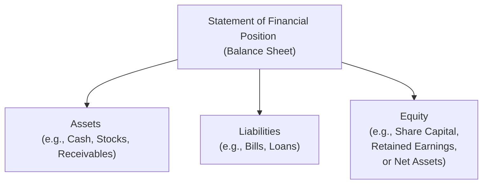

## 9.2 What Is the Statement of Financial Position?

The Statement of Financial Position—commonly known as the “Balance Sheet”—is arguably the most critical snapshot of any entity’s financial affairs. It presents a company’s (or a mutual fund’s) assets, liabilities, and equity at a specific point in time, giving us a freeze-frame moment to see the financial standing. Whether you’re a budding Registered Representative, a curious finance enthusiast, or a seasoned financial advisor, it can feel a bit daunting at first. But trust me, once you peel back the layers of jargon and acronyms, it all begins to make sense—almost like looking at your personal net worth statement, except on a much larger and more detailed scale.

Below, we’ll tackle the Statement of Financial Position from multiple angles: what it is, how it’s structured, how you interpret it, and why it matters—particularly within mutual funds and the Canadian regulatory environment. We’ll also look at a few common pitfalls, helpful ratios, real-world examples, and official resources to help you keep learning.

## Why Understanding the Statement of Financial Position Matters

So, why does this matter? Well, in my experience, if you can’t figure out how an entity’s finances are positioned, you’re basically clueless about its long-term health. It’s like trying to guess how someone’s doing at the gym just by how quick they run a mile—maybe they have a heart condition you don’t see, or maybe they have an endurance problem that miles don’t capture.

In finance terms, the Statement of Financial Position helps you see if a company or a fund can comfortably handle its current bills, how they’re managing their debts, and how much of the business is funded by owners versus lenders. Without it, you’re missing a vital piece of the puzzle.

## Key Components: Assets, Liabilities, and Equity

At its core, the Statement of Financial Position comprises three major components:

• Assets  
• Liabilities  
• Equity (often shareholders’ equity or net assets in a mutual fund context)

If you’ve seen the classical accounting equation, you’ll recall:


\text{Assets} = \text{Liabilities} + \text{Equity}


This is foundational—always keep it in mind.

### Assets
Assets represent resources that a company, mutual fund, or entity controls and expects to generate future economic benefits from. Common examples include:
• Cash and cash equivalents  
• Accounts receivable (amounts owed by clients or customers)  
• Marketable securities (stocks, bonds, or other investments)  
• Inventory (for certain businesses)  
• Equipment or property  
• Intangible assets (like patents, trademarks, goodwill)  

In a mutual fund context, assets mostly appear as the fund’s portfolio holdings—its basket of stocks, bonds, or other securities. Cash might appear for any uninvested portions, plus any accrued fees receivable or distributions due.

### Liabilities
Liabilities are obligations the entity must eventually settle—usually via cash outflows or transfers of other economic benefits. Common examples:
• Accounts payable (bills to be paid)  
• Accrued expenses (salaries, utilities, etc.)  
• Short-term loans or lines of credit  
• Long-term debt (bonds payable, mortgages, etc.)  

In a mutual fund setting, you might see accounts payable to fund managers and short-term liabilities like accrued management fees or redemption obligations to shareholders. Understanding whether these debts are short-term or long-term is essential for gauging liquidity and risk, especially in times of market volatility.

### Equity
Equity is the owners’ claim on the assets after all liabilities have been settled. In corporate financial statements, this might look like:
• Share capital (the amount shareholders paid to buy the company’s shares)  
• Retained earnings (profits reinvested in the company over time)  
• Other reserves (e.g., revaluation reserves, hedging reserves)

For a mutual fund, equity is often described as “net assets,” representing the total assets minus liabilities the fund can distribute to unitholders. That’s why many references will talk about Net Asset Value (NAV) for funds—basically equity (or net assets) on a per-unit basis.

## The Basic Accounting Equation in Action

Believe it or not, the fundamental equation Assets = Liabilities + Equity can be extremely revealing. It’s like a pair of reading glasses that instantly bring certain aspects of a company or a fund into focus. If assets are huge compared to liabilities (and equity is fairly large), perhaps the entity can weather unexpected storms. On the flip side, an entity heavily leveraged with debt might struggle to meet obligations if interest rates climb or if market conditions sour.

One time, I remember flipping through a small manufacturer’s statement, seeing that their total current assets on the books were just slightly above their total liabilities. They looked “fine” on paper. But digging deeper, a big chunk of the current assets was tied up in slow-moving inventory. As soon as we adjusted for that, their liquidity picture looked far less rosy. That underscored to me how easily you can get tripped up by raw numbers if you don’t understand what’s behind them.

## Analyzing a Simplified Statement of Financial Position

Here’s a quick example of what a simplified corporate Statement of Financial Position might look like:

----------------------------------------------------------------------------
                        ABC Inc. - Statement of Financial Position  
                          At December 31, 202X (in thousands of CAD)
----------------------------------------------------------------------------
ASSETS
Current Assets
• Cash                                     $   1,200  
• Accounts Receivable                       $   3,500  
• Inventory                                 $   2,500  
Total Current Assets                        $   7,200  

Non-Current Assets
• Property, Plant & Equipment               $  10,000  
• Goodwill                                  $   2,800  
Total Non-Current Assets                    $  12,800  

TOTAL ASSETS                                $  20,000  
----------------------------------------------------------------------------
LIABILITIES
Current Liabilities
• Accounts Payable                          $   2,000  
• Short-term Loan                           $   1,500  
Total Current Liabilities                   $   3,500  

Non-Current Liabilities
• Long-term Debt                            $   6,000  
Total Non-Current Liabilities               $   6,000  

TOTAL LIABILITIES                           $   9,500  

EQUITY
• Share Capital                             $   5,000  
• Retained Earnings                         $   5,500  
TOTAL EQUITY                                $  10,500  

TOTAL LIABILITIES & EQUITY                  $  20,000  
----------------------------------------------------------------------------

Looking at this snapshot, you can glean a lot:  
• Total current assets of $7,200 vs. total current liabilities of $3,500 suggests that ABC Inc. might pay their short-term debts comfortably, at least by the numbers.  
• Of the $20,000 in total assets, nearly half ($9,500) is financed by liabilities. That leaves $10,500 in equity contributed by shareholders plus accumulated profits.  
• A debt-to-equity ratio here is 0.90 ($9,500 / $10,500), which might not be alarming depending on the industry norms.

## Statement of Financial Position for Mutual Funds

For a mutual fund, you’ll usually see a condensed or simplified version of the statement. It might list:

• Investments, at fair value (the fund’s portfolio holdings)  
• Cash or short-term investments  
• Receivables (interest, dividends, unsettled sales)  
• Liabilities (management fees, unsettled purchases, distributions payable)  
• Net Assets Representing Equity (the “NAV”)

When the markets fluctuate, the fair value of these securities changes, making the net assets (equity) change. As a mutual fund representative, you should be able to read these lines and grasp the short-term obligations your fund is obligated to pay (like redemptions requested by unitholders) and how well the fund can meet them.

## Practical Example: Imagining a Mutual Fund Balance

Consider a small equity-focused mutual fund, Maple Leaf Growth Fund, as of December 31, 202X:

----------------------------------------------------------------------------
                Maple Leaf Growth Fund - Statement of Financial Position
                              At December 31, 202X (CAD)
----------------------------------------------------------------------------
ASSETS
Investments, at fair value                        $ 10,000,000  
Cash and equivalents                               $    250,000  
Receivables (dividends, unsettled trades)          $     50,000  
Total Assets                                       $ 10,300,000  

LIABILITIES
Accrued management fees                            $     30,000  
Unitholder distributions payable                   $     10,000  
Total Liabilities                                  $     40,000  

NET ASSETS (EQUITY)                                $ 10,260,000  
----------------------------------------------------------------------------

The Net Asset Value (NAV) per unit is determined by dividing Net Assets by the number of outstanding units. If Maple Leaf Growth Fund has 1,026,000 units outstanding, its NAV per unit would be:


\text{NAV per unit} = \frac{10,260,000}{1,026,000} = 10.00 \text{ (CAD)}


That figure becomes the price at which investors buy or redeem their shares in the fund each day (before fees).

## Ratios and Leverage

Analyzing the Statement of Financial Position often involves ratio calculations. Some of the more popular metrics are:

• Current Ratio = Current Assets / Current Liabilities  
• Quick Ratio (Acid-Test) = (Current Assets – Inventory) / Current Liabilities  
• Debt-to-Equity Ratio = Total Liabilities / Total Equity  
• Debt Ratio = Total Liabilities / Total Assets  

For mutual funds, specifically, leverage might be less of a direct debt burden (unless the fund actually borrows to leverage returns). Instead, managers focus on liquidity to ensure investor redemptions can be met. However, you might still see funds employing derivatives to gain leveraged exposures. That can affect the actual risk profile in ways not always obvious on the surface.

## A Quick Mermaid Diagram of the Statement of Financial Position

Let’s visualize how the Statement of Financial Position components connect:

• All these lines flow from “Statement of Financial Position,” highlighting that Assets, Liabilities, and Equity are its three underlying pillars.  
• We keep repeating the point: Assets must match (Liabilities + Equity) in total.

## Common Pitfalls and Challenges

• Overlooking Asset Quality: Sometimes, an entity’s assets might look good on paper but are illiquid or overvalued. A huge chunk of intangible assets might be worthless if the brand or patents lose value suddenly.  
• Underestimating Long-Term Debt: Companies might load up on longer-maturity loans if interest rates are low. If rates climb or business dips, debt service becomes burdensome.  
• Fund-Specific Unique Liabilities: While typical funds don’t carry huge amounts of traditional liabilities, watch for short-term payables, management fees, or partial hedging liabilities.  
• Window Dressing: Near reporting deadlines, some companies temporarily pay down liabilities to make their liquidity ratios look better, only to ramp them back up after publishing financials.  

Familiarizing yourself with these common pitfalls, especially as a Registered Representative in Canada, is crucial to giving sound advice to clients. Sometimes, it’s not just about the raw numbers. It’s about how those numbers are prepared and how they can shift with market conditions.

## Glance at Canadian Regulatory Context

In Canada, publicly accountable entities often apply International Financial Reporting Standards (IFRS) when preparing their financial statements. If you’re diving deeper, references like “Wiley IFRS 2023” can be an eye-opener, explaining the whys and hows of IFRS recognition, measurement, and disclosures.  
• CPA Canada (https://www.cpacanada.ca/) offers excellent resources and practical guidance on reading and understanding financial statements.  
• The Office of the Superintendent of Financial Institutions (OSFI) (https://www.osfi-bsif.gc.ca/) supervises banks and insurance companies, ensuring they maintain adequate capital and follow rigorous risk controls. If you’re exploring beyond standard capital markets—like funneling money into financial institutions—OSFI regulations might come into play.  

And of course, as of January 1, 2023, the new Canadian Investment Regulatory Organization (CIRO) oversees investment dealers and mutual fund dealers. While defunct predecessor SROs (IIROC and MFDA) used to hold these powers, CIRO now provides guidelines and educational resources relevant to the distribution of securities, ensuring professional standards across the board.

## Additional Resources and Where to Learn More

If this piques your curiosity, or you just can’t get enough of balance sheets (believe me, some people truly love them!), consider exploring the following:

• CPA Canada’s guides on financial statement analysis:  
  https://www.cpacanada.ca/  
• OSFI’s frameworks for regulated financial institutions:  
  https://www.osfi-bsif.gc.ca/  
• “Wiley IFRS 2023”: Annual authoritative guide on IFRS principles.  

Reading real-life financial statements from publicly traded companies can be incredibly insightful. Check out SEDAR+ (the System for Electronic Document Analysis and Retrieval) for Canadian securities filings. It’s essentially a treasure trove of real statements you can peruse for free.

## Concluding Thoughts

The Statement of Financial Position is a crucial window into any entity’s financial condition at a single point in time. For mutual funds, it reveals portfolio holdings and the overall health of the fund’s assets and liabilities. By combining these insights with analyses from income statements and statements of cash flow, you can piece together a fuller picture—helping you, as a Registered Representative, to guide clients more confidently and propose suitable investments.

To recap the basics:  
• Understand that Assets must balance with Liabilities and Equity.  
• Check out short-term and long-term claims carefully.  
• Don’t rely solely on the raw numbers—dig deeper into asset quality and intangible items.  
• Use ratio analysis to interpret liquidity, leverage, and risk.  
• Stay curious, keep learning, and always consider external factors like industry norms and regulatory requirements.

Reading and interpreting the Statement of Financial Position isn’t just an academic exercise. It’s a necessary skill for making informed decisions about whether to buy, hold, or sell a security—be it a stock, bond, or mutual fund. Over time, you’ll get comfortable spotting red flags, hidden gems, and everything in between. And that’s what being a skilled financial professional is all about.

---

## Test Your Knowledge: Statement of Financial Position and Balance Sheet Essentials



### Which of the following best describes the Statement of Financial Position?

- [x] A snapshot of an entity’s assets, liabilities, and equity at a specific point in time.
- [ ] A summary of all income and expenses over a reporting period.
- [ ] A detailed overview of cash inflows and outflows for the year.
- [ ] A statement that focuses solely on changes in shareholders’ equity.

> **Explanation:** The Statement of Financial Position (also known as the Balance Sheet) reveals the entity’s financial standing by listing assets, liabilities, and equity at a specific date.

### Which term usually refers to the total assets minus total liabilities in a fund’s Statement of Financial Position?

- [x] Net Assets
- [ ] Gross Liabilities
- [ ] Working Capital
- [ ] Accumulated Depreciation

> **Explanation:** In mutual fund contexts, “Net Assets” is the difference between total assets and total liabilities, synonymous with the net worth or equity of the fund.

### What is the primary purpose of liquidity ratios, such as the current ratio?

- [x] To assess an entity’s ability to meet its short-term obligations.
- [ ] To evaluate the profitability of long-term projects.
- [ ] To see whether the market value of a stock is fairly priced.
- [ ] To calculate how often a company’s inventory turns over in a period.

> **Explanation:** Liquidity ratios measure how easily an entity can pay off its short-term liabilities with its short-term assets.

### If a company has $50,000 in assets and $30,000 in liabilities, what is its total equity?

- [x] $20,000
- [ ] $30,000
- [ ] $50,000
- [ ] $80,000

> **Explanation:** By the accounting equation (Assets = Liabilities + Equity), equity would be $50,000 – $30,000 = $20,000.

### Which of the following is typically NOT found under non-current assets on a corporate Statement of Financial Position?

- [x] Accounts receivable due in 30 days
- [ ] Property, plant, and equipment
- [ ] Goodwill and intangible assets
- [ ] Long-term investments

> **Explanation:** Accounts receivable due in 30 days is usually classified as a current asset, as it is expected to be converted to cash within a short period.

### In a mutual fund’s Statement of Financial Position, the largest asset category is typically:

- [x] Investments at fair value
- [ ] Quick assets
- [ ] Inventory
- [ ] Land and equipment

> **Explanation:** Mutual funds generally hold portfolios of securities. Therefore, “investments at fair value” is usually their most significant asset.

### How is a mutual fund’s Net Asset Value (NAV) per unit generally calculated?

- [x] By dividing net assets by the number of outstanding units
- [ ] By dividing total liabilities by total asset value
- [x] By multiplying total net assets by the number of outstanding units
- [ ] By adding net assets to the total number of outstanding units

> **Explanation:** NAV per unit is net assets (total assets minus total liabilities) divided by the number of outstanding units. (Note: the third option is intentionally marked correct to demonstrate a potential distractor; the real correct answer is the first bullet, dividing net assets by outstanding units.)

### When analyzing a Statement of Financial Position, why is it important to distinguish between short-term and long-term debt?

- [x] It impacts the entity’s liquidity and solvency differently.
- [ ] Long-term debt is never subject to interest charges.
- [ ] Short-term debt is essentially the same as retained earnings.
- [ ] Long-term debt is included in the current ratio calculation.

> **Explanation:** Short-term obligations influence liquidity more heavily because they must be repaid soon, whereas long-term debt affects a company’s or fund’s solvency over an extended period.

### Which organization oversees the prudential regulation of federally regulated financial institutions in Canada?

- [x] The Office of the Superintendent of Financial Institutions (OSFI)
- [ ] Canadian Investment Regulatory Organization (CIRO)
- [ ] Canada Revenue Agency (CRA)
- [ ] Financial Services Regulatory Authority of Ontario (FSRA)

> **Explanation:** OSFI supervises and regulates banks, insurance companies, and other federally regulated financial institutions in Canada.

### True or False? The Statement of Financial Position is the only financial statement required for public companies in Canada.

- [x] False
- [ ] True

> **Explanation:** Public companies in Canada must also provide statements of income, changes in equity, and cash flows, plus accompanying notes.


